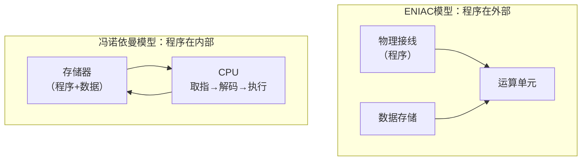
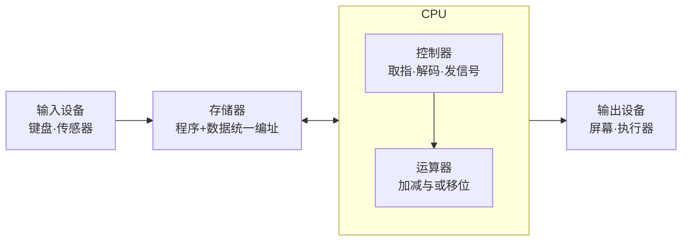
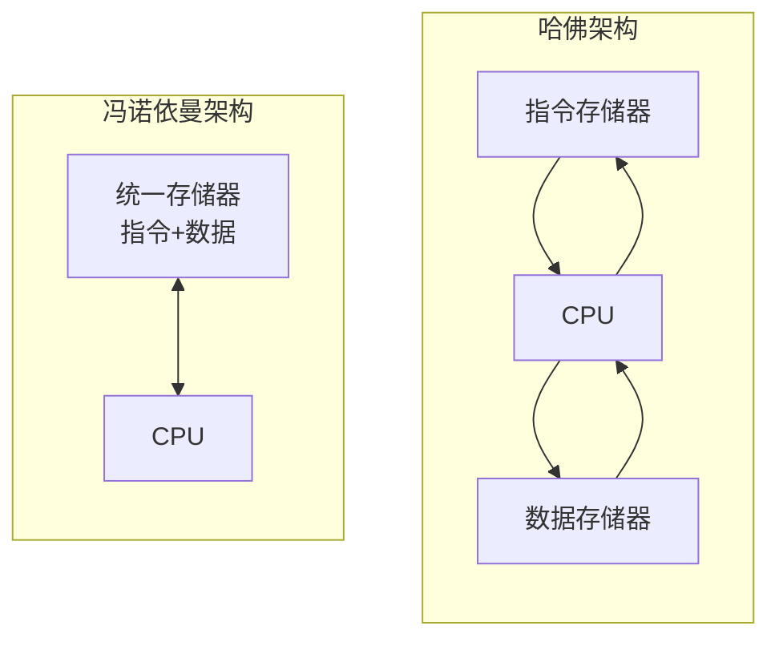
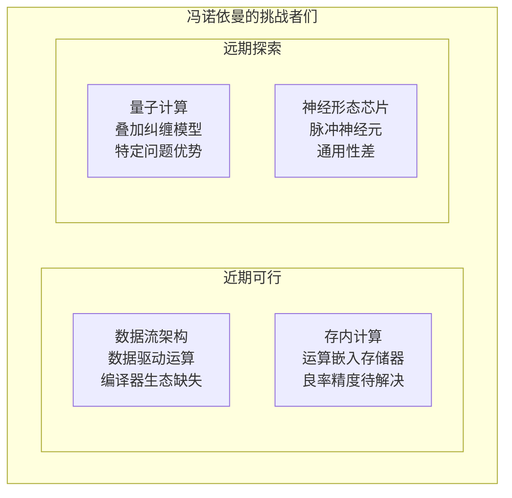

# 冯诺依曼架构：八十年来所有计算机的共同祖先

```
╔══════════════════════════════════════════════╗
║  渡劫期 · 第151篇                              ║
║  冯诺依曼架构：八十年来所有计算机的共同祖先       ║
║  存储程序·CPU内存IO三分离·瓶颈与超越             ║
║  预计阅读：14分钟                              ║
╚══════════════════════════════════════════════╝
```

1945年6月，一份草稿在摩尔学院和洛斯阿拉莫斯之间传递。草稿标题是"关于EDVAC的报告初稿"，作者署名John von Neumann。这份约100页的文档没有正式发表，却在同事间传阅，定义了此后八十年所有计算机的骨架。你手里的手机，桌上的笔记本，云端机房里的服务器，甚至火星上的探测器，骨子里跑的都是这套架构。

渡劫期不再学新法术，而是审视脚下站的地面。冯诺依曼架构就是这块地面，它为什么长这样，活了多久，瓶颈在哪，谁能取代它。

---

## 硬核主体

### 一、1945年之前：计算机是活的计算器

要理解冯诺依曼架构为什么伟大，得先看它出现之前计算机长什么样。

1945年最有名的计算机叫ENIAC（Electronic Numerical Integrator and Computer），宾夕法尼亚大学莫尔学院造的。这台机器重30吨，占满一个房间，有18000个真空管。它确实能算，但"编程"方式让你今天没法想象：你要改程序，得拔掉机器后面的电缆，重新插到别的端口上。改一次程序需要两到三天，机器跑一次只要几秒钟。

```text
ENIAC的"编程"流程：
1. 物理接线 → 2. 检查接线 → 3. 运行程序 → 4. 要改程序？回到第1步
每次改程序相当于重新造一台机器
```

ENIAC的程序员是六位女性，她们的工作是推着装满电缆的小车，在机柜之间爬进爬出插拔线缆。这六位女性有名字：Kay McNulty，Betty Jennings，Betty Snyder，Marlyn Wescoff，Fran Bilas，Ruth Lichterman。但历史很长一段时期只称她们为"ENIAC女孩"。

ENIAC的源头问题在于：程序不存在机器内部，存在于物理接线的拓扑结构里。数据在机器内部，程序在机器外部。每次换程序等于重建硬件。

### 二、冯诺依曼的天才一笔：程序也是数据

冯诺依曼在那份火车草稿里提出的想法，用一句话概括：程序和数据放在同一个存储器里，机器自己读取程序并执行。

这个想法在今天看来理所当然，但在1945年是个转变。它意味着你不再需要拔线改程序，只要往存储器里写不同的指令序列，同一台机器就能做不同的事。程序变成了可以用处理数据的方式去处理的东西。



冯诺依曼架构的五个部件，此后所有计算机都没逃出这个框架：

```text
1. 运算器（ALU）：做加减与或的逻辑运算
2. 控制器（CU）：取指令，解码，发控制信号
3. 存储器（Memory）：存程序和数据，统一编址
4. 输入设备：键盘，鼠标，传感器
5. 输出设备：屏幕，打印机，执行器

运算器+控制器 = CPU
```

这五个部件的关系画出来就是教科书上那张经典图。存储器存了程序和数据，CPU从存储器取指令，解码后执行，结果写回存储器或送到输出设备。输入设备把外部信息送进存储器，输出设备把计算结果送到外部。



### 三、为什么是统一存储器而不是分开

冯诺依曼架构有一个重要设计决策：程序和数据共用一个存储器，统一编址。这意味着CPU可以通过同一个地址总线访问指令和数据，硬件设计更简单。

这个选择有历史原因。1945年的存储器是汞延迟线或磁鼓，又贵又少。ENIAC有20个累加器当存储器，每个累加器10位十进制数，总容量大约200个十进制数字。EDVAC的设计目标是1024个32位字，在当时已经算奢侈。如果给程序和数据各配一套存储器，成本翻倍，工程上不现实。

统一存储器的代价是"冯诺依曼瓶颈"：CPU要取指令就要访存，要取数据也要访存，两者抢同一条总线。CPU的速度在1945年约几kHz，今天是几GHz，存储器速度只涨了几百倍，两者之间差了好几个数量级。

```text
速度差距（数量级）：
- 1945年 CPU：~100kHz    内存：~100kHz    差距约1倍
- 1980年 CPU：~10MHz     内存：~1MHz      差距约10倍
- 2025年 CPU：~5GHz      内存：DDR5有效速率约3-6GHz  差距约5-50倍（取决于缓存命中）
```

这个差距就是为什么你的CPU需要L1/L2/L3三级缓存。缓存的作用是：既然存储器跟不上CPU，就在中间加几层小的快速存储器，把常用指令和数据预取过来。如果缓存命中率低，CPU就闲着等内存，性能直接暴跌。今天所有程序员做性能调优的功夫，说到底都在跟冯诺依曼瓶颈斗。

### 四、哈佛架构：另一种选择

冯诺依曼架构不是唯一选择。哈佛架构把指令存储器和数据存储器分开，各有各的总线。CPU可以同时取指令和取数据，不需要抢总线。



哈佛架构的好处是带宽翻倍，坏处是硬件复杂。你手机里的ARM Cortex-A芯片，CPU内部用哈佛架构（L1指令缓存和L1数据缓存分开），但到L2缓存和主存又变成冯诺依曼式的统一编址。这是工程上的折中：CPU内部追求速度，用哈佛；外部追求简单和灵活，用冯诺依曼。

DSP和微控制器更多用哈佛架构。比如ATmega328（Arduino Uno的芯片）就是改良哈佛架构，Flash存指令，SRAM存数据，各有各的地址空间。原因是嵌入式用途下指令和数据天然分离，程序烧进Flash不怎么变，数据在SRAM里频繁读写，分开反而高效。

### 五、冯诺依曼瓶颈之外：三道墙

冯诺依曼架构活了八十年，不是因为它完美，是因为替代方案的成本太高。但它面临的压力不止存储瓶颈一道墙。

第一道墙是功耗墙。冯诺依曼架构下，数据在存储器和CPU之间来回搬运，每次搬运都耗电。一个32位整数乘法运算本身大约消耗几个pJ的能量，但数据在DRAM和CPU之间来回一趟，搬运成本是运算的上千倍。你手机发热耗电，大头不是CPU在算，是数据在搬。

```text
能量消耗对比（约值，来源Mark Horowitz 2014 ISQED）：
- 8位整数加法：约0.3 pJ（运算）
- 32位整数乘法：约3-10 pJ（运算）
- L1缓存读取：约1 pJ
- L2缓存读取：约4 pJ
- L3缓存读取：约10 pJ
- DRAM读取：约1300 pJ（搬运）
差距：运算几pJ vs 搬运上千pJ，搬运成本是运算的千倍量级
```

第二道墙是串行执行墙。冯诺依曼架构的执行模型是串行的：取一条指令，解码，执行，再取下一条。虽然现代CPU用流水线和乱序执行把它包装得像是并行的，但程序计数器只有一个，执行逻辑在微观层面仍然是串行的。多核是宏观并行，每个核内部还是冯诺依曼式的串行。

第三道墙是语义墙。冯诺依曼架构的指令集是面向数值运算的，加法减法乘法移位，这些指令操作的是数字。但今天越来越多的计算是模式识别，概率推理，神经网络，这些计算的数据结构是张量。你要用冯诺依曼架构的标量指令去模拟张量运算，效率极低。GPU和NPU的出现，就是因为冯诺依曼架构处理这类计算不经济。

### 六、谁能取代冯诺依曼

讲了这么多瓶颈，冯诺依曼架构会不会被取代？短期内不会。长期看，有几条路径在试探。

数据流架构（Dataflow Architecture）取消程序计数器，让数据到达就触发运算，不搬运数据，运算走向数据。MIT在2010年代有多个数据流相关的探索项目。问题是编译器和软件配套完全要重写，没有现成程序能跑。

存内计算（Processing-in-Memory）把运算单元做到存储器内部，数据不用搬出来就能算。三星和台积电在SRAM和ReRAM上做过原型，但良率太低，精度不如数字电路，目前还在实验室阶段。

量子计算用了完全不同的计算方式，量子比特的叠加和纠缠。它不是冯诺依曼架构的升级版，是另一条赛道。但量子计算只对特定问题（因子分解，搜索，量子模拟）有优势，不会取代通用计算。

神经形态芯片（如Intel Loihi，IBM TrueNorth）用脉冲神经网络，模仿大脑神经元的工作方式。架构上跟冯诺依曼完全不同，没有传统意义的程序计数器和存储器。但目前只能做特定类型的推理，通用性极差。



八十年了，冯诺依曼架构还活着，活着的原因不是技术惯性，是它的设计在"通用性"和"实现成本"之间找到了一个极其稳定的平衡点。任何替代方案要取代它，不只是技术上超越，还要在软件配套，编译器工具链，程序员习惯上重建一整套体系。这个壁垒比技术壁垒更高。

---

## 修仙术语对照表

| 修仙术语 | 技术现实 | 本篇位置 |
|---------|---------|---------|
| 渡劫期 | 行业视角，审视技术底座 | 全篇定位 |
| 天道法则 | 冯诺依曼架构，计算机的基本范式 | 引入段 |
| 法术背后的法则 | 架构设计原理而非具体用法 | 引入段 |
| 灵脉 | 存储器总线，数据和指令的通道 | 第三段 |
| 瓶颈 | 冯诺依曼瓶颈，存储器带宽不够 | 第三段 |
| 三道墙 | 功耗墙，串行执行墙，语义墙 | 第五段 |
| 搬运灵力 | 数据在存储器和CPU之间传输 | 第五段 |
| 串行修炼 | 程序计数器串行取指执行 | 第五段 |
| 标量法术 | 冯诺依曼指令集面向数值运算 | 第五段 |
| 张量法术 | GPU/NPU处理张量运算 | 第五段 |
| 分身术 | 多核并行，每个核仍串行 | 第五段 |
| 替代功法 | 数据流/存内计算/量子/神经形态 | 第六段 |
| 配套壁垒 | 软件工具链和程序员习惯的积累 | 第六段 |
| 修炼惯性 | 技术路径依赖，旧架构的存活原因 | 结尾段 |

---

## 突破条件

- [ ] 能画出冯诺依曼架构五部件的关系图，不看资料
- [ ] 能解释为什么ENIAC改程序要拔线，冯诺依曼架构怎么解决的
- [ ] 能说清冯诺依曼瓶颈是什么，为什么会有三级缓存
- [ ] 能对比冯诺依曼架构和哈佛架构的优劣，举出各自适用场景
- [ ] 能说出冯诺依曼架构面临的三道墙分别是什么
- [ ] 能列举至少两种替代架构，说清它们各自卡在哪
- [ ] 能解释"程序也是数据"这个想法为什么改变了计算机设计

这些问题想清楚了，下一篇我们往更深处走。冯诺依曼架构解决了"怎么算"的问题，但有些问题就是算不出来。下一篇讲图灵机和停机问题，看计算机的能力边界在哪。

---

## 下期预告

下一篇：**图灵机——为什么有些问题计算机永远解不了**

冯诺依曼定义了计算机的骨架，图灵定义了计算机的边界。同样是在1936年，图灵写了一篇论文，造了一台想象的机器，然后证明这台机器有一个永远解不了的问题。这个问题叫停机问题。下一篇讲图灵机怎么工作，为什么停机问题不可判定，这对程序员意味着什么。

你觉得一台计算机有什么事是永远做不到的？欢迎评论区聊聊。

我是玄芯散人，带你从炼气修到大乘。

---

*本文是「码农修仙传」系列第151篇。系列导航见 [xren.ren](https://xren.ren)*
