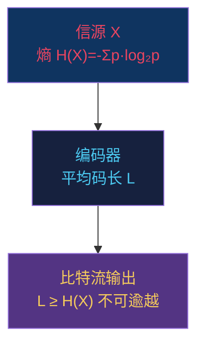
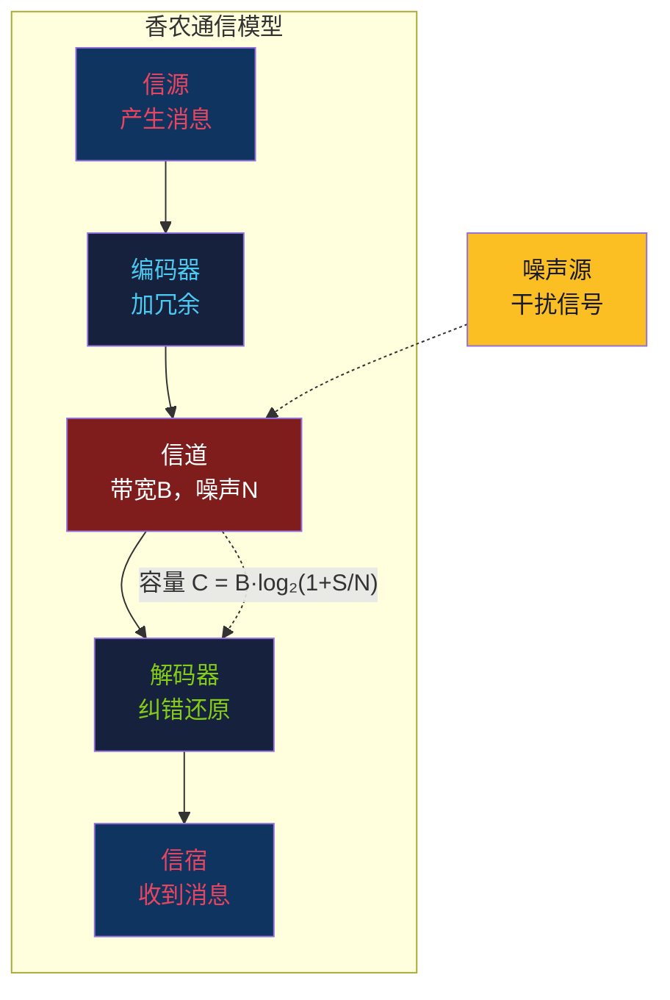

# 【渡劫·153】信息论：一比特有多大

> **码农修仙传 · 渡劫期 · 第153篇**
> 我是玄芯散人，带你从炼气修到大乘。

---

## 境界标识

```
╔══════════════════════════════════╗
║     渡劫期 · 第153篇              ║
║     信息论：一比特有多大          ║
║     预计阅读：14分钟              ║
╚══════════════════════════════════╝
```

---

## 修仙引入

你每天在手机上刷视频，发消息，看文章。运营商告诉你流量用完了，5G套餐限速到1Mbps。你骂一句一个比特能有多大。

这个问题，1948年一个32岁的贝尔实验室工程师用一篇论文回答了。他叫克劳德·香农（Claude Shannon），论文叫《通信的数学理论》（*A Mathematical Theory of Communication*）。

这篇论文之前，"信息"是个模糊的日常词汇，你没法说清楚"这条消息比那条消息多多少信息"。香农给"信息"找到了一把尺子，量出了它的精确大小。从此"比特"（bit）这个词正式登场，整个数字时代有了度量单位。

渡劫期的修炼，不是学新法术，是看透法术背后的天道法则。信息论就是这条法则：压缩有极限，传输有极限，纠错有代价。你用过的ZIP文件，5G信号，硬盘里的RAID，都在香农画好的圈子里打转。

---

## 硬核主体

### 一、什么是"信息"与不确定性的消除

先想一个问题：你朋友发来一条消息"明天太阳从东边升起"。你得到了什么信息？

几乎为零。因为你早就知道太阳从东边升起，这条消息没有消除你任何"不确定性"。

换一条："明天杭州地震了"。这条你立刻坐直了，因为地震是小概率事件，这条消息消除了巨大的不确定性。

香农的洞见就在这里：信息量等于不确定性的消除量。越不可能发生的事件，发生了之后给你带来的信息量越大。

用数学说：一个事件发生的概率为 p，它发生后携带的信息量是：

```
I(x) = -log₂(p)    （单位：比特 bit）
```

概率越低，信息量越大。p=1（必然事件），信息量=0，什么都没告诉你。p=0.5（硬币正面），信息量=1比特。p=1/8（三个二进制位的状态之一），信息量=3比特。

这个公式不是拍脑袋编的。香农证明了，满足三个自然条件的度量，只有对数形式。第一，信息量是连续函数，概率微小变化时信息量也微小变化。第二，如果事件概率不变，信息量随事件数量正比增长，抛两次硬币的不确定性是抛一次的两倍。第三，可分解性，一个复杂事件的信息量等于各子事件信息量按概率加权求和。

三条公理，唯一解就是对数。跟你写代码时把约束条件摆出来推导接口设计一样，只不过香农推导的是整个数字文明的度量衡。

### 二、信息熵与一个消息平均携带多少比特

单个事件的信息量搞定了，现在问：一个信源每次发一个消息，平均下来每个消息带多少信息？

这就是信息熵（Information Entropy）的定义：

```
H(X) = -Σ p(x) · log₂(p(x))    （对所有可能的事件x求和）
```

信息熵的物理含义：信源每次输出的平均信息量，单位比特/符号。

用Python算几个例子，你直观感受一下：

```python
import math

def entropy(probs):
    """计算信息熵 H = -sum(p * log2(p))"""
    return -sum(p * math.log2(p) for p in probs if p > 0)

# 场景1：抛一枚公平硬币（正面反面各50%）
print(f"公平硬币: {entropy([0.5, 0.5]):.2f} 比特")  # 输出 1.00

# 场景2：一枚作弊硬币（正面90%，反面10%）
print(f"作弊硬币: {entropy([0.9, 0.1]):.2f} 比特")  # 输出 0.47

# 场景3：公平骰子（6面各1/6）
print(f"公平骰子: {entropy([1/6]*6):.2f} 比特")  # 输出 2.58

# 场景4：完全确定的信源（100%出一个事件）
print(f"完全确定: {entropy([1.0]):.2f} 比特")  # 输出 0.00
```

运行结果：

```
公平硬币: 1.00 比特
作弊硬币: 0.47 比特
公平骰子: 2.58 比特
完全确定: 0.00 比特
```

几个结论值得你记住：

- 等概率分布时熵最大。公平硬币=1比特，作弊硬币只有0.47比特，因为结果更"可预测"了，不确定性少了一半多。
- 完全确定的信源熵为0。如果消息永远只有一个可能，发不发这条消息没有任何区别。
- n个等概率状态，熵=log₂(n)。8个等概率状态=3比特，256个=8比特。这就是为什么一个字节（8bit）能表示256种状态。

信息熵告诉你一件事：一个信源每次输出平均H比特的信息，你不可能用少于H比特去无损编码它。这是压缩的天花板。



这张图说的是信源编码定理：无论你用什么编码方式，平均码长不可能低于信息熵。香农1948年证明了这个下界，也证明了存在编码可以任意接近这个下界。

### 三、压缩的极限与霍夫曼编码

你用ZIP压缩文件时发生了什么？利用数据的统计规律，用更短的码字表示出现频率高的符号，用更长的码字表示出现频率低的符号。

最经典的编码是霍夫曼编码（Huffman Coding），1952年David Huffman在博士论文里提出。思路简单到精妙：

1. 统计每个符号的出现概率
2. 取概率最低的两个合并成一个新节点，概率相加
3. 重复第2步直到只剩一棵树
4. 左分支标0，右分支标1，从根到叶子的路径就是码字

```python
import heapq
from collections import Counter

def huffman_codes(data):
    """构建霍夫曼编码树"""
    freq = Counter(data)
    if len(freq) == 1:
        return {data[0]: "0"}

    # 用最小堆每次取两个概率最低的
    heap = [[freq, [sym, ""]] for sym, freq in freq.items()]
    heapq.heapify(heap)

    while len(heap) > 1:
        lo = heapq.heappop(heap)      # 概率最低
        hi = heapq.heappop(heap)      # 概率次低
        for pair in lo[1:]:            # 低频标0
            pair[1] = '0' + pair[1]
        for pair in hi[1:]:            # 高频标1
            pair[1] = '1' + pair[1]
        heapq.heappush(heap, [lo[0] + hi[0]] + lo[1:] + hi[1:])

    return dict(sorted(heap[0][1:], key=lambda p: (len(p[1]), p)))

# 测试：一段英文文本
text = "hello world"
codes = huffman_codes(text)
print("符号  频率  编码")
for sym, code in sorted(codes.items()):
    print(f"  {repr(sym)}   {text.count(sym):2d}    {code}")

original_bits = len(text) * 8  # ASCII每字符8比特
compressed_bits = sum(text.count(sym) * len(code) for sym, code in codes.items())
print(f"\n原始: {original_bits} 比特 (8-bit ASCII)")
print(f"压缩后: {compressed_bits} 比特")
print(f"压缩率: {compressed_bits/original_bits:.1%}")
```

运行结果：

```
符号  频率  编码
  ' '    1    1100
  'd'    1    1101
  'e'    1    1110
  'h'    1    1111
  'l'    3    10
  'o'    2    00
  'r'    1    010
  'w'    1    011

原始: 88 比特 (8-bit ASCII)
压缩后: 32 比特
压缩率: 36.4%
```

88比特压缩到32比特。但注意：霍夫曼编码每个符号分配整数个比特，当符号的概率不是1/2的整数次幂时，编码效率会差一点。比如某个符号概率1/3，理想码长是log₂(3)≈1.58比特，但霍夫曼只能给它2比特或1比特，有0.42比特的浪费。

算术编码（Arithmetic Coding）解决了这个问题：它把整个消息对应到一个0到1之间的小数区间，区间长度等于消息的概率。这样每个符号贡献的码长可以是小数，能无限逼近信息熵。现代压缩工具（bzip2、JPEG2000的算术编码模式）用的就是这套方案。

但无论你怎么编码，香农已经画好了天花板：平均码长不可能低于信息熵H(X)。这是数学定理，不是工程经验。

### 四、信道容量与传输的极限

压缩说的是"怎么用更少的比特表示信息"，传输说的是"怎么在有噪声的信道里可靠地传信息"。

你在5G手机上发消息，电磁波穿过空气时会被各种噪声干扰。接收端收到的信号是被噪声搅过的模拟信号，怎么可能不出错？

香农的第二条定理给出了答案：只要传输速率不超过信道容量C，就一定存在编码方式使误码率任意小。

信道容量的公式：

```
C = B · log₂(1 + S/N)
```

- C：信道容量（比特/秒），最大无差错传输速率
- B：信道带宽（Hz），能通过的频率范围
- S/N：信号噪声比（Signal-to-Noise Ratio），无量纲比值

这个公式告诉你三件事：

1. 带宽越大，容量越大。这就是为什么5G用毫米波（更高频率，更大带宽）能传更快。
2. 信噪比越高，容量越大。这就是为什么你离基站近时网速快（信号强，S/N大）。
3. 即使信噪比很低，只要不为零，容量也不为零。即使噪声很大，只要速率够低，总能可靠传输。



举个实际的数。你的5G手机在带宽100MHz、信噪比30dB（S/N=1000）的条件下，理论容量是：

```
C = 100×10⁶ × log₂(1 + 1000) ≈ 100×10⁶ × 9.97 ≈ 997 Mbps
```

约1Gbps。实际5G跑不到这个数，因为还有各种开销和实现损失，但量级是对的。4G LTE在20MHz带宽、信噪比20dB条件下理论容量约133Mbps，跟实际峰值也吻合。

香农公式给了一个硬约束：不管用什么调制方式、什么编码方案，在给定带宽和信噪比下，你不可能以超过C的速率可靠传输。5G，Wi-Fi 6，光纤通信的所有技术演进，都在逼近香农给的天花板。

### 五、纠错码与冗余对抗噪声

信道有噪声，传输会出错。怎么办？加冗余。

最朴素的冗余是重复：每个比特发三遍，接收端多数表决。发"1"变成"111"，收到"101"就判定原始是"1"。代价是传输效率降到1/3。

香农证明了只要速率低于信道容量，存在编码方式能让你同时做到高效率和低误码率。这个证明是存在性的（非构造性的），他没告诉你具体怎么编码，只告诉你"存在"。整个纠错码领域60年的发展，就是在找具体的编码方案逼近这个理论极限。

几个里程碑：

| 年份 | 编码方案 | 提出者 | 价值 |
|------|---------|--------|------|
| 1950 | 汉明码（Hamming Code） | Richard Hamming | 第一个实用的纠错码，1位纠错 |
| 1955 | 卷积码（Convolutional Code） | Peter Elias | 利用前后比特关联性纠错 |
| 1960 | BCH码和Reed-Solomon码 | Bose/Ray-Chaudhuri/Hocquenghem | 多位纠错，CD/DVD/QR码用 |
| 1993 | Turbo码 | Berrou/Glavieux/Thitimajshima | 首次逼近香农极限，3G/4G用 |
| 2008 | LDPC码重发现 | Gallager 1960提出，2008年复兴 | 5G和Wi-Fi 6采用 |

以汉明码（7,4）为例。它把4个数据比特编码成7个比特，加3个校验位。能纠正任意1位错误。

```python
import numpy as np

def hamming_encode(data):
    """(7,4)汉明码编码：4位数据→7位编码"""
    G = np.array([           # 生成表 4×7，数据位在位置3,5,6,7
        [1,1,1,0,0,0,0],
        [1,0,0,1,1,0,0],
        [0,1,0,1,0,1,0],
        [1,1,0,1,0,0,1]
    ])
    return (data @ G) % 2    # 模2乘法

def hamming_decode(received):
    """(7,4)汉明码解码：能纠正1位错误"""
    H = np.array([           # 校验表 3×7，列是1到7的二进制
        [0,0,0,1,1,1,1],
        [0,1,1,0,0,1,1],
        [1,0,1,0,1,0,1]
    ])
    syndrome = (H @ received) % 2   # 校验子
    if all(s == 0 for s in syndrome):
        return np.array([received[2], received[4], received[5], received[6]])  # 取数据位
    # 校验子转成十进制，对应出错位置
    error_pos = syndrome[0]*4 + syndrome[1]*2 + syndrome[2]*1
    received[error_pos-1] ^= 1      # 翻转错误位
    return np.array([received[2], received[4], received[5], received[6]])  # 取数据位

# 测试：编码→模拟1位翻转→解码
data = np.array([1, 0, 1, 1])
encoded = hamming_encode(data.copy())
print(f"原始数据: {data}")
print(f"编码后:   {encoded}")

# 模拟传输错误：第5位被翻转
corrupted = encoded.copy()
corrupted[4] ^= 1
print(f"收到(有错): {corrupted}")

decoded = hamming_decode(corrupted.copy())
print(f"解码后:   {decoded}")
print(f"正确恢复: {np.array_equal(decoded, data)}")
```

运行结果：

```
原始数据: [1 0 1 1]
编码后:   [0 1 1 0 0 1 1]
收到(有错): [0 1 1 0 1 1 1]
解码后:   [1 0 1 1]
正确恢复: True
```

4位数据变成了7位，多了75%的冗余，但能纠正任意1位错误。这就是纠错码的基本思路：用空间（更多比特）换可靠性（更少错误）。

现代5G用的LDPC码比汉明码复杂得多，但原理一样：在信道带宽和信噪比给定的条件下，加适当冗余，让接收端能从噪声中恢复原始数据。香农定理告诉你冗余加多少够用，具体怎么加是工程师60年来改进的方向。

### 六、信息论对工程师的价值

你在日常开发中什么时候会碰到信息论？

第一，压缩算法。你写的服务要传输大量JSON数据，gzip能压缩到原来的30%。但不可能无限压缩，因为信息熵是下界。如果数据完全随机（比如已经加密过的密文），压缩几乎无效，因为随机数据的熵已经接近最大值。

第二，网络传输。你做音视频通话，要在不稳定网络上传视频。WebRTC用FEC（前向纠错）和ARQ（自动重传）配合，在延迟和可靠性之间找平衡。纠错码加多了延迟变大，加少了丢包恢复不了。香农容量公式告诉你这条信道的理论极限在哪里。

第三，密码学。加密的不可破解性基于"密钥的不确定性"。一次性密码本（One-Time Pad）之所以信息论安全，是因为密钥的熵等于明文的熵，攻击者无法通过密文获取明文的任何信息。而AES之类的分组密码不是信息论安全的，是计算安全的，因为它们的密钥熵远小于明文熵。

第四，机器学习。交叉熵损失函数就是信息熵的变体。你训练分类模型时最小化的交叉熵，实质上是在最小化预测分布和真实分布之间的信息差异（KL散度）。信息论和深度学习的联系比你想象的深。

---

## 修仙术语对照表

| 修仙术语 | 技术现实 | 本篇位置 |
|---------|---------|---------|
| 天道法则 | 信息论三条公理 | §一 |
| 不确定性 | 信息熵 H(X) | §二 |
| 灵气浓度 | 比特（bit）信息量 I(x) | §一 |
| 压缩天花板 | 信源编码定理 L≥H(X) | §二 |
| 霍夫曼建树 | Huffman Coding编码过程 | §三 |
| 算术修炼 | 算术编码（Arithmetic Coding） | §三 |
| 灵脉宽度 | 信道带宽 B | §四 |
| 灵脉容量 | 信道容量 C=B·log₂(1+S/N) | §四 |
| 噪声干扰 | 信噪比 S/N | §四 |
| 冗余护体 | 纠错码（Error Correction Code） | §五 |
| 校验阵法 | 汉明码校验表H和校验子 | §五 |
| 香农极限 | 信道编码定理的存在性证明 | §四、§五 |
| 一次性符箓 | 一次性密码本（One-Time Pad） | §六 |
| 交叉熵修炼 | 交叉熵损失函数和KL散度 | §六 |

想查全系列术语？看[术语词典](/glossary)。

---

## 进阶条件

要从信息论（渡劫153）继续往前走，你需要：

- [ ] 能写出信息熵公式 H(X)=-Σp·log₂(p)，并解释每一项的含义
- [ ] 用Python计算至少3种分布的熵，验证"等概率时熵最大"
- [ ] 理解霍夫曼编码的构建过程，能手写一棵霍夫曼树
- [ ] 能说出香农信源编码定理：平均码长不可能低于信息熵
- [ ] 能写出信道容量公式 C=B·log₂(1+S/N)，解释带宽和信噪比各自的影响
- [ ] 理解纠错码"用冗余换可靠性"的思路，能说出汉明码(7,4)的编码原理
- [ ] 知道Turbo码和LDPC码逼近了香农极限，是5G/Wi-Fi 6的编码方案

> 达成这七项，你就理解了信息论的天道法则。压缩有极限，传输有极限，纠错有代价。下一篇我们看计算机科学另一个极限之问：P=NP。

---

## 下期预告 + 互动

> **下一篇：【渡劫·154】P=NP：计算机科学的终极之问**
>
> 香农画出了信息的极限，图灵画出了计算的边界。但还有一个更深层的问题：那些"验证答案很快"的问题，"找到答案"是不是也很快？这就是P vs NP，克雷数学研究所悬赏一百万美元的千禧年难题。
>
> 如果你能在多项式时间内解决NP完全问题，全世界密码学会在一夜之间崩塌，RSA加密也会失效。下一篇拆解这个让无数计算机科学家夜不能寐的终极之问。

现在问你：

> 🧮 **挑战题**：你的名字用ASCII编码需要多少比特？用霍夫曼编码（假设英文字母频率已知）大概能省多少？算算你的名字的"信息熵"是多少。
>
> 💬 **话题**：你做过的项目里有没有碰到"数据压缩到了极限就压不动了"的情况？评论区聊聊你的经历。

> 我是玄芯散人，带你从炼气修到大乘。

---

*本文是「码农修仙传」系列第153篇。系列导航见 [xren.ren](https://xren.ren)*
