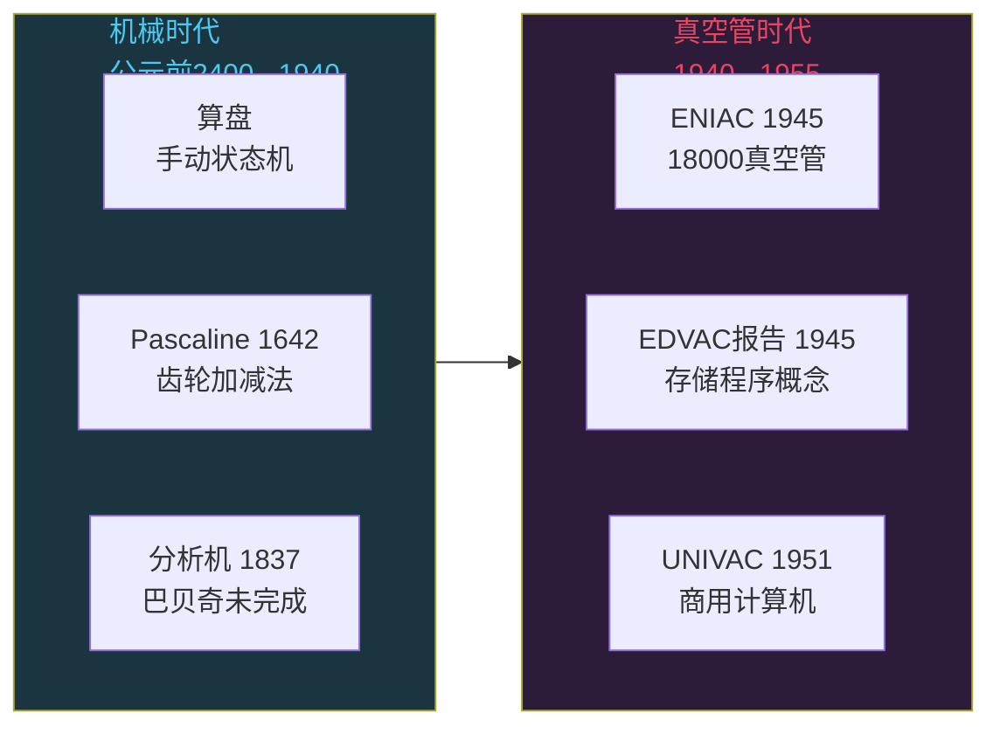
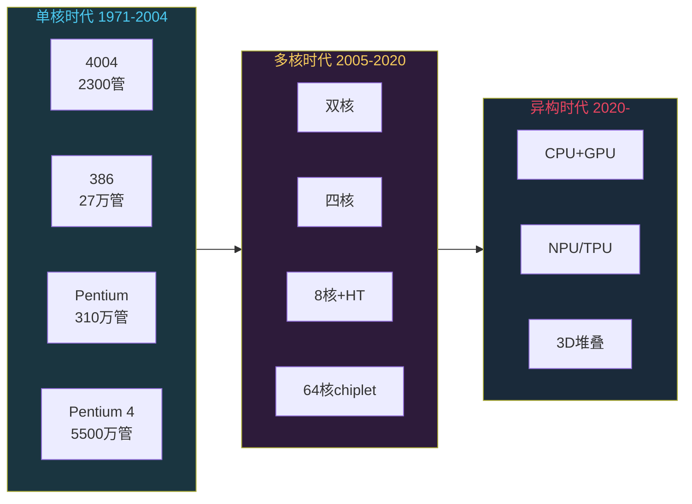
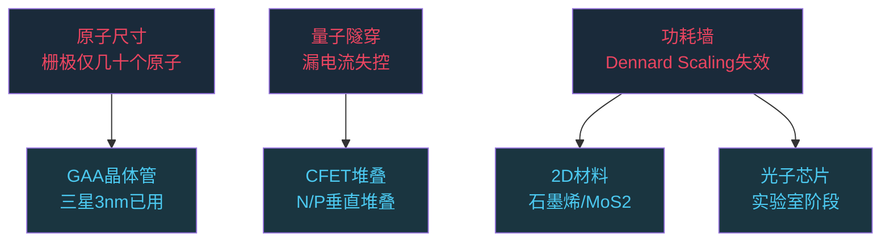

# 计算机架构演进史：算盘到量子计算八十年

```
╔══════════════════════════════════════════════╗
║  渡劫期 · 第155篇                              ║
║  计算机架构演进史：算盘到量子计算八十年           ║
║  预计阅读：15分钟                              ║
╚══════════════════════════════════════════════╝
```

算盘珠子拨了上千年，人类真正用电子计算只用了八十年。这八十年里，计算工具经历了五次大跃迁，每次跃迁都把算力上限抬高几个数量级。今天我们站在经典计算的黄昏和量子计算的黎明之间，回头看看这条路怎么走过来的，前面还有什么。

---

## 硬核主体

### 一、机械计算时代：齿轮里的算术

在电子出现之前，人类用机械装置做计算。

公元前 2400 年左右，苏美尔人发明了算盘的原型。中国的算盘在宋代基本定型，一直用到 20 世纪。算盘说到底就是一个手动状态机，每颗珠子就是一个 bit。

1642 年，帕斯卡造了第一台能做加减法的机械计算器 Pascaline。它用齿轮传动，每个齿轮代表一位十进制数。进位靠一个棘爪机构实现，原理跟今天加法器的 carry chain 一脉相承。

1673 年，莱布尼茨在 Pascaline 基础上造了 Stepped Reckoner，能做乘除法。莱布尼茨还是二进制的提出者，他在 1703 年发表的论文里描述了二进制算术。他当时纯粹出于哲学好奇，但二进制后来成了所有计算机的数学基础。

```text
机械计算时代特征：
- 计算单元：齿轮、棘轮、连杆
- 存储介质：齿轮位置（十进制）
- 输入输出：手动拨盘
- 算力上限：一次运算约 1 秒
```

到 19 世纪，巴贝奇设计了差分机和分析机。分析机的图纸里已经有了 ALU 和存储器（用打孔卡输入程序），条件分支的概念也在里面。洛芙莱斯为分析机写了第一个算法，被追认为第一位程序员。但分析机太复杂了，巴贝奇用了一辈子也没造完，零件精度达不到要求。

机械计算的物理天花板在于惯性和摩擦。齿轮要转，就有惯性延迟，磨损还会导致误差。算力想上去，必须换一种没有运动部件的开关元件。

### 二、真空管时代：ENIAC 和存储程序

1904 年弗莱明发明了真空二极管，1906 年德福雷斯特发明了真空三极管。三极管可以充当电控开关，没有运动部件，切换速度比齿轮快几百万倍。

1945 年，ENIAC 在宾夕法尼亚大学诞生。18000 个真空管，30 吨重，每秒 5000 次加法。但它不是存储程序的，换程序要手动重新接线。

1945 年冯·诺依曼写的那份 EDVAC 报告提出一个想法：程序和数据放在同一个存储器里，CPU 像读数据一样读指令。这就是存储程序概念，后来被称为冯·诺依曼架构。我们在第 151 篇讲过这个架构的五大部件。



真空管的问题在于体积太大，功耗太高，而且容易烧坏。ENIAC 平均每两天坏一根管子，散热全靠空调硬撑。工程师们很清楚：需要一种更小更可靠的开关元件来替代它。

### 三、晶体管时代：肖克利和八叛逆

1947 年 12 月 23 日，贝尔实验室的巴丁和布拉顿在肖克利的指导下发明了点接触晶体管。这是整个半导体工业的起点。

晶体管用半导体材料（硅、锗）代替了真空管，体积小一个数量级，功耗低两个数量级，可靠性高三个数量级。肖克利后来在加州山景城创办了肖克利半导体实验室，招了八个年轻工程师。1957 年这八个人因为跟肖克利合不来集体辞职，创办了仙童半导体。这八个人被肖克利称为"八叛逆"（Traitorous Eight）。

仙童半导体后来分裂出了一系列公司，包括英特尔和 AMD。整个硅谷的半导体产业，追祖溯源都能连到仙童。这段历史我们在第 094 篇讲 ARM vs RISC-V 时提过商业模式上的对比。

1958 年，基尔比在德州仪器发明了集成电路，把多个晶体管做在一块半导体基板上。1959 年，诺伊斯在仙童半导体独立发明了类似的平面工艺。从此芯片走上了摩尔定律的快车道。

```text
晶体管时代特征：
- 计算单元：双极型晶体管（BJT）
- 存储介质：磁芯存储器（Magnetic Core Memory）
- 逻辑门延迟：微秒级
- 代表机器：IBM 7090（1959），PDP-1（1959）
```

### 四、集成电路和微处理器：Intel 4004 到多核

1965 年，摩尔在《电子学》杂志上发表了一篇文章，观察到集成电路上晶体管数量大约每年翻一倍（后来修正为每 18 到 24 个月翻一倍）。这就是摩尔定律。它是一个行业预期和经济预言，被整个半导体行业当作路线图来执行。

1971 年，Intel 发布了 4004，世界上第一款商用微处理器。4004 集成了 2300 个晶体管，采用 10 微米工艺，主频 740 kHz。它能做 4 位计算，性能跟 ENIAC 相当，但只有指甲盖那么大。

之后三十年，CPU 走了一条单核频率飙升的路：

| 年份 | 处理器 | 工艺 | 晶体管数 | 主频 |
|------|--------|------|---------|------|
| 1971 | Intel 4004 | 10μm | 2,300 | 740 kHz |
| 1985 | Intel 386 | 1.5μm | 275,000 | 16 MHz |
| 1999 | Pentium III | 250nm | 9,500,000 | 500 MHz |
| 2005 | Pentium D | 90nm | 230,000,000 | 3.2 GHz |
| 2024 | AMD Ryzen 9 7950X | 5nm | 约 13.4 亿 | 5.7 GHz |

2004 年左右，单核频率撞上了功耗墙。主频上到 4 GHz 以后，散热和漏电流问题没法解决。Intel 和 AMD 同时转向多核路线，双核四核八核一路往上加。



2020 年以后，单纯堆核也不够了。AMD 的 chiplet 设计把多个小芯片拼在一起，Apple 的 M 系列用统一内存设计把 CPU 和 GPU 和 NPU 做在同一块封装里。计算方式进入了异构时代，不同的任务用不同的计算单元。CPU 负责串行逻辑，GPU 负责并行计算，NPU 负责神经网络推理。

### 五、并行计算和 GPU：图形渲染到 AI

GPU 最早只是为了渲染 3D 图形。1999 年 NVIDIA 发布 GeForce 256，世界上第一款 GPU。它的卖点是硬件 T&L（Transform and Lighting），把 3D 变换和光照计算卸载到专用硬件上。

但很快有人发现 GPU 的并行设计特别适合做通用数值计算。2007 年 NVIDIA 发布了 CUDA，让程序员能用 C 写 GPU 代码。这一步直接开启了 GPGPU（General-Purpose GPU）时代。

CPU 和 GPU 的设计哲学完全不同。CPU 追求低延迟，有大量缓存和分支预测硬件，单线程性能极强。GPU 追求高吞吐，几千个核心同时做简单计算，适合大规模并行计算这类任务。

```python
# CPU vs GPU 计算模式对比（伪代码示意）

# CPU方式：4核串行处理，一个核心做一个大任务
# 适合：分支密集、逻辑复杂、需要低延迟的任务
def cpu_compute(data):
    results = []
    for item in data:
        if item > threshold:        # 分支多，CPU擅长
            results.append(transform(item))
    return results

# GPU方式：数千核心并行，每个核心做一个简单任务
# 适合：矩阵乘法、卷积、大规模并行的任务
# CUDA kernel示意
__global__ void gpu_compute(float* data, float* output, int n) {
    int idx = blockIdx.x * blockDim.x + threadIdx.x;
    if (idx < n) {
        output[idx] = data[idx] * 0.5f + 1.0f;  // 每个核心做一样的事
    }
}
```

2012 年，AlexNet 用两块 GPU 在 ImageNet 比赛上碾压了所有传统方法，深度学习由此爆发。之后 GPU 的需求从游戏变成了 AI 训练，NVIDIA 的市值也在 2024 年冲过了 3 万亿美元。AI 需要并行算力，GPU 恰好能提供并行算力，于是 GPU 被重新发现了。

### 六、摩尔定律的黄昏

摩尔定律正在减速。物理极限有几个硬约束：

1. 原子尺寸：5nm 工艺下，晶体管栅极只有几十个硅原子宽。到了 1nm 以下，量子隧穿效应会导致漏电流失控，晶体管关不严
2. 功耗墙：Dennard Scaling 在 2005 年左右失效，晶体管变小但功耗没有等比例下降。频率上不去，散热扛不住
3. 光刻极限：EUV 光刻机波长 13.5nm，靠多重曝光做到 3nm。再往下要 High-NA EUV，单台机器 3.5 亿美元

台积电 2024 年量产 3nm，2025 年试产 2nm。Intel 和三星也在追 2nm。但 1nm 以下怎么办？业界有几条路在走：

- GAA（Gate-All-Around）晶体管：三星 3nm 已经用上，台积电 2nm 跟进。栅极包围沟道四面，比 FinFET 的三面控制更好
- CFET（Complementary FET）：把 N 型和 P 型晶体管垂直堆叠，台积电和 Intel 都在研发
- 2D 材料：用石墨烯、二硫化钼等二维材料替代硅，理论上能做到亚 1nm 沟道
- 光子芯片：用光代替电传信号，速度接近光速，功耗极低，目前还在实验室阶段



### 七、量子计算：下一个范式？

经典计算机用 bit，要么 0 要么 1。量子计算机用 qubit（量子比特），可以同时处于 0 和 1 的叠加态。

叠加态让量子计算机在处理某些特定问题时，理论上能做到经典计算机做不到的事。Shor 算法可以在多项式时间内分解大整数，RSA 加密在量子计算机面前形同虚设。Grover 算法可以在无序数据库里搜索，比经典算法快根号 N 倍。

2024 年底 Google 发布了 Willow 量子芯片，105 个物理 qubit，在量子纠错方面取得了进展：随着 qubit 数量增加，错误率反而降低了。这是量子纠错的一个里程碑，因为量子比特极不稳定，环境噪声会导致量子态退相干。

2023 年 IBM 发布了 Condor 量子处理器，1121 个物理 qubit。但物理 qubit 不等于逻辑 qubit。由于量子态太脆弱，需要多个物理 qubit 纠错编码成一个稳定的逻辑 qubit。业界估计需要大约 1000 个物理 qubit 才能组成 1 个逻辑 qubit。要跑有实际用途的 Shor 算法，需要几百个逻辑 qubit，也就是几十万到上百万物理 qubit。

```text
量子计算现状（2025年）：
- IBM Condor: 1121 物理qubit
- Google Willow: 105 物理qubit，实现错误率随规模下降
- 中国九章光量子: 光子干涉方案，专用量子计算
- 逻辑qubit估计：仍需10倍以上物理qubit做纠错编码
- 实际应用：仍在NISQ（噪声中等规模量子）阶段
```

量子计算跟经典计算是互补关系。它适合特定问题，比如大数分解、量子模拟，或者组合优化。你不会用量子计算机做文档编辑或刷网页。量子计算单元（QPU）会像 GPU 补充 CPU 一样，补充现有的计算手段。

### 八、计算的尽头是什么

回顾这八十年，计算的演进有一个清晰的主线：每次天花板撞上以后，业界会换一个方向继续走。

机械计算的极限是惯性，于是换了电。真空管的极限是体积和可靠性，于是换了晶体管。单核频率的极限是功耗，于是换了多核。CPU 并行的极限是设计复杂度，于是换了 GPU。硅工艺的极限是原子尺寸，接下来可能是光子，可能是量子，也可能是什么我们还没想到的东西。

```python
# 计算演进的简化模型
# 每次撞墙都是一次"换轨道"

transitions = [
    ("机械→电子",   "齿轮惯性",      "电信号开关",     "ENIAC 1945"),
    ("真空管→晶体管", "体积/可靠性",   "半导体P-N结",   "Bell Labs 1947"),
    ("晶体管→IC",    "手工焊接",      "光刻集成",       "Kilby 1958"),
    ("单核→多核",    "功耗墙",        "并行设计",       "2005"),
    ("CPU→GPU",     "串行瓶颈",      "大规模并行",     "CUDA 2007"),
    ("硅→?",        "原子/量子隧穿",  "GAA/2D/光子/量子", "进行中"),
]

for shift, limit, solution, era in transitions:
    print(f"{era}: {shift}")
    print(f"  撞墙: {limit}")
    print(f"  解法: {solution}")
    print()
```

这个模式对个人技术成长也适用。你在某个层级修炼到头了，继续死磕同一个方向收益递减，换一个层级重新开始反而能看到新的天地。炼气期写代码写到了天花板，往筑基期学 CS 基础。筑基期概念学够了，往金丹期看系统原理。每次换层级都是一次痛苦的范式转换，但也是真正的成长发生的地方。

---

## 修仙术语对照表

| 修仙术语 | 技术现实 | 本篇位置 |
|---------|---------|---------|
| 算盘/齿轮 | 机械计算时代的计算工具 | 第一节 |
| 天机阁换功法 | ENIAC手动重新接线换程序 | 第二节 |
| 存储程序概念 | 冯·诺依曼架构，程序和数据同库 | 第二节 |
| 蛮荒时代 | 真空管时代，ENIAC 1945 | 第二节 |
| 肖克利半导体 | 半导体工业起点，1947晶体管 | 第三节 |
| 八叛逆 | 仙童半导体创始人，硅谷半导体源头 | 第三节 |
| 摩尔定律 | 集成电路晶体管数量每18-24月翻倍 | 第四节 |
| 功耗墙 | Dennard Scaling失效，频率撞墙 | 第四节 |
| 灵脉分叉 | 单核到多核再到异构计算 | 第四节 |
| chiplet拼装 | AMD多芯片封装架构 | 第四节 |
| 吞吐vs延迟 | GPU并行高吞吐，CPU串行低延迟 | 第五节 |
| 原子尺寸极限 | 5nm以下栅极仅几十个硅原子 | 第六节 |
| 量子隧穿 | 晶体管漏电流，关不严 | 第六节 |
| 换轨道 | 计算范式的跃迁 | 第八节 |
| 范式转换 | 个人技术层级的跃迁 | 第八节 |

---

## 进阶条件

- [ ] 能说清楚机械计算、真空管、晶体管、集成电路四个时代各自撞上了什么天花板
- [ ] 能解释为什么 2005 年前后 CPU 转向多核路线
- [ ] 理解 CPU 和 GPU 在设计哲学上的差异（延迟 vs 吞吐）
- [ ] 能说出摩尔定律减速的三个物理原因
- [ ] 知道 GAA、CFET、2D 材料这些后硅时代技术各自解决什么问题
- [ ] 能解释物理 qubit 和逻辑 qubit 的区别，为什么需要纠错编码
- [ ] 理解量子计算跟经典计算是互补关系而非替代
- [ ] 能看出计算演进中"撞墙→换方向"的规律，并联系自己的技术成长路径

下一篇我们聊聊摩尔定律的终结到底意味着什么，芯片工艺的天花板在哪，3nm 之后人类还能不能继续把晶体管做小。

---

## 下期预告 + 互动

下一篇：摩尔定律的终结：芯片工艺的天花板

芯片工艺节点一路冲到 3nm、2nm，但物理世界有极限。硅原子直径大概 0.2 纳米，你不可能把晶体管做到比原子还小。摩尔定律死了没有？3nm 之后还有什么招？台积电和 Intel 的工艺路线图到底在拼什么？

讨论：你觉得量子计算会在 2030 年前实现有商业价值的进展吗？还是觉得它更像可控核聚变，永远差五十年？

我是玄芯散人，带你修到大乘。

---

*本文是「码农修仙传」系列第155篇。系列导航见 [xren.ren](https://xren.ren)*
