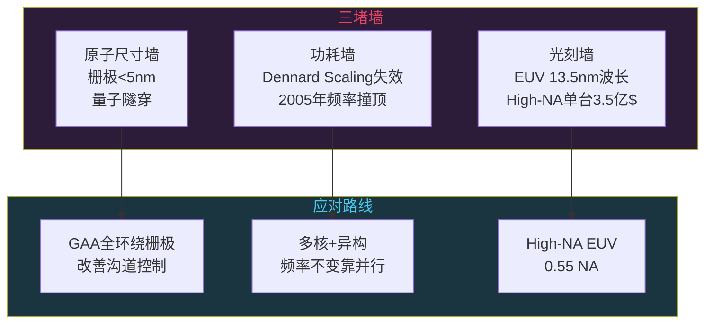
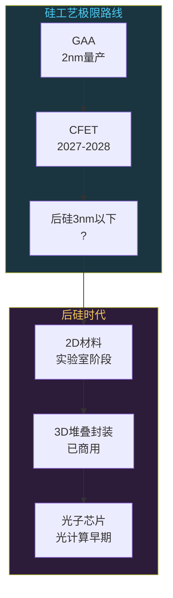

# 摩尔定律的终结：芯片工艺的天花板在哪

```
╔══════════════════════════════════════════════╗
║  渡劫期 · 第156篇                              ║
║  摩尔定律的终结：芯片工艺的天花板在哪             ║
║  预计阅读：12分钟                              ║
╚══════════════════════════════════════════════╝
```

1965年戈登·摩尔在《电子学》杂志上画了一条线，说集成电路上晶体管数量每18到24个月翻一倍。六十年过去了，这条线从10微米画到3纳米，芯片行业把它当铁律来执行。但硅原子直径只有0.2纳米，你不可能把晶体管做到比原子还小。物理世界有极限，摩尔定律到底还活着没有，3纳米之后还有什么招，这是整条芯片产业链都在焦虑的问题。

---

## 硬核主体

### 一、摩尔定律到底是什么

很多人以为摩尔定律是一条物理定律，其实不是。它是摩尔1965年观察到的行业走向，后来被整个半导体工业当成路线图来执行。原文说的是"每18到24个月，集成电路上晶体管数量翻一倍，同时单位成本下降"。

这里有两个要素：晶体管变多，单个晶体管变便宜。第二个要素经常被忽略，但它才是摩尔定律的经济学含义。如果晶体管翻倍但成本也翻倍，那只是技术进步，不是摩尔定律。真正的摩尔定律意味着你花同样的钱，每两年能买到两倍的算力。

台积电、Intel、三星这几家代工厂的整个研发节奏，都是按这个路线图在跑。每个工艺节点的研发周期大约两到三年，刚好卡在摩尔定律的翻倍节奏上。一条新产线投资200亿美元，如果晶体管密度不能翻倍，投资回报就撑不住。所以摩尔定律不只是观察，它已经变成了行业的生存节奏。

```text
摩尔定律的两个承诺：
1. 密度翻倍：每18-24个月，单位面积晶体管数量翻一倍
2. 成本下降：单个晶体管制造成本等比例下降

失效信号：
- 密度还在涨，但成本下降变慢了
- 每个节点的研发投入指数级增长
- 良率爬坡周期越来越长
```

### 二、三堵墙：物理极限在哪

摩尔定律减速不是某一个问题导致的，是三堵墙同时压过来。

第一堵墙叫原子尺寸墙。5纳米工艺下，晶体管栅极长度大约20到30纳米，只有几十个硅原子排在一起那么宽。到了2纳米以下，栅极宽度不到10个原子的距离。硅原子之间距离约0.235纳米，你没法切半个原子出来。更要命的是量子隧穿效应，电子会直接穿过薄到极限的绝缘层，晶体管关不严，漏电流飙升。

```text
尺寸参考：
- 硅原子直径：约0.2纳米
- 硅晶格常数：0.543纳米
- 3nm工艺栅极长度：约20-30纳米
- 2nm工艺栅极长度：约12-15纳米
- 物理极限估算：栅极<5纳米时隧穿效应严重
```

第二堵墙叫功耗墙。1974年罗伯特·登纳德提出了Dennard Scaling：晶体管尺寸缩小，电压和电流等比例下降，功率密度保持不变。这意味着你可以在同样面积的芯片上塞更多晶体管，频率也跟着上去，但散热压力不变。

这个规律在2005年左右失效了。晶体管继续缩小，但漏电流没有等比例下降，工作电压也降不下去了。频率冲到4 GHz以后，一块CPU的热密度比一个电炉还高。Intel在2004年取消4 GHz Pentium 4计划，就是因为功耗墙撞上了。此后CPU频率基本停在3到5 GHz，再也没有单核频率翻倍的好事了。

第三堵墙叫光刻墙。芯片是用光刻机把电路图刻在硅片上的，刻的精度取决于光源波长。ASML的EUV光刻机用13.5纳米极紫外光，靠多重曝光做到3纳米。再往下到1纳米级别，需要High-NA EUV，数值孔径提到0.55，单台机器售价3.5亿美元。全地球只有ASML能造EUV光刻机，这是一个单点依赖。



### 三、工艺节点的数字游戏

这里有个行业黑话要说清楚。3纳米、2纳米这些数字，现在跟晶体管实际尺寸已经没有直接关系了。

早期的工艺节点确实对应栅极长度。0.13微米工艺的栅极就是130纳米，90纳米就是90纳米，名副其实。但从22纳米开始用FinFET以后，节点名称变成了营销标签。台积电的3纳米工艺，晶体管栅极长度大约20多纳米，接触栅极间距约45纳米，没有一个尺寸是3纳米。

Intel曾经提过"PPACT"的概念，说节点名称应该按性能、功耗、面积、成本、上市时间综合评价，不要只看晶体管密度。

```text
实际晶体管密度对比（百万晶体管/平方毫米）：
- 台积电N5（5nm）：约171 MTr/mm²
- 台积电N3E（3nm增强版）：约210 MTr/mm²
- Intel 3：约200 MTr/mm²
- 三星3nm GAA：未公布精确数据

注意：节点名称≠任何物理尺寸
```

### 四、FinFET到GAA：晶体管换了形状

晶体管结构这十几年变了几次。

2011年Intel在22纳米首次商用FinFET（鳍式场效应晶体管）。传统平面晶体管的栅极只从顶面控制沟道，FinFET把沟道做成一个立体的鳍形，栅极从三面包围，漏电流控制好很多。台积电和三星从16/14纳米开始也用了FinFET，之后一直用到5纳米和3纳米。

但FinFET到3纳米基本到头了。鳍太窄了，三面控制不够用，需要四面控制。这就是GAA（Gate-All-Around，全环绕栅极），把沟道做成纳米片，栅极从四面完全包围。

三星在3纳米节点率先用了GAA，但良率和密度都不理想，客户反应一般。台积电在2纳米（N2）节点切换到GAA，2025年风险量产，2026年大批量出货。Intel的20A和18A也用GAA，叫RibbonFET，是Intel内部的品牌名。

```python
# 晶体管结构演进示意（伪代码描述控制方式）

# 平面MOSFET（>22nm时代）
# 栅极从顶面1面控制沟道
gate_control = "top_only"
leakage = "高"  # 沟道离栅极远，关不严

# FinFET（22nm到3nm时代）
# 栅极从3面包围鳍形沟道
gate_control = "three_sides"
leakage = "中"  # 三面控制，比平面好很多

# GAA（2nm及以后）
# 栅极从4面完全包围纳米片沟道
gate_control = "all_around"
leakage = "低"  # 四面控制，2nm以下必须用
```

GAA之后还有CFET（互补场效应晶体管），把N型和P型晶体管垂直堆叠起来，省掉横向空间，密度再提一倍。台积电和Intel都在研发CFET，大概2027到2028年量产。这是晶体管结构的又一次大改。

### 五、后硅时代：三条技术路线

硅工艺到1纳米以下还能走多远，业界心里没底。几条后硅路线在同步推进。

路线一：2D材料。硅是三维晶体，做到几个原子厚时表面粗糙度导致迁移率严重下降。二硫化钼（MoS2）等二维材料只有一个原子层厚，理论上能做到亚1纳米沟道。2024年台积电和MIT合作发表论文，展示了用MoS2做的晶体管原型。但距离量产还远，材料生长均匀性和接触电阻问题都没解决。

路线二：3D堆叠。横向做不大了就往纵向发展。台积电的CoWoS封装把逻辑芯片和存储芯片叠在一起，Intel的Foveros把计算芯片垂直堆叠。这不算继续做小晶体管，而是用先进封装把更多功能塞进同一个封装体。AMD的3D V-Cache就是在CPU顶上叠了一层SRAM。

路线三：光子芯片。用光代替电传信号，速度接近光速，功耗低一个数量级。2023年Intel发布了集成硅光子芯片的进展，Lightmatter和Ayar Labs等创业公司也在做光互连。目前光子芯片适合做芯片间高速互连，逻辑运算还在早期。



### 六、摩尔定律死了没有

直接回答：密度维度还在延续，成本维度已经断了。

晶体管密度每两到三年还在翻倍，台积电2纳米比3纳米密度增加约15%，虽然没有翻倍但还在涨。但单个晶体管成本下降的速度慢下来了。台积电3纳米晶圆代工价格比5纳米贵25%以上，2纳米更贵。以前是同样价格买更多晶体管，现在是更多晶体管要花更多钱。

台积电创始人张忠谋在2022年说过，摩尔定律的成本效应已经死了。Intel前CEO帕特·基辛格则说摩尔定律还活着，Intel要通过先进封装和新架构延续它。两家表态不同，因为他们的工艺位置不同。台积电在最前沿，感受最深，Intel在追赶期，需要讲故事。上一篇我们聊了计算机架构八十年演进史，这篇专盯芯片工艺天花板这个问题。

对工程师来说，摩尔定律减速意味着一件事：不能再指望硬件变快了软件就不用改。过去二十年很多软件的"性能改善"其实是白嫖了CPU频率和核心数的增长。这个红利快结束了，以后要榨性能得靠软件自己。

### 七、芯片产业链的连锁反应

摩尔定律减速对产业链上下游冲击很大。

设计公司：芯片设计成本飙升。一颗5纳米芯片的流片费用约3000万美元，3纳米约5000万美元，2纳米可能超过1亿美元。小公司流不起片了，只能用成熟工艺或者找大厂合作。ARM的授权模式变得更吃香，因为大家需要可复用的IP来降低设计成本。

制造端：能做先进工艺的只有台积电和Intel以及三星，一条3纳米产线投资200亿美元。这种资本密度意味着先进工艺只能是寡头游戏。中芯国际在成熟工艺上做得很不错，但先进工艺受EUV光刻机出口管制影响。

封装端：既然单芯片做不小了，chiplet（小芯片拼装）成为新趋势。把不同工艺节点的芯片拼在同一个封装里，逻辑部分用3纳米，I/O部分用6纳米，降低整体成本。UCIe联盟定义了芯片间互连标准，主要玩家都加入了。

```text
芯片设计成本飙升趋势：
- 28nm流片：约300万美元
- 7nm流片：约3000万美元
- 5nm流片：约5400万美元
- 3nm流片：约8-10亿美元（含IP授权+EDA+验证）
- 2nm流片：预计15亿美元以上

数据来源：Marvell/Synopsys行业报告估算
```

这个方向对嵌入式工程师是好事。先进工艺太贵了，IoT和边缘设备大量用28纳米到40纳米的成熟工艺。这部分的供应链最稳定，国产替代也最容易落地。不要觉得用28纳米丢人，做产品不是做benchmark。

---

## 修仙术语对照表

| 修仙术语 | 技术现实 | 本篇位置 |
|---------|---------|---------|
| 摩尔定律 | 晶体管数量每18-24月翻倍 | 第一节 |
| 原子尺寸墙 | 栅极<5nm时量子隧穿失控 | 第二节 |
| 功耗墙 | Dennard Scaling 2005年失效 | 第二节 |
| 光刻墙 | EUV波长13.5nm的物理极限 | 第二节 |
| 节点数字游戏 | 3nm不等于栅极3nm | 第三节 |
| 鳍形阵法 | FinFET三面栅极结构 | 第四节 |
| 全环绕栅极 | GAA四面控制沟道 | 第四节 |
| 纳米片 | GAA沟道形状 | 第四节 |
| CFET垂直叠阵 | N/P型晶体管垂直堆叠 | 第四节 |
| 二维灵材 | MoS2等2D材料 | 第五节 |
| 3D叠阵封装 | CoWoS/Foveros先进封装 | 第五节 |
| 光子灵脉 | 硅光子芯片光互连 | 第五节 |
| 密度续命 | 晶体管密度仍在增长 | 第六节 |
| 成本断脉 | 单晶体管成本不再下降 | 第六节 |
| 小芯片拼装 | chiplet降低先进工艺依赖 | 第七节 |

---

## 突破条件

- [ ] 能说清楚摩尔定律的两个承诺（密度翻倍+成本下降），并解释成本维度已经断了
- [ ] 能解释Dennard Scaling是什么，为什么2005年左右失效，对CPU频率的影响
- [ ] 知道FinFET和GAA在结构上的区别（三面vs四面栅极控制）
- [ ] 能说出工艺节点名称跟实际晶体管尺寸不再对应这件事，并知道3nm栅极实际有多长
- [ ] 能列出后硅时代至少三条技术路线（2D材料、3D堆叠、光子芯片）各处于什么阶段
- [ ] 理解芯片流片成本飙升对产业链的连锁反应（设计公司、代工厂、封装厂各自面临什么）
- [ ] 能解释为什么chiplet模式在摩尔定律减速后变得要紧

下一篇我们聊聊嵌入式工程师的35岁危机到底是不是真的，技术壁垒能不能扛住年龄焦虑。

---

## 下期预告 + 互动

下一篇：嵌入式工程师35岁危机是真的吗

技术圈最大的焦虑来源之一。35岁危机有几分是真的一是假的，嵌入式方向有没有年龄护城河，转型路径该怎么选。作为在嵌入式行业从业多年的人，聊点真实的。

讨论：你身边有没有40岁以上的嵌入式工程师？他们在做什么岗位，跟30岁时有什么变化？

我是玄芯散人，带你修到大乘。

---

*本文是「码农修仙传」系列第156篇。系列导航见 [xren.ren](https://xren.ren)*
