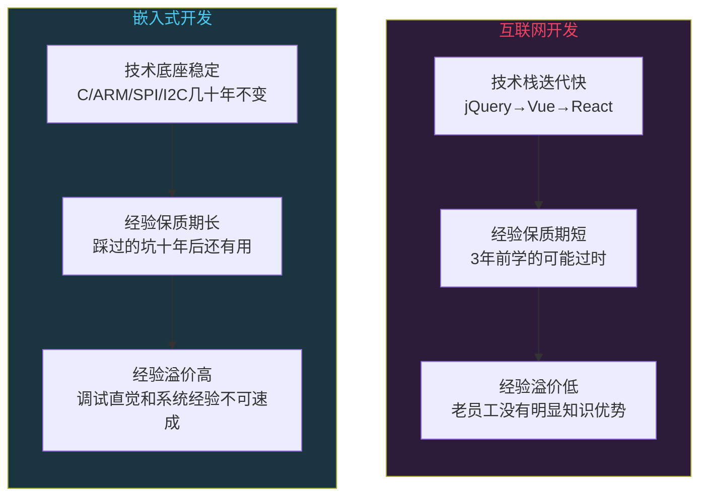
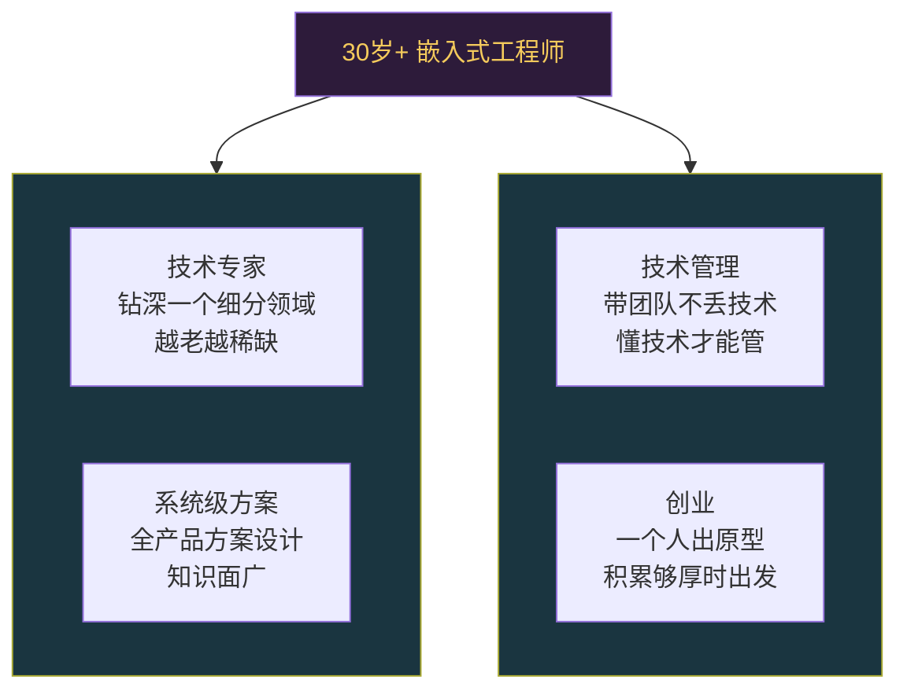

# 嵌入式工程师35岁危机是真的吗

```
╔══════════════════════════════════════════════╗
║  渡劫期 · 第159篇                              ║
║  嵌入式工程师35岁危机是真的吗                   ║
║  预计阅读：12分钟                              ║
╚══════════════════════════════════════════════╝
```

修炼到渡劫期，该直面一个问题：你修了十几年的功法，到35岁会不会被门派清退？互联网行业有个说法，程序员过了35岁就走下坡路，体力拼不过年轻人，技术被新人追上，薪资还高出一截。这个说法传了很多年，搞得技术圈人人自危。但嵌入式工程师和互联网应用开发是两个赛道，笼统地说"程序员35岁危机"会遮住很多细节。这篇就掰开了聊，35岁危机到底有几分是真的，嵌入式方向有没有年龄护城河。

---

## 硬核主体

### 一、35岁危机的来源

35岁危机不是一个凭空冒出来的焦虑。它有几个实在的源头。

第一个源头是互联网行业的高速膨胀期。2010到2020这十年，移动互联网爆发，APP开发需求激增，前端后端岗位遍地都是。大量培训班三个月速成Java，就能拿到不错的薪水。这个行业的特点是技术栈迭代极快，jQuery还没学完就换Vue了，Vue2还没用熟就出Vue3了。三年前你精通的东西，三年后可能没人用了。这种节奏下，经验积累带来的溢价很低，因为你的经验保质期短。

第二个源头是加班强度。互联网公司普遍996或者大小周，一个人35岁时体力和25岁时确实不一样。凌晨两点上线发版，年轻人第二天照常上班，35岁的人可能得缓两天。当工作强度成为衡量人员价值的要紧指标时，年龄就成了劣势。

第三个源头是薪资倒挂。互联网行业涨薪靠跳槽，一个工作十年的老员工，薪资可能比刚跳槽进来的新人还低，因为新人按市场价招进来，老员工按几年前标准涨的。公司算成本账，裁掉一个老员工招两个新人更划算。

```text
35岁危机的三个源头：
1. 技术栈迭代快 → 经验保质期短 → 经验溢价低
2. 加班强度高 → 体力成为竞争力 → 年龄劣势
3. 薪资倒挂 → 老员工成本高 → 裁老招新更划算

这三个源头都指向同一个前提：
工作的可替代性强，经验不构成壁垒。
```

### 二、嵌入式和互联网的区别

问题来了：这三个源头在嵌入式行业是不是同样成立？逐一拆解。

技术栈迭代速度。嵌入式行业的技术沉淀极其稳定。C语言五十年没变过，ARM Cortex-M内核2004年发布至今二十多年还是主流，SPI/I2C/UART这些通信协议几十年没改过。你十年前学的寄存器配置方法，今天照样用。STM32的F1系列到H7系列，外设操作方式大同小异，换个型号花两天看Datasheet就能上手。这意味着嵌入式工程师的经验保质期很长，你踩过的坑，调过的时序，积累的调试直觉，十年后依然有价值。



加班强度。嵌入式行业的加班强度普遍低于互联网。原因很简单，嵌入式产品有硬件开发周期，不是今天改代码明天上线的节奏。一块板子设计完打样寄回调试，少说两三周。固件开发跟硬件联调，节奏受物理周期约束，不可能像互联网那样每天发版。当然有些公司赶项目也会加班，但整体强度和频率比互联网低不少。这意味着体力因素在嵌入式行业的权重没那么大。

薪资倒挂。嵌入式行业的薪资整体比互联网低，这是事实。但换个角度看，低薪也意味着裁老招新的经济动力没那么强。一个工作十年的嵌入式工程师，薪资可能是一个新人的1.5到2倍，而不是互联网那种3到5倍的差距。公司算账的时候，老员工的经验能覆盖掉薪资差额，裁人动力不足。

### 三、嵌入式工程师的年龄护城河

说嵌入式有年龄护城河，不是拍脑袋安慰人的话。护城河来自几个具体且可验证的能力。

第一道护城河是硬件直觉。一个工作十年的嵌入式工程师，看过几百张原理图，调过几十块板子，手里有大量"这种电路容易出什么问题"的经验。示波器接上去看一眼波形，就能判断是电源纹波太大还是信号完整性问题。这种判断力靠大量实操积累，没有捷径，也没有培训班能速成。一个刚毕业的人再聪明，没调过几百块板子，就是没有这个直觉。

第二道护城河是系统级思维。嵌入式产品是一个软硬件结合体，传感器采集数据，经过信号调理，ADC采样，算法处理，最后通信输出。这条链路上任何一环都可能出问题。老工程师的价值在于能快速定位问题在哪一层。是硬件设计问题还是固件BUG还是通信协议处理不当？这种跨层定位能力需要对每一层都有实操经验，积累周期至少五到八年。

```c
/* 一个老工程师的调试直觉示例 */

// 现象：ADC采集数据偶尔跳变，大部分时间正常
// 新手思路：查ADC配置，查采样率，查DMA缓冲区
// 老工程师的第一反应：

// 1. 电源稳不稳？用示波器探ADC参考电压引脚
//    → 如果纹波>50mV，大概率是LDO带载能力不够
//
// 2. 模拟地和数字地有没有单点连接？
//    → 如果地平面分割不合理，数字噪声会串到模拟端
//
// 3. 采样时序有没有跟其他高速信号冲突？
//    → 如果ADC采样刚好卡在SPI通信时刻，电源瞬间跌落
//
// 这三条排查路径，不来自书本，来自踩坑。
// 一个踩过这些坑的人，十分钟定位问题。
// 没踩过的人，可能查三天。
```

第三道护城河是对认证和标准的熟悉。嵌入式产品经常要过各种认证，车规要过IATF16949，医疗要过ISO13485，工业要过CE和UL。这些标准对软硬件设计有不少约束，比如EMC指标，功能安全等级，可追溯性要求等。老工程师知道在设计阶段就该考虑这些约束，不要等认证测试才发现问题。这种知识在书本上学不到，只能靠项目积累。

### 四、哪些嵌入式岗位照样有年龄风险

说了护城河，也得聊聊另一面。不是所有叫"嵌入式"的岗位都有年龄护城河。以下几种情况，35岁危机照样存在。

第一种是纯应用层开发。你在一个嵌入式Linux平台上写Python脚本或者做APP，跟硬件完全不沾边。这种工作跟互联网应用开发没有实质区别，技术栈换了层皮而已。你的可替代性和互联网程序员一样高。

第二种是长期只做一个产品且不成长。你在一个公司做了八年，只维护同一套代码，用同样的方法解决同样的问题。八年经验实际上是一年经验重复了八遍。这种人在35岁时确实危险，年龄只是表象，停下来才是真正的风险。

第三种是不碰底层只调API。有些工程师一直用HAL库或者各种框架，从来没看过寄存器，没读过Datasheet，不理解外设底层怎么工作。这种人和互联网程序员调API没有区别，经验壁垒很低。遇到新平台新芯片就抓瞎，因为底层逻辑不懂。

```text
三种有年龄风险的嵌入式岗位：
1. 纯应用层 → 跟互联网开发无异，可替代性高
2. 重复劳动不成长 → 八年=一年×8，停在原地
3. 只调API不碰底层 → 换平台就废，经验壁垒低

判断标准很简单：
如果你做的事，一个聪明的新人三个月能学会，
你就没有年龄护城河。
```

### 五、35岁之后该怎么走

如果你现在30岁出头，在嵌入式行业，该怎么规划接下来的路。几条路径供参考。

路径一：技术专家路线。选一个细分领域钻深，比如电源管理，射频，信号完整性，电机控制，功能安全。这些领域需要大量经验积累，越老越值钱。一个做了十五年电机控制的工程师，在行业里非常稀缺，猎头会主动来找你。这条路要求你能在一个方向上持续投入，不要今天搞BLE明天搞摄像头后天搞电机，什么都碰一点但什么都不深。

路径二：系统级方案路线。不再只做单模块设计，而是负责整个产品的软硬件方案。芯片选型，方案评估，技术路线规划，成本控制，团队技术管理都要参与。这条路要求知识面广，对硬件，固件，操作系统，通信协议都有实操经验，并且有跨领域拼装的能力。系统级方案设计师是35岁以上嵌入式工程师最自然的转型方向。

路径三：技术管理路线。带团队，管项目，但不要完全丢掉技术。嵌入式行业的技术管理需要懂技术才能做决策，一个不懂技术的管理者在这个行业很难服众。做管理的同时保持对技术走向的敏感度，能跟团队讨论方案可行性，但不陷在具体代码里。

路径四：创业或自由职业。嵌入式工程师创业有一个独特优势：你可以一个人把产品做出来。硬件设计，固件开发，调试验证全链路自己搞定。互联网创业需要前后端团队，嵌入式创业一个人就能出原型。如果你有好的产品方向，35到40岁正是技术积累够厚，行业认知够深的时候。



### 六、一个在华为的嵌入式工程师的真实感受

作为在华为从业多年的嵌入式工程师，聊几句真实的。华为内部确实有年龄结构管理这件事，但不是简单粗暴的"35岁走人"。考核看的是产出和贡献，不是身份证。我身边40岁以上的技术专家和系统方案设计师不少，他们做的事情新人替代不了。

真正的风险不是年龄本身，是停止成长。如果你35岁了还在做25岁就能做的事，用着同样的方法，解决着同样难度的问题，那不管你在什么行业都危险。嵌入式行业的好处在于，只要你持续往深了走，往系统层面走，你的经验会持续增值，不会贬值。

有个判断方法挺实用：每年年终回顾一下，今年有没有做过一件自己以前做不出来的事。如果没有，你就停在了原地。停在原地不是35岁才危险，是从停止那一刻起就开始危险了。

---

## 修仙术语对照表

| 修仙术语 | 技术现实 | 本篇位置 |
|---------|---------|---------|
| 渡劫 | 35岁职业危机这个坎 | 引入段 |
| 功法保质期 | 技术栈迭代速度决定经验有效期 | 第一节 |
| 经验溢价 | 老工程师经验带来的不可替代性 | 第一节 |
| 护城河 | 嵌入式工程师的年龄壁垒来源 | 第三节 |
| 硬件直觉 | 调过几百块板子积累的判断力 | 第三节 |
| 跨层定位 | 软硬件全链路问题定位能力 | 第三节 |
| 认证心法 | IATF16949/ISO13485等行业标准经验 | 第三节 |
| 停功 | 长期不成长，经验停止积累 | 第四节 |
| 调API不练内功 | 只用HAL库不碰寄存器 | 第四节 |
| 钻深一道 | 技术专家路线选一个方向深耕 | 第五节 |
| 系统级方案 | 不再只做单模块，负责整个产品方案 | 第五节 |
| 带队不丢功法 | 技术管理保持技术敏感度 | 第五节 |
| 一人出阵 | 嵌入式创业一个人做原型 | 第五节 |
| 年终回望 | 每年检查有没有成长 | 第六节 |

---

## 进阶条件

- [ ] 能说清楚35岁危机的三个源头，并解释每个源头在嵌入式行业是否成立
- [ ] 能列出嵌入式工程师的三道年龄护城河，每道都给出具体的可验证能力
- [ ] 能判断自己当前岗位有没有年龄风险，说出判断依据
- [ ] 能区分"经验保质期长"和"重复劳动不成长"的差别
- [ ] 对自己35岁之后的路径有明确方向（技术专家/系统方案/管理/创业），知道该补什么
- [ ] 做一次年终自检：今年有没有做过一件以前做不出来的事
- [ ] 如果在做纯应用层或只调API的工作，有计划往底层或系统层面迁移

下一篇我们聊聊中国芯片突围，设计制造全产业链，卡脖子环节在哪，国产替代到了什么程度。

---

## 下期预告 + 互动

下一篇：中国芯片突围：设计制造全产业链

芯片产业链很长，设计有EDA和IP，制造有光刻和刻蚀，封测有先进封装。每个环节都可能被卡。这篇把全产业链拆开看，国产替代走到哪一步了，哪些环节真正有希望，哪些还在艰难爬坡。

讨论：你工作中用过国产芯片吗？体验怎么样，有没有踩过坑？哪些国产芯片你觉得已经能替代国外型号了？

我是玄芯散人，带你修到大乘。

---

*本文是「码农修仙传」系列第159篇。系列导航见 [xren.ren](https://xren.ren)*
