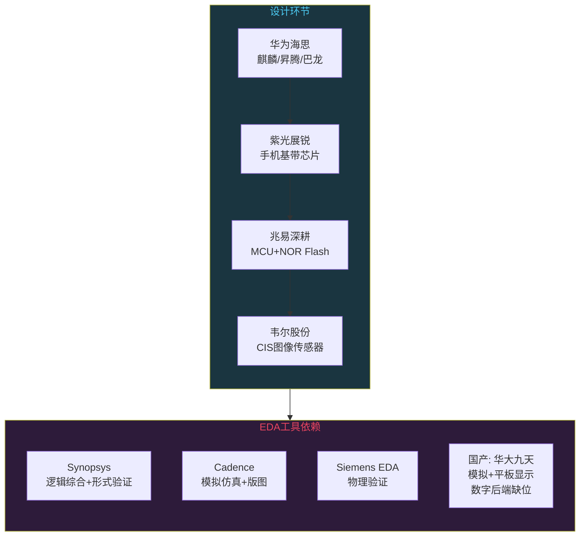
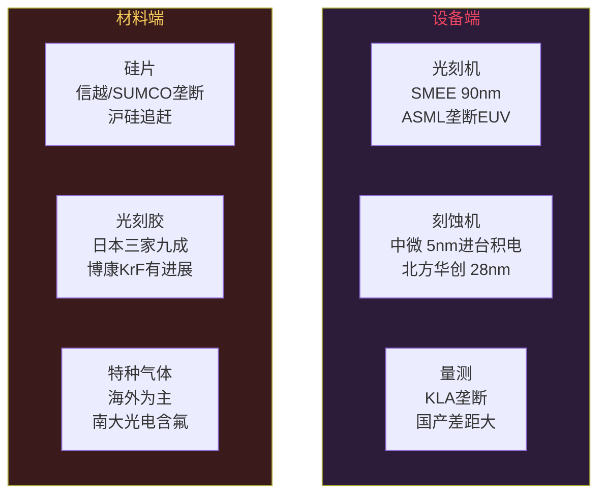

# 中国芯片突围：从设计到制造的全产业链

```
╔══════════════════════════════════════════════╗
║  渡劫期 · 第160篇                              ║
║  中国芯片突围：从设计到制造的全产业链            ║
║  预计阅读：15分钟                              ║
╚══════════════════════════════════════════════╝
```

2023年华为Mate 60 Pro拆开那一刻，里面有颗叫麒麟9000S的芯片，有人用显微镜看到上面刻着"CN"标识。这颗芯片意味着中国在先进工艺节点上撕开了一道口子。但一颗芯片从无到有要走过一条极长的产业链，光有一颗芯片还说明不了全产业链都通了。这篇就把芯片产业链从头到尾拆开看，哪个环节我们追上了，哪个环节还卡着，哪个环节可能在可见的未来都追不上。

---

## 硬核主体

### 一、芯片产业链的五个环节

一颗芯片从无到有，要经过五个大环节。设计环节产出芯片版图（GDSII文件），拿电路图纸交给工厂。制造环节把图纸刻在硅片上变成晶体管。封测环节把晶片切成裸片（die），焊到基板上加上外壳变成可用的芯片。设备和材料则是支撑前三环节的底层，光刻机刻蚀机是设备，硅片光刻胶特种气体是材料。

```text
芯片产业链五个环节：
1. 设计（Fabless）→ 产出GDSII版图文件
2. 制造（Foundry）→ 把版图刻成晶体管
3. 封测（OSAT）→ 切片焊线加外壳变成品
4. 设备 → 光刻机/刻蚀机/离子注入机/量测设备
5. 材料 → 硅片/光刻胶/特种气体/溅射靶材
```

渡劫期看产业链不是看单点进展，要看全链路的"国产化率"。一个环节追上了不算什么，五个环节都不掉链子才行。

### 二、设计环节：中国最强的环节

芯片设计是中国走得最远的一环。华为海思就是最好的例子。

海思2004年成立，最早做安防芯片和机顶盒芯片。2014年第一款麒麟910用在Mate 2上，到2019年麒麟990用在了Mate 30系列上。990这颗芯片用台积电7nm工艺集成5G基带，性能已经跟高通骁龙865打得有来有回。2020年9月美国把台积电给海思代工的路断了，海思没法在台积电生产先进工艺芯片，陷入了两年的沉寂。2023年Mate 60上的麒麟9000S回归，说明海思找到了新的制造路径。

除了海思，还有一批设计公司在各自细分领域站稳了。紫光展锐做手机基带芯片，在低端手机市场有出货量。兆易深耕MCU和存储，GD32系列在国产替代市场占有率不低。韦尔股份做CIS图像传感器，旗下豪威科技在全球手机CIS市场排第三。汇顶科技做屏下指纹芯片，一度是安卓阵营的标配。

设计环节用到的工具是EDA软件。这里卡得比较狠。全球EDA市场三家巨头，Synopsys做逻辑综合，Cadence做模拟仿真，Siemens EDA做物理验证，三家合计占70%以上份额。国内华大九天做模拟电路和平板显示EDA有一定份额，概伦电子做器件建模和电路仿真，芯和半导体做先进封装电磁仿真。但数字电路后端设计的工具链，国内几乎没有能替代的。讲直白点，芯片设计这个环节中国企业有竞争力，但设计工具还是别人的。



### 三、制造环节：最难翻过的山

制造是整个产业链技术壁垒最高的一环。把图纸变成几亿个晶体管，需要光刻机做曝光，刻蚀机做图形转移，离子注入机掺杂质，薄膜沉积设备长膜，化学机械抛光磨平表面，几十道工序串起来，每道工序的精度以纳米计。

全球代工态势清晰：台积电一家占六成份额，三星争第二，中芯国际排第三第四。台积电3nm工艺2022年量产，2nm工艺在2025年试产。中芯国际的先进工艺止步在7nm附近，用的是DUV多重曝光而不是EUV，良率和产能都跟台积电不在一个量级。

这里有个绕不开的物理事实：7nm以下工艺基本需要EUV光刻机，而EUV光刻机全世界只有荷兰ASML一家能造。ASML的EUV光刻机售价约3亿美元一台，年产量不到60台，优先供应台积电，然后是Intel和三星。美国限制了ASML向中国出口EUV光刻机，DUV光刻机也有限制。中芯国际用DUV做7nm是靠多重曝光硬挤出来的，工序更复杂导致良率偏低，单颗芯片成本也偏高。

再看成熟工艺。中芯国际在28nm及以上节点有稳定的产能，这个区间不算先进工艺但需求量大。车规芯片用28nm，工控芯片用40nm，家电和IoT用55nm甚至更老工艺。中国企业守住这个区间能活得好。

```text
制造环节格局：
- 台积电：3nm量产，2nm试产，占全球代工60%份额
- 三星：3nm GAA量产，争第二
- 中芯国际：7nm（DUV多重曝光），28nm成熟产能
- 联电/格罗方德：28nm及以上，放弃先进工艺追逐

关键卡点：
- EUV光刻机：ASML独家，对华禁运
- DUV光刻机：ASML+尼康+佳能，受限但可买
- 7nm以下几乎必须有EUV
```

### 四、封测环节：中国追得最近的环节

封测（封装和测试）是中国追得最近的一环。这一环节技术壁垒比制造低，劳动力密集度比制造高，中国企业靠规模和成本拿到了全球前列的位置。全球封测排名里，日月光投控排第一总部在台湾，长电科技常年位居前三总部在江苏，通富微电排第四第五总部在南通。长电科技2021年收购了新加坡STATS ChipPAC扩大了版图，通富微电跟AMD有长期合作做CPU封装。

先进封装是这几年的行业热点。传统封装把芯片裸片焊在基板上用金线连引脚，先进封装用倒装（flip-chip）或者晶圆级封装（WLP），更先进的是2.5D和3D封装，把多颗裸片叠在一起用硅中介层互联。台积电的CoWoS封装是做AI算力芯片不可少的一环，英伟达的H100 GPU就靠CoWoS把GPU裸片和HBM内存封在一起。国内长电科技和通富微电都在追赶2.5D/3D封装，但跟台积电还有差距。

封测环节国产化率能做到三成以上，是中国芯片产业链五个环节里国产化率最高的。但这不意味着封测可以轻视，先进封装越来越成为延续摩尔定律的手段，晶体管缩不动了就靠封法叠层来提高密度。

### 五、设备和材料：最深的水

设备和材料是产业链最深的水，也是国产化率最低的环节。

设备端看几类主要机台。光刻机前文说了，ASML垄断EUV，上海微电子（SMEE）是国内光刻机企业，能做到90nm DUV光刻机，跟ASML差距非常大。刻蚀机方面，中微公司做介质刻蚀机，在5nm刻蚀工艺上进入了台积电供应链，这是国内设备企业少有的进入台积电先进节点的案例。离子注入机方面，凯世通在做，但市场份额很小。薄膜沉积设备，北方华创做PVD/CVD，在28nm级别有产品。量测设备，精测电子和中科飞测在做，但精度跟KLA差距大。

材料端更分散。硅片方面，沪硅产业和TCL中环做12英寸硅片，但高端硅片还依赖日本信越和胜高（SUMCO）。光刻胶方面，日本JSR和东京应化以及信越占九成份额，国内徐州博康做KrF光刻胶有进展，但EUV光刻胶还是空白。特种气体方面，国内南大光电做含氟气体有进展，但很多品种还依赖进口。CMP抛光液和抛光垫，安集科技有产品但份额小。



这里最扎心的一个事实：即使中国在设计和封测做得不错，制造环节被光刻机卡住，设备和材料又是整条产业链的地基。地基不稳，上面的楼盖再高也晃。

### 六、卡脖子到底卡在哪

说了五个环节，到底哪个最卡。按"被卡了有多疼"和"追赶难度有多大"两个指标排个序。

最疼也最难追的是EUV光刻机。ASML一家独大，一台机器十万个零件，镜头来自德国蔡司，光源来自美国Cymer，激光来自德国通快。这不是一个国家能独立完成的工程，是整个西方工业几十年积累的成果。中国要独立造EUV光刻机，可以说是在跟整个西方工业赛跑。短期内看不到攻克的可能。

第二疼的是EDA工具。三家美国公司垄断高端数字EDA，芯片设计离开了这些工具链几乎没法做。中国短期靠华大九天等公司做模拟和平板显示，数字后端EDA差距可能有十年以上。

第三疼是先进制程工艺本身。就算有光刻机，把7nm以下工艺调试到可量产的良率需要大量know-how，这些know-how在台积电和三星手里是严格保密的。中芯国际用DUV做7nm已经很不容易，再往下到5nm和3nm，没有EUV几乎不可能。

```text
卡脖子排序（疼×难）：
1. EUV光刻机 → 一家独大，万级零件，最疼最难
2. EDA工具 → 三家垄断，数字后端差距十年+
3. 先进制程 → 即使有光刻机，良率know-how也是壁垒
4. 高端材料 → 光刻胶/高端硅片/特种气体
5. 量测设备 → KLA垄断，精度要求极高
```

### 七、哪些环节有真实希望

不能光说卡哪里，也得看到哪里有真实希望。

封测环节已经追上了，长电科技和通富微电都在全球前五。这个优势会保持，因为封测的技术门槛相对低，中国的成本和规模优势能发挥。

成熟制程（28nm及以上）中国有竞争力。中芯国际、华虹半导体在28nm到55nm区间有产能和技术。全球芯片需求大量集中在成熟节点，车规用28nm，工控用40nm，家电用更老工艺。中国企业守住这个区间能活得好。

设计环节中国已经证明能做出世界水平的芯片。海思麒麟就是证据。设计环节的瓶颈在EDA工具，如果EDA能攻克或者找到替代路径，设计能力会进一步释放。

RISC-V开源指令集是一个换道超车的机会。x86被Intel和AMD把持，ARM授权费贵且受制于人，RISC-V开源免费，中国企业可以基于RISC-V做自主CPU。阿里平头哥的玄铁系列已经出货，赛昉科技和芯来科技也有量产产品。下一篇会专门展开这个话题。

国产MCU和模拟芯片在替代进口。兆易深耕的GD32系列替代STM32的F1系列，在成本敏感的中低端产品上已经大规模出货。圣邦微做模拟芯片，在电源管理领域有产品。这类替代不需要最先进工艺，28nm到55nm够用，是中国企业能吃饱的市场。

### 八、一个嵌入式工程师视角的国产芯片替代

作为嵌入式工程师，在项目里用过不少国产芯片，有些真实体验。

MCU方面，GD32E230系列替代STM32F103用在低成本产品上，内核是Cortex-M23，兼容性好，价格只有STM32的一半不到。但调试时遇到过Flash擦写次数不达标的问题，Datasheet标10万次实测两万次就出错了。这种小坑在国产芯片替代中经常碰到，Datasheet标的参数有时候跟实际有差距，批量生产前必须自己验证。

模拟芯片方面，圣邦微的LDO和DC-DC在产品里用了两年，稳定性可以接受，但纹波指标跟TI的同类产品有差距，对噪声敏感的ADC采集用途得加一级LC滤波。

这个体验反映了一个普遍规律：国产芯片在"能跑"上已经追上了，在"跑稳"和"跑好"上还有距离。距离主要在一致性、可靠性和Datasheet诚实度上。这些差距不是技术原理上的，是工程积累和质量管控上的。需要时间和批量出货来磨。

---

## 修仙术语对照表

| 修仙术语 | 技术现实 | 本篇位置 |
|---------|---------|---------|
| 渡劫 | 中国芯片产业链突破封锁这个坎 | 引入段 |
| 五行阵法 | 芯片产业链五个环节 | 第一节 |
| 画符 | 芯片设计产出GDSII版图 | 第一节 |
| 炼器 | 制造环节把版图刻成晶体管 | 第一节 |
| 封印术 | 封测环节切片焊线加外壳 | 第一节 |
| 法宝 | 设备端的光刻机刻蚀机 | 第一节/五节 |
| 灵材 | 材料端硅片光刻胶特种气体 | 第一节/五节 |
| 功法碾压 | 海思麒麟设计能力追上高通 | 第二节 |
| 炼丹炉受限 | EUV光刻机禁运卡住先进制程 | 第三节 |
| 多重曝光硬挤 | DUV多重曝光做7nm代价高 | 第三节 |
| 追得最近的阵法 | 封测环节国产化率最高 | 第四节 |
| 最深的水 | 设备和材料端国产化率最低 | 第五节 |
| 卡脖子的三座山 | EUV光刻机/EDA/先进制程 | 第六节 |
| 换道超车 | RISC-V开源ISA的新路径 | 第七节 |
| 能跑跑不稳 | 国产芯片一致性和可靠性差距 | 第八节 |

---

## 进阶条件

- [ ] 能画出芯片产业链五个环节的关系，说出每个环节的产出是什么
- [ ] 能说清楚EUV光刻机为什么卡脖子，ASML的供应链有多复杂
- [ ] 知道中芯国际在什么工艺节点有竞争力，7nm是怎么做出来的
- [ ] 能列出三个以上国产芯片设计公司及其代表产品
- [ ] 了解EDA工具卡在哪，华大九天等国产EDA能做什么不能做什么
- [ ] 知道封测环节中国企业排在全球什么位置，先进封装为什么值得重视
- [ ] 在实际项目中用过至少一颗国产芯片，能说出跟国外型号的差距在哪

下一篇我们聊RISC-V，这个开源指令集怎么成为中国芯片换道超车的路径。

---

## 下期预告 + 互动

下一篇：RISC-V的机会和难题：国产芯片的新路径

RISC-V开源免费，不受任何一家公司控制。中国芯片行业把它当成绕开ARM授权的路径。平头哥做了玄铁系列，赛昉和芯来也有量产芯片。但RISC-V也有自己的问题：软件配套薄弱，高性能核还不多。这篇拆开看RISC-V到底是不是中国芯片的新路径。

讨论：你在项目中用过RISC-V芯片吗？跟ARM Cortex-M比体验怎么样？你觉得RISC-V能替代ARM吗，还是只能做些低端的 IoT 芯片？

我是玄芯散人，带你从炼气修到大乘。

---

*本文是「码农修仙传」系列第160篇。系列导航见 [xren.ren](https://xren.ren)*
