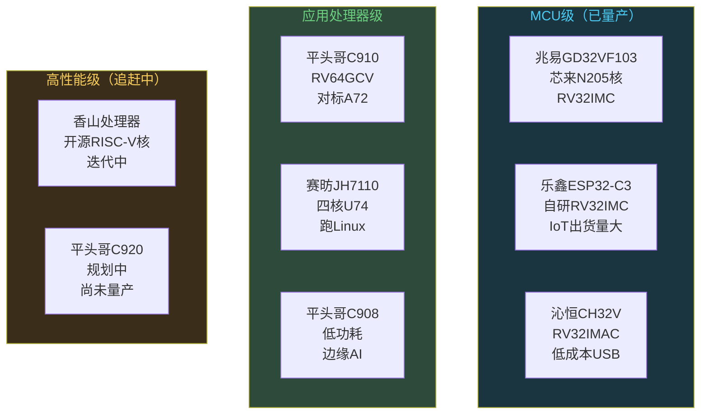

# RISC-V的机会和挑战：国产芯片的新路径

```
╔══════════════════════════════════════════════╗
║  渡劫期 · 第161篇                              ║
║  RISC-V的机会和挑战：国产芯片的新路径            ║
║  预计阅读：14分钟                              ║
╚══════════════════════════════════════════════╝
```

2019年美国把华为列入实体清单，ARM跟着发了一份声明说"遵守美国出口管制法规"。这份声明让中国芯片行业集体打了个寒颤：你用了二十年ARM的指令集，哪天人家不让你用了怎么办。RISC-V就是在这个背景下从学术圈走进产业视野的。它开源免费，不受任何一家公司控制，谁都能拿来实现芯片。但开源不等于万事大吉，RISC-V有自己的短板，能不能真的成为国产芯片的新路径，要拆开来看。

---

## 硬核主体

### 一、RISC-V为什么让中国芯片行业兴奋

RISC-V诞生于2010年的UC Berkeley，David Patterson教授团队设计了一套教学用的开源指令集。它的特点很简单：基础指令集只有四十多条指令（RV32I是47条，RV64I是53条），模块化设计，你要什么功能加什么扩展，不要的就不加。

跟ARM比，RISC-V有两个让中国芯片行业兴奋的特质。

第一个是免费。ARM授权分两档：Cortex-A系列架构授权费上千万美元，Cortex-M系列IP核授权也要几十万到上百万美元。而且每颗芯片出货还要按比例抽 royalties。RISC-V指令集本身不收一分钱，你只要不拿RISC-V商标去做商业宣传，连会员费都不用交。

第二个是不受控制。ARM是英国公司的商业产品，受英国和美国出口管制。2022年ARM要求合作方把部分技术转移给英国本土，中国客户拿到新IP核授权的时间延迟了一年多。RISC-V的指令集规范放在RISC-V International基金会托管，基金会有超过三百个会员单位，中国企业占比近一半。指令集规范是公开的，谁都可以基于规范实现自己的处理器核。

```text
RISC-V vs ARM授权模式：
- ARM架构授权：千万美元级 + 逐颗royalties
- ARM IP核授权：几十万到百万美元 + royalties
- RISC-V指令集：免费，开源规范
- RISC-V实现：自己写或者买第三方IP
```

渡劫期看技术不能只看技术本身，要看技术背后的控制权。ARM卡你脖子不需要禁运，延迟授权就够了。RISC-V不存在这个风险。

### 二、中国RISC-V芯片全景

过去几年中国的RISC-V芯片已经有量产产品了，不是PPT芯片。按用途分三类看。

MCU级别。这是RISC-V在中国落地最快的领域。兆易深耕的GD32VF系列是国产RISC-V MCU的代表，基于芯来科技的N205核，RV32IMC指令集，定位跟STM32F103对标。沁恒微的CH32V系列也是RISC-V MCU，主打低成本USB和以太网应用。乐鑫的ESP32-C3/C6用RISC-V替代了原来ESP32的Xtensa核，这颗芯片在IoT领域出货量很大。中科昊芯做电机控制RISC-V MCU，HX3202用在电机驱动上。

应用处理器级别。阿里平头哥的玄铁系列是这一档的代表。玄铁C910是RV64GCV指令集，12级流水线，支持向量扩展，性能对标ARM Cortex-A72。玄铁C908是低功耗版，面向边缘AI。平头哥还做了玄铁E902和E906两个小核，面向MCU和IoT。赛昉科技的JH7110是一颗RV64GC的SoC，四个U74核跑1.5GHz，集成了Imagination GPU，用在VisionFive开发板上能跑Linux桌面。

高性能计算级别。这是最难的领域，目前中国还没有能对标ARM Neoverse或x86服务器的RISC-V芯片。平头哥宣布过C920的规划但还没大规模量产。中科院计算所的香山处理器是开源的高性能RISC-V核，目标是逼近ARM Cortex-A76的性能，但还在迭代中。



从这张图能看出来一个规律：RISC-V在中国芯片行业的落地是自下而上的。MCU先跑通，应用处理器跟进，高性能还在追。这符合技术规律：MCU对指令集兼容性和软件配套要求低，先在低门槛领域验证可行性。

### 三、软件配套是最大的短板

RISC-V的硬件已经能做出来了，但芯片行业有句话叫"硬件好做软件难"。ARM花了二十年建起了软件配套体系，编译器，操作系统，中间件，应用层，每一层都有成熟方案。RISC-V要补的课很多。

编译器工具链。GCC和LLVM都支持RISC-V后端，这一点不用担心，编译器不是瓶颈。但调试器方面，OpenOCD对RISC-V的支持不如对ARM完善，JTAG调试偶尔会遇到断点不命中或者单步跳行的问题。平头哥开源了CDK调试器改善了体验，但在复杂项目里跟ARM的Keil MDK或IAR比还有差距。

操作系统。Linux对RISC-V的支持已经进主线内核了，Debian和Fedora都有RISC-V版本。但RT-Thread和FreeRTOS对RISC-V的移植是最近两三年的事，API稳定性和驱动数量跟ARM版本比还有距离。跑Linux没问题，跑RTOS也能跑，但你要找一个像STM32CubeMX那样图形化配置外设的工具，目前不存在。

第三方库和中间件。这是最痛的地方。你用ARM芯片，搞TensorFlow Lite Micro或者LVGL图形库，README里直接写着支持Cortex-M。换成RISC-V芯片，你可能要自己改适配层。很多闭源中间件厂商不提供RISC-V版本，因为客户太少不值得做。这形成了一个鸡生蛋蛋生鸡的循环：芯片出货少所以软件不配套，软件不配套所以芯片出货少。

```text
RISC-V软件配套成熟度：
- 编译器（GCC/LLVM）：✅ 可用
- Linux内核：✅ 主线支持
- RT-Thread/FreeRTOS：⚠️ 基本可用，驱动待补全
- 调试工具链：⚠️ OpenOCD可用但不如ARM
- 图形/ML库适配：❌ 多数需自行移植
- 闭源中间件：❌ 几乎不提供RISC-V版本
```

这个问题不是技术问题，是配套体量问题。ARM有几百亿颗出货量支撑的软件配套体系，RISC-V现在的出货量不到ARM的百分之一。差距要靠时间来磨，没有捷径。

### 四、RISC-V能替代ARM吗

这个问题要分领域回答。

MCU和IoT领域，能替代。这个层面对软件配套的要求低，裸机或者简单RTOS跑几个外设就行。GD32VF103替代STM32F103在教学中已经普及，ESP32-C3在IoT产品中出货量不低。RISC-V的精简指令集和模块化扩展在这个层面有优势，你要加一个自定义指令做加速，RISC-V允许你加，ARM不行。

应用处理器领域，部分替代。跑Linux的RISC-V SoC已经能用了，赛昉JH7110能跑Ubuntu。但性能跟ARM Cortex-A78或者苹果M系列差距很大，功耗也不占优。短期内RISC-V做不了手机和笔记本的主力芯片，但在工业网关或智能家居中枢等用途，性能要求不高，RISC-V能进去。

高性能计算和服务器领域，短期内不能替代。这个领域需要性能足够强，功耗足够低，软件配套足够全，三条都满足才行。RISC-V的高性能核还在迭代，香山处理器的性能估计在ARM Cortex-A76级别，离服务器级别的Neoverse V2差了好几代。而且服务器领域有x86的软件壁垒，不是换个指令集就能切的。

车规领域，慎重。车规芯片需要满足AEC-Q100可靠性认证和ISO 26262功能安全认证。RISC-V目前没有通过功能安全认证的实现核，ARM Cortex-R系列在这个领域有成熟方案。短期内RISC-V进不了安全关键的汽车控制领域，但在车载娱乐系统等非安全用途有可能。

```text
RISC-V替代ARM评估：
- MCU/IoT：✅ 已在替代，成本低+可定制
- 工业控制/边缘：⚠️ 部分替代，性能够用
- 手机/笔记本：❌ 短期不可能，性能和配套差太远
- 服务器：❌ 短期不可能，x86软件壁垒+性能差距
- 车规安全：❌ 功能安全认证未通过
```

RISC-V能在低性能和定制化的用途替代ARM，在高性能且强配套依赖的用途短期内做不到。

### 五、指令集扩展：RISC-V的独特优势

聊一个RISC-V相比ARM的真正技术优势：自定义指令扩展。

ARM的指令集是固定的，ARM定义什么指令你就用什么指令。你要在芯片里加一个专用加速功能，只能在处理器外面挂一个硬件加速器，通过总线和处理器通信，数据搬来搬去有延迟。

RISC-V允许你在标准指令集基础上加自定义指令。你做一个AI推理芯片，可以加几条向量运算指令直接在流水线里执行，不用走总线。你做一个密码学芯片，可以加SM2/SM3专用指令，性能比软件实现高几十倍。

平头哥在玄铁C908里加了自研的Matrix扩展指令做AI加速，性能比标准RV64GV的向量扩展高出不少。芯来科技在N系列核里支持了自定义指令接口，客户可以加专用指令做领域加速。

这个优势在领域专用芯片（Domain Specific Architecture）时代特别有意义。通用处理器性能增长放缓，未来的算力增长越来越依赖专用加速。RISC-V的开放扩展机制让芯片设计者可以针对自己的应用做定制指令，ARM做不到。

```c
// RISC-V自定义指令示例（伪代码）
// 标准RISC-V没有向量乘指令，可以扩展一条
// .insn r型指令格式定义
static inline uint32_t matmul8(uint32_t rs1, uint32_t rs2) {
    uint32_t result;
    // 自定义指令opcode=0x0B, funct2=0x01
    // 硬件实现8x8向量乘法加速
    asm volatile (
        ".insn r 0x0B, 0x01, %0, %1, %2"
        : "=r"(result) : "r"(rs1), "r"(rs2)
    );
    return result;
}
// ARM无法做到这种流水线内的自定义扩展
// 只能挂外部加速器走总线通信
```

### 六、RISC-V在中国面临的真实挑战

RISC-V不是万能药，它在中国落地有几个实实在在的挑战。

配套碎片化风险。RISC-V的模块化是优势也是隐患。每个厂商可以自由选择扩展子集，A厂商的芯片支持RV32IMAC，B厂商的支持RV32IMAC+自定义指令。软件要适配不同厂商的扩展组合，兼容性测试成本高。ARM通过严格的兼容性认证避免了这个问题，RISC-V目前没有强制兼容性认证。

人才缺口。中国懂RISC-V处理器设计的工程师不多。高校课程还在讲ARM汇编和STM32编程，RISC-V相关的教材和课程刚起步。平头哥和芯来科技在做高校推广，但培养一名能用的工程师需要几年周期。

标准演进的不确定性。RISC-V的标准还在发展。向量扩展V1.0在2021年才正式冻结，Scalar Crypto加密扩展在2022年冻结，还有不少扩展处于草案阶段。标准不稳定导致芯片实现和软件适配都面临重复劳动。你今天按某个draft实现的功能，明天标准变了要改。

地缘政治的双面性。RISC-V虽然开源，但RISC-V International的总部在瑞士，核心技术贡献者不少来自美国高校和企业。有人担心美国会不会像对待开源软件一样对RISC-V施加出口管制。目前看RISC-V指令集规范本身不受管制，但某些高性能实现可能涉及。这个风险不能完全排除。

---

## 修仙术语对照表

| 修仙术语 | 技术现实 | 本篇位置 |
|---------|---------|---------|
| 渡劫 | 中国芯片在ARM封锁压力下寻找新路径 | 引入段 |
| 开源功法 | RISC-V指令集免费公开 | 第一节 |
| 宗门控制 | ARM商业授权和出口管制风险 | 第一节 |
| 功法等级 | MCU级到高性能级三档芯片 | 第二节 |
| 自下而上修炼 | RISC-V从MCU落地向高性能追 | 第二节 |
| 软件配套体系 | 编译器到OS到中间件的全栈配套 | 第三节 |
| 鸡生蛋蛋生鸡 | 出货少导致配套少，配套少导致出货少 | 第三节 |
| 能替代不能替代 | RISC-V在不同领域的竞争力评估 | 第四节 |
| 自创招式 | RISC-V自定义指令扩展 | 第五节 |
| 领域专用修炼 | DSA领域专用芯片方向 | 第五节 |
| 配套碎片化 | RISC-V扩展子集组合导致兼容性问题 | 第六节 |
| 修炼人才缺口 | 高校RISC-V课程和人才培养滞后 | 第六节 |
| 功法还在演变 | RISC-V标准尚未完全冻结 | 第六节 |

---

## 进阶条件

- [ ] 能说清楚RISC-V免费和不受控制这两个特质为什么对中国芯片行业重要
- [ ] 能列出三个以上中国RISC-V量产芯片及其定位（MCU/应用/高性能）
- [ ] 知道RISC-V软件配套在哪些环节成熟，在哪些环节还差
- [ ] 能分领域判断RISC-V能否替代ARM（MCU/应用/服务器/车规）
- [ ] 理解RISC-V自定义指令扩展的优势，能说出跟ARM外挂加速器的区别
- [ ] 知道RISC-V在中国落地面临的三个以上实际挑战
- [ ] 在项目中用过至少一颗RISC-V芯片（如ESP32-C3或GD32VF），能说出跟ARM的体验差异

下一篇我们聊嵌入式行业的未来，从万物互联到具身智能，看看嵌入式工程师在AI时代的位置在哪里。

---

## 下期预告 + 互动

下一篇：嵌入式行业的未来：万物互联和具身智能

IoT已经不是新概念了，但边缘AI和具身智能正在打开新的空间。智能门锁，机器人手臂，传感器，决策节点，嵌入式工程师的技能在这个走向里能做什么。这篇聊嵌入式行业接下来五年的方向。

讨论：你在项目里用过RISC-V芯片吗？如果让你选，下一块开发板你会买ARM还是RISC-V的？你觉得RISC-V十年后能占多少市场份额？

我是玄芯散人，带你从炼气修到大乘。

---

*本文是「码农修仙传」系列第161篇。系列导航见 [xren.ren](https://xren.ren)*
