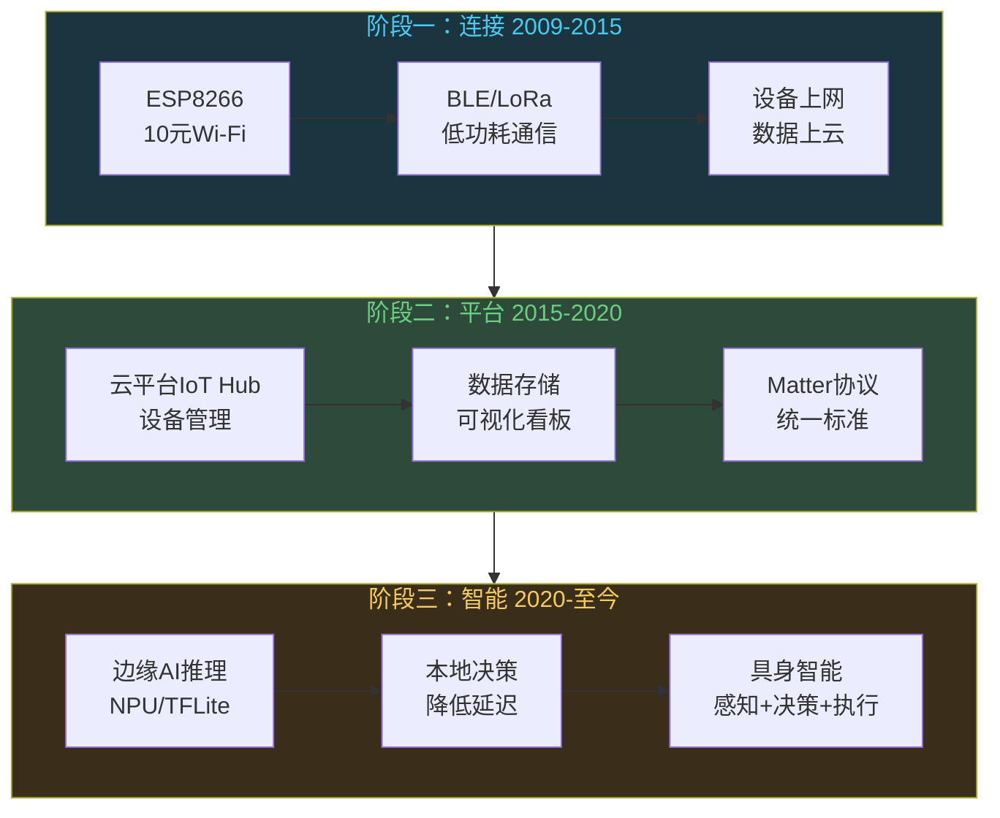
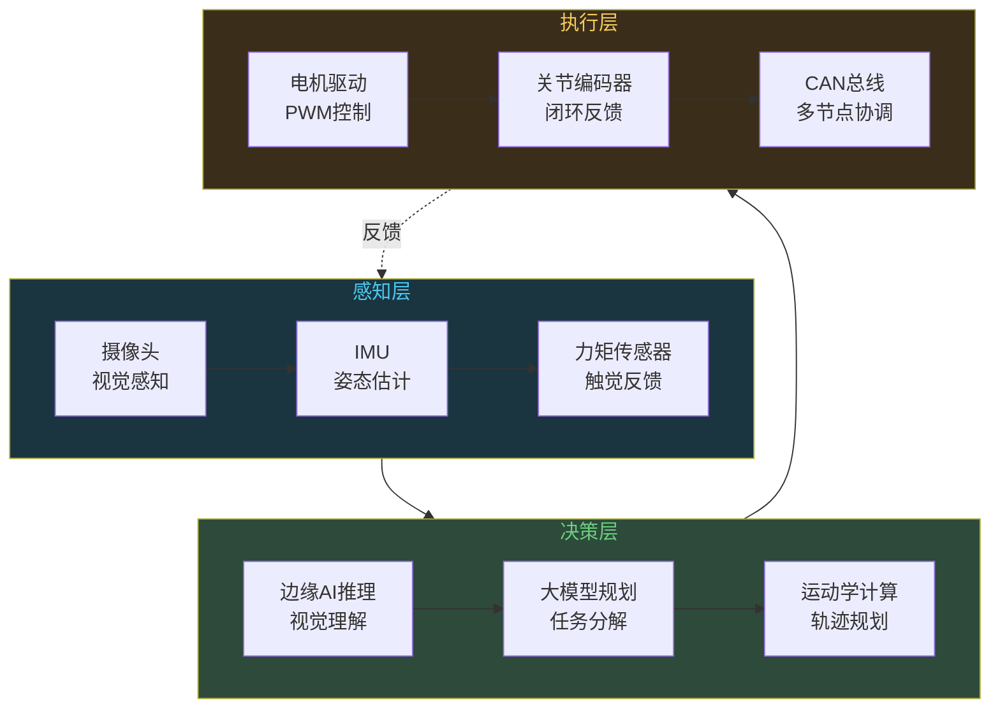

# 嵌入式行业的未来：万物互联到具身智能

```
╔══════════════════════════════════════════════╗
║  渡劫期 · 第162篇                              ║
║  嵌入式行业的未来：万物互联到具身智能            ║
║  预计阅读：13分钟                              ║
╚══════════════════════════════════════════════╝
```

2024年Figure 01机器人在宝马工厂里搬箱子的视频刷了屏，早期版本用OpenAI的大模型做视觉理解，后来Figure自研了Helix模型做推理。同一时期，深圳的智能门锁厂在纠结要不要把0.4美元的MCU换成1.2美元带NPU的芯片，好在本地跑人脸识别。这两件事看起来不在一个层面，其实指向同一个趋势：物理世界正在跟AI合流，而合流的前线就在嵌入式这边。物联网讲了十年，连接早就不是问题了。现在的问题是连上之后能干什么。具身智能给出了一种答案，让设备不但能采集数据，还能理解数据并做出决策。嵌入式工程师站在这个趋势的中心。

---

## 硬核主体

### 一、IoT的三个阶段：连接之后是什么

物联网这个行业，发展了十几年，大致经历了三个阶段。

第一阶段是连接。2009年到2015年前后，Wi-Fi模块价格跌到几块钱，蓝牙BLE普及，LoRa和NB-IoT覆盖低功耗广域场景。这个阶段的热点是把东西连上网，技术挑战在通信协议和功耗。ESP8266横空出世的时候，10块钱就能给任何设备加Wi-Fi，这是IoT爆发的起点。

第二阶段是平台。2015年到2020年，各家云厂商做IoT平台，阿里云IoT，AWS IoT，Azure IoT Hub都做设备管理。设备连上云，数据存进去，做可视化看板和简单告警。这个阶段的技术挑战在设备管理和数据存储。Matter协议在这个阶段末期出现，试图统一智能家居的碎片化标准，苹果谷歌亚马逊都加入了。

第三阶段是智能。2020年至今，设备不再只是把数据传到云上等处理，而是在本地做决策。原因是云计算的延迟和带宽成本扛不住了。一个工厂有2000个传感器，全部数据传云端做AI推理，延迟高不说，带宽费就够你喝一壶。边缘计算和边缘AI就是在这个背景下起来的，把推理放到设备端或者网关端。



三个阶段的演进有内在逻辑。连接解决了数据从哪来，平台解决了数据存哪去，智能解决了数据怎么用。前两个阶段嵌入式工程师的活就是写固件把数据送上云，第三个阶段要求嵌入式工程师懂AI推理的部署。这是一个能力要求在变宽的信号。

### 二、边缘AI：推理从云搬到端

边缘AI不是把整个大模型塞进MCU里，这做不到也没必要。边缘AI指的是在设备端或者网关端跑轻量级模型，处理特定任务。人脸识别，语音检测，缺陷检测，异常预测，这些任务的模型可以压缩到几百KB甚至几十KB。

嵌入式端跑AI推理，目前有几条技术路线。

第一条是TFLite Micro。Google把TensorFlow Lite的推理引擎移植到了MCU上，纯C++实现，不依赖操作系统，不需要动态内存分配。你把训练好的模型量化到int8，转成.tflite格式，放在几十KB的SRAM里就能跑。STM32和ESP32上都有移植。它的局限是模型小，能做关键词识别和简单图像分类，做不了复杂任务。

第二条是芯片自带NPU。ST的STM32N6集成了Neural-ART加速器，官方称约600 GOPS（int8），能在本地跑人脸检测和姿态估计。乐鑫的ESP32-S3配合esp-nn软件库利用Xtensa LX7的SIMD指令做AI加速。嘉楠科技的K210是一颗RISC-V芯片，自带KPU（神经网络处理器），算力1TOPS，用在教育机器人和门禁上。瑞芯微的RK3588有6TOPS的NPU，在边缘网关和机器人上用得多。

第三条是RISC-V向量扩展。RISC-V的V扩展提供向量指令，可以加速AI计算中大量的乘加运算。目前支持V扩展的硬件还不多，平头哥和SiFive在跟进（RISC-V的详细分析见第161篇）。这条路线的好处是指令集层面标准化，编译器可以自动向量化。

```c
// TFLite Micro在STM32上跑关键词识别的简化代码
#include "tensorflow/lite/micro/micro_interpreter.h"
#include "tensorflow/lite/micro/micro_mutable_op_resolver.h"
// 模型用int8量化，大小约18KB
// 放在STM32的Flash里，SRAM里只放推理用的张量
// 关键词识别模型，识别"开灯/关灯/停"等指令

// 分配推理用的内存池（TFLite Micro不malloc）
constexpr int kTensorArenaSize = 8 * 1024;  // 8KB足够小模型
uint8_t tensor_arena[kTensorArenaSize] __attribute__((aligned(16)));

// 解析模型，建立计算图
// MicroMutableOpResolver注册需要的算子
// FullyConnected/Reshape/Softmax三种就够了
// 一个60ms的音频帧推理耗时约30ms
// 这意味着实时关键词识别在Cortex-M4上可行
```

边缘AI对嵌入式工程师意味着什么？你不需要从头训练模型，模型是算法工程师用Python在GPU上训练好的。你的活是把模型量化压缩，部署到目标芯片上，处理内存布局和实时性约束。

### 三、具身智能：AI长出了手脚

具身智能（Embodied AI）是2023年之后热起来的概念。大语言模型让AI能理解和推理，但ChatGPT只能输出文字。具身智能让AI有了物理实体，能看见环境，能动手操作。

Figure 01机器人早期用OpenAI的视觉语言大模型做理解和规划，后来Figure自研了Helix模型，它看到桌面上的物体，能理解"把苹果递给我"这个指令，规划抓取路径，控制机械臂执行。特斯拉的Optimus机器人也是同一个思路，视觉感知加大模型推理加运动控制。

这个趋势跟嵌入式有什么关系？具身智能的硬件就是嵌入式系统的集合体。一个机器人需要几十个传感器（摄像头，IMU，力矩传感器，关节编码器），需要实时控制几十个电机，需要在本地做低延迟的视觉处理，这一切都建立在嵌入式技术的基础上。



看这张图，感知层全是嵌入式工程师的活。决策层的边缘AI推理部分也落在嵌入式端，因为视觉数据量大，全部传云端延迟太高。执行层更是传统嵌入式控制的领域。大模型负责高层规划和理解，但把它翻译成具体的电机动作，靠的是嵌入式工程师写的实时控制代码。

具身智能目前还在早期。Figure 01和Optimus是实验室和高端工业场景的产品，离消费级还有距离。但趋势已经清楚了：AI模型从云端走向边缘，从输出文字走向控制物理设备。这条路上每一个节点都需要嵌入式技术支撑。

### 四、嵌入式工程师的位置在哪

聊完趋势，回到实际问题：嵌入式工程师在AI时代的位置在哪里。分三个层面看。

设备端。这是嵌入式工程师的传统主场。传感器驱动，通信协议栈，电源管理，实时控制。不管AI怎么发展，物理世界的数据采集和执行控制都需要嵌入式。AI模型再聪明，也得有人把摄像头的数据读出来传给它，把它输出的控制指令翻译成电机驱动信号。这一层的技能壁垒很稳，十年内不会被AI替代。

边缘端。这是新增的机会。随着边缘AI芯片普及，嵌入式工程师需要掌握模型部署的能力。不是让你去训练模型，而是让你知道怎么把一个int8量化的模型部署到STM32N6的NPU上跑，怎么管理推理延迟和内存占用，怎么做模型版本更新。

系统端。当设备数量从几十台变成几万台，系统级的架构设计就是瓶颈了。设备怎么组网，数据怎么路由，边缘和云怎么协同，固件怎么远程升级，这些都是系统级问题。做这件事的人需要同时具备嵌入式和分布式系统的知识，能做到这层的人在整个行业里都不多。

```text
嵌入式工程师在AI时代的三个层面：
- 设备端（传统主场）：传感器驱动/通信协议/实时控制
  → 技能壁垒稳，10年内不会过时
- 边缘端（新增机会）：模型部署/推理优化/硬件加速
  → 人才稀缺，薪资溢价高
- 系统端（天花板高）：设备组网/边缘云协同/固件OTA
  → 需要嵌入式+分布式复合能力
```

一个判断标准：如果你现在的活是写裸机或RTOS的驱动代码，你的位置在设备端，这个位置很稳。如果你能额外学会把TFLite Micro或ONNX Runtime移植到目标芯片上跑推理，你就站在边缘端的入口了。如果你能设计一个几百个节点的IoT系统架构，搞定设备管理和数据链路，你在系统端。

### 五、行业走向要看风险

行业趋势再好也得看风险。

第一是AI泡沫风险。2023年到2025年AI投资过热，大量公司把"AI"往产品名称上贴。智能门锁加个人脸识别叫AI门锁，电饭煲加个温度曲线自适应叫AI电饭煲。这些伪AI应用泡沫退去后会剩多少真需求，不好说。嵌入式工程师要做的是在AI真正能解决问题的领域里深耕，比如工业缺陷检测，医疗可穿戴，机器人控制，而不是追概念。

第二是供应链风险。边缘AI芯片的供应链集中在少数几家。NPU IP主要来自ARM Ethos和芯原科技，高端边缘SoC依赖台积电制程。地缘政治因素可能导致某些芯片供应中断。在产品设计中考虑替代方案和备用供应商是务实的做法。

第三是技能更新压力。嵌入式工程师的传统技能栈很稳定，但AI时代要求你额外了解模型量化，推理引擎，算子调优。这些不属于传统嵌入式课程的内容。好在学习曲线没那么陡，你的C语言和硬件知识完全可以迁移过来，需要补的主要是推理框架的使用方法和量化工具的流程。

```text
三个风险和应对：
1. AI泡沫 → 在真需求场景深耕（工业/医疗/机器人）
2. 供应链 → 多方案设计（ARM/RISC-V/NPU自研）
3. 技能更新 → 补量化部署能力（C语言可迁移）
```

---

## 修仙术语对照表

| 修仙术语 | 技术现实 | 本篇位置 |
|---------|---------|---------|
| 渡劫 | 嵌入式行业在AI时代的新定位 | 引入段 |
| 万物互联 | IoT连接阶段，设备大规模联网 | 第一节 |
| 灵脉打通 | 通信协议普及，连接不再是瓶颈 | 第一节 |
| 藏经阁 | 云平台IoT Hub，数据汇聚存储 | 第一节 |
| 点灵 | 边缘AI，设备端本地做推理决策 | 第二节 |
| 道法不同 | TFLite Micro/NPU/RISC-V向量三条路线 | 第二节 |
| 法器 | 边缘AI芯片带NPU加速器 | 第二节 |
| 长出手脚 | 具身智能，AI获得物理实体 | 第三节 |
| 感知灵识 | 摄像头/IMU/力矩传感器 | 第三节 |
| 元神指挥 | 大模型规划任务，边缘端执行 | 第三节 |
| 道场 | 设备端/边缘端/系统端三个层面 | 第四节 |
| 修炼瓶颈 | 技能更新需要补AI部署知识 | 第五节 |
| 走火入魔 | AI泡沫，伪AI应用 | 第五节 |
| 法宝断供 | 芯片供应链风险 | 第五节 |

---

## 进阶条件

- [ ] 能说清楚IoT三个阶段的演进逻辑和每个阶段的技术挑战
- [ ] 知道边缘AI在MCU上跑的三条技术路线（TFLite Micro/NPU/向量扩展）
- [ ] 能解释具身智能的感知决策执行三层架构跟嵌入式系统的对应关系
- [ ] 能判断自己当前在设备端/边缘端/系统端哪个层面，知道下一步往哪走
- [ ] 了解边缘AI芯片中至少两款的NPU算力参数和应用场景
- [ ] 能说出嵌入式行业在AI时代面临的三个风险及应对思路
- [ ] 了解过至少一次模型部署流程（TFLite Micro或ONNX），知道大致步骤

下一篇我们聊技术人怎么选公司，大厂、创业公司还是外企，三条路的技术栈差异和成长路径各不相同。

---

## 下期预告 + 互动

下一篇：大厂vs创业公司vs外企：技术人怎么选

不同类型的公司对技术人的要求差异很大。大厂讲深度，创业公司讲广度，外企讲流程。这篇拆开来聊三种公司类型的利弊，给选公司或考虑跳槽的人一个参考框架。

讨论：你的工作在设备端、边缘端还是系统端？你有没有考虑过往边缘AI领域走？你觉得具身智能几年能进入消费级产品？

我是玄芯散人，带你从炼气修到大乘。

---

*本文是「码农修仙传」系列第162篇。系列导航见 [xren.ren](https://xren.ren)*
