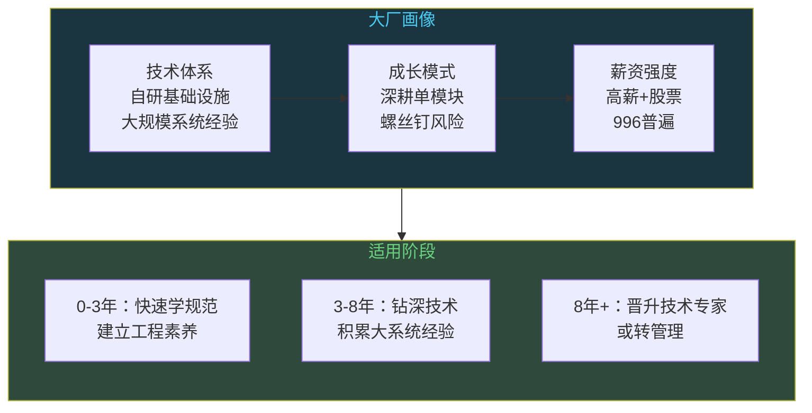
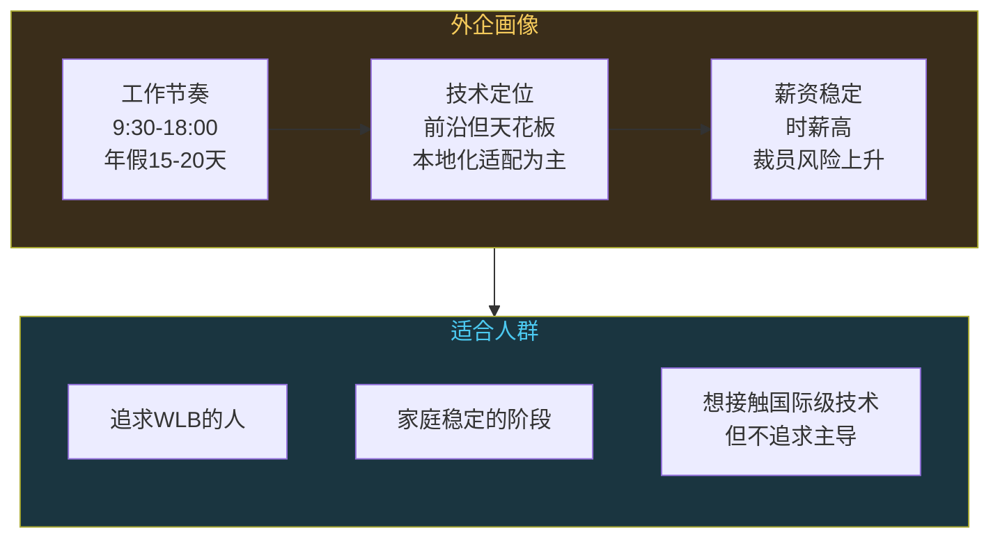
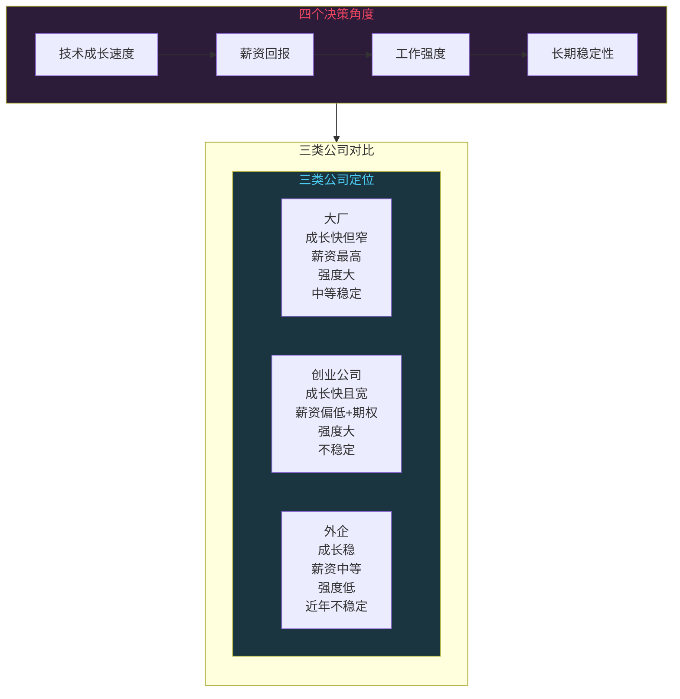

# 大厂vs创业公司vs外企：技术人怎么选

```
╔══════════════════════════════════════════════╗
║  渡劫期 · 第163篇                              ║
║  大厂vs创业公司vs外企：技术人怎么选             ║
║  预计阅读：12分钟                              ║
╚══════════════════════════════════════════════╝
```

修炼到渡劫期，该选门派了。你在技术这条路上练了十几年，功法已成，接下来去哪里修行，决定了你未来十年的成长曲线。大厂像名门正派，体系完备但规矩多。创业公司像散修联盟，生死难料但修炼自由。外企像海外仙门，待遇体面但天花板明显。这三条路不是简单的好和坏能概括的，每个人的阶段和追求不同，最优解也不同。这篇把三类公司拆开看，技术栈差异在哪，成长路径怎么走，薪资和稳定性怎么权衡。

---

## 硬核主体

### 一、大厂：名门正派的修炼体系

大厂的定义一直在变。十年前说大厂是BAT，现在加了字节跳动和美团，华为在通信和终端领域自成一体。这类公司的特点是业务规模大，技术成熟，流程规范程度高。

技术栈方面，大厂普遍有自研基础设施。阿里有飞天操作系统和自研数据库PolarDB，字节有自研RPC框架Kitex，华为有欧拉操作系统和昇腾AI计算平台。你进大厂，接触的技术深度和广度是创业公司给不了的。一个日活几亿的系统，它面对的并发量，数据量，还有容灾复杂度，只有在那种规模下才能碰到。

但大厂有个结构性问题：螺丝钉化。一个团队几百人，你负责的可能只是某个系统里的一个模块。你在这个模块里钻得很深，但对系统全貌了解有限。工作三年，你对局部理解很透彻，换到另一个模块又得从头学。这在大厂里是常态。

薪资方面，大厂的现金加股票包总包确实高。2025到2026年的行情，一线大厂应届生起薪能到30到40万年薪（含股票），资深工程师（工作五到八年）在60到100万区间，技术专家可以到150万以上。但高薪伴随高强度，996和大小周在不少团队仍然存在。另外股票有归属周期，通常四年，提前离开损失不小。



### 二、创业公司：散修联盟的自由与风险

创业公司分两种。一种是有融资的，目标明确，团队三五十人，属于成长型公司。另一种是三五个人搭伙做项目的早期团队。两种的风险和回报完全不同，不能一概而论。

技术栈方面，创业公司的特点是实用主义至上。没有自研基础设施的余力，选型全靠开源方案。Spring Boot做后端，Vue或React做前端，MySQL加Redis存数据，Docker加K8s部署，这套组合在创业公司里极其常见。嵌入式方向的创业公司，选型更务实，STM32加ESP32做主控，用FreeRTOS或者裸机，云端用阿里云IoT或者AWS IoT。你在这里不会碰到日活亿级的系统，但你会碰到从零搭建整套技术栈的经历。

成长方面，创业公司最大的价值是全栈视角。人少意味着一个人要干多个角色，后端前端都要写，硬件固件都要碰，甚至跟客户沟通需求也是你。这种经历对建立系统级思维非常有帮助。一个在大厂只做支付模块的人，跳到创业公司可能要做整个交易链路。视野一下子打开了。

但风险也很实在。创业公司三年存活率大约10%到20%，你的期权大概率变成废纸。技术成长方面也有隐患，因为没有大厂那种Code Review和工程规范，容易养成野蛮生长的习惯，代码质量和管理能力可能跟不上。

薪资方面，创业公司现金部分通常比大厂低20%到40%，但会配期权。期权是个彩票，公司上市或被收购才有价值，大部分情况下归零。所以去创业公司，现金部分要能接受，不能指着期权过日子。

```c
/* 创业公司技术选型的典型思路 */

// 嵌入式创业项目的技术栈搭建
// MCU: STM32H7系列，性能够用，生态成熟
//  RTOS: FreeRTOS，开源免费，文档充足
// 通信: ESP32做Wi-Fi网关，跟MCU用SPI通信
// 云端: 阿里云IoT Hub，设备管理+数据存储
// APP: uni-app一套代码出iOS和Android
// 这套组合的特点：成本低，上手快，招人容易
// 缺点：每个环节都不是最优解，但整体够用

// 大厂不会这么选，大厂会自研通信协议栈
// 创业公司没那个资源，实用第一
```

### 三、外企：海外仙门的体面与天花板

外企在2025到2026年的中国市场，处境跟五年前大不一样。微软在中国仍有研发中心，谷歌和亚马逊也有据点，但规模在缩减。半导体领域的外企如Intel和高通还有德州仪器，在中国的嵌入式和芯片设计岗位依然活跃，是嵌入式工程师的重要去向。

外企最大的吸引力是Work-Life Balance。九点半上班六点下班，周末不加班，年假15到20天，这些在外企是标配而不是福利。工作节奏可预期，你有大量时间做自己的事，学新技术或者陪家人。

技术栈方面，半导体外企接触的技术很前沿。你在TI接触最新的ADC和电源管理芯片，在高通接触最新的射频和基带，在Intel接触最新的处理器架构。这些公司有完善的内部培训和技术文档体系，工程师文化浓厚。但问题是，中国研发中心在全球体系中的定位往往是本地化适配和技术支持，而不是主导产品研发。这意味着你在技术上能做到的深度有天花板，真正的产品决策和架构设计在总部。

薪资方面，外企的现金薪资跟国内大厂差不多或者略低，但福利好，工作强度低，时薪算下来不差。稳定性方面，外企在中国的裁员风险近年上升，业务调整和组织变化比以前频繁。高通裁员Intel裁员的消息这两年不少。



### 四、嵌入式工程师的特殊视角

上面聊的是通用情况，嵌入式工程师在这三类公司里的处境有特殊性。前面聊过年龄危机，这里换个角度，从公司类型看嵌入式工程师的处境差异。

大厂里的嵌入式岗位，集中在华为和大疆还有比亚迪这些有硬件业务的公司。华为的嵌入式工程师数量可能是国内最多的，分布在运营商网络，终端，汽车等几条业务线。大疆的嵌入式岗位技术含量很高，飞控算法加硬件底层，能学到东西。比亚迪这两年在车载嵌入式方向大量招人，新能源汽车的电子电气架构复杂度不亚于一部手机。大厂嵌入式岗位的好处是项目规模大，一个产品出货百万级，你面对的量产问题和质量管控体系，是小公司碰不到的。

创业公司里的嵌入式工程师，价值更加明显。因为硬件开发门槛高，一个能独立完成硬件选型加固件开发的人，在创业公司里是不可替代的。互联网创业可以外包前端后端，嵌入式创业的硬件和固件很难外包，这给了嵌入式工程师更大的议价空间。不少嵌入式创业公司的技术合伙人，就是靠一手硬件加固件的全栈能力入股的。

外企里的嵌入式工程师，半导体公司是主要去向。TI和ADI还有NXP等公司在中国有FAE（现场应用工程师）和研发两种岗位。FAE偏技术支持，跟客户打交道多，技术覆盖面广但深度有限。研发岗位数量少，主要在北京上海的研发中心，做芯片验证和参考设计。外企半导体公司的好处是技术文档规范，培训制度好，对建立专业素养有帮助。缺点是中国区研发的话语权有限，你想做芯片定义和设计，得去总部。

### 五、选择框架：四个角度做决策

把三类公司放在四个角度上对比，方便你根据自己的情况做判断。



第一个角度是技术成长速度。大厂和创业公司都快，但方向不同。大厂往深了走，创业公司往宽了走。外企成长稳定但偏慢，胜在技术规范。

第二个角度是薪资回报。大厂现金最高，创业公司赌期权，外企时薪高。如果你有家庭压力需要现金流，大厂是首选。如果你单身能扛风险，创业公司的期权回报上限最高。

第三个角度是工作强度。外企完胜，大厂和创业公司都累。但累的方式不同，大厂是流程累，开会多对齐多写文档多。创业公司是活多，一个人干三个人的活，但会议少决策快。

第四个角度是长期稳定性。这个角度在2025到2026年变得微妙。大厂裁员已经不稀奇，外企撤中国研发中心也有发生。创业公司天然不稳定。所以现在谈稳定性，要看你所在的业务线是不是公司的利润来源。一个在赚钱业务线上的大厂员工，比一个在不赚钱业务线上的外企员工更稳定。

```text
决策清单：
1. 你现在处于什么阶段？0-3年选大厂学规范，3-8年看方向
2. 你的技术方向是什么？嵌入式选有硬件业务的公司
3. 你能承受多大的收入波动？不能承受就别去创业公司
4. 你对工作时间的底线在哪？不能接受996就选外企
5. 你所在的业务线是公司的利润来源吗？这决定稳定性
```

### 六、不同阶段的切换策略

没有人应该在同一种公司待一辈子。不同阶段的最优选择不同。

毕业前三年，如果有机会进大厂，建议去。不是为了高薪，是为了学工程规范。Code Review怎么做，CI/CD怎么跑，文档怎么写，项目怎么排期，这些在大厂里是被环境逼着学会的。创业公司没这个环境，你代码写得再好，没有Review和规范，成长的天花板很快到来。
工作三到八年，是技术成长的黄金期。这个阶段你要想清楚一个问题：你想做专才还是全才。做专才留在大厂，在一个领域钻到专家级别。做全才去创业公司，把整个产品链路摸一遍。两条路都能走通，取决于你的性格和目标。喜欢钻研一个问题的，留大厂。喜欢看到全局的，去创业公司。

工作八年以上，选择更加多元。技术专家路线在大厂可以走到P8或者更高级别。系统设计师路线在创业公司可以做CTO。外企在这个阶段的优势是生活品质，如果你技术积累够厚，想花更多时间在家庭和健康上，外企的WLB是实实在在的。

```c
/* 职业阶段切换的简化模型 */

// 0-3年：大厂学规范
//   - 学CI/CD、Code Review、项目排期
//   - 建立工程素养，知道"好的代码流程"长什么样
//   - 这个阶段去创业公司容易养成野蛮习惯

// 3-8年：选择方向
//   - 专才路线 → 留大厂，钻深一个领域
//   - 全才路线 → 去创业公司，摸全链路
//   - 嵌入式工程师这个阶段要确定细分方向

// 8年+：多元化
//   - 大厂技术专家（P8+）
//   - 创业公司CTO/技术合伙人
//   - 外企追求WLB
//   - 或者自己创业（下一篇聊这个话题）
```

有一点要提醒：跳槽不是越多越好。每家公司待不够两年，你学不到真正的东西。大厂的体系需要一年半才能摸透，创业公司的全链路需要两年才能走完。频繁跳槽的简历，在面试时是个减分项，面试官会质疑你的稳定性和深度。

---

## 修仙术语对照表

| 修仙术语 | 技术现实 | 本篇位置 |
|---------|---------|---------|
| 渡劫选门派 | 职业选择大厂创业外企 | 引入段 |
| 名门正派 | 大厂技术体系完备规范 | 第一节 |
| 自研功法 | 大厂自研基础设施如飞天Kitex | 第一节 |
| 螺丝钉化 | 大厂分工细导致视野受限 | 第一节 |
| 散修联盟 | 创业公司自由但风险高 | 第二节 |
| 实用主义选型 | 创业公司用开源方案快速搭建 | 第二节 |
| 全栈视角 | 创业公司一人多角色建立系统思维 | 第二节 |
| 期权彩票 | 创业公司期权大概率归零 | 第二节 |
| 海外仙门 | 外企技术前沿但中国区天花板 | 第三节 |
| WLB | 外企工作生活平衡的优势 | 第三节 |
| 本地化适配 | 外企中国研发中心的定位局限 | 第三节 |
| FAE的修行 | 半导体外企FAE和研发岗位差异 | 第四节 |
| 四维择法 | 技术成长薪资强度稳定性四个角度 | 第五节 |
| 利润业务线 | 所在业务线是公司利润来源才稳定 | 第五节 |
| 阶段切换 | 不同职业阶段选不同类型公司 | 第六节 |

---

## 进阶条件

- [ ] 能说出大厂创业公司外企各自的技术栈特点和成长模式差异
- [ ] 能判断自己当前阶段适合哪类公司，给出具体理由
- [ ] 能识别大厂螺丝钉化的信号，并知道怎么应对（主动跨模块参与）
- [ ] 能评估一份创业公司的offer是否值得去（看现金流方向，不只看期权）
- [ ] 能分辨外企中国研发中心的技术定位（主导研发还是本地化适配）
- [ ] 对嵌入式方向，能列出三类公司中各有代表性的目标公司
- [ ] 能用四个角度给自己当前工作打分，判断是否需要切换

---

## 下期预告 + 互动

下一篇：技术人怎么赚钱，副业创业和投资几条路

技术人赚钱不只是工资这一条路。副业做什么能持续变现，创业需要什么条件，技术人投资理财有什么优势。这篇把技术变现的几条路都拆开看，哪些能做哪些是坑。

讨论：你现在在大厂、创业公司还是外企？当初为什么选这条路，现在后悔了吗？如果重新选一次会怎么选？

我是玄芯散人，带你修到大乘。

---

*本文是「码农修仙传」系列第163篇。系列导航见 [xren.ren](https://xren.ren)*
