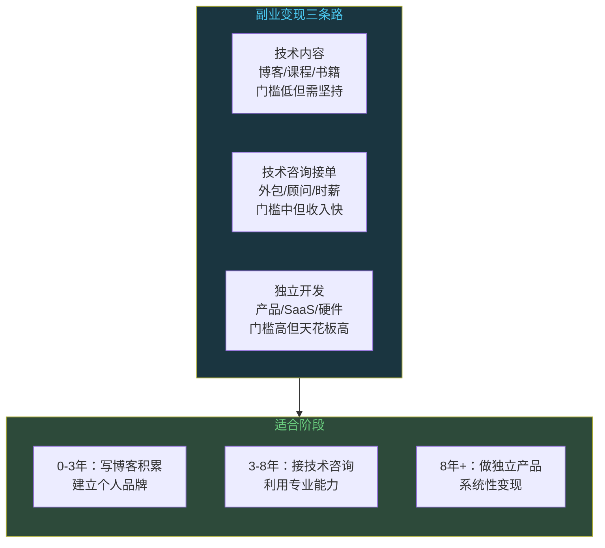
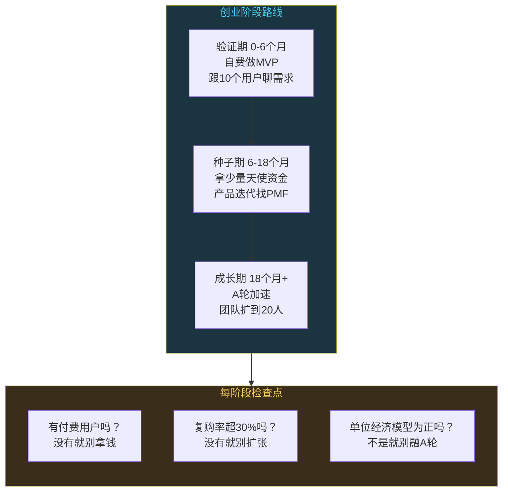

# 技术人怎么赚钱：副业创业投资的变现路径

```
╔══════════════════════════════════════════════╗
║  渡劫期 · 第164篇                              ║
║  技术人怎么赚钱：副业创业投资的变现路径       ║
║  预计阅读：13分钟                              ║
╚══════════════════════════════════════════════╝
```

修炼到渡劫期，该考虑灵石从哪来了。前面聊了选门派的事，大厂创业外企各有各的修行方式。但不管你在哪家门派，只靠门派发的月例银钱，很难真正实现财务自由。技术人的赚钱能力被严重低估了，你以为自己只会写代码，其实你的技能可以变出好几条现金流。这篇把副业、创业以及投资这几条路拆开看，哪些能走通，哪些是坑，嵌入式工程师在这几条路上有什么特别的优势。

---

## 硬核主体

### 一、副业变现：用技术技能赚第二份收入

副业是门槛最低的变现方式。你不用辞职，不用投钱，用业余时间把技术能力换成钱。副业的逻辑是：把你工作中积累的技能，卖给不同的买家。

第一种是技术内容变现。写博客，做教程，录课程。这条路看起来简单，但能持续赚到钱的人不多，因为大部分人对"持续输出"这件事缺乏认知。CSDN和掘金的付费专栏，一篇质量过硬的技术文章能带来几十到几百的月收入，写得好的专栏一年能到几万。视频教程在B站和YouTube上，嵌入式方向的受众虽然不如前端大，但竞争也小，一个讲STM32外设驱动的系列，播放量可能不如一个讲Vue3的，但粉丝精准，后续变现转化率高。技术书籍是另一条路，机械工业出版社和电子工业出版社每年出大量嵌入式教材，稿费不高（通常按版税8%到10%算），但写书带来的个人品牌价值远超稿费本身。

```text
技术内容变现的收入阶梯：

入门级（0-6个月）：
  - CSDN/掘金免费文章积累流量
  - 月收入：0-200元
  - 目标：建立写作习惯，找到受众

成长期（6-18个月）：
  - 开付费专栏/知识星球
  - 月收入：500-3000元
  - 目标：稳定更新频率，提高质量

成熟期（18个月+）：
  - 视频课程/技术书籍/企业培训
  - 月收入：3000-20000元
  - 目标：个人品牌变现，多渠道收入

注意：90%的人死在入门期，因为前三个月没收入就放弃了
```

第二种是技术咨询和接单。这条路对嵌入式工程师特别友好，因为硬件项目的技术门槛高，甲方不容易找到替代者。技术咨询的收费方式，按项目报价或者按时薪。一个STM32固件开发的外包项目，简单的几千块，复杂的能到几万甚至十几万。时薪方面，有经验的嵌入式工程师做咨询，300到800一小时是合理区间。接单的渠道，一是技术社区和朋友圈口碑，二是程序员客栈和码市这类平台，三是直接跟硬件公司谈合作，做他们的外置技术顾问。

第三种是独立开发。做一个小产品或者工具，放到市场上卖。这条路在互联网领域已经有很多成功案例，独立开发者通过SaaS产品实现月入几千到几万美元。嵌入式领域的独立开发路子不太一样，更多是做硬件模块或者开发工具。比如设计一个STM32开发板卖给学生和爱好者，或者写一套固件模板代码在平台上卖。利润不高但量大出奇迹，一个卖99元的开发板，月销200个就是两万块。



### 二、创业：从打工者到自己的老板

创业是三条路里风险最高回报也最高的。副业是业余时间做，创业是全身心投入。这里不灌鸡汤，只说技术人创业的实际情况。

技术人创业的第一步是判断自己适不适合。三个条件，缺一个都别轻易动手。第一，你有明确的商业方向，不是"我想创业但不知道做什么"。第二，你有足够的存款撑过至少12个月零收入期。第三，你能接受失败的概率，创业失败率在90%左右，你得能承受这个结果。

技术创业跟普通创业的区别在于，技术人容易陷入"技术驱动"的陷阱。你觉得某个技术很酷，花三个月做了一个产品，结果发现没人需要。正确的顺序是先找需求，再想技术方案。你做的东西必须解决某个群体的实际问题，而不是满足你自己的技术兴趣。

```c
/* 技术人创业的常见误区 */

// 误区1：技术先行，需求后置
//   错误：先写三个月代码，再找用户
//   正确：先跟10个潜在用户聊，确认需求，再写代码

// 误区2：过度设计技术架构
//   错误：第一天就上微服务+K8s+消息队列
//   正确：MVP用最简方案，单体应用够用就别拆

// 误区3：一个人想干所有事
//   错误：技术+产品+运营+销售全包
//   正确：技术你负责，其他找合伙人补

// 误区4：不接受市场反馈
//   错误：用户说不好用，你觉得是用户不懂
//   正确：用户说不好用，立刻改方向
```

嵌入式方向的创业有自己的特点。硬件创业的门槛比纯软件高很多，涉及供应链管理，还有生产，质检，认证这些环节。但门槛高也意味着竞争少，利润空间大。一个做工业传感器的小公司，如果产品稳定可靠，一个客户的订单就能养活团队。嵌入式创业的另一个优势是技术壁垒，你花了五年积累的硬件底层经验，别人三个月学不会，这就是护城河。

融资方面，技术人创业容易走两个极端。一种是完全不要外部投资，自己掏钱慢慢做。好处是股权干净，坏处是发展慢，可能被有资本的竞争对手超越。另一种是过早融资，天使轮就拿了几百万，然后迫于投资人的压力快速扩张，结果方向没跑通就烧完了。合理的节奏是：早期用自己的钱做MVP，验证了产品有市场需求之后，再拿钱加速。种子轮要少拿，够用12到18个月就行，别一上来就拿大钱稀释股权。



### 三、投资理财：技术人的隐藏优势

投资是三条路里最被技术人忽视的。很多程序员技术能力很强，但理财知识几乎为零。工资全放余额宝或者银行定期，连指数基金都没买过。这其实是浪费了技术人最大的一个优势：数据思维。

技术人做投资有三个天然优势。第一是数据能力，你会写代码，能自己跑数据回测策略，能分析财报数据，这不是普通投资者能做到的。第二是逻辑思维，你对概率和风险的理解比一般人强，不容易被情绪左右。第三是信息渠道，技术圈的信息流转快，你对新技术的判断力比金融分析师准。比如你比大部分基金经理早半年看到RISC-V的机会，早一年看到AI推理芯片的趋势。

但技术人投资也有三个典型坑。第一个是过度自信，觉得自己聪明能看懂技术就能赚钱，结果重仓某个技术股被套。第二个是把投资当写代码，试图找到"完美策略"，频繁调仓，交易成本吃掉利润。第三个是忽视资产配置，全仓科技股，遇到行业回调损失惨重。

```text
技术人投资的实操框架：

1. 底仓：宽基指数基金定投（沪深300+纳斯达克100）
   - 每月固定金额，不择时
   - 占总投资额50-60%
   - 年化预期8-12%（长期持有10年+）

2. 卫星仓位：行业ETF（半导体/AI/新能源）
   - 基于技术判断做行业配置
   - 占总投资额20-30%
   - 单行业不超过10%

3. 现金储备：货币基金/短债基金
   - 随时可取，应对急用
   - 保持6个月生活费的现金储备
   - 占总投资额10-20%

4. 高风险仓位：个股/加密货币（可选）
   - 只用亏得起的钱
   - 单只不超过总仓位5%
   - 严格止损，不补仓

年化收益预期：
  纯指数定投：8-12%
  加行业配置：10-15%（风险同步增加）
  加个股：15-25%（波动极大）
```

投资理财最大的敌人不是市场，是你自己的心态。技术人容易犯的一个错误是"分析瘫痪"，看了十份财报，建了复杂的数据模型，最后一个交易决策都做不了。投资不需要完美策略，需要的是纪律性。定投指数基金这件事，执行比策略重要。每月固定一天买入固定金额，不看盘不择时，坚持五年，大概率跑赢80%的主动投资者。

### 四、三条路怎么选：变现路径选择

把三条路放在一个框架里看，你可以同时走多条路，但不同阶段的侧重点不同。


工作前三年，主业是积累技术能力，副业以内容写作为主。这个阶段你还在成长期，接咨询项目的实力不够，创业风险太大。写博客做教程，练了表达能力，同时建立个人品牌，投入低回报慢但复利效应大。

工作三到八年，技术能力成熟，可以开始接技术咨询的活。这个阶段你的专业能力足够值钱，时薪能到500以上。投资方面也开始有积蓄，可以启动指数基金定投。创业还不急，除非你遇到了明确的机会。

工作八年以上，三条路都可以走。咨询可以升级为企业级技术顾问，年费十几万到几十万。独立开发可以做更复杂的产品。创业如果方向明确，这个阶段是最佳时机，因为你技术积累够厚，人脉也够广。投资方面，你的积蓄够大，指数基金的复利效应开始显现。

有一个原则要记住：副业不能影响主业。如果你的副业收入超过了主业的三分之一，而且持续了六个月以上，你可以考虑把副业转成主业。但在那之前，主业是你的现金流底盘，不能因为副业的小钱丢了主业的大钱。

```text
变现路径时间线：

阶段1（0-3年）：主业+内容写作
  - 主业：积累技术能力
  - 副业：博客/教程，月入0-1000
  - 投资：学习理财知识，不急入场

阶段2（3-8年）：主业+咨询+定投
  - 主业：技术专家路线
  - 副业：技术咨询/外包，月入2000-10000
  - 投资：指数基金定投，每月固定

阶段3（8年+）：多元化变现
  - 主业：高级技术岗或管理
  - 副业：企业顾问/独立产品，月入5000-50000
  - 投资：指数+行业+个股组合
  - 可选：全职创业（有明确方向时）
```

嵌入式工程师在变现这件事上有个独特的优势：硬件技能稀缺。前端后端的副业竞争激烈，你跟全国几十万程序员抢同一块蛋糕。但嵌入式的外包项目，能做的人少得多。一个能独立完成硬件选型到固件开发的工程师，在咨询市场的价值远高于一个只会写CRUD的Web程序员。好好利用这个稀缺性，它是你变现路上最大的筹码。

---

## 修仙术语对照表

| 修仙术语 | 技术现实 | 本篇位置 |
|---------|---------|---------|
| 灵石从哪来 | 技术人的收入来源和变现路径 | 引入段 |
| 月例银钱 | 主业工资收入 | 引入段 |
| 第二份收入 | 副业变现的概念 | 第一节 |
| 功法换钱 | 技术技能变现为收入 | 第一节 |
| 修炼笔记变现 | 技术博客和内容创作变现 | 第一节 |
| 御灵顾问 | 技术咨询和外包接单 | 第一节 |
| 独立炼器 | 独立开发产品和工具 | 第一节 |
| 开宗立派 | 技术创业的条件和路径 | 第二节 |
| 技术驱动陷阱 | 先做技术再找需求的创业误区 | 第二节 |
| MVP验证 | 最小可行产品验证市场需求 | 第二节 |
| 融资节奏 | 创业各阶段的资金策略 | 第二节 |
| 灵石投资 | 技术人理财的隐藏优势 | 第三节 |
| 数据阵法 | 技术人的数据能力用于投资 | 第三节 |
| 分析瘫痪 | 过度分析导致无法决策 | 第三节 |
| 变现路径选择 | 三条路的风险回报选择 | 第四节 |

---

## 进阶条件

- [ ] 能说出副业变现的三种方式，以及每种方式的收入预期和门槛
- [ ] 有一个正在运营的技术内容输出渠道（博客/专栏/视频），持续更新超过3个月
- [ ] 能评估自己是否适合创业，列出三个条件的达标情况
- [ ] 有一个投资理财账户，开始执行指数基金定投计划
- [ ] 能说出嵌入式工程师在变现路上的独特优势，以及如何利用
- [ ] 能画出自己未来五年的变现路径时间线，标注每个阶段的侧重点
- [ ] 理解"副业不影响主业"的底线，知道什么时候可以把副业转主业

下一篇聊AI会不会取代程序员。这个问题每个技术人都在想，大模型越来越强，写代码的能力越来越像人，我们这行还能干多久。下一篇从大模型的能力边界说起，哪些工作机器暂时做不了，人机协作的模式会是什么样。

讨论：你做过哪些技术变现的尝试？踩过什么坑？如果重新选一条路，你会怎么走？

---

我是玄芯散人，带你修到大乘。

---

*本文是「码农修仙传」系列第164篇。系列导航见 [xren.ren](https://xren.ren)*
