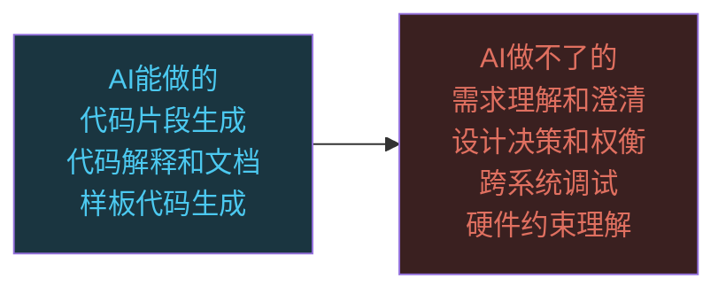
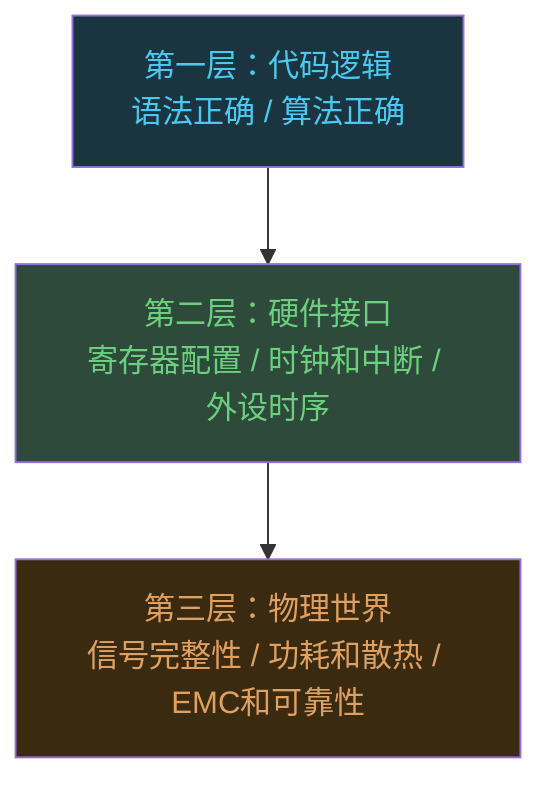

# AI会不会取代程序员：大模型能力边界和不可替代的工作

```
╔══════════════════════════════════════════════╗
║  渡劫期 · 第165篇                              ║
║  AI会不会取代程序员：大模型能力边界和不可替代  ║
║  预计阅读：15分钟                              ║
╚══════════════════════════════════════════════╝
```

修仙界每过几十年就要传一次"天劫将至"。2024年大语言模型能写代码了，一时间"程序员要被淘汰"的说法铺天盖地。这种恐慌不新鲜，2000年有人觉得Dreamweaver会取代前端，2015年有人觉得Wix会取代全栈。结果呢，前端工程师反而更多了。但这次确实不一样，大模型不是工具升级，是生产力变了。这篇把AI在编程领域到底能干什么，干不了什么，嵌入式工程师的位置在哪里，一次说透。

---

## 硬核主体

### 一、大模型写代码到底什么水平

先给数据。GitHub和微软在2023年做了一项受控实验，发表在《Communications of the ACM》上。954名开发者分两组，一组用Copilot，一组不用。结果是用了Copilot的开发者完成任务的速度快了大约55.8%，代码质量评分没有下降。2024年另一项研究则更保守，发现对于有经验的开发者，AI辅助工具的提速大约在26%左右，新手受益更大（⚠️数据来源待确认，可能来自MIT相关工作论文）。

Cognition Labs推出的Devin号称"AI软件工程师"，在SWE-bench基准测试上能自主解决约13.86%的真实GitHub issue。到了2025年，Claude 3.5 Sonnet在SWE-bench Verified上得分约33%，GPT-4o在HumanEval上准确率约90%，在隔离的编程题上表现接近中级程序员水平，但放到真实项目代码库里，成功率大幅下降。

```text
AI编程能力分层：

算法题/LeetCode    → 中高级水平，大部分medium题能AC
CRUD/Web页面       → 高级水平，生成速度快，代码可用
调试复杂Bug        → 初级水平，需要人给出足够的上下文
系统设计           → 顾问水平，能给建议但不能拍板
硬件/嵌入式开发    → 学徒水平，能写片段但不理解物理约束
```

这里有一个需要区分的事情：写代码片段和做软件工程是两件事。大模型擅长前者，后者涉及需求理解和权衡决策还有团队协作，这些目前AI做不了。

### 二、AI在编程领域的三板斧

大模型在编程领域真正能落地的能力，集中在三块。

第一块是代码生成。你描述一个函数要做什么，AI直接给你实现。对于接口定义清晰且逻辑不复杂的场景，比如写一个JSON解析器，或者生成一套REST API的样板代码，AI确实能省大量时间。但注意，生成的代码需要人来审查。AI写的代码有个特点：看起来很对，但经常在边界条件上出问题。空指针，数组越界，类型转换溢出，这些AI不会主动帮你处理。

```python
# AI生成的"看起来对"的代码，实际有隐患
def merge_sorted_arrays(arr1, arr2):
    result = []
    i, j = 0, 0
    while i < len(arr1) and j < len(arr2):
        if arr1[i] <= arr2[j]:
            result.append(arr1[i])
            i += 1
        else:
            result.append(arr2[j])
            j += 1
    # 下面这两行AI经常漏掉或者写错
    result.extend(arr1[i:])  # 处理剩余元素
    result.extend(arr2[j:])
    return result

# 隐患：如果arr1或arr2是None，直接crash
# AI不会主动加防御性检查，除非你明确要求
```

第二块是代码理解和解释。把一段别人写的代码扔给AI，让它解释逻辑，这事AI做得很好。对于接手老项目的人来说，这是巨大的效率提升。但解释和正确理解之间有差距，AI能说出代码"做了什么"，但很难说清"为什么这么做"。特别是当代码里有一些看起来奇怪的 hack，背后可能是某个特定版本的bug workaround，AI会给出一个看似合理的解释，但那个解释可能是错的。

第三块是文档和测试生成。写注释，写README，生成单元测试用例，这些AI做得不错。但测试用例的质量取决于AI对业务逻辑的理解深度。AI生成的测试往往覆盖正常路径，对异常路径和边界条件的覆盖不够。

### 三、大模型干不了什么



上面这张图列了AI的边界。逐个说为什么。

需求理解是最大的壁垒。 客户说"我要一个简单的东西"，这五个字背后可能藏着三个月的工作量。大模型没有能力跟客户坐下来，通过反复追问把模糊的需求变成精确的spec。这个能力需要领域知识，行业经验，还有人际沟通，AI在这个环节基本没有参与度。你跟AI说"帮我写一个库存管理系统"，AI会问你要什么功能，但它不会问你"你们的仓库是按FIFO还是按批次出货""库存不足时是自动采购还是通知采购员"。这些业务规则，客户自己都说不清楚，需要开发者帮忙梳理。

设计决策涉及权衡。 选MySQL还是MongoDB，用微服务还是单体，消息队列选Kafka还是RabbitMQ，这些问题没有标准答案。AI可以列出每种方案的优缺点，但最终选哪个，取决于团队规模和运维能力，还有预算和业务特点。AI能提供信息，但不能替你做决定，因为做决定的前提是理解约束，而约束往往不在代码里，在人和钱里。

跨系统调试是AI的盲区。 一个请求从客户端到网关到服务A，再到消息队列到服务B，最后落到数据库，链路上任何一个环节出问题都可能导致bug。大模型的上下文窗口再大，也装不下一个真实系统的全部状态。而且很多bug是时序相关的，在特定并发条件下才出现，这种bug你很难给AI提供足够的复现信息。

### 四、嵌入式工程师的护城河

前面说的是软件工程师整体，具体到嵌入式工程师，情况更特殊。嵌入式开发有几个AI短期内无法跨越的障碍。

第一是硬件约束感知。写一段C代码控制GPIO翻转，AI能写出来。但AI不知道这段代码跑在哪个芯片上，不知道时钟树怎么配置，不知道这个GPIO的驱动电流够不够，不知道走线上拉了多大的负载电容。这些信息散落在Datasheet里，原理图上，PCB布局中，AI拿不到。

```c
/* AI能写出的代码 */
HAL_GPIO_WritePin(GPIOA, GPIO_PIN_5, GPIO_PIN_SET);

/* AI不知道的事：
   1. GPIOA的时钟使能了吗？
   2. PA5配置成输出模式了吗？
   3. 输出速度够不够？
   4. 这个引脚是不是被复用了？
   5. 焊接在板子上的负载电容多大？影响翻转速度
   6. 这路GPIO是不是接了开漏需要外部上拉电阻？

   上面6个问题，4个要查Datasheet，2个要看原理图
   AI两样都拿不到 */
```

第二是实时性和时序约束。嵌入式系统经常有硬实时要求，某个中断必须在10微秒内响应，某段代码必须在特定时钟周期内完成。这种约束需要开发者理解CPU流水线，理解Cache行为，理解中断延迟。大模型生成的代码不考虑时序，它只考虑逻辑正确。在PC上这没问题，在MCU上可能导致中断超时或者任务调度失败。

第三是调试需要物理工具。PC上的bug可以远程查看日志，嵌入式bug经常需要接示波器看波形，用逻辑分析仪抓总线时序，用JTAG单步跟到寄存器级别。这些操作涉及物理世界，AI连不了你的示波器。就算将来能通过某种接口让AI读取仪器数据，判断波形是否正常仍然需要大量经验，这跟处理文本是完全不同的能力。



这张图说明了嵌入式工程师的三层护城河。AI目前能碰第一层，第二层勉强能给建议，第三层完全够不着。

### 五、人机协作的正确姿势

与其担心被取代，不如想想怎么用AI让自己更值钱。人机协作的要义在于让AI做它擅长的，你做你擅长的。

AI擅长什么？生成样板代码，写测试用例，解释老代码，生成文档，查API用法。这些事以前占你大量时间，现在可以快速完成。

你该做什么？理解业务需求，做设计决策，调试复杂问题，处理硬件相关的约束，做技术选型。这些是AI替代不了的。

```text
人机协作工作流示例（嵌入式项目）：

步骤1：人 → 理解需求，确定硬件方案
        （选芯片、看Datasheet、评估外设）

步骤2：AI → 生成初始化代码框架
        （时钟配置、GPIO初始化、外设配置模板）

步骤3：人 → 审查和修正AI生成的代码
        （检查寄存器地址、时序参数、中断优先级）

步骤4：AI → 生成单元测试用例
        （逻辑层面的测试，不含硬件相关）

步骤5：人 → 在实际硬件上调试
        （示波器验证波形、调整时序、处理硬件异常）

步骤6：AI → 生成技术文档和注释
        （把调试过程和设计决策记录下来）

效率提升点：步骤2和步骤6以前占项目40%的时间
           现在压缩到10%，省出的时间用于设计质量提升
```

注意步骤3，这是最要紧的环节。AI生成的代码必须有人审查，特别是嵌入式领域，一个寄存器写错位就可能烧芯片。审查需要的能力恰恰是AI不具备的，对硬件的理解和对细节的敏感。

### 六、哪些岗位确实危险

直说吧，有些程序员岗位受到AI冲击是实实在在的。

纯CRUD开发者。如果你的工作就是照着需求文档写增删改查接口，不涉及设计决策和技术选型，AI确实能替代大部分工作。这类岗位的门槛会越来越高，需求量在减少。

简单的网页制作。静态页面，企业官网这种需求，AI加上低代码平台已经能覆盖大部分。前端入门岗位的竞争会越来越激烈。

重复性高的测试岗。自动化测试用例生成是AI的强项，纯手工测试或者只写简单自动化脚本的测试工程师需要转型。

这些岗位"危险"意味着行业对这类岗位的需求量会减少，薪资增长会放缓，但不会立刻消失。真正有技术层级的岗位，比如系统设计，性能调优，底层开发，算法探索，这些AI反而帮不上什么忙。

---

## 修仙术语对照表

| 修仙术语 | 技术现实 | 本篇位置 |
|---------|---------|---------|
| 天劫将至 | AI取代程序员的恐慌 | 开篇引入 |
| 灵脉 | 大模型的代码生成能力 | 第一节 |
| 御灵术 | 大模型生成代码的技术 | 第一节 |
| 心法口诀 | 算法题和CRUD等AI擅长的领域 | 第一节代码块 |
| 走火入魔 | AI生成代码看起来对实际有隐患 | 第二节代码示例 |
| 天眼 | AI解释代码的能力 | 第二节 |
| 护城河 | 嵌入式工程师不可被AI替代的壁垒 | 第四节 |
| 灵根 | 硬件约束感知能力 | 第四节第一点 |
| 时辰之术 | 实时性和时序约束 | 第四节第二点 |
| 法器 | 示波器/逻辑分析仪/JTAG等硬件工具 | 第四节第三点 |
| 三重境界 | 代码逻辑/硬件接口/物理世界三层 | 第四节mermaid图 |
| 合击之术 | 人机协作工作流 | 第五节 |
| 炼丹炉 | AI擅长处理的样板代码生成 | 第五节步骤2 |
| 心境 | 设计决策和需求理解能力 | 第二节第三节 |
| 劫灰 | 受AI冲击的岗位 | 第六节 |

---

## 突破条件

- [ ] 能说出大模型在编程领域的3个具体能力边界，每个都有实例支撑
- [ ] 用过Copilot或Claude Code完成过一个实际项目任务，知道哪里靠谱哪里不靠谱
- [ ] 能区分"代码片段生成"和"软件工程"的差异，并能向非技术人解释
- [ ] 理解嵌入式工程师相对于纯软件工程师在AI时代的三层护城河
- [ ] 能列出自己工作中哪些环节AI能帮忙，哪些必须自己做，并据此调整工作方式
- [ ] 读过至少一篇关于AI编程能力的学术论文或受控实验报告（不是自媒体文章）
- [ ] 能给团队新人提供"如何与AI协作"的实操建议

下一篇我们走进大模型本身，拆解Transformer到底在做什么。Attention机制为什么这么强，训练和推理为什么烧那么多钱，这些问题的答案在「大模型原理」这一篇。

---

## 下期预告

**第166篇：大模型原理：Transformer到底在做什么**

注意力机制到底是什么，为什么一个数学公式能让机器理解语言。训练一个大模型要烧多少算力，推理时为什么显存比算力更紧要。从Attention is All You Need这篇论文说起，把Transformer拆给嵌入式工程师看。

你觉得AI在哪些编程任务上已经超过你了？评论区聊聊你的实际体验。

我是玄芯散人，带你从炼气修到大乘。

---

*本文是「码农修仙传」系列第165篇。系列导航见 [xren.ren](https://xren.ren)*
