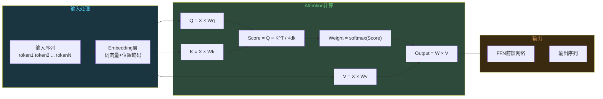
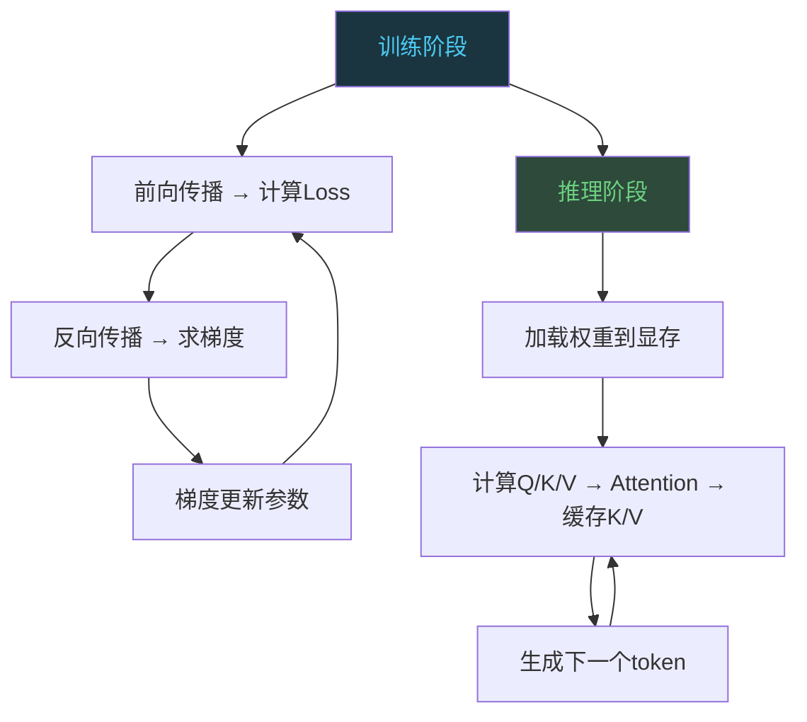

# 大模型原理：Transformer到底在做什么

```
╔══════════════════════════════════════════════╗
║  渡劫期 · 第166篇                              ║
║  大模型原理：Transformer到底在做什么           ║
║  预计阅读：16分钟                              ║
╚══════════════════════════════════════════════╝
```

2017年Google Brain团队发了一篇论文，标题叫"Attention is All You Need"。当时没几个人觉得这篇论文会改变整个AI行业的走向。七年过去了，这篇论文里提出的Transformer架构撑起了ChatGPT和Claude以及LLaMA和DeepSeek这些你可能天天在用的工具。嵌入式工程师跟大模型看似不搭界，但如果你想搞清楚AI推理为什么吃显存，为什么训练一个模型要烧几千万美元，就得先搞懂Transformer到底在做什么。

---

## 硬核主体

### 一、Transformer之前的世界：RNN和CNN的局限

要理解Transformer为什么厉害，得先知道它取代了什么。2017年之前，处理自然语言的模型主要是RNN（循环神经网络）和CNN（卷积神经网络）。

RNN的特点是逐个token处理。读到一个词，更新一下内部状态，再读下一个词。这带来两个问题。第一是串行计算，GPU的并行能力用不上，训练速度慢。第二是长距离依赖丢失，读到句子末尾时，开头的信息已经被稀释了。LSTM和GRU用门控机制缓解了这个问题，但有没有根治，不好说。

CNN做文本处理靠的是卷积核滑动，能并行了，但感受野有限。要捕捉长距离关系，就得堆很多层卷积，模型变深变难训。

Transformer用了一个看起来很简单的思路干掉了这两个问题：让每个词直接跟句子里的所有词计算关联度，不用串行，不用堆层。这个思路叫Self-Attention。

### 二、Self-Attention：一个公式撑起一个时代

Self-Attention的数学表达就一行：

```python
# Scaled Dot-Product Attention
# Q: Query  查询向量  (我要找什么)
# K: Key    键向量    (我能提供什么)
# V: Value  值向量    (我实际包含的信息)
# dk:       K的维度   防止点积过大导致softmax梯度消失

import numpy as np

def attention(Q, K, V, dk):
    # Q和K做点积，衡量查询和键的相似度
    scores = np.matmul(Q, K.T) / np.sqrt(dk)  # 缩放，防止值过大
    # softmax归一化，得到0-1之间的注意力权重
    weights = softmax(scores, axis=-1)
    # 用权重对V加权求和，得到最终输出
    output = np.matmul(weights, V)
    return output

# 核心逻辑：每个位置通过Q跟所有位置的K算相似度，
# 然后按相似度权重把所有位置的V加起来
# 结果：每个位置都"看到"了整个序列的信息
```

这个公式在做什么？打个比方。你在一个会议室里，你是其中一个位置（token）。你想知道谁说的话跟你相关，于是你拿着自己的Query去跟每个人的Key做匹配。匹配度高的，你多听；匹配度低的，你少听。最后你听到的内容就是所有人Value的加权平均。

对于嵌入式工程师来说，这跟DMA的优先级仲裁有点像。DMA控制器有多个通道请求传输，每个通道有不同的优先级。Attention机制就是在所有token的"传输请求"之间算一个软优先级，按相似度分配注意力，不是固定优先级。



### 三、Multi-Head Attention：多角度同时看

单个Attention只学一种关系模式。Transformer用了Multi-Head Attention，就是把Q、K、V分成多组，每组独立做Attention，最后拼起来。

```python
# Multi-Head Attention 简化示意
# 比如head_num=8，每个head看一种关系

class MultiHeadAttention:
    def __init__(self, d_model=512, num_heads=8):
        self.d_k = d_model // num_heads  # 每个头的维度
        self.heads = num_heads

    def forward(self, Q, K, V):
        # 拆成8组，每组64维
        # head1: Q1,K1,V1 → output1
        # head2: Q2,K2,V2 → output2
        # ...
        # head8: Q8,K8,V8 → output8
        
        # 8个输出拼接后过一个线性层
        # 多头的好处：不同head学到不同维度的关联
        # head1可能学语法关系（主谓宾）
        # head2可能学指代关系（"他"指谁）
        # head3可能学语义关系（同义反义）
        pass
```

为什么要多头？语言里的关系不是单一的。"猫吃了鱼，它很开心"这句话里，"它"指代"猫"，不是"鱼"。理解这个指代关系需要一种注意力模式。同时，"吃"和"鱼"之间有动宾关系，这又是一种模式。一个head只能学一种模式，多个head并行就能同时捕捉多种关系。

GPT-3用了96个attention layer，每层有96个head。LLaMA 3的70B版本用了80层，采用GQA（Grouped Query Attention），head数和KV head数的比例跟标准MHA不同。这些head不是摆设，研究发现不同head确实学到了不同的语言模式。

### 四、训练为什么烧钱

这是渡劫期该聊的问题。这篇不是教你怎么训模型，重点在算清楚这笔账。

训练一个大模型，成本来自三块，算力开销，数据准备，还有人力投入。

算力这一块。GPT-3是1750亿参数，训练用了约1024块NVIDIA V100 GPU（行业估算值，非论文原数据），跑了大约34天。按2020年的云GPU价格估算，光算力成本大约460万美元。GPT-4的参数量没有官方公开，业界估算在1.7万亿到1.8万亿之间，用了MoE（Mixture of Experts）架构，训练成本估计在6300万到1亿美元之间。Meta训练LLaMA 3的405B模型，用了16384块H100 GPU，跑了54天。

```text
大模型训练成本对比（估算值）：

模型         参数量       GPU              天数    估算成本
GPT-3        175B        V100×1024        34天    ~$4.6M
GPT-4        ~1.76T(MoE)  估计H100数千块   未公开   ~$63M-100M
LLaMA 3 405B 405B        H100×16384       54天    ~$60M+
DeepSeek-V3  671B(MoE)   H800×2048        ~60天   ~$5.5M（效率优化后）
```

DeepSeek-V3的成本为什么低这么多？两个原因。一是用了MoE架构，6700多亿参数但每次推理只激活370亿，训练时也是稀疏激活。二是做了大量工程上的效率改进，包括FP8混合精度训练和通信压缩，这些技术把训练效率拉了上去。

数据这一块。GPT-3用了约5000亿token的训练数据，Common Crawl占了六成。GPT-4的训练数据量没有公开，业界估算在10万亿到13万亿token之间。数据清洗的成本经常被忽略。高质量数据需要先去重，再过滤低质量内容，然后去掉PII（个人身份信息），这些步骤的算力成本不低，而且人工标注的成本更高。Anthropic和OpenAI都大量使用人工标注数据做对齐训练，这部分人力成本以千万美元计。

人力这一块。OpenAI的GPT-4团队据报告有数百人，算上研究员和工程师以及数据标注团队，一年的工资支出就是几千万美元。这还没算硬件折旧和电力成本。

### 五、推理为什么吃显存

训练贵，推理也不便宜。大模型推理的瓶颈不是算力，是显存。

```python
# 推理显存计算（粗略估算）
# 假设模型参数量P，精度为FP16（每参数2字节）

def estimate_vram(params_billion, precision="fp16", batch_size=1, seq_len=4096):
    bytes_per_param = {"fp32": 4, "fp16": 2, "int8": 1, "int4": 0.5}
    b = bytes_per_param[precision]
    
    # 1. 模型权重占用
    weight_vram = params_billion * b  # 单位GB
    
    # 2. KV Cache占用（推理时缓存历史token的K和V）
    # KV cache = 2 × num_layers × seq_len × d_model × batch_size × bytes
    # 对GPT-3级别模型，约等于权重大小的1-2倍（长序列时）
    kv_cache = weight_vram * 0.5 * batch_size  # 粗略估算
    
    # 3. 激活值和临时buffer
    activation = weight_vram * 0.1 * batch_size
    
    total = weight_vram + kv_cache + activation
    print(f"参数量: {params_billion}B ({precision})")
    print(f"权重: {weight_vram:.1f}GB")
    print(f"KV Cache: {kv_cache:.1f}GB")
    print(f"激活值: {activation:.1f}GB")
    print(f"总计: {total:.1f}GB")
    return total

# LLaMA 3 8B FP16推理
estimate_vram(8, "fp16")    # 约16-18GB
# LLaMA 3 70B FP16推理
estimate_vram(70, "fp16")   # 约150GB
```

这就解释了一个现象：跑一个70B的模型做推理，一块80GB的H100根本不够，需要两块甚至更多。因为除了权重本身占140GB，KV Cache在序列长度4096时还要额外占几十GB。

KV Cache是什么？生成式模型推理时，每生成一个token，都要重新计算跟前面所有token的Attention。如果不缓存，计算量是O(n²)。缓存了每层的K和V之后，新token只需要跟历史K、V做一次Attention，计算量降到O(n)。但代价是显存占用随序列长度线性增长。



这张图展示了训练和推理的差异。训练时大量计算花在反向传播上，GPU的张量运算能力是瓶颈。推理时反向传播没了，但KV Cache的显存占用成了瓶颈。这就是为什么训练看FLOPS（算力），推理看VRAM（显存）。

### 六、量化：把模型塞进小显存

为了让大模型能跑在消费级显卡甚至边缘设备上，量化技术被广泛使用。量化就是把模型参数用低精度表示来压缩体积。

```text
量化精度对比（以70B模型为例）：

精度      每参数字节    权重显存    质量
FP32     4            280GB       原始质量
FP16     2            140GB       几乎无损
INT8     1            70GB        轻微下降
INT4     0.5          35GB        可感知下降
```

INT8量化后70B模型占70GB，一块80GB的H100就能跑了。INT4量化后只要35GB，一张4090的24GB显存都能跑。代价是精度损失，INT4量化在某些推理任务上质量下降5%-15%，取决于量化算法。

这就引出了边缘AI的可能性。一个7B模型INT4量化后只要3.5GB，STM32H7这种带外挂SRAM的MCU虽然跑不动，但树莓派4的4GB内存可以勉强跑。如果用更小的模型，比如1B参数级别INT4量化后500MB，一些高端嵌入式平台（如NVIDIA Jetson）就完全可行了。第167篇会详细聊TFLite Micro怎么在MCU上跑模型。

### 七、Attention is All You Need的深层含义

回到2017年那篇论文。为什么Attention机制能取代RNN？因为Attention解决了一个问题：序列中任意两个位置之间的信息传递路径长度从O(n)变成了O(1)。

RNN里第1个词要影响第100个词，信息要经过99个时间步的传递，每一步都有信息衰减。Attention里第1个词直接跟第100个词算相似度，一步到位，没有衰减。

但Attention的代价是计算量。序列长度为n时，Self-Attention的计算量是O(n²)，因为每个位置都要跟所有位置算相似度。这就是为什么后来有人研究Linear Attention，把O(n²)降到O(n)，但效果有折损。FlashAttention则是从GPU内存访问上做优化，减少HBM读写，计算量没变但实际速度快了好几倍。

Transformer的成功不在于它多精巧，在于它做了两件事：一是并行化，整个序列同时计算，GPU能充分发挥；二是残差连接和LayerNorm让模型可以堆很深。GPT-3有96层，如果没有残差连接，梯度没法传下去。

---

## 修仙术语对照表

| 修仙术语 | 技术现实 | 本篇位置 |
|---------|---------|---------|
| 天书 | "Attention is All You Need"论文 | 开篇引入 |
| 灵识 | Self-Attention机制 | 第二节 |
| 传音 | Q、K、V三个向量的查询匹配 | 第二节代码 |
| 分身术 | Multi-Head Attention多头并行 | 第三节 |
| 天火淬体 | 模型训练过程（前向+反向+更新） | 第四节 |
| 灵石 | 训练成本（算力/数据/人力） | 第四节 |
| 藏神于器 | 推理时权重加载到显存 | 第五节 |
| 记忆宫殿 | KV Cache缓存历史token的K和V | 第五节 |
| 炼体降阶 | 量化压缩（FP16→INT8→INT4） | 第六节 |
| 灵脉通达 | Linear Attention/FlashAttention优化 | 第七节 |
| 残魂归位 | 残差连接让深层网络可训练 | 第七节 |
| 定海神针 | LayerNorm稳定深层训练 | 第七节 |
| 九十六重天 | GPT-3的96层Transformer | 第七节 |
| 一步之遥 | Attention的O(1)信息传递路径 | 第七节 |

---

## 进阶条件

- [ ] 能说出Self-Attention的公式并解释Q、K、V各自的用途
- [ ] 理解Multi-Head Attention为什么比Single-Head效果好，能说出至少两种不同的关系模式
- [ ] 能估算一个给定参数量的模型在FP16和INT8下的显存占用
- [ ] 知道KV Cache是什么，为什么推理时显存比算力更要紧
- [ ] 能说出训练成本的三块构成（算力/数据/人力），并估算一个7B模型的训练成本量级
- [ ] 理解量化对模型大小和推理质量的影响，知道INT4量化后70B模型占多少GB
- [ ] 能向非技术人解释Transformer比RNN为什么更适合GPU并行

下一篇我们进入边缘AI实战。大模型跑在云端是一回事，跑在一颗MCU上又是另一回事。TFLite Micro怎么把一个神经网络塞进几十KB的内存，量化后的精度损失在嵌入式设备上能不能接受，这些问题在「AI推理上MCU」这一篇。

---

## 下期预告

**第167篇：AI推理上MCU：TFLite Micro怎么跑**

模型量化在MCU上的实战，TFLite Micro的内存管理策略，Person Detection模型怎么在Arduino Nano 33 BLE上跑起来。嵌入式工程师在边缘AI落地中的位置在哪里。

你在日常工作中用过AI辅助编程吗，觉得Transformer对你最大的帮助在哪个环节？评论区聊聊。

我是玄芯散人，带你从炼气修到大乘。

---

*本文是「码农修仙传」系列第166篇。系列导航见 [xren.ren](https://xren.ren)*
