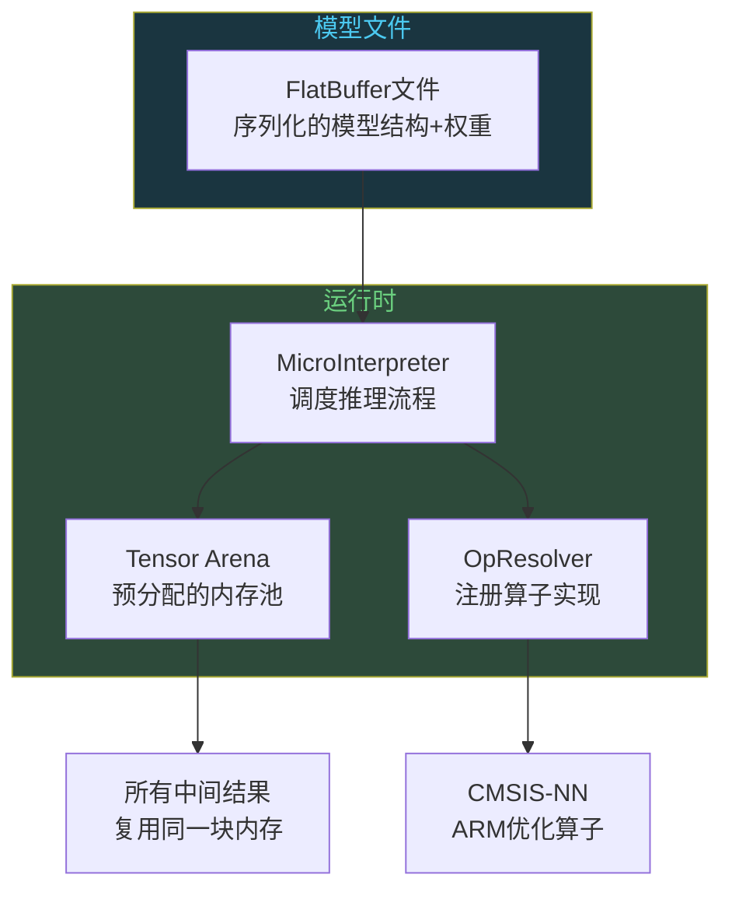
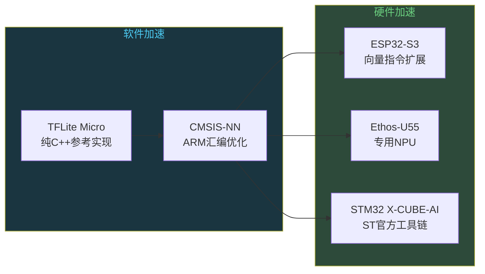

# AI推理上MCU：TFLite Micro怎么跑

```
╔══════════════════════════════════════════════╗
║  渡劫期 · 第167篇                              ║
║  AI推理上MCU：TFLite Micro怎么跑               ║
║  预计阅读：15分钟                              ║
╚══════════════════════════════════════════════╝
```

上一篇聊了Transformer训练为什么烧钱，推理为什么吃显存。GPT-3跑一次推理要几百GB显存，但世界上99%的芯片连1GB内存都没有。你家洗衣机里的MCU只有64KB RAM，空调遥控器只有几KB。这些小芯片能跑AI吗？能，但得把模型缩小一百倍，然后换一套完全不同的推理引擎。TFLite Micro就是Google为这个目的造的工具。

---

## 硬核主体

### 一、MCU的资源约束：一张桌子放不下大象

先看几个数字。STM32F103C8T6是嵌入式工程师用得最多的芯片之一，Flash 64KB，RAM 20KB。Arduino Nano 33 BLE Sense用的nRF52840算是MCU里的高端货，Flash 1MB，RAM 256KB。作为对比，一个7B参数的大模型INT4量化后要3.5GB。

差距不是一两个数量级，是四五个数量级。

这个量化不是把云端模型直接搬下来，MCU上需要从头设计一个能在几十KB内存里跑的小模型。这里有两个路线，一是把大模型压缩到MCU能放下的尺寸，二是从头训练一个小模型。工业界两种都在用，但MCU上更常见的是第二种。

```text
不同平台的AI推理资源对比：

平台              RAM         Flash       模型大小上限
STM32F103        20KB        64KB        ~20KB（极小型）
nRF52840          256KB       1MB         ~200KB
STM32H743         1MB+        2MB         ~500KB
ESP32-S3          512KB       8MB(片外)   ~1MB
树莓派4           4GB         SD卡        ~1GB(INT4)
NVIDIA Jetson     8GB         -           ~4GB
```

### 二、TFLite Micro架构：没有malloc的世界

TFLite Micro是TensorFlow Lite的微控制器版本。它的设计哲学跟PC端推理引擎完全不同，因为MCU上没有操作系统（大多数情况），没有动态内存分配，没有文件系统。

TFLite Micro的架构可以用四个组件概括。



第一个组件是FlatBuffer模型文件。TFLite用Google的FlatBuffers格式存模型，这种格式的好处是不需要解析，内存里直接读。FlatBuffer是一个序列化格式，类似于Protobuf但零拷贝，你不需要把文件解析成内存对象再访问，直接在文件的字节流上读数据。对MCU来说这很要紧，因为解析JSON或XML需要额外的内存buffer，FlatBuffer省了这一步。

第二个组件是MicroInterpreter，推理引擎。它拿到FlatBuffer文件后，按图的拓扑序依次执行每个算子。卷积做完做池化，池化做完做全连接，一层层往下推。整个推理过程是单线程的，没有并发。

第三个组件是Tensor Arena，这是TFLite Micro最有意思的设计。MCU上不能动态分配内存，所以TFLite Micro在初始化时分配一块连续的大buffer，所有中间计算结果都放在里面。比如第一层卷积的输出放在arena的开头，第二层用完第一层的输出后，覆盖掉同一块内存放自己的输出。这种复用策略让arena的尺寸远小于"所有中间结果加起来的总和"。

```cpp
// TFLite Micro 推理代码示例（C++）
#include "tensorflow/lite/micro/micro_interpreter.h"
#include "tensorflow/lite/micro/micro_mutable_op_resolver.h"
#include "tensorflow/lite/schema/schema_generated.h"

// 1. 模型文件（FlatBuffer格式，编译时嵌入固件）
//    person_detect_model_data 是模型权重的字节数组
extern const unsigned char person_detect_model_data[];
extern const int person_detect_model_data_len;

// 2. Tensor Arena —— 预分配的内存池
//    大小取决于模型，person detection模型大约需要136KB
constexpr int kTensorArenaSize = 136 * 1024;
uint8_t tensor_arena[kTensorArenaSize];  // 静态分配，不用malloc

// 3. 注册算子 —— 只编译需要的算子，省Flash
//    TFLite Micro不用动态注册，编译时就确定要哪些Op
using OpResolver = tflite::MicroMutableOpResolver<10>;
OpResolver resolver;
resolver.AddConv2D();      // 卷积层
resolver.AddDepthwiseConv2D();  // 深度可分离卷积
resolver.AddFullyConnected();  // 全连接层
resolver.AddSoftmax();    // 分类输出
resolver.AddReshape();    // 张量变形
resolver.AddAveragePool2D();  // 平均池化
// 只链接用到的算子，不用到的不会编译进固件

// 4. 创建Interpreter并推理
tflite::MicroInterpreter interpreter(
    tflite::GetModel(person_detect_model_data),
    resolver, tensor_arena, kTensorArenaSize);

// 分配输入输出张量
interpreter.AllocateTensors();

// 拿到输入张量指针，填入摄像头数据
TfLiteTensor* input = interpreter.input(0);
// input->data.int8 指向96x96的INT8图像数据
// 填入数据后执行推理
interpreter.Invoke();  // 跑一遍前向传播，同步返回

// 读取输出
TfLiteTensor* output = interpreter.output(0);
// output->data.int8[0] = person分数
// output->data.int8[1] = no_person分数
```

第四个组件是OpResolver。TFLite Micro不会把所有算子都编译进固件，你只注册模型用到的那些算子。这样做的原因是省Flash空间。一个完整的TFLite Micro可能支持上百种算子，但一个person detection模型只用到卷积、池化再加全连接这些。按需注册可以把算子代码体积压缩到几十KB。

### 三、INT8量化：精度和体积的取舍

TFLite Micro默认用INT8量化。一个浮点数占4字节，INT8只占1字节，模型体积直接缩小4倍。但量化不是简单地把float转成int，中间有几个技术问题。

训练后量化（Post-Training Quantization）是最简单的方案。你有一个训练好的FP32模型，用一批校准数据跑一遍，统计每层激活值的分布范围，然后把这个范围线性对应到INT8的[-128, 127]。代价是精度损失，一般INT8量化后准确率下降1%-3%。

```python
# 训练后量化示例（Python侧，在PC上完成）
import tensorflow as tf

# 加载FP32模型
converter = tf.lite.TFLiteConverter.from_saved_model("person_detect_fp32")

# 全INT8量化
converter.optimizations = [tf.lite.Optimize.DEFAULT]
# 提供校准数据让量化器统计激活值范围
def representative_dataset():
    for _ in range(100):
        data = np.random.rand(1, 96, 96, 1).astype(np.float32)
        yield [data]
converter.representative_dataset = representative_dataset
# 约束：所有算子都量化到INT8
converter.target_spec.supported_ops = [tf.lite.OpsSet.TFLITE_BUILTINS_INT8]
converter.inference_input_type = tf.int8
converter.inference_output_type = tf.int8

quantized_model = converter.convert()
# 保存为.tflite文件，直接烧进MCU
with open("person_detect_int8.tflite", "wb") as f:
    f.write(quantized_model)
```

量化感知训练（Quantization-Aware Training）更精确。在训练过程中就插入模拟量化的操作，让模型在训练阶段就适应量化带来的精度损失。做法是在每个权重和激活值后面加一个"假量化"节点，前向传播时模拟量化误差，反向传播时用直通估计（Straight-Through Estimator）传梯度。这样训出来的模型量化后精度损失更小，通常在0.5%以内。

对于MCU来说，INT8还有一个额外好处：计算速度快。ARM Cortex-M4F的DSP扩展指令能在一个时钟周期内做两次INT8乘加运算，Cortex-M7更多。而FP32的浮点运算虽然有FPU，但每条指令只能做一次乘加。所以INT8量化不仅省内存，还提速将近两倍。

### 四、Person Detection：一个真实的TinyML案例

Google的Pete Warden团队训练了一个person detection模型，专门用于在MCU上做人脸检测。这个模型的参数和资源占用如下：

```text
Person Detection模型（MobileNet v1变体）：

输入：96×96×1 灰度图像
输出：2个类别（person / no_person）
模型大小：约250KB（INT8量化后）
Tensor Arena：约136KB
总内存占用：约386KB

运行平台：Arduino Nano 33 BLE Sense
  - nRF52840，Cortex-M4F @ 64MHz
  - Flash 1MB，RAM 256KB
  - 模型存Flash（250KB占25% Flash）
  - Tensor Arena放RAM（136KB占53% RAM）
  - 推理时间：约1秒/帧
```

这个模型能在256KB RAM的芯片上跑起来，靠的是几个设计决策。输入分辨率只有96×96，不是224×224，计算量降了五倍。用灰度图不用RGB，输入通道数1代替3。用MobileNet的深度可分离卷积代替标准卷积，计算量降了八到九倍。深度可分离卷积把标准卷积拆成两步：先对每个通道单独卷积（depthwise），再用1×1卷积跨通道融合（pointwise）。计算量从O(H×W×C_in×C_out)降到O(H×W×C_in + H×W×C_in×C_out)，参数量也大幅减少。

推理一帧要1秒，对实时性要求高的应用不够用。但如果是"有人就拍照上传"这种低频检测，1秒一次足够了。

### 五、CMSIS-NN：ARM给你写的汇编加速

TFLite Micro在ARM Cortex-M上跑得快，不是因为C++代码写得好，是因为底层用了CMSIS-NN库。CMSIS-NN是ARM官方提供的神经网络算子优化库，用汇编写的，专门针对Cortex-M系列的DSP指令和SIMD指令做了优化。

```cpp
// CMSIS-NN的卷积实现（简化示意）
// 实际代码在arm_convolve_s8.c中

// 标准INT8卷积的C实现（没加速）：
// for each output pixel:
//   for each output channel:
//     for each input channel:
//       for each kernel position:
//         sum += input[i] * weight[w];  // 一次乘法一次加法
//       accumulator += sum;

// CMSIS-NN加速后的实现：
// 用SMLAD指令（Signed Multiply Add Dual）
// SMLAD把两个INT16打包后做乘加：
//   result = (int16_t)(input_low * weight_low)
//          + (int16_t)(input_high * weight_high)
//          + accumulator;
// CMSIS-NN把INT8数据打包成INT16对，用SMLAD一次处理两个乘加
// 循环次数减半，吞吐翻倍

// Cortex-M7还有SIMD指令，一次处理4个INT8
// arm_convolve_s8用im2col + GEMM策略
// 把卷积重排成批量乘法，然后批量处理
```

CMSIS-NN的卷积用了几种优化手段。一是im2col策略，把卷积的滑动窗口重排成二维乘法运算，这样可以用GEMM（通用乘法）的加速实现。二是双乘加指令SMLAD，一条指令做两次INT8乘加。Cortex-M7的四路SIMD更猛，一条指令处理四个INT8数据。三是循环展开和寄存器分配，减少内存读写次数。

没有CMSIS-NN的话，TFLite Micro用纯C++的参考实现，同一个person detection模型推理要十几秒。有CMSIS-NN加速后降到1秒。这就是为什么TFLite Micro在ARM平台上几乎成了标准选择。

### 六、新硬件趋势：MCU自带AI加速

软件优化有天花板，芯片厂商开始在硬件层面加速AI推理。

ESP32-S3是乐鑫2020年发布的芯片，自带向量指令扩展。普通ESP32跑神经网络很慢，因为没有专门指令做矩阵乘法。ESP32-S3加了类似SIMD的向量指令，能一次处理多个INT8数据。配合ESP-DL（乐鑫的深度学习库），ESP32-S3能跑MobileNet和YOLO等模型，推理速度比普通ESP32快好几倍。

Arm自己也在推NPU方案。Ethos-U55是Arm 2020年发布的微控制器NPU，跟Cortex-M55搭配使用。Cortex-M55本身的DSP能力就比M4强很多，加上Ethos-U55后，AI推理性能比纯Cortex-M4快几十倍。Ethos-U55的峰值算力可达0.5 TOPS（INT8），功耗在毫瓦级别。

ST也有自己的方案，X-CUBE-AI可以把PyTorch和TensorFlow模型转换成STM32上的C代码，直接编译进固件。X-CUBE-AI支持自动量化，能评估模型在不同STM32芯片上的内存占用和推理延迟。



### 七、嵌入式工程师在边缘AI中的位置

说了这么多技术，回到渡劫期的问题：嵌入式工程师在AI这波大潮里站在哪里？

云端AI是算法工程师的领地，训练模型，调超参，刷benchmark。但模型训好了，要落地到产品里，要跑在功耗受限的芯片上，内存也有限，成本还卡得死。这中间有巨大的工程鸿沟。这个鸿沟就是嵌入式工程师的价值所在。

一个AI功能从云端搬到MCU上，需要做几件事。模型量化，把FP32压到INT8，评估精度损失能否接受。算子适配，确认TFLite Micro或X-CUBE-AI支持模型用到的所有算子。内存规划，评估Tensor Arena大小，确认芯片RAM够用。性能调优，用CMSIS-NN或硬件加速缩短推理时间。功耗评估，推理期间CPU满载功耗多少，多久跑一次，电池能撑多久。

这些工作不需要你懂深度学习的数学推导，但需要你懂MCU架构，懂内存布局，懂编译工具链，懂功耗测量。这恰恰是元婴期修炼的功夫。

---

## 修仙术语对照表

| 修仙术语 | 技术现实 | 本篇位置 |
|---------|---------|---------|
| 灵兽袋 | FlatBuffer模型文件，把大模型压缩塞进MCU | 第二节 |
| 预分配灵田 | Tensor Arena，静态分配的推理内存池 | 第二节 |
| 算子注册 | OpResolver，只编译需要的算子省Flash | 第二节代码 |
| 炼体降阶 | INT8量化，FP32转INT8缩小4倍 | 第三节 |
| 假炼体 | 量化感知训练中的模拟量化节点 | 第三节 |
| 灵力翻倍 | CMSIS-NN用SMLAD指令双乘加加速 | 第五节 |
| 分身术 | 深度可分离卷积拆成depthwise加pointwise两步 | 第四节 |
| 硬件灵脉 | ESP32-S3向量指令/Ethos-U55 NPU | 第六节 |
| 工程鸿沟 | AI落地到MCU的模型量化/算子适配/内存规划 | 第七节 |
| 灵力天花板 | 软件优化有极限，需要硬件加速 | 第六节 |

---

## 进阶条件

- [ ] 能说出TFLite Micro的四个组件（FlatBuffer/Interpreter/Tensor Arena/OpResolver）各自的用途
- [ ] 知道为什么MCU上不能用malloc，TFLite Micro怎么解决中间结果的内存分配
- [ ] 能解释INT8训练后量化和量化感知训练的区别，各自精度损失大约多少
- [ ] 理解深度可分离卷积为什么比标准卷积快八到九倍，能说出计算量差异
- [ ] 知道CMSIS-NN用什么指令加速INT8卷积，为什么比纯C实现快十几倍
- [ ] 能估算一个给定大小的模型在特定MCU上能否跑（Flash够不够，RAM够不够，Tensor Arena多大）
- [ ] 能说出嵌入式工程师在边缘AI落地中需要做的五件事

下一篇我们看AI芯片的战争。NPU和TPU怎么跟MCU结合，嵌入式工程师面对的是一个新的硬件赛道。

---

## 下期预告

**第168篇：AI和嵌入式：算力芯片的战争**

NPU/TPU/边缘AI芯片的市场版图，嵌入式工程师在AI时代的硬件赛道上有哪些新选择，国产AI芯片走到哪一步了。

你做过在MCU上跑AI的项目吗，最大的坑是什么？评论区聊聊。

我是玄芯散人，带你从炼气修到大乘。

---

*本文是「码农修仙传」系列第167篇。系列导航见 [xren.ren](https://xren.ren)*
