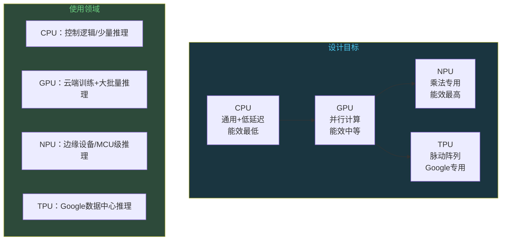
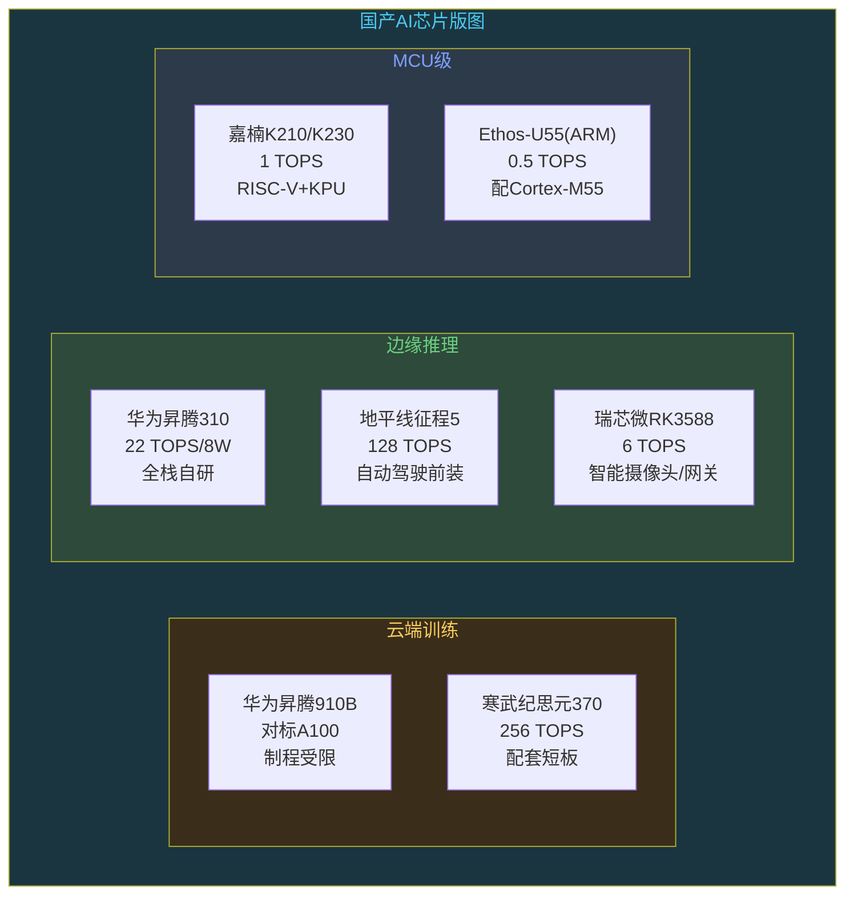

# AI和嵌入式：算力芯片的战争

```
╔══════════════════════════════════════════════╗
║  渡劫期 · 第168篇                              ║
║  AI和嵌入式：算力芯片的战争                    ║
║  预计阅读：14分钟                              ║
╚══════════════════════════════════════════════╝
```

上一篇聊了TFLite Micro怎么在256KB RAM的MCU上跑AI推理。但软件优化终有天花板，真正把AI推理拉到设备端的，是专用算力芯片的爆发。NPU、TPU、LPU，各种新名词层出不穷。这背后是一场几千亿美元的芯片战争，而嵌入式工程师站在战场最前线。因为每一颗AI芯片最终都要装进某个设备里，都需要有人写固件适配，都需要有人做功耗测量和板级调试。

---

## 硬核主体

### 一、为什么CPU和GPU不够用

AI推理的大头计算是乘加运算。一个全连接层就是输入向量乘权重矩阵，一个卷积层展开后也是乘法。CPU的设计目标是通用性和低延迟，它的ALU擅长标量运算和分支跳转。让CPU做批量乘加，等于让短跑运动员去搬砖，能搬但效率低。CPU的浮点单元一次处理一个或几个乘加运算，而AI推理需要的是成千上万次并行乘加。

GPU好很多。GPU有成百上千个并行计算核心，适合大批量乘法。但GPU也是通用图形处理器，它的设计要兼顾图形渲染和计算，有大量晶体管花在纹理采样和光栅化这些AI用不到的功能上。用GPU跑AI推理，利用率通常只有30%到60%，剩下的晶体管在空转。

更要命的是功耗。一颗NVIDIA A100 GPU的TDP是400瓦，一张卡比你家台式电脑整机功耗还高。边缘设备不可能扛这种功耗。一个智能摄像头的功耗预算是2到5瓦，一个门锁的电池供电设备功耗预算只有几十毫瓦。CPU和GPU在功耗约束面前完全无解。

```text
不同处理器的AI推理能效对比：

处理器              峰值算力        功耗      能效(TOPS/W)
CPU (Cortex-A78)    ~0.1 TOPS      5W        ~0.02
GPU (Mali-G78)      ~1 TOPS        5W        ~0.2
GPU (A100)          312 TFLOPS      400W      ~0.78
NPU (Ethos-U55)     0.5 TOPS        <1W       ~0.5+
NPU (RK3588)        6 TOPS          ~5W       ~1.2
TPU (v4)            275 TFLOPS      200W      ~1.4
```

能效这个指标很能说明问题。CPU的0.02 TOPS/W意味着每瓦只能做0.02万亿次运算，NPU能到1以上，差了50倍。这就是为什么AI推理需要专用芯片。

### 二、NPU、GPU、TPU：三种设计哲学

三种芯片的设计思路完全不同，对应不同的用途。

NPU（Neural Processing Unit）是专门为神经网络推理设计的加速器。它的计算单元是乘加阵列（MAC Array），一堆乘法器和加法器排成网格，一个时钟周期内并行计算几十到几百个乘加。NPU不需要通用性，它只做一件事：把乘法运算跑到极致。因为功能单一，NPU的能效比远高于GPU。Arm的Ethos-U55面向MCU，0.5 TOPS，功耗在毫瓦级别。瑞芯微RK3588的NPU面向边缘网关，6 TOPS，INT8精度。华为昇腾310面向边缘AI，22 TOPS INT8，功耗8瓦。

GPU走的是另一条路。GPU不是AI专用芯片，但它的并行计算设计碰巧适合批量乘法。NVIDIA把GPU的AI计算能力榨到了极致，用Tensor Core做混合精度乘法。A100的一张卡有312 TFLOPS的FP16算力，H100更是到了989 TFLOPS。GPU的优势是通用性和配套体系。CUDA配套体系积累了十几年，几乎所有AI框架都原生支持。NPU要适配新模型新算子，GPU直接跑。

TPU是Google的专属方案。TPU全称Tensor Processing Unit，Google在2016年公开了第一代TPU，专门给自家的TensorFlow推理加速。TPU的招牌设计是 systolic array（脉动阵列），一个二维的乘加阵列，数据像波浪一样流入再流出，中间每个计算单元只做乘加，不做内存读写。这种设计把数据搬运次数压到最低，能效比极高。TPU v4的峰值算力275 TFLOPS（BF16），能效约1.4 TOPS/W。但TPU是Google内部使用的，外部开发者只能通过Google Cloud租用，买不到物理卡。



### 三、边缘AI芯片的算力梯队

数据中心到MCU之间，AI算力芯片分四个梯队。每个梯队的功耗和价格差几个数量级，对应不同产品。

第一梯队是数据中心级。NVIDIA H100，Google TPU v4，华为昇腾910B。这些芯片单颗功耗200瓦以上，算力几百TFLOPS，用于大模型训练和云端推理。一颗H100的价格在3万美元左右。这个梯队跟嵌入式工程师没什么关系，但决定了云端AI的算力天花板。

第二梯队是边缘服务器级。NVIDIA Jetson AGX Orin（275 TOPS），华为昇腾310（22 TOPS）。功耗10到60瓦，用于机器人和自动驾驶的域控制器。价格在几百到几千美元。地平线征程5也在这个梯队，128 TOPS INT8，功耗约25瓦，用在自动驾驶前装量产车上。

第三梯队是边缘网关级。瑞芯微RK3588（6 TOPS），NVIDIA Jetson Orin Nano（40 TOPS）。功耗5到15瓦，用在智能摄像头以及工业质检设备和机器狗上。价格几十到一两百美元。这个梯队是目前边缘AI竞争最激烈的市场。

第四梯队是MCU级。Arm Ethos-U55（0.5 TOPS），嘉楠K210（1 TOPS），STM32N6（约600 GOPS）。功耗几毫瓦到几百毫瓦，用在智能门锁以及语音遥控器和可穿戴设备上。价格1到5美元。这个梯队是嵌入式工程师的主场。

```text
边缘AI芯片算力梯队：

梯队      代表芯片            算力         功耗       价格区间
数据中心   H100/TPU v4        275+ TFLOPS  200W+      $30000+
边缘服务器  昇腾310/征程5      22-128 TOPS  8-25W      $200-2000
边缘网关   RK3588/Orin Nano   6-40 TOPS    5-15W      $50-200
MCU级     Ethos-U55/K210     0.5-1 TOPS   <1W        $1-5
```

梯队之间的差异不只是算力数字。数据中心级芯片有高带宽内存（HBM），带宽达到几个TB/s，因为大模型推理的瓶颈往往在内存带宽而不在算力。MCU级芯片没有HBM，权重存在片内Flash或外挂SPI Flash里，推理时按需加载到SRAM。这种设计差异决定了你能跑多大的模型，跑多快。

### 四、国产AI芯片走到哪一步了

AI芯片是国产替代最热闹的赛道之一。华为、地平线、寒武纪、嘉楠、瑞芯微，各家路线不同，各有各的活法。

华为昇腾系列是国产AI芯片里规格最高的。昇腾910B用于训练，对标NVIDIA A100和H100。昇腾310用于推理，22 TOPS INT8，功耗8瓦，主打边缘场景。华为的优势是自研达芬奇设计，不依赖Arm的IP，芯片到工具（MindSpore）到云服务全栈自研。受限的地方是美国制裁导致先进制程拿不到，7nm以下工艺受限。

地平线专注自动驾驶AI芯片。征程5是2021年发布的，128 TOPS INT8，采用自研伯努利设计。征程6在2024年发布，BPU设计升级，算力进一步提高。地平线的商业模式跟其他家不同，它不只卖芯片，还卖算法和参考设计，帮车厂做前装量产。比亚迪和理想以及长安都用过地平线的方案。自动驾驶是AI芯片里商业化最清晰的赛道，因为需求明确，算力要求高，单价也高。

寒武纪走的是通用AI芯片路线。思元370是2021年发布的云端推理芯片，256 TOPS INT8。寒武纪的定位跟NVIDIA竞争，但在CUDA配套体系面前竞争力有限。通用AI芯片市场跟自动驾驶不同，客户更看重配套兼容性，而CUDA的壁垒极高。

嘉楠科技的K210是国产AI芯片里最接地气的。它是一颗RISC-V芯片，自带KPU（神经网络处理器），1 TOPS INT8算力，价格只有十几块钱人民币。K210在教育机器人和门禁市场很受欢迎，因为便宜，有大量开源教程。嘉楠后来出了K510和K230，算力逐步提高。

瑞芯微的RK3588是边缘网关级别的主流选择。6 TOPS的NPU支持INT8/INT16/FP16，三路NPU可以独立使用或联合使用。RK3588在智能摄像头和工业质检以及机器人领域用得很多，因为它的CPU（4xA76+4xA55）性能也不错，能同时跑AI推理和业务逻辑。



### 五、嵌入式工程师的AI硬件选型

选AI芯片不是看TOPS数字谁大就买谁。有几个方面要综合考量。

算力够不够。先确定你的模型有多大，推理延迟要求多少。一个YOLOv8 Nano模型INT8量化后大约4MB，在6 TOPS的NPU上推理一帧约30毫秒。如果你的产品要求30FPS实时检测，30毫秒刚好够用。如果用0.5 TOPS的Ethos-U55，同一模型推理要几百毫秒，做不到实时。

内存带宽够不够。很多人忽略这个问题。AI推理时权重要经过Flash或DDR读到NPU里，如果带宽不够，NPU算力再高也喂不饱。RK3588的DDR4带宽约25GB/s，跑中型模型绰绰有余。MCU级芯片没有DDR，权重经SPI Flash读取，带宽只有几十MB/s，这才是MCU上跑大模型的真正瓶颈。

功耗预算。电池供电设备看平均功耗，不是峰值。一次推理可能只耗几百毫焦，但如果每秒推一次，一天就是86400次，电池续航会大幅缩短。需要算一个简单账：推理功耗乘以频率乘以工作时间，加上待机功耗，看电池能撑多久。

工具链成熟度。这可能是最实际的考量。NVIDIA的Jetson系列有全套SDK和文档，TensorRT优化管线成熟，部署模型相对顺畅。国产芯片的工具链参差不齐，有些芯片TOPS数字漂亮但文档稀烂，量化工具bug多，算子支持不全，调一个模型部署要折腾两周。选型前先去GitHub看有没有活跃的社区和issue列表，比看Datasheet管用。

价格和供货。消费电子对BOM成本极其敏感。一颗带NPU的MCU由1美元涨到3美元，乘以百万出货量就是200万美元的差价。国产芯片在价格上有优势，但供货稳定性需要评估。芯片缺货的时候，有没有Pin-to-Pin的替代料，能不能切换到第二供应商，这些都是量产前要想清楚的。

```c
// 嵌入式AI芯片选型决策清单（伪代码）
struct ai_chip_selection {
    // 1. 算力需求
    float model_flops;        // 模型计算量，单位MAC
    float target_latency_ms;  // 目标推理延迟
    float required_tops;      // = model_flops * 2 / (target_latency_ms * 1e-3) / 1e12
    
    // 2. 内存需求
    int model_size_kb;        // 量化后模型大小
    int working_buffer_kb;    // 推理中间结果内存
    int available_ram_kb;     // 芯片可用RAM
    int available_flash_kb;   // 芯片可用Flash
    
    // 3. 功耗预算
    float inference_power_mw; // 单次推理功耗
    int inference_freq_hz;    // 推理频率
    float battery_capacity_mah;
    float target_lifetime_h;  // 目标续航小时数
    
    // 4. 工具链评估
    bool quantization_tool_ok;    // 量化工具可用
    bool supported_ops_all;       // 模型算子全支持
    int community_activity;       // 社区活跃度
    int doc_quality;              // 文档质量评分1-10
    
    // 5. 商业因素
    float unit_price;          // 单价
    bool second_source;        // 有无第二供应商
    int lead_time_weeks;       // 交期
};
```

### 六、算力芯片战争的终局

这场芯片战争还远没到终局。几个动向值得关注。

第一个动向是NPU IP化。Arm推出Ethos-U系列NPU IP核，芯片厂商可以像买Cortex-M内核一样买NPU IP集成到自己的SoC里。这意味着未来会有越来越多自带NPU的MCU出现，AI加速不再是高端芯片的专属。Cortex-M55搭配Ethos-U55的组合，让传统MCU厂商也能出AI芯片。

第二个动向是RISC-V向量扩展。RISC-V的V扩展提供了向量指令，理论上可以加速AI计算中的乘加运算。虽然目前支持V扩展的硬件性能还比不上专用NPU，但RISC-V的开源特性意味着任何人都可以在其上添加自定义指令做AI加速。平头哥的玄铁系列已经在做这件事。

第三个动向是存算一体。传统设计里，计算和存储是分开的，数据在DDR和NPU之间来回搬，搬运的功耗有时候比计算还高。存算一体把计算单元嵌到存储阵列里，直接在SRAM或ReRAM里做乘法，省掉了数据搬运。这个方向还在学术研究到早期产品化的阶段，距离大规模商用还有几年。

第四个动向是AI芯片跟传感器合并。不是所有AI推理都需要跑整个模型。智能传感器可以在采集端做特征提取，只把有用的数据传到MCU。比如带AI加速的图像传感器，在传感器内部就做完人脸检测，只输出检测结果坐标。这种设计大幅降低了对MCU算力和带宽的需求。

对嵌入式工程师来说，这些动向意味着什么？你不需要成为AI算法专家，但你需要知道怎么选AI芯片，怎么把模型部署到不同设计的NPU上，怎么评估功耗和延迟。这些技能在接下来几年会越来越值钱。因为AI部署的最后一公里在设备端，在固件里，在PCB上。云端算法工程师搭好了模型，但模型不会自己跑到芯片上。中间这座桥，需要嵌入式工程师来造。

---

## 修仙术语对照表

| 修仙术语 | 技术现实 | 本篇位置 |
|---------|---------|---------|
| 算力战争 | NPU/GPU/TPU三家争夺AI推理市场 | 第一节/第二节 |
| 搬砖短跑运动员 | CPU做乘加运算效率低，ALU擅长标量运算 | 第一节 |
| 通用功法 | GPU兼顾图形渲染和计算，利用率30%-60% | 第一节 |
| 专用法器 | NPU的MAC阵列专门做乘法 | 第二节 |
| 脉动阵法 | TPU的systolic array，数据波浪式流动 | 第二节 |
| 算力梯队 | 数据中心到MCU的四层芯片分级 | 第三节 |
| 灵脉等级 | 数据中心/边缘服务器/边缘网关/MCU级 | 第三节 |
| 自研内功 | 华为达芬奇设计全栈自研 | 第四节 |
| 前装量产 | 地平线帮车厂做自动驾驶方案落地 | 第四节 |
| 性价比修士 | 嘉楠K210十几块钱做AI推理 | 第四节 |
| 选材法眼 | AI芯片选型五方面（算力/带宽/功耗/工具链/价格） | 第五节 |
| 功法适配 | 量化工具和算子支持决定部署难度 | 第五节 |
| NPU灵脉化 | Arm Ethos-U IP核让MCU厂商都能出AI芯片 | 第六节 |
| 存算合一 | 存算一体设计省掉数据搬运功耗 | 第六节 |
| 最后一公里 | AI部署到设备端需要嵌入式工程师搭桥 | 第六节 |

---

## 进阶条件

- [ ] 能说出CPU和GPU以及NPU在AI推理上的能效差异及原因（TOPS/W对比）
- [ ] 知道TPU的systolic array设计原理，为什么能效比GPU高
- [ ] 能列出边缘AI芯片四个梯队的代表芯片和各自算力与功耗范围
- [ ] 能说出至少三家国产AI芯片厂商及其产品定位差异
- [ ] 做AI芯片选型时能评估算力和内存带宽以及功耗和工具链以及价格五个方面
- [ ] 知道MCU上跑AI的瓶颈在内存带宽而不在算力，能解释原因
- [ ] 能说出存算一体设计跟传统设计的区别，为什么能省功耗

下一篇把视角拉回嵌入式工程师自身。Rust语言正在重写Linux内核的驱动层，嵌入式世界是否也要迎来一场内存安全的革命？

---

## 下期预告

**第169篇：Rust重写万物：系统编程的新趋势**

Rust的内存安全保证，为什么Linux内核开始接受Rust，嵌入式能用Rust吗，目前到底走到了哪一步。

你觉得嵌入式开发有必要换Rust吗？还是C语言够用了？评论区说说你的看法。

我是玄芯散人，带你从炼气修到大乘。

---

*本文是「码农修仙传」系列第168篇。系列导航见 [xren.ren](https://xren.ren)*
