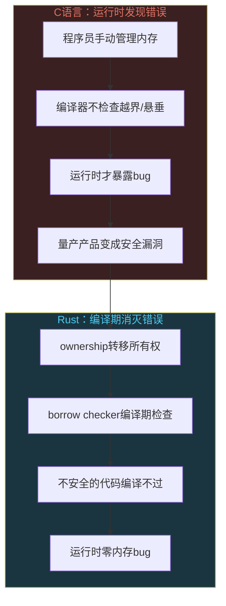
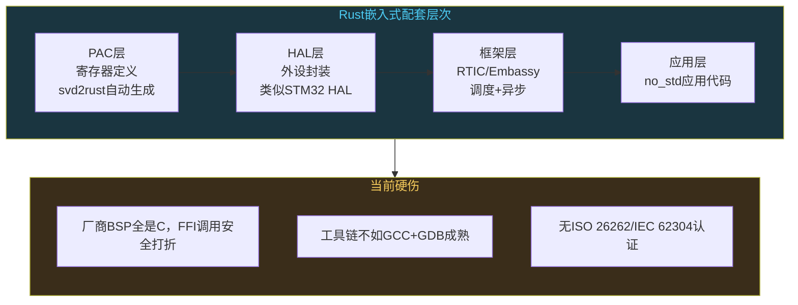

# Rust重写万物：系统编程的新趋势

```
╔══════════════════════════════════════════════╗
║  渡劫期 · 第169篇                              ║
║  Rust重写万物：系统编程的新趋势                 ║
║  预计阅读：15分钟                              ║
╚══════════════════════════════════════════════╝
```

修仙界每隔几十年就要传一次"改朝换代"。2022年底Linus Torvalds把Rust代码合并进Linux 6.1内核，是系统编程世界三十年来最大的一次地壳运动。微软说他们70%的安全漏洞都跟内存有关，Google说Android新代码全部改用内存安全语言之后漏洞数量断崖式下跌。C语言统治了嵌入式和系统编程半个世纪，现在Rust要来动它的底盘。这一篇不教Rust语法，聊聊Rust到底解决了什么问题，Linux内核为什么接受它，嵌入式工程师该不该上车。

---

## 硬核主体

### 一、C语言的内存隐患到底有多严重

先看一组数据。微软在2019年公开了一项统计：过去十几年里，Windows操作系统安全公告（CVE）中大约70%的漏洞跟内存安全有关。这包括缓冲区溢出，释放后使用（use-after-free），双重释放，空指针解引用，未初始化变量。Google在2020年发布了类似的数据：Android系统约70%的高危安全漏洞同样是内存安全问题。

这些数字背后是一个事实：C语言把内存管理的权力完全交给了程序员，但程序员会犯错。C编译器不检查数组越界，不检查悬垂指针，不检查数据竞争。这些问题在运行时才暴露，很多时候在测试阶段发现不了，到了量产产品里被触发就是安全漏洞。

看一段典型的C代码，三种写法都能编译通过，但只有一种是安全的：

```c
// 写法A：返回栈上局部变量的地址，悬垂指针
char* get_name(void) {
    char name[32] = "hello";
    return name;  // 函数返回后name所在栈帧被回收，指针悬垂
}

// 写法B：分配堆内存但忘记释放，内存泄漏
char* get_name2(void) {
    char* p = malloc(32);
    strcpy(p, "hello");
    return p;  // 调用者如果忘记free就泄漏
}

// 写法C：调用者负责释放，正确但依赖人工约定
char* get_name3(void) {
    char* p = malloc(32);
    strcpy(p, "hello");
    return p;  // 约定：调用者必须free
}
```

C语言里这样的隐患无处不在。写法C是"正确"的，但正确的前提是每个调用者都记得free，且不会在free之后继续使用指针。在一个有几十万行代码的项目里，这条约定靠人工审查来保证，出错概率不低。MISRA C规范用上百条规则来约束C代码的写法，但规则再多也没法在编译期消灭所有内存错误。

### 二、Rust的ownership机制怎么解决内存安全

Rust用一套编译期检查机制，把C语言运行时才发现的内存错误提前到编译阶段。这套机制叫ownership（所有权），配合borrow checker（借用检查器）工作。

三条规则。第一，每个值有且只有一个owner（所有者变量）。第二，owner离开作用域时值被自动释放。第三，可以借用（borrow），但借用规则是：要么有多个不可变借用（&T，允许同时读），要么只有一个可变借用（&mut T，独占写）。这两条不能同时存在。

```rust
// Rust的ownership在编译期消灭上面三种C错误

fn get_name() -> String {
    let name = String::from("hello");
    name  // 所有权转移到调用者，name离开作用域但不会释放
}

fn main() {
    let s1 = get_name();  // s1持有"hello"的所有权
    
    // 不可变借用，可以有多个
    let r1 = &s1;  
    let r2 = &s1;  // 同时多个不可变借用，没问题
    
    // 可变借用，必须独占
    let mut s2 = String::from("world");
    let r3 = &mut s2;  // 独占借用
    // let r4 = &mut s2;  // 编译错误：不能同时有两个可变借用
    
    // r3使用完后，s2的所有权仍然有效
    // 离开作用域时自动释放，不需要free
}
```

这段代码在编译期就保证了：不会悬垂指针（所有权转移后原变量不能使用），不会双重释放（只有一个owner负责释放），不会数据竞争（可变借用独占）。编译器在编译阶段检查每个变量的生命周期，如果发现潜在问题直接报错，不生成可执行文件。

这套机制的代价是编译速度慢（编译器要做大量生命周期分析），学习曲线陡（borrow checker的报错信息对新手不友好）。但换来的是运行时零开销，没有垃圾回收，没有引用计数，性能跟C相当。



### 三、Linux内核为什么接受Rust

Linux内核从1991年诞生到2021年，三十年间只有C一种语言。2021年Linus Torvalds宣布接受Rust进入内核，2022年12月发布的Linux 6.1是第一个包含Rust代码的正式内核版本。

推动这件事的背景是内核安全。Linux内核漏洞统计跟用户态类似，大约三分之二到四分之三的安全漏洞是内存安全问题。内核驱动代码占了内核代码量的大头，也是bug重灾区。驱动开发者水平参差不齐，很多驱动只跑在特定硬件上，测试覆盖率低。用Rust写新驱动，理论上可以在编译期消灭整类内存错误。

Linux 6.1引入的Rust支持还是实验性的，只有基础设施和几个示例驱动。后续版本逐步加码。Linux 6.2到6.8期间，社区陆续推进了Rust版的NVMe驱动抽象层、Apple Silicon GPU驱动（AGX）等。这些驱动在功能上跟C版本对等，但代码量更少，内存安全由编译器保证。

但过程不顺利。2024年，Rust-for-Linux项目的贡献者Wedson Almeida Filho因为跟C维护者的技术分歧不再担任活跃维护者角色。分歧的焦点是：Rust代码要不要调用现有的C内核API。如果调用，Rust的安全保证就打折扣（因为C代码不安全）。如果不调用，就要用Rust重写大量内核基础设施，工作量巨大。这个矛盾到2025年仍在拉锯。

Linus Torvalds的态度比较务实。他没有要求用Rust重写整个内核，只是允许新驱动用Rust写。存量C代码不动，增量部分用Rust。这是一个渐进策略，先让新代码享受内存安全，老代码等自然淘汰。

```text
Rust进入Linux内核的时间线：

2019年  Rust-for-Linux项目启动
2021年  Linus Torvalds表态接受Rust
2022年  Linux 6.1合并初始Rust支持
2023年  Linux 6.2-6.4 Rust驱动框架逐步完善
2024年  Apple GPU驱动、NVMe驱动等Rust版本合并
        Wedson Almeida Filho退出项目
2025年  Rust内核支持持续推进，但C/Rust接口争议持续
```

### 四、Rust在嵌入式领域的现状

嵌入式是C语言的地盘。STM32的HAL库，ESP-IDF，FreeRTOS，Zephyr，全是C写的。Rust想进嵌入式，得先解决一个问题：在没有操作系统、没有标准库的裸机环境怎么跑。

Rust的no_std属性就是干这个的。标记了`#![no_std]`的Rust代码不链接标准库，只依赖core库（提供基本类型和trait），可以在裸机环境编译运行。配合交叉编译工具链，Rust可以生成ARM Cortex-M和RISC-V的目标代码。

目前Rust嵌入式配套有几个层次。底层是PAC（Peripheral Access Crate），直接对应芯片寄存器，类似C的CMSIS头文件，可以用svd文件自动生成。中间层是HAL crate，封装寄存器操作，提供高层API，类似STM32的HAL库。上层是框架，RTIC（Real-Time Interrupt-driven Concurrency）是一个基于优先级的抢占式调度框架，Embassy是一个异步运行时框架。

```rust
// Rust嵌入式点灯示例（STM32，使用stm32f4-hal）
#![no_std]
#![no_main]

use stm32f4xx_hal as hal;  // 引入HAL库
use hal::{prelude::*, pac};  // prelude导入常用trait
use panic_halt as _;  // panic处理

#[cortex_m_rt::entry]  // 程序入口，类似C的main
fn main() -> ! {
    let dp = pac::Peripherals::take().unwrap();  // 获取外设
    let gpioc = dp.GPIOC;  // GPIOC端口
    let rcc = dp.RCC;  // 时钟控制
    
    // 配置PC13为推挽输出（STM32F4 Discovery的LED在PC13）
    gpioc.rcc_bus().enable().unwrap();  // 开启GPIOC时钟
    let led = gpioc.pc13.into_push_pull_output();
    
    loop {
        led.set_high();  // 灭
        cortex_m::asm::delay(8_000_000);  // 延时
        led.set_low();   // 亮
        cortex_m::asm::delay(8_000_000);  // 延时
    }
}
```

ESP32的Rust配套更活跃一些。esp-rs项目组维护了ESP32-C3/C6的Rust支持，包括Wi-Fi驱动和异步运行时。乐鑫官方也开始关注Rust，2024年ESP-IDF的构建系统增加了对Rust组件的实验性支持。

但Rust嵌入式有几个硬伤。第一，芯片厂商的BSP（板级支持包）全是C写的，Rust要么通过FFI调用C代码（安全保证打折），要么等社区重写（慢）。第二，工具链不完善。Rust的交叉编译和调试体验不如GCC+GDB成熟，某些MCU芯片型号的target还不稳定。第三，安全认证缺失。汽车ISO 26262、医疗IEC 62304等安全标准对工具有认证要求，Rust编译器目前没有通过这些认证，不能用于ASIL-D级别的安全要紧系统。



### 五、Google和微软为什么用Rust

大厂的Rust战略不是跟风，是算过账的。

微软的动机最直接。Windows安全公告里70%是内存安全漏洞，修复一个CVE的成本包括工程师工时，补丁测试，分发部署，用户支持。如果能用一门编译期保证内存安全的语言写新代码，这些漏洞在源头就消失了。微软2023年宣布在Windows内核的部分组件中开始使用Rust，比如DWriteCore（DirectWrite的文字渲染引擎）已经用Rust重写。

Google的步子更大。Android从12版本开始引入Rust，最初是Binder IPC和部分驱动。2023年Google宣布Android所有新代码优先使用内存安全语言（Rust或Kotlin），不再接受新的C/C++代码进入Android Open Source Project（除非有特殊理由）。2024年Google发布数据：Android 14的内存安全漏洞比Android 12减少了52%，这个下降跟新代码用Rust直接相关。

```text
Android内存安全漏洞变化：

Android 12 (2021)  → 基准线，大量C/C++新代码
Android 13 (2022)  → 新代码开始用Rust，漏洞下降
Android 14 (2023)  → 内存安全漏洞比12减少52%
                    Google归因：新代码不用C/C++

注意：存量C/C++代码不动，漏洞减少来自增量
```

AWS，Cloudflare，Meta也在用Rust写基础设施组件。AWS的Firecracker（轻量虚拟机监控器）用Rust写，Cloudflare的quiche（QUIC协议实现）用Rust写，Meta用Rust写了几个后端服务。这些公司选Rust的原因不是"喜欢"，是因为内存安全漏洞在线上环境的代价太高了。一次内存安全漏洞可能导致远程代码执行，后果是数据泄露和服务中断。

### 六、Rust重写一切？冷静看看

"Rewrite it in Rust"是技术社区的一句梗。不是所有东西都需要重写，也不是所有情况Rust都合适。

C语言存量代码的体量是天文数字。Linux内核有3000万行C代码，仅靠Rust重写不现实，也没人在做这件事。Torvalds的渐进策略是正确的：新代码可以选Rust，老代码不动。驱动生命周期到了自然淘汰的时候，用Rust重写；还在服役的C驱动没必要折腾。

嵌入式领域的现实更骨感。一颗STM32芯片的工程代码可能就几万行，用C写得好好的一直在量产，没有动机重写。Rust在嵌入式最大的机会是新产品开发时从一开始就用Rust，而不是把现有产品翻一遍。目前这样做的人不多，因为芯片厂商的SDK，RTOS，中间件全是C，用Rust就要重新搭一套工具链，投入产出比不划算。

Rust自己也有问题。编译速度慢是老大难，一个中型项目编译时间比C长好几倍。学习曲线陡，borrow checker的报错信息让初学者头疼。语言本身在快速迭代，edition机制每三年一次大更新，不稳定因素存在。async/await在嵌入式no_std环境的支持还不完善，Embassy虽然在推进但远没到C语言那种稳定程度。

对嵌入式工程师来说，务实的策略是：关注Rust但不急上车。如果你的产品是安全要紧的系统（汽车、医疗），Rust的内存安全优势确实有用，但要等工具链和认证配套成熟。如果是普通IoT设备，C语言够用，没有切换的紧迫性。学一点Rust了解它的ownership机制和borrow checker怎么工作，对写好C代码也有帮助。至少你会开始注意自己的代码里哪些地方可能悬垂指针，哪些地方可能数据竞争。

---

## 修仙术语对照表

| 修仙术语 | 技术现实 | 本篇位置 |
|---------|---------|---------|
| 改朝换代 | Rust动摇C语言在系统编程的统治地位 | 开篇 |
| 内存隐患 | C语言70%安全漏洞跟内存安全有关 | 第一节 |
| 悬垂指针 | C返回栈变量地址，函数返回后栈帧回收 | 第一节 |
| 所有权转移 | Rust的ownership规则，值只有一个owner | 第二节 |
| 借用检查器 | borrow checker编译期检查生命周期 | 第二节 |
| 编译期消灾 | Rust在编译阶段消灭内存错误，不等运行时 | 第二节 |
| 内核准入 | Linux 6.1合并Rust支持 | 第三节 |
| 渐进策略 | 新代码用Rust，存量C代码不动 | 第三节 |
| 裸机修炼 | no_std属性让Rust在无OS环境运行 | 第四节 |
| 寄存器功法 | PAC层用svd2rust自动生成寄存器定义 | 第四节 |
| 板级法器 | HAL crate封装外设操作 | 第四节 |
| 调度心法 | RTIC抢占式调度框架 | 第四节 |
| 认证缺失 | Rust无ISO 26262/IEC 62304安全认证 | 第四节 |
| 增量替换 | Android新代码用Rust，存量不动 | 第五节 |
| 源头封印 | 编译期消灭内存漏洞降低线上CVE | 第五节 |

---

## 进阶条件

- [ ] 能说清楚C语言的三大内存隐患（缓冲区溢出，释放后使用，数据竞争），以及为什么编译器在编译期发现不了
- [ ] 能解释Rust的ownership三规则，以及borrow checker怎么在编译期保证内存安全
- [ ] 知道Linux内核从6.1版本开始接受Rust，能说出渐进策略的含义（新代码用Rust，存量不动）
- [ ] 了解Rust嵌入式配套的四个层次（PAC，HAL，RTIC/Embassy，应用层），知道no_std是什么
- [ ] 能说出Rust在嵌入式领域的三个硬伤（厂商BSP全是C，工具链不成熟，无安全认证）
- [ ] 知道Google Android和Microsoft Windows各自用Rust做了什么，以及为什么
- [ ] 能判断自己的项目该不该用Rust重写，给出至少两个考量因素（不是"喜欢"或"不喜欢"）

下一篇聊量子计算。量子比特，叠加态，量子纠缠，量子计算机到底能干什么，离实用还有多远。经典计算的极限和量子计算的可能，我们看看这道边界在哪。

---

## 下期预告 + 互动

**第170篇：量子计算：下一个计算革命**

量子比特和经典比特有什么不同，叠加和纠缠到底是什么，量子计算能用在什么地方，离商业化还有几年还是几十年。

你觉得量子计算会在十年内改变普通程序员的工作吗？还是说它跟嵌入式工程师没什么关系？评论区说说你的判断。

我是玄芯散人，带你从炼气修到大乘。

---

*本文是「码农修仙传」系列第169篇。系列导航见 [xren.ren](https://xren.ren)*
