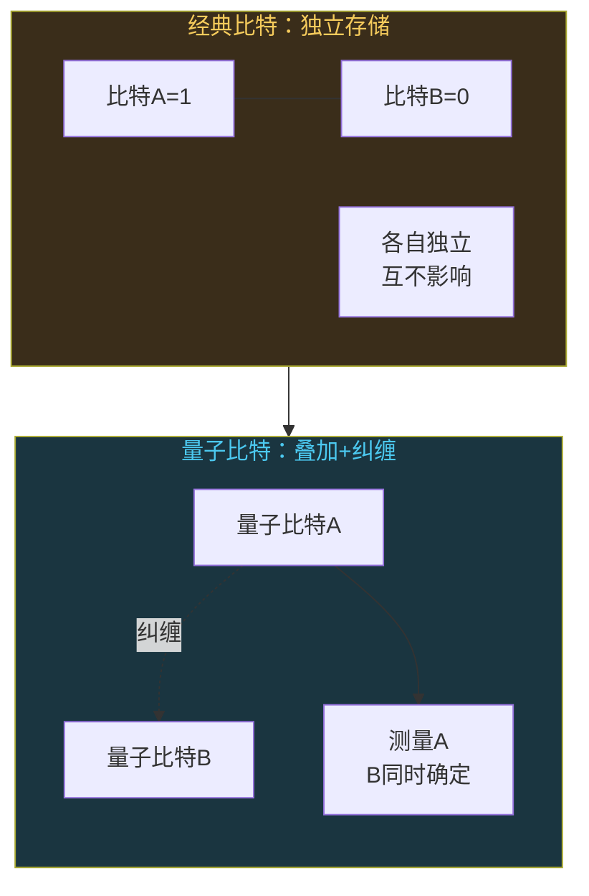
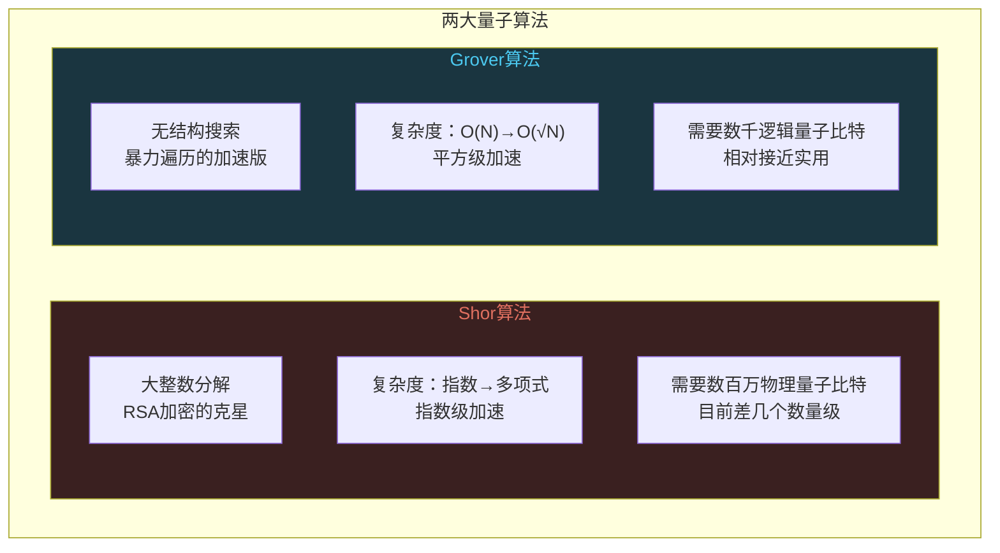

# 量子计算：下一个计算革命

```
╔══════════════════════════════════════════════╗
║  渡劫期 · 第170篇                              ║
║  量子计算：下一个计算革命                       ║
║  预计阅读：14分钟                              ║
╚══════════════════════════════════════════════╝
```

上一篇聊了Rust重写万物的趋势。C语言统治系统编程半个世纪后，Rust靠着编译期内存安全开始接棒。但换语言只是渐进改良，真正的计算范式跃迁可能藏在另一条路上。经典比特只能是0或1，量子比特可以同时是0和1。这种"叠加"听起来像玄学，但它背后是扎实的物理实验和数学框架。这一篇聊聊量子计算到底在干什么，能干什么，离实用还有多远。

---

## 硬核主体

### 经典比特和量子比特差在哪

经典计算机的基本信息单位是比特，取值0或1。一个寄存器存8个比特，就是8个独立的0或1，一共256种状态，但同一时刻只取其中一种。

量子比特（qubit）的取值不是非0即1。它处在一个介于0和1之间的叠加态（superposition）。数学上用布洛赫球（Bloch sphere）来描述：球的北极是|0⟩，南极是|1⟩，量子比特的状态是球面上任意一点。你可以理解为它同时"倾向"0和1，只是倾向程度不同。

```python
# 量子比特状态的简单模拟（用Python演示概念，非真实量子计算）
import math

# 经典比特：只有两种状态
classic_bits = [0, 1, 0, 1]  # 4个比特，一种确定状态

# 量子比特：叠加态用概率振幅表示
# |ψ⟩ = α|0⟩ + β|1⟩，其中|α|² + |β|² = 1
# α和β是复数，|α|²是测量时得到0的概率
qubit_state = {
    'alpha': math.sqrt(0.5),  # |α|² = 0.5，测量得到0的概率50%
    'beta': math.sqrt(0.5),   # |β|² = 0.5，测量得到1的概率50%
}
# 这个量子比特处于|0⟩和|1⟩的等概率叠加态

# 2个经典比特：同一时刻只有00/01/10/11中的一种
# 2个量子比特：可以同时处于4种状态的叠加
# n个量子比特：同时处于2^n种状态的叠加
# 这就是量子并行性的来源
```

需要留意的地方在这里：n个经典比特同时表示1种状态，n个量子比特同时处于2的n次方种状态的叠加。50个量子比特能叠加的状态数大约是10的15次方，超过经典计算机能直接模拟的范围。

但有个陷阱。你测量一个量子比特时，叠加态坍缩成确定的0或1。测量之前它"包含"所有可能性，测量之后只剩一个结果。量子计算的全部技巧在于：怎么操控叠加态，让正确答案的概率放大，错误答案的概率抑制，最后测量时大概率得到你要的答案。

### 量子纠缠：鬼魅般的关联

量子纠缠（entanglement）是量子计算的第二块拼图。两个纠缠的量子比特，无论相隔多远，对其中一个做测量会瞬间确定另一个的结果。爱因斯坦管这叫"鬼魅般的超距效应"（spooky action at a distance），他觉得这违背了局域性原理，量子力学一定不完备。

1964年贝尔提出了一个不等式（Bell's inequality），可以用实验检验量子力学到底是遵守局域性还是真的有这种"超距关联"。1980年代阿斯佩克特的实验证明贝尔不等式被违反了，量子纠缠是真实的物理现象。2022年诺贝尔物理学奖颁给了阿斯佩（Alain Aspect）和克劳泽（John Clauser）以及蔡林格（Anton Zeilinger），就是表彰他们在量子纠缠实验上的贡献。

纠缠在量子计算中怎么用？两个量子比特纠缠后，对其中一个的操作会牵动整体状态。量子算法操控的是整个量子态的演化，而非逐个比特独立处理。纠缠让量子比特之间建立关联，使得算法能利用2的n次方种叠加态中的结构性关系，而不仅仅是简单并行尝试所有可能。



### 量子门和量子电路

经典计算机用逻辑门操作比特，比如与门或非门。量子计算机用量子门操作量子比特。区别在于量子门可以做经典门做不到的事。

几个常见的量子门：

```text
X门（量子非门）：|0⟩ → |1⟩，|1⟩ → |0⟩，翻转量子比特
H门（Hadamard门）：|0⟩ → (|0⟩+|1⟩)/√2，创建叠加态
    这是量子计算的"起手式"，把确定态变成叠加态
CNOT门（受控非门）：两个量子比特，A控制B
    A=1时翻转B，A=0时不翻转
    CNOT门是制造纠缠的标准操作
    类似经典异或门，但操作的是叠加态
Z门：|0⟩ → |0⟩，|1⟩ → -|1⟩，改变相位
    不改变测量概率，但改变干涉模式
```

一个量子算法的流程通常是这样：先用H门创建叠加态，用量子门操控叠加态的演化，利用纠缠建立量子比特间的关联，最后测量得到结果。整个过程的关键在于量子干涉——让正确答案的概率振幅相长干涉（叠加增强），错误答案的概率振幅相消干涉（互相抵消）。

```python
# 量子电路概念演示：Bell态（最大纠缠态）
# 使用两个量子比特，创建纠缠

# 步骤1：初始态 |00⟩
# 量子比特A = |0⟩，量子比特B = |0⟩

# 步骤2：对A施加Hadamard门
# A变成 (|0⟩+|1⟩)/√2
# 整体状态: (|00⟩+|10⟩)/√2

# 步骤3：对A和B施加CNOT门（A控制B）
# |00⟩ → |00⟩（A=0不翻转B）
# |10⟩ → |11⟩（A=1翻转B）
# 最终状态: (|00⟩+|11⟩)/√2  ← 这就是Bell态

# 此时测量A得到0，B必然也是0
# 测量A得到1，B必然也是1
# 两个量子比特完全关联，这就是纠缠
```

### 两大量子算法

量子计算不是什么问题都能加速。目前有两个算法被证明比经典算法快得多。

Shor算法（彼得·秀尔，1994年提出）用于大整数分解。经典计算机分解一个N位的整数，最快算法的复杂度大约是指数级的。Shor算法把复杂度降到多项式级。这意味着RSA加密依赖的大数分解难题，在量子计算机面前不堪一击。RSA-2048用经典计算机分解需要几十万年，理论上量子计算机几小时就能搞定。

这是量子计算最引人注目的用途，也是各国政府紧张的原因。但别慌，要跑Shor算法分解2048位RSA，需要几千个容错量子比特，而每个容错量子比特需要大约1000个物理量子比特来做纠错。也就是说总共需要数百万个物理量子比特。目前最先进的量子芯片只有几百个量子比特，差了好几个数量级。

Grover算法（洛夫·格罗弗，1996年提出）用于无结构数据库搜索。N个条目里找一个目标，经典算法平均要查N/2次，Grover算法只需要√N次。复杂度降到O(√N)。对100万条记录，经典算法平均查50万次，Grover算法查1000次。加速很明显，但不是指数级，是平方级加速。Grover算法还可以攻击对称加密，把AES-256的安全强度降到AES-128的级别，所以后量子密码学建议把对称密钥长度翻倍。



### 量子计算的物理实现路线

量子比特不是一种东西，有至少五种物理实现路线在竞争。

**超导量子比特**：IBM和Google的主路线。用超导电路里的约瑟夫森结（Josephson junction）做量子比特，需要极端低温（15毫开尔文，比外太空还冷）。优点是跟半导体工艺兼容，可扩展性好。IBM 2023年发布了Condor芯片有1121个量子比特，2024年发布的Heron处理器有133个量子比特但质量更高（错误率更低）。Google 2024年12月发布的Willow芯片有105个量子比特，第一次在实验中证明了增加量子比特数量可以降低逻辑错误率。

**离子阱量子比特**：IonQ和Quantinuum的主路线。用电磁场把带电原子（离子）悬浮在真空中，用激光操控离子的内部能级。优点是量子比特质量高，保真度好，连接性好（任意两个量子比特都能纠缠）。缺点是扩展难，目前做到几十个量子比特，速度比超导慢。

**光量子比特**：用光子的偏振或路径做量子比特。中国科大的潘建伟团队在这条路线上很强，2020年实现了"九章"光量子计算原型机，用玻色采样问题展示了量子优势。光量子不需要极端低温，但光学元件体积大，集成难。

**半导体量子点**：用硅基材料里的量子点约束电子自旋做量子比特。Intel在推这条路线，优点是可以复用现有硅工艺，长远看成本最低。目前还在早期，量子比特数少。

**拓扑量子比特**：微软押注的路线。用马约拉纳费米子做量子比特，理论上对外界噪声免疫，错误率极低。但马约拉纳费米子的实验验证存在争议，2021年微软旗下研究团队发表的一篇Nature论文因数据问题被撤稿。2023年微软发布了拓扑量子比特的实验进展，但远未到实用阶段。

```text
各路线对比（2025年状态）：

超导（IBM/Google）  量子比特数最多，可扩展性好
                    需极端低温，相干时间短
                    IBM Heron 133 qubit，Google Willow 105 qubit

离子阱（IonQ）      保真度高，连接性好
                    速度慢，扩展难
                    目前32-50 qubit级别

光量子（中科大）    常温运行，并行性好
                    体积大，难以通用化
                    九章专用机，非通用量子计算

半导体量子点(Intel) 可复用硅工艺，成本低
                    早期阶段，量子比特少
                    目前2-12 qubit实验级别

拓扑（微软）        理论上错误率极低
                    物理验证争议大
                    实验阶段，远未实用
```

### NISQ时代和量子纠错

我们处于NISQ时代——Noisy Intermediate-Scale Quantum，噪声中等规模量子。意思是现有的量子计算机有几十到几百个量子比特，但噪声大，错误率高，没法跑Shor算法这种需要容错的算法。

量子比特的噪声来自退相干（decoherence）。量子叠加态非常脆弱，外界干扰比如热振动或者电磁噪声甚至宇宙射线，都会让叠加态坍缩或失真。目前超导量子比特的相干时间大约100微秒，也就是说你的量子算法必须在100微秒内跑完，否则量子信息就散了。

量子纠错（Quantum Error Correction, QEC）是解决噪声的方案。原理跟经典通信的纠错码类似：用多个物理量子比特编码一个逻辑量子比特，通过冗余来对抗错误。最常见的方案是表面码（surface code），大约需要1000个物理量子比特来编码一个逻辑量子比特，只要物理错误率低于某个阈值（大约1%），逻辑量子比特的错误率就能指数级降低。

Google 2024年的Willow芯片做了一件里程碑式的事：在实验中证明了增加量子比特数量，逻辑错误率确实在下降。这叫"below threshold"，是量子纠错从理论走向实践的第一步。但距离真正有用的容错量子计算机还有很长的路。

### 量子计算能干什么不能干什么

量子计算不是万能加速器。它只对特定结构的问题有指数级加速，对大部分日常计算任务没有优势，甚至更慢。

能加速的问题：
- 大整数分解（Shor算法）→ 密码学冲击
- 量子化学模拟（变分量子本征求解器VQE）→ 新药研发、材料设计
- 优化问题（量子近似优化算法QAOA）→ 物流，金融
- 无结构搜索（Grover算法）→ 数据库查询加速

不能加速的问题：
- 普通算术运算（加减乘除量子计算机不比经典计算机快）
- 文本处理和IO操作
- 大部分机器学习训练（部分量子机器学习算法有争议）
- Web服务和数据库CRUD

对嵌入式工程师来说，量子计算目前跟你的工作没有直接关系。量子计算机不会跑到MCU上，也不会替代你的STM32。但从长远看，两个趋势值得留意。第一是后量子密码学，当量子计算机成熟后RSA和ECC会失效，嵌入式设备的固件升级机制和通信加密需要迁移到抗量子算法。NIST在2024年正式发布了后量子密码标准（FIPS 203/204/205），新的嵌入式安全协议会逐步采用这些标准。第二是量子模拟用于材料探索，如果量子计算机能模拟新型半导体材料或电池材料的电子结构，新材料会间接改变嵌入式硬件的面貌。

---

## 修仙术语对照表

| 修仙术语 | 技术现实 | 本篇位置 |
|---------|---------|---------|
| 叠加态 | 量子比特同时处于0和1的叠加 | 经典比特和量子比特差在哪 |
| 鬼魅超距 | 量子纠缠，测量一个瞬间确定另一个 | 量子纠缠 |
| 贝尔验证 | 贝尔不等式实验证明纠缠真实存在 | 量子纠缠 |
| 量子起手 | Hadamard门创建叠加态 | 量子门和量子电路 |
| 纠缠术式 | CNOT门制造量子纠缠 | 量子门和量子电路 |
| 相长干涉 | 量子干涉，正确答案增强错误答案抵消 | 量子门和量子电路 |
| 秀尔分身术 | Shor算法多项式时间分解大整数 | 两大量子算法 |
| 搜索心法 | Grover算法平方级加速无结构搜索 | 两大量子算法 |
| 超导冰窟 | 超导量子比特需要15毫开尔文极低温 | 量子计算的物理实现路线 |
| 离子囚笼 | 离子阱用电磁场悬浮离子做量子比特 | 量子计算的物理实现路线 |
| 光子飞剑 | 光量子比特用光子偏振做信息载体 | 量子计算的物理实现路线 |
| 拓扑护体 | 拓扑量子比特理论上对外界噪声免疫 | 量子计算的物理实现路线 |
| 退相干劫 | 量子叠加态因外界干扰坍缩 | NISQ时代和量子纠错 |
| 纠错阵法 | 表面码用量子比特冗余对抗错误 | NISQ时代和量子纠错 |
| 后量子阵 | NIST后量子密码标准抗量子攻击 | 量子计算能干什么不能干什么 |

---

## 进阶条件

- [ ] 能用布洛赫球模型解释量子比特跟经典比特的区别，说出叠加态的数学表示（α|0⟩ + β|1⟩，|α|²+|β|²=1）
- [ ] 能解释量子纠缠为什么不是"超光速通信"（纠缠关联是瞬时的，但不能用它传递信息）
- [ ] 知道Shor算法和Grover算法各自解决什么问题，加速级别分别是指数级和平方级
- [ ] 能说出至少三种量子比特物理实现路线（超导，离子阱，光量子），各自的优缺点
- [ ] 理解NISQ时代的含义：现有量子计算机噪声大且规模有限且无法容错，以及为什么跑不了Shor算法
- [ ] 知道量子纠错的基本思路（用多个物理量子比特编码一个逻辑量子比特），以及Google Willow在2024年证明了什么
- [ ] 能判断量子计算对自己的工作领域有没有直接关联，说出至少一个间接关联趋势（后量子密码迁移）

下一篇聊脑机接口。碳基神经元和硅基电极怎么对接，目前能做什么，伦理争议在哪，离科幻电影里的脑机合体还有多远。

---

## 下期预告 + 互动

**第171篇：脑机接口：碳基和硅基的交汇**

Neuralink的人体试验进展到什么程度，非侵入式脑机接口能做什么，读脑术是科幻还是已经有实验验证，伦理边界在哪。

你觉得脑机接口会先在医疗领域（帮助瘫痪患者）成熟，还是会直接走向普通人增强认知？评论区说说你的看法。

我是玄芯散人，带你从炼气修到大乘。

---

*本文是「码农修仙传」系列第170篇。系列导航见 [xren.ren](https://xren.ren)*
