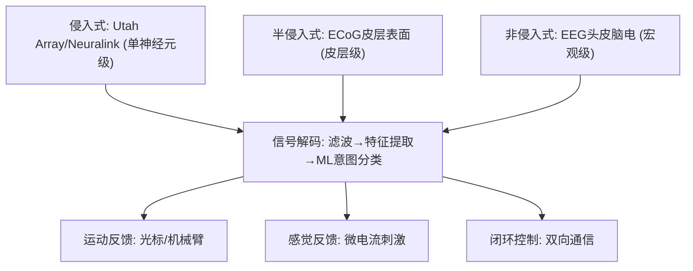
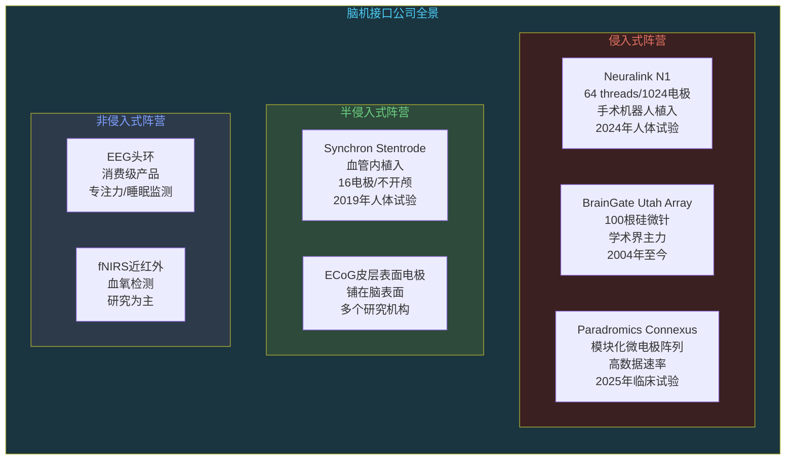

# 脑机接口：碳基和硅基的融合

```
╔══════════════════════════════════════════════╗
║  渡劫期 · 第171篇                              ║
║  脑机接口：碳基和硅基的融合                     ║
║  预计阅读：15分钟                              ║
╚══════════════════════════════════════════════╝
```

上一篇聊了量子计算。量子比特改写的是计算范式，而脑机接口改写的是人机交互范式。你用键盘敲代码，速度上限是手指的物理极限。你用语音跟AI对话，瓶颈是嘴巴的表达速度。但如果大脑的想法能直接变成数字信号呢？这不是科幻。2024年Neuralink已经在人脑里放了芯片，瘫痪患者靠意念下棋。碳基神经元和硅基电极的对接，正在从实验室走向病床。

---

## 硬核主体

### 一、脑机接口的三层架构

脑机接口（Brain-Computer Interface，BCI）的目标很直接：在脑子和外部设备之间建立一条信息通道。这条通道分三层。

信号采集层。大脑里有大约860亿个神经元，它们通过电脉冲（action potential）互相通信。BCI的第一步就是采集这些电信号。采集方式决定了整个系统的分辨率和侵入程度。采集到的原始信号信噪比很低，需要硬件层面的放大和滤波。

信号解码层。采集到的脑电信号是一堆杂乱的波形，需要算法把它翻译成有意义的指令。这一步跟AI的技术栈重叠度很高，机器学习把神经活动模式对应到具体的动作意图或者语言内容。解码算法的准确率直接决定BCI好不好用。

信号反馈层。BCI不只是单向读取，高级系统还能向大脑写入信号。用微电流刺激皮层特定区域，让使用者产生触觉或者视觉的感知。双向闭环是BCI的终极形态。



### 二、信号采集：三种路线之争

信号采集是BCI的技术分水岭。按侵入程度分三种路线，各有各的优缺点。

侵入式（invasive）。把电极直接插进大脑皮层内部，记录单个神经元的放电活动。空间分辨率最高，能读到非常精细的意图信息。代价是需要开颅手术，有感染风险，电极长时间植入后脑组织会形成胶质疤痕导致信号衰减。代表产品是Blackrock Microsystems的Utah Array，一块4毫米见方的硅基微针阵列，上面有100根细针，每根针尖记录一个神经元的活动。Utah Array是目前人类临床试验里用得最久的侵入式电极，BrainGate项目从2004年就开始用它。Neuralink的N1植入物也是侵入式，但用了柔性thread设计，64根比头发还细的聚合物电极线，上面分布1024个电极触点，由手术机器人植入。

半侵入式（semi-invasive）。电极放在颅骨下方或者皮层表面，不穿透脑组织。ECoG（Electrocorticography）是典型代表，把电极网格铺在大脑皮层表面，记录皮层的电活动。空间分辨率比侵入式低，但不需要穿透脑组织，安全性好很多。另一个半侵入式路线是Synchron的Stentrode，通过血管内植入，在颈静脉里把电极送到运动皮层附近的血管里，隔着血管壁记录神经元信号。这种方式不需要开颅，通过微创手术完成。

非侵入式（non-invasive）。信号采集设备放在头皮外面，典型就是EEG（脑电图）。EEG的设备便宜，使用方便，没有任何手术风险。但颅骨对电信号的衰减很厉害，EEG只能记录到脑区级的宏观活动，空间分辨率差，信噪比低。你买个几百块钱的EEG头环套在头上，能检测到眨眼和放松程度，但想用它打字或者控制机械臂，目前做不到。fNIRS（近红外光谱）是另一种非侵入式技术，通过红外光检测脑区血氧变化，跟EEG互补但同样受限于空间和时间分辨率。

```text
三种采集路线对比：

侵入式（Utah Array/Neuralink）
  分辨率：单神经元级，最高
  手术：开颅，风险大
  持续时间：数月到数年，信号衰减
  适用：重度瘫痪患者临床试验

半侵入式（ECoG/Synchron Stentrode）
  分辨率：皮层级，中等
  手术：微创或开颅（ECoG）
  持续时间：较长，组织反应较轻
  适用：临床试验，部分已进入商业审批

非侵入式（EEG/fNIRS）
  分辨率：脑区级，最低
  手术：无
  持续时间：随时佩戴，无植入
  适用：消费级产品，睡眠/专注力监测
```

### 三、Neuralink走到哪了

Neuralink是脑机接口领域关注度最高的公司，技术路线是侵入式柔性电极加手术机器人。

2024年1月，Neuralink完成了首例人体植入。受试者叫Noland Arbaugh，四肢瘫痪，在植入N1设备后能靠意念控制电脑鼠标，下国际象棋，玩文明6。设备通过1024个电极采集运动皮层的神经信号，无线传输到外部接收器，由解码算法把神经活动转成鼠标移动和点击指令。首例试验暴露了一个问题：植入后几周内，部分电极thread从脑组织里回缩，信号质量下降，设备可用电极数量减少。Neuralink通过软件算法补偿了信号损失，但物理层面的thread回缩问题需要硬件改进。

2024年下半年，Neuralink完成了第二例人体植入。第二位受试者的效果比第一位好，thread回缩问题有所缓解。Neuralink的计划是在2025年扩展到更多受试者，同时研发让瘫痪患者控制机械臂的解码方案。

Neuralink的N1植入物有几个工程亮点。第一是手术机器人R1，它自动避开血管把柔性thread插入皮层，精度和速度远超人类外科医生手动操作。第二是无线设计，N1植入物完全在颅骨内部，充电用无线感应，数据传输用蓝牙，不需要在头上留一个外露的接口。第三是芯片集成，N1把1024个通道的信号放大和数字化全部集成在硬币大小的封装里，功耗控制在毫瓦级别。

```python
# Neuralink N1信号链路简化模型（概念演示，非真实代码）
class NeuralSignalDecoder:
    def __init__(self, num_electrodes=1024):
        self.num_electrodes = num_electrodes
        # 每个电极采集一个神经元的放电信号
        # 采样率约20kHz，高通滤波300Hz去除背景噪声
        
    def acquire(self):
        """从1024个电极采集原始信号"""
        # 信号经芯片内置放大器放大（增益约1000倍）
        # 然后ADC数字化，通过蓝牙传输到外部处理器
        raw_signals = self._read_channels()
        return raw_signals
    
    def decode_intention(self, raw_signals):
        """解码运动意图"""
        # 第一步：提取每个电极的发放率（firing rate）
        # 神经元放电频率越高，代表该区域越活跃
        firing_rates = self._extract_firing_rates(raw_signals)
        
        # 第二步：把发放率向量输入分类器
        # 模型在训练阶段学会了：哪些电极组合的活跃模式
        # 对应"向左移动光标"，哪些对应"点击"
        intention = self._classifier.predict(firing_rates)
        return intention  # 输出：{direction: "left", speed: 0.5}
    
    def _extract_firing_rates(self, signals):
        """提取神经元放电频率"""
        # 用滑动窗口统计脉冲数，窗口约100ms
        # 返回1024维向量，每维是一个电极的发放率
        pass
```

### 四、不只是Neuralink：BCI的全景

Neuralink声量最大，但BCI领域不是只有它一家。

Synchron走的是完全不同的路线。它的Stentrode电极通过血管内植入，不需要开颅。医生在颈静脉穿刺，把导管送到运动皮层上方的血管里，释放自膨胀支架电极。电极贴着血管壁，隔着血管壁记录神经元活动。Synchron在2019年做了首例人体植入，2024年获得了FDA的breakthrough device认定。Stentrode的电极数量少（16个），分辨率比Neuralink低，但手术风险大幅降低，更适合推广到更多患者。

BrainGate联盟是学术界的BCI主力。由布朗大学牵头，联合斯坦福和哈佛等机构，2004年起用Utah Array做侵入式BCI临床试验。BrainGate的成果包括让瘫痪患者用意念打字，速度达到每分钟90个字符。2024年斯坦福团队发表的研究里，两位ALS患者的皮层植入物配合语言解码模型，能将脑信号直接转成口语词汇，速度达到每分钟62个词，准确率75%。这个方向让失去语言能力的患者重新开口说话。

Paradromics是另一家值得关注的侵入式BCI公司。它的Connexus系统用模块化的微电极阵列，目标是高数据速率的神经接口。Paradromics拿到了FDA的breakthrough device认定，计划在2025年启动临床试验。



### 五、解码算法：线性滤波和神经网络的代差

BCI的硬件决定了能采集多少信号，但算法决定了能从信号里提取多少信息。

早期的BCI解码用线性方法。线性滤波器把神经元发放率做加权求和，权重在训练阶段通过回归算法拟合。这种方法简单，计算量小，能实时运行。BrainGate早期的打字实验就是用线性滤波，受试者想象手部运动来控制二维光标，在虚拟键盘上逐个选字母。线性方法的局限在于表达能力有限，复杂意图的解码准确率上不去。

后来的方案引入了机器学习。支持向量机（SVM）和朴素贝叶斯分类器用于离散意图分类，比如"想动左手"还是"想动右手"。ReFIT算法（ReFIT-Kalman）用卡尔曼滤波做闭环校正，光标控制更平滑。这些方法在BrainGate的人体试验里跑了好几年，效果稳定。

现在的方向是神经网络。卷积神经网络（CNN）在原始神经信号里提取时频特征，循环神经网络（RNN）捕捉神经活动的时间序列模式。2024年斯坦福的语言解码实验用了神经网络把皮层神经活动对应到音素和词汇，准确率远超传统方法。神经网络的优势在于能在高维神经信号里学到非线性特征，缺点是训练数据需求大，实时推理的延迟需要压低。

对嵌入式工程师来说，BCI的外部处理单元就是一个嵌入式系统。信号采集芯片在植入物内部，但解码和执行在外部设备上跑。低延迟和低功耗是工程难点。想象一下，如果解码延迟超过200毫秒，光标控制就会有明显滞后，用户体验很差。实时解码需要在几十毫秒内跑完信号滤波，然后做特征提取，最后完成模型推理这整条链路。

```c
// BCI实时解码流水线的延迟拆解（概念示意）
// 总延迟目标：<100ms，否则用户感知到滞后
typedef struct {
    // 信号采集：1024通道×20kHz×16bit = 40MB/s
    // 植入物芯片做硬件滤波和降采样后输出
    uint32_t acquisition_us;     // 信号采集 + 数字化
    
    // 信号传输：蓝牙低功耗BLE
    // 带宽约束下分包传输
    uint32_t transmission_us;    // 无线传输延迟
    
    // 特征提取：滑动窗口统计发放率
    // 窗口100ms，每50ms输出一次结果
    uint32_t feature_us;         // 特征提取耗时
    
    // 模型推理：分类器或神经网络前向传播
    // 决定延迟的瓶颈
    uint32_t inference_us;       // 解码推理耗时
    
    // 执行反馈：光标移动或机械臂控制
    uint32_t actuation_us;       // 指令执行延迟
    
    // 总延迟 = 采集+传输+特征+推理+执行
    // 典型值：5ms + 10ms + 5ms + 30ms + 10ms = 60ms
} bci_latency_budget;
```

### 六、伦理边界：不是只有技术问题

BCI带来的伦理问题比技术问题更棘手。

脑隐私是第一个问题。你的大脑活动里藏着你的情绪和偏好以及潜意识反应。如果BCI设备能读取这些信息，谁有权访问？保险公司会不会要求投保人提交脑电数据来评估心理风险？雇主会不会用脑机接口监测员工的专注度？2017年Facebook公布过用EEG让人每分钟打100个字的计划，后来在2022年前后因伦理争议和效果不达标放弃了消费级路线，转向医疗方向。

身份认同是第二个问题。双向BCI能向大脑写入信号，理论上可以改变使用者的感知和情绪。如果一个人长期依赖BCI行走和交流，他的自我意识会不会跟设备融合？设备关闭后他还是"他自己"吗？这些问题在哲学上没有定论，在工程上也还没有实际场景，但双向BCI一旦成熟就会变成现实问题。

公平获取是第三个问题。Neuralink的植入手术成本在数十万美元级别，初期只有富裕国家的富裕患者能负担。如果BCI能恢复瘫痪患者的行动能力甚至增强健康人的认知，那负担不起的人就会被甩得更远。技术先在医疗领域成熟，再逐步降成本推广到普通人，这是大多数医疗技术的路径。但BCI的成本下降速度取决于芯片和材料的量产能力，目前看不会太快。

### 七、离科幻还有多远

科幻电影里的脑机接口是双向的，高带宽的，能直接上传和下载记忆。现实离这个目标很远。

目前的BCI以单向读取为主。能采集运动皮层的信号控制外部设备，但向大脑写入信息的能力非常原始，只能用粗粒度的电刺激让使用者感知到光斑或者触觉，远达不到传输视觉或语言的程度。写入信号的分辨率需要提高几个数量级才能接近科幻设定。

带宽差距巨大。人脑内部的信息传输速率估计在每秒几个Gb的量级，Neuralink N1的1024个电极能采集的有效信息大约每秒几Mb。差了两到三个数量级。要达到人脑内部通信的带宽水平，电极数量需要提升到十万甚至百万级别，这对植入物设计和信号处理芯片是巨大的工程量。

长期稳定性未解决。侵入式电极植入后，脑组织的免疫反应会形成胶质疤痕包裹电极，导致信号质量在几个月到几年内持续下降。Utah Array在BrainGate项目里有植入超过五年还能用的案例，但信号衰减是普遍现象。柔性电极设计（如Neuralink的thread）理论上能减轻组织反应，但长期数据还不够。除非电极材料和组织相容性问题解决，BCI的寿命天花板就卡在这里。

对技术人来说，BCI是一个需要神经科学和芯片设计以及机器学习和嵌入式系统工程的多学科交叉领域。信号采集需要微电子和材料学，信号解码需要算法和算力，设备封装需要生物相容性工程，产品落地需要临床验证和法规审批。这条路很长，但每一步都在走。

---

## 修仙术语对照表

| 修仙术语 | 技术现实 | 本篇位置 |
|---------|---------|---------|
| 碳硅融合 | 神经元电信号和硅基电极的对接 | 修仙引入 |
| 意念传讯 | 脑电信号解码为数字指令 | 三层架构 |
| 神识探查 | 侵入式电极直接插入皮层记录单神经元 | 信号采集 |
| 隔空感测 | 非侵入式EEG从头皮间接采集脑电 | 信号采集 |
| 灵脉穿刺 | 开颅手术植入电极的侵入式路线 | 信号采集 |
| 血脉遁入 | Synchron通过血管内植入电极不开颅 | 信号采集 |
| 柔丝入脑 | Neuralink的柔性thread电极设计 | Neuralink走到哪了 |
| 意念操控 | 1024电极采集运动皮层信号控制光标 | Neuralink走到哪了 |
| 解读心法 | 线性滤波和神经网络的神经解码算法 | 解码算法 |
| 心念成言 | BrainGate将脑信号转成口语词汇 | BCI全景 |
| 脑隐私劫 | 脑电数据包含情绪偏好等隐私信息 | 伦理边界 |
| 神识灌顶 | 双向BCI向大脑写入信号 | 伦理边界 |
| 碳硅之壁 | 脑组织免疫反应导致电极信号衰减 | 离科幻还有多远 |

---

## 进阶条件

- [ ] 能说出BCI三层架构（采集层和解码层和反馈层），以及每层的职责
- [ ] 能区分侵入式和半侵入式和非侵入式三种采集路线的分辨率和风险差异
- [ ] 知道Neuralink N1的基本参数（1024电极和64 threads和无线设计）和首例人体试验的时间节点
- [ ] 能说出Synchron Stentrode和Neuralink的技术路线差异（血管内植入vs开颅柔性电极）
- [ ] 理解BCI解码算法的演进路线（线性滤波→机器学习→神经网络），知道实时解码的延迟预算在百毫秒级
- [ ] 能说出BCI面临的伦理问题（脑隐私和身份认同和公平获取）
- [ ] 知道当前BCI跟科幻设定的差距（单向读取为主和带宽差几个数量级和长期稳定性未解决）

下一篇聊聊AGI。通用人工智能到底还有多远，当前大模型的局限在哪，通往AGI的可能路径有几条。

---

## 下期预告 + 互动

**第172篇：AGI：通用人工智能还有多远**

大模型的能力边界在哪，什么叫"通用"，AGI的可能技术路径（规模化vs世界模型vs具身智能），以及AGI对技术人的影响。

你觉得BCI和AGI哪个会先成熟？如果两个都成熟了，世界会变成什么样？评论区说说你的想法。

我是玄芯散人，带你从炼气修到大乘。

---

*本文是「码农修仙传」系列第171篇。系列导航见 [xren.ren](https://xren.ren)*
