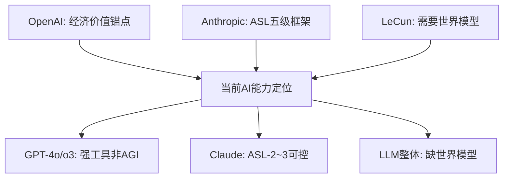
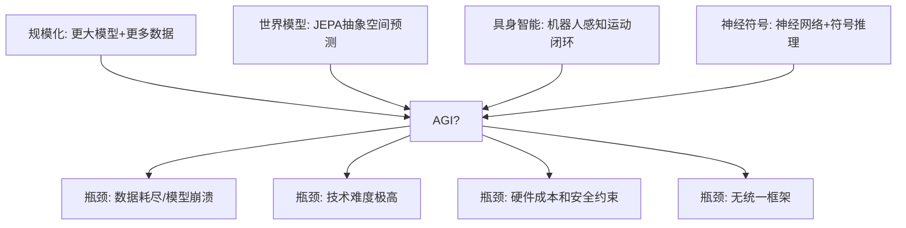

# AGI：通用人工智能还有多远

```
╔══════════════════════════════════════════════╗
║  渡劫期 · 第172篇                              ║
║  AGI：通用人工智能还有多远                     ║
║  预计阅读：16分钟                              ║
╚══════════════════════════════════════════════╝
```

上一篇聊脑机接口，碳基神经元和硅基电极的对接。这一篇往上走一层，聊一个更大的问题：硅基系统什么时候能像碳基大脑一样，真正"想"事情。2024年大语言模型能写代码，能做数学题，能通过律师考试，看起来离通用人工智能只差临门一脚。但"看起来聪明"和"真的聪明"之间，可能隔着一道还没被发现的天花板。这篇把AGI的定义和当前大模型到底卡在哪以及通往AGI的几条技术路径讲清楚。

---

## 硬核主体

### 一、什么叫"通用"

AGI（Artificial General Intelligence）这个词听起来像是在说"什么都能干的AI"。但学术界对"通用"的定义一直有争议，大致分三派。

第一派以OpenAI为代表，把AGI定义为"在绝大多数具有经济价值的任务上超越人类的自主系统"。注意这个定义的锚点是"经济价值"，不是"所有认知任务"。OpenAI的商业化路径跟这个定义高度一致：他们的目标是造一个能替代人类劳动力的系统，而不是万能机器。2025年OpenAI发布o3模型时，内部已经在讨论"AGI是否已经触达"，因为o3在编程和数学推理上的表现确实逼近了专业人类水平。

第二派以Anthropic为代表，用更量化的方式定义AGI。Anthropic在2023年提出了Responsible Scaling Policy（RSP），把AI能力分成AI Safety Levels（ASL-1到ASL-5），ASL-1是无危险性工具如计算器，ASL-4大约对应AGI水平（在广泛任务上匹配或超越人类），ASL-5是超人级且不可预测。Anthropic的Claude模型被自己评定在ASL-2到ASL-3之间，即"有能力但可控"。这个框架的好处是有明确的测试基准，坏处是基准本身在不断变化。Google DeepMind也在2024年5月发布了类似的Frontier Safety Framework，用Critical Capability Levels来划分能力等级。

第三派以Yann LeCun为代表，认为现在讨论AGI为时过早，因为大语言模型根本走不到AGI。LeCun的论点是LLM缺乏世界模型（world model），只是在做统计层面的模式匹配，连猫都不如。猫能理解物理世界的基本规律，知道东西掉到地上会碎，LLM不理解这些。LeCun主张用JEPA（Joint Embedding Predictive Architecture）这类架构来构建真正能推理的系统。

三个定义的共同点是：没有任何一个被广泛接受。但有一点共识：当前的AI系统，不管多强，都还没达到任何一个定义下的AGI标准。



### 二、大模型的四道天花板

大语言模型很强，但有几个结构性问题不是堆算力和数据能解决的。

第一道是幻觉。LLM生成文本的方式是预测下一个token，它没有"事实核查"的内置机制。GPT-4在简单事实问题上准确率很高，但在需要多步推理或者涉及长尾知识时，仍然会一本正经地编造。2024年OpenAI用o1/o3系列引入了test-time compute（推理时计算），让模型在输出前先"想"一段内部思维链。这个方法在数学竞赛和编程题上效果显著，o3在ARC-AGI基准上得分超过87%（⚠️待确认，可能存在公开训练集和半私有评估集的版本差异），但幻觉问题只是缓解没有被根除。思维链能让模型检查自己的推理过程，但如果推理过程本身基于错误的前提，检查再多遍也没用。

第二道是缺乏持久记忆和连续学习。你跟GPT-4聊了三小时，关掉窗口，下次打开它什么都不记得。ChatGPT的"记忆"功能是把用户信息存成文本摘要，不是真正的参数级学习。人类大脑的厉害之处在于能在对话中实时更新自己的认知模型，LLM做不到这一点，因为训练和推理是分离的两个阶段。训练完的模型权重是冻结的，推理时只能用上下文窗口来模拟"记忆"，窗口满了就得丢掉前面的内容。

第三道是没有真正的规划能力。下棋AI能看十几步之后，是因为搜索空间有限，蒙特卡洛树搜索可以暴力枚举。但现实世界的问题不是棋盘，状态空间是开放的。你让AI规划一个软件项目的开发流程，它能生成一个看起来合理的甘特图，但它不理解"需求可能变"，也不理解"团队成员可能离职"，更不理解"技术选型可能踩坑"这些真实世界的不确定性。2024年Cognition Labs的Devin号称能自主完成软件工程任务，在SWE-bench上解决了约13.86%的真实GitHub issue。这个数字说明AI能做一些，但离"自主软件工程师"差得远。

第四道是缺乏 grounded understanding（基于物理世界的理解）。LLM的训练数据是文本，它知道"苹果会掉到地上"是因为训练语料里有这句话，不是因为它见过苹果掉下来。LeCun反复强调这个问题：一个系统如果只从文本中学习，它的世界知识是不完整的。物理世界的很多规律无法用语言充分描述，必须通过感知和交互才能获得。这也是为什么具身智能（embodied AI）被认为是通往AGI的一条独立路径。

```text
大模型四道天花板：

幻觉
  原因：next-token预测无事实核查机制
  缓解：test-time compute / RAG / 事实核查插件
  状态：缓解未根除

无持久记忆
  原因：训练和推理分离，权重冻结
  缓解：上下文窗口 / 外部存储摘要
  状态：模拟不等于真正学习

无规划能力
  原因：开放状态空间无法暴力搜索
  缓解：思维链 / 工具调用 / Agent框架
  状态：窄场景可用，通用不行

缺物理世界理解
  原因：训练数据是文本不是感知
  缓解：多模态 / 具身智能 / 世界模型
  状态：早期探索
```

### 三、通往AGI的四条路

当前学术界和工业界对"怎么走到AGI"有四条主流路径，每条都有人在押注。

路径一：规模化（Scaling）。OpenAI的信仰是"大力出奇迹"。更大的模型配上更多数据和算力，就能涌现出更强的能力。GPT-3证明了规模化确实能带来质变（few-shot learning的涌现），GPT-4进一步验证了这条路。但2024年以来，Scaling Law的边际收益在递减。GPT-3到GPT-4，参数量涨了十倍以上，能力提升明显。GPT-4再到GPT-4o，提升幅度变小了。o3的推理能力提升很大，但靠的是推理时算力不是训练时算力，这跟传统的Scaling Law不是一回事。规模化路线的支持者认为数据质量和训练方法的改进可以弥补数据量的瓶颈，合成数据（synthetic data）是下一个增长点。反对者认为互联网上的高质量文本快用完了，合成数据会导致模型在自身输出上反复训练，产生"模型崩溃"（model collapse）。

路径二：世界模型（World Model）。LeCun力推的路线。核心思路是让AI学习物理世界的内在规律，而不是文本的统计模式。JEPA架构的做法是把视频或感知数据编码成一个抽象表示，然后在这个抽象空间里做预测。模型在抽象空间里预测下一帧的特征表示，而非预测像素本身。这样做的好处是模型能学到"物体持久性"和"物理因果"这些概念，不被像素级的噪声干扰。Meta在2024年发布了V-JEPA，在视频理解任务上表现不错，但离LeCun设想的"猫级智能"还很远。世界模型路线的技术难度很高，但如果走通，可能解决LLM的物理世界理解问题。

路径三：具身智能（Embodied AI）。把AI装进机器人体里，让它在真实世界中通过视觉和触觉以及运动来学习。这跟世界模型有交集但侧重不同。世界模型强调内部表征，具身智能强调感知运动闭环。2024年Figure AI和OpenAI合作的人形机器人能听语音指令做家务，Boston Dynamics的Atlas在工厂里搬箱子。但这些演示都是预先编排好的，不是真正的自主学习。具身智能的瓶颈在于机器人的硬件成本和可靠性，以及真实世界训练的安全约束。你不能让机器人在学习过程中把客厅砸了。

路径四：神经符号（Neuro-symbolic）。把神经网络的感知能力跟符号逻辑的推理能力结合起来。神经网络擅长模式识别（识别图像里的猫），符号系统擅长逻辑推理（如果A且B则C）。MIT的Probabilistic Programming社区和IBM的DeepQA（Watson的前身）都在这条路上探索过。神经符号的思路很优雅，但工程难度极大，两种paradigm的融合方式至今没有统一框架。2024年这个方向有一些进展，比如用LLM做自然语言到逻辑表达式的翻译，再用符号推理引擎执行，但还处于实验室阶段。



### 四、时间表：谁说的靠谱

AGI什么时候能实现？这个问题没有标准答案，但可以看看各方的预测。

OpenAI的Sam Altman在2024年多次公开表示AGI可能在"这个十年内"实现，也就是2030年之前。他的措辞很谨慎，说的是"达到AGI水平的能力"，不是"AGI系统部署"。Google DeepMind的Demis Hassabis也给出了类似的时间框架，认为可能在"几年到十年"之间。

学术界的预测更分散。LeCun认为当前路线根本走不到AGI，需要架构层面的范式转移，他给出的时间表是"几十年"而非"几年"。纽约大学的Gary Marcus长期批评LLM路线，认为不解决推理和世界模型问题，堆再多算力也没用。2024年他跟Altman打了个赌，赌AGI不会在2029年前实现。

还有一类预测来自AI安全社区。牛津大学的Nick Bostrom在《Superintelligence》里讨论了"智能爆炸"的假说：一旦AI能自己改进自己的代码，能力会在极短时间内超过人类。这个假说是否成立，取决于AI能否做AI研究。目前o3在编程上接近专业人类水平，但做原创性的AI架构设计还差得远。不过如果哪天AI能自主提出并验证新的训练算法，智能爆炸的门槛就被跨过了。

说几个确定的事实。第一，没有人真的知道AGI什么时候来。所有预测都是基于当前技术趋势的外推，而技术趋势本身可能因为一个架构突破而突然加速，也可能因为遇到瓶颈而长期停滞。第二，"AGI来了"这个事件不像你想的那么明确。不会有一天早上醒来发现新闻说"AGI实现了"，更可能是一个渐进过程，今天模型通过了某个测试，明天通过了另一个，不知不觉间你觉得它什么都行了。第三，即使AGI真的来了，离"AGI改变世界"还有距离。技术成熟和商业落地之间隔着成本和法规以及社会接受度这些非技术因素。

### 五、对技术人的影响

AGI如果真在2030年前后实现，对技术人的影响是实实在在的。

最直接的影响是编程工作量的重新分配。如果AI能在大部分编码任务上达到人类水平，初级程序员的价值会被压缩。但系统设计和需求理解以及跨团队协调这些需要全局判断的工作，短期内不会被替代。2024年GitHub Copilot已经让开发效率提升了约26%（⚠️数据来源为2024年MIT相关研究，非GitHub官方数据），如果AGI能把这个数字推到60%以上，团队结构会变：一个高级工程师带几个AI Agent就能完成现在需要十个人的项目。

对嵌入式工程师来说，AGI的影响来得会慢一些。嵌入式开发涉及硬件选型和电路设计以及物理调试和环境适配，这些任务需要跟真实世界交互。AI能帮你写驱动代码，能生成配置脚本，能分析数据手册，但拿示波器量信号和焊PCB板以及在现场排查EMC干扰这些事情，AI暂时做不了。前面讲的四道天花板，在嵌入式领域表现得最明显：LLM没有物理世界的感知能力，而这恰恰是嵌入式工作的日常。

技术人该怎么应对？保持对AI工具的熟练使用。不要把AI当竞争对手，把它当生产力放大器。能用AI把工作效率提升三倍的人，会替代不用AI的人。同时深耕AI不擅长的领域，比如物理世界交互和系统级架构决策以及跨领域问题求解。这些能力的护城河比单纯的编码能力深得多。

---

## 修仙术语对照表

| 修仙术语 | 技术现实 | 本篇位置 |
|---------|---------|---------|
| 证道 | AGI的实现，AI达到通用智能水平 | 修仙引入 |
| 天花板 | 大模型的结构性局限（幻觉/记忆/规划/物理理解） | 四道天花板 |
| 念力幻术 | LLM的幻觉问题，编造看起来正确的内容 | 四道天花板 |
| 识海冻结 | 模型训练后权重冻结，无法在推理中真正学习 | 四道天花板 |
| 谋略 | AI的规划能力，开放状态空间下的决策 | 四道天花板 |
| 隔岸观花 | LLM只从文本学习，缺乏物理世界感知 | 四道天花板 |
| 蛮力破关 | 规模化路线，靠算力和数据堆出能力 | 通往AGI |
| 内观世界 | 世界模型路线，学习物理世界的内在规律 | 通往AGI |
| 肉身历练 | 具身智能路线，在真实世界中感知和交互 | 通往AGI |
| 符文与灵脉结合 | 神经符号路线，神经网络加符号推理 | 通往AGI |
| 天劫将至 | AGI实现带来的社会冲击和安全隐患 | 时间表 |
| 智能爆炸 | AI自主改进代码导致能力指数级跃升 | 时间表 |
| 道法自然 | 物理世界交互能力是嵌入式工程师的护城河 | 对技术人 |
| 法器 | AI工具作为生产力放大器 | 对技术人 |

---

## 突破条件

- [ ] 能说出AGI的三种定义：OpenAI的"经济价值"锚点，Anthropic的ASL五级量化框架，LeCun"需要世界模型"的主张
- [ ] 能列出大模型的四道天花板并说出每道的成因：幻觉问题，无持久记忆，无规划能力，缺物理世界理解
- [ ] 能区分通往AGI的四条路径并说出每条瓶颈：规模化路线，世界模型路线，具身智能路线，神经符号路线
- [ ] 知道Scaling Law边际递减的现状，以及合成数据可能带来的model collapse问题
- [ ] 能说出LeCun的JEPA架构基本思路（在抽象特征空间做预测而非预测像素）
- [ ] 知道OpenAI o3引入的test-time compute概念，理解思维链为什么能提升推理但不能根除幻觉
- [ ] 能评估AGI对自己所在技术方向的影响时间表，并制定应对策略

下一篇聊聊技术转管理。什么时候该转，怎么转，技术会不会丢，前12个月的转型清单是什么。

---

## 下期预告 + 互动

**第173篇：技术转管理：什么时候转，怎么转**

技术人到了一定阶段都会面临一个选择：继续走技术专家路线，还是转管理。这条路有什么坑，技术丢了怎么办，怎么平衡写代码和带团队。

你觉得AGI如果真在2030年实现了，技术管理的需求会增加还是减少？当AI能做大部分编码工作时，技术管理者的价值在哪？评论区聊聊。

我是玄芯散人，带你从炼气修到大乘。

---

*本文是「码农修仙传」系列第172篇。系列导航见 [xren.ren](https://xren.ren)*
