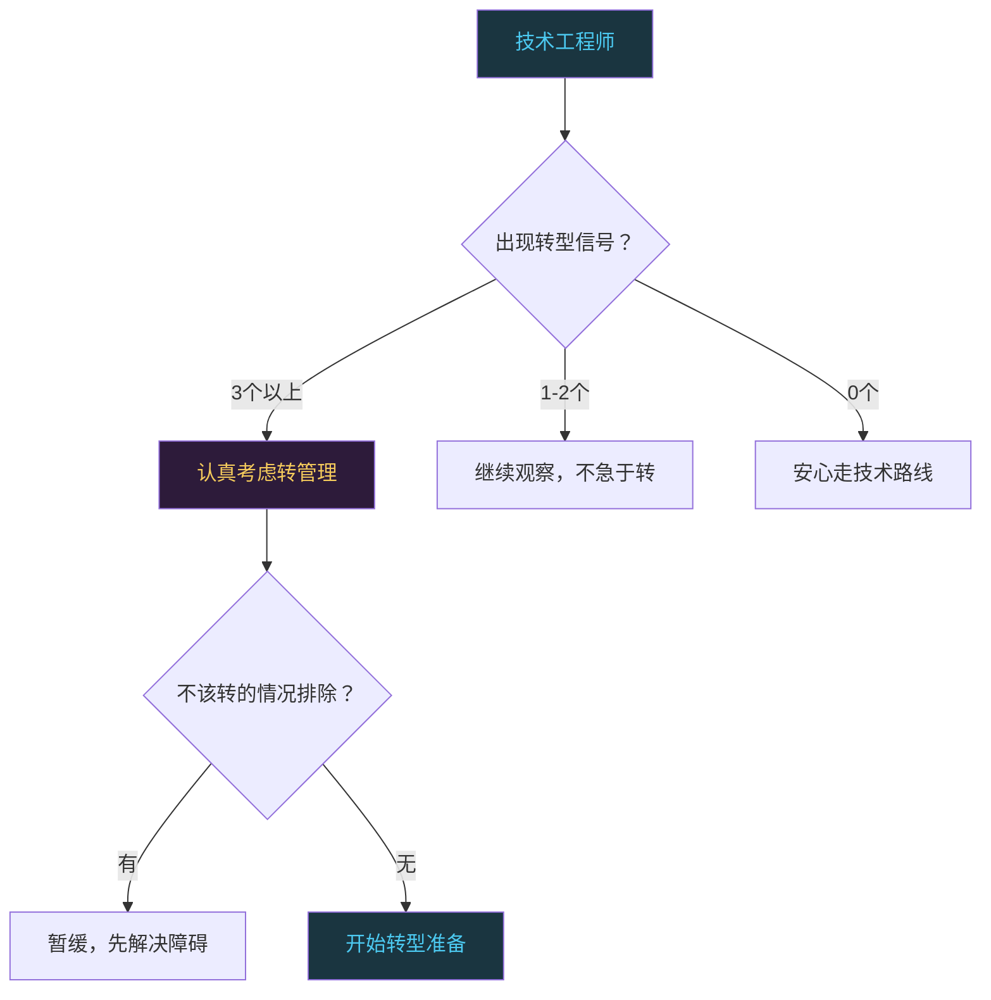
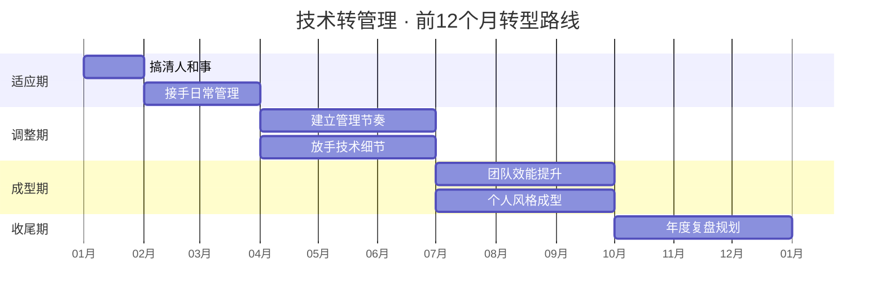

# 技术转管理：什么时候转，怎么转

```
╔══════════════════════════════════════════════╗
║  渡劫期 · 第173篇                              ║
║  技术转管理：什么时候转，怎么转                 ║
║  预计阅读：15分钟                              ║
╚══════════════════════════════════════════════╝
```

渡劫期的修炼者面临一道抉择之劫：继续往技术深处走，还是换一条路开始带人。很多人把转管理想得太简单，觉得不就是安排一下任务、开开会嘛。也有人想得太可怕，觉得一转管理技术就废了，再也回不去写代码的日子。两种想法都不准确。这篇聊实在的：该转的信号有哪些，什么情况千万别转，转了之后技术怎么保，前12个月该干什么。

---

## 硬核主体

### 一、该转了的六个信号

技术转管理不是看年龄，不是看资历，是看信号。以下六个信号，出现三个以上就该认真考虑了。

信号一：你已经在做管理的事，只是没有管理的title。团队遇到问题会来找你而不是找组长，你会主动协调前后端的接口对齐，你会帮新人排查他们卡住的问题。你花在沟通协调上的时间已经超过写代码的时间。这说明你的实际职能已经在偏移，title只是补一张纸。

信号二：你开始关心"为什么做"多过"怎么做"。以前你接到需求就想怎么实现，现在你会问这个需求是不是合理，有没有更好的替代方案，做出来有没有人用。你不再满足于把代码写好，而是想影响做什么和为什么做。这是管理思维的萌芽。

信号三：你带新人时感到成就感。一个新人经过你的指导，慢慢能独立干活了，代码写得越来越规范。你看着他的进步比自己做出来一个东西还开心。这里说的成就感来自帮别人规划成长路径，跟教写代码的技术指导是两回事。

信号四：团队产出受限于你的个人带宽。你是团队里技术最强的人，所有难题都堆给你。你成了瓶颈，团队整体产出卡在你这里。这时候你转管理，把技术决策权分出去，反而能提升团队总产出。

信号五：你对纯技术的激情在下降。你对"再学一个新框架"这件事没那么兴奋了，更感兴趣的是怎么让一群人协作做出一个产品。这种兴趣转移如果持续了半年以上，多半是路在变，不是一时疲倦。

信号六：有上级或 mentor 明确建议你考虑管理岗。别人看你的角度和自己看自己不一样。如果不止一个人跟你说"你适合带团队"，值得认真想想为什么。



### 二、三种不该转的情况

不是每个人都该转管理。以下三种情况，转了大概率后悔。

第一种：为了钱转。很多公司管理岗的薪资比同级技术岗高，有人为了涨薪去转管理。管理是一项需要投入大量精力学习的新技能，如果你内心对管人没兴趣，你会做得很痛苦。痛苦的管理者带不出好的团队，最后钱可能涨了，但职业发展走入死胡同。正确做法是跟公司谈技术专家路线的晋升通道，而不是硬转管理。

第二种：为了"title"转。有些人觉得年纪到了，没有管理title说出去不好听。这是面子驱动的决策。管理岗的责任和压力远大于技术岗，如果动机是面子而不是做事，你会很快耗尽热情。

第三种：技术还没站稳就转。如果你在当前技术领域的深度不够，转管理后你无法判断团队技术方案的优劣，也无法在技术争议中做裁决。嵌入式行业尤其如此，一个不懂硬件和底层的管理者在这个行业寸步难行。至少要在当前领域做到能独立负责一个完整产品的技术方案，再考虑转。

### 三、技术到底丢不丢

这是被问得最多的问题。答案是：丢一部分，保一部分，换一部分。

丢的是"手感"。你不会再每天写几千行代码，不会再用vim敲到手指发酸。代码的细节记忆会衰退，你曾经倒背如流的寄存器地址会模糊。这是事实，不用回避。

保的是"判断力"。你对技术方案的判断力不会那么快衰退。一个架构设计是不是合理，一个接口定义是不是过度设计，一个性能瓶颈大概在哪里，这些判断靠的是系统性认知而不是手感。只要你保持跟技术的接触，判断力可以维持很久。

换的是"影响力"。以前你一个人写代码，产出一个人份。现在你带五个人，你的技术判断通过团队放大五倍。你做一个架构决策，影响的是整个团队的技术方向。这不是丢技术，是换了技术发挥作用的方式。

```c
/* 技术管理者保持技术敏感度的三种方式 */

// 1. 代码审查（Code Review）
//    不写代码但看代码，保持对代码质量的判断力
//    每天抽30分钟看团队的PR，重点关注接口设计和边界处理
int review_dma_config(dma_config_t *cfg) {
    // 检查DMA通道是否跟其他外设冲突
    if (dma_channel_busy(cfg->channel)) {
        log_warn("DMA channel %d already in use", cfg->channel);
        return -EBUSY;
    }
    // 检查缓冲区大小是否2的幂次（DMA硬件约束）
    if ((cfg->buf_size & (cfg->buf_size - 1)) != 0) {
        log_warn("DMA buffer size must be power of 2");
        return -EINVAL;
    }
    return 0;
}

// 2. 技术预研
//    团队要引入新技术时，你先做调研和原型验证
//    比如团队要不要从裸机切RTOS，你先写个demo对比看看

// 3. 攻坚参与
//    团队遇到棘手BUG时，你参与排查但不主导
//    让团队成员先上，你在旁边提问引导
//    既保持技术手感，又不抢成长机会
```

一个实用的经验法则：转管理后的前两年，每周至少花半天时间接触代码。不一定是写生产代码，做技术调研或者写原型或者做Code Review都算。两年后你会找到自己的节奏，知道哪些技术必须亲手碰，哪些可以放手。

### 四、前12个月转型时间线

技术转管理不是一个瞬间的切换，是一个12个月的渐进过程。以下是按月拆解的转型清单。

第一个月：搞清楚团队的人和事。不要急着改任何东西。跟每个团队成员一对一聊半小时，了解他们做什么，遇到什么困难，对团队有什么期望。跟上级确认团队的目标和考核标准。跟上下游协作方建立沟通渠道。第一个月的唯一目标是"看清局面"。

第二到三个月：开始接手日常管理。主持周会，做任务分配，跟踪项目进度。这个阶段你会手忙脚乱，因为管理工作的碎片化程度远超技术工作。你刚想思考一个问题，就被拉去开三个会。学会用日历块管理时间，每天留两个小时不被打扰的思考时间。开始学基础管理技能：怎么写绩效评估，怎么做一对一沟通，怎么处理团队冲突。



第四到六个月：建立管理节奏。你的管理风格开始成型，团队也适应了你的工作方式。这个阶段要做两件事：一是建立团队的节奏感，固定的周会加上迭代评审加上技术分享，让团队有预期；二是开始放手技术细节。前三个月你可能还在帮团队写代码、调BUG，第四个月起要有意识地把这些事交给团队成员。你的时间应该花在"谁适合做什么"和"方向对不对"上，而不是"这个BUG怎么修"。

第七到九个月：关注团队效能。这个时候团队运转已经比较顺了，你可以退一步看全局。团队的瓶颈在哪，是技能不足还是流程拖后腿，是沟通成本太高还是工具链不顺。开始做系统性的改进，而不是天天救火。这个阶段你可能会第一次面对一些硬决策：某个成员绩效不达标怎么处理，团队要不要扩人，某个技术方向要不要调整。

第十到十二个月：形成个人管理风格。前九个月你都在学别人怎么管，这时候该有自己的风格了。你是偏向放手型还是参与型，偏向数据驱动还是直觉判断，偏向扁平沟通还是层级管理。没有标准答案，适合你性格和团队特质的就是好的。到第12个月，你应该能说清楚自己的管理理念是什么，以及为什么这么管。

### 五、走火入魔的五种坑

技术转管理的过程中有五种常见的坑，每一种都见过不少人栽进去。

第一种坑：微操大师。你以前是团队技术最强的人，看到别人代码写得不如你，忍不住要改。看到任务分配觉得别人做得慢，自己上手做。结果你成了团队的瓶颈，团队成员也不成长，因为你把活都干了。微操是技术转管理最容易犯的错。对抗方法：给自己定一条规则，只在"会造成不可逆损失"的时候才出手，其余情况让别人犯错和学习。

第二种坑：不敢做决定。你怕做错技术决策被团队质疑，怕选了A方案结果B方案更好。于是你把决策推给团队讨论，开三次会都定不下来。团队最怕的不是管理者做错决定，是管理者不做决定。一个错误的决定至少让团队往前走，走了才知道对不对。没有决定，团队原地踏步，士气会迅速下滑。

第三种坑：只会管事不会管人。你擅长排任务和跟进度，但不擅长跟人聊成长和困惑。团队成员觉得你是个不错的项目经理，但不是一个好的leader。技术管理不只是把事做成，还要让人在做的过程中成长。每个月至少跟每个直属下属做一次一对一，话题不只是工作进度，要聊职业规划和学习方向。

第四种坑：技术傲慢。你以前技术很强，转管理后对团队的技术方案总是带着审视的态度。别人提出一个方案，你的第一反应是找问题而不是看优点。时间长了，团队不再主动提方案，等你给方案。一个不提方案的团队就是一个不会成长的团队。对抗方法：别人提方案时，先说"哪些地方好"，再说"哪些地方可以讨论"。

第五种坑：忘记向上管理。你花了所有精力管团队和管事，忘了你也有上级。上级不知道你在做什么，不知道团队的成果，不知道你需要什么资源。等到绩效评估时才发现上级对你的评价不高。每周给上级发一条简短消息，说清楚本周做了什么，遇到什么问题，需要什么资源支持。五分钟的事，但能避免很多误解。

### 六、一个真实的转型片段

说一个我见过的转型案例。一个做了八年嵌入式的技术骨干，被提拔为小组长，带四个人。第一个月他还在写代码，把管理的事当副业。第二个月团队进度延误，他发现自己根本不知道每个人在做什么。第三个月他开始认真做管理，但忍不住微操，看到别人写的驱动代码不够优雅就自己重写。团队成员私下说他"不信任我们"。

转折发生在第四个月。他休了一周年假，回来发现团队在他不在的一周里，把一个棘手的DMA双缓冲问题解决了。他意识到团队没有他想的那样离不开他。从那以后他开始真正放手，把精力放在方案评审和跨组协调上。半年后团队产出提升了约40%（团队口径），不是因为代码写得更好了，是因为路更清晰了，返工更少了。

他说了一句话我觉得挺到位："转管理最大的坎不是学新技能，是接受自己不再是团队里写代码最好的那个人。"

---

## 修仙术语对照表

| 修仙术语 | 技术现实 | 本篇位置 |
|---------|---------|---------|
| 抉择之劫 | 技术转管理的职业决策点 | 引入段 |
| 转型信号 | 该转管理的六个判断信号 | 第一节 |
| 功法未成 | 技术深度不够就转管理 | 第二节 |
| 面子驱动 | 为title而非做事动机转管理 | 第二节 |
| 丢手感保判断力 | 代码细节衰退但架构判断维持 | 第三节 |
| 技术影响力放大 | 通过团队放大技术决策的效果 | 第三节 |
| 看清局面 | 转型第一个月只观察不改动 | 第四节 |
| 建立管理节奏 | 团队固定周会评审分享节奏 | 第四节 |
| 微操走火入魔 | 管理者忍不住替团队写代码 | 第五节 |
| 不敢拍板 | 管理者不敢做技术决策拖延团队 | 第五节 |
| 技术傲慢 | 对团队方案只挑毛病不看优点 | 第五节 |
| 向上失联 | 忘了跟上级保持沟通 | 第五节 |
| 放手开悟 | 接受团队不依赖自己才能成长 | 第六节 |

---

## 突破条件

- [ ] 能列出至少三个说明自己该转管理的信号，每个信号有具体事例支撑
- [ ] 能说出三种不该转管理的情况，并判断自己是否在其中
- [ ] 对"技术丢不丢"这个问题有明确答案，知道丢什么保什么换什么
- [ ] 能说出转型前三个月每个月的主要目标，不是笼统的"学管理"
- [ ] 能列出五种管理坑中至少三种，并说出对抗方法
- [ ] 如果已经在做管理，能判断自己踩了哪个坑，并有改进计划
- [ ] 给自己定一条规则：什么时候该出手帮团队，什么时候该忍住

---

## 下期预告 + 互动

下一篇：技术领导力：怎么带团队和做架构决策

转管理只是第一步，做好管理是另一回事。下一篇聊团队建设的实操方法，技术路线规划怎么做，向上管理怎么跟上级有效沟通，跨团队协作怎么处理利益冲突。还有架构决策的方法论：什么时候该民主讨论什么时候该集中拍板，怎么在技术分歧中做出靠谱的判断。

讨论：如果你已经转了管理，转型第几个月最痛苦？如果你还没转，最担心什么？

我是玄芯散人，带你从炼气修到大乘。

---

*本文是「码农修仙传」系列第173篇。系列导航见 [xren.ren](https://xren.ren)*
