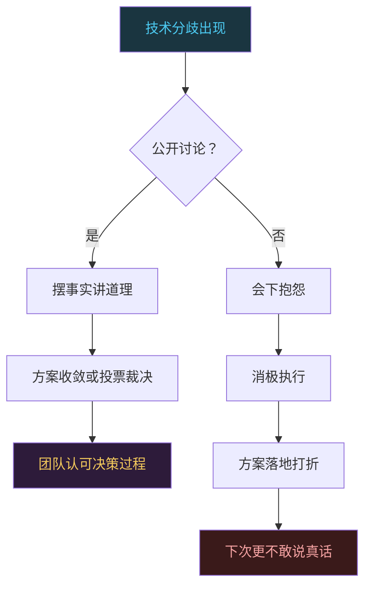
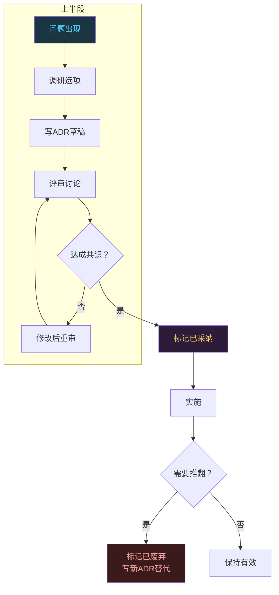

# 技术领导力：怎么带团队和做架构决策

```
╔══════════════════════════════════════════════╗
║  渡劫期 · 第174篇                              ║
║  技术领导力：怎么带团队和做架构决策             ║
║  预计阅读：16分钟                              ║
╚══════════════════════════════════════════════╝
```

渡劫期的修炼者刚从个人贡献者变成团队带头人，最大的落差不是少了写代码的时间，是多了一堆没法用编译器验证的决策。代码写错了编译器会报，架构选错了市场会报，团队带散了没有人会报，你只会发现某天开会没人说话了。这篇聊三个实在的东西：怎么让团队真正能打仗，怎么在技术分歧中拍板，怎么跟上下左右的人配合。

---

## 硬核主体

### 一、团队信任是地基，不是装饰

Lencioni在《团队的五种功能障碍》里把信任放在最底层，不是锦上添花的那种信任，是"我敢在团队面前承认我搞不定"的那种。缺少这种信任，后面四层全塌：害怕冲突，缺乏承诺，逃避问责，无视结果。

技术团队有个特殊问题：工程师群体的信任建立方式跟销售市场不一样。工程师不看你怎么说，看你代码写得怎么样、技术判断准不准。一个新上任的技术leader如果一上来就搞各种管理动作但不碰技术，团队心里不服，信任就建不起来。

Google在2015年做过一个叫Project Aristotle的项目，花了两年时间看了一百多个团队的数据，想找出好团队的共性。结论有点出乎意料：不是成员智商高，不是资历深，不是沟通工具好，排第一的因素是心理安全感（psychological safety）。就是团队成员敢不敢在会上说"我有个想法可能很蠢"而不被嘲笑。

```c
/* 技术leader建立信任的三个实操动作 */

// 1. 暴露自己的知识盲区
//    新管理者常犯的错：不懂装懂保住面子
//    正确做法：明确说"这块我没你们熟，你们讲给我听"
//    这不是示弱，是在降低团队的心理防御

// 2. 做技术判断时展示推理过程
//    不要只给结论："用FreeRTOS，不用裸机"
//    要给推理："我们有三路ADC并发采集，
//    裸机轮询会丢采样点，RTOS能保证调度时序，
//    FreeRTOS的社区支持比RT-Thread好，
//    团队里两个人有FreeRTOS经验，
//    所以选FreeRTOS"

// 3. 把荣誉分出去，把责任揽回来
//    团队做成了，是团队的功劳
//    团队搞砸了，是你的责任
//    这不是高尚，是管理常识
//    团队知道你不会甩锅，才敢在早期暴露问题
```

### 二、冲突不是坏事，不会吵架的团队才是坏事

Lencioni模型里第二层是"害怕冲突"。很多人觉得和谐团队就是不吵架的团队，这个认知有问题。技术团队如果从来不争论，只有两种可能：一种是大家想法完全一致，这种概率极低；另一种是大家不敢说真话，会上点头会下抱怨。

健康的冲突是什么样的？两个人对接口方案有不同看法，在会上直接辩论，摆数据讲道理，吵完该吃饭吃饭。不健康的冲突是会上不说，会下不配合，代码评审时互相挑刺。

技术leader在冲突中的角色不是当裁判，是当主持人。你不需要每次都给出正确答案，你需要确保辩论发生在桌面上而不是背后。



具体怎么做？当一个技术争议出现时，先让双方各自写一段200字以内的方案说明，列出优点和缺点，标注风险点。然后拉一个30分钟的会，双方陈述，其他人提问。如果30分钟还定不下来，leader拍板。拍板的原则是：可逆决策选速度，不可逆决策选慎重。

### 三、架构决策：ADR比记忆靠谱

技术leader做架构决策最大的坑是什么？是口头决策。你在某个周五下午跟两个人讨论了一下，说"我们就用SPI不用I2C吧"，然后这件事就活在三个人的记忆里。三个月后新人来了问为什么用SPI，没人答得上来。六个月后另一个模块的负责人选了I2C，因为没人告诉他这个决策。

Michael Nygard在2011年提出了一种叫ADR（Architecture Decision Record）的做法，后来被ThoughtWorks和很多大厂采用。ADR就是用一份简短文档记录每个架构决策，格式非常简单：

```markdown
# ADR-007: 传感器总线选SPI而非I2C

## 状态
已采纳（2024-03-15）

## 背景
项目需要连接6个传感器，采样率500Hz，
I2C在400kHz快速模式下带宽不够，
6个设备共享总线时地址分配也有冲突。

## 决策
选用SPI总线，硬件模式0（CPOL=0, CPHA=0），
使用3根片选线+1根共享MISO/MOSI/SCK。

## 后果
- 布线增加3根CS线，PCB面积增大约5%
- 传输速度可达18Mbps，满足500Hz采样需求
- 不支持多主模式，后续扩展需要加多路复用器
- 团队需熟悉SPI DMA配置
```

ADR的几个好处：决策有据可查，新人能快速理解历史背景，避免同一问题反复讨论。要点是ADR一旦采纳就不删，即使后来推翻了，也标记为"已废弃"并指向新ADR，保留决策演进的历史。



### 四、可逆与不可逆：两种决策用两种节奏

Jeff Bezos在致股东信里把决策分为两类，这个框架最早出现在1997年亚马逊第一封股东信中，后来在2015年的信里再次阐述。第一类是不可逆的，像装修时砸承重墙，砸完装不回去。选芯片平台或者定通信协议或者签技术锁定合同，这类决策一旦落地，改的代价极大。第二类是可逆的，像换办公室的桌椅位置，不行再换回来。换个日志库，换个代码风格检查工具，内部工具用什么语言写，这类决策试一周不满意换掉就行。

很多技术leader的问题是把两类决策都用同一个节奏处理。要么什么都慢，一个日志库选型讨论三周，团队等你拍板等到花都谢了。要么什么都快，芯片平台拍脑袋定了，半年后发现不支持USB OTG，整个方案推倒重来。

正确做法是：先判断可逆性，再定节奏。可逆决策给团队自治权，"你们选，选错也没关系"。不可逆决策多花时间调研，拉多方评审，做原型验证，甚至故意拖一拖让更多信息浮出来。

```c
/* 决策可逆性判断框架 */

typedef enum {
    DECISION_REVERSIBLE,    // 可逆：工具、库、内部流程
    DECISION_IRREVERSIBLE,  // 不可逆：硬件平台、通信协议、合同
    DECISION_PARTIALLY      // 部分可逆：架构分层，改一层不影响其他
} decision_type_t;

// 可逆决策：授权团队，限时限选
// 不可逆决策：多轮评审，原型验证，ADR记录
// 部分可逆：分层决策，可逆的部分快做
//          不可逆的部分慢做

// 嵌入式项目的典型不可逆决策：
// - MCU型号（换芯片=重新设计硬件）
// - RTOS选型（换系统=重写驱动层和任务架构）
// - 通信协议（换协议=设备间不兼容）
// - 安全认证方案（换=重新过认证花钱花时间）

// 典型可逆决策：
// - 调试工具链（换GDB插件不影响产品）
// - 日志格式（改格式只需改打印函数）
// - 内部测试框架（换框架不影响固件功能）
// - 代码风格（有lint工具可以自动迁移）
```

### 五、向上管理：你的上级也需要你管

"向上管理"这个词容易让人误解，以为是教上级怎么做事。不是。向上管理的意思是：确保你的上级知道你在做什么，知道你需要的资源，知道你的团队产出了什么。

技术leader最容易忽略的就是这件事。你觉得事情做完了就行了，结果摆在那里，上级看不到说明他不关心。事实是，你的上级管着好几个团队，每天的信息量是你的几倍。你不主动告诉他，他真的不知道。

向上管理三个实操动作：

第一，周报不要写流水账。不要写"本周完成了XX模块开发，下周计划做YY"。写三行就够：本周成果用数字说话，当前风险写清楚需要什么支持，下周重点一句话概括。你的上级最想看的是风险和需要他帮忙的事，不是你的todo list。

第二，定期同步预期。每季度跟上级对一次：团队未来三个月做什么，不做什么，为什么。如果你跟上级的预期不一致，越早发现越好。等到季度末才发现跑偏了，两个月的产出可能白费。

第三，好消息和坏消息一起报。有些leader只报好消息，怕报坏消息被上级觉得能力不行。等到问题捂不住了才说，那时候已经晚了，上级想帮忙都帮不上。坏消息早报，带上你的应对方案，上级会觉得你靠谱。

### 六、跨团队协作：利益不对齐才是真问题

跨团队协作的难点不在于沟通技巧，在于利益不对齐。你的团队要赶deadline，隔壁团队优先做他们自己的需求，你的依赖排不进他们的排期。你催他们，他们说"我们也忙"。这不是态度问题，是优先级问题。

解法分三层。第一层是找共同目标。两个团队的上司是同一个人吗？如果是，让那个共同的上级来排优先级。如果不是，找一个更高的层级来对齐。没有共同目标，跨团队协作永远是"你求他办事"的关系。

第二层是降低耦合。如果你的模块依赖隔壁团队的东西，问问能不能切掉这个依赖。能不能用mock先跑起来？能不能把这个功能内化到自己的模块？依赖越少，跨团队协作的需求越少。

第三层是建立接口契约。两个团队必须有明确的接口定义：谁提供什么，什么时候提供，格式是什么。口头约定不算数，写到文档里，放到双方都能看到的地方。出了问题照文档对，不扯皮。

---

## 修仙术语对照表

| 修仙术语 | 技术现实 | 本篇位置 |
|---------|---------|---------|
| 渡劫落差 | 从写代码到带人的角色转变困难 | 引入段 |
| 信任地基 | Lencioni团队信任是五层模型最底层 | 第一节 |
| 心理安全感 | Google Project Aristotle项目首要因素 | 第一节 |
| 暴露盲区 | 管理者承认自己不懂以降低团队防御 | 第一节 |
| 健康冲突 | 技术分歧在桌面上辩论而非背后抱怨 | 第二节 |
| 主持人角色 | leader在技术争议中不裁判而是引导 | 第二节 |
| 决策留痕 | ADR记录架构决策避免遗忘和重复讨论 | 第三节 |
| 砸承重墙 | 不可逆决策改了代价极大 | 第四节 |
| 换桌椅 | 可逆决策试了不行可以改回来 | 第四节 |
| 预期同步 | 每季度跟上级对齐方向预期 | 第五节 |
| 坏消息早报 | 问题早暴露上级能帮忙的概率更高 | 第五节 |
| 利益对齐 | 跨团队协作需要共同目标和优先级 | 第六节 |
| 接口契约 | 跨团队协作用文档定义交付物规格 | 第六节 |
| 降低耦合 | 减少跨团队依赖以降低协作成本 | 第六节 |

---

## 进阶条件

- [ ] 能用自己的话讲清楚Lencioni五层模型，并说出自己团队当前哪层最弱
- [ ] 团队至少有一个正在使用或准备使用的ADR记录，格式包含背景/决策/后果
- [ ] 能列出自己当前工作中三个可逆决策和三个不可逆决策，并说明判断依据
- [ ] 给上级发过一次非流水账式的周报，包含成果数字和风险支持请求
- [ ] 能说出一个跨团队协作中的利益不对齐案例，并说明用了哪一层解法
- [ ] 团队会议中出现过至少一次技术分歧的公开辩论，且辩论后团队关系没变差
- [ ] 给自己定一条规则：什么决策授权团队做，什么决策必须自己拍板

---

## 下期预告 + 互动

下一篇：修炼永恒，终身学习不是口号是生存方式

技术领导力不是终点，修炼的路没有尽头。下一篇聊技术人怎么保持学习节奏，怎么在忙碌的工作中持续吸收新知识，怎么判断哪些该学哪些可以不看。技术行业发展快，停止学习一年就跟不上，但乱学一通也不行。学习方法论和知识网构建，是渡劫期的最后一道内功。

讨论：你在跨团队协作中遇到过最头疼的事是什么？最后怎么解决的？

我是玄芯散人，带你从炼气修到大乘。

---

*本文是「码农修仙传」系列第174篇。系列导航见 [xren.ren](https://xren.ren)*
