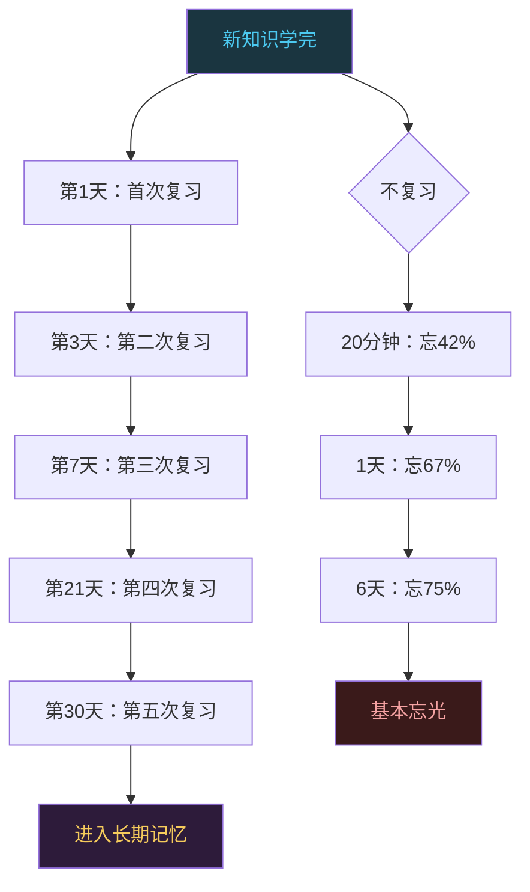
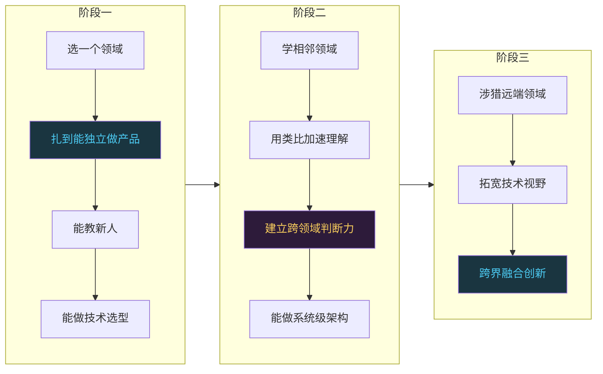
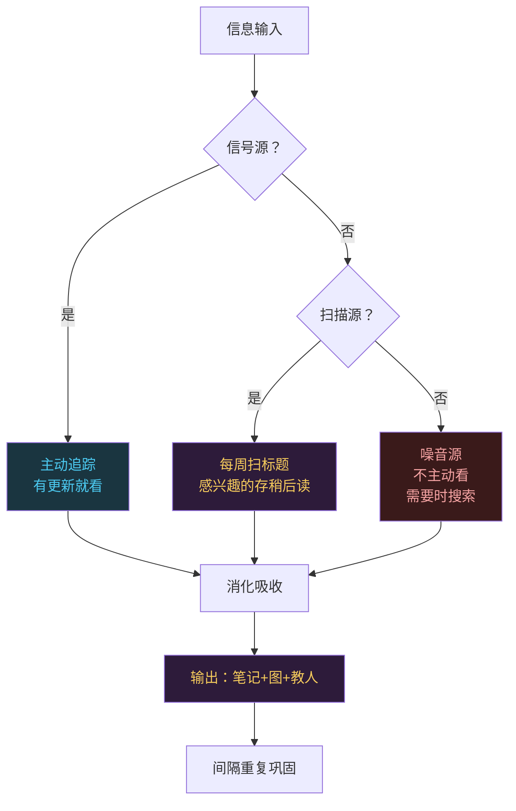

# 修炼永恒：终身学习不是口号是生存方式

```
╔══════════════════════════════════════════════╗
║  渡劫期 · 第175篇                              ║
║  修炼永恒：终身学习不是口号是生存方式           ║
║  预计阅读：14分钟                              ║
╚══════════════════════════════════════════════╝
```

渡劫期的修炼者已经趟过了技术管理的劫雷，接下来面对的是一个更隐蔽的敌人：知识的保质期。你十年前学的ARM Cortex-M3手册至今管用，你三年前学的某个前端框架可能已经没人提了。技术行业跟医药行业有个相似之处：知识会过期，而且不同领域的保质期差得离谱。这篇聊三个实在的东西：怎么判断哪些知识该深学哪些该浅学，怎么对抗遗忘曲线把学过的东西留住，怎么在忙碌的工作中维持学习节奏不断档。

---

## 硬核主体

### 一、知识有半衰期，不是所有知识都值得深学

技术知识可以粗略分为三层，每层的保质期不同。

第一层是基础层。C语言语法，数据结构与算法，计算机组成原理，操作系统概念，TCP/IP协议。这些东西的半衰期在二十年以上。Kernighan和Ritchie在1978年写的《The C Programming Language》，到今天还是C程序员的入门标准。Donald Knuth在1968年开始写的《The Art of Computer Programming》，到今天还是算法领域的圣经。这一层的知识值得花大力气深学，因为投入回报周期长。

第二层是系统层。Linux内核机制，RTOS原理，编译器架构，数据库引擎设计。这层的半衰期大概五到十年。Linux内核的CFS调度器在2.6.23版本（2007年）引入，一直用到6.6版本才被EEVDF替代，活了十六年。FreeRTOS的API设计在2003年发布，到现在基本没大改。这层知识值得学，但要注意版本演进，学了之后得定期更新。

第三层是工具层。某个IDE的快捷键，某个框架的配置文件写法，某个云平台的控制台操作。这层的半衰期可能只有一两年。你2019年学的Webpack配置，到2024年Vite已经占了半壁江山。你花两周背下来的STM32CubeMX某个版本的菜单布局，升级一版全变了。

```c
/* 知识投资策略：按半衰期分配精力 */

// 半衰期 > 20年（基础层）：深学，值得反复读
//   - C语言指针和内存模型
//   - 数据结构（链表/树/图/哈希表）
//   - 操作系统原理（进程/内存/文件/中断）
//   - 网络协议（TCP三次握手/状态机）
//   → 投入：大量时间，精读经典教材，做练习题

// 半衰期 5-10年（系统层）：学好，定期更新
//   - Linux内核子系统（调度/内存/IPC）
//   - RTOS内核原理（任务调度/优先级反转）
//   - 编译器后端（寄存器分配/指令选择）
//   → 投入：中等时间，读源码，做实验

// 半衰期 < 2年（工具层）：够用就行，不背
//   - IDE快捷键（用的时候查）
//   - 框架配置（抄模板改）
//   - 平台操作（看文档跟着做）
//   → 投入：最少时间，用时查，不花时间背
```

判断一个知识属于哪层的方法很简单：问自己"这个东西五年后还管用吗"。如果答案是"大概率管用"，值得深学。如果答案是"不好说"，学到能干活就行。如果答案是"肯定不管用"，别花时间背，存个书签用时查。

### 二、遗忘不是你的错，不安排复习才是

Hermann Ebbinghaus在1885年发表了一个实验结果，他用了无意义音节作为实验材料，测量记忆的衰退速度。结果画成曲线后就是著名的"遗忘曲线"：学完20分钟后遗忘约42%，一天后遗忘约67%，六天后遗忘约75%。后来很多研究者用更有意义的材料重复实验，遗忘速度没这么夸张，但趋势一样：不复习就忘，而且前期忘得快。

对抗遗忘的方法不是"多看几遍"，是有间隔地复习。这个方法叫间隔重复（Spaced Repetition），原理很简单：在你快要忘记但还没忘记的时候复习一次，记忆会被强化，下次遗忘的速度会变慢。经过几次间隔重复后，记忆会进入长期记忆区，衰退速度大幅降低。

具体的间隔方案，最出名的是SuperMemo算法的发明者Piotr Woźniak提出的SM-2算法。简化版是：第一次复习在学后1天，第二次在3天后，第三次在7天后，第四次在21天后，第五次在30天后。这个方案不需要什么工具，手机日历就能做。



不过有个前提：不是所有学过的东西都值得用间隔重复来记。只对"需要长期记住且会反复用到"的知识做间隔重复，比如寄存器位域定义，常用算法的复杂度，或者错误码含义。对于"知道在哪查就行"的知识，存个笔记用时查比背下来更省事。

### 三、刻意练习：不是重复一万小时就能成专家

Anders Ericsson在1993年发表了一篇研究，对象是柏林音乐学院的小提琴学生。他发现顶尖学生和普通学生的练习时间差不多，区别在于练习的方式。顶尖学生花更多时间在"刻意练习"上：有明确目标，有即时反馈，专注自己的薄弱环节。后来Malcolm Gladwell在《Outliers》里把这个研究简化成"一万小时定律"，但Ericsson本人多次澄清：他从来没有说过只要练一万小时就能成专家。

刻意练习跟普通练习的区别在哪？写代码的人来说，每天写CRUD业务逻辑写了五年，大概写了几万小时代码，但技术水平可能没有显著提升。因为这种重复没有挑战性，没有反馈，没有走出舒适区。刻意练习要满足三个条件：

```c
/* 刻意练习三要素 */

// 1. 目标明确：不是"学Linux内核"，是"搞清楚epoll的内核实现"
//    把模糊目标拆成可验证的小目标：
//    - 读懂eventpoll结构体定义
//    - 追踪epoll_ctl的内核调用链
//    - 画出就绪链表的维护逻辑
//    - 写一个最小化的epoll实现

// 2. 即时反馈：做完马上知道对不对
//    - 写代码：编译器+测试用例是即时反馈
//    - 读源码：能画出调用链图就是反馈
//    - 学协议：能用Wireshark抓包验证就是反馈
//    没有反馈的练习等于白练，你不知道自己哪里错了

// 3. 走出舒适区：每次练习要比上次难一点
//    - 能看懂别人写的驱动 → 试着自己写一个
//    - 能写GPIO驱动 → 试试DMA驱动
//    - 能写单线程程序 → 试试多线程并发
//    一直在舒适区重复，能力不会增长
```

技术人的刻意练习有个天然优势：编译器和硬件是诚实的反馈源。你写的代码能跑就是能跑，跑不了就是跑不了，寄存器配错了硬件不会配合你演。利用好这个优势，每个学习目标都配一个"做出来验证"的环节，比单纯看书有效得多。

### 四、T型人才：先扎一根深桩，再横向扩展

T型人才的说法在技术圈流行了很多年，横杠代表知识广度，竖杠代表知识纵深。这个模型是对的，但很多人理解反了：先扩广度再找纵深。正确的顺序是先深后广。

为什么先深？因为纵深是判断力的来处。你在嵌入式领域扎下去，把STM32的启动流程、外设驱动、RTOS调度都搞透了，这时候你去看Linux设备模型，会发现很多东西是相通的：中断处理的下半部思想，DMA缓冲区管理，时钟门控。你有了一个领域的纵深，学第二个领域时能靠类比加速理解，这比零基础开始快得多。

如果没有纵深就扩广度，你会变成"什么都听说过，什么都不懂"的状态。面试时每个话题都能接两句，往下追问就露馅。这种人在技术团队里的定位很尴尬：做不了难题，带不了新人，写不了方案。



横向扩展时有个实用技巧：找每个领域的"第一性原理"。学操作系统不必背Shell命令，先理解"进程是什么""虚拟内存解决什么问题""为什么要中断"。学网络协议不必背HTTP方法列表，先理解"可靠传输需要什么条件""为什么要分层"。抓住每个领域的底层问题，上面的具体实现就是同一个问题的不同解法，理解起来快得多。

### 五、输出驱动：费曼技巧的工程版

Richard Feynman有个学习方法：如果你不能用简单的语言把一个概念讲清楚，说明你没真正理解。这个方法被提炼成四步：选一个概念，用大白话解释，发现讲不清楚的地方回去补，简化语言再讲一遍。

技术人可以用工程化的方式做费曼技巧。不是写科普文章，是做这三件事：

第一，写笔记。不是抄书，是用自己的话把学的东西复述一遍。你读完一篇关于Cache一致性的文章，合上文章写：MESI协议解决了什么问题，四个状态分别什么意思，什么时候发生状态转换。写不出来就说明没读懂，回去重新读。

第二，画图。把技术架构画成mermaid图或手绘草图。画图逼你想清楚组件之间的关系，哪里是顺序执行，哪里是并行，哪里有反馈循环。画不出来的架构说明理解有漏洞。

第三，教人。给同事讲，给新人讲，写博客，写技术分享文档。教人的时候你会发现自己以为懂的东西有不少模糊地带，别人一问就暴露了。这种暴露是好事，比在面试或关键技术决策时暴露强得多。

```c
/* 费曼技巧的工程化执行 */

// 学完一个技术概念后，做三件事：

// 1. 写：用自己的话复述，不抄原文
//    模板：
//    "XX解决的问题是____"
//    "它的做法是____"
//    "这种做法的代价是____"
//    "替代方案有____，各有何取舍"

// 2. 画：用图把结构关系画出来
//    - 架构图：组件之间怎么连接
//    - 流程图：执行顺序是什么
//    - 时序图：谁先动谁后动
//    画不出来的地方就是没理解的地方

// 3. 教：找一个人（或假装有一个人）讲给他听
//    如果对方问"为什么是A不是B"
//    你能回答，说明理解到位
//    答不上来，回去补
```

### 六、信息过滤：不是信息太少，是噪音太多

技术人面临的问题不是找不到学习资料，是资料太多分不清哪些值得看。每天HN首页几十条，Reddit的r/programming上百条，技术公众号推一堆，RSS订阅器里未读文章永远清不完。如果把所有"看起来有用"的文章都读一遍，你一天什么都不用干了。

解法是建立信息过滤机制。把信息源分三档：

第一档是信号源，质量高，跟你做的领域相关，更新不频繁。比如你做嵌入式，ARM官方文档，FreeRTOS源码，STM32 Errata，几个靠谱的嵌入式博客。这些值得主动追踪，有更新就看。

第二档是扫描源，信息量大但需要筛选。比如HN、Reddit、技术聚合站。这些每周扫一次标题，感兴趣的存到稍后读列表，不感兴趣的不管。

第三档是噪音源，推送量大，重复率高，时效性强但内容不够深。比如大部分公众号，短视频平台的技术内容。这些不主动看，只在需要查某个具体问题时搜索到再看。



稍后读列表有个规矩：存进去超过两周没看的，删掉。这不是残忍，是诚实。两周都没看说明优先级不够高，与其让它在列表里制造焦虑，不如删了把注意力留给当前真正需要的东西。

### 七、学习节奏：工作日碎片+周末深潜

全职工作的技术人最大的困惑是"没时间学习"。其实不是没时间，是没有大块时间。工作日被会议和需求切碎，能抽出半小时就不错了。周末有时间但容易懈怠。解法是把学习分成两种模式，分别塞进不同时间段。

工作日做碎片学习。通勤路上听技术播客，午休时间读一篇存下来的文章，等编译的时候翻两页文档。碎片时间的用途是"扫描和存储"：快速过一遍新东西，判断值不值得深学，值得的存下来等周末深入。碎片时间不适合学需要全神贯注的东西，比如内核调度器的实现逻辑，那种需要你集中注意力画调用链图的内容，碎片时间根本进不去状态。

周末做深潜学习。留出至少两个小时的整块时间，手机静音，关掉通知，选一个之前存下来的主题深入学。读源码，做实验，写笔记，画图。两小时不被打断的深潜学习，效果顶得上工作日十几个碎片时间加起来。

```c
/* 一周学习节奏参考 */

// 工作日（碎片模式）：
//   通勤 30min：听技术播客/读文章
//   午休 15min：扫稍后读列表，删过期，存新的
//   等编译 10min：翻文档/看代码片段
//   睡前 20min：写当天学习笔记（哪怕只有三行）
//   → 目标：扫描+存储，不追求纵深

// 周末（深度模式）：
//   周六上午 2-3h：选一个主题深入学
//   周日下午 1-2h：整理本周笔记+画图+写博客
//   → 目标：深入理解+输出巩固

// 注意事项：
//   - 不是每周都能做到，被打断是常态
//   - 连续两周没深潜学习就该警觉：你在消耗存量
//   - 出差/加班密集期降低预期，保住碎片学习就行
//   - 不要因为某周没学就放弃，节奏断了捡回来继续
```

有个误区要提醒：不要把"看技术新闻"当成学习。看一条"Rust进入Linux内核"的新闻，你知道了这件事，但你不知道Rust的内存安全模型是怎么回事，不知道Linux内核接受Rust的争议点在哪，不知道Rust在嵌入式场景能不能用。新闻只提供"知道"，不提供"理解"。学习是要获得理解，不是收集信息。

### 八、反学习：过时知识是负担

技术人都有这个经历：你脑子里某个API的用法是三年前版本的记忆，现在版本变了，你用老记忆写代码，编译报错，排查半天才发现是API变了。过时的知识不只是没用，还会 actively 妨碍你，因为你会基于错误的前提做判断。

定期清理过时知识的方法：每半年做一次"知识审计"。把你常用的技术栈列出来，逐个检查：这个技术的版本跟你学的时候有没有大变化？你记忆中的用法跟当前文档一致吗？有没有已经被废弃的API你还在用？

对于变化大的领域（比如前端框架、云平台服务），这个审计可能每次都能发现一堆过时记忆。对于变化小的领域（比如C标准库、POSIX接口），审计基本不会有变化，做一次确认就行。

```c
/* 知识审计清单 */

// 每半年执行一次：

// 1. 列出当前工作中用到的技术栈
//    例：C99 / GCC / STM32 HAL / FreeRTOS / Git / Linux

// 2. 逐个检查：
//    - 当前版本号是多少？跟你学的时候差几个大版本？
//    - 你记忆中的核心API还存在吗？有没有deprecated？
//    - 有没有新增的feature你不知道？
//    - 有没有安全漏洞相关的改动你漏了？

// 3. 发现过时知识后：
//    - 不要试图"覆盖"旧记忆，直接读最新文档重新学
//    - 把变化点记到笔记里："v2.x的XX在v3.x改成了YY"
//    - 更新你的代码模板和脚手架

// 4. 特别注意：
//    - 安全相关的知识必须保持最新
//    - 你教给新人的知识必须是最新的
//    - 面试时说的知识必须是最新的
```

---

## 修仙术语对照表

| 修仙术语 | 技术现实 | 本篇位置 |
|---------|---------|---------|
| 知识保质期 | 技术知识按半衰期分三层：基础层>20年，系统层5-10年，工具层<2年 | 第一节 |
| 遗忘劫 | Ebbinghaus遗忘曲线：不复习20分钟忘42%，六天忘75% | 第二节 |
| 间隔修炼 | Spaced Repetition间隔重复：第1/3/7/21/30天复习 | 第二节 |
| 刻意修炼 | Anders Ericsson刻意练习：目标明确+即时反馈+走出舒适区 | 第三节 |
| 一万小时误区 | Gladwell简化版"一万小时定律"，Ericsson本人澄清非充分条件 | 第三节 |
| 深桩 | T型人才先扎一个领域的纵深再做横向扩展 | 第四节 |
| 第一性原理 | 抓住领域底层问题，具体实现是同一问题的不同解法 | 第四节 |
| 费曼心法 | 用自己的话复述+画图+教人来验证理解程度 | 第五节 |
| 信号源 | 质量高更新少值得主动追踪的信息源 | 第六节 |
| 扫描源 | 信息量大需筛选，每周扫标题存稍后读 | 第六节 |
| 噪音源 | 推送量大内容浅，不主动看需要时搜索 | 第六节 |
| 碎片修炼 | 工作日碎片时间做扫描和存储，不追求纵深 | 第七节 |
| 深潜修炼 | 周末两小时以上整块时间深入学一个主题 | 第七节 |
| 知识审计 | 每半年检查常用技术栈的版本变化和过时记忆 | 第八节 |
| 反学习 | 清理过时知识避免错误前提干扰判断 | 第八节 |

---

## 进阶条件

- [ ] 能把自己常用的技术栈按半衰期分三层，并说明每层的学习投入策略
- [ ] 对至少一个"需要长期记住"的知识点执行过完整的间隔重复流程（5次复习）
- [ ] 能区分自己当前的练习是"刻意练习"还是"舒适区重复"，并各举一个例子
- [ ] 在自己的主领域达到"能教新人+能做选型"的纵深，并列出达到这个纵深的标志
- [ ] 用费曼技巧的工程版（写+画+教）验证过至少一个技术概念的理解
- [ ] 建立了三档信息源分类，且稍后读列表执行了"两周未看即删"的规则
- [ ] 执行过至少一次知识审计，发现了至少一个过时的知识记忆并更新
- [ ] 连续四周保持学习节奏（工作日碎片+周末深度），即使被打断也能捡回来继续

下一篇聊技术人的知识管理：怎么搭建笔记系统，怎么构建个人知识库，怎么让学过的东西需要时能找到而不是重新学一遍。

讨论：你学过的技术知识里，哪一类过期最快？你是怎么发现它过期的？

我是玄芯散人，带你从炼气修到大乘。

---

*本文是「码农修仙传」系列第175篇。系列导航见 [xren.ren](https://xren.ren)*
