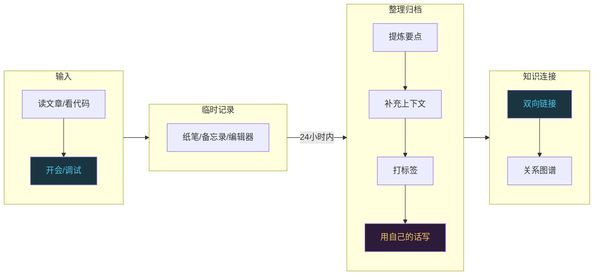
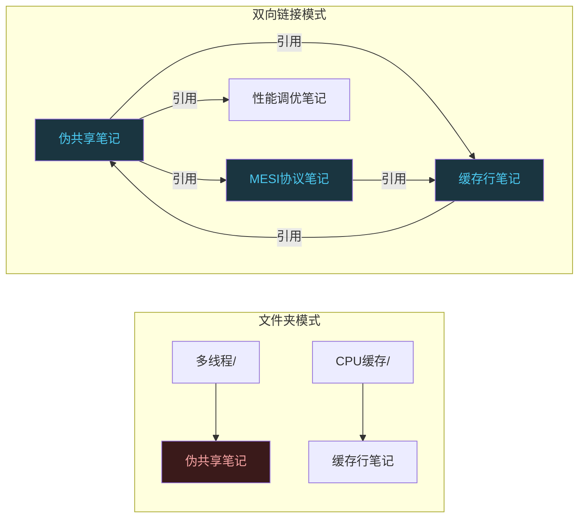
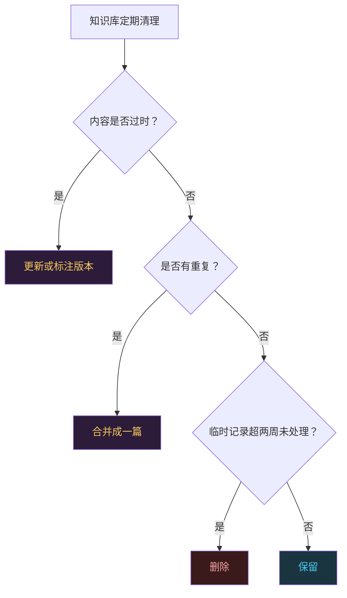

# 技术人的知识管理：笔记系统和知识库怎么搭

```
╔══════════════════════════════════════════════╗
║  渡劫期 · 第176篇                              ║
║  技术人的知识管理：笔记系统和知识库怎么搭       ║
║  预计阅读：14分钟                              ║
╚══════════════════════════════════════════════╝
```

渡劫期的修炼者上篇聊了终身学习，这篇接着聊一个更实际的问题：学过的东西你找得到吗？你三年前调试过一个SPI总线死锁的BUG，当时查了三天才找到原因是Clock Stretching没处理。现在另一个项目又遇到了类似问题，你记得自己解决过，但解决方案写在哪了？在哪个笔记本上？在哪个项目的commit message里？还是在某个已经找不到的聊天记录里？这篇聊三个实在的东西：笔记系统怎么分层，两种主流方法论怎么选，技术人的知识库该装什么内容。

---

## 硬核主体

### 一、人脑擅长联想，不擅长存储

先说一个被认知科学反复验证的事实：人脑的长期记忆容量虽然理论上很大，但提取能力极不可靠。你"记得自己学过某个东西"和"能回忆出那个东西的具体内容"是两回事。Daniel Schacter在2001年出版的《The Seven Sins of Memory》里总结了记忆的七种缺陷，其中一种叫"提取性遗忘"（blocking）：你知道信息就在脑子里，但就是想不起来，需要外界线索才能触发。

这就是知识库存在的理由。知识库不是替你记忆，是给你提供提取线索。你不需要记住SPI总线死锁的解决方案是什么，你只需要记住"我把它记在了某处，能搜到"。把大脑从存储中解放出来，让它做更擅长的事：联想和判断。

```c
/* 人脑 vs 知识库的分工 */

// 人脑擅长：
//   - 联想（看到A想到B）
//   - 模式识别（这BUG跟上次那个很像）
//   - 判断（这个方案靠谱不靠谱）
//   - 创造（把两个不相关的东西连起来）

// 人脑不擅长：
//   - 精确存储（寄存器地址具体是0x40010800还是0x40020400）
//   - 大量记忆（STM32有几十个外设，每个都有寄存器表）
//   - 时序记忆（这个坑是去年三月踩的还是前年踩的？）

// 知识库的作用：
//   - 存储精确信息（地址、参数、命令、步骤）
//   - 提供提取线索（搜"SPI死锁"能找到当时的记录）
//   - 保留上下文（当时为什么这么干，有什么约束）
//   - 释放脑容量给联想和判断
```

有个误区要先纠正：记笔记不等于知识管理。很多人记了一堆笔记，从来不看也不搜，笔记变成一堆写了就忘的文本垃圾。记笔记只是输入，知识管理还包括整理，然后连接，然后检索和更新。只有输入到输出链路跑通，笔记才算有用。

### 二、笔记系统三层结构

一个能用的笔记系统需要三层，缺一层都会出问题。

第一层是临时记录层。你在读文章或者看代码或者开会时随手记的东西。特点是快、乱、碎片化。这一层的目标是不打断当前思路，把信息先抓住再说。纸笔可以，手机备忘录可以，随便一个编辑器也行。临时记录层有个规矩：必须在24小时内处理，要么整理到第二层，要么删掉。不处理的临时记录会堆积成心理负担，越积越多越不想碰。

第二层是整理归档层。把临时记录里的有价值内容提取出来，整理成结构化的笔记存入知识库。这一层的动作是：提炼要点，补充上下文，打标签分类，建立跟已有笔记的关联。一篇好的归档笔记不是原文抄录，是经过你消化后用自己的话写的。抄录的东西过两周自己都看不懂当时记的是什么意思。

第三层是知识连接层。归档的笔记不是孤立存在，它们之间有关系。这篇讲Cache行伪共享的笔记，跟之前写的多线程性能调优笔记有关系，也跟MESI协议的笔记有关系。把这种关系用链接表达出来，知识就不再是一堆散落的文件，而是一个能生长的网络。你搜一个主题时，顺着链接能找到相关的所有内容。



### 三、Zettelkasten：一个社会学家的9万张卡片

Niklas Luhmann是德国社会学家，一生写了70本书和近400篇论文，产出量远超同行。他的秘密武器是一套自己发明的笔记系统，叫Zettelkasten（德语"卡片盒"）。他一辈子在木制卡片盒里积累了大约9万张卡片，每张卡片是一个想法，卡片之间用编号互相引用，形成了一个可以"对话"的知识网络。

Zettelkasten的几个原则：

每张卡片只写一个想法，不要把一堆东西塞在一张卡片上。Luhmann管这个叫"原子化"。一个想法独立存在，才能被多个不同的上下文引用。如果你把SPI的CPOL和CPHA跟I2C的地址冲突写在一张卡片上，以后搜CPOL时也会搜出I2C的东西，噪音混进来了。

每张卡片用自己的话写，不抄原文。Luhmann认为抄录原文只是在搬运文字，没有经过大脑加工。用自己的话复述，如果说不清楚，说明你没理解。

卡片之间互相引用。当一张新卡片跟某张旧卡片有关系时，在两张卡片上都标注对方的编号。久而久之，卡片盒里形成了一个引用网络，你从任何一张卡片出发，顺着引用能看到一条思想脉络。

```c
/* Zettelkasten的原子化笔记示例 */

// 卡片 #2024-031
// 标题：SPI的CPOL决定空闲时钟电平
// CPOL=0时SCK空闲为低电平，CPOL=1时空闲为高电平
// CPHA决定在第几个边沿采样
// 四种组合对应SPI Mode 0-3
// 最常用的是Mode 0和Mode 3
//
// 引用：#2024-029（SPI总线主从模式配置）
// 引用：#2024-035（Flash芯片支持的SPI Mode）

// 这张卡片只讲CPOL/CPHA一个概念
// 以后写任何涉及SPI的笔记都可以引用它
// 不会被其他无关内容干扰
```

Luhmann的Zettelkasten是纸笔时代的产物，但它的设计思想在数字时代被广泛采用。Obsidian、Roam Research、Logseq等工具都内置了双向链接功能，让"卡片之间互相引用"这件事变得自动化。

### 四、PARA：按行动上下文分类

跟Zettelkasten的"想法网络"思路不同，Tiago Forte在《Building a Second Brain》里提出了一套叫PARA的分类方法。PARA是四个文件夹的首字母：

P是Projects（项目），有明确目标和截止时间的事。比如"写完STM32 Bootloader的技术文章"，"把家里NAS的存储从4TB扩到16TB"。项目文件夹里的东西完成后会被归档。

A是Areas（领域），需要持续维护但没有截止日期的事。比如"嵌入式技能维护"，"健康"，"财务"。领域文件夹里的东西是长期积累的参考资料。

R是Resources（资源），感兴趣但不属于任何项目或领域的东西。比如收藏的文章，有用的工具列表，某个技术的学习资料。

A是Archives（归档），已完成的项目和不再活跃的内容。不删，留着以后查。

```c
/* PARA目录结构示例 */

// knowledge-base/
// ├── 1-Projects/           // 有截止日期的活跃项目
// │   ├── stm32-bootloader-article/
// │   └── nas-expansion/
// ├── 2-Areas/              // 持续维护的领域
// │   ├── embedded-skills/
// │   ├── team-management/
// │   └── personal-finance/
// ├── 3-Resources/          // 感兴趣的参考资料
// │   ├── arm-docs/
// │   ├── rust-learning/
// │   └── interesting-articles/
// └── 4-Archives/           // 已完成的
//     ├── 2023-rtos-migration/
//     └── 2022-ci-cd-setup/

// PARA的判断标准不是"这是什么类型的内容"
// 而是"这个内容在我的哪个行动上下文里"
```

PARA的哲学是：信息组织应该围绕行动转，不该按知识分类摆。你把笔记分成"操作系统""网络""数据库"这种学科分类，看着整洁，但实际用的时候发现：你要解决一个具体问题，涉及的笔记散落在三四个分类里。按行动上下文组织，相关的东西就在同一个地方。

Zettelkasten和PARA不是互斥的。实际上很多人把它们结合用：用PARA做顶层目录分类，用Zettelkasten的原子化笔记和双向链接做笔记内部的组织。外层按行动上下文分，内层按知识网络连。

### 五、工具选择：本地优先加Markdown

知识管理工具的选择是技术人最容易纠结的事。纠结的原因是把工具看得太重了。工具是载体，方法论才是主角。用Obsidian加上Zettelkasten方法论能用好，用纸笔加同样的方法论一样能用。Luhmann用木卡片盒写了9万张卡片，产出比大多数数字工具用户都高。

不过工具确实有优劣。对技术人来说，有三个选择原则。

第一是本地优先。你的知识库可能要用十年以上，云端服务能不能活那么久不好说。Even Notion那么流行的产品，数据全存在它的服务器上，导出格式是它自己的结构化JSON，不是标准Markdown。哪天它改政策或关服务，迁移成本极高。本地存储加Markdown纯文本，任何编辑器都能打开，任何系统都能读，不依赖任何公司的商业决策。

第二是Markdown格式。这不是格式偏好，是长期可维护性的考虑。Markdown是纯文本，十年前的.md文件今天打开格式完好。你五年前用某个笔记软件写的富文本笔记，那个软件停更后可能打不开。Markdown可以用git版本管理，可以grep搜索，可以用脚本批量处理。技术人本来就熟悉它，学习成本为零。

第三是双向链接。传统文件夹结构有一个问题：一篇笔记只能放在一个文件夹里，但一个知识点可能属于多个上下文。Cache行伪共享在多线程编程里会遇到，在CPU缓存话题里也会出现，性能调优时也躲不开。放哪个文件夹都不全。双向链接让你在一篇笔记里写`[[CPU缓存行]]`和`[[多线程伪共享]]`，两个方向都能搜到这篇。



Obsidian是目前符合这三个原则且社区活跃的工具。本地存储Markdown文件，内置双向链接和关系图谱，插件丰富。但记住，选Obsidian不是因为它是"最好的笔记软件"，是因为它符合本地优先加Markdown加双向链接这几个原则。哪天有更好的工具符合这些原则，换过去成本也不高，因为数据是自己的。

### 六、技术人知识库该装什么

通用知识管理方法论讲完了，具体到技术人，知识库应该装哪些内容？根据实际工作经验，以下五类值得存。

第一类是Debug记录。你花了两小时以上排查的BUG都值得记一条。格式很简单：现象是什么，你怀疑的原因是什么，实际原因是什么，怎么修的。重点是"你怀疑的原因"和"实际原因"的差异，因为下次遇到类似现象，你的第一直觉大概率还是错的，有记录可以帮你跳过走弯路。

第二类是代码片段和配置模板。不是什么代码都记，记的是那种"每次写都要查一遍"的东西。比如STM32的 linker script怎么写，FreeRTOS的 heap配置怎么选，CMake的交叉编译工具链怎么配。这些不常用但用到时不想现查文档的东西，存一份模板改着用。

第三类是架构决策记录（ADR）。在之前聊技术领导力那篇提到过ADR，它不只是团队级的文档，个人知识库里也值得存。你做过的技术选型决策，为什么选A不选B，当时有哪些约束，后来证明选对了没有。这些决策记录积累起来就是你技术判断力的成长轨迹。

第四类是学习笔记。读完一本书或者一篇论文或者一份芯片手册后写的笔记。用费曼技巧的方式写：这本书解决了什么问题，作者怎么解的，有什么局限，跟我已经知道的东西有什么关联。学习笔记不是摘抄，是消化后的输出。

第五类是Errata和踩坑记录。芯片的Errata sheet里列的已知问题，某个库的版本兼容性问题，某个工具的已知BUG和workaround。这类信息零散但很高价值，遇到了就记，以后再遇到省得重新查。

```c
/* 技术人知识库的五大类内容 */

// 1. Debug记录（高价值，防重复踩坑）
//    模板：
//    现象：____
//    怀疑原因：____（记录错误方向，避免下次走同样的弯路）
//    实际原因：____
//    修复方法：____
//    耗时：____

// 2. 代码片段和配置模板
//    - linker script模板
//    - CMake交叉编译工具链
//    - FreeRTOSConfig.h常用配置
//    - .gitignore模板（嵌入式项目专用）

// 3. 架构决策记录（ADR）
//    - 选型决策：为什么选A不选B
//    - 约束条件：当时有哪些限制
//    - 回顾：后来证明选对没有

// 4. 学习笔记（费曼式输出）
//    - 读完一本书/论文/手册后写
//    - 不是摘抄，是消化后复述
//    - 标注跟已有知识的关联

// 5. Errata和踩坑记录
//    - 芯片已知问题
//    - 库版本兼容性
//    - 工具已知BUG和workaround
```

### 七、检索比存储重要

很多人花大量精力记笔记存资料，但从来不检索。笔记库越来越大，搜索能力没有跟上，结果就是"我知道我记过这个，但搜不到"。存了等于没存。

检索能力的建设分两步。第一步是给笔记打标签。标签不是文件夹那种单选分类，是多个侧面的标注。一篇关于DMA双缓冲的笔记可以同时打`#DMA` `#双缓冲` `#STM32` `#性能调优`四个标签。以后搜任何一个标签都能找到它。标签不要太细，太细了每个标签只有一两篇笔记，失去聚合的作用。也不要太粗，太粗了一个标签下几百篇，等于没分类。

第二步是建立搜索习惯。遇到问题先搜自己的知识库，再去搜互联网。你自己的知识库有你消化过的高质量内容，比互联网搜索结果更贴合你的需要。很多时候搜自己的笔记就能找到答案，不用重新查。

```c
/* 检索习惯建立 */

// 遇到技术问题的搜索顺序：
// 1. 先搜自己的知识库（Obsidian全局搜索或标签筛选）
//    关键词：芯片型号 + 外设名 + 问题类型
//    例：STM32 + SPI + 死锁
//
// 2. 自己知识库没有 → 搜项目代码仓库
//    grep -r "SPI" --include="*.c" src/
//    看看项目里有没有类似的处理代码
//
// 3. 都没有 → 搜互联网
//    互联网搜索结果质量参差不齐
//    找到答案后记入知识库，下次不用再搜

// 注意：每次搜互联网找到的答案
// 只要觉得以后可能用到，就记入知识库
// 这样你的知识库会越来越能自给自足
// 搜互联网的次数会越来越少
```

有个实用的技巧：定期做"知识库巡检"。每个月花半小时，随机翻看知识库里的几篇笔记。不是精读，是扫一眼标题和开头。这个动作有两个好处：一是让你知道自己有什么，下次遇到问题能想起来去搜；二是发现过时或质量低的内容及时处理。

### 八、知识库也需要清理

上一篇讲终身学习时提到过"知识审计"，检查技术栈的版本变化。知识库也一样需要清理。笔记不是只进不出的，过时的内容要更新或删除。

清理的标准有三条。一是技术内容对应的版本已经过时，比如你三年前记的STM32 HAL库某版本的使用方法，现在API变了，这篇笔记要更新或标注"仅适用于v1.x"。二是重复内容要合并，同一主题写了三篇笔记，内容有重叠，合并成一篇更全的。三是临时记录层没处理的内容，超过两周没整理的，大概率不会整理了，删掉。



知识库不是博物馆，是工作台。工作台上的东西要顺手，不能堆满用不上的杂物。定期清理让知识库保持"每一篇都有用"这个状态，用起来才高效。

---

## 修仙术语对照表

| 修仙术语 | 技术现实 | 本篇位置 |
|---------|---------|---------|
| 修炼藏经阁 | 个人知识库，存储学过的技术知识 | 引入段 |
| 提取性遗忘 | Schacter记忆七缺陷之一，知道信息在脑子里但想不起来 | 第一节 |
| 临时玉简 | 临时记录层，随手记的碎片信息，24小时内处理 | 第二节 |
| 归档典籍 | 整理归档层，提炼要点并用自己话复述的结构化笔记 | 第二节 |
| 知识灵脉 | 知识连接层，笔记之间用双向链接形成网络 | 第二节 |
| 卡片盒心法 | Luhmann的Zettelkasten方法，9万张原子化卡片互引 | 第三节 |
| 原子化笔记 | 每张卡片只写一个想法，可被多上下文引用 | 第三节 |
| 行动四象 | PARA方法，按行动上下文分四类：项目/领域/资源/归档 | 第四节 |
| 本地优先 | 数据存本地不依赖云端服务，长期可维护 | 第五节 |
| 双向灵链 | 双向链接，笔记互相引用打破文件夹单选限制 | 第五节 |
| 伏魔录 | Debug记录，记现象/怀疑/实际原因/修复方法 | 第六节 |
| 功法模板 | 代码片段和配置模板，用时改着用 | 第六节 |
| 搜神术 | 检索能力，先搜自己知识库再搜互联网 | 第七节 |
| 知识库巡检 | 每月随机翻看笔记，更新过时内容 | 第七节 |
| 藏经阁大扫除 | 定期清理过时重复和未处理的临时记录 | 第八节 |

---

## 进阶条件

- [ ] 有一个正在使用的笔记系统，包含临时记录、整理归档、知识连接三层结构
- [ ] 能说出Zettelkasten和PARA两种方法论的区别，以及自己更适合哪种
- [ ] 知识库中至少有5条Debug记录，格式包含现象/怀疑原因/实际原因/修复方法
- [ ] 知识库中至少存有3份代码或配置模板，是实际用过的
- [ ] 建立了标签体系，每个标签下有3篇以上笔记，没有"孤儿标签"（只有1篇的）
- [ ] 执行过至少一次知识库巡检，更新或删除了过时内容
- [ ] 遇到技术问题时养成了"先搜自己知识库"的习惯，且至少有一次在自己的笔记中找到了答案

下一篇聊一个经常被争论的问题：读源码和写项目，哪种方式成长更快？两种学习方式各有什么优劣，不同阶段该怎么选。

讨论：你的知识库用什么工具搭的？遇到过最大的问题是什么？

我是玄芯散人，带你从炼气修到大乘。

---

*本文是「码农修仙传」系列第176篇。系列导航见 [xren.ren](https://xren.ren)*
