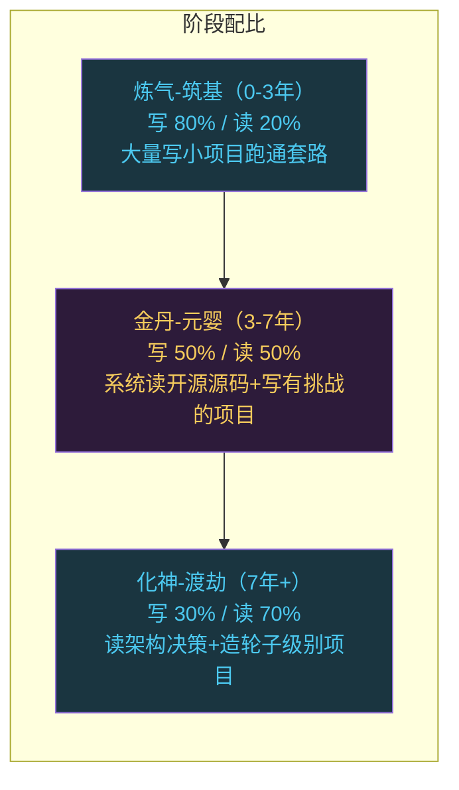

# 读源码vs写项目：程序员成长的两条路怎么选

```
╔══════════════════════════════════════════════╗
║  渡劫期 · 第177篇                              ║
║  读源码vs写项目：程序员成长的两条路怎么选       ║
║  预计阅读：15分钟                              ║
╚══════════════════════════════════════════════╝
```

渡劫期的修炼者经常被一个问题折磨：时间有限，到底是该多读优秀的开源项目源码，还是该多自己动手写项目？有人说"读万卷书不如行万里路"，有人说"不读源码你永远只是码农"。两种观点都有道理，但都只说了一半。这篇把这个老生常谈的问题掰开揉碎，聊聊两种学习方式到底在练什么，什么时候该读，什么时候该写，怎么把它们搭配起来用。

---

## 硬核主体

### 一、两种方式在练什么

先搞清楚一件事：读源码和写项目，训练的是两种不同的能力。它们不冲突，但侧重点差异很大。

读源码训练的是"理解力"。你在看别人怎么解决问题，怎么组织代码，怎么做架构取舍。你是一个旁观者，看高手下棋。这个过程练的是模式识别：哦，原来中断处理可以这么分层，原来状态机可以这么设计，原来内存池可以这样实现。你看多了之后，脑子里会积累一批"好代码长什么样"的模板，下次自己写的时候有参照。

写项目训练的是"执行力"。你自己在面对一个具体问题，需求拆解，技术选型，边界处理，踩坑填坑，时间管理，全程自己扛。这个过程练的是综合能力：把模糊想法变成可运行代码的能力。你是棋手，每一步都要自己落子并且承担后果。

```c
/* 两种学习方式的训练侧重点 */

// 读源码训练：
//   - 模式识别（看到好的设计能认出来）
//   - 代码审美（知道好代码长什么样）
//   - 架构理解（理解模块怎么拆分）
//   - 技术广度（接触不同风格和思路）
//   - 被动输入，消耗低，但容易"看懂了但不会写"

// 写项目训练：
//   - 问题拆解（把模糊需求变成具体步骤）
//   - 技术选型（在约束下做取舍）
//   - 边界处理（处理异常、错误、并发）
//   - 调试能力（从现象到根因的推理链）
//   - 主动输出，消耗高，但容易"会写但不知道为什么这么写"
```

有个常见的错觉需要纠正：读源码感觉自己"学到很多"，但这种获得感很可能是虚假的。你跟着作者的思路走了一遍，觉得都看懂了，但这跟你自己能产出这样的代码是两回事。认知心理学里有个概念叫"能力错觉"（illusion of competence），说的就是这种情况：阅读流畅让你误以为自己掌握了，但合上书自己写却写不出来。写项目恰好是打破这种错觉的方式，因为写的时候你必须自己做每一个决策。

### 二、不同阶段该怎么配比

渡劫期的修炼者已经有了相当的技术积累，所以讨论的前提不是零基础该读还是该写。零基础的答案是明确的：先写，写不动了再读。这里讨论的是有几年经验之后的配比问题。

炼气到筑基阶段（0-3年），写项目占绝对主导。这个阶段你连基本套路都不熟，读源码等于看天书，看了也吸收不了。你应该大量写小项目，把基本的编程套路跑通：怎么组织文件，怎么调试，怎么处理错误，怎么用git管理代码。每写完一个项目，你会发现自己设计上的问题，这些教训是读源码读不来的。这个阶段读源码可以偶尔翻一翻，不用系统读。

金丹到元婴阶段（3-7年），读和写开始并重。你有了足够的代码量和技术广度，能看懂大部分源码了。这时候系统读一两个优秀开源项目的源码，收益巨大。你会看到自己从来没想过的设计思路，会发现自己在写项目时养成了一些坏习惯。同时你也要继续写项目，但写的应该是更有难度的东西，不是重复自己已经会的。

化神到渡劫阶段（7年以上），读源码的比重可以加大。这个阶段你的执行力已经不是瓶颈，写项目对你来说不难。难的是判断力：该做什么，不该做什么，什么设计能撑五年，什么方案两年就得重构。这种判断力需要大量输入来喂养。读不同项目源码里的架构决策，读历史项目的演进过程，读社区里关于设计选型的讨论。同时你写的项目应该是造轮子级别的东西，不是普通业务CRUD。



### 三、读源码的正确姿势

很多人读源码的方式是错的。常见错误有两种。

常见的错误读法是逐行翻。打开main函数，一行一行往下看，看到函数调用就跳进去，看到宏就展开。这种读法很快就会迷失在调用链里，读了三天还在初始化代码里打转。源码不是小说，不是从头到尾线性读的。

第二种是"只看不懂"。翻一翻目录结构，看几个重要文件，觉得自己"读了源码"了。实际上没有深入理解任何一个模块，只是看了一眼。

正确的读源码姿势是"带着问题读"。你不是在读源码，你是在找源码里某个具体问题的答案。比如：Redis的事件循环是怎么实现的？FreeRTOS的上下文切换代码长什么样？Linux内核的slab分配器怎么管理内存？带着这种具体问题，直接定位到相关文件和函数，读透那一段代码，搞清楚它怎么工作的。

```c
/* 读源码的四步方法 */

// 第1步：选项目
//   选你正在用或者即将要用的项目
//   不要为了"学"去读一个自己用不到的项目
//   你正在用Redis，就读Redis，别去读你不用的etcd

// 第2步：定位入口
//   不要从main()开始读
//   先看目录结构，找到你关心的模块
//   用grep定位目标函数：
//   grep -rn "epoll_wait" src/   // 找到事件循环在哪
//   grep -rn "context_switch" port/  // 找到上下文切换

// 第3步：画调用链
//   把你读到的函数调用关系画出来
//   不需要完整，只需要覆盖你关心那条路径
//   边读边画，画完就理解了这部分的执行流程

// 第4步：问为什么
//   看到一个设计决策，问自己：为什么这么做？
//   为什么Redis用单线程处理命令？
//   为什么FreeRTOS的就绪队列用链表数组而不是纯链表？
//   答案通常在commit history或者邮件列表里
```

读源码时有个技巧特别有用：看git log。光看当前代码你只能看到结果，看不到过程。但git log能告诉你这段代码的演进历史。某个函数为什么写得这么绕？可能是之前有个BUG，commit message里写着"fix race condition in xxx"。某个看似多余的判断，可能是为了处理某个边界情况，在issue讨论里有详细说明。历史记录让你理解代码为什么长成现在这样，而不只是它现在长什么样。

还有一点：读源码不要贪多。一个时期只深入读一个项目，把它读透比浅读十个有用得多。什么算读透？能用自己的话讲清楚那个模块的设计思路，能画出调用链，能回答"为什么这么设计"。达到这个程度，这个项目的营养就被你吸收了。

### 四、写项目的正确姿势

写项目也有常见的坑。

第一个坑是"抄教程"。跟着教程一步步敲，最后跑通了，感觉自己做了个项目。但教程已经帮你做了所有决策：用什么框架，怎么组织代码，怎么处理错误。你只是打字员，不是工程师。真正的项目训练是从需求开始，自己决定一切。

第二个坑是"重复造轮子"。你已经会写TODO List了，又写了一个TODO List，功能差不多，结构也差不多。这不叫写项目，这叫练习打字。每个新项目应该比上一个多一个你没做过的东西：没用过的协议，没处理过的并发，没考虑过的性能问题，这些才算有难度。

```c
/* 写项目的递进策略 */

// Level 1：能跑就行
//   目标：把功能实现，代码能运行
//   适合：刚学新语言/新框架时
//   例子：用C写一个串口通信工具，能收发数据就行

// Level 2：能维护
//   目标：代码可读，有基本测试，能交接给别人
//   适合：有了基础后开始注意代码质量
//   例子：给串口工具加上单元测试，拆分模块，写README

// Level 3：能演进
//   目标：架构允许功能扩展，不改已有代码就能加新功能
//   适合：开始关注设计和架构
//   例子：串口工具支持插件机制，新增协议不用改框架代码

// Level 4：能复用
//   目标：抽象出可复用的库或框架
//   适合：多次解决同类问题后的提炼
//   例子：把串口通信框架抽成独立库，其他项目也能用
```

写项目最大的价值在于踩坑。你在写的过程中遇到的问题，比成功运行更有学习收获。编译报错，链接失败，内存泄漏，死锁，性能瓶颈，每一个问题被解决的过程都是一次深度学习。读源码时你看到的是别人解决完问题后的干净代码，那些被删掉的尝试，走过的弯路，你看不到。写项目时你自己走一遍弯路，那些弯路才是真正长经验的地方。

### 五、读和写的配合

单独读源码或单独写项目都不是最优策略。最有效的方式是交替进行，让两者互相喂养。

一种实用的组合方式是"写一个，读一个，再写一个"。你先自己写一个简单版的实现，比如手写一个内存分配器。写完之后，去读Linux内核的slab分配器或者jemalloc的源码。这时候你带着自己写时的疑问和踩过的坑去看别人的实现，每个设计决策你都能体会到"原来这个问题可以这么解"。如果你没自己写过，直接读slab源码，你看到的就是一堆代码，感受不到那些设计的精妙。


另一个组合方式是"写项目时遇到瓶颈就去读源码"。你在写多线程程序时遇到了死锁，排查了很久没头绪。这时候去读一下其他多线程项目的锁实现，看看别人怎么避免你遇到的这种死锁。带着实际问题去读，目标明确，效率极高。读完之后回到自己的项目，把学到的东西用上。这种"问题驱动"的读源码方式，比"我想系统学一下Redis"的泛读方式管用十倍。

还有一种方式是"读源码后做减法"。你读完一个开源项目的某个模块，不要急着去模仿它。先问自己：如果我在自己的项目里实现类似功能，哪些设计是必须的，哪些是过度设计？开源项目要照顾各种用户需求，设计往往偏通用。你的项目有具体的使用条件，可以更简单。做减法的过程就是理解边界条件的过程：知道什么该抄，什么不该抄。

### 六、一个实际案例

说个具体的例子。假设你要学怎么设计一个嵌入式系统的任务调度框架。

第一步，自己写一个。用C写一个简单的轮询调度器，几个任务排成数组，for循环依次调用。能跑，但你会发现问题：某个任务执行太久会饿死后面的任务，没有优先级概念，不能阻塞等待。这些问题是你自己踩出来的，印象极深。

第二步，去读FreeRTOS的tasks.c。你带着自己写时的疑问去读：FreeRTOS怎么解决任务阻塞的？答案在vTaskDelay和pxReadyTasksLists的实现里。它用一个链表数组管理就绪任务，每个优先级对应一个链表，延时的任务移出就绪链表进入延时链表，到时间了再移回来。你之前用数组管理，现在看到链表数组方案，立刻明白好处：O(1)定位最高优先级任务，插入删除O(1)，不用搬移元素。

第三步，回去重构自己的代码。不一定照搬FreeRTOS，你的场景可能不需要那么复杂。但你有了参照，知道每个设计决策的利弊。

第四步，再读一下其他RTOS的调度器实现，比如RT-Thread。对比FreeRTOS和RT-Thread的差异，理解不同设计选择背后的原因。到这一步，你对"嵌入式任务调度"这个主题就有了远超只读或只写的理解层次。

### 七、避免两个极端

第一种极端是"只读不写"。这类人读过Linux内核源码，读过Redis源码，读过Chromium源码，但自己写不出一个像样的项目。他们的技术审美很高，能指出别人代码的问题，但自己动手就卡壳。原因是在"理解"和"产出"之间还差一个"决策训练"，而决策训练只有写项目才能练。

第二种极端是"只写不读"。这类人项目做了不少，但每次都用同样的套路，代码质量十年不变。他们不知道有更好的设计方式，因为没见过。这就像一个人下棋十年但从来不看棋谱，水平涨到一定程度就停了，因为缺少高质量输入。

两种极端都不好。读给你输入，写给你输出。只有输入没有输出，你是一个有品味的观众但不是选手。只有输出没有输入，你是一个勤奋但低效的选手。交替进行才能同时涨见识和涨本事。

---

## 修仙术语对照表

| 修仙术语 | 技术现实 | 本篇位置 |
|---------|---------|---------|
| 观棋者 | 读源码时的角色，旁观高手设计 | 第一节 |
| 落子者 | 写项目时的角色，自己做决策承担后果 | 第一节 |
| 能力错觉 | 阅读流畅造成掌握的错觉，能力 illusion of competence | 第一节 |
| 修炼配比 | 不同阶段读源码和写项目的时间分配 | 第二节 |
| 逐行破阵 | 逐行读源码的错误方法 | 第三节 |
| 带题入阵 | 带着具体问题读源码的正确方法 | 第三节 |
| 功法演进史 | git log，看代码的演进过程而非只看结果 | 第三节 |
| 抄经式练习 | 跟教程抄代码，没做自己的决策 | 第四节 |
| 重复炼器 | 重复造已有的轮子，没有新挑战 | 第四节 |
| 踩坑长功 | 写项目时遇到的问题比成功运行更有价值 | 第四节 |
| 写读交替 | 写一个简单版，读优秀实现，对照反思，重写 | 第五节 |
| 问题驱动 | 带着实际问题读源码，目标明确效率高 | 第五节 |
| 读完做减法 | 读源码后判断哪些该抄哪些是过度设计 | 第五节 |
| 有品无术 | 只读不写，品味高但动手能力弱 | 第七节 |
| 勤修无谱 | 只写不读，勤奋但缺高质量输入水平停滞 | 第七节 |

---

## 进阶条件

- [ ] 能说出自己当前阶段读和写的配比，以及为什么这么配
- [ ] 至少深入读过1个开源项目的某个模块，能用自己的话讲清设计思路
- [ ] 读源码时用grep定位而非逐行翻，能画出至少一条调用链
- [ ] 至少有1个项目是从需求开始自己做所有决策的，不是跟教程抄的
- [ ] 做过\"写简单版→读优秀实现→对照反思→重构\"这个交替学习法至少1次
- [ ] 能识别自己是否有"只读不写"或"只写不读"的倾向，并有调整计划
- [ ] 读源码时看过git log，能说出至少1个设计决策的历史原因

下一篇聊技术社区和人脉：为什么不能闭门造车。参与技术社区能获得什么，怎么找到适合自己的社区，线下活动值不值得去。

讨论：你最近读的是哪个项目的源码？读完之后在自己的项目里用上了什么？

我是玄芯散人，带你从炼气修到大乘。

---

*本文是「码农修仙传」系列第177篇。系列导航见 [xren.ren](https://xren.ren)*
