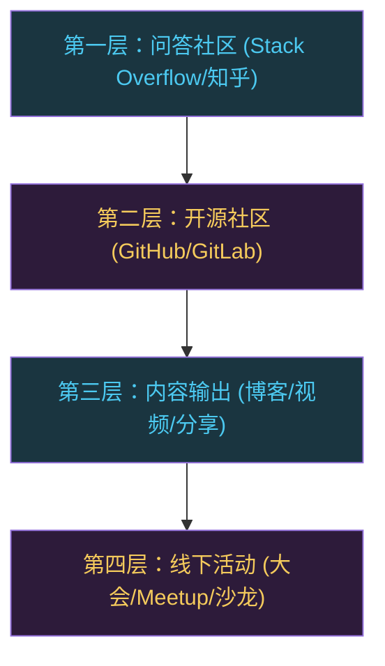
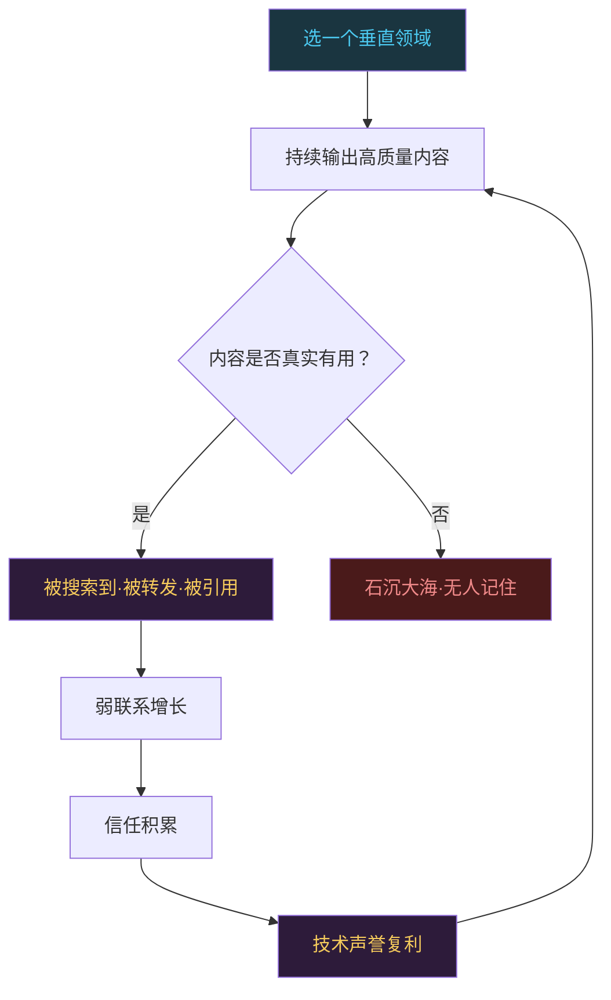

# 技术社区和人脉：为什么不能闭门造车

```
╔══════════════════════════════════════════════╗
║  渡劫期 · 第178篇                              ║
║  技术社区和人脉：为什么不能闭门造车             ║
║  预计阅读：14分钟                              ║
╚══════════════════════════════════════════════╝
```

渡劫期的修炼者容易陷入一种状态：技术越来越强，圈子越来越小。你能在寄存器手册里找到别人找不到的答案，在内核源码里追踪别人追不下去的调用链，但你可能说不出同行里谁在做什么有意思的事，不知道哪个公司正在用什么新方案解决你去年就遇到过的问题。闭门修炼看似效率最高，实际上你错过的是信息差和信任网络带来的复利。这篇聊聊技术人该怎么参与社区，人脉到底有什么用，怎么建立自己的技术声誉。

---

## 硬核主体

### 一、闭门造车的代价

先说一个真实场景。你花了三天调试一个DMA双缓冲Cache一致性的问题，最后在ST的Errata sheet里找到了原因，是某批次硅片的已知缺陷。你解决了，觉得很有收获。但你不知道的是，三个月前有个工程师在Stack Overflow上问过同样的问题，有人已经给出了完整的解决方案和 workaround，包括哪些场景需要Cache invalidate，哪些场景需要DCache clean。如果你当时看到了那个回答，三天变成三小时。

这不是假设，这是嵌入式领域每天都在发生的事。

闭门造车有三个实实在在的损失：

信息滞后。你踩的坑，大概率有人已经踩过。你摸索了半个月的方案，可能在某个开源项目的issue里讨论得清清楚楚。你不知道，因为你不在那个信息流里。

信任缺失。你技术很强，但没人知道。换工作时简历能过筛选，但面试官没有"这个人我听说过"的印象。想找合作伙伴时，没人能推荐你。想推动一个技术方案时，没人愿意给你背书。

视野收窄。只看自己公司的代码和业务，会以为世界就是这样的。但你公司的技术栈只是行业里的一种选择。不去看看别的团队怎么做，你没法判断自己的方案是先进的还是落后的。

```c
/* 闭门造车的隐性成本 */

// 你花3天调试的DMA Cache问题
//   → 社区里早有workaround，3小时搞定
//   → 代价：浪费的2天21小时

// 你觉得自己的架构方案很好
//   → 同行在用更成熟的方案，你不知道
//   → 代价：技术债务，半年后重构

// 你换工作面试时
//   → 面试官没听说过你，只看简历
//   → 代价：同等实力下，有社区影响力的人先拿到offer
```

### 二、技术社区的四个层次

技术社区不是一个统一的东西，它有层次。不同层次给你的东西不同，参与方式也不同。

第一层是问答社区。Stack Overflow、CSDN论坛、知乎技术话题等。这一层帮你快速解决问题和帮助别人解决问题。你提问，别人回答。你回答别人的问题，积累声誉。参与门槛低，注册账号就能发言。但这一层的信息质量参差不齐，需要你有判断力去筛选。Stack Overflow的rep机制（赞踩+采纳）天然过滤了一部分低质量内容，中文社区的质量控制弱一些。

第二层是开源社区。GitHub、GitLab上的项目。这一层让你直接参与技术生产。你不是在讨论技术，你是在写代码，提PR，做review，报issue。参与门槛中等，你需要能看懂别人的代码，能写出符合项目规范的提交。这一层给你的回报最大，因为你的贡献是公开的，可验证的，永久留存。一个merged的PR就是你技术能力的证据。

第三层是技术内容输出。写博客，做技术分享，录制视频教程。这一层帮你建立个人品牌和技术声誉。参与门槛高，你不仅要懂技术，还要能表达，能输出。但回报也高，因为内容传播的范围远超你认识的人。一篇好的技术文章可以被几千人看到，一次好的技术分享可以被几百人记住。

第四层是线下活动。技术大会、Meetup、沙龙等。这一层提供深度交流和人脉建立的机会。线上交流再频繁，也比不上面对面聊半小时。很多合作机会，职业机会都是在线下活动中产生的。参与门槛是时间和金钱，技术大会的门票不便宜，出差也耗时。



### 三、从潜水到贡献者：参与社区的进阶路径

很多人对参与社区有恐惧感，觉得"我技术不够好，不敢发言"。这个想法拖住了很多人。实际上社区的参与是渐进的，你不需要一上来就给Linux内核提PR。

第一步是潜水。注册账号，关注相关话题，看别人怎么提问怎么回答。这个阶段你在做的是了解社区文化和规范。Stack Overflow有自己的一套提问格式，GitHub有PR的模板和规范，知乎有回答的风格。每个社区有自己的潜规则，先看一段时间再发言，能避免犯低级错误。

第二步是提问和回答。开始提自己遇到的问题，也开始回答你能回答的问题。提问本身就是贡献，因为你的问题可能也是别人的问题。回答更是直接的贡献。在Stack Overflow上认真回答几个问题，你的rep涨起来之后，你会发现自己对技术的理解也在加深，因为教别人是很好的学习方式。

第三步是报issue和提PR。用开源项目时遇到bug，先去搜有没有人报过。没有的话，写一个清晰的issue：复现步骤，期望行为，实际行为，环境信息。一个好的issue对项目维护者来说帮助很大。如果你能修复这个bug，就提PR。第一次提PR不需要改什么大东西，修个typo，改个文档，也算贡献。重要的是走通流程：fork，branch，commit，push，PR，review，merge。走通一次之后，第二次就容易了。

第四步是持续输出。在社区里活跃一段时间后，你会发现自己反复回答同一类问题，这时候可以写一篇博客把你的经验整理出来。或者你在某个项目里贡献了很多PR，维护者可能邀请你成为collaborator。这就是你从"使用者"变成"维护者"的转折点。

```c
/* 社区参与进阶路径 */

// Step 1: 潜水（0-3个月）
//   - 注册账号，关注话题
//   - 看提问规范和回答风格
//   - 了解社区文化

// Step 2: 提问+回答（3-12个月）
//   - 提清晰的问题（复现步骤+环境信息）
//   - 回答你能回答的问题
//   - 积累声誉分

// Step 3: 报issue+提PR（6-18个月）
//   - 报bug：复现步骤，期望行为，实际行为
//   - 提PR：fork → branch → commit → push → PR
//   - 第一次PR可以从小改动开始

// Step 4: 持续输出（12个月+）
//   - 写博客整理经验
//   - 成为项目collaborator
//   - 做技术分享
//   - 建立个人技术品牌
```

### 四、人脉不是社交，是信息差和信任

技术人对"人脉"这个词天然反感，觉得是销售和商务才搞的东西。这里要澄清一个误解：技术人的人脉不是吃饭喝酒，不是群发祝福消息，不是LinkedIn上攒connection数量。技术人的人脉，底层逻辑是两条：信息差和信任。

信息差是什么？你知道别人不知道的事。你认识做嵌入式Linux的人，知道他们团队在用什么方案做OTA升级。你认识做RISC-V的人，知道哪家国产芯片的实际出货量上来了。你认识做AI部署的人，知道TFLite Micro在实际项目中的精度损失大概是多少。这些信息在公开渠道也能找到一些，但很多行业信息是在人跟人的交流中传递的，不会写成文章发出来。

信任是什么？别人相信你的技术判断。你推荐一个方案，别人愿意试。你说某个芯片有问题，别人在设计时会多查一下。信任不是靠嘴说的，是靠你公开的技术贡献积累的。你的GitHub上有merge过的PR，你的博客有人看有人转，你在社区里的回答被人点赞。这些都是信任的来源。

有个现象叫"弱联系的力量"，社会学家Mark Granovetter在1973年发表过一篇论文叫"The Strength of Weak Ties"。他发现，在求职时，真正帮到你的往往是你偶尔联系的人（弱联系），而不是最亲密的朋友（强联系）。原因很简单：你最亲密的朋友跟你处在同一个信息圈子里，知道的机会你也知道。而弱联系的人在不同的圈子里，他们知道你不知道的机会。

技术社区是建立弱联系的最好场所。你在GitHub上提的PR，在Stack Overflow上的回答，在技术大会上的分享，都在建立弱联系。这些人可能不会成为你每天聊天的好友，但他们会在某个时刻给你带来你意料之外的收获。

### 五、技术声誉怎么建立

技术声誉不是一夜之间建立的，它是一个持续输出的复利效应。需要的是稳定的节奏和真实的内容。

选择一个垂直领域持续输出。什么都写等于什么都没写。选一个你擅长的领域，比如嵌入式实时系统，或者Linux内核调度，或者RISC-V工具链。在这个领域里持续产出内容，你的名字就会跟这个领域绑定。别人遇到这个领域的问题时，会想到你。

内容质量高于数量。一篇深入的技术文章，比十篇泛泛而谈的教程有用得多。你在一个问题上踩了三天坑，最后在芯片手册的第472页找到了答案，这种经历写出来就是高质量内容。别人读了能学到东西，会记住你。反过来，如果你写的内容搜索引擎第一页就能找到，你只是做了信息的搬运工，没人会记住你。

分享你踩的坑，不是只分享成功。技术社区里最受欢迎的内容往往是"我犯了个蠢错误，花了好几天才找到原因，希望你们别再犯"，而不是"我多厉害"。这种内容真实，有用，有共鸣。Linus Torvalds在邮件列表里骂人的时候，也是在暴露问题和推动解决。展示你的调试过程和思考路径，比展示最终结果更有意义。



### 六、几个常见误区

误区一："我技术还不够好，等厉害了再参与社区"。这个想法的问题在于，参与社区本身就是变厉害的途径。你在回答问题时会发现自己理解不够深，在提PR时会发现自己代码写得不够规范，在做分享时会发现自己对某些细节还没想清楚。等"准备好了"再开始，你永远准备不好。正确做法是：找到你能贡献的点，不管多小，先参与起来。

误区二："社区都是灌水的，没什么营养"。任何社区都有灌水内容，但也有高质量内容。你的任务是学会筛选。Stack Overflow上rep高的人写的答案通常值得看，GitHub上star多fork多的项目通常值得参考，技术博客里引用了原始论文或数据源的文章通常更靠谱。筛选能力本身就是技术能力的一部分。

误区三："线下活动浪费时间，不如在家写代码"。线下活动的意义不在于听了什么新知识，而在于你认识了谁。你在技术大会的茶歇时间跟旁边的人聊十分钟，可能了解到一个你从来不知道的开源项目，或者一个你一直想搞清楚的芯片的实际表现。这种信息不会出现在PPT里。当然，不是所有线下活动都值得去，选跟你领域相关的，选有高质量讲者的。

误区四："我在公司内部声望就够了，不需要外部声望"。公司内部的声望只在公司内部有效。换工作时，做side project时，想找人合作时，你需要的是外部声望。而且公司内部的声望容易形成信息茧房，你以为的"最佳实践"可能只是你公司的"习惯做法"。外部社区能帮你校准。

---

## 修仙术语对照表

| 修仙术语 | 技术现实 | 本篇位置 |
|---------|---------|---------|
| 闭门修炼 | 只看自己公司的代码和业务，不参与外部社区 | 第一节 |
| 信息滞后 | 踩了别人已经解决过的坑却不知道 | 第一节 |
| 传音阵 | Stack Overflow等问答社区，信息快速流通 | 第二节 |
| 炼器工坊 | GitHub开源社区，直接参与代码生产 | 第二节 |
| 留名石碑 | merged的PR，公开且永久留存的贡献证据 | 第二节 |
| 讲道传法 | 写博客做技术分享，建立个人技术品牌 | 第二节 |
| 仙门大比 | 技术大会和线下活动，面对面交流和人脉建立 | 第二节 |
| 潜修暗察 | 潜水阶段，注册账号看社区规范和风格 | 第三节 |
| 初试锋芒 | 开始提问和回答，积累社区声誉 | 第三节 |
| 献器入宗 | 报issue和提PR，从使用者变成贡献者 | 第三节 |
| 开宗立派 | 持续输出成为项目collaborator或领域意见领袖 | 第三节 |
| 弱联系之术 | Granovetter的弱联系理论，偶联系的人带来意外机会 | 第四节 |
| 信任积累 | 通过公开技术贡献建立的信任网络 | 第四节 |
| 领域道号 | 在垂直领域持续输出，名字与领域绑定 | 第五节 |
| 示弱传道 | 分享踩坑经历比展示成功更有意义，更有共鸣 | 第五节 |

---

## 进阶条件

- [ ] 至少在1个技术社区有账号且活跃超过3个月（Stack Overflow/GitHub/知乎等）
- [ ] 在Stack Overflow或类似平台至少回答过5个技术问题，有被采纳的回答
- [ ] 至少给1个开源项目提过PR，不管大小，走过完整fork→branch→PR→review→merge流程
- [ ] 至少写过3篇技术博客或做过1次技术分享，内容是自己踩过的坑或深入过的技术点
- [ ] 至少参加过1次线下技术活动（大会/Meetup/沙龙），跟至少1个陌生人聊过技术
- [ ] 能说出自己所在领域里至少5个有声望的人的名字和他们做了什么
- [ ] 在某个垂直领域的内容输出有稳定节奏（每月至少1篇），坚持超过6个月

下一篇聊技术人的健康：颈椎和眼睛是第一生产力。久坐加上熬夜加上盯屏幕，这些职业习惯正在悄悄透支你的身体。怎么在技术修炼和身体健康之间找到平衡，下篇展开聊。

讨论：你参与技术社区最大的收获是什么？有没有哪次社区互动帮到了你的实际工作？

我是玄芯散人，带你从炼气修到大乘。

---

*本文是「码农修仙传」系列第178篇。系列导航见 [xren.ren](https://xren.ren)*
