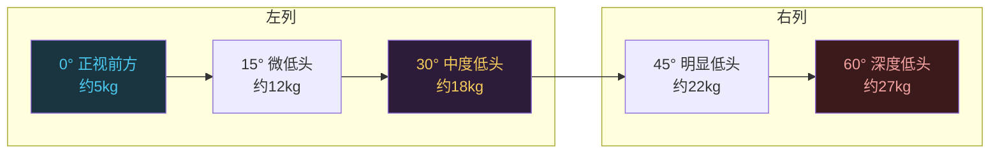
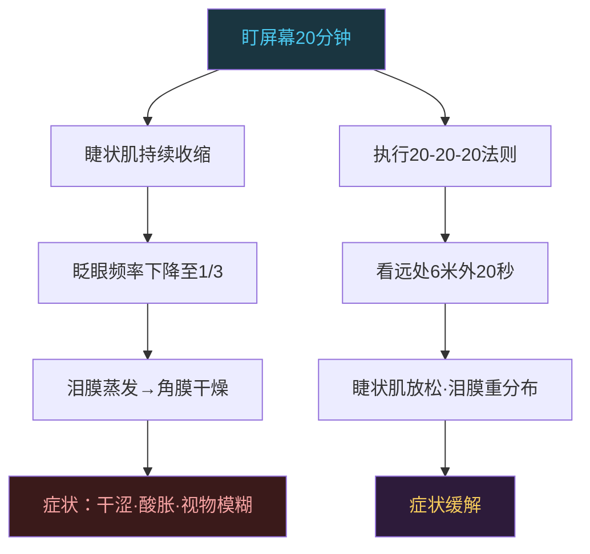
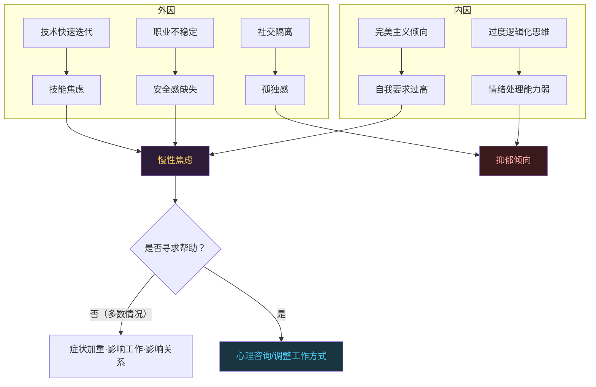

# 技术人的健康：颈椎和眼睛是第一生产力

```
╔══════════════════════════════════════════════╗
║  渡劫期 · 第179篇                              ║
║  技术人的健康：颈椎和眼睛是第一生产力           ║
║  预计阅读：14分钟                              ║
╚══════════════════════════════════════════════╝
```

渡劫期的修炼者最容易犯一个错误：把身体当成可以无限透支的资源。你能在示波器前盯三个小时抓一个毛刺，能在凌晨三点把最后一段驱动代码调通，能连续出差两周不带任何怨言。三十岁之前你觉得这叫拼劲，三十五岁之后你开始发现脖子转不动了，眼睛干到睁不开，睡着一觉醒来比没睡还累。这篇不教你做颈椎操，聊的是技术人为什么普遍把健康当次要问题，以及这件事的经济学逻辑。

---

## 硬核主体

### 一、久坐：被低估的职业风险

世界卫生组织在2020年发布的体力活动指南里有一条建议：成年人每周至少进行150到300分钟的中等强度有氧运动，或者75到150分钟的高强度运动。同时明确指出，久坐行为会增加心血管疾病死亡率、2型糖尿病发病率以及某些癌症的风险。

程序员这个职业天然久坐。每天坐在工位上八小时以上，除了上厕所和倒水几乎不动。回到家继续坐着写side project或者刷技术文章。一天坐十个小时是常态，十二个小时也不稀奇。

久坐的问题不是"缺乏运动"这么简单。长时间静止坐姿会导致下肢血液循环减慢，深静脉血栓风险升高。代谢率下降，血糖调节能力变差。Ekelund等人在2016年发表在《柳叶刀》上的荟萃分析指出，每天久坐超过八小时且不运动的人，死亡风险跟每天抽一包烟的人差不多。该研究还发现，每天60到75分钟的中等强度运动可以抵消久坐带来的死亡风险增量。

```c
/* 久坐的代谢代价 */

// 坐着 vs 站着 vs 走动的能量消耗（约值）：
//   坐着：1.0-1.5 MET（代谢当量）
//   站着：1.5-2.0 MET
//   慢走（3km/h）：2.0-2.5 MET
//   快走（5km/h）：3.0-4.0 MET

// MET越高，能量消耗越大
// 坐8小时不动 ≈ 消耗约480大卡
// 坐4小时+走4小时 ≈ 消耗约900大卡
// 差值 = 420大卡 ≈ 一碗米饭的热量
// 每天多消耗420大卡，一年下来 ≈ 15公斤脂肪

// 更要命的不是热量，是代谢通路：
//   久坐 → 脂蛋白脂肪酶活性下降 → 甘油三酯清除变慢
//   久坐 → 胰岛素敏感性下降 → 血糖波动加大
//   这些变化在"运动补偿"后依然存在
//   即：你每天去健身房1小时，剩下10小时久坐
//       风险依然比不久坐的人高
```

关键点在这里：久坐的损害不能靠"下班后运动一小时"完全抵消。运动科学里管这叫"active couch potato"现象，就是你虽然运动了，但长时间久坐的生理损伤独立于运动量存在。解法不是多运动，是少坐。每坐45到60分钟站起来活动3到5分钟，比每天去健身房一小时但其余时间都坐着，对代谢健康的帮助更大。

### 二、颈椎：低头的物理学

颈椎问题是程序员就诊率最高的骨科问题之一。原因不复杂：人的头大约重4.5到5公斤，正常站立时颈椎承受的就是这个重量。但当你低头看手机或看屏幕时，颈椎承受的力会随角度急剧增加。



这个数据来自美国脊柱外科医生Kenneth Hansraj在2014年发表在Surgical Technology International上的研究。60度低头时颈椎承受27公斤，相当于一个七岁小孩坐在你脖子上。程序员的颈椎问题跟低头频率直接相关。工作时低头看键盘，看屏幕下方的文档，再加上通勤时看手机，每天累计低头时间轻易超过四小时。

颈椎长期承受异常负荷，先出现的是肌肉劳损，再是颈椎曲度变直，再是椎间盘突出，最后可能压迫神经出现手麻、头晕。这个过程是渐进的，等你感觉到疼的时候，结构性改变已经发生了。

显示器的位置对颈椎健康影响很大。标准建议是显示器上边缘跟眼睛平齐或者略低一点，屏幕距离眼睛50到70厘米。用笔记本电脑的人几乎不可能达到这个标准，因为笔记本屏幕太低。外接显示器加独立键盘鼠标是最低成本的人体工学改造。

```c
/* 工位人体工学速查 */

// 显示器高度：上边缘 = 眼睛水平线
//   - 双显示器：主屏在正前方，副屏在侧面，转头不超过35°
//   - 笔记本：必须外接显示器 + 外接键鼠

// 显示器距离：50-70cm（一臂距离）
//   - 太近：眼睛疲劳 + 颈椎前倾
//   - 太远：眯眼看不清 + 身体前倾

// 键盘高度：手肘自然下垂时手腕跟键盘平齐
//   - 手腕上翘超过10° → 腕管综合征风险
//   - 解决：键盘托盘或升降桌

// 座椅高度：脚平放地面，膝盖约90°
//   - 脚悬空 → 大腿前侧受压 → 腿麻
//   - 解决：脚踏板或调低椅子

// 升降桌：
//   - 坐站交替，每45分钟切换
//   - 站着时也需要活动，原地踏步或轻微踱步
//   - 站立时间不是越长越好，长时间站立也有静脉曲张风险
```

### 三、眼睛：屏幕时代的代价

美国眼科协会有一个统计：使用电脑工作的人群中，50%到90%会出现某种形式的眼部不适。这个症状群有个名字叫Computer Vision Syndrome（CVS），中文叫电脑视觉综合征，也有人叫数字眼疲劳。

症状包括眼睛干涩和酸胀，视物模糊，伴随头痛和肩颈疼痛。成因不是单一的。屏幕发出的蓝光本身不会直接损伤视网膜（这个说法有争议，目前主流观点是日常屏幕蓝光强度不足以造成视网膜损伤），但长时间盯屏幕会导致眨眼频率大幅下降。正常人每分钟眨眼15到20次，盯着屏幕时会降到5到7次。眨眼少了，泪膜蒸发加快，角膜表面干燥，就会出现干涩和酸胀。

最实用的缓解方法是20-20-20法则：每看屏幕20分钟，看20英尺（约6米）以外的物体20秒。这个方法不需要任何工具，只需要你养成习惯。远处看东西时，睫状肌放松，泪膜有时间重新分布。



干眼症在程序员群体里发病率明显高于普通人群。轻度干眼症用人工泪液可以缓解，但长期依赖眼药水不是好办法。更有效的措施是改善环境湿度（空调房里放加湿器），调整屏幕亮度（不高于环境光的三倍），以及定期做眼科检查排除其他病变。

关于防蓝光眼镜，目前的科学研究结论是：日常使用的电子屏幕发出的蓝光强度不足以对眼睛造成实质性损伤，防蓝光眼镜对缓解眼疲劳的效果缺乏强有力的临床证据支持。真正有效的是控制用眼时间，不是给屏幕加滤镜。

### 四、睡眠：写代码到大半夜的隐性成本

技术行业有个奇怪的文化：熬夜写代码被当成敬业的标志。你深夜在群里发个commit截图，同事点赞说"太拼了"。但这种行为对认知能力的损害，可能比你以为的大得多。

睡眠科学家Matthew Walker在《Why We Sleep》里引用了一组经典数据：连续清醒17小时后，认知能力受损程度等同于血液酒精浓度0.05%，这在中国法律下已经算酒后驾驶。连续清醒24小时后，认知受损等同于0.1%，比醉酒驾驶标准还高。

这意味着你凌晨三点写的代码，质量可能比喝了三瓶啤酒后写的还差。你以为自己在全神贯注解决一个bug，实际上你的前额叶皮层功能已经大幅下降，判断力和自控力都在打折扣。你调了一个小时没找到的bug，睡一觉醒来第二天早上十分钟解决了，这不是运气，这是你的大脑在睡眠中重新整理了信息。

```c
/* 睡眠剥夺对编程能力的损害 */

// 连续清醒时长 → 认知等效状态：
//   16h → 正常（但反应速度已下降约15%）
//   17h → 等效BAC 0.05%（中国酒驾标准）
//   24h → 等效BAC 0.10%（比醉驾还严重）
//   36h → 等效BAC 0.15%

// BAC = Blood Alcohol Content 血液酒精浓度
// 0.05%在中国法律下属于饮酒驾驶（非醉酒），0.08%以上为醉酒驾驶

// 具体表现：
//   - 工作记忆容量下降 → 变量名记不住，上下文丢失
//   - 逻辑推理变慢 → 复杂条件判断出错率升高
//     - 情绪控制变差 → 代码review时更容易发脾气
//   - 创造性下降 → 调试思路僵化，反复试错

// 深度睡眠（N3阶段）的作用：
//   - 清除脑内代谢废物（β-淀粉样蛋白）
//   - 巩固陈述性记忆（白天学的知识）
//   REM睡眠的作用：
//   - 巩固程序性记忆（肌肉记忆·操作技能）
//   - 情绪信息处理
//   - 创造性联想（很多debug灵感来自REM期）
```

技术人需要知道的还有一点：蓝光对褪黑素分泌有抑制作用。褪黑素是控制睡眠周期的激素，天黑后分泌增加，让你犯困。屏幕发出的短波长蓝光会抑制褪黑素分泌，让大脑以为还是白天。睡前一小时内看屏幕，入睡时间平均延长10到15分钟，深度睡眠比例下降。

### 五、心理健康：技术行业的隐形问题

技术行业的心理健康问题被严重低估了。你不会跟同事说"我最近焦虑得睡不着"，也不会在绩效面谈时说"我对技术完全提不起兴趣了"。但在匿名调查中，程序员的焦虑和抑郁比例显著高于其他白领职业。

原因有几层。第一层是职业特性：长时间独处工作，社交互动少，工作成果难以被非技术人理解。第二层是行业文化：快速变化带来的技能焦虑，35岁危机的年龄焦虑，大厂裁员的职业不稳定感。第三层是认知模式：技术人习惯用逻辑解决问题，但情绪问题不是纯逻辑能解决的，很多人不知道该怎么处理。



世界卫生组织在2019年将burnout纳入ICD-11分类，编号QD85。它被定义为"未被妥善管理的慢性工作场所压力"导致的综合征，归类为职业现象而非疾病。三个典型表现：能量耗尽感，跟工作相关的心理距离拉大或消极情绪，职业效能下降。

技术人的burnout往往表现为：以前觉得有趣的技术问题现在完全提不起兴趣，看代码就烦，开会走神，周末不想碰电脑，但又焦虑自己落下了。很多人把这个归结为"变懒了"或者"不够努力"，实际上是你的大脑在发出过载信号。

应对方式的第一步是识别。如果你连续两周以上对工作丧失兴趣，睡眠出问题，容易发火，注意力下降，这不是"状态不好"，这是需要认真对待的信号。第二步是减少消耗源，不是"再坚持一下"，是减少加班，减少不必要的会议和沟通消耗。第三步是寻求专业帮助，心理咨询在技术圈正在去污名化，越来越多公司提供EAP（员工帮助计划）服务。

### 六、健康投资的经济学

技术人愿意花两千块买机械键盘，花五千块买升降桌，花一万块买显示器，但不愿意花时间运动。这个选择的底层逻辑是：外设能直接提升工作效率，运动的收益太间接太慢。

这个逻辑有一个盲区：外设提升的是上限，健康决定的是下限。你有一套高端外设，颈椎疼到转不动头的时候照样写不了代码。你有34寸带鱼屏，眼睛干到睁不开的时候照样看不清。

```c
/* 健康投资ROI估算 */

// 假设：技术人时薪约200元（按月薪3万/22天/8小时算）

// 机械键盘：2000元 → 提升2%打字效率 → 每天节省约10分钟 → 约100天回本
// 升降桌：3000元 → 改善坐姿 → 减少颈椎负荷 → 长期收益
// 显示器：5000元 → 减少眼部疲劳 → 每天10分钟效率提升 → 约150天回本

// 颈椎病治疗成本（保守估算）：
//   理疗：200元/次 × 2次/周 × 12周 = 4800元
//   检查：MRI约800元 + X光约200元 = 1000元
//   误工：请假3天 × 200元/小时 × 8小时 = 4800元
//   合计：约10600元
//   → 还不算慢性疼痛导致的长期效率下降

// 干眼症治疗成本：
//   人工泪液：100元/月 × 12月 = 1200元/年
//   眼科检查：300元/次 × 2次/年 = 600元
//   → 持续性支出，不治不会自愈

// 运动成本对比：
//   健身房：200元/月 × 12 = 2400元/年
//   跑步：0元（一双跑鞋500元能用半年）
//   → 远低于治疗费用，且预防效果远大于治疗
```

人体工学改造的优先级建议：第一优先是显示器高度和距离（成本最低，收益最大），第二是外接键鼠避免笔记本姿势，第三是升降桌实现坐站交替，第四是一把支撑腰部的好椅子。这些加起来的成本可能不到一次骨科治疗的花费。

### 七、可执行的干预方案

说了这么多风险，给一个务实的行动清单。不是完美的健康方案，是技术人能实际执行的最低标准。

坐姿干预：买一个显示器支架把屏幕抬高到眼睛水平线。如果你用笔记本，外接显示器和键鼠是必须的，不是可选的。椅子调到脚能平放地面的高度，腰部有支撑。每45分钟设一个定时器站起来走动。

眼睛干预：在电脑上安装一个定时提醒工具，每20分钟弹出来提醒你看远处。屏幕亮度调整到跟环境光接近，不要在黑暗中看高亮屏幕。如果环境干燥，放一个小型加湿器在桌面上。

运动干预：不需要去健身房练到力竭。每天走够30分钟就行，上下班走路一段距离也算。每周做两次拉伸，重点拉伸颈椎和肩部肌肉。如果条件允许，游泳是对颈椎和腰椎最友好的全身运动。

睡眠干预：睡前一小时关掉电脑和手机。如果做不到，至少开启夜间模式减少蓝光。固定睡觉时间，哪怕周末也尽量保持。睡眠时间保证7小时以上，6小时以下连续一周就足以让认知能力明显下降。

心理干预：学会区分"累了"和"倦了"。累了睡一觉能恢复，倦了睡一觉恢复不了。如果发现自己对工作持续丧失兴趣超过两周，考虑跟心理咨询师聊聊，不要硬扛。

---

## 修仙术语对照表

| 修仙术语 | 技术现实 | 本篇位置 |
|---------|---------|---------|
| 渡劫肉身 | 技术人长期久坐盯屏幕导致的身体损耗 | 引入 |
| 静坐之劫 | 久坐行为独立于运动量存在的健康风险 | 第一节 |
| active couch potato | 运动了但长时间久坐依然有风险的现象 | 第一节 |
| 颈椎承天 | 低头角度增加导致颈椎承重成倍上升 | 第二节 |
| Hansraj数据 | 60度低头颈椎承受27公斤的研究结论 | 第二节 |
| 外接法器 | 外接显示器和键鼠改善工位人体工学 | 第二节 |
| 数字眼疲劳 | Computer Vision Syndrome屏幕导致的视觉不适 | 第三节 |
| 20-20-20法则 | 每20分钟看20英尺外20秒缓解眼疲劳 | 第三节 |
| 泪膜枯竭 | 眨眼频率下降导致角膜表面干燥 | 第三节 |
| 夜修代价 | 熬夜写代码认知能力等同于酒驾状态 | 第四节 |
| 褪黑素抑制 | 蓝光抑制褪黑素分泌延迟入睡 | 第四节 |
| 道心蒙尘 | 职业倦怠对技术兴趣的持续丧失 | 第五节 |
| QD85 | WHO ICD-11中burnout的分类编号 | 第五节 |
| 外设上限论 | 外设提升效率上限但健康决定效率下限 | 第六节 |
| 理疗花费 | 颈椎病治疗费用远高于预防投入的经济学对比 | 第六节 |
| 坐姿阵法 | 显示器支架加外接键鼠加升降桌的人体工学改造 | 第七节 |

---

## 进阶条件

- [ ] 显示器上边缘已调整到眼睛水平线，笔记本已外接显示器和键鼠
- [ ] 能说出自己每天久坐的大致小时数，且有每45分钟起身活动的定时提醒
- [ ] 执行20-20-20法则至少一周，眼睛干涩症状有所缓解
- [ ] 连续两周每天睡眠时间达到7小时以上，能感知到认知能力的差异
- [ ] 每周至少3次30分钟以上的身体活动，走路或跑步或游泳都行
- [ ] 能区分"累了"（休息可恢复）和"倦了"（休息不能恢复）的状态
- [ ] 检查过自己工位的人体工学问题并列出至少2个已改善项

下一篇是整个码农修仙传系列的最后一篇：大道至简，回到炼气期重新出发。技术的最高境界是化繁为简，保持初学者心态。修炼没有终点，180篇不是结束。

讨论：你工作几年后身体最大的变化是什么？有没有哪次健康问题让你开始重视这件事？

我是玄芯散人，带你从炼气修到大乘。

---

*本文是「码农修仙传」系列第179篇。系列导航见 [xren.ren](https://xren.ren)*
