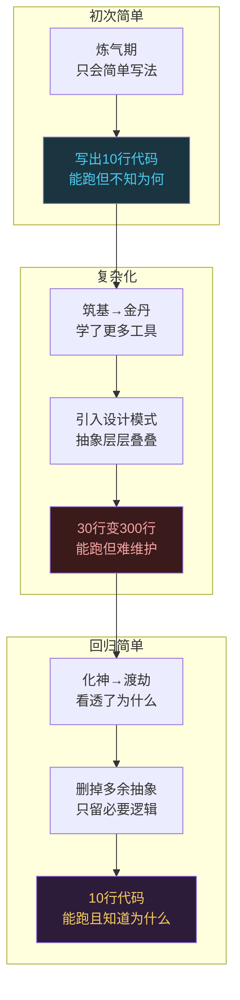
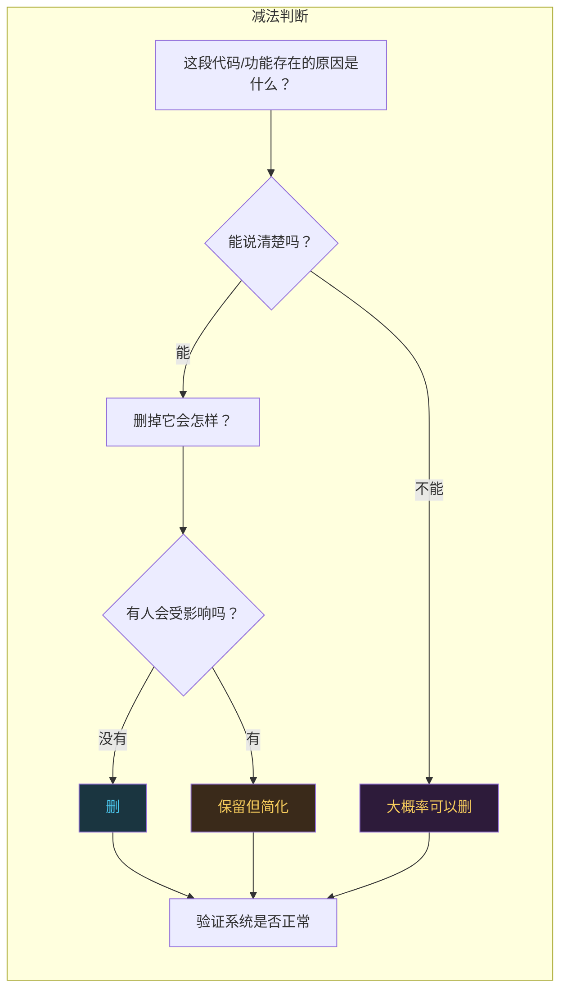

# 大道至简：回到炼气期重新出发

```
╔══════════════════════════════════════════════╗
║  渡劫期 · 第180篇（系列终章）                   ║
║  大道至简：回到炼气期重新出发                   ║
║  预计阅读：15分钟                              ║
╚══════════════════════════════════════════════╝
```

写完第179篇，我翻了翻第001篇的开头。001篇讲的是炼气期码农长什么样，那时候一个`printf("Hello World")`就能让人心跳加速。179篇讲的是颈椎和眼睛，技术人怎么保护自己的身体。中间隔了178篇文章，C语言变量在内存里怎么存一直讲到量子计算和脑机接口。

有个问题一直跟着我：技术人修到最后，到底修的是什么？是修更多工具，修更深源码，修更高职位？都不是。修到最后，是修减法。是把复杂的东西看穿之后，用最简单的方式表达出来。禅宗管这叫初学者心态，道家管这叫大道至简。这篇是码农修仙传的最后一篇，聊一个看似虚其实很实在的话题：为什么技术人的最高境界是回到炼气期。（如果你读过本系列第30篇"码农修仙者的归宿"，那篇是旧版30篇分卷的收官，讲的是三种归宿路线。这篇是180篇全系列的终章，讲的是修炼到最后的心法回环。两篇首尾呼应，但角度不同。）

---

## 硬核主体

### 一、简单不是偷懒，是理解到位后的选择

程序员有个通病：喜欢把简单问题搞复杂。你写一个函数，本来十行能搞定，非要引入三个设计模式，定义两个接口，抽象出四层继承结构。代码提交上去，同事看了半天没看懂，你在旁边得意地说"这是SOLID原则"。

Brian Kernighan和P.J. Plauger在1974年合写的《The Elements of Programming Style》里有一句话：调试代码比写代码难一倍，所以如果你写代码时用尽了全部聪明才智，那调试时就不够用了。这句话过了五十多年依然管用。代码的简单性不是能力不足的妥协，是能力到位后的主动选择。

Unix哲学把这件事说得更直白。1978年Bell System Technical Journal上发表了Doug McIlroy总结的Unix原则，其中几条至今被工程师挂在嘴边：

```c
/* Unix哲学的几条核心原则 */

// 1. Make each program do one thing well
//    一个程序只做一件事，做好
//    → grep只搜索，sort只排序，wc只计数

// 2. Expect the output of every program to become
//    the input to another
//    程序的输出应该是另一个程序的输入
//    → 管道：ps aux | grep nginx | wc -l

// 3. Write programs to handle text streams
//    因为那是universal interface
//    → JSON/XML/YAML都是这个思路的延伸

// 4. Avoid premature optimization
//    不要过早追求性能
//    → Donald Knuth在1974年说的：
//      "premature optimization is the root of all evil"
//      过早调优是万恶之源
```

这些原则距今将近五十年，Web技术栈换了十几代，编程语言兴衰更迭无数，但没人说Unix哲学过时了。为什么？因为它们足够简单。简单到不会被任何技术潮流冲走。

你在炼气期写第一个程序，可能就十几行C代码，一个main函数加一个printf。那时候你觉得简单是因为只会这些。等你修到化神期，你手写过一个迷你编译器，实现过B+树索引，搞过LLVM Pass插件。你再回头看那十几行代码，发现简单的代码做对了一件事：它只做它该做的。



这张图里有一个循环。起点的简单和终点的简单看起来一样，但性质完全不同。第一次是"只会这样写"，第二次是"知道为什么该这样写"。中间那段复杂化的弯路不是白走的，没有这段弯路，你分不清"必要的复杂"和"多余的复杂"。

### 二、初学者心态：杯空才能装水

禅宗里有个概念叫"初心"（Shoshin），铃木俊隆在《Zen Mind, Beginner's Mind》里反复讲：初学者的心是空的，没有预设，没有成见，所以能看到事物的本来面目。专家的心塞满了经验和方法论，反而容易对新材料视而不见。

这个概念放在技术行业特别贴切。你用C语言写了十年，有人跟你说Rust的内存安全机制，你的第一反应可能是"我C语言写得挺好的，为什么要学Rust"。你做了五年Spring Boot，有人跟你说Go的并发机制，你的第一反应可能是"Java配套比Go成熟多了"。这不是技术判断，是认知防御。你的杯子满了，新的水倒不进去。

保持初学者心态不是让你忘掉已有的知识，是让你在面对新东西时，暂时放下"我已经懂了"的姿态。具体怎么做？几个实操方法：

```c
/* 保持初学者心态的几个方法 */

// 1. 读源码时不带预设
//    你觉得某个开源项目的代码"应该这样写"
//    然后发现它"那样写"了
//    第一反应别是"这代码写得烂"
//    先问自己：它为什么这样写？有什么我不知道的约束？

// 2. 学新语言/新技术时先写"烂代码"
//    别上来就用旧语言的思维写新语言
//    Go的goroutine不是Java的Thread
//    Rust的ownership不是C的malloc/free
//    先按新语言的惯例写，哪怕你觉得别扭

// 3. 跟新人交流时别端着
//    一个刚入行的炼气期问你觉得很基础的问题
//    你回答"这个很简单你自己查"
//    → 你失去了一次重新审视基础知识的机会
//    正确做法：认真回答，在解释过程中你会发现自己也有盲区

// 4. 定期做"知识清零"练习
//    挑一个你觉得很熟的概念
//    假装你第一次遇到它
//    从零开始推导：为什么需要它？它解决了什么问题？
//    你会发现有些"理所当然"的东西，其实你从来没想清楚过
```

Linus Torvalds在2016年TED演讲里讲了一个关于"good taste"的例子。他说好品味的代码不是写得花哨的代码，是消除了所有特殊情况（special case）的代码。他举了一个链表删除的例子：普通人写链表删除要分头节点和中间节点分别处理，而有品味的写法只需要一种逻辑，不管删哪个节点都用同一套代码。

```c
/* Linus的"good taste"链表删除示例 */

// 普通写法：三种情况，代码啰嗦
void remove_list_node_bad(Node *head, Node *entry)
{
    Node *prev = NULL;
    Node *walk = head;

    while (walk != entry) {
        prev = walk;
        walk = walk->next;
    }

    if (!prev) {
        // 情况1：删的是头节点
        head = entry->next;
    } else {
        // 情况2：删的是中间或尾节点
        prev->next = entry->next;
    }
    // 三种情况里其实情况2和3一样，但你要在脑子里区分
}

// good taste写法：引入二级指针，消除特殊情况
void remove_list_node_good(Node **head, Node *entry)
{
    Node **walk = head;

    while (*walk != entry)
        walk = &(*walk)->next;

    *walk = entry->next;
    // 不管删头节点还是中间节点，同一行代码搞定
    // 没有if判断，没有特殊情况
}
```

第一段代码能跑，逻辑也对。但它有一个隐患：每加一种特殊情况，你就多一个if分支，多一个测试用例，多一个出bug的可能。第二段代码用了一个二级指针的技巧，把所有特殊情况统一掉了。代码更短，更不容易出错，也更容易理解（如果你理解了二级指针的话）。

这就是大道至简在代码里的样子。不是把代码写短，是消除特殊情况。特殊情况越少，代码的复杂度越低，维护成本越低。

### 三、什么时候该做减法

技术人做加法容易，做减法难。加一个功能只需要产品提需求，你写代码实现。减一个功能需要你判断：这个功能是不是多余的？删了会不会有人用不了？维护成本值不值？

这里有一个判断方法，来自C.A.R. Hoare在1980年图灵奖演讲《The Emperor's Old Clothes》中提出的软件设计原则。他说软件设计有两种方式：一种是把代码写得简单到明显没有缺陷，另一种是写得复杂到没有明显缺陷。前一种是好的，后一种是危险的。



实际项目里做减法有几个常见的判断点：

代码上：一个函数超过50行，大概率在做太多事情。一个文件超过500行，大概率职责不单一。一个类的继承层级超过3层，大概率过度设计。这些不是铁律，但出现这些信号时值得停下来想一想：能不能拆？能不能砍？

系统设计上：引入一个中间件之前先问自己，这个中间件解决了什么具体问题？不用它会怎样？引入它的运维成本团队承受得了吗？如果这三个问题都答不清楚，先别引入。很多人引入Kafka不是因为需要Kafka，是因为简历上想写Kafka。

工具上：你电脑上装了多少个编辑器？多少个终端模拟器？多少个笔记软件？每多一个工具，就多一份维护成本。工具的目的是减少你的认知负担，不是增加。如果你花在配置工具上的时间比用工具干活的时间还多，该做减法了。

### 四、180篇的回环

码农修仙传写了180篇。001篇是"炼气期码农长什么样"，讲的是编程入门者该学什么不该学什么。180篇是"大道至简，回到炼气期重新出发"。如果你只看这两篇的标题，会发现它们像是同一篇文章的开头和结尾，首尾相连。

这不是巧合。修仙体系的设计本身就是循环的。炼气期的你学会写`printf("Hello World")`，觉得编程就是这么回事。筑基期你学了数据结构和操作系统，发现编程远比你想的复杂。金丹期你深入编译原理和内核机制，开始理解系统是怎么运转的。元婴期你碰到寄存器和硬件，代码变成物理动作。化神期你造编译器造操作系统，变成创造者。渡劫期你看计算理论，看行业变迁，看AI的边界和未来，开始琢磨计算到底能走到哪。

然后你回过头，发现自己又回到了"编程就是这么回事"。但这次的"这么回事"跟炼气期不一样了。炼气期是不知道复杂所以觉得简单，渡劫期是知道了复杂之后选择简单。

```c
/* 180篇的回环结构 */

// 炼气期（001-030）：学写字
//   "我会写代码了！"
//   → 知道How，不知道Why

// 筑基期（031-060）：学语法背后的原理
//   "原来代码背后有这么多东西"
//   → 知道Why，开始觉得复杂

// 金丹期（061-090）：看透系统运转
//   "操作系统和编译器原来是这样工作的"
//   → 理解了系统，能读懂源码

// 元婴期（091-120）：穿透到硬件
//   "代码最终变成晶体管翻转"
//   → 软硬通吃，能直接操控硬件

// 化神期（121-150）：从用到造
//   "我自己能造一个编译器/OS/数据库"
//   → 从使用者变成创造者

// 渡劫期（151-180）：看透边界
//   "计算有边界，行业有周期，技术会过期"
//   → 知道什么该学，什么该扔

// 回到炼气期：
//   "编程就是这么回事"
//   → 但这次你选择简单，不是因为只会简单
//     是因为你知道了所有复杂之后，选择用简单的方式解决问题
```

这个回环不是原地打转，是螺旋上升。每走一圈，你对"简单"的理解就深一层。第一圈你觉得简单就是代码行数少。第二圈你觉得简单是消除特殊情况。第三圈你觉得简单是整个系统的设计哲学。你可能还会走更多圈。

### 五、修炼没有终点

180篇写完了。但"码农修仙传"这个名字本身就在说一件事：修炼是持续的过程，没有终点。

技术行业有个特点：每隔几年就有一波新技术热潮。2010年移动互联网，2015年云计算，2020年大模型。每次热潮来的时候，所有人都在焦虑"我是不是要被淘汰了"。每次热潮退去的时候，你发现真正留下来的还是那些底层的东西，比如数据结构，比如操作系统，比如编译原理和网络协议。

这不是说新技术不值得学。是说学新技术的时候，带着初学者心态去学，别带着恐惧去学。恐惧会让你做出错误判断：为了追热点而放弃正在积累的功底，为了简历好看而堆砌自己都不理解的技术名词。

码农修仙传的180篇覆盖了编程入门一直到行业认知的全链路。你不需要180篇全看完才算修成。有人看完炼气期就够了，有人修到金丹期就找到自己的路了。这个系列的用处不在于"你学完了"，在于"你知道自己在哪，下一步往哪走"。

如果你问我写完180篇最大的收获是什么，不是技术本身，是在写作过程中反复回到"为什么"的过程。每写一篇，我都得问自己：这个技术为什么存在？它解决了什么问题？能不能用更简单的方式讲清楚？这些问题逼着我把每个概念重新想一遍。想清楚之后，代码写得更少了，因为不需要试错了。

这大概就是大道至简的意思：不是一开始就简单，是走过复杂之后选择了简单。

---

## 修仙术语对照表

| 修仙术语 | 技术现实 | 本篇位置 |
|---------|---------|---------|
| 大道至简 | 代码设计的最高境界是消除多余复杂度 | 引入 |
| 初心（Shoshin） | 初学者心态，面对新技术时放下已有经验 | 第二节 |
| 认知防御 | 专家心态导致排斥新知识的现象 | 第二节 |
| good taste | Linus定义的好品味：消除所有特殊情况 | 第二节 |
| special case elimination | 链表删除用二级指针统一三种情况 | 第二节 |
| 做减法 | 代码/系统设计/工具上砍掉多余的部分 | 第三节 |
| Hoare原则 | 1980图灵奖演讲：简单到明显没有缺陷 vs 复杂到没有明显缺陷 | 第三节 |
| 炼气期简单到渡劫后回归简单，螺旋上升 | 第四节 |
| 螺旋上升 | 每走一圈对简单的理解更深一层 | 第四节 |
| 修炼无终点 | 技术行业持续迭代，底层知识不过期 | 第五节 |
| Unix哲学 | 一个程序只做一件事，输出是另一个程序的输入 | 第一节 |
| 过早调优 | Knuth说的万恶之源，提前调优增加复杂度 | 第一节 |
| 知识清零 | 假装第一次遇到已知概念，重新推导 | 第二节 |
| 中间件三问 | 引入中间件前问的三个判断问题 | 第三节 |
| 技术热潮周期 | 移动互联网/云计算/大模型AI的周期性更迭 | 第五节 |

---

## 进阶条件

- [ ] 能在一段自己写的代码中找到至少1处"多余的复杂"，并成功删掉它
- [ ] 面对一个新技术（语言/工具/平台），能先放下"我已经懂了"的预设，用初学者心态读文档
- [ ] 能用Linus的二级指针链表删除法向别人解释为什么消除特殊情况比加if分支更好
- [ ] 在引入一个新的中间件/依赖/工具前，能清楚说出它解决什么具体问题，不用它会怎样，运维成本多少
- [ ] 能从自己维护的项目中找出一个可以删掉的功能或模块，并实际删掉它
- [ ] 重新读一遍001篇（炼气期码农长什么样），能说出至少3个"当时觉得简单现在理解更深"的点
- [ ] 制定一个个人减法计划：从工具和代码两方面各砍掉1样多余的东西

码农修仙传到这里就结束了。但你的修炼没有结束。下一篇不存在了，因为接下来该写的，是你自己的修炼故事。

---

## 系列终章 · 互动

这是「码农修仙传」系列的最后一篇。180篇，炼气期的一个`printf`，走到渡劫期的"大道至简"。如果你一路读到了这里，感谢你的耐心。

最后留两个问题给你：

1. 这180篇里，哪一篇让你印象最深？是哪句话改变了你对某个技术的看法？评论区告诉我，这会帮我调整未来的内容规划。

2. 如果你只能给一个刚学编程的炼气期新人一条建议，你会说什么？不是技术建议，是心态建议。把它写在评论区，也许某个正在迷茫的新人正好看到。

我是玄芯散人，带你从炼气修到大乘。

180篇走完了。路没有终点，我们江湖再见。

---

*本文是「码农修仙传」系列第180篇（终章）。系列导航见 [xren.ren](https://xren.ren)*
