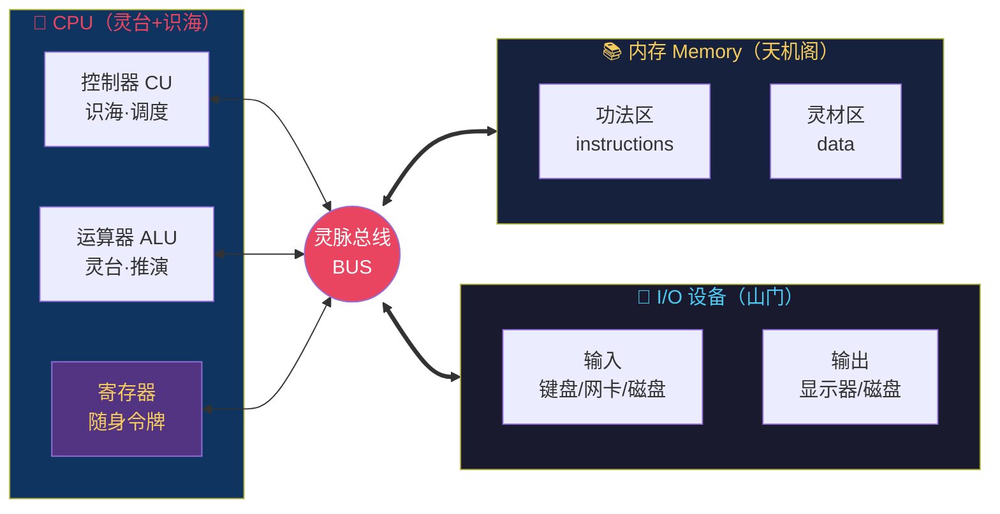
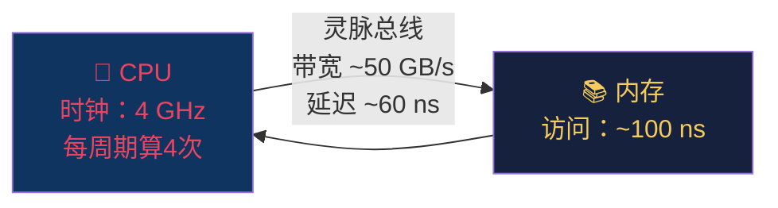
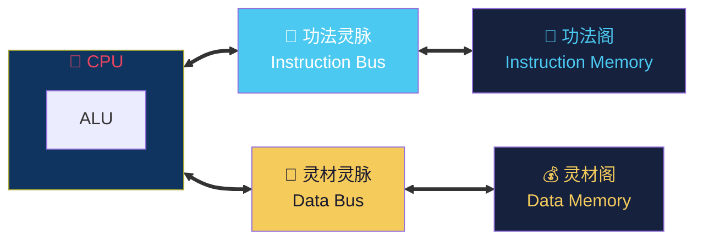

# 【渡劫·26】冯·诺依曼架构

> **码农修仙传 · 渡劫期 · 第26篇**
> 我是玄芯散人，带你从炼气修到大乘。

---

## 境界标识

```
╔══════════════════════════════════╗
║     渡劫期 · 第26篇               ║
║     冯·诺依曼架构                  ║
║     预计阅读：12分钟              ║
╚══════════════════════════════════╝
```

---

## 修仙引入

修仙界有一个共识：所有现代修真体系，追祖溯源，都要回到那位 1945 年的渡劫大能——冯·诺依曼（John von Neumann）。

他是 20 世纪最可怕的"全才修士"：集合论奠基人之一、博弈论的开山祖师、量子力学的数学架构师、原子弹工程的核心推手之一。而他最后二十年心血的封神之笔，是一份 101 页的备忘录 ——《First Draft of a Report on the EDVAC》。

这份报告，提出来一个今天统治所有计算机、服务器、手机、甚至你家电饭煲的修真体系：**存储程序架构（Stored-Program Computer）**。后人把它叫做**冯·诺依曼架构**。

从 ENIAC 那台要用接线板"换功法"的蛮荒时代，到今天你手机里跑的 iOS / Android；从你写 Python 时调用的 `list.append`，到 NASA 火星探测器上的星载计算机——80 年了，底层骨架没变过。

今天这篇，我们就聊聊这位渡劫大能留下的"道统"，为什么一个 80 年前的设计能统治到今天。

---

## 硬核主体

### 一、封神之前：蛮荒时代的计算机

要理解冯·诺依曼的伟大，先看看他出现之前的修真界。

1945 年之前，世界上最快的电子计算机是 **ENIAC**。它是个大家伙——18000 根电子管、30 吨重、占满一整个房间。它的修真能力很强，每秒能做 5000 次加法。

但有个致命问题：它不是"存储程序"的。

ENIAC 的"功法和灵材"是分开存放的：
- **灵材（数据）** 放在打孔卡片或旋钮寄存器里
- **功法（程序）** 则是物理上"接"出来的——工程师要用手拔线、改接线板来"切换功法"

这意味着 ENIAC 想换一个程序，得几十个工程师花几周时间重新接线。要让它从"算弹道"切到"算天气"，几乎相当于推倒重来。

在修真比喻里，这就像一个修士要施展不同法术，每次都得重塑经脉——你说这仗怎么打？

冯·诺依曼看完 ENIAC，写了那份报告，提出一个划时代的想法：把功法和灵材放在同一个天机阁里。这就是 **stored-program concept**，存储程序概念。

### 二、封神之作：存储程序概念

存储程序概念的核心只有一句话，但这一句话重塑了整个人类文明：

> **程序（指令）和数据都以二进制形式存放在同一存储器中，CPU 可以像读数据一样读指令。**

这个想法在今天看来理所当然，但在 1945 年，它是颠覆性的。它意味着：

1. 换功法不需要重塑经脉——只需加载新的指令序列到内存
2. 程序可以自我修改——程序运行时能生成新指令（现代 JIT 编译器就这么干）
3. 一台机器通杀所有修真任务——不再是"算弹道专用机"、"算天气专用机"，而是"通用计算机"

在修真体系里，这等于把修仙从"专精一道"解放到"万法皆通"——你不必每次都换身体，只要往天机阁里塞新功法就能修新法术。

这份报告最后没署冯·诺依曼一个人的名字，而是署了 ENIAC 团队六个人——但所有人都清楚，真正的执笔者是他。后人为了纪念，干脆把这种架构叫做"冯·诺依曼架构"。

### 三、天机阁总纲：五大组成部分

冯·诺依曼架构定义了**五大组成部分**，这个分法沿用至今：

```
╔═══════════════════════════════════════════╗
║   冯·诺依曼五岳 —— 现代计算机五脏        ║
╠═══════════════════════════════════════════╣
║ 1. 运算器（ALU）     —— 灵台·推演        ║
║ 2. 控制器（CU）      —— 识海·调度        ║
║ 3. 存储器（Memory）  —— 天机阁·存藏      ║
║ 4. 输入设备（Input） —— 山门·纳气        ║
║ 5. 输出设备（Output）—— 山门·吐纳        ║
╚═══════════════════════════════════════════╝
```

| 修真部件 | 技术组件 | 功能描述 |
|---------|---------|---------|
| 灵台 | 运算器（ALU） | 算数、逻辑运算——所有加法减法都在这里发生 |
| 识海 | 控制器（CU） | 取指令、解析指令、协调各部件 |
| 天机阁 | 存储器（Memory） | 同时存放**功法和灵材**——这是关键 |
| 山门·纳气 | 输入设备 | 键盘、鼠标、网卡、传感器、磁盘……接收外界信号 |
| 山门·吐纳 | 输出设备 | 显示器、扬声器、网卡、磁盘……向外界输出信号 |

CPU（中央处理器）= 灵台 + 识海，合起来就是"修炼者的核心"。

用一张图把整条灵脉看清楚：



所有部件都挂在**灵脉总线（Bus）**上，通过总线传信。现代计算机图里一堆双向箭头，就是因为所有部件都在同一条灵脉上来回传信。

### 四、取经流程：Fetch-Decode-Execute 循环

理解了五大部件，再看 CPU 是怎么"修炼"的。

CPU 的工作，本质上是一个**死循环**，每个轮回都做三件事：

```
┌─────────────────────────────────┐
│  ① 取指 Fetch    —— 读功法       │
│  ② 译码 Decode   —— 解功法       │
│  ③ 执行 Execute  —— 运功法       │
│  ④ 回头①，循环往复               │
└─────────────────────────────────┘
```

用 Python 写一个超简化的冯·诺依曼机器，让你直观看到这件事：

```python
# 一个玩具版冯·诺依曼机器
# 关键设计：功法和灵材放在同一个 memory 数组里

# 指令编码：1=加载, 2=加法, 3=存数, 4=打印, 99=停机
OPCODES = {1: "LOAD", 2: "ADD", 3: "STORE", 4: "PRINT", 99: "HALT"}

memory = [        # 天机阁：功法和灵材共库
    1, 5,         # LOAD 5  → 把 memory[5] 的灵材放进寄存器
    2, 6,         # ADD  6  → 把 memory[6] 的灵材加进寄存器
    3, 7,         # STORE 7 → 把寄存器的值写回 memory[7]
    4, 0,         # PRINT   → 把寄存器的值打印出来
    99, 0,        # HALT    → 停机
    10,           # memory[5] = 10 灵材
    32,           # memory[6] = 32 灵材
    0             # memory[7] = 0  (结果区)
]

pc = 0            # 程序计数器 —— 识海里的"读到哪一行了"
acc = 0           # 累加器   —— 灵台里的"当前运算结果"

while True:
    op = memory[pc]              # ① 取指 (Fetch)
    arg = memory[pc + 1]         #    多数指令带一个参数

    if op == 1:                  # ②③ 译码+执行 (Decode+Execute)
        acc = memory[arg]        #    LOAD：把灵材放进灵台
    elif op == 2:
        acc = acc + memory[arg]  #    ADD：把灵材加进灵台
    elif op == 3:
        memory[arg] = acc        #    STORE：把灵台结果存回天机阁
    elif op == 4:
        print(f"输出：{acc}")    #    PRINT：山门·吐纳
    elif op == 99:
        print("停机")            #    HALT：功法圆满
        break

    pc += 2                      # 跳到下一条指令
    # 死循环：继续 Fetch
```

跑一下，结果是：

```
输出：42
停机
```

这就是冯·诺依曼架构的核心：天机阁里既放着"LOAD / ADD / STORE"的功法，又放着 `10` 和 `32` 这些灵材。灵台拿着功法，按部就班地从天机阁里取数、运算、存回，最后从山门吐出去。

你今天写的每一段 Python、Java、Go，最后在硬件里跑的就是这个循环的几十亿倍速版本。

### 五、为什么这个架构统治了 80 年？

封神容易，难的是封神之后还能坐稳八十年。冯·诺依曼架构能扛这么久，有三个原因：

第一，足够简单，足够通用。

五大部件 + 一个循环，三岁小孩都能听明白（如果你穿越到 1945 年）。这种简洁让它能被任何工艺实现——从 1945 年的电子管，到 1965 年的晶体管，到 1985 年的超大规模集成电路，再到今天的几纳米芯片。工艺变了，道统没变。

第二，硬件成本/性能比无敌。

把功法和灵材合库，最大的代价是"灵脉带宽瓶颈"（后面会单独讲）。但收益更大：硬件设计可以极简，CPU 只需要一种"读天机阁"的操作就能搞定所有事。如果哈佛架构要把功法库和灵材库分开做，就要两套硬件、两套地址空间，成本翻倍。冯·诺依曼架构用更便宜的硬件，做到了"几乎一样快"，市场当然选便宜的。

第三，生态护城河。

从汇编、C、操作系统、应用软件，整个软件生态都建立在"指令和数据共库"的假设上。x86、ARM、RISC-V 三大指令集全是冯·诺依曼体系（虽然 RISC-V 设计上更接近 Load/Store 架构，但本质还是冯·诺依曼）。所有编译器、所有操作系统、所有框架都按这套规矩来。想换架构，等于把整个软件世界推倒重来——谁也承担不起这个成本。

这就是为什么 80 年了，它依然是行业标准。

### 六、灵脉瓶颈：冯·诺依曼架构的阿喀琉斯之踵

封神之人，也有破绽。冯·诺依曼架构有个著名的弱点，叫做**冯·诺依曼瓶颈（Von Neumann Bottleneck）**。



CPU 是今世最强修士，主频 4 GHz，每秒能算几十亿次。内存（DRAM）却慢得多——访问一次要 100 纳秒。CPU 算完一道题，伸灵脉总线去内存取数据，等的时候 CPU 只能发呆。

现代 CPU 每秒能执行几十亿条指令，但内存到 CPU 的带宽是有限的——这就像一个超快的厨子，但菜要从很远的菜市场运来，厨子大部分时间在等菜。

修真比喻里，这个瓶颈叫**灵脉带宽瓶颈**：CPU（修士）跑得比风还快，但功法/灵材得从天机阁通过灵脉运过来，灵脉就那么粗，CPU 大部分时间都在等。

历史上整个计算机行业都在跟这个瓶颈作斗争：

| 时代 | 解法 | 修真比喻 |
|------|------|---------|
| 1980s | 加 **Cache**（CPU 内部的高速缓存） | 在灵台里设一个**随身小锦囊**，常用灵材提前放进去 |
| 1990s | 多级 Cache（L1/L2/L3）、流水线、超标量 | 把大锦囊分成三档，流水线让多个厨子并行做菜 |
| 2000s | 多核、SIMD、乱序执行 | 一颗灵台不够，开多颗；多个厨子同时做 |
| 2010s | 3D 堆叠、HBM 高带宽内存 | 把天机阁搬到灵台旁边，缩短灵脉距离 |
| 2020s | 片上内存、存算一体 | 让灵台自己也能存东西，消除搬运 |

你看，所有性能优化都绕不开一个核心矛盾：灵脉不够宽，CPU 算力过剩。但即使如此，工业界依然没有抛弃冯·诺依曼架构，只是在它周围叠了一层又层的补丁。这就是冯·诺依曼架构统治八十年的原因：有问题，修补它；不换道统。

### 七、对比：哈佛架构的分库之道

既然合库有瓶颈，那为什么不分库？这就引出了冯·诺依曼架构的"对手"——**哈佛架构（Harvard Architecture）**。

哈佛架构的核心思想：功法和灵材分库存储，分灵脉传送。



| 维度 | 冯·诺依曼 | 哈佛 |
|------|----------|------|
| 功法/灵材存储 | 合库 | 分库 |
| 灵脉 | 一条 | 两条 |
| 硬件成本 | 低 | 高 |
| 灵活性 | 高（功法可被灵材覆盖） | 低（功法区只读） |
| 安全性 | 低（程序易被攻击） | 高（功法区受保护） |
| 典型应用 | 通用 CPU（x86/ARM/RISC-V） | DSP、单片机、安全芯片 |

哈佛架构的最大优点：同时取功法和取灵材不冲突——两条灵脉独立，可以并行。在信号处理（DSP）、嵌入式控制器（8051、AVR）、智能卡安全芯片这些"不需要灵活、需要稳定"的场景里，哈佛架构反而是首选。

修真比喻：

- 冯·诺依曼架构：功法库和灵材库都在天机阁里，可以自由调配，但灵脉就一条，要排队。
- 哈佛架构：功法阁归功法阁，灵材阁归灵材阁，各走各的灵脉，但代价是两套硬件，且灵材改不了功法。

现代 CPU 大多用 **Modified Harvard（修正哈佛）** 的折中——物理上分库（Cache L1 拆 I-Cache 和 D-Cache），逻辑上合库（程序员视角是一套地址空间）。不偏不倚，取两家之长。

### 八、封神背后：渡劫大能冯·诺依曼

最后说说冯·诺依曼本人。他是真正的"全才修士"：

- 6 岁心算八位数除法——灵根觉醒极早
- 22 岁获数学博士学位——天资骇人
- 30 岁前后成为普林斯顿 IAS 的核心人物——封神早成
- 博弈论——和经济学家摩根斯坦合著《博弈论与经济行为》，开创了整个学科
- 流体力学 / 量子力学 / 核物理——都做出了奠基性工作
- 曼哈顿计划——参与原子弹的数学推演
- 1957 年因癌症去世，享年 53 岁——渡劫未成，身死道消

他留给修真界的最后一份大礼，就是《EDVAC 报告》。今天我们用的每一台计算机、每一个手机、每一个嵌入式设备，都是他那份 101 页报告的徒子徒孙。

封神级先贤，值得我们记住。

---

## 修仙术语对照表

| 修仙术语 | 技术现实 | 本篇详解 |
|---------|---------|---------|
| 渡劫大能·封神级 | 划时代工程师/科学家 | ✅ §一、§八 |
| 存储程序概念 | Stored-Program Concept | ✅ §二 |
| 道法同源 | 指令与数据都用二进制、共用内存 | ✅ §二、§三 |
| 灵台 | 运算器（ALU） | ✅ §三、§四 |
| 识海 | 控制器（CU） | ✅ §三、§四 |
| 天机阁 | 主存储器（Memory） | ✅ §三、§四 |
| 山门·纳气 | 输入设备（Input） | ✅ §三 |
| 山门·吐纳 | 输出设备（Output） | ✅ §三 |
| 灵脉总线 | 系统总线（Bus） | ✅ §三、§六 |
| 功法区 | 指令存储区 | ✅ §三、§四 |
| 灵材区 | 数据存储区 | ✅ §三、§四 |
| 随身令牌 | 寄存器（Register） | ✅ §三 |
| 取经流程 | Fetch-Decode-Execute 循环 | ✅ §四 |
| 程序计数器（PC） | 识海中的"读到哪一行"指针 | ✅ §四 |
| 灵脉带宽瓶颈 | Von Neumann Bottleneck | ✅ §六 |
| 随身锦囊 | CPU Cache（L1/L2/L3） | ✅ §六 |
| 功法阁/灵材阁（分库） | 哈佛架构 | ✅ §七 |
| 修正哈佛 | Modified Harvard Architecture | ✅ §七 |
| EDVAC 报告 | First Draft of a Report on the EDVAC | ✅ §一、§二 |

想查全系列术语？看 [术语词典](/glossary)。

---

## 突破条件

渡劫期不是"修炼到某个修为就过关"——渡劫是**悟**，不是练。

但要真正"悟到"冯·诺依曼架构这一层，下面这些应当像呼吸一样自然：

- [ ] 能徒手画出五大部件的连接图，标出数据流向（不需要查资料）
- [ ] 能向一个非技术朋友用比喻讲清楚"什么是存储程序概念"
- [ ] 知道冯·诺依曼瓶颈是什么，并说出至少 3 种工业界的缓解方案
- [ ] 能说出冯·诺依曼架构与哈佛架构的核心差异，并各举 1 个典型应用
- [ ] 理解 Fetch-Decode-Execute 循环，能用任意语言实现一个 toy version
- [ ] 知道至少一位 1940~1970 年间对计算机体系有奠基性贡献的先贤（除冯·诺依曼外）

> 当你能把"内存为什么要分 Cache"、"为什么程序能被自我修改"、"为什么 x86 统治桌面 ARM 统治手机"这些问题答得清清楚楚——恭喜，你已经在渡劫期站稳了。

渡劫没有终点，下一劫是**图灵机**——理解"什么是可计算的"。那是整个计算机科学的基石，也是下一篇要拆的。

---

## 下期预告 + 互动

> **下一篇：【渡劫·27】图灵机 —— 计算的边界**

冯·诺依曼给了我们怎么造计算机的答案，但没回答：到底什么问题是计算机能解的，什么是计算机永远解不了的？

这个问题，是图灵在 1936 年的另一篇封神之作里回答的。图灵机和冯·诺依曼架构，是一对孪生兄弟——一个回答"能不能算"，一个回答"怎么算"。下一篇，我们就拆这个孪生兄弟的另一面。

现在问你：

> 🧠 **思考题**：你写程序时，有想过你的代码最终是在跑冯·诺依曼架构吗？评论区聊聊你第一次意识到"程序其实是在内存里跑"是什么时候。
>
> 💬 **互动**：如果让你给冯·诺依曼写一句墓志铭，你会写什么？
>
> 🔔 关注玄芯散人，渡劫路上不孤单。下一篇拆图灵机，看清计算的边界。

> 我是玄芯散人，带你从炼气修到大乘。

---

*本文是「码农修仙传」系列第26篇。系列导航见 [xren.ren](https://xren.ren)*