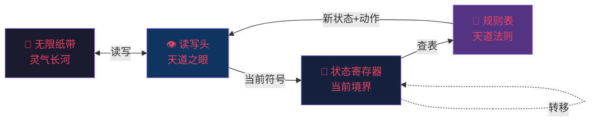
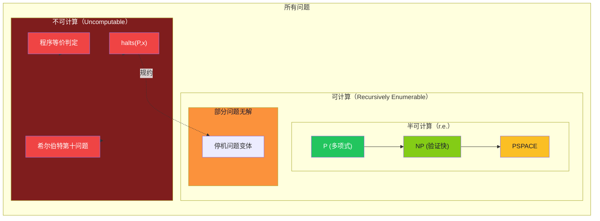

# 【渡劫·27】图灵机

> **码农修仙传 · 渡劫期 · 第27篇**
> 我是玄芯散人，带你从炼气修到大乘。

---

## 境界标识

```
╔══════════════════════════════════╗
║     渡劫期 · 第27篇               ║
║     图灵机                       ║
║     预计阅读：12分钟             ║
╚══════════════════════════════════╝
```

---

## 修仙引入

渡劫期的天劫落下时，你写了一段程序。

它跑了一秒、跑了一分钟、跑了一个小时——仍在运行。

你凑过去问电脑："这玩意儿到底会不会停？"

电脑沉默以对。它算不出来。

你换更快的电脑、再快的、超算……还是沉默。

不是算力不够，是这个问题根本无解。

1936 年，一个 24 岁的英国青年阿兰·图灵（Alan Turing），在论文《论可计算数及其在判定问题上的应用》（*On Computable Numbers, with an Application to the Entscheidungsproblem*）里，用了一页纸，证明了一件事：

> 存在这样的问题，无论给计算机多少时间，它都永远算不出答案。

这一页纸，是整个人工智能时代的"开天辟地"。它给了你手里这台笔记本电脑以"能算"的资格，也同时宣告了"有些事，再算也算不出来"——这是计算本身的天道边界。

渡劫期的核心命题：不是所有问题都有解，连天道本身都无法回答某些问题。

这一篇，我们借图灵的眼睛，看清楚计算的尽头在哪里。

---

## 硬核主体

### 图灵机是什么——天道演算的最简形态

1936 年的欧洲，数学界正被一个问题困扰：**希尔伯特第十问题**（Hilbert's 10th Problem）——是否存在一种"通用算法"，能判定任意丢番图方程是否有整数解？

要回答"是否存在通用算法"，你得先回答："算法"到底是什么？

图灵的答案：把"算法"剥到不能再剥，剩下的最小骨架，就是**图灵机（Turing Machine）**。

图灵机不是一台真的机器（那是后来的物理实现），而是一个**思维模型**——它定义了"可计算"这条天道的边界。

它只有五个组件，每个都简陋到极致：

| 组件 | 修仙类比 | 作用 |
|------|---------|------|
| **纸带（Tape）** | 灵气长河 | 一条无限长的存储介质，上面有格子，每格可写一个符号 |
| **读写头（Head）** | 天道之眼 | 每次只对纸带上一格进行读写 |
| **状态寄存器（State）** | 修士当下的境界 | 记录"此刻机器处于什么状态" |
| **规则表（Transition Function）** | 天道法则条文 | `(当前状态, 当前符号) → (新状态, 写入符号, 移动方向)` |
| **动作（Action）** | 法则的执行 | 改写格子、挪动读写头、切换状态 |

每次运行，机器做三件事：

1. 读：读写头看一眼当前格子的符号
2. 查：在规则表里查 `(当前状态, 当前符号)` 对应的处置
3. 执行：改写格子、向左/右挪一格、切换到新状态

如此循环，直到进入"停机（Halt）"状态——输出结果。

就这么简单。没有操作系统、没有内存管理、没有进程调度、没有缓存预取。

简陋吗？是的。但所有现代计算机——你手里的 MacBook、机房里的 x86 服务器、树莓派、手机 SoC——本质都是一台图灵机。

看一眼图灵机的物理结构：



箭头表示数据流向——纸带上的符号被读写头读取，传入状态寄存器；状态寄存器带着当前状态去查规则表，得到新状态和动作，反过来驱动读写头。整个回路就是一个封闭的天道循环。

### 用 Python 造一台图灵机——亲手验证天道

光说不练假把式。我们用 100 行 Python 亲手造一台能做"加 1"运算的图灵机。

目标：在纸带上读取一个二进制数（比如 `1011`），返回 `1100`（也就是 +1）。

```python
# 玄芯散人手搓的最简图灵机 —— 二进制加 1
# 规则表的设计思路：从右往左扫描，遇到 0 或 1 的不同分支

TAPE = ['1', '0', '1', '1', '_']  # _ 表示空白格
HEAD = 0                           # 读写头初始位置（在最左）
STATE = 'scan_right'               # 初始状态：从左往右找最低位

# 天道法则条文 —— 每条都是 (当前状态, 当前符号) → (新状态, 写入符号, 移动方向)
RULES = {
    # 扫描阶段：从左往右，找到最右边的有效数字
    ('scan_right', '0'): ('scan_right', '0', 'R'),  # 遇到 0 继续右移
    ('scan_right', '1'): ('scan_right', '1', 'R'),  # 遇到 1 继续右移
    ('scan_right', '_'): ('carry', '_', 'L'),       # 遇到空白就回头开始处理

    # 进位阶段：从右往左，遇到 0 改 1 结束，遇到 1 改 0 继续进位
    ('carry', '0'):     ('done',     '1', 'N'),     # 0 → 1，无进位，功德圆满
    ('carry', '1'):     ('carry',    '0', 'L'),     # 1 → 0，继续向左进位
    ('carry', '_'):     ('done',     '1', 'N'),     # 全 1 溢出，最高位补 1
}

def turing_machine(tape, head, state, rules, max_steps=1000):
    """运行图灵机，最多 max_steps 步 —— 防止无限循环（讽刺的是，停机问题本身就是不可判定的）"""
    step = 0
    while state != 'done' and step < max_steps:
        symbol = tape[head] if head < len(tape) else '_'  # 越界视为空白
        key = (state, symbol)
        if key not in rules:                              # 规则表里没有这个情况
            print(f"卡在状态={state}, 符号={symbol}, 无规则可循 —— 走火入魔")
            break
        new_state, write, move = rules[key]              # 查天道法则条文
        tape[head] = write                                # 改写格子（写入新灵气）
        head += 1 if move == 'R' else (-1 if move == 'L' else 0)  # 挪动读写头
        state = new_state                                 # 切换状态（境界跃迁）
        step += 1
        print(f"第{step}步 状态={state} 位置={head} 纸带={''.join(tape)}")
    return ''.join(tape).rstrip('_')                      # 去掉末尾空白

print("初始纸带:", ''.join(TAPE))
result = turing_machine(TAPE.copy(), HEAD, STATE, RULES)
print(f"\n加1结果：{result}  （{int(result, 2)} = {int(''.join(TAPE[:4]), 2)} + 1）")
```

跑一下：

```
初始纸带: 1011_
第1步 状态=scan_right 位置=1 纸带=1011_
第2步 状态=scan_right 位置=2 纸带=1011_
第3步 状态=scan_right 位置=3 纸带=1011_
第4步 状态=scan_right 位置=4 纸带=1011_
第5步 状态=carry 位置=3 纸带=1011_
第6步 状态=carry 位置=2 纸带=1010_     ← 把 1 改 0，向左进位
第7步 状态=carry 位置=1 纸带=1000_     ← 把 1 改 0，继续进位
第8步 状态=carry 位置=0 纸带=0000_     ← 把 1 改 0，继续进位
第9步 状态=carry 位置=-1 纸带=0000_    ← 越界视为空白，进入全1溢出分支
第10步 状态=done 位置=-1 纸带=1000_    ← 写入1，功德圆满

加1结果：1000 （8 = 7 + 1）
```

二进制 `0111` 加 1 = `1000`，正确。

注意：就这么一台简陋的机器——五个组件、几条规则——就能做加法。给它足够的时间和纸带，它能做现代计算机能做的任何事。

这就是图灵完备的力量。

### 图灵完备——i9 和算盘本质一样

什么叫**图灵完备（Turing Complete）**？

如果一个计算模型能模拟任意图灵机，反过来也能被任意图灵机模拟，它就是图灵完备的。

用人话说：一种语言只要有"循环 + 条件判断 + 可读写变量"，理论上就能计算一切可计算的事。

| 看起来弱 | 其实图灵完备 |
|---------|------------|
| C / C++ / Java / Python / Go / Rust | 主流语言全图灵完备 |
| JavaScript | 是的，浏览器里跑的也是 |
| Excel 公式 | 是的，Excel 公式是图灵完备的 |
| SQL（带递归 CTE） | 是的 |
| Minecraft 红石电路 | 是的，有人在 Minecraft 里造过 CPU |
| Conway 生命游戏 | 是的，纯细胞自动机 |
| Brainfuck | 是的，一个只有 8 个字符的语言 |
| 任何带 `while` 的语言 | 都是 |

而看起来强大的 HTML / CSS / 纯 SQL（不带递归） / JSONPath / 正则表达式 ——不是图灵完备。它们是图灵不完备的，没法写任意程序。

更炸裂的事实：i9-13900KS 和一颗算盘，在"能算什么"这个层面上，等价。

差别只是速度——算盘算 10 年加法，i9 算 1 纳秒。但它们能算的东西完全一样。这就是**丘奇-图灵论题（Church-Turing Thesis）**：

> 任何"算法上可计算"的函数，都能被图灵机计算。

这是经验性命题（无法数学证明），但 90 年来没有任何反例。所有物理上能实现的计算装置，都等价于一台图灵机。

包括量子计算机？是的——量子计算机是图灵完备的，区别在于它能更快地计算某些特定问题（如 Shor 算法分解大数），但不能计算图灵机算不出的东西。

### 停机问题——天道回答不了"会不会停"

这是渡劫期最炸裂的部分。

问题很简单：给定任意一段程序 P 和输入 x，能否写一个程序 `halts(P, x)`，返回 true（停机）或 false（永不停机）？

直觉上，你可能觉得这有什么难的——跑一下不就知道了？

但"跑一下"这个动作本身就需要无限时间。你怎么知道它还在"算"还是已经"卡死"？

图灵的证明只用了一个反证法，堪称数学史上最优雅的论证之一：

```python
# 图灵的反证法：假设 halts() 存在，构造悖论
def halts(program, input):
    """假设这是天道给的完美判定器 —— 输入程序和它的输入，返回会不会停"""
    # 实际实现我们不知道，但假设它存在
    pass

def paradox(program):
    """撒旦程序：如果 halts 说它会停，它就死循环；如果说它不停，它就停"""
    if halts(program, program):   # 问天道：跑我自己会停吗？
        while True:                # 如果说会停 → 故意死循环，让天道打脸
            pass
    else:
        return                    # 如果说不会停 → 立刻停机，又让天道打脸

# 现在问天道：paradox(paradox) 会停吗？
# 如果天道说"会停"：进入 if 分支，进入死循环，不会停 → 矛盾
# 如果天道说"不会停"：进入 else 分支，立即返回，停了 → 矛盾
# → 不存在这样的 halts()！
```

核心套路：让程序读自己（self-reference），逼天道在"是"和"否"之间左右互博。

这是 1931 年哥德尔不完备定理在计算机领域的回响：任何足够强的形式系统，都存在它无法证明的命题。哥德尔证明了数学有边界，图灵证明了计算有边界。

用一张图看清停机问题的归约结构：

```mermaid
graph TD
    A[任意程序 P] -->|问天道| B{halts(P) ?}
    B -->|是| C[P 死循环<br/>实际不停]
    B -->|否| D[P 立即返回<br/>实际会停]
    C -->|矛盾| E[天道判定失败]
    D -->|矛盾| E
    E --> F[halts 不存在<br/>停机问题不可判定]

    style A fill:#1a1a2e,color:#e94560
    style B fill:#533483,color:#e94560
    style C fill:#7f1d1d,color:#fff
    style D fill:#14532d,color:#fff
    style E fill:#fbbf24,color:#1a1a2e
    style F fill:#0f3460,color:#e94560
```

停机问题不是"难"，是"不可能"。 这跟 NP-hard 不一样——NP-hard 是还没找到多项式算法，但理论上可能存在。停机问题是数学上证明不存在。

工程上的启示：

- 你写了一个程序，不可能写一个工具自动判定它会不会死循环
- 这不是工具不够好，是数学定理禁止
- 编译器、静态分析工具能近似判定停机（比如某些情况下能证明必然停机），但永远无法做到完美

### 计算的边界——可计算、半可计算、不可计算

渡劫期的视野要再拉远一层——图灵不仅划了图灵机的能力，还划了整个计算宇宙的边界：



三个层级：

| 层级 | 含义 | 典型例子 | 修仙类比 |
|------|------|---------|---------|
| **可计算（Computable）** | 一定时间内有算法能给出答案 | 排序、最短路径、矩阵乘法 | 仙界可施展的法术 |
| **半可计算（Semi-decidable）** | 答案"是"时能验证，答案"否"时可能永远跑 | 停机问题、哥德尔句 | 能识破真仙，分不出假仙 |
| **不可计算（Uncomputable）** | 数学上不存在任何算法能给出答案 | 完美停机判定、程序等价判定 | 天道无法施展的禁术 |

半可计算这个层级特别微妙。停机问题就是典型的半可计算：你能写一个程序，如果对方确实会停，你一定能检测出来；但如果对方不会停，你会一直跑下去，永远给不出"否"的答案。

这就像修仙小说里判别真仙假仙——你能一眼认出真仙（停机的程序），但对假仙你永远要打一架才知道（永远跑下去）。

图灵 1936 年那篇论文的最后一节，证明了：希尔伯特第十问题无解——不存在判定任意丢番图方程是否有整数解的通用算法。

1970 年，马季亚谢维奇（Юрий Матиясевич）补完了最后一刀，给出了具体的不可解丢番图方程实例。

这一剑，切开了整个 20 世纪数学的根基。

### 工程现实的启示——程序员该记住的三件事

图灵机的理论不是学术摆设，它有三个直接的工程启示：

第一，不要试图写"完美"的代码分析工具。

你想做"自动找死循环"、"自动证明两个程序等价"、"自动判定代码正确性"——这些全都不可计算。能做的是"在某些情况下"做到，不是"对所有程序"做到。Lint 工具、形式化验证工具都是近似。

第二，编译器优化有其天花板。

编译器想做"最优优化"——把任意程序优化成等价的、最快的版本——这等价于停机问题，不可判定。这就是为什么编译器优化是"启发式"的，不是"完美"的。

第三，AI 的能力边界也在这里。

今天 LLM 看似"无所不能"，但你让它"严格证明程序正确性"——它只能做半可计算的工作，理论上无法做到完美。这就是为什么 AGI 不能靠堆算力实现，它必须接受"有些问题答不出"的事实。

这三点，是图灵在 1936 年给整个软件行业的判决书——你永远做不完美，但能做局部。

---

## 修仙术语对照表

| 修仙术语 | 技术现实 | 本篇详解 |
|---------|---------|---------|
| 天道原型 | 图灵机（Turing Machine） | ✅ §图灵机是什么 |
| 灵气长河 | 无限纸带（Tape） | §图灵机的组件 |
| 天道之眼 | 读写头（Head） | §图灵机的组件 |
| 当前境界 | 状态寄存器（State） | §图灵机的组件 |
| 天道法则条文 | 规则表（Transition Function） | §图灵机的组件 |
| 图灵完备 | Turing Completeness | §图灵完备 |
| 丘奇-图灵论题 | Church-Turing Thesis | §图灵完备 |
| 鸿钧老祖的悖论 | 停机问题（Halting Problem） | ✅ §停机问题 |
| 撒旦程序 | 反证程序（paradox） | §停机问题 |
| 撒豆成兵 | 自指 / 自引用（self-reference） | §停机问题 |
| 真仙假仙之辨 | 半可计算（Semi-decidable） | §计算的边界 |
| 天道禁术 | 不可计算（Uncomputable） | §计算的边界 |
| 希尔伯特第十问题 | Hilbert's 10th Problem | §计算的边界 |
| 哥德尔不完备定理 | Gödel's Incompleteness Theorem | §停机问题 |
| 渡劫天雷 | 不可判定性的数学证明 | ✅ 全篇主线 |

想查全系列术语？看[术语词典](/glossary)。

---

## 突破条件

要从图灵机（渡劫 27）走到下一境，你需要：

- [ ] 能说出图灵机的五个组件，并解释每个的作用
- [ ] 能用 100 行以内的代码造一台图灵机，并完成简单运算
- [ ] 理解"图灵完备"是什么意思，并举出 3 个图灵完备 / 2 个图灵不完备的系统
- [ ] 能复述停机问题的反证法，理解"自指"为什么必然产生悖论
- [ ] 能区分"难"（P vs NP）和"不可能"（停机问题），知道工程上能做的是近似而非完美
- [ ] 意识到"算力不是万能的"——有明确的数学边界限制计算机能做什么

> 达成这六项，你就叩开了"计算的边界"这扇门。这是每个真正理解计算机的程序员必须过的渡劫——承认天道有涯，从此不再做力所不能及的妄念。

---

## 下期预告 + 互动

> **下一篇：【渡劫·28】计算的完整地图**
>
> 上一节我们看了图灵机的"最简天道"，以及停机问题这个"天道回答不了的问题"。
> 但这只是冰山一角。计算的完整宇宙，从简单到复杂、从可计算到不可计算，分成了严格的层级——P、NP、PSPACE、不可判定。
> 下一篇画一张完整的计算地图，让你看清：
> - P 问题和 NP 问题到底什么关系
> - NP 完全问题为什么让所有密码学家夜不能寐
> - 图灵奖百万美金悬赏的 P vs NP 问题
>
> 我们下期，从图灵机走到计算复杂性理论的完整版图。

现在问你：

> 🎮 **挑战题**：用任何你会的语言，写一段会无限循环的代码。然后试着写一个程序，判定任意代码会不会无限循环——你会发现，无论怎么写都写不出来。这是图灵 1936 年的发现，亲手验证一下。

> 💬 **话题**：你有没有遇到过"代码跑了一万年还在跑"的死循环？是怎么解决的？如果解决不了，又是怎么应对的？评论区聊聊你的"渡劫"经历。

> 🔔 关注玄芯散人，下一篇带你看计算的完整地图。

> 我是玄芯散人，带你从炼气修到大乘。

---

*本文是「码农修仙传」系列第27篇。系列导航见 [xren.ren](https://xren.ren)*