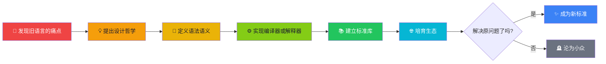
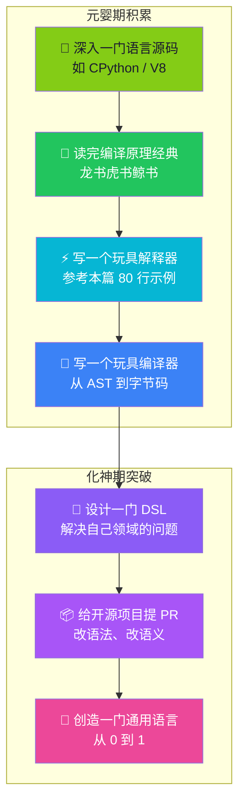

# 【化神·121】创造编程语言需要什么

> **码农修仙传 · 化神期 · 第21篇**
> 我是玄芯散人，带你从炼气修到大乘。

---

## 境界标识

```
╔══════════════════════════════════╗
║     化神期 · 第21篇              ║
║     创造编程语言需要什么          ║
║     预计阅读：12分钟              ║
╚══════════════════════════════════╝
```

---

## 修仙引入

你有没有想过这样一个问题——

你每天写的 `if`、`for`、`function` 这些符号，它们是从哪里来的？是谁第一个写下了 `print("Hello, World!")`？是谁规定 `=` 是赋值而不是等于？为什么 Python 用缩进，C 用花括号，Ruby 用 `end`？

这些看起来天经地义的语法，背后都是某个人、某一群人在某个深夜拍板定下来的。语言不是天生的，语言是被创造的。

凡人用软件，炼气期写代码，筑基期懂原理，金丹期通系统，元婴期穿透软硬边界——但所有这些境界，本质上都是**使用者**。你用 Python，你用 Go，你用 Rust，但你不创造它们。

化神期不一样。

化神期不是更高阶的"用"，而是**"造"**。

不是用框架，而是设计框架。不是用语言，而是设计语言。不是用操作系统，而是造操作系统。

Linus 造了 Linux 和 Git，Guido 造了 Python，Dennis Ritchie 造了 C 和 Unix，Graydon Hoare 造了 Rust。这些人不再是修炼者，他们是**造物者**——他们定义了一代代码农的工作方式。

这一篇，我们就来拆解一个造物者最核心的法术：创造一门编程语言，到底需要什么？

---

## 硬核主体

### 化神期的本质——从解决问题到定义问题

化神之前的所有境界，本质上都在**解决问题**。

- 凡人：怎么用软件解决业务问题？
- 炼气期：怎么用代码解决小问题？
- 筑基期：怎么用数据结构、算法提升效率？
- 金丹期：怎么在系统层面优化性能？
- 元婴期：怎么让代码直接操控硬件？

化神期之后，问题的性质变了——你不再是解决问题，而是**定义问题本身**。

造一门语言之前，先要回答：为什么这个世界需要一门新的语言？

- C 诞生于 1972 年，因为 Dennis Ritchie 需要一种能直接操控内存、又能写操作系统的语言。
- Java 诞生于 1995 年，因为 Sun 公司需要一种"一次编写，到处运行"的语言——解决跨平台问题。
- Go 诞生于 2009 年，因为 Google 的 C++ 代码编译要 45 分钟，他们需要一种**编译快、部署简单、并发友好**的语言。
- Rust 诞生于 2010 年，因为 Graydon Hoare 想解决 C/C++ 的内存安全问题——**零成本抽象 + 内存安全**。

每一门语言的诞生，都对应着一个**具体的不满**。造语言不是炫技，是回应一个真问题。



这张图是一条造语言的完整链路。从"我对现状不满"到"新语言成为标准"，中间每一步都是一座山。99% 的语言死在第二步到第四步之间——胎死腹中。

---

### 一门语言的五大构成——造物者的法器图谱

不管什么语言，剥到骨子里都由五层构成。造语言，本质上就是造这五层。

**第一层：词法（Lexical Analysis）—— 把字符流切成 token**

代码 `let x = 10 + 20`，人眼看是变量声明，计算机看到的只是一串字符。词法分析器（Lexer）负责把这些字符切分成有意义的最小单位——token：

```
let → 关键字
x → 标识符
= → 赋值符号
10 → 整数
+ → 运算符
20 → 整数
```

这是语言的地基。没有词法，后续所有分析都无从谈起。

**第二层：语法（Syntax）—— 定义合法的句子结构**

词法切完后，要判断这些 token 的组合是否合法。这是语法分析器（Parser）的工作。它会把 token 流变成一棵**抽象语法树（AST）**：

```
let x = 10 + 20
 ↓
 VariableDeclaration
 ├── name: x
 └── value: BinaryExpression(+)
 ├── left: 10
 └── right: 20
```

这就是语法的本质：**定义什么样的句子是合法的**。Python 用缩进、Lisp 用括号、Ruby 用 `end`——都是语法层面的不同选择。

**第三层：语义（Semantics）—— 句子到底是什么意思**

语法只管"长得对不对"，语义管"意思对不对"。

`"hello" + 1` 在 Python 里是 `TypeError`，在 JavaScript 里是 `"hello1"`（字符串拼接）。语法上两者都合法，语义上天差地别。这就是语言设计者最难的取舍——什么操作允许，什么操作禁止。

**第四层：运行时（Runtime）—— 怎么执行**

AST 是死的，怎么让它跑起来？有两条路：

- **编译型**：把 AST 翻译成机器码，C、C++、Go、Rust 走这条路
- **解释型**：边读边执行，Python、Ruby、JavaScript 走这条路

也有混合路线——Java 编译成字节码，JVM 解释执行字节码，同时 JIT 编译热点代码。这是第三种主流路线：字节码 + 虚拟机。

**第五层：标准库（Standard Library）—— 内置的法宝**

一门语言光有语法没有库，等于一柄剑没有刃。标准库是语言自带的"内置法宝"——字符串处理、IO、网络、并发、集合……这些都要设计者预先打磨好。

Python 之所有生态这么强，除了语法友好，标准库的精心设计功不可没——`os`、`sys`、`json`、`collections`、`asyncio`，全是开箱即用。

---

### 实战演示——从零造一个 mini 语言解释器

光说不练假把式。下面我们用 80 行 Python，造一个叫 `MiniLang` 的极简语言，支持：

- 变量声明 `let x = 10`
- 算术运算 `+ - * /`
- 打印 `print(x)`

```python
# mini_lang.py —— 80 行造一门语言
import re

# ===== 第一层：词法分析 Lexer =====
TOKEN_REGEX = re.compile(r'\s*(let|print|[A-Za-z_]\w*|\d+|[+\-*/=()])')
def lex(code):
    tokens = []
    for m in TOKEN_REGEX.finditer(code):
        tok = m.group(1)
        if tok in ('let', 'print'):   tokens.append(('KW', tok))
        elif tok.isalpha():           tokens.append(('ID', tok))
        elif tok.isdigit():           tokens.append(('NUM', int(tok)))
        else:                         tokens.append(('OP', tok))
    return tokens

# ===== 第二层：语法分析 Parser (递归下降) =====
class Parser:
    def __init__(self, tokens): self.tokens = tokens; self.pos = 0
    def peek(self): return self.tokens[self.pos] if self.pos < len(self.tokens) else None
    def eat(self, typ=None):
        tok = self.peek()
        if typ and tok[0] != typ: raise SyntaxError(f'Expected {typ}, got {tok}')
        self.pos += 1; return tok

    def parse(self):
        stmts = []
        while self.pos < len(self.tokens):
            kw = self.eat('KW')
            if kw[1] == 'let':         # let x = expr
                name = self.eat('ID')[1]
                self.eat('OP')         # '='
                val  = self.parse_expr()
                stmts.append(('LET', name, val))
            elif kw[1] == 'print':     # print(expr)
                val = self.parse_expr()
                stmts.append(('PRINT', val))
        return stmts

    def parse_expr(self):
        left = self.parse_term()
        while self.peek() and self.peek()[0] == 'OP' and self.peek()[1] in '+-':
            op = self.eat('OP')[1]
            right = self.parse_term()
            left = (op, left, right)
        return left

    def parse_term(self):
        left = self.parse_atom()
        while self.peek() and self.peek()[0] == 'OP' and self.peek()[1] in '*/':
            op = self.eat('OP')[1]
            right = self.parse_atom()
            left = (op, left, right)
        return left

    def parse_atom(self):
        tok = self.peek()
        if tok[0] == 'NUM':  self.eat(); return ('NUM', tok[1])
        if tok[0] == 'ID':   self.eat(); return ('VAR', tok[1])
        raise SyntaxError(f'Unexpected token {tok}')

# ===== 第三层：解释执行 Evaluator =====
def eval_ast(node, env):
    typ = node[0]
    if typ == 'NUM':   return node[1]
    if typ == 'VAR':   return env[node[1]]
    if typ == 'OP':
        a, b = eval_ast(node[1], env), eval_ast(node[2], env)
        return {'+': a+b, '-': a-b, '*': a*b, '/': a//b}[node[0]]

def run(program):
    env = {}
    for stmt in Parser(lex(program)).parse():
        if stmt[0] == 'LET':
            env[stmt[1]] = eval_ast(stmt[2], env)
        elif stmt[0] == 'PRINT':
            print(eval_ast(stmt[1], env))
```

运行结果：

```
60
70
```

80 行代码，五脏俱全——词法、语法、语义、运行时，全在这一个文件里。

你看到了吗？Python、JavaScript、Go、Rust 表面上光鲜，本质上就是这套五层结构加上几百万行代码的堆叠。没有魔法，只有工程。

---

### 真实世界的造物者们——他们是怎么动手的

再举几个真实的化神案例，让你看到造语言不是空想，是真刀真枪的工程。

案例一：Lisp（1958）—— 最古老的高级语言之一

John McCarthy 在研究人工智能时，需要一种能用代码表示代码本身的语言。他设计的 Lisp 只有 7 个基本操作符，但发明了递归、垃圾回收、闭包、代码即数据（S-expression）这些革命性概念。今天的 Clojure、Emacs Lisp、Racket 都在继承它的血脉。

关键洞察：Lisp 不是因为语法优雅才重要，而是因为它把"程序是数据"这件事做到了极致——这是化神期才有的视野。

案例二：C（1972）—— 直接打通软硬件的语言

Dennis Ritchie 造 C 不是为了炫技，是因为他要在 PDP-11 上重写 Unix 操作系统，而当时的高级语言（Fortran、COBOL）都太重、太抽象，离硬件太远。C 的设计哲学：提供足够接近硬件的能力，又保留足够的可读性。

结果 C 统治了系统编程 50 年，连造 Linux 的 Linus 都用 C。

关键洞察：C 的成功不是因为它"好"，而是因为它恰好解决了那个时代操作系统开发的核心问题。造语言第一法则：先有问题，再有语言。

案例三：Rust（2010）—— 用类型系统消灭内存 bug

Graydon Hoare 看了太多 C/C++ 的内存漏洞，决心造一门**零成本抽象 + 内存安全 + 无 GC** 的语言。结果是 Rust 那套独特的 Ownership + Borrowing 机制——编译器在编译期就能保证内存安全，运行时几乎零开销。

代价是学习曲线陡峭到能劝退一半人。但换来的是：用 Rust 写系统，不用担心段错误。

关键洞察：Rust 用一种"看起来很激进"的方案（让编译器当保姆），解决了一个"看起来很古老"的问题（内存安全）——用全新约束换全新可能。

---

### 造语言的真正难点——不是技术，是克制

看到这里你可能觉得：原来造语言这么简单？80 行就能造一个解释器？

是的，技术上不复杂。80 行 Python 谁都能写。难的是后面三件事——

**第一，难在选择**。

每一种语法设计都是一次取舍。Python 选了缩进，写起来清爽，但对 Tab 和空格混用的人来说是噩梦。Go 选了强制错误处理（`if err != nil`），代码啰嗦但清晰。C 选了指针，能力强大但坑多。

造语言就是在无数"两难选择"里下注。每一个选择都会得罪一批人，但必须选。

**第二，难在生态**。

技术层面造出 v1.0 很容易，让别人用起来难如登天。

Python 为什么能成？因为它从一开始就绑定了科学计算（NumPy）和 Web（Django）。Go 为什么能成？因为 Google 内部先用，再开源。Rust 为什么能成？因为 Mozilla 给了它真实的应用场景（Firefox 的 Servo 引擎）。

没有生态的语言，只是一门学术玩具。 化神期大能不只是技术高手，更是生态构建者。

**第三，难在克制**。

这是最重要的一点。

看到 Go 的设计，你会惊叹于它的简洁——没有泛型（早期）、没有继承、没有异常处理（用 `error`）、没有运算符重载。这些"没有"不是技术不够，是克制。

Rob Pike 曾说："Go 是一门为了让你少写代码而设计的语言。"——这不是技术宣言，是哲学宣言。

化神期大能最深的修为，不是"我能加什么"，而是"我敢删什么"。

---

### 化神期的修炼路径——从使用者到造物者

讲到这里，你可能会问：我想从"会用语言"走到"能造语言"，该怎么修炼？

化神期不是凭空冒出来的，它是从元婴期积累起来的。元婴期穿透软硬边界，化神期才能开始定义新边界。具体修炼路径：



注意左半边和右半边的差异——

- **左半边（元婴期积累）**：读别人的代码，理解别人的设计，把别人的语言吃透
- **右半边（化神期突破）**：从自己领域开始造，最终定义通用语言

造语言的第一课，永远不是造通用语言，而是造 **DSL（领域特定语言）**。

SQL 是一门 DSL，专攻数据查询。HTML 是一门 DSL，专攻页面描述。CSS 是一门 DSL，专攻样式。Verilog 是一门 DSL，专攻硬件描述。甚至正则表达式、Makefile、JSONPath，都是 DSL。

你的化神第一站，应该是你工作领域里的 DSL。 哪怕只是 100 行的内部配置语言，也是真真正正的"造语言"。

---

## 修仙术语对照表

| 修仙术语 | 技术现实 | 本篇详解 |
|---------|---------|---------|
| 化神期 | 不只用技术，开始造技术 | ✅ 全篇主线 |
| 造物者 | 设计语言、操作系统、框架的创造者 | §化神期的本质 |
| 造语言 | 设计语法、语义、实现解释器或编译器 | §五大构成 |
| 词法分析 Lexer | 把字符流切成 token | §五大构成·第一层 |
| 语法分析 Parser | 把 token 变成抽象语法树 AST | §实战演示 |
| 抽象语法树 AST | 程序的结构化表示 | §实战演示 |
| 语义 Semantics | 句子在运行时实际做什么 | §五大构成·第三层 |
| 运行时 Runtime | 程序执行的环境（VM/机器码/解释器） | §五大构成·第四层 |
| 标准库 Standard Library | 语言自带的内置法宝 | §五大构成·第五层 |
| DSL 领域特定语言 | 解决特定问题的语言（SQL/HTML/CSS 等） | §修炼路径 |
| 编译型语言 | 提前翻译成机器码（C/Go/Rust） | §五大构成·第四层 |
| 解释型语言 | 边读边执行（Python/Ruby/JS） | §五大构成·第四层 |
| 字节码 + JVM | 折中路线（Java/Kotlin/Scala） | §五大构成·第四层 |
| 设计哲学 | 造语言时的一以贯之的取舍标准 | §真实案例 |
| 生态 | 围绕语言形成的库、框架、社区 | §造语言难点 |
| 克制 | 设计时"敢删什么"的修为 | §造语言难点 |

想查全系列术语？看[术语词典](/glossary)。

---

## 突破条件

元婴期 → 化神期的突破，不看工作年限，看这六条：

- [ ] 读懂至少一门主流语言的核心源码（如 CPython 的 `ceval.c` 或 V8 的 `Ignition`）
- [ ] 能从零写出一个支持变量、运算、函数的玩具解释器
- [ ] 能讲清楚"为什么 X 语言这么设计"而不是"它就是这样"
- [ ] 在自己工作领域设计过至少一个 DSL 或配置语言
- [ ] 能区分"语法差异"和"语义差异"——明白 `let x = 1` 和 `x := 1` 是语法差异，但 `a + b` 在不同语言里的行为是语义差异
- [ ] 开始意识到"光会写代码不够，需要会设计代码"——这个意识就是化神的引子

> 最后一条是关键。当你写代码时开始想"如果我重新设计这门语言，它应该长什么样"——恭喜，化神的灵觉开始觉醒了。

六条全勾，你就能叩开化神期的大门。化神期不是终点，是更高阶修为的起点——后面还有渡劫、大乘，要造的不只是语言，还有操作系统、协议、生态，甚至新的编程范式。

但记住：化神期的核心不是"造得多"，而是"造得对"。造一门没人需要的语言，不如把现有语言用透。

---

## 下期预告 + 互动

> 下一篇：【化神·22】Linus 为什么是化神大能
>
> 他怒喷 C++、他拒绝 GPL 污染、他在 21 天里写出了影响整个互联网的版本控制工具。
> Linus Torvalds 凭什么被称为化神大能？他造的不只是 Linux 和 Git，他造了一整套工程哲学。
> 下篇拆解 Linus 的三次"造物"——Linux 内核、Git、以及他的言论。

现在问你：

> 🎮 造物挑战：用本篇的 80 行代码为骨架，给你的 MiniLang 加一个 `if` 语句。看你的代码能扩展到多少行？
>
> 💬 话题：如果让你造一门新语言，你最想解决什么痛点？在评论区写下你的"造物初衷"！
>
> 🔔 关注玄芯散人，修炼不迷路。下一篇带你认识真正的大乘化神——Linus。

> 我是玄芯散人，带你从炼气修到大乘。

*本文是「码农修仙传」系列第121篇。系列导航见 [xren.ren](https://xren.ren)*
