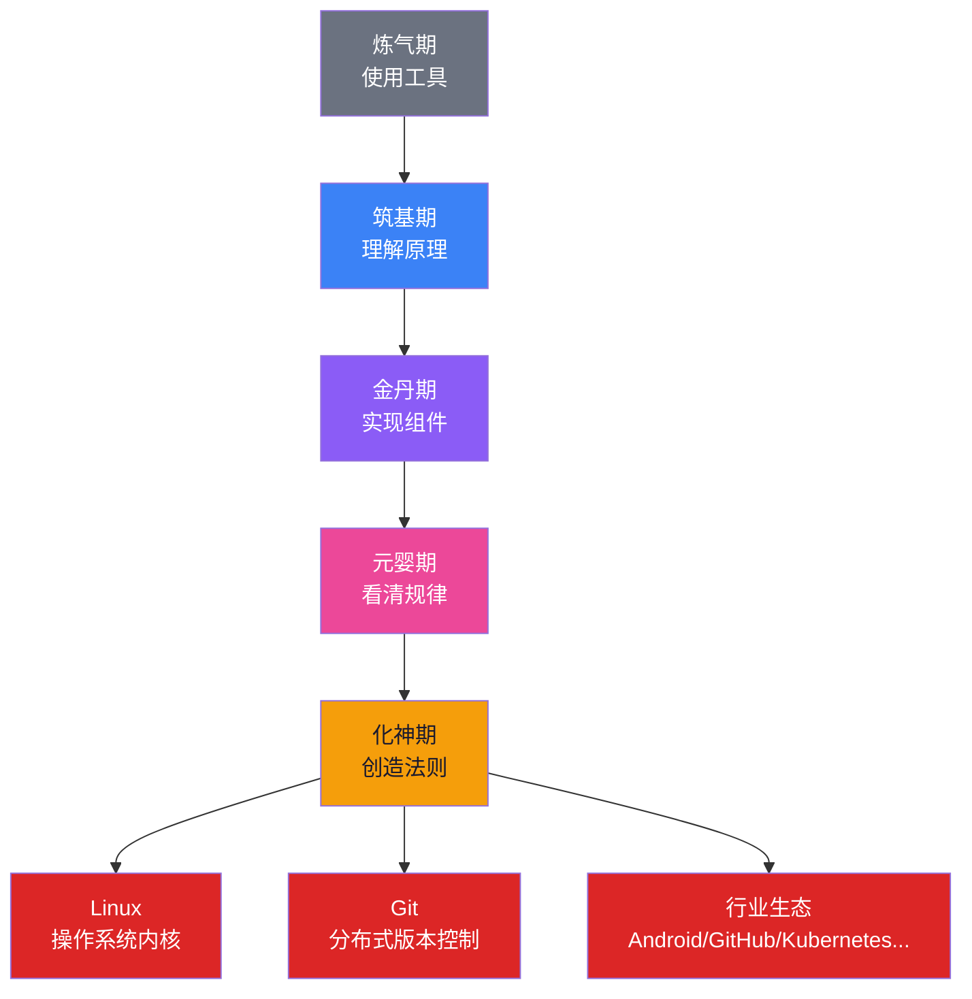
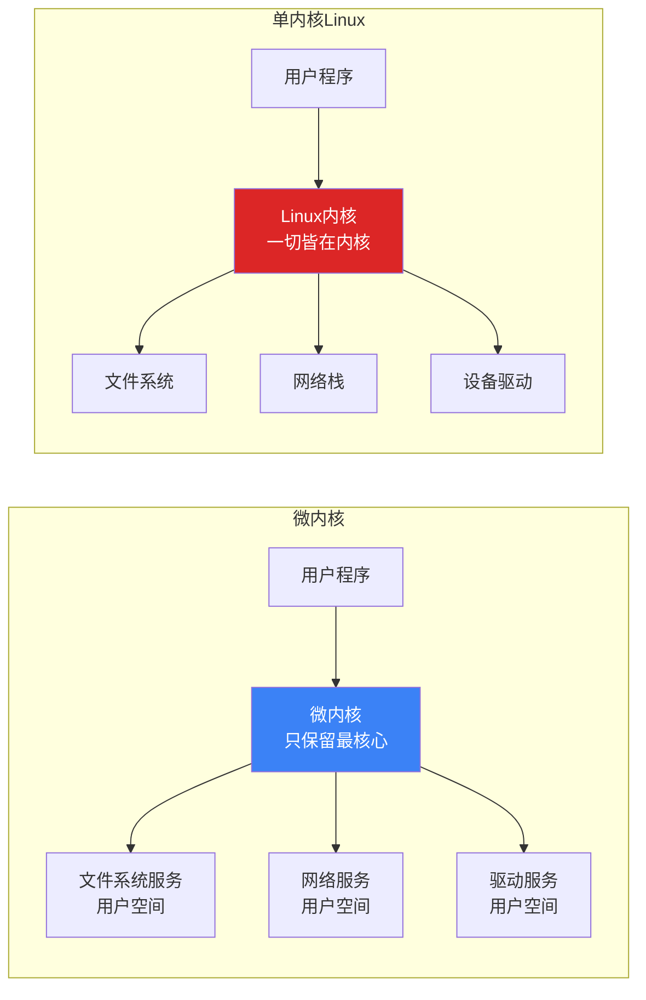
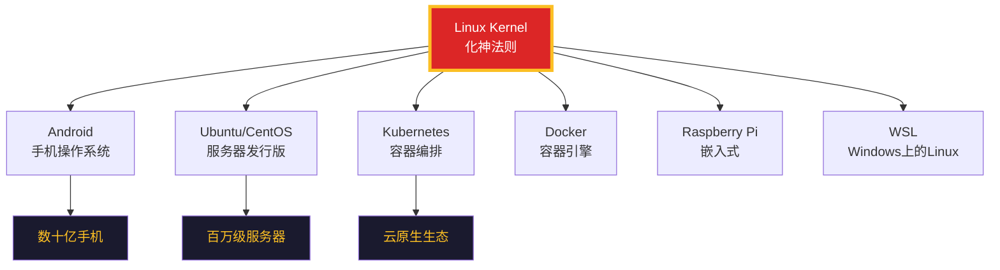
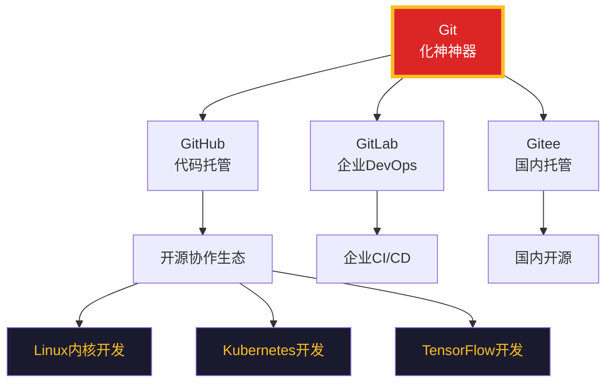
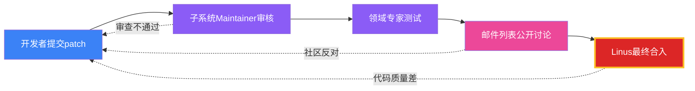
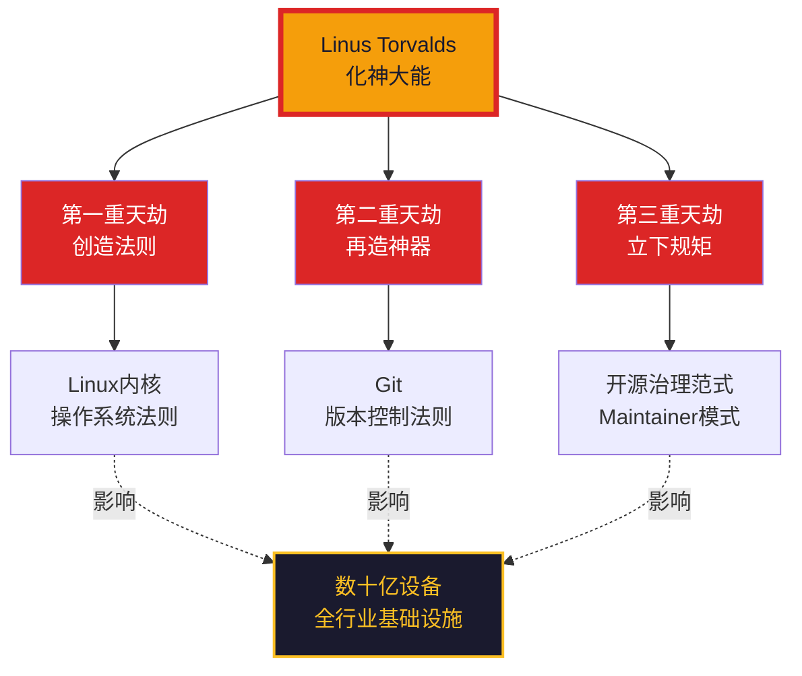

# 【化神·122】Linus为什么是化神大能

> **码农修仙传 · 化神期 · 第22篇**
> 我是玄芯散人，带你从炼气修到大乘。

---

```
╔══════════════════════════════════════╗
║     化神期 · 第22篇                  ║
║     Linus为什么是化神大能             ║
║     预计阅读：12分钟                  ║
╚══════════════════════════════════════╝
```

---

## 修仙引入

修真界有一个传闻：谁若能造出天地法则，谁就是化神大能。

绝大多数修士终其一生，都在"用"前人制定的规则——用 C 语言写程序，用 POSIX 接口调系统，用 Git 提交代码。但总有那么一两个异类，他们不安于"用"，他们要"造"。他们亲手劈开混沌，把自己的道写进天地规则，让后人沿用千年。

Linus Torvalds 就是这样一个异类。

21 岁那年，他觉得手里的 MINIX 不顺手，于是自己写了一个操作系统内核——**Linux**。三十多年后，从手机到火箭，从云服务器到超级计算机，全世界数以十亿计的设备跑着他的代码。2005 年，他觉得市面上的版本控制工具都太烂，于是花两周时间写了 **Git**——现在这个星球上几乎每个开发者都在用它。

他不是在解决问题，他是在**定义问题**。

这一篇，我们就来拆解这位化神大能的道与术：Linux 是怎么炼成的，Git 是怎么诞生的，为什么说他过了化神的三重天劫。

---

## 硬核主体

### 化神劫的本质——从"解题"到"造题"

修真体系里有一个清晰的进阶逻辑：

| 境界 | 修真状态 | 技术对应 |
|------|---------|---------|
| 炼气期 | 能用法器 | 会调用 API |
| 筑基期 | 懂功法原理 | 理解计算机原理 |
| 金丹期 | 自创小法术 | 能写框架组件 |
| 元婴期 | 神识外放，看到天地法则运行 | 看得见底层规律 |
| 化神期 | 创造天地法则，让后人沿用 | 发明工具/系统，定义行业范式 |

注意化神期和元婴期的本质区别：元婴期是"看清"，化神期是"创造"。

你写了一个好用的库——金丹期。
你设计了一个改变编程范式的框架——元婴期。
你创造了一个工具，让整个行业围绕它重建生态——**化神期**。

Linus 一个人造出了两个这样的工具。这在修真界，相当于一劫连渡两重，化神期中的大能。

看一张化神期的"创造链"图，理解从解题到造题的跃迁：



颜色从冷到暖（蓝→紫→红→金），对应修真境界的跃迁。金色是化神期——能"创造"出被亿万人沿用的法则，就是金色。

---

### 第一重天劫：Linux 的诞生——21 岁那年他劈开了混沌

#### 1991 年的那封邮件

时间回到 1991 年 8 月 25 日。

一个 21 岁的芬兰赫尔辛基大学计算机系学生，在 Usenet 新闻组 comp.os.minix 上发了一封不起眼的邮件：

```
From: torvalds@klaava.Helsinki.FT (Linus Benedict Torvalds)
Newsgroups: comp.os.minix
Subject: What would you like to see most in minix?

Hello everybody out there using minix —

I'm doing a (free) operating system (just a hobby, won't be big and 
professional like gnu) for 386(486) AT clones...
```

这封邮件的语气谦逊得近乎"业余爱好者"——他甚至写明"just a hobby"（只是业余爱好），"won't be big and professional"（不会做得很大或很专业）。他最初的目的卑微得可笑：只是想给自己的 386 电脑写个能跑起来的操作系统，因为 MINIX 太受限制。

但就是这个"业余爱好"，三十多年后跑在了：

- 全世界 96% 以上的公有云服务器（AWS、Azure、GCP）
- 99% 的智能手机（Android = Linux kernel）
- 全部 TOP500 超级计算机
- 物联网设备、路由器、智能电视、嵌入式设备……

一个"业余爱好"，撬动了整个计算机产业。这就是化神大能的标志：**你随手种下的种子，长成了后人无法绕开的参天大树**。

#### Linux 的设计哲学：道法自然，简洁至上

Linus 写 Linux 内核时，有几个核心设计原则贯彻始终。这不是他事后总结的，是写第一行代码就坚守的：

**原则一：KISS —— Keep It Simple, Stupid**

```c
// Linux内核代码的典型风格（简化示例）
// 来自kernel/sched/fair.c：调度器核心逻辑
static void check_preempt_tick(struct cfs_rq *cfs_rq, struct sched_entity *curr)
{
    /*
     * 注释里直接写"if you don't know why this works, don't touch it"
     * ——Linus风格的代码：核心逻辑直白，宁可啰嗦也不要"聪明"
     */
    if (cfs_rq->nr_running > 1) {
        // 简单的判断，没有花哨的优化
        // 因为调度器每一纳秒都跑几十亿次，简单就是性能
    }
}
```

Linux 内核有 3000 万行代码，但每一段都遵循一个原则：能简单，绝不复杂。Linus 多次在邮件列表里驳回"看起来很聪明"的代码——因为真正聪明的代码是不需要聪明才能看懂的。

**原则二：单内核架构（Monolithic Kernel）**

这是 Linux 当年和 MINIX 的核心分歧。MINIX 走的是微内核路线（microkernel），把尽可能多的功能放到用户空间。Linus 选择单内核——所有功能都在内核态，性能优先。



单内核的劣势是稳定性差（一个驱动崩了整个系统崩），优势是性能极高。Linus 用"实用主义"压倒了"理论优雅"——这就是**化神期的工程师思维：不被理论束缚，只解决真问题**。

**原则三：开源 + GPL —— 把道传给所有人**

Linux 采用 GPLv2 许可证发布。这是 Eric Raymond 那篇著名的《大教堂与集市》在工程上的实践：

| 模式 | 比喻 | 效果 |
|------|------|------|
| 大教堂模式 | 封闭研发，少数天才精心雕琢 | Windows / 商业闭源软件 |
| 集市模式 | 公开代码，全球开发者共建 | Linux / 开源软件 |

Linus 不是开源的发明者，但他是第一个用工程实践证明了"集市比大教堂更好"的人。Linux 的成功让整个行业意识到：开放协作可以做出比任何单一公司都更好的基础设施。这是对整个软件产业的重定义。

#### Linux 的"化神"力量：定义了什么？

Linux 不只是一个操作系统内核，它定义了整个云时代的游戏规则：



中心那个红框节点，就是 Linux 内核。所有这些生态的根，都是 Linus 当年在赫尔辛基敲下的代码——你不直接教每一个弟子，但定义了后人沿用的法则。

---

### 第二重天劫：Git 的诞生——10 天炼化神器

如果说 Linux 是 Linus 的第一道化神劫，Git 就是他的第二道——而且这两道劫几乎是同时劈下来的。

#### 2005 年的 Linux 内核管理危机

2005 年之前，Linux 内核开发用的是 **BitKeeper**——一款分布式版本控制系统。它很好用，但它是商业软件，开发者持有特殊的免费许可证。2005 年，BitKeeper 的母公司 BitMover 收回了这个免费授权——因为 Linux 社区有人试图逆向工程它。

这一下子，Linux 内核的协作工具没了。

全世界盯着 Linus 看：你是用 CVS？还是 SVN？还是 Mercurial？

Linus 的选择：自己写一个。

#### 10 天，一个分布式版本控制系统

2005 年 4 月，Linus 开始动手写 Git。他给自己的设计目标：

1. 速度——内核每天有上千次提交，工具必须快
2. 简单的设计——不要花哨的 feature
3. 分布式——每个人都可以离线完整地保存整个项目历史
4. 强力支持非线性开发——成千上万个并行分支
5. 完全分布式——不需要中央服务器

10 天后，他把 Git 交给了社区维护者 Junio Hamano。下面是 Git 内部最核心的设计——**内容寻址存储（content-addressable storage）**：

```python
# Git 对象存储的简化模型（Python伪代码）
import hashlib

def git_hash_object(content: bytes) -> str:
    """
    Git 用SHA-1哈希对象内容作为唯一标识，把对象的"身份"绑定到它的"内容"。
    """
    header = f"blob {len(content)}\0".encode()
    full = header + content
    return hashlib.sha1(full).hexdigest()  # 40位哈希,内容变了ID就变

def git_store_blob(content: bytes):
    """每个文件内容都是一个blob对象,由内容决定ID"""
    oid = git_hash_object(content)
    # 写入 .git/objects/xx/yyyy... 目录
    return oid

# Git 保证历史不可篡改的原理:
# 只要文件内容变了一字节,哈希就变,所有引用它的commit都会失效
# 用数学规律保证规则不可绕过
```

Git 的核心设计：把"内容"作为"身份"。CVS 和 SVN 用文件名加版本号标识文件，你可以改内容不改版本。Git 用内容哈希标识文件——内容变了，ID 必然变，历史不可伪造。

这是 Linus 把对分布式系统和密码学哈希的理解，凝固成了一行 `hashlib.sha1()`。他用这种设计，把 BitKeeper 留下的空缺填上了，而且填得比任何商业软件都更彻底。

#### 现在的 Git 生态



GitHub 上 4 亿开发者账户，全球 99% 的开源项目用 Git 管理。Linus 当年为了解决自己的痛点随手写的工具，变成了软件开发的"普通话"，变成了行业基础。

---

### 第三重天劫：Linus 的领导之道——他定义了开源治理

Linux 内核有 3000 万行代码，由全球 4000 多位开发者协作贡献，没有公司，没有产品经理，没有 KPI。这种规模的协作竟然能稳定运行 30 多年，靠的不是流程，而是 Linus 立下的几条"修真规矩"。

#### 规矩一：Talk is cheap. Show me the code.

这是 Linus 最著名的一句话，刻在无数开源项目的 README 里：

> "Talk is cheap. Show me the code." ——嘴炮没用，给我看代码。

翻译成修真界的语言：嘴上论道千遍，不如一剑破空。你可以说你的设计多好、架构多优雅、想法多前瞻——但如果你不能写出来，这些话就是废话。Linus 用这条规矩，把"嘴炮型贡献者"挡在了门外。

#### 规矩二：代码质量由 Maintainer 负责

Linux 内核的贡献不是开放注册制——你写了 patch，要过几道关：



每一层都是一道劫，只有最强的代码才能渡到 Linus 这一关。你做的不是"管理"，你立的是"道"。你的标准决定整个生态的标准。

#### 规矩三：宁缺毋滥

Linus 公开拒绝过无数次的 patch——哪怕是来自红帽、IBM、Intel 这种巨头的。他不在乎你是谁，只在乎代码好不好。他曾经在 LKML（Linus Kernel Mailing List）上对 NVIDIA 喊话：

> "So I say: 'NVIDIA, fuck you.' ... I don't think you should keep developing that proprietary shit."

这不是性格暴躁——这是化神大能的态度。我的道不容沙子。 你可以说我粗暴，但你没法说我没原则。这种"宁为玉碎不为瓦全"的态度，反而吸引了一批真正相信开源精神的人聚集。

#### 规矩四：Maintainer 继承制

Linus 不会永远是 Linux 内核的"掌门人"。他培养了一批子系统 maintainer（子系统维护者），每个 maintainer 负责一个领域（网络、文件系统、调度器……）。当 Linus 决定退出时，这些 maintainer 会接任。

Git 也是如此：Linus 写完第一版就交给了 Junio Hamano。这种道统传承的自觉——知道自己终究会老去，把道传给下一代——是真正的大能格局。

---

### 为什么他是化神大能——三重天劫的真相

回过头来看 Linus 渡过的三重天劫，每一重都对应化神期的一道关口：

**第一重：创造法则（Linux）**
化神大能的标志之一是创造全新的领域。Linux 之前，没有"开源操作系统内核"这件事；Linux 之后，所有软件基础设施都基于开源内核。他定义了一个时代的基础设施。

**第二重：再造神器（Git）**
化神大能的标志之二是再造一个工具，重新定义玩法。BitKeeper 死了，Git 诞生——他没有用别人的工具，他直接造了一个更好的。能造一次的人，注定能造第二次。

**第三重：立下规矩（社区治理）**
化神大能的标志之三是立下后人沿用的规矩。Linux 社区的"邮件列表 + Maintainer + Linus 终审"模式，被无数开源项目效仿。他不是"管理"了一个社区，他定义了一种治理范式。



三劫全渡，道成——Linus 凭此坐稳化神大能位子。

---

### 普通开发者能从 Linus 学到什么？

不是人人能成化神大能——但化神期修士的"道"，是每个元婴期都该学的。

#### 学一：解决问题之前，先判断问题值不值得解

Linus 写 Linux 之前，市面上有 MINIX、有 GNU Hurd、有各种学术操作系统。他没有去改进其中一个，他重新写了一个。为什么？因为他判断现有的设计都不对——MINIX 太学院派、Hurd 难产 30 年、BSD 有许可证问题。

> 元婴期修士最容易犯的错：接了一个烂需求，然后努力把它实现得很好。
> 化神期修士会先问：这个问题本身存在吗？该不该存在？存在的话是不是应该有更好的形态？

#### 学二：能造就不修

Linus 从来不"修补"工具——他直接造新的。BitKeeper 不让用？写 Git。性能分析工具太烂？写 perf。版本控制不够用？写 Git。

这种"造"的偏好，源于他对"工具塑造思维"的深刻理解。你的工具决定了你思考问题的边界。烂工具会把你困在烂问题里，好工具会让你看到更远的路。

#### 学三：你的标准决定你的道统

Linus 拒绝过无数次合并请求，其中不乏来自世界顶级公司的 patch。他守住了"代码质量必须够好"这条底线——结果 Linux 内核成了质量最高、稳定性最强的开源操作系统。

> 你守住的每一个标准，都是在为你的"道统"立规矩。
> 你放过的每一个烂代码，都是在污染你未来的修真环境。

---

## 修仙术语对照表

| 修仙术语 | 技术现实 | 本篇详解 |
|---------|---------|---------|
| 化神期 | 从"解题"到"造题"，创造被后人沿用的工具/系统 | ✅ 全篇主线 |
| 化神劫 | 创造领域级工具所经历的考验 | §三重天劫 |
| 创造法则 | 发明新工具/新系统/新范式 | §Linux / §Git |
| 道统传承 | 开源社区的 Maintainer 继承制 | §规矩四 |
| 单内核架构 | Linux 选择的 Monolithic Kernel 设计 | §设计哲学 |
| 微内核架构 | MINIX 等采用的 Microkernel 设计 | §设计哲学 |
| 内容寻址存储 | Git 用 SHA-1 哈希标识对象 | §Git 诞生 |
| 大教堂与集市 | 开源 vs 闭源两种开发模式 | §Linux 设计哲学 |
| Maintainer 模式 | Linux 内核的子系统维护者治理结构 | §规矩二/三 |
| Talk is cheap | 代码质量高于一切口头讨论 | §规矩一 |
| GPL 许可证 | Linux 选用的开源许可证 | §设计哲学 |

---

## 突破条件

从元婴期 → 化神期，是修真路上最难的一道关。Linus 用他的经历给了我们三个标志：

- [ ] 创造过被业界广泛使用的工具——不是你个人的项目，是别人离不开的工具
- [ ] 能定义一个新问题，而不是只在老问题上迭代——你定义了玩法，而不是参与玩法
- [ ] 立下了后人愿意沿用的规矩/范式——你的标准成为行业的标准

> 化神期不靠堆年限，靠"造物"。
> 别人用你的工具，按你的范式思考，沿你立的规矩开发——你才真正进入化神期。

达成这三条，你就叩开了化神期的大门。下一篇，我们来拆解 Linus 的另一面：从写代码到造语言——化神期修士如何从"实现"跃迁到"定义语法"。

---

## 下期预告 + 互动

> 下一篇：【化神·23】从写代码到造语言
>
> 为什么创造编程语言是化神期的"造物神功"？
> 一门新语言从构想到上线，要渡几道劫？
> 23 篇带你拆解：Lisp、Python、Go、Rust 的设计者们是怎么定义"语法"的。

现在问你：

> 🎮 修真自测：你用 Git 多久了？你知道 Git 是怎么诞生的吗？
>
> 💬 话题：你心中还有谁是"化神大能"？Linus、Dennis Ritchie、Ken Thompson、Guido van Rossum、Bjarne Stroustrup……评论区提名你心中的化神期代表人物！
>
> 🔔 关注玄芯散人，修炼不迷路。下一篇讲"造语言"的修真之道。

> 我是玄芯散人，带你从炼气修到大乘。

---

*本文是「码农修仙传」系列第122篇。系列导航见 [xren.ren](https://xren.ren)*