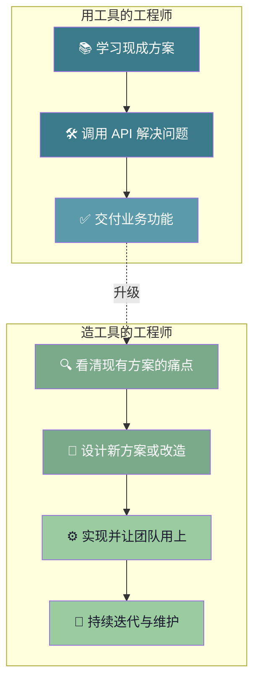
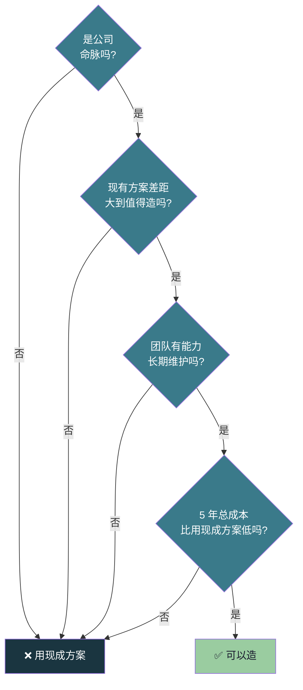

# 【化神·123】化神期是什么：从用工具到造工具

> 码农修仙传 · 化神期 · 第123篇
> 我是玄芯散人，带你从炼气修到大乘。

---

## 境界标识

```
╔══════════════════════════════════╗
║     化神期 · 第123篇             ║
║     从用工具到造工具             ║
║     化神画像 / 造轮子的取舍       ║
║     预计阅读：18 分钟            ║
╚══════════════════════════════════╝
```

---

## 修仙引入

修真界里有一句流传很广的口诀：炼气期借力，筑基期通理，金丹期悟法，元婴期御器，化神期造物。

前面四个境界，弟子都在解决一个共同的问题，把现成的灵器用得更好。元婴期 120 篇毕业考核里，弟子能独立炼出一件下品法宝，但炼的是宗门图纸上已有的法宝。化神期不一样，化神期弟子要回答一个新问题：图纸是哪里来的？

修真比喻：化神期弟子不再是借灵器御敌的修士，而是能铸灵器也能补灵器改灵器的炼器师。铸器的第一步不是摆炉子，是想清楚这块铁该不该打。

这一篇讲三件事：化神期工程师到底长什么样，什么时候该造轮子，什么时候不该造，造轮子的取舍标准是什么。

---

## 硬核主体

### 化神期的画像，使用者变成创造者

修真界里前面四个境界的共同点是用。化神期的标志是造。

元婴期弟子熟读 HAL 库文档，能调 SPI 时序，能用示波器抓波形。这一切的前提是 HAL 库已经存在。化神期弟子要做的事往前推一步：HAL 库是怎么来的？SPI 协议是谁定的？STM32 的芯片手册是谁写的？

这听起来像是哲学问题，但修真界里有一个非常具体的判断标准。化神期弟子看到任何工具，第一反应是「这工具解决什么问题」，而不是「这工具怎么用」。

用工具的人想的是「我要传 `&huart1` 给 `HAL_UART_Transmit`」。造工具的人想的是「为什么是 `HAL_UART_Transmit` 而不是 `uart_send`？为什么参数顺序是 `(huart, data, size, timeout)` 而不是别的？」。

差别在哪？差别在视角。用工具的人看到的是眼前这个 API。造工具的人看到的是 API 背后那个设计者的取舍。这两者的距离，就是元婴期到化神期的距离。

修真比喻：化神期弟子看到 `printf("Hello\n")`，会想「为什么 C 语言把字符串输出函数叫 `printf` 而不是 `print`？为什么格式串是第一个参数而不是第二个？`%d` 和 `%s` 的设计哲学是什么？」这些问题的答案都不是 C 语言本身告诉你的，是设计者丹尼斯·里奇在 1972 年的某个深夜想清楚的。化神期弟子开始关心这些想清楚的过程。

### 用工具与造工具，两种工程师的边界

修真界里把两种工程师的区别画成一张图：



图里两条路径的区别不是技术难度，是看问题的视角。用工具的工程师关心怎么把这个功能跑起来。造工具的工程师关心为什么是这种功能而不是另一种。

修真比喻：修真界里用灵器的弟子关心这把剑怎么挥，铸灵器的弟子关心这把剑为什么是这个形状。前者是术，后者是道。

但这里有个前提，化神期弟子必须先是把剑挥得很好的弟子。如果连 `HAL_UART_Transmit` 都调不通，压根谈不上「`HAL_UART_Transmit` 设计得对不对」。这就是为什么化神期是元婴期之后才能进的境界，造物的功夫是建立在用物之上的。

### 什么时候该造轮子，四种正当理由

修真界里把「该不该造轮子」列为化神期第一考题。题目没有标准答案，但有四个正当理由可以造。

第一种是学习目的。「写一个玩具 X」是化神期最快的学习路径。想理解编译器，那就写一个。想理解数据库，那就写一个。想理解操作系统，那就写一个。这里的「写一个」是要造出 80 行的玩具版本。21 篇里我们用 80 行 Python 写了一个 mini 解释器，这就是典型的学习性造轮子。轮子本身不那么要紧，写轮子的过程让大脑被迫理解每一个细节。

第二种是没有现成方案。某些领域里现成方案真的不存在，或者存在但有合规上的问题或者授权上的问题。比如某些医疗或军工或金融领域，对软件的审计要求极高，无法依赖第三方闭源方案。这时候公司必须自己造。这种造轮子是被现实逼出来的，不是技术偏好。

第三种是需要定制。现有方案能用，但用起来非常别扭，要绕很多弯才能解决自己的问题。比如某个开源数据库的性能差 30%，改源码比绕过去还便宜。比如某个框架的抽象和业务模型对不上，每次写业务代码都要先翻译一遍。这种情况下改造比使用更划算。

第四种是战略差异化。技术本身是公司的命脉。Google 内部从 2003 年开始用 Borg 管理集群调度（比 Kubernetes 早十年），核心原因是 Borg 的规模是百万级节点级别，外部方案的投入和定制深度都达不到。这是商业战略驱动的造轮子，不是技术偏好。Meta 造 HHVM 是因为 Facebook 的所有页面都跑在 PHP 上，性能每改进 10% 都是广告收入。后来 Meta 部分回落到 PHP-FPM 路线，证明当年坚持造 HHVM 有对的一面，但也不能沉迷自研，要随时准备替换。

修真比喻：修真界里这四种正当理由对应四种情况。学习目的是弟子为了悟道造一把木剑练手。没有现成方案是宗门禁地里没有现成灵器可用。需要定制是宗门灵器不合手，弟子改一改。战略差异化是这件法宝是宗门的镇宗之宝，外人不可靠，只能自己铸。

### 什么时候不该造轮子，四个反面案例

修真界里有四种情况，造轮子是赔本买卖。

第一种，能买就买。大部分业务公司的头号问题，是把业务做出来。一家电商公司花两年造数据库，数据库没造出来，业务机会窗口期已经过了。这时候应该用 PostgreSQL，用 MySQL，用云厂商的 RDS。「能用就别造」是修真界里的一条铁律。

第二种，维护成本。软件不是写完就完了，是要持续维护的。用开源项目，bug 是社区修的，安全补丁是社区推的。自己造的项目，bug 是自己修的，安全补丁也是自己修的。一个 5 人团队维护一个内部造的 RPC 框架，相当于这 5 人永远不能转去做业务功能。化神期弟子必须算清楚这笔账。

第三种，团队能力撑不起。工业级轮子的复杂度远超想象。一个生产级数据库要考虑并发问题，也要考虑崩溃恢复，也要考虑备份，也要考虑主从同步，也要考虑监控，还要考虑运维工具链。能写出这些的人，整个行业都稀缺。一个普通创业团队想造自己的数据库，结果大概率是做出一个半成品，还不如用 PostgreSQL。

第四种，造轮子的冲动来自 NIH 综合症。NIH 是 Not Invented Here 的缩写。NIH 患者看到任何外部方案都觉得不如自己造。这种心理非常普遍，也非常危险。NIH 患者的项目往往维护成本极高，质量却比不上成熟的开源方案，最终成为公司技术债的源头。

修真比喻：修真界里 NIH 患者是看到别人的法宝就想自己重铸一份的弟子。这种弟子往往把自己的精力耗在了炼器上，修为却没有寸进。化神期弟子的标志之一是能识别自己是不是 NIH 了。

### 造轮子的决策框架，四个问题

修真界里化神期弟子要不要造轮子，问自己四个问题。

问题一，是公司命脉吗？技术不是公司的命脉，就不要造。电商公司的命脉是供应链和流量，不是数据库。造数据库对电商公司是负资产。

问题二，现有方案差距大到值得造吗？如果现有方案 70 分，自己造能到 90 分，那 20 分的差距值得造。如果现有方案已经 95 分，自己造只能到 96 分，那 1 分的差距不值得造。

问题三，团队有能力维护吗？造出来只是开始，维护 5 年、10 年才是真正的考验。团队 5 个人，没有分布式系统专家，那就别造分布式数据库。

问题四，长期成本可控吗？算清楚未来 5 年的总成本，把开发成本一项一项列出来。维护成本也要单独算。再算上人员流动的交接成本和文档成本，最后算上培训成本。最终对比用现成方案的总成本，看哪个更低。

修真比喻：修真界里这四个问题是弟子铸器前的四问。问完还不确定要不要铸，那就先不铸。等问题更清楚了再铸，比急着铸强。



这张图是修真界里化神弟子的铸器四问。四个问题任何一个答否，就直接放弃造轮子。只有四个都答是，才值得动手。

### 化神期的能力模型，三层功夫

化神期弟子的功夫分三层，对应三种不同层面的"造"。

第一层是读源码。能读懂至少一门主流开源项目的源码。看 CPython 的 `ceval.c` 知道 Python 解释器怎么跑，看 V8 的 `Ignition` 知道 JavaScript 怎么执行，看 Linux 的 `sched.c` 知道进程怎么调度。读源码不是读懂每一行，是读懂作者在解决什么问题，用了什么思路，做了哪些权衡。

第二层是写框架。能从零写一个解决特定问题的小框架。可以是内部的 RPC 框架，也可以是配置框架或者 ORM 框架。写出来不是终点，是让团队用上和迭代，并且维护三五年，才是真正的化神功夫。

第三层是做架构决策。能在多个方案中做取舍。PostgreSQL 还是 MySQL？Go 还是 Rust？自建还是上云？这些决策没有标准答案，化神期弟子的作用在于能讲清楚为什么选这个不选那个，能为决策负责，能在决策错了之后及时调整。

修真比喻：修真界里这三层功夫对应三种弟子。第一层是能看懂丹方的弟子，第二层是自己开丹方的弟子，第三层是决定全宗弟子吃什么丹的弟子。第三层最难，因为决策的波及范围远超个人。

### 化神期的修炼地图，四组功夫的视野

化神期共三十篇（121 到 150），按造工具的层级分四组（详细分篇见 120 毕业篇）。123 这一篇不展开分篇地图，只点四组的视野层级：

第一组语言与编译造最底层的工具，也就是语言本身和编译器。编译器是化神期第一座山，因为它是软件工具链的源头。

第二组 OS 与存储造中间层的工具，包括操作系统和数据库引擎。这两类工具是所有业务系统的底层依赖。

第三组分布式与开源看上层工具，包括分布式协调和服务发现，也包括开源社区的治理模式。

第四组架构与工程是化神期的顶层功夫。这一组包括架构模式，也包括技术债和 Code Review，还要看工程效能。

四组的顺序是按造物的层级排的：先造语言（最底层），再造操作系统和数据库（中间层），再看分布式和开源（上层），最后做架构和工程（顶层）。化神期毕业的标准是能设计一整套系统，比元婴期毕业标准又上一阶。

---

## 修仙术语对照表

| 修仙术语 | 技术现实 | 本篇位置 |
|---------|---------|---------|
| 化神期 | 使用者变成创造者 | §化神期的特征 |
| 造物者 | 设计语言与框架和系统的工程师 | §化神期的特征 |
| 用灵器与铸灵器 | 用工具与造工具 | §用工具与造工具 |
| 铸器前的四问 | 造轮子决策框架 | §决策框架 |
| 弟子为了悟道造木剑 | 学习目的的造轮子 | §该造的理由 |
| 宗门禁地无现成灵器 | 没有现成方案 | §该造的理由 |
| 宗门灵器不合手 | 需要定制 | §该造的理由 |
| 镇宗之宝外人不可靠 | 战略差异化 | §该造的理由 |
| 能用就别造 | 能买就买 | §不该造的理由 |
| 弟子把精力耗在炼器上 | NIH 综合症 | §不该造的理由 |
| 看懂丹方 | 读源码能力 | §能力模型 |
| 自己开丹方 | 写框架能力 | §能力模型 |
| 决定全宗弟子吃什么丹 | 架构决策能力 | §能力模型 |
| 铸器许可证 | 造轮子的资格 | §决策框架 |
| 修真界铸器四问 | 造轮子四问题 | §决策框架 |
| 整套系统设计能力 | 化神期毕业标准 | §修炼路线 |

---

## 进阶条件

修真界里化神期弟子的进阶条件比元婴期更看重思维转变。具体六条：

- [ ] 看到任何工具能立刻讲出它解决什么问题，而不是它怎么用
- [ ] 能从零写出一个 80-100 行级别的玩具编译器或解释器（参考 121 篇的 mini 解释器）
- [ ] 能在自建与用开源的决策中讲清楚四个判断问题（命脉/差距/能力/成本）的答案
- [ ] 读过 CPython 或 V8 或 Linux Kernel 中至少一个项目的主干模块源码
- [ ] 能识别 NIH 综合症，能在自己想造轮子的冲动中识别出这是真正的需求，还是 NIH
- [ ] 在自己工作领域至少造过一个被团队用上三个月以上的小工具

最后一条是分水岭。造一个被团队用上的工具，比造一个孤芳自赏的轮子难十倍。能让别人用上你的工具，才是真正的化神功夫。

六条全勾，你就能跨入化神期的下一阶段。后面的 124 讲框架设计，125 讲从代码到造语言，126 讲操作系统是怎么炼成的，127 讲编译器总览，128 到 132 讲词法/语法/语义/代码生成/优化，133 到 140 讲数据库和操作系统，141 到 150 讲分布式与开源。化神期每一座山都比元婴期高，但弟子每翻过一座，眼界就宽一寸。

---

## 下期预告 + 互动

下一篇：【化神·124】框架设计的道与术（已有旧文）。

接下来要新写的下一篇：【化神·127】编译器是怎么造出来的：总览。这一篇拆开编译器的整套架构，分别讲前端和后端的差异，对比 LLVM 和 GCC 的设计思路。想知道 `gcc main.c` 这一行命令背后发生了什么，127 给你答案。

现在问你：

> 🎮 造轮子自测：在你现在的项目里，你是否曾经想造一个轮子但被「能买就买」拦下来？那个轮子后来是用现成方案还是自己造了？

> 💬 话题：你见过的最离谱的不该造但造了的轮子是什么？在评论区讲讲那个项目的结局。

> 🔔 关注玄芯散人，修炼不迷路。下一篇带你拆编译器架构。`gcc` 这一行命令背后有几百万行代码。

我是玄芯散人，带你从炼气修到大乘。

---

*本文是「码农修仙传」系列第123篇。系列导航见 [xren.ren](https://xren.ren)*