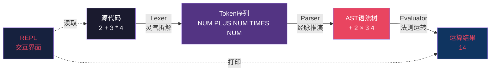
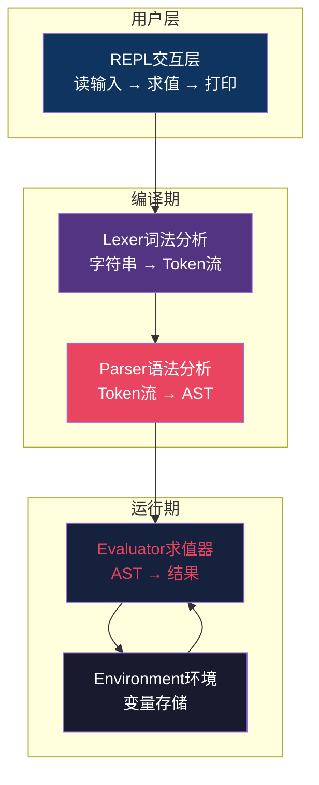

# 【化神·125】从写代码到造语言

> **码农修仙传 · 化神期 · 第23篇**
> 我是玄芯散人，带你从炼气修到大乘。

---

## 境界标识

```
╔══════════════════════════════════╗
║     化神期 · 第23篇               ║
║     从写代码到造语言               ║
║     预计阅读：12分钟              ║
╚══════════════════════════════════╝
```

---

## 修仙引入

你用 Python 写过爬虫，用 JavaScript 写过网页，用 C 写过单片机程序——但你从未**造过**一门语言。

化神期最爽的一刻，就是你亲手写出一个能跑 `2 + 3 * 4` 的小程序。那一刻你不再是某个语言的**使用者**，你是这门迷你语言的**造物主**——天道法则由你书写，灵气流转由你定义。

今天这篇，就带你从零写一个能算加减乘除、带变量的解释器。写完之后，你就跨过了"程序使用者"到"语言创造者"的那道天堑。

---

## 硬核主体

### 化神第一劫：什么是"编程语言"？

在动手造语言之前，必须先看穿语言的本质。

**所有编程语言，干的都是同一件事——把字符串变成动作。**

你写 `print("hello")`，看起来 Python 在"运行代码"，其实它干的是：

```
"print(\"hello\")" → [拆词] → [理解语法] → [执行动作]
```

三个步骤，对应三个组件：

| 步骤 | 修仙术语 | 技术组件 | 干啥的 |
|------|---------|---------|--------|
| 拆词 | 灵气拆解 | **Lexer**（词法分析器） | 把 `2 + 3 * 4` 拆成 `[2, +, 3, *, 4]` |
| 理解语法 | 经脉推演 | **Parser**（语法分析器） | 把拆好的词拼成树形结构（AST） |
| 执行动作 | 法则运转 | **Evaluator**（求值器） | 遍历树，算出结果 `14` |

还有一个常被忽略但极其重要的第四组件：**REPL**（Read-Eval-Print Loop，交互式解释器）——就是你在 Python 里敲一行、出一行结果的那种交互界面。它让语言"活"起来。



**这就是解释器的全部秘密。** 任何语言——Python、JavaScript、Lua——核心都是这四件套，只是细节繁复程度天差地别。今天我们造个迷你版，把这四件套全部跑通。

---

### 化神第二劫：四层架构一图说清

先放出完整架构图，再逐层实现。这样你能在心里先有"全貌"，不会被代码细节淹没。



注意几个关键点：

- Lexer 和 Parser 是编译期（输入是死的字符串，输出是死的树）
- Evaluator 和 Environment 是运行期（树在这里被"激活"，灵气真正流转）
- **Environment（环境）** 是保存变量的地方，类似一个字典 `{"x": 10}`
- REPL 把四层粘在一起，给用户即时反馈

接下来我们就一层一层造。

---

### 化神第三劫：动手实现——30 行搞定 Lexer

Lexer 的活儿最简单：把字符串切成 token。token 是语言的"原子"，有类型（数字、运算符、变量名）和值。

```python
# === Lexer：把字符串切成 token（灵气拆解） ===
import re

TOKEN_PATTERNS = [
    ('NUMBER',   r'\d+'),       # 数字：123
    ('IDENT',    r'[a-zA-Z_]\w*'),  # 标识符：x, foo, score
    ('PLUS',     r'\+'),        # 加号
    ('MINUS',    r'-'),         # 减号
    ('TIMES',    r'\*'),        # 乘号
    ('DIVIDE',   r'/'),         # 除号
    ('ASSIGN',   r'='),         # 赋值符
    ('LPAREN',   r'\('),        # 左括号
    ('RPAREN',   r'\)'),        # 右括号
    ('SKIP',     r'[ \t]+'),    # 跳过空格
    ('NEWLINE',  r'\n'),        # 换行（一行一条语句）
]

def lex(code):
    """灵气拆解：源码 → token流"""
    tokens = []
    while code:  # 一边切一边往前走
        for name, pattern in TOKEN_PATTERNS:
            match = re.match(pattern, code)  # 尝试匹配头部
            if match:
                text = match.group(0)
                if name != 'SKIP':  # 空格不要
                    tokens.append((name, text))  # 把token加入队列
                code = code[len(text):]  # 切掉已识别部分，继续往后
                break
        else:
            raise SyntaxError(f"无法识别的字符: {code[0]}")
    return tokens

# 测试一下
print(lex("x = 2 + 3 * 4"))
# 输出：[('IDENT', 'x'), ('ASSIGN', '='), ('NUMBER', '2'), ('PLUS', '+'),
#       ('NUMBER', '3'), ('TIMES', '*'), ('NUMBER', '4')]
```

注意两个细节：

1. 正则匹配从前往后扫，每次只切头部一段（`re.match` 默认锚定开头）
2. 空格被 SKIP 跳过，不参与后续分析——这就是为什么语言设计者要先想清楚"哪些字符有意义"

20 行不到，Lexer 就完了。是不是觉得"造语言"没那么玄乎？ 化神大能的秘密，就是把大东西拆成小零件。

---

### 化神第四劫：Parser——把 Token 拼成树

Parser 才是核心难点。它的活儿是：识别 token 之间的层级关系，输出 AST（抽象语法树）。

为什么叫"树"？因为 `2 + 3 * 4` 里有优先级——`*` 比 `+` 先算，所以结构是：
```
 +
 / \
 2 *
 / \
 3 4
```

写成代码就是嵌套的 Python 对象：

```python
# === Parser：token流 → AST（经脉推演） ===
class BinOp:        # 二元运算节点
    def __init__(self, left, op, right):
        self.left = left
        self.op = op
        self.right = right

class Num:          # 数字节点
    def __init__(self, value):
        self.value = value

class Var:          # 变量节点
    def __init__(self, name):
        self.name = name

class Assign:       # 赋值语句
    def __init__(self, name, value):
        self.name = name
        self.value = value

# 文法规则（简化版）：
# expr   := term (('+'|'-') term)*
# term   := factor (('*'|'/') factor)*
# factor := NUMBER | IDENT | '(' expr ')'

class Parser:
    def __init__(self, tokens):
        self.tokens = tokens
        self.pos = 0

    def peek(self):
        """看一眼当前token，不消耗"""
        return self.tokens[self.pos] if self.pos < len(self.tokens) else None

    def consume(self, expected_type=None):
        """消耗当前token，可选类型校验"""
        tok = self.tokens[self.pos]
        if expected_type and tok[0] != expected_type:
            raise SyntaxError(f"期望{expected_type}，得到{tok}")
        self.pos += 1
        return tok

    def parse_expr(self):
        """expr := term (('+'|'-') term)* —— 处理加减"""
        left = self.parse_term()
        while self.peek() and self.peek()[0] in ('PLUS', 'MINUS'):
            op = self.consume()  # 吃掉 + 或 -
            right = self.parse_term()
            left = BinOp(left, op[1], right)  # 拼成新的左节点
        return left

    def parse_term(self):
        """term := factor (('*'|'/') factor)* —— 处理乘除"""
        left = self.parse_factor()
        while self.peek() and self.peek()[0] in ('TIMES', 'DIVIDE'):
            op = self.consume()
            right = self.parse_factor()
            left = BinOp(left, op[1], right)
        return left

    def parse_factor(self):
        """factor := NUMBER | IDENT | '(' expr ')'"""
        tok = self.peek()
        if tok[0] == 'NUMBER':
            self.consume()
            return Num(int(tok[1]))
        if tok[0] == 'IDENT':
            self.consume()
            return Var(tok[1])
        if tok[0] == 'LPAREN':
            self.consume('LPAREN')
            node = self.parse_expr()
            self.consume('RPAREN')  # 期待右括号
            return node
        raise SyntaxError(f"意外的token: {tok}")

    def parse_statement(self):
        """解析一行：可能是赋值（x = ...）或表达式"""
        tok = self.peek()
        if tok and tok[0] == 'IDENT' and self.tokens[self.pos+1][0] == 'ASSIGN':
            name = self.consume('IDENT')[1]
            self.consume('ASSIGN')
            value = self.parse_expr()
            return Assign(name, value)
        return self.parse_expr()  # 否则就是纯表达式
```

关键技巧叫**递归下降**——每个语法规则对应一个函数，函数互相调用。`parse_expr` 调用 `parse_term`，`parse_term` 调用 `parse_factor`，层层往下"下降"。

优先级就藏在调用顺序里：`parse_expr` 先吃加减，调用 `parse_term` 时就把乘除处理完了才返回——这天然保证了 `*` 比 `+` 先算。

---

### 化神第五劫：Evaluator——让树"活"起来

AST 只是个数据结构，不会自己算。Evaluator 负责遍历树，按规则算出结果。

```python
# === Evaluator：AST → 结果（法则运转） ===

class Evaluator:
    def __init__(self):
        self.env = {}  # 变量环境：内存小天地

    def eval(self, node):
        """根据节点类型分派求值"""
        if isinstance(node, Num):
            return node.value  # 数字节点，直接返回值

        if isinstance(node, Var):
            if node.name not in self.env:
                raise NameError(f"未定义变量: {node.name}")
            return self.env[node.name]  # 查环境表

        if isinstance(node, BinOp):
            left  = self.eval(node.left)   # 递归求左子树
            right = self.eval(node.right)  # 递归求右子树
            if   node.op == '+':  return left + right
            elif node.op == '-':  return left - right
            elif node.op == '*':  return left * right
            elif node.op == '/':  return left // right  # 整除

        if isinstance(node, Assign):
            value = self.eval(node.value)        # 先算右边
            self.env[node.name] = value           # 写入环境
            return value                          # 赋值表达式也有值

        raise ValueError(f"未知节点: {node}")
```

看到没？`BinOp` 的求值是**后序遍历**：先求左子树，再求右子树，最后算自己。这天然符合"先算操作数再算运算符"的语义。

`self.env` 这个字典就是Environment（环境）——所有变量都住在这里。`x = 10` 就是 `env['x'] = 10`，`y = x + 1` 就是 `env['y'] = env['x'] + 1`——简单得像查字典。

---

### 化神第六劫：REPL——把四件套串起来

REPL 是 Read-Eval-Print Loop 的缩写：读输入、求值、打印、循环。Python 自带 IDLE、Node 自带 REPL，都是这个套路。

```python
# === REPL：把四件套拼成完整的语言运行环境 ===
def repl():
    print("🌟 Mini-Lang REPL v0.1 (输入 exit 退出)")
    print("支持：加减乘除、变量赋值，例如 x = 2 + 3 * 4")
    evaluator = Evaluator()  # 求值器常驻，env 也跟着活下来

    while True:
        try:
            line = input(">>> ")  # Read
            if line.strip() == 'exit':
                break
            if not line.strip():
                continue
            tokens    = lex(line)              # Lex
            parser    = Parser(tokens)         # Parse
            ast       = parser.parse_statement()
            result    = evaluator.eval(ast)    # Eval
            print(f"= {result}")               # Print
        except (SyntaxError, NameError) as e:
            print(f"❌ {e}")

if __name__ == "__main__":
    repl()
```

跑一下：
```
>>> 2 + 3 * 4
= 14
>>> x = 10
= 10
>>> y = x * 2 + 1
= 21
>>> exit
```

恭喜，你刚造了一门语言。 它能算加减乘除、能赋值、能查变量——麻雀虽小，五脏俱全：Lexer / Parser / Evaluator / Environment / REPL，一个不缺。

---

### 化神第七劫：从能用到像样的路还有多远？

冷静一下，我们的 Mini-Lang 还很原始。能跑通，但距离"真语言"还有几个量级的工程：

| 维度 | 我们的现状 | 真实语言的做法 | 难度 |
|------|----------|--------------|------|
| 错误信息 | 简单字符串 | 行列号、源码高亮、智能提示 | ⭐⭐ |
| 数据类型 | 只有整数 | 浮点、字符串、布尔、列表... | ⭐⭐ |
| 控制流 | 都没有 | if/while/for/函数 | ⭐⭐⭐ |
| 函数 | 没有 | 一等公民、闭包、高阶函数 | ⭐⭐⭐⭐ |
| 作用域 | 一个全局 dict | 词法作用域、栈帧、闭包捕获 | ⭐⭐⭐⭐ |
| 性能 | 解释执行，每次重算 | 字节码 + 虚拟机（CPython 路线） | ⭐⭐⭐⭐⭐ |
| 优化 | 零优化 | JIT、内联、常量折叠... | ⭐⭐⭐⭐⭐ |

但路径是清晰的：从能跑 → 能用 → 能扩展 → 能优化，每一步都有人趟过。 你今天写的 100 行 Mini-Lang，是 LLVM、V8、CPython 这些庞然大物的种子——它们也是从 `2 + 3` 起步的。

真正的工程语言会进一步拆成更多层：


我们今天的 Mini-Lang 跳过了字节码和虚拟机，直接 AST 解释执行——这是最简单的路线，但也是最慢的路线。CPython 走的是字节码路线，V8 还更进一步做了 JIT 编译——这都是后话了。

---

### 化神第八劫：为什么"造语言"是化神期的标志？

最后讲讲心法。

修仙小说里，化神大能最显著的特征是：能自己创造功法。不是只会照着用前辈的功法，是能根据自己对天道的理解，写出新的功法体系。Linus 写出 Git、Kotlin 团队造出新的 JVM 语言、Guido 设计 Python——他们都是化神大能。

而我们今天做的事，本质上和 Guido 设计 Python 的第一步一模一样：定义语法规则、写出 Lexer/Parser、跑通 REPL。 差别只是规模：他后来加了几万行和二十年的工程，我们只加了 100 行。但从"使用者"到"创造者"那道心理天堑，今天就跨过去了。

化神期和元婴期的本质区别：

| 维度 | 元婴期 | 化神期 |
|------|--------|--------|
| 视角 | 深入理解现有技术 | 创造新的技术 |
| 类比 | 熟练运用前辈功法 | 自创功法体系 |
| 标志能力 | 看穿 CPU/操作系统如何工作 | 能重新定义"如何工作" |
| 化神天劫 | — | 跨过"我能不能造语言"的执念 |

你今天不一定要去造个新语言商用，但你有了"语言不是神圣不可侵犯的，语言只是程序"的认知——这是化神期最核心的灵觉觉醒。

知道语言可以被拆解、被重写、被替换——从此以后，无论你用什么语言，都是平视它，而不是仰视。仰视语言的人是使用者，平视语言的人是创造者。

---

## 修仙术语对照表

| 修仙术语 | 技术现实 | 本篇详解 |
|---------|---------|---------|
| 化神劫 | 从使用者到创造者的跨越 | §修仙引入 + §第八劫 |
| 灵气拆解 | Lexer 词法分析 | §第三劫 |
| 经脉推演 | Parser 语法分析 | §第四劫 |
| 法则运转 | Evaluator 求值器 | §第五劫 |
| 内存小天地 | Environment 变量环境 | §第五劫 |
| 法则运转台 | REPL 交互式解释器 | §第六劫 |
| 后序遍历 | AST 求值的递归顺序 | §第五劫 |
| 递归下降 | Parser 的实现手法 | §第四劫 |
| 抽象语法树 | AST，数据结构 | §第四劫 |
| 字节码 | 中间表示层 | §第七劫 |
| 虚拟机 | 执行字节码的运行时 | §第七劫 |
| 词法作用域 | 变量的可见性规则 | §第七劫 |

---

## 突破条件

要真正从"写过 Mini-Lang"跨到"具备化神期造语言能力，你需要：

- [ ] 完整抄一遍上面的代码，亲手跑通 `2 + 3 * 4` 输出 `14`
- [ ] 给 Mini-Lang 加浮点数支持（提示：改 `Num` 类的构造，改正则 `\d+` 为支持小数点）
- [ ] 给 Mini-Lang 加if/else 控制流（提示：加 `IF/THEN/ELSE` token，加 `If` AST 节点，Evaluator 处理布尔条件）
- [ ] 给 Mini-Lang 加函数定义（提示：`def name(params) = expr`，Evaluator 维护闭包）
- [ ] 读一遍《Writing An Interpreter In Go》（Thorsten Ball），看专业实现长什么样
- [ ] 思考：如果让你重新设计一遍 Mini-Lang 的语法，你会怎么改？为什么？

> 最后一条是化神心法。当你开始问"如果是我来设计，我会怎么做"——你就真正进入了化神期。不再追问"语言该怎么用"，而是追问"语言该怎么设计"。

六条做完，你就能叩开渡劫期的大门。渡劫期要解决的是：你创造的东西如何影响整个行业——Linus 的 Git、Guido 的 Python、Brendan Eich 的 JavaScript，都是渡劫级的工作。下次第 24 篇《操作系统是怎么炼成的》会从另一个视角讲化神期的"创造"。

---

## 下期预告 + 互动

> 下一篇：【化神·24】操作系统是怎么炼成的
>
> 你写过 Linux 驱动、调过内核参数，但你从未造过一个操作系统。
> 下篇带你从零开始：引导扇区 → 内核入口 → 进程调度 → 系统调用。
> 看 Linus 当年 21 岁是怎么用 10000 行 C 代码撬动整个 UNIX 王朝的。

现在问你：

> 🎮 动手挑战：把上面的 Mini-Lang 代码敲一遍跑起来，然后在评论区贴出你的运行截图——`2 + 3 * 4` 算出来是多少？
>
> 💬 思考题：如果你要给自己设计的语言取个名字，你会叫它什么？为什么？评论区说出你的"造物主"宣言。
>
> 🔔 关注玄芯散人，修炼不迷路。下一篇带你看 Linus 怎么造出 Linux。

> 我是玄芯散人，带你从炼气修到大乘。

---

*本文是「码农修仙传」系列第125篇。系列导航见 [xren.ren](https://xren.ren)*