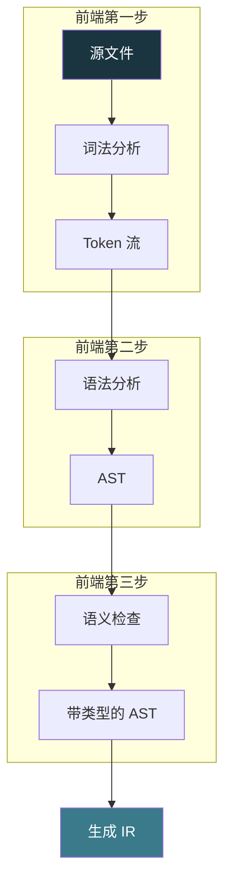
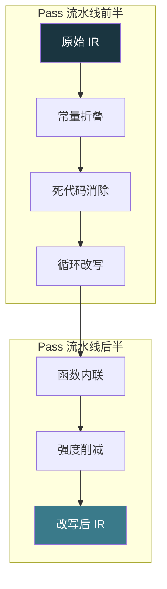
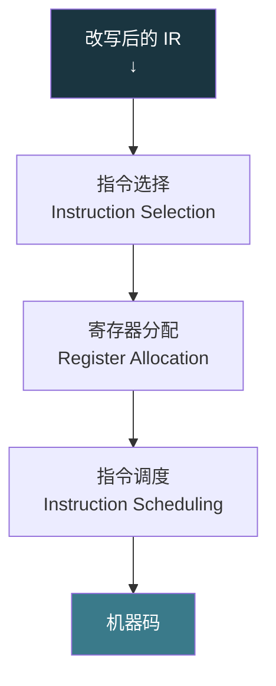
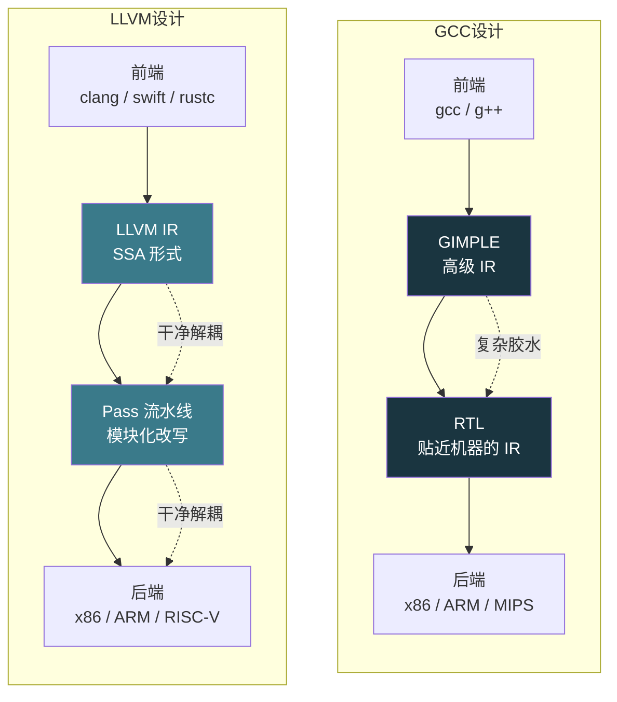
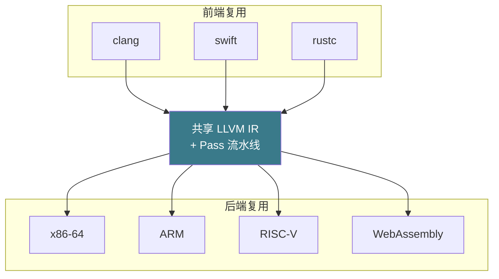
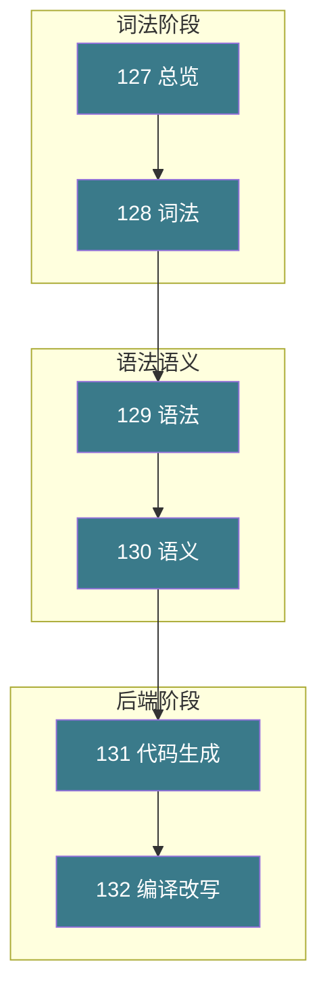

# 【化神·127】编译器是怎么造出来的：总览

> **码农修仙传 · 化神期 · 第127篇**
> 我是玄芯散人，带你从炼气修到大乘。

---

## 境界标识

```
╔══════════════════════════════════╗
║     化神期 · 第127篇             ║
║     编译器是怎么造出来的：总览   ║
║     前端/中端/后端 + LLVM vs GCC ║
║     预计阅读：20 分钟            ║
╚══════════════════════════════════╝
```

---

## 修仙引入

修真界里有一种职业叫「灵文翻译师」。弟子说人话，翻译师把话翻成器灵能听懂的指令。法器才能动起来。金丹期讲编译是把人话翻给 CPU，金丹63篇我们已经讲过 CPU 这边怎么听。这一篇翻过来看翻译师本身，看看编译器这个程序是怎么被造出来的。

化神期弟子的标志是会造翻译师。一个能用的翻译师至少分三个工种。识字的负责把灵文原稿拆字解句，润稿的负责把拗口的句子改顺，排印的负责把改好的句子落到玉简上。三个人各管一段，中间用一份「墨稿」交接，墨稿就是 IR（中间表示）。

这一篇拆开现代编译器最主流的设计。化神弟子会看到三段结构如何分工，IR 如何作为通用交接媒介发挥作用，Pass 流水线如何跑起来。然后再对比 LLVM 和 GCC 这两大门派在设计上的分歧。

---

## 硬核主体

### 编译器是什么：一个翻译程序

编译器是把一种语言翻译成另一种语言的程序。源语言通常是人类可读的高级语言，比如 C 或 Rust 或 Go。目标语言通常是目标机器可执行的机器码，可以是 x86 指令也可以是 ARM 指令，也可以是 RISC-V 指令。也可以是另一种高级语言，比如 JavaScript 转译到 TypeScript。

翻译这件事拆开看有三件事要做。其一是理解原文，其二是把原文改得更高效，其三是落到目标语言。这三个阶段对应编译器的三段结构，三段各管一摊。这个划分不是某位设计者拍脑袋的发明，是编译技术几十年演化沉淀下来的最稳态结构。主流编译器都跑不出这个骨架，GCC 与 LLVM 跑不出，Java 的 HotSpot 编译器跑不出，JavaScript 的 V8 同样跑不出。

修真比喻：识字的弟子读原稿、拆字解句。润稿的弟子把拗口的句子改顺。排印的弟子把改好的句子落到玉简上。这一份法旨分这三步。

### 三段结构全景图

```mermaid
flowchart LR
    subgraph 前端Frontend
        direction TB
        A1["源文件<br/>.c / .cpp / .rs"] --> A2["词法分析"]
        A2 --> A3["语法分析"]
        A3 --> A4["语义检查"]
        A4 --> A5["生成 IR"]
    end

    subgraph 中端Optimizer
        direction TB
        B1["LLVM IR"] --> B2["Pass 流水线"]
        B2 --> B3["改写后的 IR"]
    end

    subgraph 后端Backend
        direction TB
        C1["改写后的 IR"] --> C2["指令选择"]
        C2 --> C3["寄存器分配"]
        C3 --> C4["指令调度"]
        C4 --> C5["机器码"]
    end

    A5 -. IR .-> B1
    B3 -. IR .-> C1

    style A1 fill:#1A3540,color:#fff
    style A5 fill:#3A7A8A,color:#fff
    style B1 fill:#3A7A8A,color:#fff
    style B3 fill:#5A9AAA,color:#fff
    style C1 fill:#3A7A8A,color:#fff
    style C5 fill:#1A3540,color:#fff
```



这张图就是现代编译器最常见的三段骨架。前端吃源文件吐 IR，中端吃 IR 吐改写后的 IR，后端吃 IR 吐机器码。三个工种之间用 IR 交接，每个人只关心自己段内的输入输出。

修真比喻：三个工种之间的墨稿叫 IR。识字的只管把原稿誊成墨稿，润稿的只管改墨稿，排印的只管把墨稿印到玉简。墨稿独立于原稿的字体和玉简的材质，所以同一份墨稿可以拿去印不同的玉简。

### 前端做什么：源文件生成 IR

前端的任务是把源文件翻译成 IR。这个翻译过程又分四步，每一步都有自己的数据结构：



第一步是词法分析（Lexer / Tokenizer）。它的作用是把字符流切成一个个 token。`int x = 1 + 2;` 这一行被切成 7 个 token。`int` 是关键字，`x` 是标识符，`=` 是赋值号，`1` 是整数字面量，`+` 是加号，`2` 是另一个整数字面量，`;` 是分号。词法分析不管这些 token 之间怎么组合，它只负责「这一段字符属于哪个词类」。

第二步是语法分析（Parser）。它按语言的文法规则把 token 组合成抽象语法树（AST）。`int x = 1 + 2;` 会变成一棵树，根节点是变量声明，左孩子是类型 `int` 和名字 `x`，右孩子是一个加法表达式 `1 + 2`。语法分析不管类型对不对，它只负责「这些 token 能不能组成合法句子」。

第三步是语义检查（Semantic Analyzer）。它看类型和作用域与声明使用是不是匹配。这一步会报错，比如 `int x = "hello";` 在词法和语法上都是合法的，但语义上把字符串赋给整数变量类型不匹配。

第四步是生成 IR。这一步把带类型信息的 AST 翻译成 IR。IR 是一种介于高级语言和机器码之间的表示。它的形式更接近机器码，所以它包含了底层概念，比如基本块与跳转，乃至函数调用这些。但它仍然不绑定具体目标机器。

用一个具体例子看 LLVM IR 长什么样：

```c
// C 源码
int add(int a, int b) {
    return a + b;
}
```

对应到 LLVM IR 长这样：

```llvm
define i32 @add(i32 %a, i32 %b) {
entry:
    %result = add i32 %a, %b    ; 整数加法，结果存到 %result
    ret i32 %result             ; 返回结果
}
```

这个 IR 不属于任何具体机器，但又比 C 更接近机器。它是前端交付给中端的「墨稿」。

修真比喻：识字的弟子（前端）拿到原稿后，先把每个字圈出来（词法），再按句法把字排成句（语法），再看句意是否通顺（语义），最后誊抄成一份标准墨稿（IR）。识字的弟子只管识，不负责润色。

### 中端做什么：Pass 流水线与 IR 改写

中端的工作对象是 IR，它把 IR 改写得更快，但不绑定具体目标机器。中端的工作机制是 Pass 流水线。

Pass 是中端的一个独立的改写操作。一个 Pass 吃 IR，吐改写后的 IR。比如：

- 常量折叠 Pass 把 `add i32 1, 2` 直接改成 `3`
- 死代码消除 Pass 把没人用的变量删掉
- 循环不变代码外提 Pass 把循环里不变的计算挪到循环外
- 函数内联 Pass 把短函数调用展开成调用方代码
- 公共子表达式消除 Pass 把重复计算的表达式合并

单个 Pass 能力有限，要达成好的改写效果必须串起来跑。Pass Manager 负责调度各个 Pass 的执行顺序，处理 Pass 之间的依赖关系。



每个 Pass 自己只懂一件事。Pass Manager 是个调度员，按预设的策略把 Pass 串成流水线跑。这种设计的好处是新增改写只需新增一个 Pass，不用动其它 Pass。

中端改写是编译器的智慧中枢。它能看到比单条语句更大的视野，能跨函数内联，能跨循环改写，能跨模块传播常量。改写的好坏直接决定生成代码的运行速度。

修真比喻：润稿的弟子（中端）拿到墨稿后，先把能省的字省掉（死代码），再把能合并的句子合并（公共子表达式），再把重复的段落重排（循环改写）。每一种润色都是一种 Pass，按顺序串起来。

### 后端做什么：IR 翻译成机器码

后端的工作是把改写后的 IR 翻译成目标机器的机器码。这个翻译过程也分几步。

第一步是指令选择（Instruction Selection）。这一步把 IR 操作对应到目标机器的具体指令。比如 IR 里的 `add i32 %a, %b`，在 x86 上对应 `addl` 指令，在 ARM 上对应 `add` 指令，在 RISC-V 上对应 `addw` 指令。

```llvm
; LLVM IR
%result = add i32 %a, %b
```

```asm
; x86-64 (AT&T 语法，GCC 默认输出)
addl    %esi, %edi         ; AT&T 风格：源在前，目的在后
```

```asm
; x86-64 (Intel 语法，MASM/NASM 风格)
add     edi, esi           ; Intel 风格：目的在前，源在后
```

```asm
; ARM64
add     w0, w0, w1        ; ARM 风格，结果覆盖第一个操作数
```

第二步是寄存器分配（Register Allocation）。这一步把 IR 里的「虚拟寄存器」（理论上无限的 `%a`、`%b`、`%c`）分配到真实的物理寄存器（数量有限，x86-64 只有 16 个通用寄存器）。分配不下的变量会被溢出（spill）到栈上。寄存器分配是后端最复杂的算法之一，常见算法有图着色（graph coloring）和线性扫描（linear scan）。

第三步是指令调度（Instruction Scheduling）。这一步调整指令的执行顺序，填满 CPU 流水线。现代 CPU 是超标量架构，能同时执行多条指令，调度得当能显著提升 IPC（每周期指令数）。



后端的复杂度主要来自目标机器的多样性。每多一种新架构都要重新实现一遍后端。x86 与 ARM 加进来要写后端，RISC-V 与 WebAssembly 加进来也要写后端。这意味着编译器后端是按目标机器数量倍增的，前端是按源语言数量倍增的，IR 处在中间被两者共享。

修真比喻：排印的弟子（后端）拿到墨稿后，先选最合适的玉简模板（指令选择），再把每个字刻到玉简的具体位置上（寄存器分配），最后调整刻字的顺序让灵气流转更顺（指令调度）。玉简材质变了（换架构），排印的弟子就要从头学一遍。

### GCC vs LLVM：两种设计哲学

讲完三段骨架，现在聊两大主流编译器阵营的设计分歧：GCC 和 LLVM。它们都实现了三段骨架，但中间表示和模块化程度上差别很大。

GCC 的设计始于 1987 年，由 Richard Stallman 启动，原本只支持 C 语言，后来扩展成支持多语言的 GNU Compiler Collection。GCC 的中间表示经历了多次演进（GENERIC → GIMPLE → RTL），其中 RTL（Register Transfer Language）层级非常贴近目标机器，导致前端和后端耦合严重。

LLVM 的设计始于 2000 年，由 UIUC 的 Chris Lattner 与 Vikram Adve 共同发起的博士研究，2003 年正式发布。LLVM 设计的起点就是「干净的 IR」。LLVM IR 是一种类 RISC 虚拟指令集，形式化定义细致，类型系统健全，同时采用 SSA（静态单赋值）形式让数据流分析更简单，前后端通过 IR 严格解耦。



GCC 有几个痛点。RTL 层级太低，机器描述冗长且难维护。前端后端通过复杂胶水代码粘合，新语言接入成本高。Pass 系统是后期加的，与 IR 耦合不干净。中端改写能力相对受限。

LLVM 有几处明显的优势。LLVM IR 干净，类型健全，SSA（静态单赋值）形式便于分析。Pass 完全模块化，新增改写只需写一个 Pass。任何语言只要写一个前端就能享受所有后端支持。任何架构只要写一个后端就能支持所有语言。Clang 是 LLVM 的 C/C++/Objective-C 前端，编译速度快、错误提示友好。

用一个具体例子看 LLVM IR 的 SSA 形式：

```llvm
; SSA 形式：每个变量只能赋值一次
define i32 @max(i32 %a, i32 %b) {
entry:
    %cmp = icmp sgt i32 %a, %b    ; 比较 a > b
    br i1 %cmp, label %if.then, label %if.else

if.then:
    br label %if.end

if.else:
    br label %if.end

if.end:
    %result = phi i32 [%a, %if.then], [%b, %if.else]  ; phi 节点合并两个分支
    ret i32 %result
}
```

SSA（Static Single Assignment）形式让每个变量只被赋值一次，这给数据流分析带来了巨大便利。编译器能精确知道每个值的来源，分析和改写因此简单很多。

### 为什么 LLVM 的设计更好：解耦带来的复用

把视角抬到「编译器项目作为软件工程」的高度，LLVM 之所以在 2010 年代取代 GCC 成为新语言新架构的首选，主要原因是它的模块化设计带来的复用能力。



M 乘 N 的复用：在 GCC 设计里加 M 种语言和 N 种架构，要写 M × N 套前后端胶水。在 LLVM 设计里只要写 M + N 套，每个前端和每个后端都共享同一份 IR 和同一套 Pass。

这个复用倍数在工业界意义巨大。Apple 的 Swift 语言能快速支持所有 Apple 硬件架构，因为 LLVM 后端已经写好了。RISC-V 架构能快速获得完整工具链，因为 LLVM 前端已经写好了。如果用 GCC 设计，每加一种语言或架构都要重写大量胶水代码。

修真比喻：GCC 像修真界里各宗门各管各的翻译师，每个宗门只懂自己的语言和自家玉简格式。LLVM 像修真界里统一翻译司。识字、润色与排印这三个部门各自独立，新语言新玉简只要对接其中一两个部门就能用。这种解耦让 LLVM 项目成为现代编译器的事实标准。

### 一次完整的编译流程

串起来看一段 C 代码经过编译的全过程：

```bash
# 1. 预处理：处理 #include 和 #define
gcc -E main.c -o main.i

# 2. 编译：源文件 → 汇编
gcc -S main.i -o main.s

# 3. 汇编：汇编 → 机器码（.o 文件）
gcc -c main.s -o main.o

# 4. 链接：多个 .o + 库 → 可执行文件
gcc main.o -o main
```

`-S` 这一步内部就完整跑完了三段。Clang 也是同样的三段，只是中间产物是 LLVM IR 而不是 GCC 的 GIMPLE/RTL。

修真比喻：编译的全过程像修真界里炼制一枚法器。识字的弟子（前端）把灵文原稿翻译成标准墨稿（IR）。润稿的弟子（中端）把墨稿润色得更高效。排印的弟子（后端）把墨稿刻到具体的器灵上（机器码）。三个工种独立运作又环环相扣，缺一段法器都炼不出来。

### 化神期编译器造轮子的全貌

把化神期 127 到 132 篇的脉络放在一张图上：



五篇 128 到 132 是把三段骨架里每一段拆开讲。128 和 129 讲前端的前两步（词法、语法），130 讲前端的语义检查，131 讲后端的硬骨头（寄存器分配），132 讲中端的工作机制（Pass 流水线）。这一篇是总览，给的是骨架；后面五篇是血肉，每一篇都是编译器实现的一座具体山头。

修真比喻：化神期弟子造翻译师，先要明白翻译师分几个工种，工种之间用什么交接。这张图就是化神弟子心里必须装下的翻译师全貌图。

---

## 修仙术语对照表

| 修仙术语 | 技术现实 | 本篇位置 |
|---------|---------|---------|
| 灵文翻译师 | 编译器程序 | §编译器是什么 |
| 三段工种 | 前端 / 中端 / 后端 | §三段骨架 |
| 识字弟子 | 前端职责：词法 / 语法 / 语义 / 生成 IR | §前端做什么 |
| 润稿弟子 | 中端（IR 改写、Pass 流水线） | §中端做什么 |
| 排印弟子 | 后端指令（选择 / 分配 / 调度） | §后端做什么 |
| 墨稿 | IR（中间表示） | §全篇 |
| 灵文原稿 | 源文件 | §前端做什么 |
| 玉简上的法旨 | 机器码 | §后端做什么 |
| Pass 流水线 | 模块化改写 Pass 串接 | §中端做什么 |
| 玉简材质 | 目标机器架构 | §GCC vs LLVM |
| 统一翻译司 | LLVM 模块化解耦 | §LLVM 设计 |
| 各宗门各管翻译师 | GCC 紧耦合设计 | §GCC 设计 |
| 静态单赋值约束 | SSA 形式 | §SSA |
| M×N 复用 | 语言×架构的复用倍数 | §复用能力 |

---

## 进阶条件

化神期弟子的编译器功夫，看这六条：

- 能画出现代编译器的三段骨架图，标出每段的职责
- 能说出前端四步各自的数据结构，覆盖词法分析、语法分析与语义检查，最后还有生成 IR
- 能解释什么是 Pass、Pass Manager 干什么用、为什么 Pass 要设计成可插拔
- 能写出 LLVM IR 的简单例子，覆盖函数定义和加法运算与返回三种指令
- 能讲清楚 GCC 和 LLVM 在设计上的分歧，以及 LLVM 为什么后来居上
- 能说出后端每一步要解决的问题，指令选择解决对应关系，寄存器分配解决物理位置，指令调度解决顺序问题

六条全勾，编译器总览就过关了。下一座山是 128 词法分析器：把代码切成 token。词法分析是编译器的第一道关，要把字符流切成有意义的 token 序列。这件事听起来简单，做起来涉及正则表达式、NFA 与 DFA 一整套形式语言理论，是化神弟子必须翻过的第一座山头。

修真界里这一关像是铸器前的识字考核。识字的弟子连字都认不全，谈何铸器？化神弟子先把词法这块砖头砸实，再往语法分析的山头爬。

---

## 下期预告 + 互动

下一篇：【化神·128】词法分析器：把代码切成 token。

`int x = 1 + 2;` 这一行代码，编译器是怎么知道「int 是关键字」「x 是标识符」「+ 是运算符」的？词法分析器是编译器的第一道门，它把字符流切成一个个 token，背后靠的是正则表达式、NFA 与 DFA 一整套理论。128 这篇带你切 token。

> 🎮 你有没有试过用 `lex` 或 `flex` 生成过词法分析器？生成的代码长什么样？

> 💬 你觉得编译器最精妙的设计是哪一个：三段骨架，或者 IR 解耦，或者 Pass 流水线？

> 🔔 关注玄芯散人，修炼不迷路。下一篇带你切 token，识字的功夫从这一关开始练。

我是玄芯散人，带你从炼气修到大乘。

---

*本文是「码农修仙传」系列第127篇。系列导航见 [xren.ren](https://xren.ren)*
