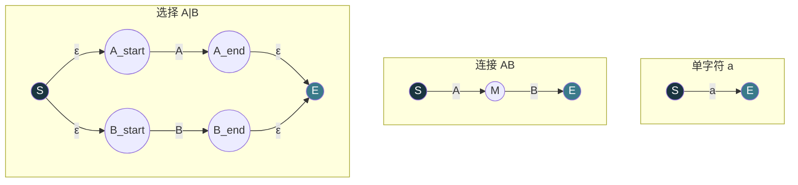
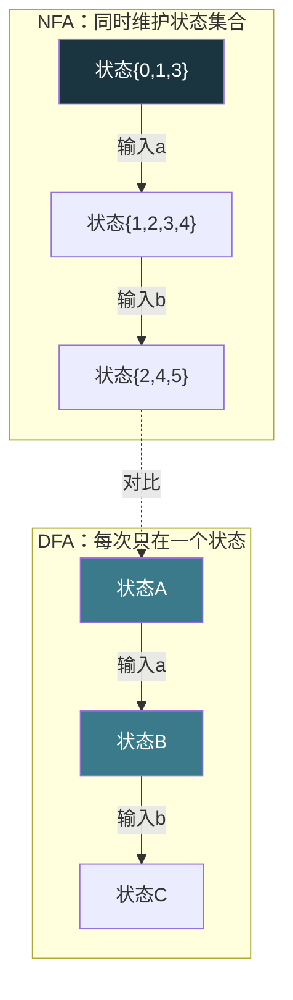
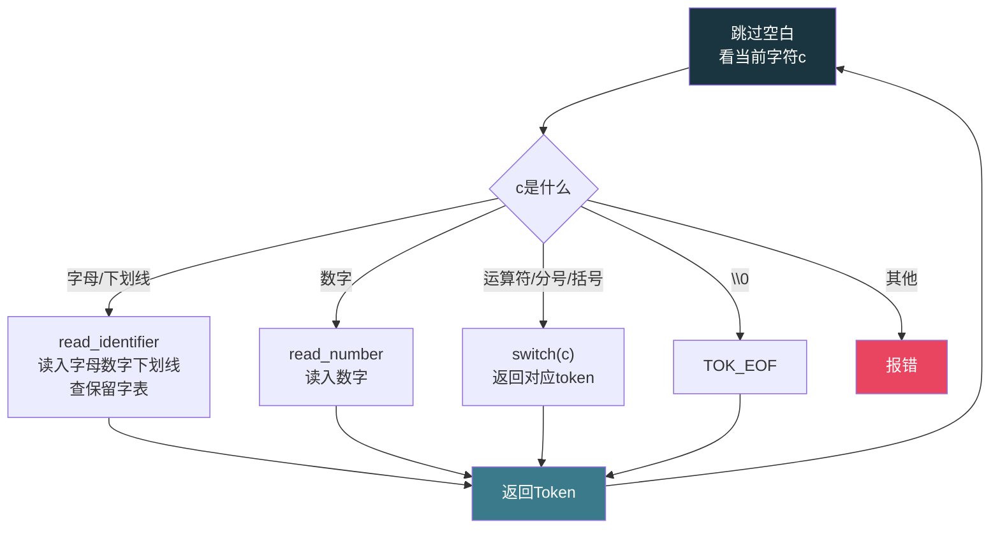

# 【化神·128】词法分析器：把代码切成token

> **码农修仙传 · 化神期 · 第128篇**
> 我是玄芯散人，带你从炼气修到大乘。

---

## 境界标识

```
╔══════════════════════════════════╗
║     化神期 · 第128篇             ║
║     词法分析器                    ║
║     把代码切成token               ║
║     正则→NFA→DFA+手写lexer       ║
║     预计阅读：20分钟              ║
╚══════════════════════════════════╝
```

---

## 修仙引入

上一篇总览里讲了编译器三段骨架。前端四步里的第一步是词法处理，把字符流切成 token 序列。当时一笔带过，这篇拆开讲。

沿用上篇的例子展开。`int x = 1 + 2;` 这行代码，编译器怎么区分 `int` 是关键字还是 `x` 是标识符还是 `1` 是数字字面量？这事背后有一整套形式语言理论：正则表达式描述词法规则，NFA 做匹配引擎，DFA 做快速执行。lex/flex 这类工具帮你把这些事自动化，但化神期弟子要能手写。

这篇带你从正则表达式出发，经过 NFA 和 DFA，最后用 C 手写一个能切 token 的 lexer。

---

## 硬核主体

### Token是什么

token 是词法扫描的输出单位。源代码是一串字符，词法分析器扫描这串字符，把它们切成一个个有意义的片段。每个片段叫一个 token。

看这行 C 代码：

```c
int x = 1 + 2;
```

词法分析器输出 7 个 token：

```
TOKEN_KEYWORD   "int"     // 保留字
TOKEN_ID        "x"       // 标识符
TOKEN_ASSIGN    "="       // 赋值号
TOKEN_INT       "1"       // 整数字面量
TOKEN_PLUS      "+"       // 加号
TOKEN_INT       "2"       // 整数字面量
TOKEN_SEMI      ";"       // 分号
```

token 通常用两个字段表示：类型（type）和值（value）。类型告诉你这个词属于什么词类，值告诉你具体是什么内容。比如 `TOKEN_ID "x"` 和 `TOKEN_ID "y"`，类型相同（都是标识符），值不同。

```c
// token的数据结构
typedef enum {
    TOK_KEYWORD,    // int, if, while, return...
    TOK_ID,         // 标识符：变量名、函数名
    TOK_INT_LITERAL, // 整数字面量：1, 42, 0xFF
    TOK_STRING,     // 字符串字面量："hello"
    TOK_OP,         // 运算符：+ - * / = == !=
    TOK_SEMI,       // 分号 ;
    TOK_LPAREN,     // 左括号 (
    TOK_RPAREN,     // 右括号 )
    TOK_LBRACE,     // 左花括号 {
    TOK_RBRACE,     // 右花括号 }
    TOK_EOF,        // 文件结束
} TokenType;

typedef struct {
    TokenType type;
    char value[64];  // token的文本内容
    int line;        // 所在行号，报错用
} Token;
```

词法分析器只负责切词，不管词和词之间的组合是否合法。`int = if +` 这种代码在词法层面合法（每个 token 都能识别），但语法层面不合法。语法解析是下一步的事。

### 正则表达式：描述词法规则的工具

每种 token 都可以用正则表达式描述。正则表达式是一种描述字符串模式的形式语言，它用一组符号约定来表示"什么样的字符序列符合某种规则"。

C 语言里几种 token 的正则描述：

```
标识符     [a-zA-Z_][a-zA-Z0-9_]*     字母或下划线开头，后面跟任意个字母数字下划线
整数       [0-9]+                       一个或多个数字
浮点数     [0-9]+\.[0-9]+              整数部分.小数部分
赋值号     =                             单个等号
等于号     ==                            两个等号
加号       \+                           加号（正则里+是特殊字符，要转义）
分号       ;                             分号
```

关键字是标识符的子集。`int`、`if`、`while` 这些词符合标识符的正则 `[a-zA-Z_][a-zA-Z0-9_]*`，但它们是保留字，优先级高于普通标识符。词法分析器通常先匹配标识符，再查一个保留字表：如果匹配到的字符串在保留字表里，就标记为关键字，否则标记为标识符。

```c
// 关键字表
const char *keywords[] = {
    "int", "char", "float", "double", "void",
    "if", "else", "while", "for", "do",
    "return", "break", "continue", "switch", "case",
    "struct", "typedef", "enum", "static", "const",
    NULL  // 哨兵
};

int is_keyword(const char *s) {
    for (int i = 0; keywords[i] != NULL; i++) {
        if (strcmp(s, keywords[i]) == 0)
            return 1;
    }
    return 0;
}
```

### NFA：带回溯的匹配引擎

正则表达式描述了"什么字符串符合规则"，但怎么判断一段字符是否匹配某个正则？需要一个执行引擎。有两种：NFA 和 DFA。

NFA（Nondeterministic Finite Automaton，非确定有穷自动机）的思路是：在某个状态下，面对同一个输入字符，可能有多个后续状态可以转移。NFA 不确定走哪条路，所以它要么回溯尝试所有路径，要么同时走所有路径。

Thompson 构造法把正则表达式转成 NFA。它对正则的每种结构定义对应的 NFA 片段：

- 单个字符 `a`：起点通过 `a` 转移到终点
- 连接 `AB`：A 的终点连到 B 的起点
- 选择 `A|B`：新起点分别连到 A 和 B 的起点，A 和 B 的终点分别连到新终点
- 闭包 `A*`：新起点可以跳过 A 直接到终点，也可以走 A，A 的终点可以回到 A 的起点



ε（epsilon）表示空转移，不消耗任何输入字符就能跳到另一个状态。Thompson 构造法大量使用 ε 转移来拼接 NFA 片段。

NFA 的执行方式是"同时维护所有可能的状态集合"。读入一个字符后，计算当前所有状态能到达的新状态集合。如果最终状态集合里包含接受状态，就算匹配成功。这种方式不需要回溯，但每个字符都要处理一个状态集合，速度不算快。

```c
// NFA状态的结构
typedef struct NFAState {
    int is_accept;               // 是否是接受状态
    // 最多2个转移（Thompson构造法保证每个状态最多2条出边）
    struct {
        char input;              // 转移字符，0表示ε转移
        struct NFAState *target;
    } transitions[2];
} NFAState;

// 计算ε闭包：从给定状态集合出发，沿ε转移能到达的所有状态
// 这一步是NFA执行的主要操作
// ε闭包 = 当前状态 ∪ 沿ε转移能到达的所有状态
```

### DFA：不需要回溯的执行引擎

DFA（Deterministic Finite Automaton，确定有穷自动机）是 NFA 的"确定化"版本。在 DFA 里，每个状态下面对同一个输入字符，只有一个确定的后续状态。没有 ε 转移，没有歧义，不需要维护状态集合。

子集构造法把 NFA 转成 DFA。它的思路是：NFA 的"状态集合"对应 DFA 的"单个状态"。NFA 里所有可能同时处于的状态打包成一个集合，这个集合在 DFA 里就是一个状态。



DFA 的执行速度高于 NFA，因为每个输入字符只需要一次状态转移，不需要维护集合。但 DFA 的状态数可能远多于 NFA。一个 NFA 有 N 个状态，对应的 DFA 最多有 2^N 个状态（因为 NFA 的状态集合有 2^N 种子集）。实际中通常远小于这个上限。

词法分析器工具 lex/flex 的工作流程：

1. 你写一组正则规则和对应的动作
2. flex 把这些正则用 Thompson 构造法拼成一个大 NFA
3. 用子集构造法转成 DFA
4. 用 Hopcroft 算法做 DFA 最小化
5. 输出一个 C 函数 yylex()，用一张状态转移表驱动

### 手写一个lexer

化神期弟子不能只会用 flex。手写一个 lexer 能让你理解词法处理的每一个细节。下面用 C 写一个能切 token 的词法分析器。

```c
#include <stdio.h>
#include <ctype.h>
#include <string.h>

typedef enum {
    TOK_KEYWORD, TOK_ID, TOK_INT_LITERAL,
    TOK_ASSIGN, TOK_EQ, TOK_PLUS, TOK_MINUS, TOK_STAR, TOK_SLASH,
    TOK_SEMI, TOK_LPAREN, TOK_RPAREN, TOK_EOF
} TokenType;

typedef struct {
    TokenType type;
    char value[64];
    int line;
} Token;

// 关键字表（保留字）
static const char *keywords[] = {
    "int", "char", "if", "else", "while", "for",
    "return", "break", "continue", NULL
};

static int is_keyword(const char *s) {
    for (int i = 0; keywords[i]; i++) {
        if (strcmp(s, keywords[i]) == 0)
            return 1;
    }
    return 0;
}

// 词法分析器状态
typedef struct {
    const char *src;    // 源代码字符串
    int pos;            // 当前位置
    int line;           // 当前行号
} Lexer;

// 读下一个字符，不前进
static char peek(Lexer *lx) {
    return lx->src[lx->pos];
}

// 读下一个字符并前进
static char advance(Lexer *lx) {
    char c = lx->src[lx->pos++];
    if (c == '\n') lx->line++;
    return c;
}

// 跳过空白字符和注释
static void skip_whitespace(Lexer *lx) {
    while (1) {
        char c = peek(lx);
        if (c == ' ' || c == '\t' || c == '\n' || c == '\r') {
            advance(lx);
        } else if (c == '/' && lx->src[lx->pos + 1] == '/') {
            // 单行注释，跳到行尾
            while (peek(lx) != '\n' && peek(lx) != '\0')
                advance(lx);
        } else {
            break;
        }
    }
}

// 读标识符或保留字
static Token read_identifier(Lexer *lx) {
    Token tok;
    tok.line = lx->line;
    int i = 0;
    char c = peek(lx);
    while (isalpha(c) || c == '_' || isdigit(c)) {
        if (i < 63) tok.value[i++] = advance(lx);
        else advance(lx);  // 超长截断
        c = peek(lx);
    }
    tok.value[i] = '\0';
    tok.type = is_keyword(tok.value) ? TOK_KEYWORD : TOK_ID;
    return tok;
}

// 读数字字面量
static Token read_number(Lexer *lx) {
    Token tok;
    tok.type = TOK_INT_LITERAL;
    tok.line = lx->line;
    int i = 0;
    while (isdigit(peek(lx))) {
        if (i < 63) tok.value[i++] = advance(lx);
        else advance(lx);
    }
    tok.value[i] = '\0';
    return tok;
}

// 取下一个token
Token next_token(Lexer *lx) {
    skip_whitespace(lx);

    Token tok;
    char c = peek(lx);

    if (c == '\0') {
        tok.type = TOK_EOF;
        tok.value[0] = '\0';
        tok.line = lx->line;
        return tok;
    }

    // 标识符或保留字：字母或下划线开头
    if (isalpha(c) || c == '_')
        return read_identifier(lx);

    // 数字
    if (isdigit(c))
        return read_number(lx);

    // 单字符运算符
    tok.line = lx->line;
    tok.value[0] = advance(lx);
    tok.value[1] = '\0';
    switch (c) {
        case '=': tok.type = TOK_ASSIGN; break;
        case '+': tok.type = TOK_PLUS;  break;
        case '-': tok.type = TOK_MINUS; break;
        case '*': tok.type = TOK_STAR;  break;
        case '/': tok.type = TOK_SLASH; break;
        case ';': tok.type = TOK_SEMI;  break;
        case '(': tok.type = TOK_LPAREN; break;
        case ')': tok.type = TOK_RPAREN; break;
        default:
            // 未识别字符，报错
            fprintf(stderr, "Lexer error: unknown char '%c' at line %d\n",
                    c, lx->line);
            tok.type = TOK_EOF;
            break;
    }
    return tok;
}
```

这个 lexer 的结构很经典。核心是 `next_token` 函数：先跳过空白和注释，再看当前字符决定走哪个分支。标识符走 `read_identifier`，数字走 `read_number`，运算符走 switch。每个分支读取字符填入 Token 结构返回。

词法分析器的结构本质上是一个手写的 DFA。每个 `read_xxx` 函数对应 DFA 里的一组状态。`peek` 和 `advance` 是读字符的两个基本操作：一个看不吃，一个看且吃。这种"前瞻一个字符再决定走哪条路"的方式叫"预测型"词法扫描。



### 最长匹配和优先级

词法扫描有一个要紧的规则叫"最长匹配"（maximal munch）。遇到 `==` 时，词法分析器不能读完第一个 `=` 就返回赋值号 token，而应该继续读第二个字符，发现是 `=` 组合成等于号。遇到 `intx` 时不能读出 `int` 保留字加 `x` 标识符，而应该读出 `intx` 这个标识符。

```c
// 处理==的扩展片段（说明性代码，未接入next_token的主switch）
static Token read_operator(Lexer *lx) {
    Token tok;
    tok.line = lx->line;
    char c = advance(lx);

    if (c == '=' && peek(lx) == '=') {
        advance(lx);  // 吃掉第二个=
        tok.type = TOK_EQ;  // 等于号==
        strcpy(tok.value, "==");
    } else if (c == '=') {
        tok.type = TOK_ASSIGN;  // 赋值号=
        strcpy(tok.value, "=");
    }
    // ... 其他运算符
    return tok;
}
```

flex 这类工具自动实现最长匹配：它尽量多读字符，直到再多读一个就不匹配任何规则为止。手写 lexer 里通过 `read_identifier` 和 `read_number` 的 while 循环自然实现最长匹配：一直读字符直到不满足条件为止。

优先级规则解决"同一个字符串匹配多条规则"的问题。比如 `if` 既能匹配标识符规则 `[a-zA-Z_][a-zA-Z0-9_]*`，也能匹配保留字规则 `if`。flex 按"规则声明顺序"决定优先级，先声明的优先。手写 lexer 通过"先读完整标识符再查保留字表"的方式解决：先按最长匹配读出整个词，再判断是不是保留字。

### flex：自动生成词法分析器

了解手写 lexer 后，看看 flex 怎么把同样的事自动化。flex 的输入是一个 `.l` 文件，里面写正则规则和对应动作：

```lex
/* token.l - flex输入文件 */
%%
int         { return TOK_INT; }
if          { return TOK_IF; }
else        { return TOK_ELSE; }
while       { return TOK_WHILE; }
return      { return TOK_RETURN; }
[a-zA-Z_][a-zA-Z0-9_]*  { yylval.str = strdup(yytext); return TOK_ID; }
[0-9]+      { yylval.num = atoi(yytext); return TOK_INT_LITERAL; }
"=="        { return TOK_EQ; }
"="         { return TOK_ASSIGN; }
"+"         { return TOK_PLUS; }
"-"         { return TOK_MINUS; }
";"         { return TOK_SEMI; }
[ \t\n]+   { /* 跳过空白 */ }
"//".*     { /* 跳过单行注释 */ }
%%

/* flex做的事：
   1. 把所有正则用Thompson构造法拼成一个大NFA
   2. 用子集构造法转成DFA
   3. 用Hopcroft算法做DFA最小化
   4. 生成一个C函数yylex()，用状态转移表驱动
*/
```

编译运行 flex 生成的词法分析器：

```bash
# 1. flex根据.l文件生成C源码lex.yy.c
flex token.l

# 2. 编译lex.yy.c生成可执行文件
cc lex.yy.c -o lexer -lfl

# 3. 运行，输入C代码看token输出
echo "int x = 1 + 2;" | ./lexer
```

`yytext` 是 flex 自动维护的变量，指向当前匹配到的字符串。`yylex()` 每次调用返回一个 token 类型。flex 内部做的正是前面讲的那套：正则转 NFA，NFA 转 DFA，DFA 最小化，输出表驱动代码。

flex 生成的词法分析器比大多数手写的快，因为 DFA 状态转移表可以做到每个字符只需一次表查找。但手写 lexer 有它的优势：错误信息可以定制得更友好，特殊语义可以灵活处理，不依赖外部工具。

修真类比：flex 是修真界的"符箓印刷机"，你画好模板（正则规则），它自动印出符箓（词法分析器代码）。手写 lexer 是"手绘符箓"，慢但灵活，能画出印刷机印不了的图案。化神期弟子两种都要会。

---

## 修仙术语对照表

| 修仙术语 | 技术现实 | 本篇位置 |
|----------|---------|---------|
| 识字考核 | 词法分析是编译器第一步 | 引入 |
| 灵文拆字 | 把字符流切成token序列 | Token节 |
| 符文分类 | TokenType枚举 | Token节 |
| 功法名册 | 保留字表 | 正则节 |
| 灵纹图案规则 | 正则表达式描述词法规则 | 正则节 |
| 分身术状态集 | NFA同时维护多个状态 | NFA节 |
| 灵纹铸造法 | Thompson构造法（正则转NFA） | NFA节 |
| 聚灵定身术 | 子集构造法（NFA转DFA） | DFA节 |
| 灵纹压缩术 | Hopcroft算法（DFA最小化） | DFA节 |
| 符箓印刷机 | flex自动生成词法分析器 | flex节 |
| 手绘符箓 | 手写lexer | 手写节 |
| 最长符文匹配 | 最长匹配规则 | 优先级节 |
| 符文优先级 | 保留字优先于标识符 | 优先级节 |
| 前瞻灵识 | peek操作看下一字符 | 手写节 |
| 吞噬灵文 | advance操作读取并前进 | 手写节 |

---

## 进阶条件

会调用 flex 和能手写 lexer 之间，差这几条：

- [ ] 能用 C 定义 Token 的数据结构（类型枚举加值加行号）
- [ ] 能写出识别标识符和数字和运算符的手写 lexer
- [ ] 能解释正则表达式怎么转成 NFA（Thompson 构造法的四种基本结构）
- [ ] 能解释 NFA 转 DFA 的子集构造法原理
- [ ] 知道最长匹配和优先级规则在词法扫描中的用处
- [ ] 能用 flex 写一个简单的 `.l` 文件，生成词法分析器并编译运行
- [ ] 能说出 flex 比 手写 lexer 快的原因（DFA 状态转移表，每字符一次查表）

> 最后两条是化神期的实操分水岭。词法处理是编译器前端里门槛最低的一段，但只有手写过才能真正理解 flex 在干什么。

---

## 下期预告 + 互动

> 下一篇：【化神·129】语法分析器：递归下降和LR
>
> 词法扫描把代码切成了 token 序列，但 `int = if +` 这种 token 序列在语法上不合法。
> 语法分析器按文法规则把 token 组装成抽象语法树（AST）。下一篇讲上下文无关文法以及递归下降解析器还有 LR 分析器。
> 到了 129 篇，你就能从 token 流构建出一棵语法树。

现在问你：

> 🔍 你有没有手写过词法分析器？最大的坑是什么？是注释处理还是多字符运算符？
>
> 📌 flex 生成的代码你看过吗？里面那张状态转移表有多大？
>
> 评论区聊聊你跟词法处理打交道的经历。

> 我是玄芯散人，带你从炼气修到大乘。

---

*本文是「码农修仙传」系列第128篇。系列导航见 [xren.ren](https://xren.ren)*
