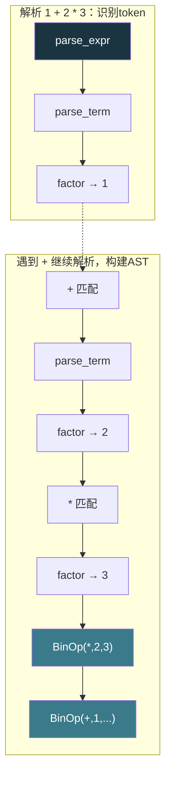
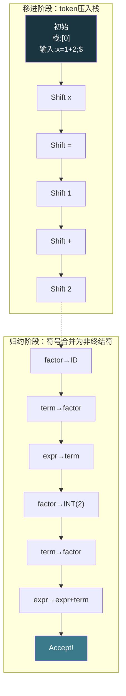

# 【化神·129】语法分析器：递归下降和LR

> **码农修仙传 · 化神期 · 第129篇**
> 我是玄芯散人，带你从炼气修到大乘。

---

## 境界标识

```
╔══════════════════════════════════╗
║     化神期 · 第129篇             ║
║     语法分析器                    ║
║     递归下降+LR分析器             ║
║     CFG→AST+手写parser           ║
║     预计阅读：22分钟              ║
╚══════════════════════════════════╝
```

---

## 修仙引入

上一篇词法扫描器把源代码切成了 token 序列。但 token 序列只是"一堆散落的灵材"，还没有组装成法器。`int = if +` 这行代码的每个 token 都合法，拼在一起却完全说不通。判断 token 序列是否符合语法规则，并把它组装成结构化的语法树，就是语法解析器干的事。

词法扫描器用的是正则表达式和自动机，语法解析器用的是上下文无关文法和推导算法。正则表达式描述不了嵌套结构（比如括号匹配），所以语法这一段需要更强的工具。

---

## 硬核主体

### 上下文无关文法

上下文无关文法（Context-Free Grammar，简称CFG）是描述语言语法规则的形式系统。"上下文无关"的意思是：无论一个非终结符出现在什么上下文里，它的替换规则都一样。相比之下，自然语言里"打"在"打电话"和"打人"里意思不同，这就是上下文相关。

语法解析器就是根据 CFG 来判断 token 序列合法性的部件。

CFG 由四个部分组成：

- 终结符（terminal）：token，也就是词法扫描器吐出来的东西，如 `int`、`if`、`+`、`(`
- 非终结符（non-terminal）：语法概念，比如"表达式"和"语句"都属于非终结符
- 起始符号（start symbol）：一个特殊的非终结符，代表整个程序
- 产生式（production）：替换规则，形如 `A → α`，表示非终结符 A 可以替换为符号串 α

BNF（Backus-Naur Form）是书写 CFG 的标准记法。用 BNF 描述一个简化版 C 语言的语句规则：

```
stmt        → if_stmt | while_stmt | return_stmt | expr_stmt
if_stmt     → "if" "(" expr ")" stmt ("else" stmt)?
while_stmt  → "while" "(" expr ")" stmt
return_stmt → "return" expr? ";"
expr_stmt   → expr ";"
expr        → term (("+" | "-") term)*
term        → factor (("*" | "/") factor)*
factor      → "(" expr ")" | ID | INT_LITERAL
```

这个文法描述了语句的合法形式。`expr` 可以是一个 `term` 后面跟零个或多个 `+ term` 或 `- term`。`factor` 可以是括号包围的表达式，也可以是标识符或整数字面量。

终结符用引号括起来表示（如 `"if"` 和 `"+"` 等），大写的词法类别（如 `ID` 和 `INT_LITERAL`）也是终结符。非终结符是小写的语法概念名（如 `stmt` 和 `expr`）。

### 推导和语法树

给定一个 CFG 和一个 token 序列，语法解析器要做的事情叫"推导"：从起始符号出发，不断用产生式替换非终结符，直到得到一个全终结符的串。如果这个串和输入的 token 序列一致，就算语法正确。

比如推导 `1 + 2;`：

```
expr_stmt  → expr ";"
           → term ("+" term)* ";"
           → factor ("+" factor)* ";"
           → INT_LITERAL "+" INT_LITERAL ";"
           → 1 + 2 ;
```

每次替换一个非终结符，最终得到 token 序列。把推导过程画成树就是语法树（Parse Tree）。树的根是起始符号，内部节点是非终结符，叶子是终结符。

```
    expr_stmt
    /        \
  expr       ";"
 / | \
term "+" term
 |        |
factor  factor
   |       |
INT_LIT  INT_LIT
   "1"     "2"
```

实际编译器用的是抽象语法树（AST）。语法树保留了所有中间推导步骤，AST 去掉了冗余信息只保留语义结构。比如 `1 + 2` 的语法树有 `expr → term → factor → INT` 的多层嵌套，AST 直接用一个 `BinaryOp(+, IntLit(1), IntLit(2))` 节点表示。

```c
// AST节点的数据结构
typedef enum {
    AST_NUM,        // 数字字面量
    AST_VAR,        // 变量引用
    AST_BINOP,      // 二元运算
    AST_ASSIGN,     // 赋值
    AST_IF,         // if语句
    AST_WHILE,      // while语句
    AST_RETURN,     // return语句
    AST_BLOCK,      // 语句块
} AstKind;

typedef struct AstNode {
    AstKind kind;
    int line;                   // 行号，报错用
    union {
        int num_val;            // AST_NUM: 数值
        char var_name[64];      // AST_VAR: 变量名
        struct {                // AST_BINOP: 二元运算
            char op;            // 运算符: + - * /
            struct AstNode *left;
            struct AstNode *right;
        } binop;
        struct {                // AST_ASSIGN: 赋值
            char var_name[64];
            struct AstNode *value;
        } assign;
        struct {                // AST_IF: 条件语句
            struct AstNode *cond;
            struct AstNode *then_branch;
            struct AstNode *else_branch;  // 可能为NULL
        } if_stmt;
    };
} AstNode;

// 注意：union里各字段共享同一段内存。
// assign.var_name和AST_VAR的var_name虽然同名但属于不同的union分支，
// 不会被同时使用。binop.op只存单字符运算符，==等双字符运算符需要扩展为枚举。
```

每个 AST 节点记录自己的类型和子节点。`AST_BINOP` 有运算符和左右操作数，`AST_IF` 有条件和两个分支。后续的语义检查和代码生成都基于 AST 操作。

### 递归下降解析器

递归下降（Recursive Descent）是最直观的语法解析方式。每个非终结符对应一个函数，函数体按产生式的右部依次处理：遇到终结符就匹配消费，遇到非终结符就调用对应的函数。

为什么叫"递归"下降？因为文法本身是递归的。`expr` 包含 `term`，`term` 包含 `factor`，`factor` 又可以包含 `expr`（括号表达式）。解析函数互相调用形成递归。

用上面那个简化文法写一个递归下降解析器：

```c
#include <stdio.h>
#include <stdlib.h>
#include <string.h>

// 复用128篇的Token结构
typedef enum {
    TOK_KEYWORD, TOK_ID, TOK_INT_LITERAL,
    TOK_ASSIGN, TOK_EQ, TOK_PLUS, TOK_MINUS, TOK_STAR, TOK_SLASH,
    TOK_SEMI, TOK_LPAREN, TOK_RPAREN, TOK_EOF
} TokenType;

typedef struct {
    TokenType type;
    char value[64];
    int line;
} Token;

// 解析器状态
typedef struct {
    Token *tokens;      // token数组
    int pos;            // 当前位置
    int count;          // token总数
} Parser;

// 前看当前token但不消费
static Token *peek(Parser *p) {
    return &p->tokens[p->pos];
}

// 消费当前token并前进
static Token *advance(Parser *p) {
    return &p->tokens[p->pos++];
}

// 期望当前token是某种类型，不是就报错
static Token *expect(Parser *p, TokenType type, const char *msg) {
    Token *t = peek(p);
    if (t->type != type) {
        fprintf(stderr, "Parse error at line %d: expected %s\n",
                t->line, msg);
        exit(1);
    }
    return advance(p);
}

// 前置声明（互相递归需要）
static AstNode *parse_expr(Parser *p);
static AstNode *parse_term(Parser *p);
static AstNode *parse_factor(Parser *p);

// factor → "(" expr ")" | ID | INT_LITERAL
static AstNode *parse_factor(Parser *p) {
    Token *t = peek(p);

    if (t->type == TOK_LPAREN) {
        advance(p);                          // 消费 "("
        AstNode *node = parse_expr(p);       // 递归解析表达式
        expect(p, TOK_RPAREN, "\")\"");     // 期望 ")"
        return node;
    }

    if (t->type == TOK_ID) {
        advance(p);
        AstNode *node = calloc(1, sizeof(AstNode));
        node->kind = AST_VAR;
        node->line = t->line;
        strcpy(node->var_name, t->value);
        return node;
    }

    if (t->type == TOK_INT_LITERAL) {
        advance(p);
        AstNode *node = calloc(1, sizeof(AstNode));
        node->kind = AST_NUM;
        node->line = t->line;
        node->num_val = atoi(t->value);
        return node;
    }

    fprintf(stderr, "Parse error at line %d: unexpected token\n", t->line);
    exit(1);
}

// term → factor (("*" | "/") factor)*
static AstNode *parse_term(Parser *p) {
    AstNode *node = parse_factor(p);

    while (peek(p)->type == TOK_STAR || peek(p)->type == TOK_SLASH) {
        Token *op = advance(p);              // 消费 * 或 /
        AstNode *right = parse_factor(p);

        AstNode *binop = calloc(1, sizeof(AstNode));
        binop->kind = AST_BINOP;
        binop->line = op->line;
        binop->binop.op = op->value[0];
        binop->binop.left = node;
        binop->binop.right = right;
        node = binop;                        // 左结合：新的binop作为左节点
    }
    return node;
}

// expr → term (("+" | "-") term)*
static AstNode *parse_expr(Parser *p) {
    AstNode *node = parse_term(p);

    while (peek(p)->type == TOK_PLUS || peek(p)->type == TOK_MINUS) {
        Token *op = advance(p);              // 消费 + 或 -
        AstNode *right = parse_term(p);

        AstNode *binop = calloc(1, sizeof(AstNode));
        binop->kind = AST_BINOP;
        binop->line = op->line;
        binop->binop.op = op->value[0];
        binop->binop.left = node;
        binop->binop.right = right;
        node = binop;
    }
    return node;
}
```

这段代码体现了递归下降的设计思路。`parse_expr` 调 `parse_term`，`parse_term` 调 `parse_factor`，`parse_factor` 遇到括号又调 `parse_expr`。递归层数对应表达式的嵌套层数。

运算符优先级通过函数调用层次体现：`*` 和 `/` 在 `parse_term` 里处理，比 `parse_expr` 里的 `+` 和 `-` 更深一层，所以先绑定。`1 + 2 * 3` 解析成 `1 + (2 * 3)` 而不是 `(1 + 2) * 3`。

左结合性通过 while 循环实现：`1 - 2 - 3` 先解析 `1`，然后循环消费 `-` 调 `parse_term` 得到 `2`，构建 `BinOp(-, 1, 2)`，然后继续循环消费 `-` 得到 `3`，构建 `BinOp(-, BinOp(-,1,2), 3)`，等价于 `(1-2)-3`。



### LL解析器和预测推导表

递归下降有一个限制：它需要"预测"当前该走哪个产生式。比如 `stmt → if_stmt | while_stmt | ...`，看到 `if` 就走 `if_stmt` 分支，看到 `while` 就走 `while_stmt` 分支。这种只看前 k 个 token 就能决定走哪条路的文法叫 LL(k) 文法。

LL 的两个 L：第一个 L 表示从左到右扫描输入（Left-to-right），第二个 L 表示最左推导（Leftmost derivation）。LL(1) 表示只看 1 个前看 token 就能做决定。

有些文法不是 LL(1) 的。比如这个经典例子：

```
stmt → expr ";" | expr ";" stmt    // 不能只看1个token决定走哪条
```

两种产生式都以 `expr` 开头，光看第一个 token 区分不了。需要改成：

```
stmt_list → expr ";" stmt_list?
```

这种改写叫"消除左公因子"（left factoring），是 LL 解析器处理歧义的标准手段。

递归下降还要消除左递归。如果文法写成 `expr → expr "+" term`，`parse_expr` 一进来就调自己，无限递归直到栈溢出。改写成 `expr → term ("+" term)*` 就没事了。上面手写的 parser 就是用的改写后的形式。

更正式的 LL(1) 解析器不用递归，而是用一张预测推导表加上一个栈来驱动。推导表的行是非终结符，列是终结符，格子填产生式编号。查表决定用哪条产生式替换栈顶。这种表驱动方式和递归下降在能力上等价，但更适合自动生成。

### LR解析器家族

LL 解析器从左到右扫描输入，从顶部（起始符号）往下推导，属于"自顶向下"解析。LR 解析器也是从左到右扫描，但它走相反的路：从输入 token 出发，逐步"归约"（reduce）成非终结符，直到归约到起始符号。这叫"自底向上"解析。

LR 的两个字母：L 表示从左到右扫描（Left-to-right），R 表示最右推导的逆过程（Rightmost derivation in reverse）。

LR 解析器用一个状态栈和一个输入缓冲区。每一步做两种操作之一：

- 移进（shift）：把输入 token 压入栈，转到新状态
- 归约（reduce）：栈顶的几个符号匹配了某条产生式的右部，把它们弹出，把产生式左部的非终结符压入

什么时候 shift 什么时候 reduce？由一张 action/goto 表决定。action 表的行是状态，列是终结符，格子里填 shift n（转到状态 n）、reduce k（用第 k 条产生式归约）、accept（接受）或空（报错）。goto 表的行是状态，列是非终结符，填归约后转到哪个状态。



LR 解析器按能力强弱分四档：

LR(0) 最弱，只看栈状态决定 shift 还是 reduce，不看前看 token。它的推导表小但能力有限，很多实际文法处理不了，容易出现 shift-reduce 冲突（同一个状态可以 shift 也可以 reduce）。

SLR（Simple LR）在 LR(0) 基础上加了一条规则：归约时检查当前前看 token 是否在该非终结符的 Follow 集里。Follow 集是指某个非终结符后面能跟着哪些终结符。这个检查消除了部分冲突，但还不够强。

LALR（Look-Ahead LR）是实际中用得最多的。它合并了 LR(1) 项目集中"相同骨架"的状态（骨架就是不看前看信息的项目集），在保持状态数和 LR(0) 一样少的同时，接近 LR(1) 的解析能力。yacc 和 bison 默认生成的就是 LALR(1) 解析器。

LR(1) 最强，每个项目都带前看信息，解析能力最强，但状态数可能非常多。同一个文法的 LR(1) 状态数可能是 LALR(1) 的好几倍。

四者的关系：LR(0) ⊂ SLR(1) ⊂ LALR(1) ⊂ LR(1)。每往右一步，能力更强但代价更大。

### 左递归和左右结合

LL 和 LR 对左递归的态度截然不同。

左递归文法 `expr → expr "+" term` 描述的是左结合运算（`a + b + c` 等价于 `(a+b) + c`）。LL 解析器处理不了左递归（会无限递归），必须改写成迭代形式。改写后的文法虽然描述同样的语言，但推导方式变了，语义上有时需要额外处理才能保证左结合。

LR 解析器天然处理左递归。自底向上解析从 token 开始归约，不存在递归调用的问题。`a + b + c` 先归约 `a + b` 得到一个 `expr`，再和 `c` 一起归约成 `expr + term`，自然就是左结合。

这也是为什么 yacc/bison 不需要改写文法就能处理左递归，而手写递归下降必须改写。

### yacc和bison

yacc（Yet Another Compiler Compiler）是 Bell 实验室 Stephen Johnson 在 1970 年代写的 LALR(1) 解析器生成器。bison 是 GNU 版本的 yacc，兼容 yacc 语法并做了扩展。两者的工作方式跟 flex 类似：你写文法规则和对应的动作代码，它们生成一个 C 函数 `yyparse()`。

```yacc
/* calc.y - 一个简单的计算器文法 */
%token ID INT_LITERAL

/* 声明优先级和结合性：越靠下优先级越高 */
%left '+' '-'
%left '*' '/'

%%

program : stmt_list
        ;

stmt_list : stmt
          | stmt_list stmt
          ;

stmt : expr ';'
     | ID '=' expr ';'
     ;

expr : expr '+' term   { $$ = make_binop('+', $1, $3); }
     | expr '-' term   { $$ = make_binop('-', $1, $3); }
     | term
     ;

term : term '*' factor { $$ = make_binop('*', $1, $3); }
     | term '/' factor { $$ = make_binop('/', $1, $3); }
     | factor
     ;

factor : INT_LITERAL
       | '(' expr ')'
       | ID
       ;

%%

/* make_binop: 构建AST的二元运算节点（简化示意） */
AstNode *make_binop(char op, AstNode *left, AstNode *right) {
    AstNode *node = calloc(1, sizeof(AstNode));
    node->kind = AST_BINOP;
    node->binop.op = op;       // 注意：op只存单字符，==等双字符运算符需要扩展
    node->binop.left = left;
    node->binop.right = right;
    return node;
}
```

文法里直接写左递归 `expr → expr "+" term`，bison 照样处理。`%left` 声明告诉 bison 运算符的优先级和结合性，越靠下声明的优先级越高，同一行的运算符共享相同优先级。花括号里的 `$$` 是产生式左部的语义值，`$1` `$3` 是右部第 1、3 个符号的语义值。`make_binop('+', $1, $3)` 的意思是：遇到加法表达式时，构建一个 AST 二元运算节点，左右子节点分别指向操作数。

bison 会检查文法有没有冲突。如果报告 shift-reduce 冲突，它默认选 shift（处理悬挂 else 问题时正合适）。如果报告 reduce-reduce 冲突，说明文法有歧义，需要你修改规则。

编译流程跟 flex 配合：

```bash
# 1. bison根据.y文件生成C源码
bison -d calc.y          # 生成calc.tab.c和calc.tab.h

# 2. flex根据.l文件生成词法扫描器
flex calc.l              # 生成lex.yy.c

# 3. 编译链接
cc calc.tab.c lex.yy.c -o calc -lfl

# 4. 运行
echo "1 + 2 * 3;" | ./calc    # 输出 7
```

bison 生成的 `yyparse()` 每次需要 token 就调用 `yylex()`，两者通过 `calc.tab.h` 里定义的 token 类型通信。这正好对应编译器前端的两个阶段：词法扫描器供 token，语法解析器消费 token 并构建 AST。

### 手写递归下降 vs 工具生成

实际编译器项目里两种方式都有人用。GCC 早期用 bison 生成 C 语法解析器，后来改成了手写递归下降。Clang/LLVM 从一开始就手写递归下降。V8（JavaScript 引擎）的 parser 也是手写的。理由是手写解析器能给出更精准的错误信息，能做更好的错误恢复，还能在解析过程中做语义检查。

工具生成的优势在于开发速度快，文法修改方便，适合快速原型和教学。一个 `.y` 文件几十行就能描述一个计算器语法，手写同样功能的 parser 要写好几百行 C 代码。

修真类比：bison 是"炼器炉"，你投入文法规则矿石，它吐出解析器法器。手写递归下降是"以身为炉"，用自身功力直接炼化 token 流。大厂编译器团队偏爱后者，因为炉子炼出来的法器虽然快，但细节上不如手工打磨的精良。

---

## 修仙术语对照表

| 修仙术语 | 技术现实 | 本篇位置 |
|----------|---------|---------|
| 散落灵材 | token序列尚未组装 | 引入 |
| 灵纹组合规则 | 上下文无关文法描述语法 | CFG节 |
| 灵纹配方手册 | BNF范式书写文法规则 | CFG节 |
| 炼器图纸 | 语法树/AST描述程序结构 | 推导节 |
| 灵识拆解 | 推导过程从起始符号展开 | 推导节 |
| 去冗存精 | AST去掉语法树冗余节点 | 推导节 |
| 以身炼器 | 递归下降手写解析函数 | 递归下降节 |
| 灵识递归深入 | parse_expr调parse_term调parse_factor | 递归下降节 |
| 前瞻灵识 | LL解析器看前看token决定产生式 | LL节 |
| 逆炼归元 | LR解析器自底向上归约 | LR节 |
| 炼器炉 | bison/yacc自动生成解析器 | yacc节 |
| 左道逆修 | 左递归文法 | 左递归节 |
| 灵材回流 | shift操作把token压入栈 | LR节 |
| 灵器成型 | reduce操作把符号归约为非终结符 | LR节 |
| 炼器品阶 | LR(0) < SLR < LALR < LR(1) | LR节 |

---

## 进阶条件

能跑 bison 和能手写 parser 之间，差这几条：

- [ ] 能用 BNF 写出一个包含 if/while/表达式/赋值 的语言文法
- [ ] 能手写递归下降解析器，包含运算符优先级和左结合处理
- [ ] 能定义 AST 节点结构，在解析过程中构建 AST
- [ ] 能解释 LL(1) 解析器的预测推导表怎么构造和使用
- [ ] 能说清楚 shift 和 reduce 的区别，以及 shift-reduce 冲突是什么
- [ ] 能列出 LR(0)、SLR、LALR、LR(1) 的能力强弱顺序和各自特点
- [ ] 能用 bison 写一个 `.y` 文件，配合 flex 生成可运行的计算器

> 最后一题是化神期的实操检验。手写递归下降理解原理，bison 加速工程落地，两条路都走过才算真正懂语法解析。

---

## 下期预告 + 互动

> 下一篇：【化神·130】语义检查：类型检查和作用域
>
> 语法解析器把 token 组装成了 AST，但 AST 只知道"结构长什么样"，不知道"对不对"。`int x = "hello";` 在语法上合法（赋值语句），语义上不合法（类型不匹配）。下一篇讲符号表和类型推导还有作用域规则，看编译器怎么在 AST 上做语义检查。

现在问你：

> 🔍 你写过的 parser 是手写还是用工具生成的？遇到最难处理的语法是什么？
>
> 📌 shift-reduce 冲突你碰到过吗？是怎么解决的？
>
> 评论区聊聊你跟语法解析打交道的经历。

> 我是玄芯散人，带你从炼气修到大乘。

---

*本文是「码农修仙传」系列第129篇。系列导航见 [xren.ren](https://xren.ren)*
