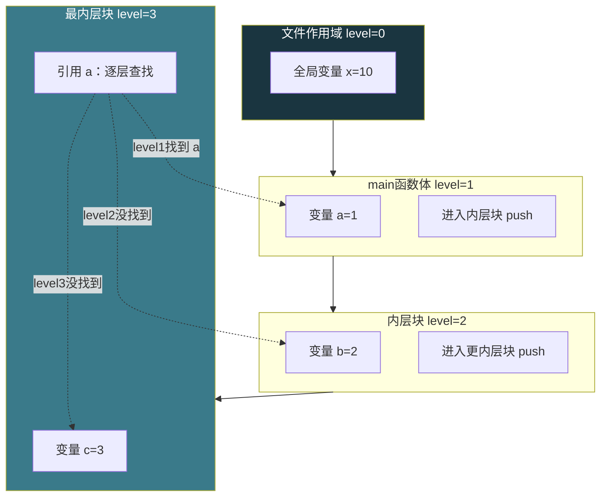
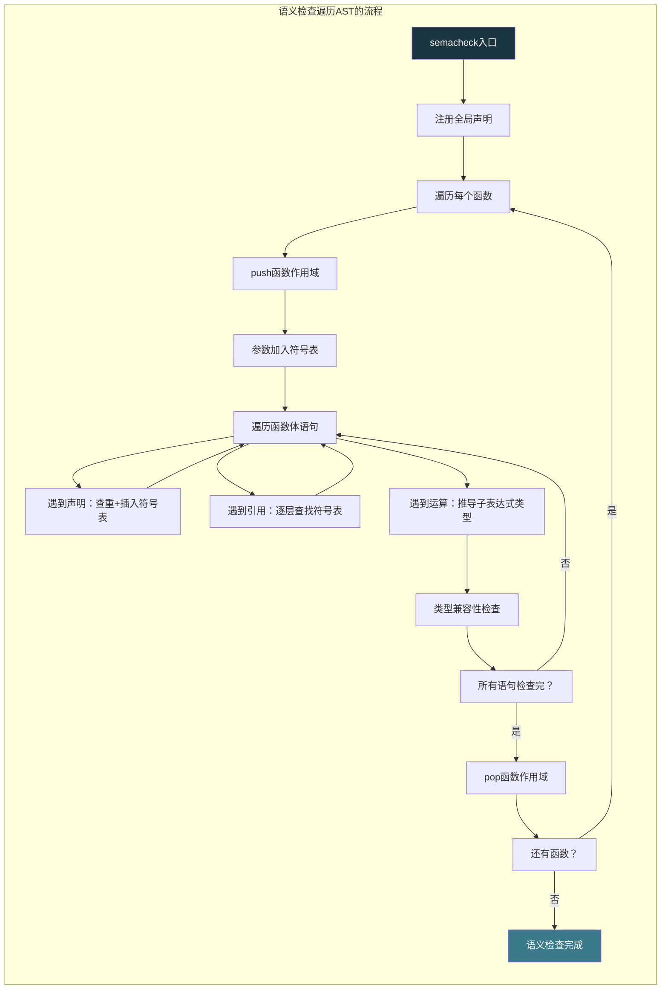

# 【化神·130】语义分析：类型检查和作用域

> **码农修仙传 · 化神期 · 第130篇**
> 我是玄芯散人，带你从炼气修到大乘。

---

## 境界标识

```
╔══════════════════════════════════╗
║     化神期 · 第130篇             ║
║     语义分析                      ║
║     类型检查+作用域+符号表        ║
║     AST遍历+Sema                 ║
║     预计阅读：20分钟              ║
╚══════════════════════════════════╝
```

---

## 修仙引入

上一篇语法解析器把 token 流组装成了 AST。AST 描述了程序的骨架结构，但骨架合法不等于程序合法。`int x = "hello";` 在语法上合法（赋值语句），语义上不合法（类型不匹配）。下一篇讲编译器怎么在 AST 上做语义检查。

---

## 硬核主体

### 语法正确≠语义正确

语法解析器只管结构。下面这几行代码，每一行都能通过语法解析，但每一行都有语义错误：

```c
int x = "hello";       // 类型不匹配：int变量赋字符串
x = y + 1;             // y未定义：用了不存在的变量
return x + "world";    // int和char*相加：运算符类型不合法
int x = 1;             // 重复定义：x已经在上面声明过了
foo(42);               // foo未声明：调用不存在的函数
```

语法解析器看到的是 token 序列符不符合文法规则。语义检查看到的是 AST 节点之间的类型关系和名字引用是否合法。这一层检查在编译器里叫 Sema（Semantic Analysis 的简称），Clang 里有个 `Sema` 类专门干这个事。

语义检查要回答三个问题：
1. 每个名字引用指向哪个声明（作用域解析）
2. 每个表达式的类型是什么（类型推导）
3. 类型之间是否兼容（类型检查）

符号表（Symbol Table）是语义检查的基础数据结构。每声明一个变量或函数，就在符号表里登记一条记录。每引用一个名字，就去符号表里查。

一条符号记录至少包含这些字段：

```c
typedef enum {
    SYM_VAR,        // 变量
    SYM_FUNC,       // 函数
    SYM_TYPEDEF,    // 类型别名
    SYM_PARAM,      // 函数参数
} SymKind;

typedef struct {
    char name[64];          // 名字
    SymKind kind;           // 符号类别
    Type *type;             // 类型信息
    int scope_level;       // 所在作用域层级
    int line;               // 声明所在行号
    int offset;             // 相对于栈帧的偏移（代码生成用）
    int is_error;           // 标记为错误恢复符号
    struct Symbol *next;   // 哈希冲突链表指针
} Symbol;

// 符号表本身用哈希表实现
typedef struct {
    Symbol **entries;       // 哈希桶数组
    int size;               // 桶数量
    int count;              // 已存符号数
} SymTable;

// 哈希函数：djb2算法，经典字符串哈希
static unsigned hash(const char *str) {
    unsigned h = 5381;
    int c;
    while ((c = *str++))
        h = ((h << 5) + h) + c;      // h * 33 + c
    return h;
}

// 插入符号：冲突时用链地址法
void sym_insert(SymTable *t, Symbol *sym) {
    unsigned h = hash(sym->name) % t->size;
    sym->next = t->entries[h];       // 头插法
    t->entries[h] = sym;
    t->count++;
}

// 查找符号：返回NULL表示没找到
Symbol *sym_lookup(SymTable *t, const char *name) {
    unsigned h = hash(name) % t->size;
    Symbol *s = t->entries[h];
    while (s) {
        if (strcmp(s->name, name) == 0)
            return s;
        s = s->next;
    }
    return NULL;
}
```

djb2 是 Daniel J. Bernstein 写的字符串哈希函数，分布均匀且实现简单。很多编译器和解释器用它做符号表的哈希函数。冲突处理用链地址法（每个桶挂一个链表），实现简单且在符号数量不大时性能足够。

实际编译器里，GCC 用哈希表管理 C++ 的符号（叫 binding table），Clang 的 IdentifierTable 用 Trie 结构加速前缀查找，LLVM IR 层面用 StringMap。但原理都是一样的：名字作为 key，符号信息作为 value，O(1) 或 O(log n) 查找。

### 作用域：名字的可见范围

C 语言有四种作用域：

- 文件作用域（file scope）：全局变量和函数声明，声明位置往后到文件末尾可见
- 块作用域（block scope）：花括号 `{}` 内的局部变量，出了块就不可见
- 函数原型作用域：函数声明参数列表里的名字（基本不用管）
- 函数作用域：只有 label 标签，跟 goto 配合

嵌套作用域是重点。内层可以看见外层的名字，同名变量内层遮蔽外层：

```c
int x = 10;           // 外层x，文件作用域
{
    int x = 20;       // 内层x，块作用域，遮蔽外层
    printf("%d", x);  // 打印20
}
printf("%d", x);      // 打印10，内层x已不可见
```

实现嵌套作用域用作用域链（scope chain）。每个作用域对应一张符号表，多层作用域串成链表。查找名字时，在当前作用域找，找不到往上一层，找到第一个匹配的就返回。

```c
// 一个作用域节点
typedef struct Scope {
    SymTable *table;          // 当前层的符号表
    struct Scope *parent;     // 外层作用域
    int level;                // 嵌套深度
} Scope;

// 创建新作用域，parent指向外层
Scope *scope_push(Scope *parent) {
    Scope *s = calloc(1, sizeof(Scope));
    s->table = symtable_new(64);
    s->parent = parent;
    s->level = parent ? parent->level + 1 : 0;
    return s;
}

// 退出作用域
Scope *scope_pop(Scope *s) {
    Scope *parent = s->parent;
    symtable_free(s->table);
    free(s);
    return parent;
}

// 从当前作用域开始往外层查找
Symbol *scope_lookup(Scope *s, const char *name) {
    while (s) {
        Symbol *sym = sym_lookup(s->table, name);
        if (sym) return sym;       // 找到了就返回
        s = s->parent;             // 没找到往上一层
    }
    return NULL;                    // 所有层都没找到
}

// 只在当前层查找（用于检测重复定义）
Symbol *scope_lookup_current(Scope *s, const char *name) {
    return sym_lookup(s->table, name);
}
```

进入一个 `{}` 就 push 一个新作用域，遇到 `}` 就 pop。函数体是一个块，for 循环的初始化部分也是一个块。下面这段代码展示了作用域的进出时序：

```c
int main() {
    int a = 1;            // scope_level=1，main函数体
    {
        int b = 2;        // scope_level=2，内层块
        {
            int c = 3;    // scope_level=3，更内层
            a = b + c;    // 查找a：level3没有→level2没有→level1找到
        }                 // pop level3，c不可见了
        b = a;            // 查找b：level2有
    }                     // pop level2，b不可见了
    return a;             // 查找a：level1有
}
```



### 类型系统：给每个表达式贴标签

类型检查的前提是知道每个表达式的类型。类型在 C 语言里分基本类型和派生类型：

```c
typedef enum {
    TYPE_VOID,
    TYPE_CHAR,
    TYPE_SHORT,
    TYPE_INT,
    TYPE_LONG,
    TYPE_FLOAT,
    TYPE_DOUBLE,
    TYPE_POINTER,       // 指针：有一个元素类型
    TYPE_ARRAY,         // 数组：有元素类型和长度
    TYPE_FUNC,          // 函数：有参数列表和返回类型
} TypeKind;

typedef struct Type {
    TypeKind kind;
    int size;               // sizeof结果（字节）
    int is_unsigned;        // 是否unsigned
    struct Type *pointee;   // TYPE_POINTER指向的类型
    struct Type *elem;      // TYPE_ARRAY的元素类型
    int array_len;          // TYPE_ARRAY的长度
    // TYPE_FUNC的参数和返回类型（简化省略）
} Type;

// 预定义类型，直接用全局实例
Type ty_int   = { TYPE_INT,   4, 0 };
Type ty_char  = { TYPE_CHAR,  1, 0 };
Type ty_void  = { TYPE_VOID,  0, 0 };
Type ty_float = { TYPE_FLOAT, 4, 0 };

// 构造指针类型
Type *make_pointer_type(Type *base) {
    Type *t = calloc(1, sizeof(Type));
    t->kind = TYPE_POINTER;
    t->size = 8;             // 64位系统指针8字节
    t->pointee = base;
    return t;
}
```

### 遍历AST做语义检查

语义检查的过程就是遍历 AST，在每个节点上做对应的检查。这叫 AST walk 或者 tree traversal。

```c
// 语义检查器主入口
void sema_check(AstNode *ast, Scope *global_scope) {
    // 先注册全局声明（函数、全局变量）
    declare_globals(ast, global_scope);

    // 再逐个检查函数体
    for (AstNode *fn = ast; fn; fn = fn->next) {
        if (fn->kind == AST_FUNC)
            check_func(fn, global_scope);
    }
}

// 检查函数
void check_func(AstNode *fn, Scope *parent) {
    Scope *scope = scope_push(parent);     // 函数作用域

    // 把参数加入符号表
    for (Param *p = fn->func.params; p; p = p->next) {
        if (scope_lookup_current(scope, p->name))
            error(p->line, "重复定义的参数: %s", p->name);
        sym_insert(scope->table, make_param_sym(p));
    }

    // 检查函数体
    check_block(fn->func.body, scope);

    scope_pop(scope);
}

// 检查语句块
void check_block(AstNode *block, Scope *parent) {
    Scope *scope = scope_push(parent);

    for (AstNode *stmt = block; stmt; stmt = stmt->next)
        check_stmt(stmt, scope);

    scope_pop(scope);
}

// 检查单条语句
void check_stmt(AstNode *stmt, Scope *scope) {
    switch (stmt->kind) {
    case AST_VAR_DECL: {
        // 检查初始化表达式的类型
        if (stmt->var_decl.init) {
            Type *init_ty = check_expr(stmt->var_decl.init, scope);
            if (!type_compatible(stmt->var_decl.type, init_ty))
                error(stmt->line, "类型不匹配");
        }
        // 检查重复定义（只在当前层查）
        if (scope_lookup_current(scope, stmt->var_decl.name))
            error(stmt->line, "重复定义: %s", stmt->var_decl.name);
        // 插入符号表
        sym_insert(scope->table, make_var_sym(stmt));
        break;
    }
    case AST_IF:
        check_expr(stmt->if_stmt.cond, scope);  // 检查条件
        check_block(stmt->if_stmt.then_branch, scope);
        if (stmt->if_stmt.else_branch)
            check_block(stmt->if_stmt.else_branch, scope);
        break;
    case AST_RETURN:
        if (stmt->ret.value) {
            Type *ret_ty = check_expr(stmt->ret.value, scope);
            // 检查返回值类型是否跟函数声明一致
            // （需要从上下文获取当前函数的返回类型）
        }
        break;
    }
}
```

### 类型推导和类型检查

检查表达式时，递归推导子表达式的类型，然后检查组合是否合法。

```c
// 检查表达式，返回表达式的类型
Type *check_expr(AstNode *expr, Scope *scope) {
    switch (expr->kind) {
    case AST_NUM:
        return &ty_int;        // 整数字面量类型是int

    case AST_VAR: {
        // 变量引用：查符号表
        Symbol *sym = scope_lookup(scope, expr->var.name);
        if (!sym)
            error(expr->line, "未定义的变量: %s", expr->var.name);
        expr->var.sym = sym;   // 把符号记到AST上，代码生成用
        return sym->type;
    }

    case AST_BINOP: {
        Type *lt = check_expr(expr->binop.left, scope);
        Type *rt = check_expr(expr->binop.right, scope);
        return check_binop_type(expr, lt, rt);
    }

    case AST_ASSIGN: {
        Type *lt = check_expr(expr->assign.target, scope);
        Type *rt = check_expr(expr->assign.value, scope);
        if (!type_compatible(lt, rt))
            error(expr->line, "赋值类型不匹配");
        return lt;     // 赋值表达式的类型是左值的类型
    }
    }
}

// 检查二元运算的类型
Type *check_binop_type(AstNode *expr, Type *lt, Type *rt) {
    // 算术运算：两边都需要是算术类型
    if (is_arithmetic(lt) && is_arithmetic(rt)) {
        // 隐式类型转换：低精度向高精度转
        return usual_arith_conversion(lt, rt);
    }
    // 指针+整数：指针运算，合法
    if (lt->kind == TYPE_POINTER && rt->kind == TYPE_INT)
        return lt;
    // 指针-指针：算两个指针之间的元素个数
    if (lt->kind == TYPE_POINTER && rt->kind == TYPE_POINTER
        && lt->pointee == rt->pointee)
        return &ty_int;   // ptrdiff_t，简化为int

    error(expr->line, "运算符类型不合法");
    return &ty_int;  // 报错后返回一个默认类型继续检查
}
```

`usual_arith_conversion` 做的是 C 语言的隐式类型转换规则。实际过程分两步：先做整型提升（char和short转成int），再按规则统一两边类型。`int + long` 会把 int 转成 long 再运算，`int + double` 会把 int 转成 double。有符号和无符号的交互更复杂，这里简化处理。这套规则叫 usual arithmetic conversion，C 标准里定义得很清楚。

### 隐式类型转换

C 语言允许很多隐式类型转换。`int` 可以隐式转 `double`，`char` 可以隐式转 `int`，`void*` 可以隐式转任何指针类型。但 `int` 不能隐式转 `char*`，`float` 不能隐式转枚举。

```c
// 判断from能否隐式转换为to
int can_implicit_convert(Type *from, Type *to) {
    // 同类型直接通过
    if (from == to) return 1;

    // 算术类型之间：简化处理，实际需要整型提升+有符号性判断
    if (is_arithmetic(from) && is_arithmetic(to)) {
        return from->size <= to->size;  // 简化：实际规则更复杂
    }

    // void* 可以转任意指针类型
    if (from->kind == TYPE_POINTER && from->pointee == &ty_void
        && to->kind == TYPE_POINTER)
        return 1;

    // 指针可以转void*
    if (from->kind == TYPE_POINTER && to->kind == TYPE_POINTER
        && to->pointee == &ty_void)
        return 1;

    // 数组可以退化为指针
    if (from->kind == TYPE_ARRAY && to->kind == TYPE_POINTER
        && from->elem == to->pointee)
        return 1;

    return 0;  // 其他情况不允许隐式转换
}
```

数组退化为指针是 C 语言的一个经典特性。`int arr[10]` 用在表达式中时，`arr` 的类型从 `int[10]` 退化成 `int*`。这就是为什么 `sizeof(arr)` 在函数内部得到的是指针大小而不是数组大小。



### 报错和恢复

语义检查不能遇到第一个错误就停。用户改一次重新编译，结果只报了一个错，改完再编译又冒出第二个错，这样体验太差。编译器要在报错后尽量恢复，继续检查后面的代码，把能找到的错一次性全报出来。

恢复策略通常是这样：遇到未定义的变量，往符号表里插入一个类型为 `int` 的占位符号，后续引用这个变量的地方就不会再报"未定义"了，只报一次。遇到类型不匹配，用默认类型继续检查。这样后续代码能继续走完。

```c
Symbol *make_error_sym(const char *name, int line) {
    Symbol *s = calloc(1, sizeof(Symbol));
    strcpy(s->name, name);
    s->kind = SYM_VAR;
    s->type = &ty_int;       // 错误恢复用int作默认类型
    s->line = line;
    s->is_error = 1;         // 标记为错误符号
    return s;
}

// 在check_expr的AST_VAR分支
if (!sym) {
    error(expr->line, "未定义的变量: %s", expr->var.name);
    sym = make_error_sym(expr->var.name, expr->line);
    sym_insert(scope->table, sym);    // 插入占位符号
}
```

Clang 和 GCC 都做了大量的错误恢复工作。Clang 在遇到未定义的标识符时，会尝试用编辑距离找到最接近的已定义变量名，给出"你是否想用 xxx"的提示。这是用户体验上的打磨，原理还是基于符号表查找。

### Sema在真实编译器中的位置

以 Clang 为例，编译流程是这样的：

1. Lexer 把源码切成 token
2. Parser 把 token 组装成 AST
3. Sema 遍历 AST 做语义检查
4. CodeGen 把检查过的 AST 翻译成 LLVM IR

Clang 的 `Sema` 类有上万行代码，除了类型检查和作用域解析，还做模板实例化以及重载决议等工作。GCC 也有对应的语义检查阶段，散在 C 前端的各个文件里。

语义检查是编译器前端最复杂的部分。词法扫描和语法解析有成熟的工具（flex/bison），算法也相对固定。语义检查没有通用工具可帮忙，每个语言的类型系统和作用域规则不同，得手写。这也是为什么 Clang 的 Sema 代码量远超 Lexer 和 Parser。

---

## 修仙术语对照表

| 修仙术语 | 技术现实 | 本篇位置 |
|----------|---------|---------|
| 骨架 | AST描述程序结构 | 引入 |
| 灵名簿 | 符号表记录所有声明 | 符号表节 |
| 灵名登记 | sym_insert把符号加入哈希表 | 符号表节 |
| 查名册 | sym_lookup在符号表查找 | 符号表节 |
| 灵识分层 | 作用域链实现嵌套可见性 | 作用域节 |
| 入境推层级 | scope_push创建新作用域 | 作用域节 |
| 出境退层级 | scope_pop销毁作用域 | 作用域节 |
| 遮蔽 | 内层同名变量隐藏外层 | 作用域节 |
| 灵根属性 | 类型系统给表达式分类 | 类型系统节 |
| 灵根鉴定 | 类型推导递归确定表达式类型 | 类型检查节 |
| 灵根相容 | 类型兼容性检查 | 类型检查节 |
| 灵根转换 | 隐式类型转换低精度到高精度 | 类型转换节 |
| 灵根退化 | 数组退化为指针 | 类型转换节 |
| 巡视灵纹 | AST walk遍历做语义检查 | 遍历AST节 |
| 炼丹炉修补 | 错误恢复插入占位符号 | 报错恢复节 |

---

## 进阶条件

- [ ] 能实现一个哈希表作为符号表，支持插入和查找，冲突用链地址法处理
- [ ] 能用 scope chain 实现嵌套作用域，push/pop 时序正确，查找逐层往外
- [ ] 能遍历 AST 做变量声明查重和变量引用解析，未定义变量报错且恢复
- [ ] 能实现基本类型（int/char/pointer/array）的表示和 sizeof 计算
- [ ] 能写类型推导函数，递归确定各类AST节点的类型
- [ ] 能实现 usual arithmetic conversion 的隐式类型转换规则
- [ ] 能解释数组退化为指针的原因，以及为什么函数内 sizeof 数组结果是指针大小

> 类型系统是编译器的灵魂。能把类型检查写对，就摸到了编译器前端最硬的骨头。下一篇把检查过的 AST 翻译成汇编指令，进入代码生成阶段。

---

## 下期预告 + 互动

> 下一篇：【化神·131】代码生成：AST翻译成汇编
>
> 语义检查通过的 AST 终于可以翻译成目标代码了。寄存器分配，指令选择，栈帧布局，这些是代码生成的硬骨头。下一篇用一个简单表达式为例，走一遍 AST 节点翻译成 x86 汇编指令的全过程。

现在问你：

> 🔍 你在写编译器时，语义检查这一层踩过什么坑？类型推导和作用域哪个更让你头疼？
>
> 📌 C 语言的隐式类型转换规则你觉得设计得好不好？Go 和 Rust 都砍掉了大部分隐式转换，你怎么看？
>
> 评论区聊聊你的编译器实战经验。

> 我是玄芯散人，带你从炼气修到大乘。

---

*本文是「码农修仙传」系列第130篇。系列导航见 [xren.ren](https://xren.ren)*
