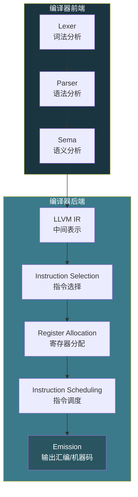
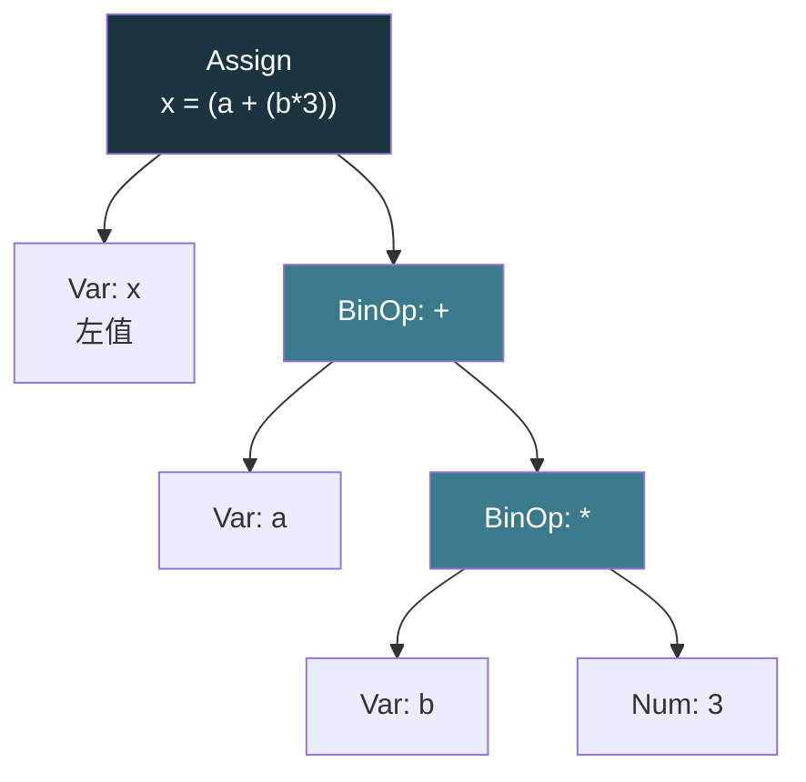

# 【化神·131】代码生成：从AST到汇编

> **码农修仙传 · 化神期 · 第131篇**
> 我是玄芯散人，带你从炼气修到大乘。

---

## 境界标识

```
╔══════════════════════════════════╗
║     化神期 · 第131篇             ║
║     代码生成                      ║
║     AST→汇编指令                  ║
║     寄存器分配+指令选择+栈帧      ║
║     预计阅读：22分钟              ║
╚══════════════════════════════════╝
```

---

## 修仙引入

前六篇走了编译器前端的全流程：词法切 token，语法建 AST，语义做类型检查。AST 拿到了合法的类型标注，可以开始翻译成目标机器能执行的指令了。这一步叫代码生成（Code Generation），编译器后端的第一道关卡。前端解决"程序合不合法"，后端解决"怎么在真实硬件上跑起来"。

代码生成面对的第一个难题：CPU 寄存器数量有限，程序变量可能成百上千，谁用哪个寄存器，什么时候腾位置，这就是寄存器分配。接下来是指令选择，同一种运算可能对应多条不同的机器指令，选哪条最快。最后还要安排好栈帧布局，让函数调用能正确传递参数和保存现场。

---

## 硬核主体

### 代码生成在编译器里的位置

以 Clang/LLVM 为例，后端流程大致分五步：



前端把源码翻译成 IR（中间表示），后端把 IR 翻译成机器指令。IR 是编译器内部的通用语言，跟具体硬件无关。LLVM IR 长得像汇编，但用的是虚拟寄存器（%0, %1, %2...），数量无限。后端的工作就是把这些虚拟寄存器对应到物理寄存器上，把虚拟指令翻译成真实 CPU 的指令。

### 栈帧布局：函数的临时道场

函数调用时，CPU 会在栈上划一块空间给这个函数用，叫栈帧（Stack Frame）。x86-64 的栈帧结构：

```
高地址
┌──────────────────┐
│  调用者传入的参数  │  第7个参数开始放栈上
│  ...              │
├──────────────────┤
│  返回地址          │  call指令自动压入
├──────────────────┤
│  保存的rbp         │  push rbp
├──────────────────┤
│  局部变量          │  sub rsp, N 分配空间
│  ...              │
├──────────────────┤
│  临时变量          │
└──────────────────┘  ← rsp 指向这里
低地址
```

rbp 是帧指针（Frame Pointer），固定指向栈帧底部。rsp 是栈指针（Stack Pointer），随分配和释放移动。函数开头的模板代码叫 prologue（序言）：

```asm
; 函数 prologue
push rbp          ; 保存调用者的帧指针
mov rbp, rsp      ; 当前帧指针 = 栈顶
sub rsp, 32       ; 给局部变量分配32字节空间

; 函数 epilogue（尾声）
mov rsp, rbp      ; 恢复栈顶
pop rbp           ; 恢复调用者帧指针
ret               ; 弹出返回地址，跳回去
```

局部变量通过 rbp 的负偏移访问。第一个局部变量在 `[rbp-4]`，第二个在 `[rbp-8]`，以此类推。参数通过 rbp 的正偏移访问（在返回地址和旧 rbp 之上）。

System V AMD64 ABI 规定了参数传递规则：前6个整数参数依次放在 rdi, rsi, rdx, rcx, r8, r9 里，第7个开始放栈上。返回值放 rax。这套规则是 Linux 和 macOS 上所有 C 程序遵守的约定，调用者和被调用者必须一致，否则参数乱套。

### 寄存器分配：给变量安排座位

x86-64 有16个通用寄存器：rax, rbx, rcx, rdx, rsi, rdi, rbp, rsp, r8 到 r15。减去 rsp（栈指针）和 rbp（帧指针），实际能用的14个。编译器要把程序里成百上千的虚拟寄存器塞进这14个物理寄存器里，塞不下的放栈上（spill）。

寄存器分配有两种主流算法：图着色和线性扫描。

图着色（Graph Coloring）

经典算法，Chaitin 在1982年提出（SIGPLAN Notices Vol.17）。思路分三步：

1. 构建干涉图（Interference Graph）：如果两个变量同时活着（有一个变量在另一个的生命周期内被定义或使用），它们就干涉，连一条边
2. 对图做着色：用 K 种颜色给节点着色，相邻节点颜色不同。K = 可用寄存器数
3. 着色失败的节点 spill 到栈上

```c
// 变量的生命周期信息
typedef struct {
    int start;      // 定义点（指令编号）
    int end;        // 最后使用点
    int reg;        // 分配的寄存器，-1表示spill
    int spill_slot; // 栈上的位置
} LiveInterval;

// 构建干涉图
typedef struct {
    int n;              // 节点数（变量数）
    int **adj;          // 邻接矩阵
    int *color;         // 着色结果
    int *degree;        // 每个节点的度数
} InterferenceGraph;

// 两个变量是否干涉：生命周期重叠
int intervals_overlap(LiveInterval *a, LiveInterval *b) {
    return !(a->end < b->start || b->end < a->start);
}

// 构建干涉图
void build_interference_graph(LiveInterval *intervals, int count,
                               InterferenceGraph *g) {
    g->n = count;
    // 分配邻接矩阵
    g->adj = calloc(count, sizeof(int*));
    for (int i = 0; i < count; i++) {
        g->adj[i] = calloc(count, sizeof(int));
        g->degree[i] = 0;
    }
    // 两两检查生命周期是否重叠
    for (int i = 0; i < count; i++) {
        for (int j = i + 1; j < count; j++) {
            if (intervals_overlap(&intervals[i], &intervals[j])) {
                g->adj[i][j] = g->adj[j][i] = 1;  // 连边
                g->degree[i]++;
                g->degree[j]++;
            }
        }
    }
}
```

图着色是 NP 完全问题，实际编译器用启发式简化：把度数小于 K 的节点压入栈，如果所有节点都能压入，再依次弹出着色。弹出一个节点时，看看邻居用了哪些颜色，选一个没被占用的颜色。如果某个节点度数 >= K，就选一个 spill 候选。

线性扫描（Linear Scan）

Poletto 和 Sarkar 在1999年提出的算法，比图着色快得多。思路简单粗暴：把所有变量的生命周期区间按起始点排序，然后线性扫描。遇到一个新变量，找一个空闲寄存器分配给它。没有空闲寄存器就 spill 生命周期最长的那个。

```c
// 线性扫描寄存器分配
// available_regs: 可用物理寄存器列表
// reg_count: 可用寄存器数量
// intervals: 已按start排序的生命周期数组
void linear_scan(LiveInterval *intervals, int n,
                 int *available_regs, int reg_count) {
    // active 列表：当前占用寄存器的变量
    LiveInterval *active[16];
    int active_count = 0;

    for (int i = 0; i < n; i++) {
        // 检查过期区间：已结束的变量释放寄存器
        for (int j = 0; j < active_count; j++) {
            if (active[j]->end < intervals[i].start) {
                active[j]->reg = -2;  // 标记已释放
                // 从active移除
                active[j] = active[active_count - 1];
                active_count--;
                j--;  // 重新检查这个位置
            }
        }

        if (active_count < reg_count) {
            // 有空闲寄存器，直接分配
            intervals[i].reg = available_regs[active_count];
            active[active_count] = &intervals[i];
            active_count++;
        } else {
            // 没有空闲寄存器，需要spill
            // 找到active中生命周期最长的
            int longest = 0;
            for (int j = 1; j < active_count; j++) {
                if (active[j]->end > active[longest]->end)
                    longest = j;
            }
            if (active[longest]->end > intervals[i].end) {
                // 当前变量生命周期更短，spill最长的
                intervals[i].reg = active[longest]->reg;
                active[longest]->reg = -1;
                active[longest]->spill_slot = allocate_spill_slot();
                active[longest] = &intervals[i];
            } else {
                // 当前变量生命周期更长，spill自己
                intervals[i].reg = -1;
                intervals[i].spill_slot = allocate_spill_slot();
            }
        }
    }
}
```

线性扫描的时间复杂度是 O(n·K)（K=可用寄存器数，用优先队列可以到 O(n log n)），图着色是 O(n²) 甚至更差。JVM HotSpot 的 JIT 编译器用线性扫描，LLVM 也有线性扫描实现。GCC 和 LLVM 的默认分配器用图着色变体（LLVM 叫 RegAllocGreedy）。

### 寄存器分类：caller-saved 和 callee-saved

System V ABI 把寄存器分两类：

- caller-saved（调用者保存）：rax, rcx, rdx, rsi, rdi, r8-r11。调用函数前如果要保留这些寄存器的值，调用者自己存
- callee-saved（被调用者保存）：rbx, rbp, r12-r15。被调用的函数保证这些寄存器在返回时跟进入时一样

```c
// 函数 prologue 保存 callee-saved 寄存器
push rbx          ; 如果本函数用到了rbx
push r12          ; 如果用到了r12
push r13          ; 如果用到了r13
; ... 对应的 epilogue 反序 pop
pop r13
pop r12
pop rbx
```

编译器做寄存器分配时优先用 caller-saved 寄存器（不用保存恢复），不够了再用 callee-saved（需要 prologue/epilogue 保护）。这个权衡影响函数的执行速度。

### 指令选择：同一种运算选哪条指令

AST 节点翻译成汇编时，同一种操作可能对应多条不同的机器指令。比如加法：

```asm
; 两个寄存器相加
add eax, ebx       ; 2字节指令

; 寄存器加常量
add eax, 1         ; 3字节（imm8）
add eax, 100000    ; 6字节（imm32）

; 内存加寄存器
add [rbp-8], eax   ; 需要先算地址
```

指令选择要考虑指令长度，延迟，以及是否需要额外寄存器。x86 的 `lea` 指令是个经典例子，它本来是算地址的，但可以用来做乘法加法：

```asm
; a = b + c * 5  可以一条指令搞定
lea eax, [rbx + rcx*4 + rcx]    ; rcx*5 = rcx*4 + rcx

; 等价的多条指令
mov eax, ecx
shl eax, 2          ; eax = ecx * 4
add eax, ecx        ; eax = ecx * 5
add eax, ebx        ; eax += ebx
```

编译器后端会做模式匹配，找到 AST 子树能对应的最优指令组合。LLVM 用 SelectionDAG 做这件事：把 IR 转成 DAG（有向无环图），然后用模式匹配算法找最小代价的指令覆盖。GCC 用机器描述（machine description）文件定义指令模式，匹配时选代价最低的。

```c
// 简化的指令选择：AST节点翻译成x86汇编
void gen_expr(AstNode *expr) {
    switch (expr->kind) {
    case AST_NUM:
        // 立即数加载到 eax
        printf("    mov eax, %d\n", expr->num.val);
        break;

    case AST_VAR:
        // 变量从栈上加载
        printf("    mov eax, [rbp-%d]\n", expr->var.sym->offset);
        break;

    case AST_BINOP:
        // 先算右子树（结果在eax）
        gen_expr(expr->binop.right);
        printf("    push rax\n");        // 暂存右操作数
        // 再算左子树（结果在eax）
        gen_expr(expr->binop.left);
        printf("    pop rcx\n");         // 取回右操作数到rcx

        switch (expr->binop.op) {
        case OP_ADD:
            printf("    add eax, ecx\n");
            break;
        case OP_SUB:
            printf("    sub eax, ecx\n");
            break;
        case OP_MUL:
            printf("    imul eax, ecx\n");
            break;
        case OP_DIV:
            printf("    cdq\n");         // 符号扩展eax到edx:eax
            printf("    idiv ecx\n");    // edx:eax / ecx
            break;
        }
        break;

    case AST_ASSIGN:
        // 先算右边的值
        gen_expr(expr->assign.value);
        // 存到左值的位置
        printf("    mov [rbp-%d], eax\n",
               expr->assign.target->var.sym->offset);
        break;
    }
}
```

上面这个代码生成器是最朴素的版本，每一步都老老实实翻译，不做任何改进。结果就是生成的汇编代码很长，有大量多余的 push/pop。真正的编译器会在指令选择阶段合并指令，把 push+pop 的序列精简成寄存器间直接 mov。

### 完整例子：从C表达式到汇编

拿一个简单的表达式 `int x = a + b * 3;` 走一遍流程。

先看 AST 结构：



假设变量 a 在 `[rbp-4]`，b 在 `[rbp-8]`，x 在 `[rbp-12]`。朴素代码生成器输出的汇编：

```asm
    ; 生成 b * 3
    mov eax, [rbp-8]       ; 加载b到eax
    push rax               ; 暂存b
    mov eax, 3             ; 加载常量3
    pop rcx                ; 取回b到rcx
    imul eax, ecx          ; eax = 3 * b

    push rax               ; 暂存 b*3 的结果
    ; 生成 a + (b*3)
    mov eax, [rbp-4]       ; 加载a到eax
    pop rcx                ; 取回 b*3 到rcx
    add eax, ecx           ; eax = a + b*3

    ; 赋值给x
    mov [rbp-12], eax      ; 存结果到x的位置
```

这段汇编能跑，但很差。中间有两次 push/pop 完全可以省掉。一个稍微聪明点的代码生成器会用寄存器暂存中间结果：

```asm
    mov eax, [rbp-8]       ; eax = b
    imul eax, 3            ; eax = b * 3
    add eax, [rbp-4]       ; eax += a
    mov [rbp-12], eax      ; x = eax
```

四条指令搞定，没有一次 push/pop。这种改进可以在指令选择阶段完成（合并 push+pop 序列），也可以留到后面的指令调度阶段做。下一篇讲编译优化时会详细讲常量折叠和死代码消除。

### 指令调度：让CPU流水线跑满

现代 CPU 有流水线，多条指令可以并行执行。但有些指令有依赖关系，后面一条需要前面一条的结果，就没法并行。指令调度（Instruction Scheduling）就是重新排列指令顺序，减少依赖导致的停顿。

```asm
; 目标计算：x = a + b * 3
; 调度前：严格按AST顺序，每条等上一条
mov eax, [rbp-8]    ; eax = b（加载可能cache miss）
imul eax, 3         ; eax = b * 3（必须等加载完成才能算）
mov ecx, [rbp-4]    ; ecx = a
add eax, ecx        ; eax = b*3 + a
mov [rbp-12], eax   ; store x

; 调度后：把不依赖的加载提前，填充流水线气泡
mov eax, [rbp-8]    ; 先发出b的加载请求
mov ecx, [rbp-4]    ; a的加载不依赖eax，可以同时发出
imul eax, 3         ; 此时b的数据可能已就绪
add eax, ecx        ; eax = b*3 + a
mov [rbp-12], eax   ; store x
```

x86 处理器内部有乱序执行（Out-of-Order Execution）硬件，会自动做一定程度的指令调度。但编译器层面的调度仍然有价值，特别是对 VLIW 和 in-order 的处理器（比如很多嵌入式芯片）。LLVM 有 MISched（Machine Instruction Scheduler），GCC 有 modulo scheduling 和 list scheduling。

### 目标文件输出

指令选择和寄存器分配完成后，编译器要把结果输出。两种方式：

1. 输出汇编文本（.s 文件），交给汇编器（as）处理
2. 直接输出目标文件（.o 文件），跳过汇编器

大多数编译器默认走第一种，输出可读的汇编文本方便调试。GCC 加 `-S` 参数停在汇编阶段，Clang 加 `-S` 也是。LLVM 还可以输出 `.ll` 格式的 IR 文本，用 `llc` 把 IR 编译成汇编。

```bash
# Clang 输出汇编
clang -S test.c -o test.s

# GCC 输出汇编
gcc -S test.c -o test.s

# LLVM IR 可视化
clang -emit-llvm -S test.c -o test.ll
```

查看生成的汇编是学习代码生成的有效方式。写完一段 C 代码，用 `gcc -S` 看编译器怎么翻译的，比看教科书管用。

---

## 修仙术语对照表

| 修仙术语 | 技术现实 | 本篇位置 |
|----------|---------|---------|
| 临时道场 | 栈帧给函数分配的临时空间 | 栈帧布局节 |
| 入场开阵 | prologue保存rbp和分配栈空间 | 栈帧布局节 |
| 退场收阵 | epilogue恢复栈并返回 | 栈帧布局节 |
| 安排座位 | 寄存器分配把变量对应到物理寄存器 | 寄存器分配节 |
| 灵力冲突 | 干涉图中两个变量生命周期重叠 | 图着色节 |
| 灵位不够 | 寄存器数量不够需要spill到栈上 | 寄存器分配节 |
| 扫描点卯 | 线性扫描按生命周期排序分配 | 线性扫描节 |
| 自保灵位 | caller-saved寄存器调用者负责保存 | 寄存器分类节 |
| 他保灵位 | callee-saved寄存器被调用者负责保存 | 寄存器分类节 |
| 选器之术 | 指令选择从多条候选中选最优 | 指令选择节 |
| 一气化三清 | lea指令同时完成乘法和加法 | 指令选择节 |
| 流水调整 | 指令调度重排减少流水线停顿 | 指令调度节 |
| 灵纹刻录 | 输出汇编或目标文件 | 目标文件输出节 |

---

## 进阶条件

- [ ] 能画出 x86-64 栈帧结构图，标注 rbp/rsp 指向位置和局部变量的偏移方向
- [ ] 能手写函数 prologue 和 epilogue 的汇编代码，理解每条指令的作用
- [ ] 能解释 System V AMD64 ABI 的参数传递规则（前6个参数在哪些寄存器）
- [ ] 能用干涉图描述变量间的寄存器冲突，手算一个小例子的图着色结果
- [ ] 能实现线性扫描寄存器分配算法，处理 spill 逻辑
- [ ] 能写一个简单的 AST 到 x86 汇编的代码生成器，至少支持算术表达式和赋值
- [ ] 能用 `clang -S` 或 `gcc -S` 查看编译器生成的汇编，读懂关键指令

> 寄存器分配和指令选择是代码生成的两大硬骨头。啃下来，就具备了理解编译器后端的能力。下一篇讲编译优化，常量折叠和死代码消除怎么让生成的代码更精简。

---

## 下期预告 + 互动

> 下一篇：【化神·132】编译优化：让生成的代码跑得更快
>
> 代码生成出来的汇编又长又慢，编译器优化 pass 会逐一清理。常量折叠在编译期算出结果，死代码消除删掉永远跑不到的指令，循环展开把多次迭代摊平减少分支开销。下一篇拆解 -O0 到 -O3 每个级别到底做了什么。

现在问你：

> 🔍 你写过或读过编译器后端的代码吗？寄存器分配和指令选择哪个你觉得更难实现？
>
> 📌 `gcc -O2` 和 `gcc -O3` 生成的汇编你对比过吗？差异大不大？
>
> 评论区聊聊你的编译器实战经验。

> 我是玄芯散人，带你从炼气修到大乘。

---

*本文是「码农修仙传」系列第131篇。系列导航见 [xren.ren](https://xren.ren)*
