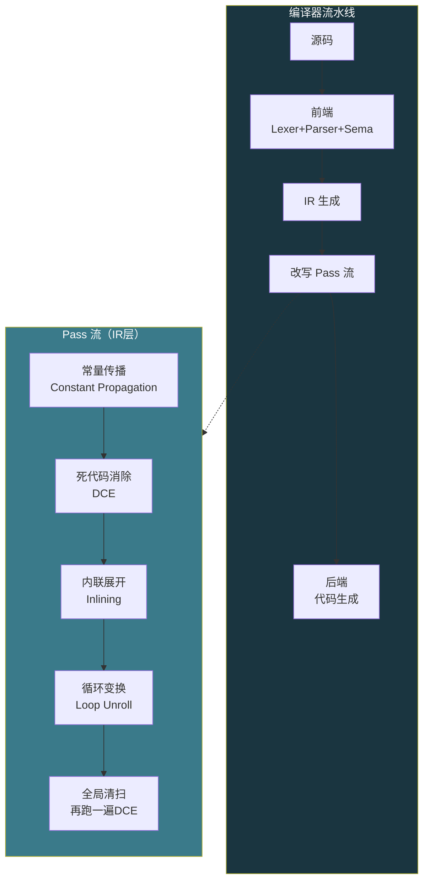

# 【化神·132】编译优化：让生成的代码跑得更快

> **码农修仙传 · 化神期 · 第132篇**
> 我是玄芯散人，带你从炼气修到大乘。

---

## 境界标识

```
╔══════════════════════════════════╗
║     化神期 · 第132篇             ║
║     编译优化                      ║
║     常量折叠+死代码消除           ║
║     循环优化+内联展开             ║
║     预计阅读：20分钟              ║
╚══════════════════════════════════╝
```

---

## 修仙引入

上一篇代码生成器吐出来的汇编，能跑，但很丑。大量多余的 push/pop，能编译期算的结果留到运行时算，能删掉的死代码还挂在那里占空间。就好比炼丹炉里炼出来的丹药还带着炉渣，药效能用但不够纯。

编译器在 IR 上跑一系列 pass（遍），每个 pass 扫一遍中间代码，发现可以改的地方就改。改完之后再送去生成机器指令。这一篇拆解几种最常见的改写手段，然后看 GCC 和 LLVM 的 -O0 到 -O3 各开了哪些 pass。

---

## 硬核主体

### 改写发生在哪里

代码生成之前，编译器已经把源码翻译成了 IR。改写就发生在 IR 这一层，不在 AST 上做，也不在汇编上做。原因是 IR 跟机器无关，处理逻辑可以复用到不同硬件上。



每个 pass 读入 IR，做一些变换，输出新的 IR。pass 之间可以反复跑，比如内联展开后会暴露出新的常量折叠机会，常量折叠后又产生新的死代码可以消除。所以这是个迭代过程，跑到没有变化为止（不动点）。

### 常量折叠：编译期算完

如果表达式的操作数全是常量，编译器直接在编译期算出结果，不生成运行时计算指令。

```c
// 源码
int x = 3 * 4 + 5;

// 没有常量折叠的IR
%1 = mul i32 3, 4        ; 3 * 4
%2 = add i32 %1, 5       ; %1 + 5
store i32 %2, ptr %x     ; 存到x

// 常量折叠后
store i32 17, ptr %x     ; 直接存17
```

常量折叠的判断逻辑：如果一条指令的所有操作数都是常量，就在编译期执行这条指令，用结果替换掉这条指令。

```c
// 常量折叠的简化实现
// 遍历IR，找到操作数全是常量的指令
typedef enum {
    INST_ADD,
    INST_MUL,
    INST_SUB,
    INST_DIV,
} InstKind;

typedef struct {
    InstKind kind;
    int op1_is_const;
    int op1_val;
    int op2_is_const;
    int op2_val;
    int result_reg;      // 结果存到哪个虚拟寄存器
    int has_side_effect; // 是否有副作用（store/call/ret/br）
} IRInst;

// 返回1表示折叠了，0表示没折叠
int constant_fold(IRInst *inst) {
    if (!inst->op1_is_const || !inst->op2_is_const)
        return 0;

    int result;
    switch (inst->kind) {
    case INST_ADD: result = inst->op1_val + inst->op2_val; break;
    case INST_SUB: result = inst->op1_val - inst->op2_val; break;
    case INST_MUL: result = inst->op1_val * inst->op2_val; break;
    case INST_DIV:
        if (inst->op2_val == 0) return 0; // 除零不折叠
        result = inst->op1_val / inst->op2_val;
        break;
    default: return 0;
    }

    // 把这条指令替换成"加载常量"
    // 实际实现应新增 INST_LOAD_IMM 类型，这里简化复用
    inst->kind = INST_ADD;  // 标记为已折叠
    inst->op1_is_const = 1;
    inst->op1_val = result;
    inst->op2_is_const = 0;
    return 1;
}
```

常量折叠有个近亲叫常量传播（Constant Propagation）。如果编译器能推断出某个变量在此刻的值确定是常量，就把用到这个变量的地方替换成常量，然后再做折叠。

```c
// 源码
int a = 10;
int b = a + 5;
int c = b * 2;

// 常量传播 + 折叠后
// a = 10 (常量)
// b = 10 + 5 = 15 (传播a的值，折叠)
// c = 15 * 2 = 30 (传播b的值，折叠)
// 最终只剩: store 30 to c
```

LLVM 里做这件事的 pass 叫 SCCP（Sparse Conditional Constant Propagation），由 Wegman 和 Zadeck 在1985年 POPL 会议上首次提出（1991年 TOPLAS 期刊扩展版）。SCCP 把常量传播和可达性判断合在一起，能同时发现"这段代码永远不会执行"和"这个变量永远是某个常量"。

### 死代码消除：删掉没用的

程序里有几种"死代码"：赋值了但没人用的变量，永远走不到的分支，调用后返回值被丢弃的函数。

```c
// 源码
int foo(int x) {
    int a = x + 1;    // a赋值后没人用
    int b = x * 2;
    return b;
    int c = 99;       // return之后的代码，永远执行不到
}
```

死代码消除（Dead Code Elimination，DCE）的判断逻辑：找出程序的输出点（return 值，写全局变量，I/O 操作），然后反向追踪哪些指令对最终结果有贡献。没贡献的就是死代码，删掉。

```c
// 死代码消除的简化实现
// mark阶段：标记所有"有副作用"的指令为活跃
void dce_mark(IRInst *insts, int n, int *alive) {
    // 从后往前扫描
    for (int i = n - 1; i >= 0; i--) {
        IRInst *inst = &insts[i];

        // 有副作用的指令：store, call, ret, br等
        if (inst->has_side_effect) {
            alive[i] = 1;
            // 标记它用到的操作数对应的定义指令也活跃
            mark_operands(inst, insts, alive);
            continue;
        }

        // 如果结果被后面的活跃指令用到，这条也活跃
        if (is_used_by_alive(inst, insts, alive, n)) {
            alive[i] = 1;
            mark_operands(inst, insts, alive);
        }
        // 否则alive[i]保持0，后面sweep阶段删除
    }
}

// sweep阶段：删除没标记的指令
int dce_sweep(IRInst *insts, int n, int *alive) {
    int write = 0;
    for (int i = 0; i < n; i++) {
        if (alive[i]) {
            insts[write++] = insts[i];  // 保留
        }
        // else: 删除
    }
    return write;  // 新的指令数量
}
```

DCE 经常跟常量传播配合用。常量传播后有些变量变成常量了，原来用到这些变量的地方被替换成常量，于是变量的定义变成了死代码。DCE 删掉它，又可能暴露出新的常量传播机会。所以这两个 pass 要交替跑。

### 内联展开：把函数体贴过去

函数调用有开销：保存寄存器，传参数，跳转，返回时恢复寄存器。如果被调用的函数很短，调用开销可能比函数体本身还大。

```c
// 源码
static inline int square(int x) {
    return x * x;
}

int area(int w, int h) {
    return square(w) * square(h);
}

// 内联展开后（伪IR）
int area(int w, int h) {
    // square(w) 的函数体贴过来
    int t1 = w * w;
    // square(h) 的函数体贴过来
    int t2 = h * h;
    return t1 * t2;
    // 没有call指令了，没有寄存器保存恢复了
}
```

内联的好处不只是省了调用开销。更有价值的是内联之后函数边界消失了，其他 pass 可以跨函数做变换。比如上面内联后，如果 w 和 h 是常量，常量传播可以直接算出最终结果。

```c
// 假设调用方是 area(3, 4)
// 内联后常量传播可以算出：
// t1 = 3 * 3 = 9
// t2 = 4 * 4 = 16
// return 9 * 16 = 144
// 整个函数变成 return 144
```

内联的决策不好做。函数太大，内联后代码膨胀，指令缓存命中率下降。函数太小，不内联亏了调用开销。编译器用启发式规则判断：看函数的指令数（inline cost），看调用点出现的频率（循环里的调用优先内联），看函数是否递归（递归不能无限内联）。

GCC 用 `-finline-small-functions` 在 -O2 以上开启，`-finline-functions` 在 -O3 开启。LLVM 的内联 pass 在 -O2 以上默认开启，用成本估算决定哪些函数内联。LLVM 还支持 always_inline 属性强制内联，noinline 属性禁止内联。

### 循环变换：省迭代开销

循环是程序里执行最频繁的代码，循环体里省一条指令，整个循环跑一万次就省一万条。循环变换有好几种，挑几个最常见的讲。

#### 循环不变量外提（Loop-Invariant Code Motion）

如果循环体里有个计算不依赖循环变量，每次迭代结果都一样，把它提到循环外面算一次。

```c
// 源码
for (int i = 0; i < 100; i++) {
    a[i] = b * c + a[i];   // b*c每次迭代都一样
}

// 变换后
int tmp = b * c;            // 提到循环外
for (int i = 0; i < 100; i++) {
    a[i] = tmp + a[i];
}
```

#### 循环展开（Loop Unrolling）

把循环体复制几份，减少循环次数，减少分支判断和跳转的开销。

```c
// 源码
for (int i = 0; i < 100; i++) {
    a[i] = i;
}

// 展开4次后
for (int i = 0; i < 100; i += 4) {
    a[i] = i;
    a[i+1] = i + 1;
    a[i+2] = i + 2;
    a[i+3] = i + 3;
}
// 循环从100次降到25次，少了75次条件判断和跳转
```

展开不是越多越好。展开太多会增大代码体积，指令缓存装不下反而变慢。GCC 用 `-funroll-loops` 控制（-O3 不默认开，-O2 也不开，需要手动加），LLVM 的 unroll pass 在 -O2 以上默认开启，有动态成本估算决定展开几次。

#### 强度削减（Strength Reduction）

把昂贵的运算替换成便宜的。最常见的做法是用加法替代乘法。

```c
// 源码
for (int i = 0; i < 100; i++) {
    int x = i * 4;
    // ...
}

// 强度削减后
for (int i = 0, x = 0; i < 100; i++) {
    // 用x += 4替代 i * 4
    // ...
    x += 4;
}
```

乘法在 x86 上需要 3-5 个周期，加法只要 1 个周期。在 ARM Cortex-M0 这种没有硬件乘法器的芯片上差异更大，乘法可能要几十个周期。强度削减在这种场合收益巨大。


### -O0 到 -O3：每个级别开了什么

GCC 和 LLVM 都有 -O0 到 -O3 四个级别（外加 -Os 和 -Oz），每个级别开启不同的 pass 组合。

#### -O0（不做处理）

默认级别，不做任何改写。生成的代码跟源码一一对应，变量在栈上老老实实存，指令顺序跟 AST 遍历顺序一致。调试用这个级别，断点能准确对应到源码行。

#### -O1（轻度处理）

做一些低风险的改写，编译时间短。包括常量折叠和死代码消除和基本的内联。LLVM 的 -O1 跑几十个 pass（统计口径不同，新版 PassManager 数量有变化）。

#### -O2（标准级别）

大多数项目发布的默认级别。在 -O1 基础上加入了循环变换，还有指令调度和更激进的内联。GCC 的 -O2 开启约 50 个 pass，LLVM 的 -O2 上百个（统计口径不同）。编译时间比 -O1 长，生成的代码明显更快。

#### -O3（激进处理）

在 -O2 基础上加入了循环展开和向量化（自动 SIMD）以及更激进的 inline。代码体积会增大，某些情况下反而比 -O2 慢（指令缓存 miss）。Linux 内核默认用 -O2，不推荐用 -O3。

#### -Os（缩减体积）

跟 -O2 类似但关闭会增大代码体积的 pass（比如循环展开）。嵌入式系统常用，Flash 空间有限。

#### -Oz（最小体积，仅 Clang）

比 -Os 更激进地减小代码体积。

```c
// 一个简单的例子展示不同级别的差异
#include <stdio.h>

int sum_array(int *arr, int n) {
    int sum = 0;
    for (int i = 0; i < n; i++) {
        sum += arr[i];
    }
    return sum;
}

int main(void) {
    int arr[4] = {1, 2, 3, 4};
    printf("%d\n", sum_array(arr, 4));
    return 0;
}
```

用 GCC 编译，看不同级别的汇编输出：

```bash
# -O0：循环老老实实跑，数组逐个加
gcc -O0 -S test.c -o test_O0.s

# -O2：编译器可能把循环展开成4条加法
gcc -O2 -S test.c -o test_O2.s

# -O3：可能进一步向量化（虽然4个元素太少，可能不会）
gcc -O3 -S test.c -o test_O3.s
```

对比汇编输出，-O0 版本可能有 20 多条指令，-O2 版本可能只有 10 条左右。但这个例子太小，改写空间有限。在大型项目里，-O2 相比 -O0 可能有 20%-30% 的性能提升。

### 改写不是免费的

改写带来性能，也带来副作用：

1. 调试困难。-O1 以上，变量可能被处理掉，断点可能跳行，单步可能乱跳。gdb 调试推荐用 -O0 -g。
2. 代码体积膨胀。内联和循环展开都会增大代码。嵌入式 Flash 不够时用 -Os。
3. 编译时间增加。-O2 编译时间可能是 -O0 的 3-5 倍，-O3 可能到 10 倍。大型项目 CI/CD 要考虑这个。
4. 语义变化的风险。标准允许的改写可能改变行为。比如编译器可能合并或重排对 volatile 变量的访问（虽然标准说不应该，但历史上出过 bug）。还有有符号整数溢出是未定义行为，编译器假设不会溢出，可能做出跟开发者预期不同的处理。

```c
// 一个经典的"改写导致意外行为"的例子
int check_overflow(int a, int b) {
    int sum = a + b;
    if (sum < a) {       // 检查溢出
        return -1;       // 溢出了
    }
    return sum;
}

// -O2 下，GCC/Clang 可能直接删掉 if 判断
// 因为有符号整数溢出是UB，编译器假设不溢出
// 所以 sum < a 永远为假，死代码消除删掉了
// 结果：这个溢出检查在 -O2 下失效
```

这种坑在 C 语言里不少见。解决办法：用 unsigned 做溢出检查，或者用编译器内置函数 `__builtin_add_overflow()`。

---

## 修仙术语对照表

| 修仙术语 | 技术现实 | 本篇位置 |
|----------|---------|---------|
| 提纯 | 编译器改写去掉冗余指令 | 修仙引入节 |
| 炼丹炉渣 | 未处理的多余push/pop和冗余计算 | 修仙引入节 |
| 遍炉提纯 | pass流水线反复跑到不动点 | 改写在哪里节 |
| 炼神返虚 | 常量折叠编译期算出结果 | 常量折叠节 |
| 灵力传递 | 常量传播把变量替换成已知值 | 常量折叠节 |
| 斩除虚影 | 死代码消除删掉无用指令 | 死代码消除节 |
| 化身术 | 内联展开把函数体贴到调用点 | 内联展开节 |
| 分身破阵 | 内联后跨函数边界做变换 | 内联展开节 |
| 定身法 | 循环不变量外提减少重复计算 | 循环变换节 |
| 分影连击 | 循环展开减少迭代次数 | 循环变换节 |
| 以柔克刚 | 强度削减用加法替代乘法 | 循环变换节 |
| 心法层级 | -O0到-O3级别 | 级别对比节 |
| 走火入魔 | 改写导致的UB行为变化 | 改写不是免费节 |

---

## 突破条件

- [ ] 能用 `gcc -O0 -S` 和 `gcc -O2 -S` 对比同一段 C 代码的汇编输出，指出改写器做了哪些改动
- [ ] 能手写常量折叠逻辑：给定一组 IR 指令，标出哪些可以被折叠成常量
- [ ] 能解释常量传播和常量折叠的区别，以及为什么它们需要交替执行
- [ ] 能画出死代码消除的 mark-and-sweep 流程，指出哪些指令是"有副作用"的
- [ ] 能实现一个简单的函数内联 pass，处理参数替换和返回值替换
- [ ] 能解释循环不变量外提的判断条件：什么样的表达式可以提到循环外面
- [ ] 能说出 -O0 到 -O3 各开了哪些主要 pass，以及 -Os 跟 -O2 的区别
- [ ] 能举出一个"改写改变程序行为"的例子，解释 UB 在其中扮演的角色

> pass 像炼丹的反复提纯，跑一遍不够，要跑到没有变化为止。下一篇离开编译器，开始造数据库引擎，看看存储引擎是怎么搭起来的。

---

## 下期预告 + 互动

> 下一篇：【化神·133】数据库引擎从零开始有多难
>
> 编译器系列到此告一段落。接下来进入化神期第二大主题：造数据库。B+ 树怎么实现，WAL 日志怎么保证崩溃恢复，事务 ACID 说着简单做着难。从零写一个能跑的存储引擎，需要哪些零件。

现在问你：

> 🔍 你项目里用 -O2 还是 -O3？有没有遇到过 -O2 能跑 -O3 崩的情况？
>
> 📌 做嵌入式的同学，你们用 -Os 还是 -O2？Flash 够用吗？
>
> 评论区聊聊你的编译级别选择。

> 我是玄芯散人，带你从炼气修到大乘。

---

*本文是「码农修仙传」系列第132篇。系列导航见 [xren.ren](https://xren.ren)*
