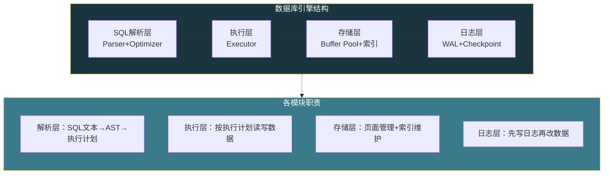
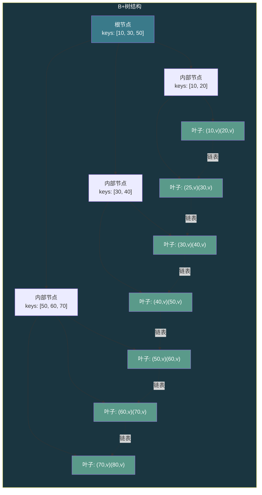
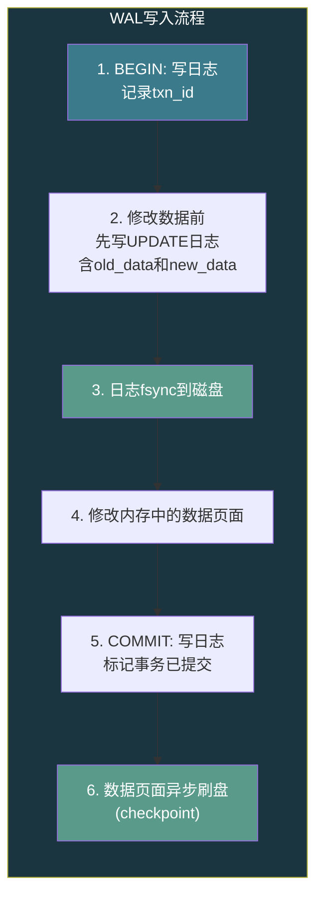

# 【化神·133】数据库引擎从零开始有多难

> **码农修仙传 · 化神期 · 第133篇**
> 我是玄芯散人，带你从炼气修到大乘。

---

## 境界标识

```
╔══════════════════════════════════╗
║     化神期 · 第133篇             ║
║     数据库引擎从零开始有多难     ║
║     B+树+WAL+ACID+MVCC          ║
║     预计阅读：22分钟              ║
╚══════════════════════════════════╝
```

---

## 修仙引入

筑基期讲数据库时，只说了SQL怎么写，索引为什么快。那时候数据库是一个黑箱，往里塞数据就能查出来。到了化神期，黑箱要拆开了。你问自己一个问题：给我一台电脑，不装MySQL，不装PostgreSQL，能不能从零写一个引擎，能存数据，能查数据，崩了不丢数据？

这个问题听着简单，做起来能把人逼疯。一个生产级数据库引擎的源码量，SQLite大约50万行C代码，PostgreSQL超过100万行。但拆开看，它的骨架并不复杂。复杂的是骨架上每一块肉怎么长，每一个边界条件怎么处理。

这一篇不写全部实现，那是一本书的量。这里拆解引擎的四个模块，看每个模块解决什么问题，怎么解决，难点在哪。

---

## 硬核主体

### 引擎骨架：四个模块

一个数据库引擎做三件事：接SQL，存数据，保证不丢。围绕这三件事，引擎分成四个模块：



解析层跟编译器前端几乎一样，词法切token，语法建AST，语义检查表名列名是否存在。化神期127到132讲编译器时已经覆盖了这些流程，这里不重复，重点讲后面三个模块。

### 存储层：B+树怎么组织数据

数据库的数据存在磁盘上，磁盘的最小读写单位是扇区（512字节）或块（4KB）。数据库引擎用页面（page）来管理，一个页面通常4KB或8KB或16KB。MySQL InnoDB默认16KB，PostgreSQL默认8KB，SQLite默认4KB。

为什么用页面而不是直接按字节读写？因为磁盘的随机读写太慢了。机械硬盘一次寻道大约10ms，SSD虽然没有机械寻道，但仍然有擦写放大的问题。把数据按固定大小的页面组织，一次读一个页面进来改，改完写回去，减少IO次数。

数据在页面里怎么组织？大多数数据库用B+树。

#### B+树 vs B树

B树（B-tree）每个节点既存key也存value。B+树只有叶子节点存value，内部节点只存key，用来做路由。

```c
// B+树节点结构（简化版）
#define BPLUS_ORDER 4  // 阶数

typedef struct BPNode {
    int is_leaf;           // 是否叶子节点
    int num_keys;          // 当前key数量
    int keys[BPLUS_ORDER]; // key数组
    // 内部节点：children指向子节点
    // 叶子节点：values存实际数据
    union {
        struct BPNode *children[BPLUS_ORDER + 1];  // 内部节点用
        struct {
            char values[BPLUS_ORDER][256];  // 叶子节点存数据
            struct BPNode *next;            // 叶子节点链表，范围查询用
        } leaf;
    } u;
} BPNode;
```

B+树把所有数据放在叶子节点，内部节点只做路由。这样做有三个好处：

1. 内部节点不存value，同样大小的页面能放更多key，树更矮。一棵16KB页面的B+树，内部节点能放几百个key，3层就能存上千万条记录。
2. 叶子节点用链表串起来，范围查询只需要找到起始叶子，然后顺着链表走，不用回到根节点。
3. 所有数据都在同一层，查询路径长度固定，性能稳定。



#### B+树插入：分裂最难搞

插入新数据时，从根节点往下找到对应的叶子节点，把数据塞进去。如果叶子节点满了（key数量超过阶数），就要分裂。

```c
// B+树叶子节点分裂（简化版）
// node: 满了的叶子节点
// 返回分裂后的新节点
BPNode *leaf_split(BPNode *node) {
    BPNode *new_node = bp_alloc(0);  // 0=叶子
    int mid = node->num_keys / 2;

    // 右半部分搬到新节点
    new_node->num_keys = node->num_keys - mid;
    for (int i = 0; i < new_node->num_keys; i++) {
        new_node->keys[i] = node->keys[mid + i];
        memcpy(new_node->u.leaf.values[i],
               node->u.leaf.values[mid + i], 256);
    }
    node->num_keys = mid;

    // 叶子链表插入新节点
    new_node->u.leaf.next = node->u.leaf.next;
    node->u.leaf.next = new_node;

    // 父节点要插入新节点的第一个key
    // 如果父节点也满了，继续向上分裂
    // 最坏情况：一路分裂到根，根也分裂，树高+1
    return new_node;
}
```

分裂可能级联。叶子满了分裂，父节点也要插入一个key，如果父节点也满了继续分裂，一直传到根。这是B+树实现里最容易出bug的地方。分裂时页面的修改必须是原子的，否则中途崩溃会导致数据损坏。怎么保证原子性？这就引出了日志层。

### 日志层：WAL先写日志

WAL（Write-Ahead Logging）是数据库崩溃恢复的底线机制。规则只有一条：先写日志，再改数据。

改一个数据页面之前，先把"要改什么"写进日志文件。日志写完后（必须fsync到磁盘），再去改数据页面。如果改数据页面时崩溃了，重启时读日志，把没做完的修改重新做一遍。

```c
// WAL日志记录结构（简化版）
typedef struct WALRecord {
    uint32_t magic;       // 魔数，校验文件头
    uint32_t txn_id;      // 事务ID
    uint32_t page_no;     // 要改哪个页面
    uint32_t offset;      // 页面内偏移
    uint16_t data_len;    // 数据长度
    uint16_t type;        // 记录类型：BEGIN/UPDATE/COMMIT/ABORT
    uint8_t  old_data[];  // 修改前的数据（undo）
    uint8_t  new_data[];  // 修改后的数据（redo）
    uint32_t checksum;    // 校验和
} WALRecord;
// 注：这是ARIES风格的混合日志（physiological logging）
// 实际InnoDB的redo和undo日志是分开存储的
```

一条日志记录包含两个数据：old_data（改之前的内容）和new_data（改之后的内容）。old_data用于undo（回滚未提交的事务），new_data用于redo（重做已提交但没写回磁盘的修改）。这就是redo/undo日志。



WAL有个性能问题：每次事务提交都要fsync日志文件。fsync很慢，机械盘大约5-10ms，SSD大约0.1-1ms。如果每个事务都等fsync，TPS（每秒事务数）上不去。数据库引擎用几种手段缓解：

1. 组提交（Group Commit）：多个事务的日志攒一批，一次fsync。PostgreSQL和MySQL都支持。
2. 异步提交：事务提交不等fsync就返回，崩溃可能丢最近几百毫秒的事务。PostgreSQL的`synchronous_commit=off`就是这个模式。
3. WAL日志本身用B+树或顺序追加文件组织，顺序写比随机写快得多。

#### Checkpoint：日志不能无限长

如果日志永远不清理，重启恢复时要重放所有日志，启动时间会越来越长。Checkpoint就是划一条线：到这条线为止的数据修改都已经刷到磁盘了，之前的日志可以丢掉。

```c
// 简化的checkpoint流程
void checkpoint(BufferPool *pool, WAL *wal) {
    // 1. 标记当前LSN（日志序列号）
    uint64_t lsn = wal_current_lsn(wal);

    // 2. 把buffer pool中所有脏页刷到磁盘
    // 脏页：被修改过但还没写回磁盘的页面
    buffer_pool_flush_all(pool);

    // 3. 写一条checkpoint记录到WAL
    // 记录当前LSN和活跃事务列表
    wal_write_checkpoint(wal, lsn);

    // 4. fsync日志（确保checkpoint记录落盘）
    wal_fsync(wal);

    // 5. 之前的日志可以回收（实际通常异步回收，不是立即截断）
    wal_truncate(wal, lsn);
}
```

Checkpoint本身也有崩溃风险。如果在刷脏页的过程中崩溃，部分页面已写盘，部分没写。重启时从最近的checkpoint开始重放日志，重新做没写完的部分。日志里的每条记录都有LSN（Log Sequence Number），页面头部也记录最后一次修改它的LSN，恢复时对比LSN就知道哪些修改已经生效、哪些需要重做。

### 事务层：ACID不是口号

ACID是数据库事务的四个属性。听起来像四个独立的东西，实际上它们交织在一起。

A（原子性）：事务要么全做要么全不做。靠undo日志实现，回滚时用old_data恢复。

C（一致性）：事务前后数据满足约束。一致性是业务层的目标，原子性和隔离性保证了一致性。

I（隔离性）：并发事务互不干扰。靠锁和MVCC实现。

D（持久性）：提交的数据不会丢。靠WAL日志+fsync实现。

四个里面，隔离性最难搞。

#### 隔离级别和并发问题

并发事务会产生几种问题：

- 脏读：事务A读到了事务B未提交的数据，B回滚了，A读到的就是脏数据。
- 不可重复读：事务A两次读同一行，中间事务B改了这行，两次结果不一样。
- 幻读：事务A两次查询同一条件，中间事务B插入了一行满足条件的记录，第二次多了一行。

SQL标准定义了四种隔离级别来应对：

| 隔离级别 | 脏读 | 不可重复读 | 幻读 |
|---------|------|----------|------|
| Read Uncommitted | 可能 | 可能 | 可能 |
| Read Committed | 避免 | 可能 | 可能 |
| Repeatable Read | 避免 | 避免 | 可能 |
| Serializable | 避免 | 避免 | 避免 |

PostgreSQL默认Read Committed，MySQL InnoDB默认Repeatable Read，SQLite默认Serializable（但SQLite是单写者方式，实际上没有并发写）。

#### MVCC：不阻塞读也不阻塞写

实现隔离性最朴素的方法是加锁：读时加读锁，写时加写锁，读写互斥。但这样并发度太低，读多写少时性能很差。

MVCC（Multi-Version Concurrency Control）换了个思路：同一行数据保留多个版本，每个事务看到自己那个版本。读操作不阻塞写操作，写操作也不阻塞读操作。

```c
// MVCC版本链示意（简化版）
typedef struct RowVersion {
    uint64_t xmin;        // 创建此版本的事务ID
    uint64_t xmax;        // 删除此版本的事务ID（0表示未删除）
    char    *data;        // 实际数据
    struct RowVersion *next;  // 指向更老的版本
} RowVersion;

// 事务T读取某行时，判断这个版本对T是否可见
int version_visible(RowVersion *ver, Transaction *t) {
    // 规则1: 版本的创建者是自己 → 可见（自己改的自己能看）
    if (ver->xmin == t->id) {
        if (ver->xmax == 0 || ver->xmax == t->id)
            return 1;  // 未被删除或被自己删除
        return 0;
    }
    // 规则2: 版本的创建事务已提交且在T开始前 → 可见
    if (txn_is_committed(ver->xmin) && ver->xmin < t->snapshot_xmin) {
        if (ver->xmax == 0)
            return 1;  // 未被删除
        if (!txn_is_committed(ver->xmax) || ver->xmax >= t->snapshot_xmin)
            return 1;  // 删除者未提交或在T开始后提交 → 还活着
    }
    return 0;
}
```

PostgreSQL的MVCC实现就是这个思路，每行数据带xmin和xmax两个事务ID。事务开始时拍一个快照，记录当前活跃事务列表。读数据时根据快照判断哪个版本可见。MySQL InnoDB的MVCC类似，但在undo日志里存旧版本而不是在数据页面里。

MVCC的代价是旧版本需要清理。PostgreSQL的VACUUM进程负责清理已经没有事务需要看到的旧版本。如果VACUUM跟不上，表会膨胀，查询变慢。这是PostgreSQL运维的经典痛点。

### 从零写一个引擎要多久

SQLite的作者Richard Hipp在2000年开始写SQLite，第一版用了大约一年。但那是个能用的玩具，距离生产级还差很远。SQLite至今还在迭代，24年了。

一个能存数据能查数据的玩具引擎，如果只实现B+树插入查询，不做事务和崩溃恢复，一个有经验的人大概两三周能写出来。加上WAL和基本的崩溃恢复，两三个月。再加上MVCC和SQL解析，半年到一年。

如果目标是做一个能跟MySQL/PostgreSQL竞争的生产级引擎，那是几十人年的工作量。

差距在哪里？边界条件。B+树插入的分裂逻辑，玩具版写50行搞定，生产版要处理并发分裂和页面锁以及分裂中途崩溃恢复。WAL的玩具版就是追加写文件，生产版要处理日志段管理和并发提交以及流水线化。每个模块的边界条件数量是正常逻辑的十倍。

---

## 修仙术语对照表

| 修仙术语 | 技术现实 | 本篇位置 |
|----------|---------|---------|
| 黑箱 | 数据库引擎内部实现 | 修仙引入节 |
| 骨架 | 引擎四模块结构 | 引擎骨架节 |
| 炼器 | 数据库引擎开发 | 修仙引入节 |
| 藏经阁分卷 | B+树页面分裂 | 存储层节 |
| 阵法分层 | B+树内部节点路由 | 存储层节 |
| 灵脉串联 | 叶子节点链表范围查询 | 存储层节 |
| 留痕 | WAL先写日志 | 日志层节 |
| 前世今生 | undo/redo日志 | 日志层节 |
| 划线为界 | checkpoint截断日志 | 日志层节 |
| 因果锁 | ACID隔离性 | 事务层节 |
| 分身术 | MVCC多版本共存 | 事务层节 |
| 旧影消散 | VACUUM清理旧版本 | 事务层节 |
| 走火入魔 | 分裂中途崩溃 | 存储层节 |
| 炼丹周期 | 玩具到生产级耗时 | 造引擎节 |

---

## 进阶条件

- [ ] 能画出B+树的结构，解释为什么内部节点不存value
- [ ] 能手写B+树插入逻辑，包括叶子节点分裂和父节点key更新
- [ ] 能解释WAL的redo/undo日志各解决什么问题，为什么先写日志再改数据
- [ ] 能描述checkpoint的流程，解释为什么checkpoint时要刷脏页
- [ ] 能说出四种隔离级别分别避免什么并发问题
- [ ] 能画出MVCC的版本可见性判断规则，解释xmin和 xmax的用途
- [ ] 能估算一个玩具引擎和生产引擎的工作量差距，说出差距在哪些方面

> 引擎骨架搭好了，下一篇深入B+树细节，看插入删除时的分裂合并逻辑怎么实现，为什么数据库选B+树而不是哈希表或跳表。

---

## 下期预告 + 互动

> 下一篇：【化神·134】B+树：数据库索引怎么选
>
> B树和B+树长得很像，差一个加号，实现难度差好几倍。叶子节点链表怎么维护，节点分裂时父节点怎么更新，删除时什么时候需要合并。为什么MySQL和PostgreSQL都选B+树，哈希索引和跳表为什么不够用。

现在问你：

> 🔍 你用过的数据库，页面大小是多少？知道为什么这么设吗？
>
> 📌 你遇到过VACUUM跑太久导致业务卡顿的情况吗？怎么处理的？
>
> 评论区聊聊你的数据库踩坑经历。

> 我是玄芯散人，带你从炼气修到大乘。

---

*本文是「码农修仙传」系列第133篇。系列导航见 [xren.ren](https://xren.ren)*
