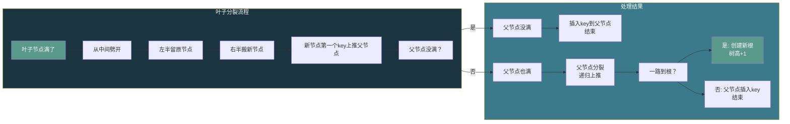
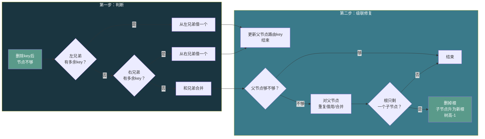
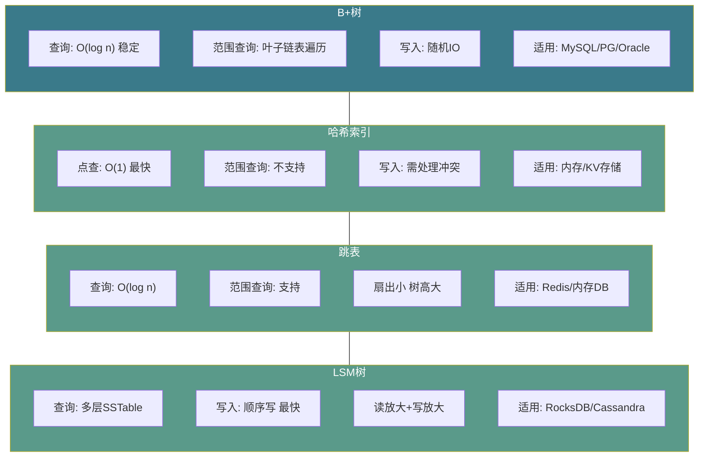

# 【化神·134】B+树：数据库索引怎么选

> **码农修仙传 · 化神期 · 第134篇**
> 我是玄芯散人，带你从炼气修到大乘。

---

## 境界标识

```
╔══════════════════════════════════╗
║     化神期 · 第134篇             ║
║     B+树：数据库索引怎么选       ║
║     分裂·合并·借用·扇出          ║
║     预计阅读：18分钟              ║
╚══════════════════════════════════╝
```

---

## 修仙引入

上一篇拆了数据库引擎的骨架，四个模块过了一遍。B+树那一节只讲了插入和分裂，删除提都没提。这就像炼器只学了半个锤子，另一半还没摸过。

数据库索引为什么非得是B+树？哈希表O(1)不香吗？跳表实现简单还快，为什么不选？B树和B+树就差一个加号，凭什么数据库全选B+树？这些问题，不手写一遍B+树的插入删除分裂合并，答不上来。

这一篇深入B+树本身，从节点结构讲起，把插入的分裂以及删除的借用和合并全部走一遍，最后回答：为什么是B+树。

---

## 硬核主体

### B+树的阶和约束

上一篇讲了B+树的基本结构（内部节点只存key，叶子存value且用链表连接）。这里深入细节。

B+树有一个参数叫阶（order），通常用m表示。一个m阶B+树满足这些约束：

- 每个节点最多有m个key
- 每个内部节点最少有⌈m/2⌉个key（根节点除外，根至少1个key）
- 叶子节点最少有⌈m/2⌉个key
- 内部节点有k个key就有k+1个子节点
- 所有叶子节点在同一层，用链表连接

阶不是随便选的。阶决定了一个页面能放多少个key，直接影响树高和IO次数。数据库引擎的阶通常由页面大小和key大小决定，不是人工设定的参数。

### 插入：分裂的连锁反应

插入的思路：从根往下找到目标叶子节点，把key放进去。如果叶子节点满了（key数量等于阶数），分裂。

上一篇133讲过叶子分裂的代码，这里补上分裂后父节点更新的完整逻辑：

```c
// B+树插入（简化版，阶数为m）
// 返回：0成功，1表示根节点分裂需创建新根
int bp_insert(BPNode *root, int key, void *value, int m) {
    // 1. 从根往下找到目标叶子节点
    BPNode *leaf = find_leaf(root, key);

    // 2. 在叶子节点中按序插入key和value
    int pos = 0;
    while (pos < leaf->num_keys && leaf->keys[pos] < key)
        pos++;
    for (int i = leaf->num_keys; i > pos; i--)
        leaf->keys[i] = leaf->keys[i - 1];
    leaf->keys[pos] = key;
    leaf->num_keys++;

    // 3. 如果没满，结束
    if (leaf->num_keys < m) return 0;

    // 4. 满了，分裂
    BPNode *new_leaf = leaf_split(leaf, m);
    int split_key = new_leaf->keys[0];  // 上推的key

    // 5. 把split_key插入父节点
    // 如果父节点也满，继续向上分裂
    // 最坏情况：一路分裂到根，根分裂，树高+1
    return insert_into_parent(leaf, split_key, new_leaf, m);
}

// 往父节点插入分裂产生的新key
int insert_into_parent(BPNode *left, int key,
                       BPNode *right, int m) {
    BPNode *parent = left->parent;

    // 情况1：没有父节点，说明left是根，需要创建新根
    if (parent == NULL) {
        BPNode *new_root = bp_alloc(0);  // 0=内部节点
        new_root->keys[0] = key;
        new_root->children[0] = left;
        new_root->children[1] = right;
        new_root->num_keys = 1;
        left->parent = new_root;
        right->parent = new_root;
        return 1;  // 告诉调用者：根变了
    }

    // 情况2：父节点没满，直接插入
    if (parent->num_keys < m) {
        int pos = 0;
        while (pos < parent->num_keys &&
               parent->keys[pos] < key) pos++;
        for (int i = parent->num_keys; i > pos; i--) {
            parent->keys[i] = parent->keys[i - 1];
            parent->children[i + 1] = parent->children[i];
        }
        parent->keys[pos] = key;
        parent->children[pos + 1] = right;
        parent->num_keys++;
        return 0;
    }

    // 情况3：父节点也满，递归分裂
    // 内部节点分裂比叶子复杂：要处理children指针的搬运
    // 注意：内部节点分裂时，中间key上推到父节点，不保留在子节点中
    // （跟叶子分裂不同，叶子上推的是新节点第一个key的副本，原节点保留）
    BPNode *new_internal = internal_split(parent, key, right, m);
    int up_key = extract_split_key(new_internal);  // 取出上推key并从新节点删除
    return insert_into_parent(parent, up_key,
                              new_internal, m);
}
```

内部节点分裂有个坑。叶子分裂时，新叶子的第一个key要上推到父节点。但内部节点分裂时，上推的那个key要从新节点里删掉（它变成父节点的路由key，不在子节点里保留）。这个区别搞反了，树的结构就乱了。



### 删除：借和合并的博弈

删除比插入复杂。插入只有一种情况会改变树结构：满了分裂。删除有两种：少了要借，借不到才合并。

删除思路：找到目标叶子节点，删掉key。如果删完后key数量少于⌈m/2⌉，需要修复。修复有两条路：

1. **借用（redistribution）**：看左右兄弟节点有没有多余的key（多于⌈m/2⌉个），借一个过来。
2. **合并（merge）**：兄弟也穷，借不了，把当前节点和兄弟合成一个。

```c
// B+树删除（简化版）
int bp_delete(BPNode *root, int key, int m) {
    BPNode *leaf = find_leaf(root, key);

    // 1. 找到key的位置并删除
    int pos = 0;
    while (pos < leaf->num_keys &&
           leaf->keys[pos] != key) pos++;
    if (pos >= leaf->num_keys) return -1;  // 没找到

    for (int i = pos; i < leaf->num_keys - 1; i++) {
        leaf->keys[i] = leaf->keys[i + 1];
        memcpy(leaf->u.leaf.values[i],
               leaf->u.leaf.values[i + 1], 256);
    }
    leaf->num_keys--;

    // 2. key数量够，结束
    int min_keys = (m + 1) / 2;  // ⌈m/2⌉
    if (leaf->num_keys >= min_keys) return 0;
    if (leaf->parent == NULL) return 0;  // 根节点没下限

    // 3. 尝试从左兄弟借
    BPNode *left_sib = get_left_sibling(leaf);
    if (left_sib && left_sib->num_keys > min_keys) {
        // 把左兄弟最后一个key搬到当前节点第一个位置
        for (int i = leaf->num_keys; i > 0; i--) {
            leaf->keys[i] = leaf->keys[i - 1];
            memcpy(leaf->u.leaf.values[i],
                   leaf->u.leaf.values[i - 1], 256);
        }
        int n = left_sib->num_keys - 1;
        leaf->keys[0] = left_sib->keys[n];
        memcpy(leaf->u.leaf.values[0],
               left_sib->u.leaf.values[n], 256);
        left_sib->num_keys--;
        leaf->num_keys++;

        // 更新父节点中的路由key
        update_parent_key(leaf->parent, left_sib,
                          leaf, leaf->keys[0]);
        return 0;
    }

    // 4. 尝试从右兄弟借
    BPNode *right_sib = get_right_sibling(leaf);
    if (right_sib && right_sib->num_keys > min_keys) {
        // 把右兄弟第一个key搬到当前节点末尾
        int n = leaf->num_keys;
        leaf->keys[n] = right_sib->keys[0];
        memcpy(leaf->u.leaf.values[n],
               right_sib->u.leaf.values[0], 256);
        leaf->num_keys++;

        // 右兄弟前移
        for (int i = 0; i < right_sib->num_keys - 1; i++) {
            right_sib->keys[i] = right_sib->keys[i + 1];
            memcpy(right_sib->u.leaf.values[i],
                   right_sib->u.leaf.values[i + 1], 256);
        }
        right_sib->num_keys--;

        // 更新父节点中的路由key
        update_parent_key(leaf->parent, leaf,
                          right_sib, right_sib->keys[0]);
        return 0;
    }

    // 5. 借不了，合并
    // 和左兄弟或右兄弟合成一个节点
    // 父节点中对应的路由key要删掉
    // 如果父节点删key后也不够，递归处理父节点
    return merge_nodes(leaf, left_sib, right_sib, m);
}
```

借用操作要注意父节点路由key的更新。从左兄弟借最后一个key过来，这个key变成了当前节点的最小key，父节点里分隔两个节点的路由key必须更新为这个新值。从右兄弟借第一个key过来，同理更新父节点里分隔的路由key。

合并比借用更重。两个节点合成一个，父节点少一个key少一个子节点指针。如果父节点删掉这个key后数量也不够了，继续对父节点做借用或合并。跟分裂一样，合并也会级联，最坏一路合并到根，根只剩一个子节点时删掉根，树矮一层。



### 为什么是B+树：四种索引结构对比

数据库索引不只B+树一种选择。哈希表和跳表以及LSM树都能做索引。为什么主流关系数据库（MySQL和PostgreSQL以及Oracle）都选B+树？

### 哈希索引

哈希表查单个key是O(1)，比B+树的O(log n)快。但哈希不支持范围查询。查id > 100的记录，哈希表只能把所有key遍历一遍。数据库的WHERE条件大量使用范围（>、<、BETWEEN），ORDER BY也需要有序访问。哈希索引处理不了这些。另外哈希的冲突处理在磁盘上实现代价很大，链表或开放寻址都涉及随机IO。

MySQL InnoDB不支持哈希索引，但有个自适应哈希索引（Adaptive Hash Index）的特性：引擎观察到某些页的查询特别频繁，自动在内存里建哈希表加速。这只是内存优化，不是磁盘上的索引结构。

### 跳表（Skip List）

跳表用概率替代指针调整，实现比B+树简单很多。查询复杂度O(log n)，跟B+树一个量级。Redis的Sorted Set用跳表，LevelDB的MemTable也用跳表。但跳表有个问题：每个节点只有几个指针，扇出小。一个16KB页面大约能放百来个跳表节点（每个节点50到80字节），远小于B+树千级扇出，树高（跳表层数）比B+树高，磁盘IO次数多。跳表适合内存用途，不适合磁盘用途。

### LSM树（Log-Structured Merge Tree）

LSM树把随机写变成顺序写，写性能远高于B+树。写操作先写内存表（MemTable，通常是跳表），满了之后刷到磁盘变成SSTable，后台合并。LevelDB和RocksDB以及Cassandra都用LSM树。

LSM树的代价在读。读操作要查MemTable，再查所有层级的SSTable，可能需要多次IO。虽然Bloom Filter能过滤掉大部分不存在的key，但范围查询和点查的尾延迟比B+树差。LSM树还有写放大问题（Compaction时反复读写数据）。

B+树的写性能不如LSM树（随机写），但读性能稳定，范围查询好用，适合读多写少的OLTP用途。MySQL和PostgreSQL的主打方向是OLTP，所以选B+树。



### B+树的参数选择

B+树的实际性能取决于参数。三个参数值得说。

### 页面大小

InnoDB默认16KB，PostgreSQL默认8KB，SQLite默认4KB。页面大，扇出大，树矮，IO少，但每次IO读的数据多，缓冲池能放的页面少。页面小，扇出小，树高，IO多，但缓冲池利用率高。选择取决于磁盘特性和工作负载类型。SSD的随机读延迟低，页面可以小一些。机械盘寻道慢，页面大一些减少IO次数。

### 填充因子（fill factor）

PostgreSQL允许设置fillfactor，默认100。如果设为80，插入时叶子页面只填到80%就停，留20%给后续UPDATE用（PostgreSQL的UPDATE实际是插入新版本行）。这样减少页面分裂频率，但空间浪费20%。写入密集的表可以降低fillfactor，读多写少的表保持100。

### 聚簇索引 vs 非聚簇索引

聚簇索引的叶子节点直接存数据行，非聚簇索引的叶子节点存主键值。InnoDB的主键索引是聚簇索引，二级索引是非聚簇索引。查二级索引再回主键索引拿数据，多一次IO。PostgreSQL的索引都是非聚簇的，数据存在堆表（heap）里，索引指向堆表的物理位置。

### B+树在真实数据库里的样子

纸上画的B+树跟数据库里的不完全一样。几个工程细节：

InnoDB的B+树节点不是简单的key数组。每个页面有页头（File Header），页体（Page Body），页尾（File Trailer）。页头存页面类型和前后页面指针以及LSN等信息。页尾存校验和，防止写了一半的页面被当成完好的用。实际能放key的空间比16KB小。

InnoDB的二级索引叶子节点存的是主键值而不是行数据。所以用二级索引查数据，先查二级索引拿主键，再查聚簇索引拿行。如果查询只需要索引列（覆盖索引），就不需要回表，省一次IO。

PostgreSQL的做法不同。索引指向堆表的CTID（Block号+Offset），不是主键值。所以PostgreSQL没有聚簇索引的概念，所有索引地位平等。好处是主键可以随便改（改了不用重建聚簇索引），坏处是范围扫描不如聚簇索引高效。

---

## 修仙术语对照表

| 修仙术语 | 技术现实 | 本篇位置 |
|----------|---------|---------|
| 阶 | B+树的order参数，决定每节点key上限 | 阶和约束节 |
| 扇出 | 一个内部节点的子节点数，决定树高 | 阶和约束节 |
| 分身不够了 | 节点key数量低于下限触发修复 | 删除节 |
| 借灵力 | 删除时从兄弟节点借用key | 删除节 |
| 合体 | 删除时两个节点合并成一个 | 删除节 |
| 级联分裂 | 插入时分裂由叶子传到根 | 插入节 |
| 级联合并 | 删除时合并由叶子传到根 | 删除节 |
| 阵眼上推 | 分裂时新节点的key插入父节点 | 插入节 |
| 树降一阶 | 根分裂后树高加1 | 插入节 |
| 树缩一层 | 合并到根后根删除树高减1 | 删除节 |
| 四大阵法 | B+树/哈希/跳表/LSM四种索引结构 | 四种对比节 |
| 灵力填充 | fillfactor填充因子控制页面预留空间 | 参数选择节 |
| 本命阵 | 聚簇索引叶子节点存数据行 | 参数选择节 |
| 分身阵 | 非聚簇索引叶子节点存主键或CTID | 参数选择节 |
| 回阵取物 | 二级索引查完再回聚簇索引拿数据 | 真实数据库节 |

---

## 进阶条件

- [ ] 能画出B+树和B树的结构差异，解释为什么B+树更适合磁盘存储
- [ ] 能计算给定页面大小和key大小情况下的B+树扇出和树高
- [ ] 能手写B+树插入逻辑，包括叶子分裂和内部节点分裂的级联处理
- [ ] 能手写B+树删除逻辑，区分借用和合并两种修复路径
- [ ] 能说出B+树内部节点分裂时上推key要从新节点删除的原因
- [ ] 能对比B+树和哈希索引以及跳表还有LSM树的查询和写入性能，解释各自适用情况
- [ ] 能解释InnoDB聚簇索引和PostgreSQL堆表索引的差异，以及覆盖索引为什么省一次IO

> B+树的分裂合并搞清楚了，下一篇看数据库事务怎么保证不乱。隔离级别和MVCC怎么实现，脏读幻读怎么挡住。

---

## 下期预告 + 互动

> 下一篇：【化神·135】事务和隔离级别：ACID不是口号
>
> 四种隔离级别分别挡住什么问题，MVCC怎么做到读写不阻塞，MySQL的RR为什么能防幻读（Gap Lock），PostgreSQL的Serializable怎么用SSI实现。

现在问你：

> 🔍 你在数据库里建索引时考虑过页面大小吗？还是从来不关注这个参数？
>
> 📌 你遇到过索引建了但查询没走索引的情况吗？事后发现原因是什么？
>
> 评论区聊聊你的索引踩坑经历。

> 我是玄芯散人，带你从炼气修到大乘。

---

*本文是「码农修仙传」系列第134篇。系列导航见 [xren.ren](https://xren.ren)*
