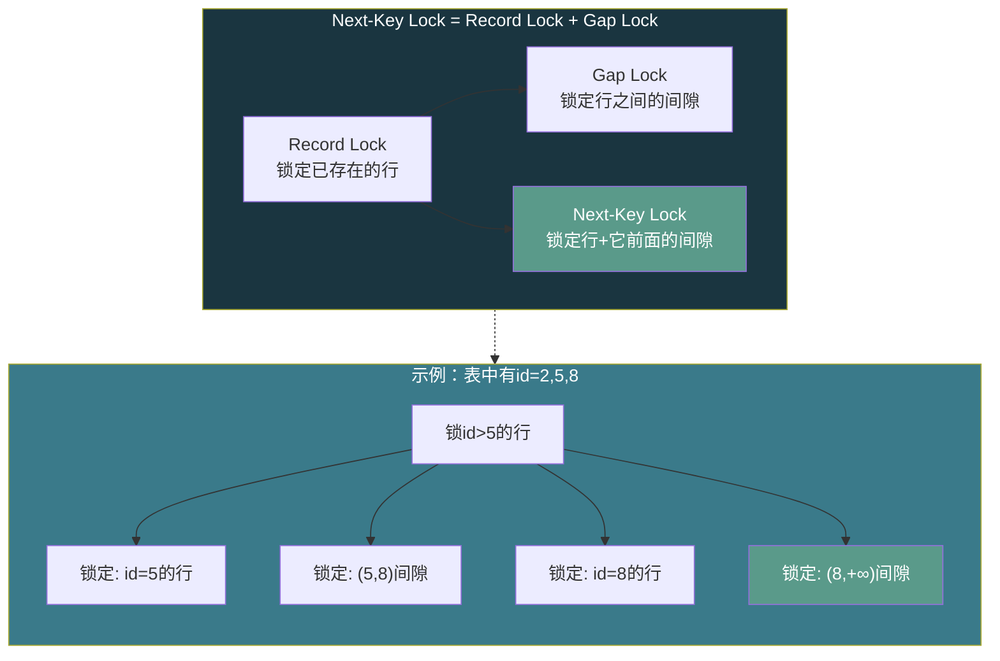
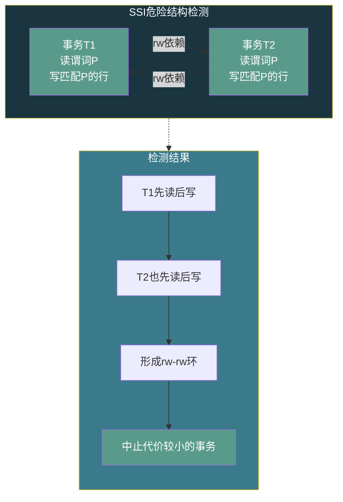

# 【化神·135】事务和隔离级别：ACID不是口号

> **码农修仙传 · 化神期 · 第135篇**
> 我是玄芯散人，带你从炼气修到大乘。

---

## 境界标识

```
╔══════════════════════════════════╗
║     化神期 · 第135篇             ║
║     事务和隔离级别：ACID不是口号  ║
║     脏读·幻读·MVCC·Gap Lock      ║
║     预计阅读：20分钟              ║
╚══════════════════════════════════╝
```

---

## 修仙引入

上一篇拆B+树，讲的是数据怎么存。存数据只是第一步，多个事务同时改同一张表时怎么不乱套，才是数据库引擎真正的难关。

ACID四个字母，面试人人会背。但问你RR隔离级别为什么能防幻读，MVCC的版本链到底怎么判断可见性，SSI是什么算法，多数人答不上来。这一篇就拆开这些机制，看实现细节到底怎么运转。

---

## 硬核主体

### ACID拆解：四个字背后各靠什么撑

ACID是事务的四个属性，每个属性背后都有具体的实现机制支撑。

A（Atomicity，原子性）：事务要么全做要么全不做。靠undo日志实现。事务修改数据前，先把修改前的旧值写入undo log。如果事务回滚，用undo log恢复原值。上一篇133讲WAL时提过redo/undo日志，undo日志的用途就是回滚。

C（Consistency，一致性）：事务执行前后数据满足约束。一致性是目标，不是机制。原子性和隔离性共同保证了一致性，但还需要外键和唯一约束以及检查约束在业务侧配合。

I（Isolation，隔离性）：并发事务互不干扰。靠锁和MVCC实现。隔离性是四个里面最复杂的，也是这一篇的主线。

D（Durability，持久性）：提交的数据不丢。靠WAL日志加fsync实现。事务提交时先写redo日志到磁盘，再返回成功。崩溃后重放redo日志恢复已提交的修改。

四个属性不是独立的。WAL日志同时支撑原子性（undo部分）和持久性（redo部分）。MVCC同时支撑隔离性和一致性。这种交织是数据库引擎设计的难点。

### 并发事务的三种毛病

讲隔离级别之前，先搞清楚要挡住什么。并发事务执行时会产生三种问题。

**脏读**：事务A读到了事务B未提交的数据，B随后回滚，A读到的就是从未存在过的脏数据。

```sql
-- 事务A                          -- 事务B
BEGIN;                            BEGIN;
SELECT balance FROM accounts      UPDATE accounts SET balance = balance - 100
WHERE id = 1;                     WHERE id = 1;
-- 读到 balance = 900              -- 还没COMMIT
                                  ROLLBACK;  -- B回滚了
-- A读到的900是脏数据，实际balance还是1000
```

**不可重复读**：事务A两次读取同一行，中间事务B修改并提交了这行，A两次读到不同的值。

```sql
-- 事务A                          -- 事务B
BEGIN;                            BEGIN;
SELECT balance FROM accounts
WHERE id = 1;
-- 读到 balance = 1000
                                  UPDATE accounts SET balance = 900
                                  WHERE id = 1;
                                  COMMIT;
SELECT balance FROM accounts
WHERE id = 1;
-- 读到 balance = 900，跟第一次不一样
COMMIT;
```

**幻读**：事务A两次执行同一查询条件，中间事务B插入了一行满足条件的记录，A第二次查询多了一行。

```sql
-- 事务A                          -- 事务B
BEGIN;                            BEGIN;
SELECT * FROM accounts
WHERE balance > 500;
-- 假设返回3行
                                  INSERT INTO accounts(id, balance)
                                  VALUES(99, 600);
                                  COMMIT;
SELECT * FROM accounts
WHERE balance > 500;
-- 返回4行，多了一行（幻影）
COMMIT;
```

不可重复读和幻读的区别：前者是同一行的值被改了，后者是结果集的行数变了（有新行插入或旧行删除）。挡住不可重复读只需要对行加锁，挡住幻读需要对行之间的间隙加锁。

### 四种隔离级别

SQL标准（ANSI SQL-92）定义了四种隔离级别，从低到高分别挡住不同的问题。

| 隔离级别 | 脏读 | 不可重复读 | 幻读 |
|---------|------|----------|------|
| Read Uncommitted | 避免 | 可能 | 可能 |
| Read Committed | 避免 | 避免 | 可能 |
| Repeatable Read | 避免 | 避免 | 可能 |
| Serializable | 避免 | 避免 | 避免 |

这个表是SQL标准定义的最低要求。实际数据库的RR实现往往比标准做得更多，下面会详细讲。

Read Uncommitted几乎没人用，代价几乎为零但什么都不挡。Serializable什么都挡但代价最高。实际工程中用得最多的是Read Committed和Repeatable Read。

几个主流数据库的默认隔离级别：

PostgreSQL默认Read Committed。MySQL InnoDB默认Repeatable Read。Oracle默认Read Committed（Oracle还支持Serializable和Read Only）。SQLite默认Serializable，但它是单写者方式，同时只有一个写事务，实际上没有并发问题。

这里有个坑。SQL标准说Repeatable Read挡不住幻读，但PostgreSQL的RR级别实际上能防幻读（快照在事务开始时拍一次，后续查不到新插入的行）。MySQL InnoDB的RR级别通过Gap Lock也能挡住幻读。看起来两个数据库的RR都超过了SQL标准的要求。但RR挡不住的是写偏斜，这是Snapshot Isolation下特有的问题，需要Serializable级别加SSI才能防。

### MVCC：读写不阻塞的秘密

实现隔离性最朴素的方法是加锁。读加读锁，写加写锁，读写互斥。但这样并发度太低，读多写少时性能差得离谱。

MVCC（Multi-Version Concurrency Control）换了思路：同一行数据保留多个版本，每个事务看到自己那个版本。读不阻塞写，写也不阻塞读。

#### PostgreSQL的MVCC：xmin/xmax

PostgreSQL每行数据带两个隐藏字段：xmin和xmax。

xmin：创建（插入）这行的事务ID。xmax：删除（或更新）这行的事务ID，0表示未删除。更新操作等于"删旧行+插新行"，旧行的xmax被设置，新行有自己的xmin。

事务T读取某行时，根据快照判断版本可见性。快照记录了T开始时刻的活跃事务列表。判断规则：

```c
// PostgreSQL版本可见性判断（简化版）
// 返回1=可见，0=不可见
int heap_visible(RowVersion *ver, Snapshot *snap) {
    // 规则1: 创建者是自己 → 可见
    if (ver->xmin == snap->xmin_self)
        return check_xmax_for_self(ver, snap);

    // 规则2: 创建事务未提交 → 不可见（避免脏读）
    if (!txn_committed(ver->xmin))
        return 0;

    // 规则3: 创建事务已提交，但在快照之后提交 → 不可见
    // 即创建事务在快照时还在运行中
    if (txn_in_snapshot(ver->xmin, snap))
        return 0;

    // 创建事务已提交且在快照之前 → 可见
    // 接下来判断这行是否被删除
    if (ver->xmax == 0)
        return 1;  // 未被删除

    // 删除事务未提交 → 行还在，可见
    if (!txn_committed(ver->xmax))
        return 1;

    // 删除事务已提交且在快照之前 → 已被删除，不可见
    if (!txn_in_snapshot(ver->xmax, snap))
        return 0;

    // 删除事务在快照之后 → 行还没被删（对T来说），可见
    return 1;
}
```

这段逻辑的要点是：事务只看到在它快照之前提交的修改。正在运行的事务修改的数据看不到，避免了脏读。在Repeatable Read级别下，快照在事务开始时拍一次，整个事务期间不变，所以同一行两次读到的值一样，避免了不可重复读。

#### MySQL InnoDB的MVCC：undo log版本链

MySQL InnoDB的MVCC做法不同。数据页面上只存最新版本，旧版本放在undo log里。

每行数据有一个roll_ptr字段，指向undo log中的上一版本。更新一行时，旧值被写入undo log，数据页面上的行被新值覆盖，roll_ptr指向undo log中的旧版本。多个更新会形成一条版本链：

```
数据页面: [最新版本] --roll_ptr--> undo log: [旧版本2] --roll_ptr--> [旧版本1]
```

事务读取时，如果最新版本对当前事务不可见，就顺着roll_ptr往回找，直到找到一个可见版本。Read Committed级别下，每次查询都拍新快照。Repeatable Read级别下，快照在事务第一次读时拍，之后不变。

两种MVCC实现的差异：

PostgreSQL的旧版本留在数据页面里，需要VACUUM定期清理。如果VACUUM跟不上，表会膨胀（bloat），查询慢。InnoDB的旧版本在undo log里，有专门的purge线程清理。undo log膨胀会占用表空间，但不会污染数据页面。

### MySQL InnoDB的RR怎么防幻读：Gap Lock

SQL标准说RR挡不住幻读，但InnoDB的RR级别能挡住。靠的是Gap Lock（间隙锁）。

普通行锁锁定的是已存在的行。Gap Lock锁定的是索引记录之间的间隙，防止别的事务往间隙里插入新行。

```sql
-- 事务A (RR级别)                -- 事务B
BEGIN;                            BEGIN;
SELECT * FROM accounts
WHERE balance > 500 FOR UPDATE;
-- 假设命中id=2(balance=600), id=5(balance=800)
-- InnoDB不仅锁住id=2和id=5这两行
-- 还锁住(2,5)之间的间隙
-- 以及(5,+∞)的间隙
                                  INSERT INTO accounts(id, balance)
                                  VALUES(4, 700);
                                  -- 阻塞！间隙被锁了
COMMIT;                          -- B解除阻塞
                                  COMMIT;
```

InnoDB的行锁实际上是Next-Key Lock，等于行锁加Gap Lock。锁定一个索引记录，同时锁定它前面的间隙。这样别的事务既不能修改已锁定的行，也不能往间隙里插入新行，幻读就被挡住了。

Gap Lock只在RR级别下生效。在Read Committed级别下，InnoDB不做Gap Lock，只有行锁，所以RC级别下会有幻读。

Gap Lock有个附带问题：范围查询加锁会锁住比预期更大的范围，导致并发插入被阻塞。业务中常见的"插入被锁住等待"问题，很多是Gap Lock引起的。



### PostgreSQL的Serializable怎么实现：SSI

PostgreSQL的Serializable级别不是靠对每行加读写锁实现的（那样并发几乎为零）。它用了一种叫SSI（Serializable Snapshot Isolation）的算法。

SSI的思路：事务在Snapshot Isolation下运行（快照隔离，相当于RR加一些额外检查），数据库追踪事务之间的读写依赖关系。如果检测到可能产生不可串行化的冲突，就中止其中一个事务。

SSI检测的对象是"写偏斜"（Write Skew）问题。写偏斜是Snapshot Isolation下特有的问题，RR级别也会有。

写偏斜的例子：医院排班系统，规则是至少有一名医生值班。

```sql
-- 初始：两位医生Alice和Bob都在值班(on_call=true)
-- 规则：至少一人值班

-- 事务A                          -- 事务B
BEGIN;                            BEGIN;
SELECT COUNT(*) FROM doctors      SELECT COUNT(*) FROM doctors
WHERE on_call = true;             WHERE on_call = true;
-- 结果=2，可以安全下线            -- 结果=2，可以安全下线
UPDATE doctors SET on_call=false  UPDATE doctors SET on_call=false
WHERE name = 'Alice';             WHERE name = 'Bob';
COMMIT;                           COMMIT;
-- 两人都下线了，违反了至少一人值班的规则
```

在Snapshot Isolation下，两个事务读到的快照都是"两人值班"，各自判断安全后各自下线一人。两个事务没有写同一行（一个改Alice，一个改Bob），行锁挡不住这种冲突。这就是写偏斜。

SSI检测到事务A读了on_call=true的行，事务B也读了同样的行，两个事务都要修改这个结果集相关的行。这种"读-写依赖"形成了一个危险结构（dangerous structure），SSI会中止其中一个事务。



```c
// SSI危险结构检测（概念版）
// 两个事务T1和T2形成危险结构，当且仅当：
// 1. T1读了某个谓词P匹配的行
// 2. T2读了同样的谓词P匹配的行
// 3. T1写了匹配P的行（可能改变T2的读结果）
// 4. T2写了匹配P的行（可能改变T1的读结果）
int ssi_check_conflict(Transaction *t1, Transaction *t2) {
    // 检查是否存在T1先读后写、T2也先读后写的依赖
    if (has_rw_conflict(t1, t2) && has_rw_conflict(t2, t1)) {
        // 形成危险结构，中止其中一个
        // 通常中止开始较晚的那个
        abort_txn(later_txn(t1, t2));
        return 1;
    }
    return 0;
}
```

SSI的代价是事务可能被中止重试。PostgreSQL 9.1引入SSI后，Serializable级别的吞吐量比RC低不少，但对于正确性要求高的用途（金融和调度），这个代价是值得的。

### 隔离级别的选择

工程上怎么选隔离级别？没有银弹，看业务对一致性和并发的要求。

Read Committed适合大多数Web系统。并发度高，偶尔的不可重复读对业务无碍（页面刷新读到新值是正常的）。PostgreSQL和Oracle的默认级别。

Repeatable Read适合需要事务内一致读取的用途。比如生成报表，事务期间数据不能变。MySQL的RR默认有Gap Lock，要注意范围更新的锁范围。

Serializable适合一致性要求极高的用途。金融账户和库存扣减以及调度系统。代价是吞吐量下降和重试开销。

有个经验：先用默认级别（RC），遇到问题再升级。不要一上来就Serializable，很多时候正确性可以在业务代码里加锁（SELECT FOR UPDATE）来保证，不需要全局Serializable。

---

## 修仙术语对照表

| 修仙术语 | 技术现实 | 本篇位置 |
|----------|---------|---------|
| 走火入魔 | 事务回滚，用undo恢复原值 | ACID拆解节 |
| 因果锁 | 隔离性，并发事务互不干扰 | ACID拆解节 |
| 留痕 | WAL日志保证持久性 | ACID拆解节 |
| 分身术 | MVCC多版本共存 | MVCC节 |
| 前世今生 | xmin/xmax标记版本的创建和删除 | PostgreSQL MVCC节 |
| 拍照留证 | 事务开始时拍快照记录活跃事务列表 | MVCC节 |
| 回溯前尘 | InnoDB沿roll_ptr回溯undo log找可见版本 | InnoDB MVCC节 |
| 封锁间隙 | Gap Lock锁住索引记录之间的间隙 | Gap Lock节 |
| 合锁为一 | Next-Key Lock等于行锁加间隙锁 | Gap Lock节 |
| 幻影 | 幻读，两次查询结果集行数不同 | 并发问题节 |
| 分身冲突 | 写偏斜，两个事务各自修改不同行但破坏约束 | SSI节 |
| 危险结构 | SSI检测到的读写依赖环 | SSI节 |
| 境界压制 | Serializable中止重试换取正确性 | SSI节 |
| 因果链 | ACID四属性交织依赖 | ACID拆解节 |

---

## 进阶条件

- [ ] 能画出脏读、不可重复读、幻读这三种并发问题的SQL示例，区分三者的差异
- [ ] 能说出四种隔离级别分别挡住哪些问题，知道SQL标准中RR不防幻读
- [ ] 能手写PostgreSQL的xmin/xmax版本可见性判断逻辑，解释快照的用途
- [ ] 能描述InnoDB的undo log版本链结构，说清跟PostgreSQL MVCC的实现差异
- [ ] 能解释Gap Lock和Next-Key Lock的区别，画出范围查询加锁的范围
- [ ] 能构造写偏斜的示例，解释为什么行锁挡不住写偏斜
- [ ] 能描述SSI检测危险结构的思路，说出它中止事务的代价

> 隔离级别搞清楚了，下一篇看WAL日志在崩溃恢复时怎么用。redo日志重做已提交事务，undo日志回滚未提交事务，checkpoint怎么截断日志，数据库重启时怎么从日志恢复。

---

## 下期预告 + 互动

> 下一篇：【化神·136】WAL日志：数据库崩溃恢复的原理
>
> 预写日志怎么保证先写日志再改数据，redo和undo日志各负责什么，checkpoint怎么截断日志缩短恢复时间，数据库崩溃重启后怎么重放日志把数据恢复到一致状态。

现在问你：

> 🔍 你的项目用的是哪种隔离级别？有没有遇到过默认级别不够用的情况？
>
> 📌 你遇到过Gap Lock导致的死锁或锁等待吗？怎么排查的？
>
> 评论区聊聊你的事务踩坑经历。

> 我是玄芯散人，带你从炼气修到大乘。

---

*本文是「码农修仙传」系列第135篇。系列导航见 [xren.ren](https://xren.ren)*
