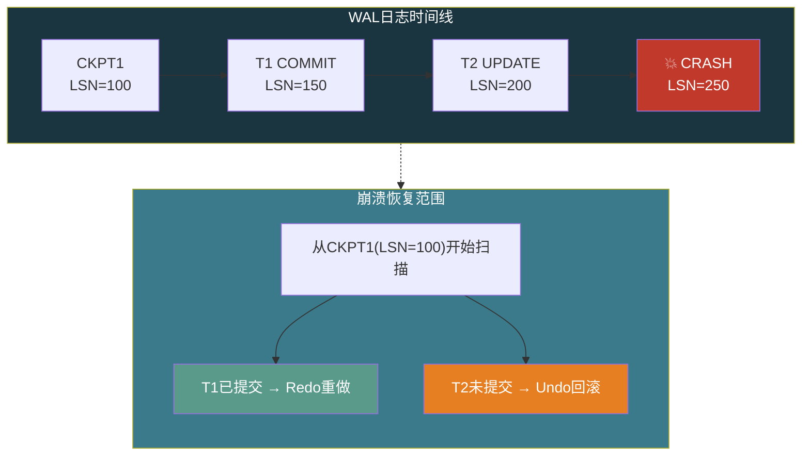
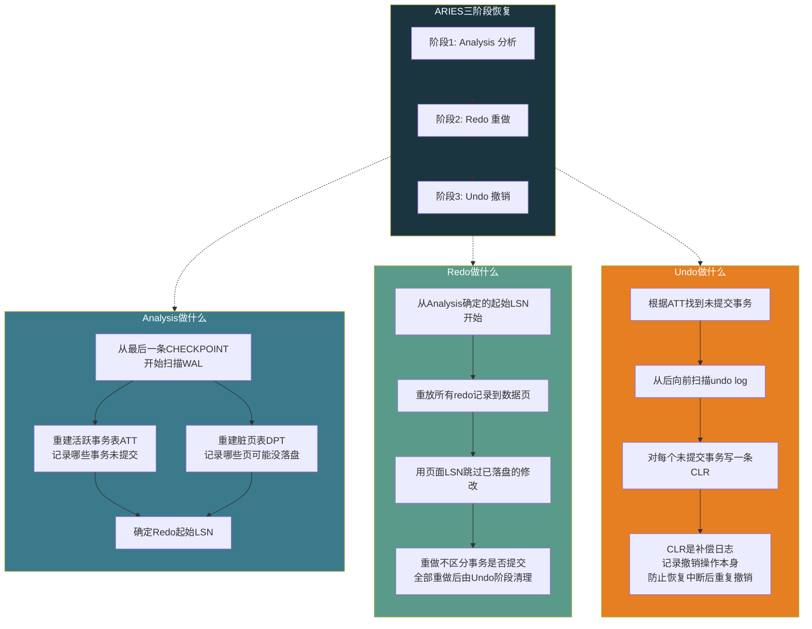

# 【化神·136】WAL日志：数据库崩溃恢复的原理

> **码农修仙传 · 化神期 · 第136篇**
> 我是玄芯散人，带你从炼气修到大乘。

---

## 境界标识

```
╔══════════════════════════════════════╗
║     化神期 · 第136篇                  ║
║     WAL日志：数据库崩溃恢复的原理     ║
║     Redo·Undo·Checkpoint·ARIES       ║
║     预计阅读：22分钟                  ║
╚══════════════════════════════════════╝
```

---

## 修仙引入

修仙者闭关修炼时，最怕什么？不是心魔，是闭关到一半洞府塌了。修炼进度记在脑子里，洞府一塌什么都没了。聪明的修仙者会把每天修炼进度刻在玉简上，放在结界最稳固的地方。就算洞府塌了，捡起玉简接着练。

数据库也怕这个。事务执行到一半，机器断电了。内存里的修改全没了，磁盘上的数据页面可能写了一半。重启后怎么知道哪些事务提交了，哪些没有？答案就是WAL（Write-Ahead Logging）。上一篇135讲事务隔离时提过WAL保证持久性，这一篇拆开看WAL的内部结构，redo和undo各管什么，checkpoint怎么截断日志，崩溃后ARIES算法怎么分三阶段恢复。

---

## 硬核主体

### WAL原则：先记后改的铁律

WAL的规则一句话说清楚：修改数据页之前，必须先把这次修改的日志写入磁盘。日志先落盘，数据页后落盘。顺序不能反。

为什么不能反？数据库修改数据页时，不是每次都直接写磁盘。数据页在内存的Buffer Pool里改，攒一批再批量刷盘（这叫write-back缓存）。如果先改了数据页并刷盘，但日志还没写，这时崩溃了，重启后你看到磁盘上改过的数据，却不知道是哪个事务改的，也不知道改了什么，更不知道有没有提交。你既没法重做（因为不知道改了啥），也没法回滚（因为不知道改之前是什么）。

日志先落盘就不一样了。崩溃后只要日志在，就能根据日志知道每个事务做了什么、是否提交。已提交的重做（redo），未提交的回滚（undo）。数据页面写成什么样都不怕，日志就是真相。

```c
// WAL写日志的伪代码（简化版）
int wal_write(Transaction *txn, LogRecord *rec) {
    // 1. 构造日志记录：事务ID + 操作类型 + 修改前值 + 修改后值
    rec->txn_id = txn->id;
    rec->lsn = next_lsn();  // 日志序列号，单调递增
    
    // 2. 写入WAL缓冲区
    memcpy(wal_buffer + wal_offset, rec, sizeof(LogRecord));
    wal_offset += sizeof(LogRecord);
    
    // 3. 关键：提交时必须fsync到磁盘
    // 非提交的事务也可以延迟刷盘，但COMMIT必须等日志落盘
    if (rec->type == LOG_COMMIT) {
        fsync(wal_fd);  // 确保日志先于数据页落盘
        txn->state = TXN_COMMITTED;
    }
    return 0;
}
```

这里有个细节：fsync是WAL持久性的保障。日志写到内核page cache不算落盘，必须fsync强制刷到物理磁盘。PostgreSQL有个参数`synchronous_commit`控制这个行为。默认`on`表示COMMIT时fsync WAL日志。设成`off`的话COMMIT不等fsync直接返回，性能提升但崩溃可能丢最近提交的事务。工程上大部分系统不敢关这个。

### Redo Log：重做已提交的修改

Redo日志记录的是"修改后的值"（after-image）。事务修改某个数据页时，redo log记录改了哪个页的哪个偏移、改成了什么值。崩溃恢复时，扫描redo log，把已提交事务的修改重新施加到数据页上。

Redo log是物理日志或物理逻辑日志。物理日志记录"页号+偏移+新值"，精确到字节。逻辑日志记录"执行了什么操作"（比如UPDATE accounts SET balance=900 WHERE id=1），恢复时重新执行这个操作。

物理日志恢复快（直接覆盖字节），但日志体积大。逻辑日志体积小，但恢复时操作可能不是幂等的（重复执行结果不同）。PostgreSQL的WAL采用的是物理逻辑混合方式，记录到页级别但操作以逻辑描述。InnoDB的redo log是物理日志，记录页号和偏移。

```c
// redo log记录结构（InnoDB风格，简化版）
typedef struct {
    uint64_t lsn;           // 日志序列号
    uint32_t space_id;      // 表空间ID
    uint32_t page_no;       // 数据页编号
    uint16_t offset;        // 页内偏移
    uint16_t length;        // 修改的字节数
    uint8_t  data[];        // 修改后的值（after-image）
} RedoLogRecord;

// 重做阶段：扫描redo log，重放已提交事务的修改
void redo_phase(LogScanner *scanner) {
    RedoLogRecord *rec;
    while ((rec = scanner_next(scanner)) != NULL) {
        Page *page = buffer_pool_get(rec->space_id, rec->page_no);
        // 只重做LSN比页面LSN新的记录
        // 页面LSN记录该页最后一次被redo更新的LSN
        if (rec->lsn > page->lsn) {
            memcpy(page->data + rec->offset, rec->data, rec->length);
            page->lsn = rec->lsn;
            buffer_pool_mark_dirty(page);
        }
    }
}
```

这里有个LSN（Log Sequence Number）的概念。每个数据页头部记录自己最后一次被修改时的LSN。重做时如果某条redo log的LSN小于等于页面的LSN，说明这个修改已经在页面上了，跳过。崩溃时数据页可能写了一半到磁盘，页面LSN是旧的，redo log的LSN是新的，重做就能把页面恢复到正确状态。

### Undo Log：回滚未提交的修改

Undo日志记录的是"修改前的值"（before-image）。事务修改数据页前，先把旧值写入undo log。如果事务回滚，用undo log恢复原值。崩溃恢复时，扫描undo log，把未提交事务的修改全部撤销。

上一篇135讲InnoDB的MVCC时提过undo log的版本链。undo log在InnoDB里身兼二职：既用于事务回滚（Atomicity），又用于MVCC的旧版本读取（Isolation）。一个undo log记录可能同时用于这两个用途，直到所有依赖它的事务都结束后才能被purge线程清理。

```c
// undo log记录结构（简化版）
typedef struct {
    uint64_t lsn;
    uint32_t txn_id;        // 事务ID
    uint32_t space_id;      // 表空间ID
    uint32_t page_no;       // 数据页编号
    uint16_t offset;        // 页内偏移
    uint16_t length;        // 修改的字节数
    uint8_t  old_data[];    // 修改前的值（before-image）
    uint64_t prev_undo;     // 上一条undo记录（版本链）
} UndoLogRecord;

// 撤销阶段：回滚未提交事务
void undo_phase(LogScanner *scanner, ActiveTxnTable *att) {
    UndoLogRecord *rec;
    // 从undo log末尾向前扫描
    while ((rec = scanner_prev(scanner)) != NULL) {
        // 只回滚未提交的事务
        if (txn_is_active(att, rec->txn_id)) {
            Page *page = buffer_pool_get(rec->space_id, rec->page_no);
            memcpy(page->data + rec->offset, rec->old_data, rec->length);
            buffer_pool_mark_dirty(page);
        }
    }
}
```

Undo和redo的配合：一个事务修改数据时，先写undo log（记录旧值），再修改数据页，再写redo log（记录新值）。崩溃后，已提交的事务用redo重做，未提交的事务用undo回滚。两条日志各管一摊。

### Checkpoint：截断日志缩短恢复时间

如果redo log无限增长，崩溃后恢复时要从头扫描所有日志，恢复时间越来越长。Checkpoint（检查点）解决这个问题。

Checkpoint做的事：把Buffer Pool里所有脏页刷到磁盘，然后在WAL里写一条CHECKPOINT记录。这条记录里记着checkpoint时的LSN。崩溃恢复时，从最近一条CHECKPOINT记录之后开始扫描redo log就行，之前的日志对应的脏页已经落盘了。

但checkpoint有个矛盾：刷所有脏页会导致I/O突增，事务会卡顿等待。这叫"尖锐检查点"（Sharp Checkpoint），很多数据库不用这种方式。

PostgreSQL的做法是定期checkpoint（默认`checkpoint_timeout=5min`或`max_wal_size=1GB`触发），刷脏页在后台慢慢做。checkpoint开始时记一个redo log位置，之后产生的脏页都要在这个位置之前刷完。checkpoint完成时写一条CHECKPOINT记录到WAL。崩溃恢复从这条记录之后开始。

InnoDB用Fuzzy Checkpointing。Master Thread持续在后台刷脏页，维护一个`lsn`指针表示"已刷到哪个LSN"。当redo log空间快满时（`innodb_log_capacity_used`接近上限），加速刷脏页并推进checkpoint LSN。InnoDB 8.0.30以后redo log统一到`#innodb_redo`表空间，动态调整大小。



### PostgreSQL的Full Page Write：防部分写

这里有个不得不提的坑。磁盘扇区写操作不是原子的。断电时一个8KB的数据页可能只写了前4KB，后4KB还是旧数据。这叫torn page（部分写）。PostgreSQL的数据页默认8KB，Linux文件系统通常以4KB为块大小，一次8KB的写跨越了两个文件系统块，断电就可能写一半。

如果数据页撕裂了，redo log里的物理修改记录基于正确的页内容施加，但页面本身是坏的，redo之后页面内容还是错的。

PostgreSQL的解法叫Full Page Write（FPW）。每个checkpoint之后，第一次修改某个数据页时，把整个页的全量内容写入WAL。这叫FULL_PAGE_IMAGE记录。如果这页后来撕裂了，恢复时先用WAL里的全量页面镜像覆盖，再施加后续的redo记录。

代价是WAL日志体积增大，尤其是checkpoint后第一次修改大量不同页时。PostgreSQL社区有人讨论过去掉FPW靠双写替代，但目前FPW仍然是默认开启的（`full_page_writes=on`）。

InnoDB用Doublewrite Buffer解决同样的问题。脏页刷盘前先写到一块连续的doublewrite区域，再写到各数据页的实际位置。如果数据页撕裂了，从doublewrite区域恢复。doublewrite占2MB（128个页，每页16KB），开销比FPW小，因为只多写一份，不在WAL里放大日志量。

### ARIES：崩溃恢复的标准算法

前面讲的redo和undo是分散的机制。把它们串成一套完整的崩溃恢复流程的，是1992年Mohan等人在IBM提出的ARIES（Algorithm for Recovery and Isolation Exploiting Semantics）算法。主流数据库的恢复流程都遵循ARIES的三阶段结构。



Analysis阶段：从最后一条CHECKPOINT记录开始向后扫描WAL。重建两个数据结构：ATT（Active Transaction Table，活跃事务表），记录扫描结束时哪些事务没有COMMIT记录；DPT（Dirty Page Table，脏页表），记录哪些数据页在Buffer Pool里被修改过但可能没刷盘。Analysis结束时确定redo阶段的起始LSN（DPT中所有页最早的修改LSN）。

Redo阶段：从Analysis确定的起始LSN开始，重新施加所有redo记录。注意这个阶段不区分事务是否提交，全部重做。原因是这样更简单也更安全：先把所有修改施加到数据页，让页面达到崩溃瞬间的状态，再由Undo阶段清理未提交事务。重做时用页面LSN做幂等判断，已经落盘的修改跳过。

Undo阶段：根据ATT中的未提交事务列表，从后向前扫描undo log，逐条撤销。每撤销一条，写一条CLR（Compensation Log Record，补偿日志记录）。CLR的用途是让撤销操作本身也可恢复。如果Undo阶段执行到一半又崩了，重启后不会重复撤销已经撤销过的修改。

CLR的LSN大于对应原操作的LSN。恢复时看到CLR就知道这条修改已经撤销过了，不需要再撤销。这是ARIES的一个设计精巧之处：用日志记录来保证恢复的幂等性。

### 崩溃恢复实例

讲个具体的崩溃案例。假设有以下事务序列：

```
时间线：
T1: BEGIN → UPDATE page_5 (LSN=101) → COMMIT (LSN=102)
T2: BEGIN → UPDATE page_5 (LSN=103) → UPDATE page_8 (LSN=104)
                                         ↑ 崩溃在这里，T2没有COMMIT
CHECKPOINT at LSN=100
```

恢复过程：

Analysis阶段：从LSN=100的CHECKPOINT开始扫描。T1有COMMIT记录，不在ATT中。T2没有COMMIT记录，加入ATT。page_5和page_8都有修改记录，加入DPT。Redo起始LSN=101。

Redo阶段：从LSN=101开始重做。LSN=101重做T1对page_5的修改。LSN=102是T1的COMMIT，跳过（COMMIT不是数据修改）。LSN=103重做T2对page_5的修改。LSN=104重做T2对page_8的修改。此时page_5和page_8都到了崩溃时的状态。

Undo阶段：ATT中有T2。从LSN=104开始向前扫描。撤销T2对page_8的修改（用undo log恢复旧值），写CLR（LSN=105）。撤销T2对page_5的修改，写CLR（LSN=106）。T2完全回滚，写T2的ABORT记录。

恢复结束。T1的修改保留（已提交），T2的修改全部撤销。数据库恢复到一致状态。

### 不同数据库的WAL实现差异

PostgreSQL和InnoDB的WAL实现各有特点。

PostgreSQL的WAL在`pg_wal/`目录下，文件名是时间线加LSN编码（如`000000010000000000000003`），默认16MB一个段。WAL记录是二进制格式，包含RMGR（Resource Manager）标识区分是堆操作还是索引操作还是事务控制。参数`wal_buffers`控制WAL内存缓冲区大小（默认-1，自动取1/32 of shared_buffers）。`min_wal_size`和`max_wal_size`控制WAL保留量。

InnoDB的redo log在MySQL 8.0.30之前是固定大小的`ib_logfile0`和`ib_logfile1`，8.0.30之后改为动态的`#innodb_redo`表空间文件。参数`innodb_log_buffer_size`控制redo log buffer大小，`innodb_flush_log_at_trx_commit`控制刷盘策略（默认1=每次COMMIT都fsync，0=每秒自动刷，2=每次COMMIT写page cache但每秒fsync）。

SQLite虽然轻量但也有WAL模式。`PRAGMA journal_mode=WAL`启用后，写操作追加到`-wal`文件，读操作走主数据库文件。WAL模式下一个读线程和一个写线程可以并发（默认rollback journal模式下写会阻塞读）。SQLite的WAL checkpoint在读操作时自动触发，也可以手动`PRAGMA wal_checkpoint`。

三种数据库的WAL设计目标相同：先写日志再改数据，保证崩溃后可恢复。区别在于日志格式和并发控制方式以及checkpoint策略，这些差异源于各自的设计定位。

---

## 修仙术语对照表

| 修仙术语 | 技术现实 | 本篇位置 |
|----------|---------|---------|
| 玉简留痕 | WAL日志先于数据页落盘 | WAL原则节 |
| 重铸法身 | Redo重做已提交事务的修改 | Redo Log节 |
| 破镜重圆 | Undo回滚未提交事务的修改 | Undo Log节 |
| 刻舟求剑 | LSN标记页面最后修改的日志位置 | Redo Log节 |
| 封印截断 | Checkpoint截断WAL日志缩短恢复范围 | Checkpoint节 |
| 洞府塌陷 | 崩溃后数据页可能撕裂或未落盘 | Checkpoint节 |
| 镜像护体 | 记录整页内容防torn page | FPW节 |
| 双重保险 | Doublewrite Buffer双写防部分写 | FPW节 |
| 三段还魂 | ARIES三阶段Analysis→Redo→Undo | ARIES节 |
| 查账清算 | Analysis重建ATT和DPT | ARIES节 |
| 补偿符 | CLR补偿日志记录防止重复撤销 | ARIES节 |
| 全量重铸 | Redo阶段不区分提交状态全部重做 | ARIES节 |
| 倒逆时空 | Undo阶段从后向前扫描回滚 | ARIES节 |

---

## 进阶条件

- [ ] 能用一句话说清WAL原则，解释为什么日志必须先于数据页落盘
- [ ] 能画出redo log和undo log的记录结构，区分after-image和before-image
- [ ] 能解释LSN在重做阶段的作用，说清为什么用页面LSN做幂等判断
- [ ] 能说出checkpoint的功能，说清sharp checkpoint和fuzzy checkpoint的区别
- [ ] 能说出PostgreSQL FPW和InnoDB Doublewrite Buffer分别解决什么问题，各自代价
- [ ] 能按顺序说出ARIES三阶段各做什么，解释为什么Redo阶段不区分事务是否提交
- [ ] 能解释CLR的用途，说清为什么Undo阶段要写补偿日志

> 崩溃恢复搞清楚了，下一篇开始手写迷你操作系统。Bootloader的0x7C00起点，实模式切保护模式，跳进C代码。数据库的故事先告一段落，操作系统这块硬骨头等着啃。

---

## 下期预告 + 互动

> 下一篇：【化神·137】手写一个迷你操作系统（一）：Bootloader和启动
>
> 从BIOS交接的0x7C00开始，写512字节的引导扇区，实模式切换到保护模式，加载内核镜像跳转C代码。Bootloader是操作系统的第一口气。

现在问你：

> 🔍 你在生产环境遇到过数据库崩溃恢复吗？恢复花了多久？有没有因为WAL配置不当导致数据丢失的教训？
>
> 📌 `innodb_flush_log_at_trx_commit`设成0或2的，你们敢用吗？性能提升了多少？
>
> 评论区聊聊你的崩溃恢复经历。

> 我是玄芯散人，带你从炼气修到大乘。

---

*本文是「码农修仙传」系列第136篇。系列导航见 [xren.ren](https://xren.ren)*
