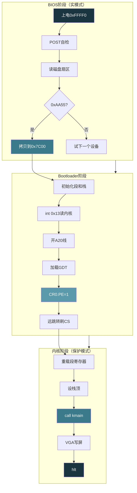

# 【化神·137】手写一个迷你操作系统（一）：Bootloader和启动

> **码农修仙传 · 化神期 · 第137篇**
> 我是玄芯散人，带你从炼气修到大乘。

---

## 境界标识

```
╔══════════════════════════════════════╗
║     化神期 · 第137篇                  ║
║     手写一个迷你操作系统（一）         ║
║     Bootloader和启动                  ║
║     0x7C00·实模式·保护模式·GDT        ║
║     预计阅读：25分钟                  ║
╚══════════════════════════════════════╝
```

---

## 修仙引入

化神期的弟子不再借用别人的洞府，要自己开山立派。开宗立派第一步不是招弟子，是找到一块地，打地基，搭第一根梁。操作系统的地基是 Bootloader。这段只有 512 字节的代码，是整个系统第一口呼吸。

x86 机器上电后，CPU 不是直接跑你的 main 函数。它先被 BIOS 握着手走一段，BIOS 做完硬件自检后，从磁盘第一个扇区读 512 字节放到内存 0x7C00 处，然后把 CPU 的指令指针指过去。这 512 字节就是 Bootloader。它要在这么小的空间里完成实模式初始化，打开 A20 地址线，建好 GDT，切换到保护模式，最后跳进 C 代码。化神弟子亲手做一遍这个过程，才算真正理解"操作系统是怎么启动的"。

---

## 硬核主体

### BIOS把控制权交给谁

x86 CPU 上电那一刻，所有通用寄存器清零，指令指针（EIP）指向 0xFFFF0。这个地址在 BIOS ROM 里。BIOS 做的第一件事是 POST（Power-On Self Test），检查内存和CPU以及外设是否正常。POST 通过后，BIOS 按用户设置的启动顺序，依次尝试硬盘或U盘或光盘的第一扇区读取数据。

BIOS 读到的第一个扇区（512字节）叫 boot sector。BIOS 不是随便读到数据就跳过去的，它会检查这个扇区的最后两个字节。如果第510字节是 0x55，第511字节是 0xAA（小端序写成 0xAA55），BIOS 认为这是一个合法的 boot sector，把它整体拷贝到内存 0x7C00 处，然后执行 `jmp 0x7C00`。如果不是 0xAA55，BIOS 就试下一个设备。

为什么是 0x7C00？这个地址不是随便选的。IBM PC 当年设计时，DOS 最小配置是 32KB 内存（0x0000-0x7FFF）。BIOS 自己占 0xFE000-0xFFFFF（64KB ROM 窗口的高位段）。0x7C00 = 32KB - 1KB，留了 1KB 给 boot sector 和栈区。这个数字就这么定下来了，至今没变。

### 实模式：CPU的婴儿期

CPU 刚跳到 0x7C00 时处于实模式（Real Mode）。实模式是 8086 时代的遗物，16 位寄存器，段式寻址，最多访问 1MB 内存。

实模式的地址计算方式很特别。段寄存器（CS/DS/SS/ES）存一个 16 位段基址，通用寄存器或指令中的偏移存一个 16 位偏移量。物理地址 = 段基址 × 16 + 偏移量。比如 CS=0x07C0, IP=0x0000，算出来的物理地址是 0x07C0 × 16 + 0 = 0x7C00。同样 CS=0x0000, IP=0x7C00 也指向同一个地方。一个物理地址可以有多种段:偏移组合。

```asm
; boot.asm - Bootloader入口
[org 0x7c00]          ; 告诉汇编器代码加载在0x7C00

; --- 16位实模式代码 ---
mov ax, 0x07C0
mov ds, ax            ; 数据段 = 0x07C0，这样ds:offset算出来正好是0x7C00+offset
mov ax, 0x8000
mov ss, ax            ; 栈段 = 0x8000，栈底在32KB处
mov sp, 0x0000        ; 栈顶指针，栈从高地址往低地址长

; 打个招呼，证明我们在跑
mov si, msg
call print_string     ; BIOS int 0x10 打印字符串

; 接下来要做三件事：开A20、建GDT、切保护模式
```

实模式有个 1MB 限制。8086 的地址线只有 20 根（A0-A19），最大寻址 0xFFFFF（1MB）。但段:偏移可以算出超过 1MB 的地址（比如 0xFFFF:0xFFFF = 0x10FFEF），第 21 根地址线 A20 在 8086 上不存在，所以高位自动回绕。到了 286 时代地址线增到 24 根，A20 线实际存在了，但为了兼容老程序，默认把 A20 关掉，让超过 1MB 的地址仍然回绕。要访问 1MB 以上的内存，得先打开 A20 线。

### 打开A20线

打开 A20 有几种方法，最简单的是通过键盘控制器的输出端口。8042 键盘控制器有一个输出端口，其中 bit1 控制 A20 线的开关。

```asm
enable_a20:
    cli                 ; 关中断，操作键盘控制器期间不能被打断
    call .wait          ; 等键盘控制器输入缓冲区空
    mov al, 0xD1        ; 0xD1 = 写输出端口的命令
    out 0x64, al        ; 0x64是键盘控制器的命令端口
    call .wait
    mov al, 0xDF        ; 0xDF = 11011111，bit1=1打开A20
    out 0x60, al        ; 0x60是键盘控制器的数据端口
    call .wait
    sti                 ; 重新开中断
    ret

.wait:
    in al, 0x64         ; 读状态寄存器
    test al, 0x02       ; bit1=1表示输入缓冲区满，要等
    jnz .wait
    ret
```

还有更快的方法：写 port 0x92（Fast A20 Gate），bit1 置 1 就行。但 0x92 的其他位控制别的硬件，直接写容易出问题，要先读再改 bit1 再写回。教学用途用键盘控制器方法更稳。

### GDT：保护模式的门牌簿

实模式没有内存保护。任何程序可以读写任何地址。保护模式要解决的第一件事就是给每段内存贴标签，标明这段内存属于谁，有什么读写权限。这些标签存在 GDT（Global Descriptor Table）里。

GDT 是一个数组，每个元素叫段描述符（Segment Descriptor），占 8 字节。描述符里记录了段的基址和界限与访问权限。

```asm
; GDT 数据结构
gdt_start:
    ; 第一个描述符必须是空描述符（全零）
    ; CPU规定索引0不能用，留空
    dd 0x0
    dd 0x0

; 代码段描述符
gdt_code:
    dw 0xFFFF       ; limit低16位
    dw 0x0000       ; base低16位
    db 0x00         ; base中间8位
    db 10011010b    ; 访问字节: P=1 DPL=00 S=1 Type=1010(代码段可读可执行)
    db 11001111b    ; 标志+limit高4位: G=1 D=1 limit高4位=0xF
    db 0x00         ; base高8位

; 数据段描述符
gdt_data:
    dw 0xFFFF       ; limit低16位
    dw 0x0000       ; base低16位
    db 0x00         ; base中间8位
    db 10010010b    ; 访问字节: P=1 DPL=00 S=1 Type=0010(数据段可读可写)
    db 11001111b    ; 标志+limit高4位: G=1 D=1 limit高4位=0xF
    db 0x00         ; base高8位

gdt_end:
```

上面代码段和数据段描述符看起来一样？对。基址都是 0，limit 都是 0xFFFFF。配合 G=1（粒度=4KB），limit 变成 0xFFFFF × 4KB = 4GB。也就是说，这两个段都覆盖了全部 4GB 地址空间。

区别在访问字节的 Type 字段。代码段是 1010（可执行可读），数据段是 0010（可读写不可执行）。保护模式下 CPU 会检查段权限，往代码段写数据会触发 General Protection Fault（#GP 异常，中断号13）。

描述符的位排列比较反直觉。基址被拆成三段（低16位+中8位+高8位），limit 被拆成两段（低16位+高4位），中间还夹着访问字节和标志字节。这是 286 到 386 兼容的历史包袱，286 的描述符只有 6 字节，386 扩展到 8 字节时把新增的字段塞在中间。

GDT 在内存里放好后，还要告诉 CPU 它在哪。这靠 GDTR 寄存器和 `lgdt` 指令：

```asm
; GDT描述符（注意不是段描述符，是给GDTR用的）
gdt_descriptor:
    dw gdt_end - gdt_start - 1   ; GDT大小（字节数-1）
    dd gdt_start                  ; GDT线性地址

; 加载GDT
lgdt [gdt_descriptor]
```

GDTR 是一个 48 位寄存器：低 16 位存 GDT 大小，高 32 位存 GDT 线性地址。`lgdt` 一执行，CPU 就知道 GDT 在哪了。但此时还在实模式，GDT 虽然加载了却不生效，要等切到保护模式才生效。

### 切换到保护模式

切换保护模式的开关在 CR0 寄存器的 bit0，叫 PE（Protection Enable）位。把这个位置 1，CPU 就进入保护模式。

```asm
switch_to_protected:
    cli                 ; 关中断，保护模式下实模式的中断处理不能用了
                        ; 得等后面设好IDT才能重新开中断
    
    ; 设置CR0的PE位
    mov eax, cr0
    or eax, 0x1         ; PE位置1
    mov cr0, eax
    
    ; 远跳转，刷新流水线并更新CS
    ; 0x08是GDT中第一个描述符（代码段）的索引
    ; GDT索引0是空描述符，索引1是代码段，索引2是数据段
    ; 索引值左移3位(因为描述符8字节)后作为段选择子
    ; 0x08 = 00001000b: index=1, TI=0(GDT), RPL=0
    jmp 0x08:protected_mode_entry

[BITS 32]
protected_mode_entry:
    ; 现在在32位保护模式了
    ; 更新段寄存器，全部指向数据段(索引2)
    mov ax, 0x10        ; 0x10 = 00010000b: index=2, TI=0, RPL=0
    mov ds, ax
    mov es, ax
    mov fs, ax
    mov gs, ax
    mov ss, ax
    mov esp, 0x90000    ; 设置新的栈顶
    
    ; 跳转到C代码
    extern kmain
    call kmain
    
    ; 如果kmain返回了，挂在这里
.hang:
    hlt
    jmp .hang
```

为什么要远跳转？两个原因。第一，切换 PE 位后 CPU 的预取队列里还缓存着实模式的指令，直接往下走可能执行错误的解码。远跳转强制刷新流水线。第二，CS 寄存器还是实模式的值（比如 0x07C0），需要通过远跳转加载新的段选择子（0x08），让 CS 指向 GDT 中的代码段描述符。

切到保护模式后，所有段寄存器必须重新加载。DS/ES/FS/GS/SS 还是实模式的旧值，在保护模式下这些旧值会被当作段选择子去查 GDT，查到不存在的描述符就触发异常。

### 用C写内核入口

到了 32 位保护模式，终于可以跑 C 代码了。kmain 是内核的入口函数。虽然现在还没什么能做的（没有屏幕驱动、没有键盘驱动），但至少能在屏幕上画几个字。

```c
// kernel.c - 内核入口
// 在VGA文本模式下往屏幕写字符
// VGA文本缓冲区在0xB8000，每个字符2字节：ASCII码+颜色属性

#define VGA_BUFFER ((volatile unsigned short*)0xB8000)
#define VGA_WIDTH 80
#define VGA_HEIGHT 25

static int cursor_x = 0;
static int cursor_y = 0;

// 颜色属性：白字黑底
#define COLOR_WHITE_ON_BLACK 0x0F

void vga_putc(char c) {
    if (c == '\n') {
        cursor_x = 0;
        cursor_y++;
        if (cursor_y >= VGA_HEIGHT) {
            cursor_y = 0;  // 简化处理：满了就回卷到顶部
        }
        return;
    }
    int pos = cursor_y * VGA_WIDTH + cursor_x;
    VGA_BUFFER[pos] = c | (COLOR_WHITE_ON_BLACK << 8);
    cursor_x++;
    if (cursor_x >= VGA_WIDTH) {
        cursor_x = 0;
        cursor_y++;
        if (cursor_y >= VGA_HEIGHT) {
            cursor_y = 0;
        }
    }
}

void vga_puts(const char *str) {
    while (*str) {
        vga_putc(*str);
        str++;
    }
}

void kmain(void) {
    // 清屏：往25行80列全写空格
    for (int i = 0; i < VGA_WIDTH * VGA_HEIGHT; i++) {
        VGA_BUFFER[i] = (COLOR_WHITE_ON_BLACK << 8) | ' ';
    }
    cursor_x = 0;
    cursor_y = 0;
    
    vga_puts("Welcome to MiniOS!\n");
    vga_puts("Bootloader -> Protected Mode -> C kernel\n");
    vga_puts("This is the first breath of an OS.\n");
    
    // 停在这里
    while (1) {
        __asm__ volatile ("hlt");
    }
}
```

VGA 文本模式是 PC 的遗产。在 0xB8000 处有一块 4000 字节的内存对应区域，对应 80 列 × 25 行的字符显示。每个字符占 2 字节，低字节是 ASCII 码，高字节是颜色属性。往这块内存写字就等于往屏幕写字，不需要任何驱动。

### 编译和链接

Bootloader 是 16 位实模式汇编，内核是 32 位保护模式 C 代码。两段代码编译方式不同，要拼在一起。

```bash
# 编译bootloader（16位实模式 + 32位保护模式段）
nasm -f bin boot.asm -o boot.bin

# 编译内核（32位C代码）
# -m32 生成32位代码，-ffreestanding 不依赖标准库
# -fno-pie 不生成位置无关代码（我们的内核加载在固定地址）
gcc -m32 -ffreestanding -fno-pie -c kernel.c -o kernel.o

# 链接内核，入口是kmain，加载地址0x10000
ld -m elf_i386 -Ttext 0x10000 -o kernel.elf kernel.o
ld -m elf_i386 -Ttext 0x10000 --oformat binary kernel.o -o kernel.bin
```

Bootloader 只有 512 字节，装不下加载内核的逻辑。实际做法是 boot.bin 放在磁盘第一个扇区，kernel.bin 放在第二个扇区开始的位置。Bootloader 用 BIOS int 0x13 读磁盘把 kernel.bin 加载到内存 0x10000，然后跳过去。

上面 boot.asm 省略了磁盘读取部分。补上的话大概是这样：

```asm
; 用BIOS int 0x13读磁盘，把内核加载到0x10000
load_kernel:
    mov bx, 0x1000      ; ES:BX = 0x1000:0x0000 = 0x10000
    mov es, bx
    xor bx, bx
    
    mov ah, 0x02        ; 功能号0x02 = 读扇区
    mov al, 15          ; 读15个扇区（内核可能比较大）
    mov ch, 0           ; 柱面0
    mov cl, 2           ; 从第2扇区开始（第1扇区是bootloader）
    mov dh, 0           ; 磁头0
    mov dl, 0           ; 软驱A
    int 0x13            ; BIOS磁盘读写中断
    jc disk_error       ; CF=1表示出错
    
    ; 跳转到0x10000执行内核
    ; 此时还在实模式，用段:偏移跳
    ; 不过实际上要先切保护模式再跳
    ; 具体顺序取决于bootloader设计
    jmp 0x1000:0x0000   ; 跳到0x10000

disk_error:
    mov si, err_msg
    call print_string
    jmp $
```

### 整体启动流程

把上面所有步骤串起来，启动流程如下：



这张图把启动的三个阶段画清楚了。BIOS 阶段是硬件固定的，改不了。Bootloader 阶段是化神弟子亲手写的，512 字节里塞了初始化和模式切换。内核阶段是 C 代码，后面的 138 篇会接着写内存管理，139 篇写进程调度，140 篇写系统调用和 Shell。

### 512字节的极限

boot.bin 必须正好 512 字节，末尾两个字节是 0xAA55。如果汇编出来的代码超过 510 字节，就得拆成两个扇区，第一个扇区跳到第二个扇区继续执行。教学用的 Bootloader 一般在 200-400 字节，够用。

```bash
# 检查boot.bin大小
ls -l boot.bin
# 必须是512字节

# 用dd把boot.bin和kernel.bin拼成镜像
dd if=boot.bin of=os.img bs=512 count=1
dd if=kernel.bin of=os.img bs=512 seek=1
# seek=1表示跳过第1个扇区，从第2个扇区开始写

# 用QEMU测试
qemu-system-i386 -drive format=raw,file=os.img
```

QEMU 测试的好处是快，不用反复烧盘。Bochs 也不错，带调试器，可以单步执行看寄存器和内存。写到真机上有额外的坑（USB启动 vs 软盘启动，BIOS vs UEFI），教学阶段用 QEMU 就够了。

---

## 修仙术语对照表

| 修仙术语 | 技术现实 | 本篇位置 |
|---------|---------|---------|
| 开山立派 | 写操作系统 | 文章标题和引入 |
| 第一口呼吸 | Bootloader执行 | 修仙引入 |
| BIOS握手 | BIOS POST和boot sector加载 | BIOS把控制权交给谁 |
| CPU婴儿期 | 实模式16位寻址 | 实模式段落 |
| 灵脉封印 | A20线关闭导致1MB限制 | 打开A20线 |
| 解封灵脉 | 打开A20线访问高位内存 | 打开A20线 |
| 门牌簿 | GDT段描述符表 | GDT段落 |
| 地契标签 | 段描述符的基址/界限/权限 | GDT段落 |
| 切换境界 | 实模式切保护模式 | 切换到保护模式 |
| 天劫 | General Protection Fault异常 | GDT段落 |
| 换骨 | 远跳转刷新流水线和CS | 切换到保护模式 |
| 玉简 | VGA文本缓冲区0xB8000 | 用C写内核入口 |
| 开宗第一砖 | kmain函数 | 用C写内核入口 |
| 法器铸造 | 编译链接boot和kernel | 编译和链接 |
| 512字节囚笼 | boot sector大小限制 | 512字节的极限 |

---

## 进阶条件

- [ ] 用 nasm 汇编出一个 512 字节的 boot.bin，末尾是 0xAA55
- [ ] boot.bin 能在 QEMU 里打印出实模式下的字符串
- [ ] 成功打开 A20 线，能读写 0x100000 以上的内存
- [ ] 建好 GDT，代码段和数据段描述符的访问字节正确
- [ ] 设 CR0.PE=1 后远跳转不崩，进入 32 位保护模式
- [ ] 保护模式下段寄存器全部重载，不触发 #GP
- [ ] kmain 在屏幕上打印出 "Welcome to MiniOS"
- [ ] 理解为什么 GDTR 要在切保护模式之前加载

下一篇会在这块 512 字节的地基上盖内存管理。物理内存怎么分页，buddy allocator 怎么分配物理页，页表怎么建立虚拟地址到物理地址的对应关系，kmalloc 怎么在小块内存分配上发力。Bootloader 把地平了，下一步该砌墙。

---

## 下期预告 + 互动

下一篇：手写一个迷你操作系统（二）：内存管理。讲物理内存管理（buddy allocator），虚拟内存（页表建立），kmalloc 实现。操作系统要管内存，先得知道自己有多少内存，再把内存切成页，分给需要的人。这一步做完，你的 OS 才算有了"藏经阁"。

互动问题：你觉得 512 字节够不够干这些事？如果让你来设计，你会先切保护模式还是先读内核到内存？评论区说说你的思路。

我是玄芯散人，带你从炼气修到大乘。

---

*本文是「码农修仙传」系列第137篇。系列导航见 [xren.ren](https://xren.ren)*
