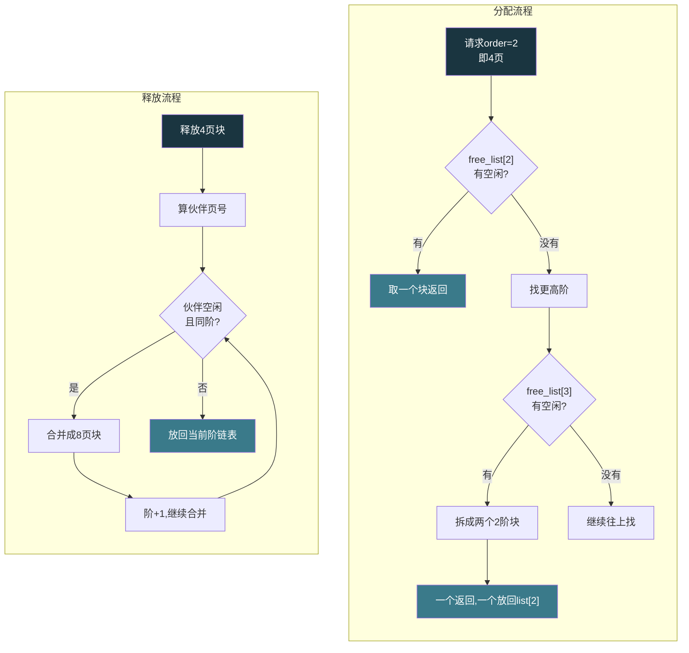
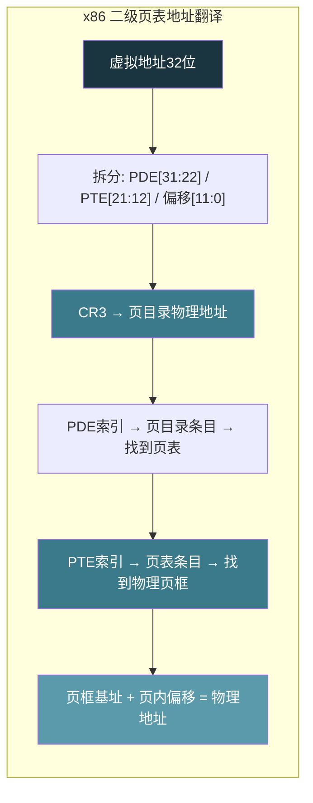
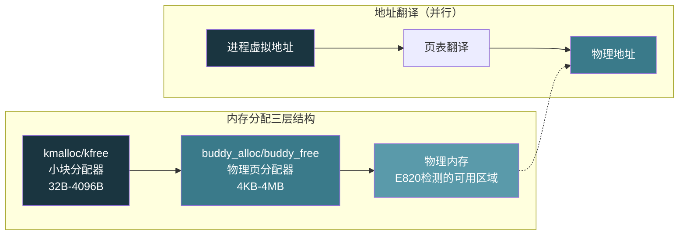

# 【化神·138】手写一个迷你操作系统（二）：内存管理和Buddy Allocator

> **码农修仙传 · 化神期 · 第138篇**
> 我是玄芯散人，带你从炼气修到大乘。

---

## 境界标识

```
╔══════════════════════════════════════╗
║     化神期 · 第138篇                  ║
║     手写一个迷你操作系统（二）         ║
║     内存管理和Buddy Allocator         ║
║     Buddy·页表·kmalloc·虚拟内存      ║
║     预计阅读：28分钟                  ║
╚══════════════════════════════════════╝
```

---

## 修仙引入

上一篇里 Bootloader 把地平了，保护模式开了，kmain 在屏幕上画出了第一行字。但一个操作系统不能只会写字。它得管自己的家当，这个家当就是内存。谁要用内存，找操作系统要。用完了还回来，给别人接着用。管不好，内存碎片满地，系统迟早卡死。

内存管理分三层。物理内存管理把可用的物理页框管起来，谁要一整页就分一页。虚拟内存管理给每个进程一张虚假的"独占4GB"视图，背后靠页表把虚拟地址翻译成物理地址。内核自己的小块分配器 kmalloc 解决"我只要32字节你给我一整页太浪费"的问题。三层各管一摊，合在一起就是操作系统的藏经阁。

---

## 硬核主体

### 物理内存管理：Buddy Allocator

操作系统启动后第一件事是搞清楚有多少物理内存可用。BIOS 的 E820 中断能查到物理内存布局，哪些区域可用，哪些被 BIOS 和硬件占用了。查到可用内存起始于 1MB，终止于 64MB，合计约 63MB 可以用。

物理内存按 4KB 一页切。63MB 就是大约 16000 多页。怎么管这些页？最简单的方法是用一个位数组，每一位对应一页，1 表示占用，0 表示空闲。但位数组没法处理"我要连续 4 页"这种请求，你得逐个扫找连续的 0。

Buddy allocator（伙伴分配器）就是解决这个问题的。它的思路是把物理内存按 2 的幂次方分组。最小单位是一页（4KB），然后更大的块依次翻倍，2 页接着 4 页再 8 页，一直到最大块。每一档有一个空闲链表。要 1 页就从 1 页链表取，要 4 页就从 4 页链表取。如果 1 页链表空了，就从 2 页链表拆一个下来，拆成两个 1 页的，分一个给你，另一个放回 1 页链表。释放时反过来，两个同样大小的空闲块如果地址相邻，就合并成一个大块。

```c
// buddy.c - 伙伴分配器简化实现
// 假设物理内存从1MB(0x100000)开始，共32MB可用

#define PAGE_SIZE 4096
#define MAX_ORDER 10          // 最大阶数：2^10 = 1024页 = 4MB（Linux内核实际为11，即8MB）
#define NUM_PAGES 8192        // 32MB / 4KB = 8192页

// 物理页描述符
struct page {
    int order;                // 当前页块的阶数（2^order页）
    int allocated;            // 是否已分配
    struct page *next;        // 空闲链表指针
    struct page *prev;
};

// 每个阶一个空闲链表头
static struct page *free_lists[MAX_ORDER + 1];
static struct page pages[NUM_PAGES];

// 物理内存起始地址
#define MEM_START 0x100000

// 页号转物理地址
static void *page_to_addr(int pfn) {
    return (void *)(MEM_START + pfn * PAGE_SIZE);
}

// 物理地址转页号
static int addr_to_pfn(void *addr) {
    return ((unsigned int)addr - MEM_START) / PAGE_SIZE;
}
```

初始化时把所有可用页作为一个大的空闲块放到最高阶链表。比如 8192 页正好是 2 的 13 次方，但我们 MAX_ORDER 是 10（1024 页），所以初始有 8 个 1024 页的大块。

分配时从目标阶往上找：

```c
// 分配2^order页的物理块
// 返回物理地址，失败返回NULL
void *buddy_alloc(int order) {
    if (order > MAX_ORDER) return NULL;

    // 找到第一个有空闲块的阶
    int o = order;
    while (o <= MAX_ORDER && free_lists[o] == NULL) {
        o++;
    }
    if (o > MAX_ORDER) return NULL;  // 没有足够大的块

    // 从链表取一个块
    struct page *block = free_lists[o];
    free_lists[o] = block->next;
    if (block->next) block->next->prev = NULL;

    // 如果取的块比请求的大，往下拆
    while (o > order) {
        o--;
        // 拆成两半，后半放回低阶链表
        int buddy_pfn = addr_to_pfn(page_to_addr(block - pages)) + (1 << o);
        struct page *buddy = &pages[buddy_pfn];
        buddy->order = o;
        buddy->next = free_lists[o];
        buddy->prev = NULL;
        if (free_lists[o]) free_lists[o]->prev = buddy;
        free_lists[o] = buddy;
    }

    block->allocated = 1;
    block->order = order;
    return page_to_addr(block - pages);
}
```

释放时检查伙伴是否也空闲，是的话合并：

```c
// 释放物理块
void buddy_free(void *addr, int order) {
    int pfn = addr_to_pfn(addr);
    struct page *block = &pages[pfn];
    block->allocated = 0;

    // 尝试和伙伴合并
    while (order < MAX_ORDER) {
        // 伙伴页号：同阶内 XOR 翻转
        int buddy_pfn = pfn ^ (1 << order);
        if (buddy_pfn >= NUM_PAGES) break;  // 越界保护
        struct page *buddy = &pages[buddy_pfn];

        // 伙伴必须空闲且同阶才能合并
        if (buddy->allocated || buddy->order != order) break;

        // 从链表摘掉伙伴
        if (buddy->prev) buddy->prev->next = buddy->next;
        else free_lists[order] = buddy->next;
        if (buddy->next) buddy->next->prev = buddy->prev;

        // 合并：取较小的页号作为新块起点
        if (buddy_pfn < pfn) pfn = buddy_pfn;
        order++;
    }

    block = &pages[pfn];
    block->order = order;
    block->next = free_lists[order];
    block->prev = NULL;
    if (free_lists[order]) free_lists[order]->prev = block;
    free_lists[order] = block;
}

// 初始化buddy池：把全部物理页切成MAX_ORDER块挂入链表
void init_buddy_pool(void) {
    for (int i = 0; i <= MAX_ORDER; i++) free_lists[i] = NULL;

    int pfn = 0;
    while (pfn < NUM_PAGES) {
        // 找当前pfn能放的最大阶（块起点必须对齐2^order）
        int order = MAX_ORDER;
        while (order > 0 && (pfn + (1 << order) > NUM_PAGES)) order--;
        // pfn必须是2^order对齐的才能挂这个阶
        while (order > 0 && (pfn % (1 << order)) != 0) order--;

        struct page *blk = &pages[pfn];
        blk->order = order;
        blk->allocated = 0;
        blk->next = free_lists[order];
        blk->prev = NULL;
        if (free_lists[order]) free_lists[order]->prev = blk;
        free_lists[order] = blk;

        pfn += (1 << order);
    }
}
```

伙伴分配器的好处是能快速分配连续物理页，而且释放时自动合并碎片。Linux 内核至今还在用 buddy 管理物理页框，只不过加了 zone（ZONE_DMA / ZONE_NORMAL / ZONE_HIGHMEM）和水位线等复杂逻辑。



### 虚拟内存：页表

物理内存管好了，下一步是虚拟内存。x86 保护模式下，如果不开分页，虚拟地址（这里叫线性地址）直接等于物理地址。开了分页后，CPU 每次访问内存都要经过页表翻译：虚拟地址 → 页表 → 物理地址。

x86 使用二级页表。32 位虚拟地址拆成三段：高 10 位是页目录索引（PDE），中间 10 位是页表索引（PTE），低 12 位是页内偏移。页目录有 1024 个条目，每个条目指向一个页表。每个页表也有 1024 个条目，每个条目指向一个物理页框。一个页目录 + 全部页表覆盖 4GB 地址空间。

页目录和页表的每个条目（PDE 和 PTE）都是 4 字节。低 12 位是标志位，高 20 位是物理页框号（因为页框地址总是 4KB 对齐，低 12 位为零，只存高 20 位就够）。标志位包括 Present（P位，存在位）、Read/Write（R/W位，读写权限）、User/Supervisor（U/S位，用户态/内核态）等。

```c
// page.c - 页表管理

#define PAGE_SIZE 4096
#define PAGE_ENTRIES 1024        // 每个页表/页目录1024个条目

// 页目录和页表的条目就是unsigned int
typedef unsigned int page_entry_t;

// 当前页目录的虚拟地址（后面解释为什么用虚拟地址）
static page_entry_t *page_directory;

// 把物理地址和标志位组合成页表条目
static page_entry_t make_entry(unsigned int phys, int flags) {
    return (phys & 0xFFFFF000) | (flags & 0x00000FFF);
}

// 常用标志位
#define PTE_PRESENT  0x001       // 存在位
#define PTE_RW       0x002       // 读写
#define PTE_USER     0x004       // 用户态可访问
```

建立页表之前有个鸡生蛋的问题：页表本身存在物理内存里，CPU 通过 CR3 寄存器找到页目录的物理地址。但开了分页后，所有地址访问都要过页表。如果页表的虚拟地址没有在页表里对应到物理地址，CPU 就找不到页表自己了。

解决办法是身份对应（identity mapping）：把虚拟地址 0 到某段范围直接对应到物理地址 0 到同一段范围。这样开了分页后，页表代码访问自己的地址仍然能走通。Linux 的做法更精巧，把内核镜像对应到高地址（0xC0000000 以上），但教学用 OS 先用身份对应最简单。

```c
// 初始化页表：身份对应前4MB物理内存
void init_paging(void) {
    // 1. 分配一个物理页做页目录
    // buddy_alloc返回物理地址，此时还没开分页，直接用物理地址
    page_entry_t *pdir = (page_entry_t *)buddy_alloc(0);

    // 清零
    for (int i = 0; i < PAGE_ENTRIES; i++) {
        pdir[i] = 0;  // 全部标记为不存在
    }

    // 2. 前4MB身份对应：页目录前2个条目各指向一个页表
    // 每个页表覆盖4MB / 1024 = 4MB？不对
    // 一个页表1024条目×4KB = 4MB，一个PDE条目对应4MB
    // 前4MB需要1个页表（条目0）
    page_entry_t *ptab0 = (page_entry_t *)buddy_alloc(0);
    for (int i = 0; i < PAGE_ENTRIES; i++) {
        // 虚拟i×4KB -> 物理i×4KB
        unsigned int phys = i * PAGE_SIZE;
        ptab0[i] = make_entry(phys, PTE_PRESENT | PTE_RW);
    }
    // 页目录条目0指向页表0
    pdir[0] = make_entry((unsigned int)ptab0, PTE_PRESENT | PTE_RW);

    // 3. 把内核代码区域也身份对应（假设内核在0x10000-0x100000）
    // 上面已经覆盖了0-4MB，内核在1MB以内，够用

    // 4. 加载CR3，开启分页
    __asm__ volatile (
        "mov %0, %%cr3"           // 页目录物理地址写入CR3
        :: "r"(pdir)
    );

    unsigned int cr0;
    __asm__ volatile (
        "mov %%cr0, %0"           // 读CR0
        : "=r"(cr0)
    );
    cr0 |= 0x80000000;           // PG位置1，开启分页（x86写CR3会自动flush非global TLB条目）
    __asm__ volatile (
        "mov %0, %%cr0"           // 写回CR0
        :: "r"(cr0)
    );
}
```

开分页后要注意一件事：之前 buddy_alloc 返回的是物理地址，分页前直接用没问题。分页后所有地址都是虚拟地址，buddy 分配器内部的 pages 数组和 free_lists 需要通过虚拟地址访问。教学阶段用身份对应就好，物理地址 0x100000 对应虚拟地址 0x100000，指针直接用。

后面如果要支持用户进程，每个进程有自己的页目录。进程切换时把 CR3 换成新进程的页目录物理地址，这就实现了进程间内存隔离。一个进程改自己页表里对应物理页的内容，不会波及另一个进程。



### kmalloc：内核的小块分配器

Buddy 分配器最小给一页（4KB）。内核经常需要几十字节的小内存，比如建一个链表节点、存一个字符串。每次都分一页太浪费。kmalloc 就是在 buddy 之上再加一层，管理小块内存。

Linux 的 kmalloc 底层用 slab allocator。slab 的思路是：预先分配一整页，切成固定尺寸的小块，比如 32 字节的一种，64 字节的另一种，128 字节的又一种，每种大小对应一个 slab 池。要 32 字节就从 32 字节池取一个，释放还回去。不用每次切页。

教学用 OS 可以简化。做一个最简单的固定大小池：

```c
// kmalloc.c - 简化版内核内存分配器

// 支持的块大小档次
// 32, 64, 128, 256, 512, 1024, 2048, 4096
#define NUM_BUCKETS 8
static const int bucket_sizes[NUM_BUCKETS] = {32, 64, 128, 256, 512, 1024, 2048, 4096};

// 每个档次一个空闲链表
typedef struct kblock {
    struct kblock *next;
} kblock_t;

static kblock_t *free_buckets[NUM_BUCKETS];

// 初始化：为每个档次分配一页，切块挂链表
void kmalloc_init(void) {
    for (int b = 0; b < NUM_BUCKETS; b++) {
        int size = bucket_sizes[b];
        int count = PAGE_SIZE / size;  // 一页能切多少块

        // 从buddy要一页
        void *page = buddy_alloc(0);
        if (!page) continue;

        // 切成小块挂链表
        kblock_t *prev = NULL;
        for (int i = 0; i < count; i++) {
            kblock_t *blk = (kblock_t *)((char *)page + i * size);
            blk->next = prev;
            prev = blk;
        }
        free_buckets[b] = prev;
    }
}

// 找到合适的档次
static int find_bucket(int size) {
    for (int b = 0; b < NUM_BUCKETS; b++) {
        if (bucket_sizes[b] >= size) return b;
    }
    return -1;
}

void *kmalloc(unsigned int size) {
    int b = find_bucket(size);
    if (b < 0) {
        // 太大，直接从buddy要整页
        int order = 0;
        int pages = (size + PAGE_SIZE - 1) / PAGE_SIZE;
        while ((1 << order) < pages) order++;
        return buddy_alloc(order);
    }

    // 从对应档次链表取一块
    kblock_t *blk = free_buckets[b];
    if (!blk) {
        // 池空了，分配新页切块
        void *page = buddy_alloc(0);
        if (!page) return NULL;
        int count = PAGE_SIZE / bucket_sizes[b];
        kblock_t *prev = NULL;
        for (int i = 0; i < count; i++) {
            kblock_t *k = (kblock_t *)((char *)page + i * bucket_sizes[b]);
            k->next = prev;
            prev = k;
        }
        free_buckets[b] = prev;
        blk = free_buckets[b];
    }

    free_buckets[b] = blk->next;
    return blk;
}

void kfree(void *ptr, unsigned int size) {
    int b = find_bucket(size);
    if (b < 0) {
        // 大块归还buddy
        int order = 0;
        int pages = (size + PAGE_SIZE - 1) / PAGE_SIZE;
        while ((1 << order) < pages) order++;
        buddy_free(ptr, order);
        return;
    }
    // 小块挂回链表
    kblock_t *blk = (kblock_t *)ptr;
    blk->next = free_buckets[b];
    free_buckets[b] = blk;
}
```

这个实现的问题是没有记录每块属于哪个档次，kfree 需要调用者传入 size。Linux 的 slab 在分配时会在块头藏一个元数据，kfree 时读出来就知道该归还哪个池。教学阶段先简单处理。

kfree 还有一个问题：如果调用者传错 size，块就会挂到错误的链表，后续 kmalloc 取出来大小不对，踩内存。生产级分配器会在块头加 magic number 校验，写错了直接 panic。

### 三层关系

把三层串起来看：



kmalloc 在 buddy 之上切小块。buddy 管理物理页框。页表把虚拟地址翻译成物理地址。三者各管一层，kmalloc 分配的内存地址是虚拟地址（开了分页后），经过页表翻译找到物理页框，物理页框由 buddy 管理。

实际代码里 kmalloc 调用 buddy_alloc 拿物理页，但返回的指针是虚拟地址。在身份对应阶段两者相等，所以代码能直接跑。后面支持了全部虚拟内存后，buddy_alloc 需要返回物理地址，kmalloc 层负责通过 v_to_p（虚拟转物理）和 p_to_v（物理转虚拟）函数做转换。Linux 里用 page 结构体数组做这层桥梁，pages 数组本身在虚拟地址空间，数组索引是物理页号。

### 一个容易踩的坑：缺页中断

开了分页后，访问一个 PTE 标记为 Present=0 的地址会触发 Page Fault（中断号 14）。CPU 把出错的虚拟地址放到 CR2 寄存器，然后跳到 IDT 里第 14 号中断对应的处理函数。

缺页中断是操作系统的关键机制。进程申请内存时只标记"这块虚拟地址属于我"但不实际分配物理页（demand paging）。等进程真写数据时触发缺页中断，内核在处理函数里才分配物理页，建立页表条目，然后重新执行那条指令。进程完全不知道中间发生了中断。

```c
// pagefault_handler.c - 缺页中断处理（简化版）

void page_fault_handler(struct registers *regs) {
    unsigned int fault_addr;
    __asm__ volatile ("mov %%cr2, %0" : "=r"(fault_addr));

    // 检查这个地址是不是属于某个已登记但未分配的区域
    // 如果是，分配物理页，建立页表条目
    // 如果不是，杀掉进程（段错误）

    void *page = buddy_alloc(0);  // 分配一页物理内存
    if (!page) {
        // 内存不够了，OOM
        panic("Out of memory!");
    }

    // 在页表里建立对应关系
    map_page(fault_addr, (unsigned int)page, PTE_PRESENT | PTE_RW | PTE_USER);
    // map_page做的事：
    // 1. 从fault_addr算出PDE索引和PTE索引
    // 2. 如果PDE不存在，分配一个页表
    // 3. 设置PTE条目指向新分配的物理页
}
```

demand paging 省内存。一个进程声称要 1GB，实际可能只用了 10MB 的页。不开 demand paging 的话，内核得预分配 1GB 物理页，十个进程就 OOM 了。开了之后，只有真正被访问到的页才占物理内存。

---

## 修仙术语对照表

| 修仙术语 | 技术现实 | 本篇位置 |
|---------|---------|---------:|
| 开山立派 | 写操作系统 | 修仙引入 |
| 藏经阁 | 内存管理系统 | 修仙引入 |
| 家当盘点 | E820检测物理内存 | 物理内存管理 |
| 伙伴分铺 | Buddy分配器拆分合并 | 物理内存管理 |
| 铺面档位 | Buddy的order阶数 | 物理内存管理 |
| 门牌簿 | 页表PDE/PTE条目 | 虚拟内存 |
| 身份铭牌 | 身份对应identity mapping | 虚拟内存 |
| 乾坤大挪移 | CR3切换实现进程隔离 | 虚拟内存 |
| 小物件格架 | kmalloc固定大小池 | kmalloc |
| 分格取物 | slab池按大小分档 | kmalloc |
| 虚实幻境 | 虚拟地址空间 | 虚拟内存 |
| 灵力按需注入 | demand paging按需分页 | 缺页中断 |
| 护山大阵 | 缺页中断处理机制 | 缺页中断 |
| OOM天劫 | 内存耗尽panic | 缺页中断 |

---

## 进阶条件

- [ ] 用 E820 或 hardcoded 方式拿到物理内存大小，初始化 pages 数组
- [ ] buddy_alloc 能正确分配和释放 2 的幂次方页块
- [ ] buddy_free 能正确合并相邻伙伴块到更高阶
- [ ] 建好页目录和至少一个页表，身份对应前 4MB
- [ ] 设好 CR3 和 CR0.PG 位后不崩，kmain 继续正常执行
- [ ] kmalloc 能分配 32/64/128 字节小块，kfree 能归还
- [ ] 写一个 page fault 处理函数，能打印 CR2 里的出错地址
- [ ] 用 kmalloc 在内核里建一个链表，不踩内存

下一篇会让这个 OS 活起来。进程控制块怎么设计，上下文切换怎么保存恢复寄存器，调度器怎么决定下一个跑谁。内存管好了，该让多个人轮着用了。

---

## 下期预告 + 互动

下一篇：手写一个迷你操作系统（三）：进程调度。讲进程控制块 PCB，就绪队列，上下文切换（TSS 和手工保存寄存器），简单的轮转调度器。操作系统要支持多任务，得能在进程间切换，这件事比内存管理还要刺激。

互动问题：你觉得 demand paging 是省内存还是添麻烦？如果物理内存够大，预分配和按需分配哪个更适合教学 OS？评论区聊聊。

我是玄芯散人，带你从炼气修到大乘。

---

*本文是「码农修仙传」系列第138篇。系列导航见 [xren.ren](https://xren.ren)*
