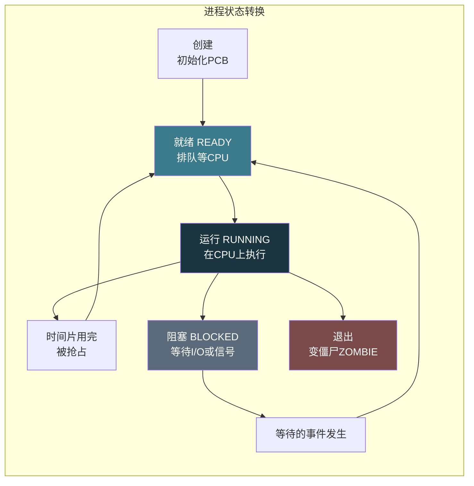
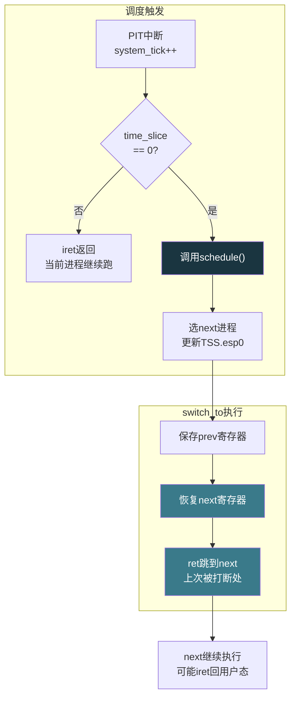

# 【化神·139】手写一个迷你操作系统（三）：进程调度

> **码农修仙传 · 化神期 · 第139篇**
> 我是玄芯散人，带你从炼气修到大乘。

---

## 境界标识

```
╔══════════════════════════════════════╗
║     化神期 · 第139篇                  ║
║     手写一个迷你操作系统（三）         ║
║     进程调度和上下文切换               ║
║     PCB·就绪队列·switch_to·轮转       ║
║     预计阅读：30分钟                  ║
╚══════════════════════════════════════╝
```

---

## 修仙引入

上一篇把内存管好了，操作系统有了藏经阁。但藏经阁里一个人都没有，空荡荡的。操作系统得让多个进程轮着用CPU，才算活过来。

一个人独占一台机器，那不叫操作系统，叫单片机裸跑。操作系统的存在意义就是让多个任务共享一颗CPU。浏览器在渲染页面，音乐播放器在解码MP3，后台还在跑编译。看起来同时发生，其实是CPU在不同进程间快速切换，每个进程跑一小会儿就被换下来，换下一个上。这个"换人"的动作叫上下文切换，决定谁先上的规则叫调度器。这一篇就亲手实现这两样东西。

---

## 硬核主体

### 进程控制块：每个进程的家谱档案

操作系统要管理多个进程，首先得知道每个进程长什么样。进程控制块（PCB，Process Control Block）就是操作系统给每个进程建的档案，里面记着这个进程需要恢复执行的全部信息。

PCB 里存什么？第一类是CPU寄存器快照。进程被换下CPU时，它正在用的一堆寄存器（EAX/EBX/ECX/EDX/ESI/EDI/EBP/ESP/EIP/EFLAGS）都得保存下来，等下次换回来时恢复，不然CPU状态全乱了。第二类是进程元信息，包括进程ID，状态（就绪还是运行还是阻塞），页目录物理地址（CR3的值），优先级以及时间片剩余量。第三类是调度链表指针，用于把PCB挂到就绪队列或阻塞队列上。

```c
// proc.h - 进程控制块定义

// 进程状态
#define PROC_UNUSED   0    // PCB槽位空闲
#define PROC_READY    1    // 就绪，等着上CPU
#define PROC_RUNNING  2    // 正在CPU上跑
#define PROC_BLOCKED  3    // 阻塞，等某个事件（比如I/O）
#define PROC_ZOMBIE   4    // 僵尸，已退出但父进程还没收尸

// 进程内核栈大小（4KB）
#define KERNEL_STACK_SIZE 4096

// 上下文快照：保存被切换出去时的寄存器
// 字段顺序必须和switch_to汇编里的push顺序一致
struct cpu_context {
    unsigned int edi;
    unsigned int esi;
    unsigned int ebp;
    unsigned int ebx;
    unsigned int eip;     // 恢复后从这里继续执行
};

// 进程控制块
struct pcb {
    int pid;                          // 进程ID
    int state;                        // 当前状态
    int priority;                     // 优先级（数字越大越优先）
    int time_slice;                   // 剩余时间片（tick数）
    unsigned int page_dir;            // 页目录物理地址（写入CR3用）
    struct cpu_context context;       // 寄存器快照
    char kernel_stack[KERNEL_STACK_SIZE]; // 内核栈
    struct pcb *next;                 // 就绪队列链表指针
};

// 最大进程数
#define MAX_PROCS 16

// 进程表
static struct pcb proc_table[MAX_PROCS];

// 当前正在运行的进程
struct pcb *current_proc = NULL;
```

这里有个设计选择：内核栈放在PCB结构体内部。Linux的做法是把内核栈和PCB（task_struct）分开存，通过thread_info做关联。教学OS把两者放一起更简单，切换时直接用 `proc->kernel_stack + KERNEL_STACK_SIZE` 当栈顶。

### 进程状态机

一个进程从生到死，经历几种状态。状态之间的转换构成了进程的状态机：



几个转换条件要注意：就绪到运行是调度器选中它。运行到就绪是时间片耗尽被抢占。运行到阻塞是进程主动调用sleep或等I/O。阻塞不能直接到运行，必须先回就绪队列排队。僵尸状态是进程已执行完exit，但PCB还在内存里，等父进程调用wait回收。

### 上下文切换：换人上场的核心动作

上下文切换是进程调度里最精巧的一步。做的是这件事：把当前进程的寄存器存到它的PCB里，把下一个进程的寄存器恢复到CPU上，然后跳过去继续执行。

x86上实现上下文切换有两种路径。一种是硬件任务切换，用TSS（Task State Segment）。CPU有一条 `jmp TSS选择子` 的指令，CPU自动保存当前寄存器到旧TSS，加载新TSS里的寄存器。这种方式操作系统代码少，但CPU做的工作多，而且每次切换要读写TSS内存，速度慢。Linux 2.2以后就放弃了硬件切换，改成软件切换。

软件切换就是用汇编手动push/pop寄存器。好处是操作系统可以精确控制保存哪些寄存器，跳过不需要保存的（比如浮点寄存器可以延迟保存），速度更快。

```c
// switch_to.h - 上下文切换声明
// 从prev进程切换到next进程
extern void switch_to(struct pcb *prev, struct pcb *next);
```

```asm
; switch_to.asm - x86 上下文切换汇编实现
; void switch_to(struct pcb *prev, struct pcb *next)
; 调用约定：cdecl，参数从栈上取

[bits 32]
global switch_to

switch_to:
    push ebp
    mov  ebp, esp

    ; 参数：[ebp+8] = prev, [ebp+12] = next
    mov  eax, [ebp + 8]    ; eax = prev
    mov  edx, [ebp + 12]   ; edx = next

    ; 保存当前进程的寄存器到prev->context
    ; struct cpu_context里字段顺序: edi, esi, ebp, ebx, eip
    ; pcb前5个int字段(pid/state/priority/time_slice/page_dir)共20字节
    ; context从偏移20开始
    mov  [eax + 20], edi     ; prev->context.edi
    mov  [eax + 24], esi     ; prev->context.esi
    mov  ecx, [ebp]          ; 取保存的旧ebp
    mov  [eax + 28], ecx     ; prev->context.ebp
    mov  [eax + 32], ebx     ; prev->context.ebx

    ; 保存返回地址到prev->context.eip
    ; 当这个进程下次被switch回来时，从ret指令后面继续
    mov  ecx, [ebp + 4]      ; 取返回地址
    mov  [eax + 36], ecx     ; prev->context.eip

    ; 切换到next进程的内核栈
    ; next的栈顶 = &next->context + sizeof(context)
    ; 也就是context结构体的末尾，因为恢复时用pop从context倒着弹出来
    lea  esp, [edx + 20]     ; 指向next->context起始处
    ; 实际上更精确的做法是预先算好栈顶
    ; 这里简化处理：把context区域的地址当栈用

    ; 恢复next进程的寄存器
    mov  edi, [edx + 20]     ; next->context.edi
    mov  esi, [edx + 24]     ; next->context.esi
    mov  ebx, [edx + 32]     ; next->context.ebx
    mov  ebp, [edx + 28]     ; next->context.ebp

    ; 恢复EIP：把next->context.eip压到栈上，ret会弹出跳过去
    push dword [edx + 36]    ; next->context.eip
    ret                      ; 跳到next上次被切换走时的返回地址

    ; 不会执行到这里
```

这段汇编的精妙之处在于：`switch_to` 函数永远不会"返回"。当进程A调用 `switch_to(A, B)` 时，A的寄存器被保存到A的context里，CPU跳到B上次被切走时的位置继续跑B。等将来某个时刻B调用 `switch_to(B, A)`，B的寄存器存好，CPU恢复A的寄存器，然后 `ret` 跳回A当年调用 `switch_to` 后面的那条指令。A觉得 `switch_to` 正常返回了，其实中间可能过了几毫秒甚至几秒。

第一次启动一个新进程时，它的context.eip应该指向进程入口函数的地址。这样第一次switch_to到它时，ret会跳到入口函数开始执行。

### TSS：x86的硬件任务切换遗产

前面提到TSS。即使不用硬件任务切换，x86保护模式下TSS仍然必须存在。原因是CPU从用户态（ring3）通过中断或系统调用进入内核态（ring0）时，需要知道内核栈在哪。这个信息存在TSS里。

TSS是一个104字节的结构体，里面记录了ring0的SS0和ESP0（内核栈段和栈指针），还有一组寄存器快照（用于硬件切换，软件切换时忽略）。CPU通过TR（Task Register）寄存器找到当前TSS。

```c
// tss.h - Task State Segment

struct tss_entry {
    unsigned int prev_task_link;  // 前一个任务的TSS选择子（硬件切换用）
    unsigned int esp0;            // ring0栈指针（软件切换也需要这个！）
    unsigned int ss0;             // ring0栈段
    unsigned int esp1, ss1;       // ring1（x86一般不用）
    unsigned int esp2, ss2;       // ring2（同上）
    unsigned int cr3;             // 页目录物理地址
    unsigned int eip, eflags;     // 以下都是寄存器快照（硬件切换用）
    unsigned int eax, ecx, edx, ebx;
    unsigned int esp, ebp, esi, edi;
    unsigned int es, cs, ss, ds, fs, gs;
    unsigned int ldt_selector;
    unsigned int trap_flag;
    unsigned int io_map_base;     // I/O权限位图偏移
} __attribute__((packed));

// 全局只有一个TSS
static struct tss_entry kernel_tss;

// 初始化TSS
void init_tss(void) {
    // 填好ring0栈信息
    kernel_tss.ss0 = 0x10;       // 内核数据段选择子
    kernel_tss.esp0 = 0;         // 后面创建进程时动态设置
    kernel_tss.io_map_base = sizeof(struct tss_entry); // 不允许任何I/O端口

    // 在GDT里建一个TSS描述符，加载到TR寄存器
    // GDT第6个描述符放TSS（假设前5个是null+代码+数据+用户代码+用户数据）
    gdt_set_gate(5, (unsigned int)&kernel_tss, sizeof(struct tss_entry) - 1,
                 0x89, 0x00);   // 0x89 = Present | TSS类型

    // 加载TR
    __asm__ volatile ("ltr %%ax" :: "a"(0x28));  // 0x28 = 5*8 = TSS选择子（TI=0, RPL=0）
}
```

用软件切换时，TSS里的寄存器快照字段全是摆设，CPU不读也不写。真正用到的是ss0和esp0。当用户态进程触发系统调用或中断，CPU每次进内核态时读TSS的ss0和esp0，切换到内核栈。所以每次进程切换时，要更新TSS的esp0为下一个进程的内核栈顶。

```c
// 进程切换时更新TSS的esp0
void update_tss_esp0(struct pcb *proc) {
    kernel_tss.esp0 = (unsigned int)proc->kernel_stack + KERNEL_STACK_SIZE;
}
```

### 调度器：谁先上，谁等着

调度器的工作是维护一个就绪队列，每次当前进程的时间片用完了，或者主动让出CPU，就从就绪队列里挑一个进程来跑。

最简单的调度算法是轮转调度（Round Robin）。所有就绪进程排成一队，调度器每次取队首进程运行，给它分配一个时间片（比如10个tick）。时间片用完就放回队尾，换下一个上。如果进程主动让出CPU（调用sleep或等I/O），不回就绪队列而是进阻塞队列。

```c
// scheduler.c - 轮转调度器

// 就绪队列头
static struct pcb *ready_queue = NULL;

// tick计数器，定时器中断每触发一次加1
static unsigned int system_tick = 0;

// 默认时间片
#define DEFAULT_TIME_SLICE 10

// 把进程加入就绪队列尾部
void enqueue_ready(struct pcb *proc) {
    proc->state = PROC_READY;
    proc->next = NULL;

    if (ready_queue == NULL) {
        ready_queue = proc;
    } else {
        struct pcb *tail = ready_queue;
        while (tail->next != NULL) {
            tail = tail->next;
        }
        tail->next = proc;
    }
}

// 从就绪队列取队首
struct pcb *dequeue_ready(void) {
    if (ready_queue == NULL) return NULL;
    struct pcb *proc = ready_queue;
    ready_queue = proc->next;
    proc->next = NULL;
    return proc;
}

// 调度：选下一个进程并切换
void schedule(void) {
    struct pcb *next = dequeue_ready();
    if (next == NULL) {
        // 就绪队列为空，当前进程继续跑（或者切到idle）
        // 如果当前进程是RUNNING状态，让它继续
        if (current_proc && current_proc->state == PROC_RUNNING) {
            current_proc->time_slice = DEFAULT_TIME_SLICE;
            return;
        }
        // 真的没有可运行进程了，进入idle
        // 实际OS会用hlt指令让CPU休眠降低功耗
        __asm__ volatile ("hlt");
        return;
    }

    struct pcb *prev = current_proc;

    // 当前进程状态处理
    if (prev && prev->state == PROC_RUNNING) {
        // 时间片用完，放回就绪队列
        enqueue_ready(prev);
    }

    // 切换到next
    next->state = PROC_RUNNING;
    next->time_slice = DEFAULT_TIME_SLICE;
    current_proc = next;

    // 更新TSS的esp0为next的内核栈顶
    update_tss_esp0(next);

    // 切换页目录（如果next有自己的页目录）
    if (next->page_dir) {
        __asm__ volatile ("mov %0, %%cr3" :: "r"(next->page_dir));
    }

    // 执行上下文切换
    if (prev) {
        switch_to(prev, next);
    } else {
        // 第一次启动，没有prev
        // 直接设好next的寄存器然后跳过去
        switch_to(current_proc, next);
    }
}
```

### 定时器中断：调度的驱动源

调度器需要一个驱动源来触发时间片检查。x86上用PIT（Programmable Interval Timer，可编程间隔定时器）或APIC定时器产生周期性中断。PIT的默认频率是每秒100次（每10ms一次中断），每次中断就是一个tick。

定时器中断处理函数里做三件事：更新system_tick，递减当前进程的time_slice，如果time_slice归零就调用schedule。

```c
// timer.c - 定时器中断处理

// PIT通道0的数据端口
#define PIT_CHANNEL0  0x40
#define PIT_COMMAND   0x43

// 初始化PIT：100Hz，每10ms一个tick
void init_timer(unsigned int frequency) {
    unsigned int divisor = 1193182 / frequency;  // PIT基准频率1193182Hz

    // 通道0，先低字节后高字节，方波模式
    outb(PIT_COMMAND, 0x36);

    // 分频值拆成低字节和高字节
    outb(PIT_CHANNEL0, divisor & 0xFF);
    outb(PIT_CHANNEL0, (divisor >> 8) & 0xFF);
}

// 定时器中断处理函数（IRQ0，中断号32）
void timer_handler(struct registers *regs) {
    system_tick++;

    if (current_proc && current_proc->state == PROC_RUNNING) {
        current_proc->time_slice--;
        if (current_proc->time_slice <= 0) {
            // 时间片用完，触发调度
            // schedule从中断处理返回时不会回到被中断的进程
            // 而是回到新选中的进程（因为switch_to改了栈）
            schedule();
        }
    }
}
```

这里有个容易搞混的地方：schedule调用switch_to，switch_to用ret跳到next进程上次被打断的位置。如果next进程之前是在定时器中断里被切走的，它恢复后用iret返回，回到被中断时正在执行的用户代码。如果next进程之前是在普通函数里调用schedule被切走的，它恢复后继续执行schedule调用点后面的代码。



### 创建第一个进程

操作系统刚启动时没有进程。得手动造一个。这个"第一个进程"的PCB是静态填好的，它的context.eip指向一个入口函数，然后调用switch_to切过去。

```c
// 创建新进程
struct pcb *create_process(void (*entry)(void), unsigned int page_dir) {
    // 找一个空闲PCB槽位
    int i;
    for (i = 0; i < MAX_PROCS; i++) {
        if (proc_table[i].state == PROC_UNUSED) {
            break;
        }
    }
    if (i >= MAX_PROCS) return NULL;  // 进程表满了

    struct pcb *proc = &proc_table[i];
    proc->pid = i + 1;  // PID从1开始，0保留给内核idle
    proc->state = PROC_READY;
    proc->priority = 1;
    proc->time_slice = DEFAULT_TIME_SLICE;
    proc->page_dir = page_dir;
    proc->next = NULL;

    // 设置上下文：寄存器初始值
    // EIP指向入口函数地址
    proc->context.eip = (unsigned int)entry;
    proc->context.ebp = 0;
    proc->context.esp = 0;  // 进程的栈用的是kernel_stack，下面设置
    proc->context.ebx = 0;
    proc->context.esi = 0;
    proc->context.edi = 0;

    // 内核栈顶指向kernel_stack数组的末尾（栈从高往低长）
    // switch_to恢复时ESP要从context区域取，所以这里把栈顶值
    // 存到context结构体后面（或者单独处理）
    // 简化做法：让entry函数自己设置栈

    // 加入就绪队列
    enqueue_ready(proc);
    return proc;
}

// 启动第一个进程
void start_first_process(void) {
    // idle进程（PID=0），作为current_proc的初始值
    // idle进程不做事，hlt等待中断
    proc_table[0].pid = 0;
    proc_table[0].state = PROC_RUNNING;
    proc_table[0].time_slice = DEFAULT_TIME_SLICE;
    proc_table[0].page_dir = 0;  // 用内核页目录
    current_proc = &proc_table[0];

    // 创建第一个用户进程：跑一个测试函数
    create_process(test_process_a, 0);
    create_process(test_process_b, 0);

    // 开始调度
    schedule();
}

// 测试进程A
void test_process_a(void) {
    while (1) {
        // 往屏幕写个字符证明自己在跑
        // 用VGA文本模式的0xB8000地址
        volatile char *video = (volatile char *)0xB8000;
        video[0] = 'A';
        video[1] = 0x0A;  // 绿色
        // 让出CPU（主动yield）
        yield();
    }
}

// 测试进程B
void test_process_b(void) {
    while (1) {
        volatile char *video = (volatile char *)0xB8002;
        video[0] = 'B';
        video[1] = 0x0B;  // 青色
        yield();
    }
}

// 进程主动让出CPU
void yield(void) {
    if (current_proc) {
        // 当前进程从RUNNING变READY，回到就绪队列
        // schedule会处理这个转换
        current_proc->time_slice = 0;  // 强制触发调度
        schedule();
    }
}
```

两个测试进程交替往VGA显存写字符，你会在屏幕上看到A和B交替闪烁。虽然只是两个死循环写屏幕，但它们的CPU时间靠调度器分配，轮着跑。

### 关于优先级

轮转调度对所有进程一视同仁，但实际系统里进程有轻重缓急之分。键盘响应必须快，后台编译可以慢。优先级调度就是在轮转基础上加权重：高优先级进程时间片更长，或者调度时优先选高优先级的进程。

最简单的改法是在dequeue_ready时遍历整个队列找优先级最高的，这叫优先级调度。但它有个问题：如果高优先级进程一直占着CPU，低优先级进程永远没机会。这叫饥饿。

解决饥饿的办法是老化（aging）：进程在就绪队列里待的时间越长，优先级越高。比如每等100个tick优先级加1，最终低优先级进程也能攒够优先级被调度上。Linux的CFS调度器用的是另一套思路，按vruntime排序，谁跑得少谁先上，这里不展开。

---

## 修仙术语对照表

| 修仙术语 | 技术现实 | 本篇位置 |
|---------|---------|---------:|
| 开山立派 | 写操作系统 | 修仙引入 |
| 弟子轮值 | 多进程共享CPU | 修仙引入 |
| 家谱档案 | PCB进程控制块 | PCB定义 |
| 弟子状态簿 | 进程状态机 | 状态机 |
| 换人上场 | 上下文切换switch_to | 上下文切换 |
| 功法断点 | context.eip保存返回地址 | 上下文切换 |
| 旧洞府遗物 | TSS硬件任务切换遗产 | TSS |
| 入门通行证 | TSS.esp0供ring0栈切换 | TSS |
| 值日排班表 | 就绪队列轮转调度 | 调度器 |
| 值更鼓 | PIT定时器中断tick | 定时器中断 |
| 功力配额 | 时间片time_slice | 调度器 |
| 开山弟子 | 第一个进程create_process | 创建进程 |
| 闭关弟子 | 阻塞状态BLOCKED | 状态机 |
| 功德散尽 | 僵尸状态ZOMBIE | 状态机 |
| 长幼有序 | 优先级调度 | 优先级 |

---

## 进阶条件

- [ ] PCB结构体定义齐全，包含寄存器快照和元信息字段
- [ ] switch_to汇编能正确保存prev的寄存器，恢复next的寄存器后跳转
- [ ] 进程切换后TSS.esp0更新为新进程的内核栈顶
- [ ] PIT初始化为100Hz，定时器中断处理函数能递减time_slice
- [ ] time_slice归零时调用schedule，从就绪队列取下一个进程
- [ ] 能创建至少两个进程，通过yield交替执行，屏幕上看到交替输出
- [ ] 就绪队列为空时调度器不崩溃，进入idle等待
- [ ] 理解硬件任务切换和软件切换的区别，能说出为什么Linux选软件切换

下一篇是本系列的最后一篇。Shell怎么读命令，系统调用怎么从用户态进内核态，fork和exec怎么造新进程。操作系统三件套齐了：能启动，能管内存，能调度进程，最后还得能跟人交互。

---

## 下期预告 + 互动

下一篇：手写一个迷你操作系统（四）：Shell和系统调用。讲系统调用入口（int 0x80或sysenter），Shell的命令解析循环，fork/exec/wait三件套怎么配合。一个能接受命令的操作系统才算真的能用的操作系统。

互动问题：你觉得轮转调度的时间片设多大合适？10ms和1ms对用户体验有什么差别？太大或太小各有什么问题？评论区聊聊。

我是玄芯散人，带你从炼气修到大乘。

---

*本文是「码农修仙传」系列第139篇。系列导航见 [xren.ren](https://xren.ren)*
