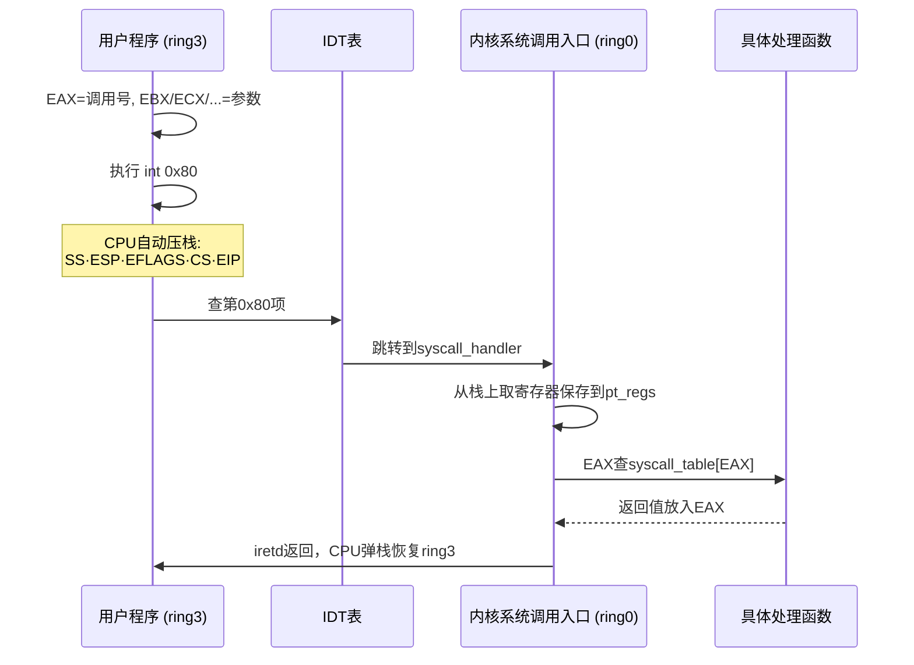
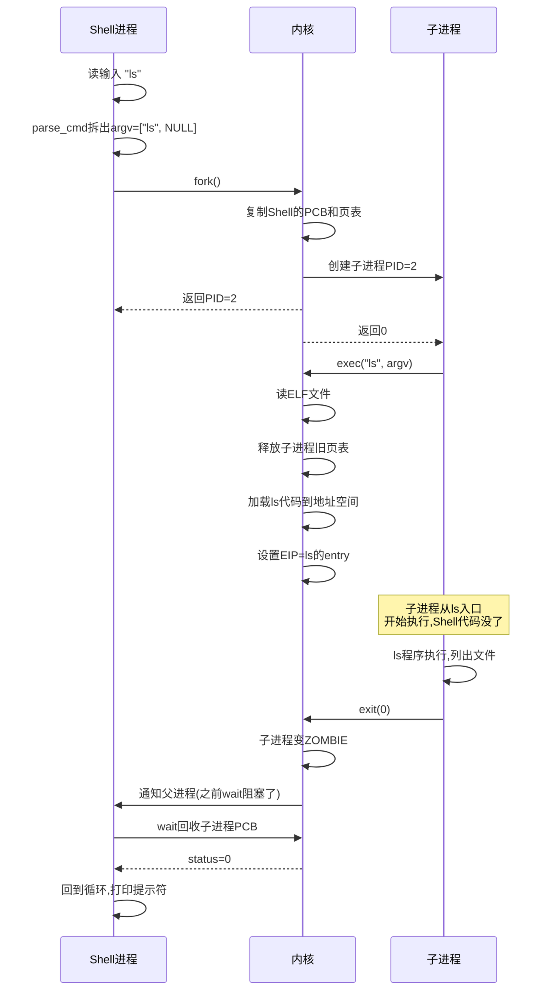

# 【化神·140】手写一个迷你操作系统（四）：Shell和系统调用

> **码农修仙传 · 化神期 · 第140篇**
> 我是玄芯散人，带你从炼气修到大乘。

---

## 境界标识

```
╔══════════════════════════════════════╗
║     化神期 · 第140篇                  ║
║     手写一个迷你操作系统（四）         ║
║     Shell和系统调用                   ║
║     int 0x80·fork·exec·wait          ║
║     预计阅读：30分钟                  ║
╚══════════════════════════════════════╝
```

---

## 修仙引入

前三篇搭好了三根柱子：Bootloader把机器从实模式拉进保护模式，内存管理让系统能分配回收物理页和虚拟地址空间，进程调度让多个进程轮着上CPU。但这个操作系统还是个哑巴，没有任何办法跟人交互。你不能输入命令，不能启动新程序，不能等待子进程结束。

一个真正能用的操作系统，得有一扇门：外面的人能敲门进来，里面的进程能出去办事。这扇门叫系统调用。还得有一个前台接待：听你说话，翻译成系统能懂的指令。这个前台叫Shell。这一篇就亲手实现这两样东西，把迷你OS从"能跑"变成"能用"。

---

## 硬核主体

### 系统调用：用户态和内核态之间的门

前面几篇实现的所有功能，包括调度器、内存分配器还有页表切换，都在内核态运行。但用户程序不能直接调用内核函数。内核代码运行在ring0，用户程序运行在ring3，CPU特权级不同，直接call内核函数会被处理器拦住。

系统调用就是用户态进程进入内核态的合法通道。流程是这样：用户程序把参数塞进寄存器（EAX放系统调用号，EBX/ECX/EDX/ESI/EDI放参数），然后执行一条特殊的指令让CPU离开ring3进入ring0。内核拿到控制权后读EAX判断要干什么，处理完把返回值塞回EAX，再切回ring3继续执行用户程序。

第一种是软中断 `int 0x80`。这是最经典也最容易理解的方式。CPU执行 `int N` 时，会把当前寄存器压栈，包括SS、ESP、EFLAGS、CS和EIP五个值，然后查中断描述符表（IDT），跳到对应的中断处理函数。`int 0x80` 触发的是第128号中断向量，对应内核的系统调用入口。Linux 2.6以前就是用这种方式。

第二种是 `sysenter` 指令。Intel在Pentium II引入了SYSENTER/SYSEXIT指令对，专门做快速系统调用。不走IDT查表，直接读MSR寄存器（Model Specific Register）拿到内核代码入口和栈地址，省了中断压栈的开销。Linux 2.6开始支持。

第三种是 `syscall` 指令。AMD在x86-64中引入，比sysenter更快，利用MSR_LSTAR寄存器直接指定入口地址。现代64位Linux默认用 `syscall`。

我们的迷你OS用最经典的 `int 0x80` 方式，简单直观，适合理解原理。



### IDT设置：给0x80号中断注册处理函数

系统调用的前提是IDT里第0x80项指向你的系统调用入口。上一篇讲中断时提过IDT，现在要往里写一个具体的门描述符。

```c
// idt.c - 设置系统调用门

// 中断门描述符结构（8字节）
struct idt_entry {
    unsigned short base_low;    // 处理函数地址低16位
    unsigned short selector;     // 代码段选择子（ring0的CS）
    unsigned char  zero;        // 保留，填0
    unsigned char  flags;       // P·DPL·类型
    unsigned short base_high;   // 处理函数地址高16位
};

// IDT表（256项）
struct idt_entry idt[256];

// 设置一个中断门
// num: 中断号, base: 处理函数地址, sel: 段选择子, flags: 标志
void idt_set_gate(int num, unsigned int base, unsigned short sel, unsigned char flags) {
    idt[num].base_low  = base & 0xFFFF;
    idt[num].base_high = (base >> 16) & 0xFFFF;
    idt[num].selector  = sel;
    idt[num].zero      = 0;
    idt[num].flags     = flags;
}

// 注册系统调用入口
// 0x80号中断，DPL=3（允许ring3用户态调用）
// 0x8E = P=1, DPL=0, Type=0xE（32位中断门）
// 等等，DPL必须是3才能让用户态执行int 0x80
// 0xEE = P=1, DPL=3, Type=0xE
void init_syscall_idt(void) {
    idt_set_gate(0x80, (unsigned int)syscall_handler,
                 0x08,    // 内核代码段选择子
                 0xEE);   // P=1, DPL=3, 32位中断门
}
```

这里有个细节容易搞错：flags的DPL字段必须设成3。IDT门描述符的flags字节布局是 `P(1) DPL(2) S(1) Type(4)`，其中DPL=3对应的位模式是 `11`。如果DPL=0，用户态执行 `int 0x80` 会触发通用保护异常（#GP），因为ring3没有权限调用DPL=0的中断门。P位=1表示这个描述符存在，S位=0表示这是系统段（中断门），Type=0xE表示32位中断门。合起来就是 `1 11 0 1110 = 0xEE`。

### 系统调用入口：汇编保存寄存器

CPU执行 `int 0x80` 时自动把SS、ESP、EFLAGS、CS、EIP压到内核栈上。但用户程序传参用的通用寄存器（EAX/EBX/ECX/EDX/ESI/EDI）还没有保存，内核处理函数需要读这些寄存器拿参数。所以系统调用入口的第一件事是用汇编把通用寄存器全部压栈，构造一个pt_regs结构，然后调用C语言的处理函数。

```asm
; syscall_entry.asm - 系统调用入口
; int 0x80触发后CPU跳到这里
[bits 32]

global syscall_handler

extern syscall_dispatch    ; C语言分发函数

syscall_handler:
    ; 此时内核栈上已有: SS, ESP, EFLAGS, CS, EIP（CPU自动压入）
    ; 保存所有通用寄存器，供C函数读取参数
    push ds
    push es
    push fs
    push gs
    push eax              ; 系统调用号（也会被C函数当作返回值位置）
    push ecx
    push edx
    push ebx
    push esi
    push edi
    ; 注意：压栈顺序决定了pt_regs结构体的字段顺序

    ; 加载内核数据段
    mov ax, 0x10          ; 内核数据段选择子
    mov ds, ax
    mov es, ax
    mov fs, ax
    mov gs, ax

    ; 调用C分发函数，参数是栈上pt_regs的指针
    ; cdecl调用约定，参数从栈上取
    push esp              ; pt_regs指针就是当前栈顶
    call syscall_dispatch
    add esp, 4            ; 清理参数

    ; eax现在放着C函数的返回值
    ; 把它保存到栈上eax的位置，等会iretd前pop出来
    ; 栈布局(从低到高): edi@0, esi@4, ebx@8, edx@12, ecx@16, eax@20
    mov [esp + 20], eax   ; 写入pt_regs.eax的位置

    ; 恢复寄存器
    pop edi
    pop esi
    pop ebx
    pop edx
    pop ecx
    pop eax               ; 这里eax被覆盖成了C函数返回值
    pop gs
    pop fs
    pop es
    pop ds

    iretd                 ; CPU自动弹出EIP·CS·EFLAGS·ESP·SS，回到ring3
```

iretd是中断返回指令，和ret不一样。ret只弹EIP，iretd会依次弹出EIP，然后CS，然后EFLAGS，然后ESP，最后SS这五个值。如果之前是从ring3进来的（CS的DPL=3），CPU会切换栈，把内核栈里保存的SS和ESP恢复给用户态。

### 系统调用分发：C函数查表

入口汇编保存好寄存器后，调用C语言的分发函数。这个函数读EAX（系统调用号），查一张函数指针表，调用对应的处理函数。

```c
// syscall.c - 系统调用分发

// pt_regs结构体：和汇编里的压栈顺序一一对应
struct pt_regs {
    unsigned int edi;
    unsigned int esi;
    unsigned int ebx;
    unsigned int edx;
    unsigned int ecx;
    unsigned int eax;     // 系统调用号，也用于返回值
    unsigned int gs;
    unsigned int fs;
    unsigned int es;
    unsigned int ds;
    // 下面是CPU int 0x80自动压入的
    unsigned int eip;
    unsigned int cs;
    unsigned int eflags;
    unsigned int esp;
    unsigned int ss;
};

// 系统调用处理函数指针类型
// 参数是pt_regs指针，返回值放eax
typedef int (*syscall_fn)(struct pt_regs *);

// 系统调用表
// 下标就是系统调用号，值是对应的处理函数
#define NR_SYSCALLS  5

static syscall_fn syscall_table[NR_SYSCALLS] = {
    [0] = sys_print,      // 0号: 打印字符串
    [1] = sys_fork,        // 1号: 创建子进程
    [2] = sys_exec,        // 2号: 加载新程序
    [3] = sys_wait,        // 3号: 等待子进程
    [4] = sys_exit,        // 4号: 进程退出
};

// 分发函数
int syscall_dispatch(struct pt_regs *regs) {
    // 检查调用号是否合法
    if (regs->eax >= NR_SYSCALLS) {
        return -1;         // 无效调用号
    }
    // 查表调用
    return syscall_table[regs->eax](regs);
}
```

用户程序怎么发起系统调用？写一个内联汇编包装函数：

```c
// 用户侧: print系统调用
// 用户程序不能直接调用内核函数,必须通过int 0x80
int sys_call0(int num) {
    int ret;
    __asm__ volatile (
        "int $0x80"
        : "=a" (ret)              // 输出: eax
        : "a" (num)               // 输入: eax=调用号
        : "memory"                // 告诉编译器不要重排内存操作
    );
    return ret;
}

// 带一个参数的系统调用
int sys_call1(int num, int arg1) {
    int ret;
    __asm__ volatile (
        "int $0x80"
        : "=a" (ret)
        : "a" (num), "b" (arg1)   // ebx=第一个参数
        : "memory"
    );
    return ret;
}

// 用户程序打印字符串
void user_print(const char *msg) {
    sys_call1(0, (int)msg);      // 0号调用，ebx=字符串地址
}
```

`"=a"` 表示EAX做输出，`"a"` 表示EAX做输入，`"b"` 表示EBX做输入。内联汇编在这里的功能是让编译器知道这几条指令读写哪些寄存器，避免编译器把参数分配到错误的寄存器上。

### fork：复制进程的第一步

系统调用表里第一个重量级操作是fork。fork做的事是复制当前进程，创建一个几乎一模一样的子进程。父进程fork返回子进程的PID，子进程fork返回0，之后两份代码各自往下走。

fork实现里最费脑子的地方是：子进程是怎么"凭空"出现在就绪队列里的？答案藏在上下文切换里。

```c
// fork.c - 创建子进程

extern void switch_to(struct pcb *prev, struct pcb *next);

int sys_fork(struct pt_regs *regs) {
    // 找一个空闲的PCB槽位
    struct pcb *child = alloc_pcb();
    if (!child) return -1;

    struct pcb *parent = current_proc;

    // 复制内核栈内容
    // 子进程的内核栈要和父进程的完全一样
    // 这样子进程被调度上去时,从栈上pop出来的寄存器和父进程一样
    memcpy(child->kernel_stack, parent->kernel_stack, KERNEL_STACK_SIZE);

    // 复制页表（写时复制COW,这里简化为直接复制）
    child->page_dir = copy_page_table(parent->page_dir);

    // 复制PCB的上下文快照
    child->context = parent->context;

    // 子进程的PID
    child->pid = alloc_pid();
    child->state = PROC_READY;
    child->time_slice = parent->time_slice;
    child->priority = parent->priority;

    // 关键: 调整子进程的返回值
    // fork在子进程返回0,在父进程返回子进程PID
    // 子进程被switch_to切回来时,它的context.eip指向
    // sys_fork的调用点之后,此时eax应该返回0
    //
    // 子进程的内核栈是父进程的拷贝
    // pt_regs结构在栈顶,修改子进程pt_regs的eax字段
    // 子进程第一次被调度上CPU时,iretd弹出这个eax给用户态
    // 用户态看到的fork返回值就是0

    // 算出子进程内核栈上pt_regs的地址
    // 子进程的栈顶和父进程一样（栈内容是复制的）
    struct pt_regs *child_regs = (struct pt_regs *)
        (child->kernel_stack + KERNEL_STACK_SIZE - sizeof(struct pt_regs));

    // 复制父进程的pt_regs（CPU压的中断帧）
    *child_regs = *regs;

    // 子进程的fork返回值设为0
    child_regs->eax = 0;

    // 修改子进程的上下文快照
    // 139篇的cpu_context没有esp字段,fork需要额外记录子进程的栈顶
    // 这里在PCB里加一个kernel_esp字段,switch_to切换时用它设ESP
    child->kernel_esp = (unsigned int)child_regs;

    // 这样子进程被switch_to切回来时,先pop通用寄存器
    // 然后走到iretd,弹出pt_regs里的EIP·CS·EFLAGS·ESP·SS
    // 子进程就从父进程fork调用点后面继续执行,eax=0

    // 把子进程挂到就绪队列
    enqueue_ready(child);

    // 父进程返回子进程PID
    return child->pid;
}
```

答案藏在上下文切换里。子进程没有真正执行fork函数，它是被switch_to调度上CPU后，在栈上pop出寄存器，然后iretd回到用户态的。所以你修改子进程栈上pt_regs的eax字段，子进程回到用户态时看到的就是这个eax值。这就是为什么fork能"一次调用两次返回"。

真实的Linux fork用的是写时复制（Copy-On-Write）。fork时不真的复制页表内容，而是让父子进程共享同一份物理页，页表项都标成只读。谁先写谁触发缺页异常，内核在异常处理里才真的复制那一页。这样fork一个拥有1GB地址空间的进程也很快，因为大部分页不会马上被写。我们的迷你OS简化了，直接复制所有页表，虽然慢但逻辑清晰。

### exec：换一副灵魂

fork复制了一个一模一样的进程，但大多数时候fork之后紧接着exec，把子进程的代码和数据替换成新程序。相当于身体不变，换了一副灵魂。

exec做的事：读ELF文件，把它加载到进程的地址空间，覆盖掉原来的代码段和数据段，然后跳到新程序的入口点执行。之前进程的代码全没了，寄存器重置，从头开始。

```c
// exec.c - 加载新程序

// ELF文件头（简化版,只保留需要的字段）
struct elf_header {
    unsigned char  magic[4];     // 0x7F 'E' 'L' 'F'
    unsigned char  class;        // 1=32位, 2=64位
    unsigned char  endian;       // 1=小端
    unsigned char  version;      // ELF版本
    unsigned char  osabi;        // OS/ABI标识
    unsigned char  pad[8];       // 填充
    unsigned short type;         // 1=可重定位, 2=可执行, 3=共享库
    unsigned short machine;      // 3=x86
    unsigned int   entry;        // 程序入口虚拟地址
    unsigned int   phoff;        // Program Header Table偏移
    unsigned int   shoff;        // Section Header Table偏移
    unsigned int   flags;
    unsigned short ehsize;       // ELF头大小
    unsigned short phentsize;    // Program Header项大小
    unsigned short phnum;        // Program Header项数
};

// Program Header: 描述一个需要加载的段
struct elf_phdr {
    unsigned int type;       // 1=PT_LOAD, 需要加载到内存
    unsigned int offset;     // 在文件中的偏移
    unsigned int vaddr;      // 加载到虚拟地址
    unsigned int paddr;      // 物理地址（不关心）
    unsigned int filesz;     // 文件中占多大
    unsigned int memsz;      // 内存中占多大（可能>filesz, 多出部分填0=BSS段）
    unsigned int flags;      // R=4, W=2, X=1
    unsigned int align;      // 对齐
};

int sys_exec(struct pt_regs *regs) {
    // ebx参数: ELF文件路径指针（用户态传入）
    const char *path = (const char *)regs->ebx;

    // 从磁盘读ELF文件到内核缓冲区
    char *elf_buf = read_file(path);
    if (!elf_buf) return -1;

    struct elf_header *eh = (struct elf_header *)elf_buf;

    // 校验ELF魔数
    if (eh->magic[0] != 0x7F ||
        eh->magic[1] != 'E' ||
        eh->magic[2] != 'L' ||
        eh->magic[3] != 'F') {
        return -1;              // 不是ELF文件
    }

    // 释放当前进程的旧页表和地址空间
    // exec把原来的代码数据全部替换掉
    free_user_pages(current_proc);

    // 分配新的页目录
    current_proc->page_dir = create_page_dir();
    load_cr3(current_proc->page_dir);  // 切换页表

    // 遍历Program Header,把PT_LOAD段加载到内存
    struct elf_phdr *ph = (struct elf_phdr *)(elf_buf + eh->phoff);
    for (int i = 0; i < eh->phnum; i++) {
        if (ph[i].type != 1) continue;   // 只处理PT_LOAD

        // 分配虚拟内存
        unsigned int vaddr = ph[i].vaddr;
        unsigned int memsz = ph[i].memsz;
        map_user_pages(current_proc, vaddr, memsz, ph[i].flags);

        // 把文件内容拷贝到虚拟地址
        memcpy((void *)vaddr,
               elf_buf + ph[i].offset,
               ph[i].filesz);

        // BSS段: memsz > filesz的部分填0
        if (ph[i].memsz > ph[i].filesz) {
            memset((void *)(vaddr + ph[i].filesz), 0,
                   ph[i].memsz - ph[i].filesz);
        }
    }

    // 设置用户态栈
    unsigned int user_esp = alloc_user_stack(current_proc);

    // 修改pt_regs,让iretd后跳到新程序入口
    regs->eip = eh->entry;        // 新程序入口地址
    regs->esp = user_esp;         // 用户态栈顶
    regs->eflags = 0x202;         // 开中断IF=1

    // exec成功后不返回到调用点
    // 而是跳到eh->entry开始执行新程序
    // 因为修改了regs->eip, iretd会跳到新地址

    // eax返回值对exec没意义,因为不返回到调用者
    regs->eax = 0;

    kfree(elf_buf);
    return 0;   // 这个返回值不会到用户态
    // 因为iretd跳到的是eh->entry,不是int 0x80的下一条指令
}
```

exec有个反直觉的地方：它修改了自己当前的pt_regs。当系统调用返回执行iretd时，CPU弹出的EIP指向新程序的入口地址，而不是fork后面的那条指令。所以exec成功后，原来的代码回不去了，整个进程从新程序的entry开始跑。

另外注意BSS段的处理。ELF文件里BSS段不占文件空间（filesz不含BSS），但加载到内存后需要清零。因为C语言规范要求未初始化的全局变量值为0。如果不清零，变量值是物理内存里的残留数据，程序行为不可预测。

### wait：父进程等子进程结束

fork创建子进程，子进程exec换上新程序跑，父进程需要等子进程跑完。这就是wait系统调用。

```c
// wait.c - 等待子进程

int sys_wait(struct pt_regs *regs) {
    // 简化版: 等待任意子进程结束
    // ebx参数: 用来存子进程退出状态的地址
    int *status = (int *)regs->ebx;

    // 找一个已经变成僵尸状态的子进程
    struct pcb *child = find_zombie_child(current_proc);
    if (child) {
        // 子进程已经结束了,直接回收
        if (status) *status = child->exit_code;
        int child_pid = child->pid;
        free_pcb(child);          // 释放PCB
        return child_pid;
    }

    // 没有僵尸子进程,当前进程阻塞等待
    current_proc->state = PROC_BLOCKED;
    current_proc->wait_child = 1;  // 标记在等子进程

    // 让出CPU,调度其他进程
    schedule();

    // 被通知后,子进程已经变成僵尸
    // 重新查找
    child = find_zombie_child(current_proc);
    if (child) {
        if (status) *status = child->exit_code;
        int child_pid = child->pid;
        free_pcb(child);
        return child_pid;
    }

    return -1;   // 没有子进程
}
```

wait的实现体现了操作系统里一个常见模式：条件不满足就阻塞，条件满足再恢复。父进程调用wait时如果没有僵尸子进程，就把自己标记成BLOCKED状态，调用schedule让出CPU。子进程exit时会遍历所有进程找到状态为BLOCKED且在等自己的父进程，把它改成READY（这个过程叫恢复运行）。父进程下次被调度上CPU时，子进程已经是僵尸了，直接回收PCB。

这个阻塞再通知的机制比忙等（while循环不停查）省CPU。忙等浪费CPU时间，阻塞的进程不占调度队列，CPU可以跑别的任务。

### exit：进程的终点

进程执行完任务要退出。exit系统调用做三件事：释放进程资源，把自己变成僵尸状态，通知等着的父进程。

```c
// exit.c - 进程退出

int sys_exit(struct pt_regs *regs) {
    // ebx参数: 退出码
    int exit_code = regs->ebx;

    struct pcb *proc = current_proc;

    // 释放用户态页表和地址空间
    free_user_pages(proc);

    // 关闭打开的文件（如果有的话）
    // close_all_files(proc);

    // 记录退出码,父进程wait时能拿到
    proc->exit_code = exit_code;

    // 变成僵尸状态
    // 僵尸进程不占CPU,但PCB还在,等父进程收尸
    proc->state = PROC_ZOMBIE;

    // 通知等待的父进程
    struct pcb *parent = find_parent(proc);
    if (parent && parent->state == PROC_BLOCKED && parent->wait_child) {
        parent->state = PROC_READY;
        parent->wait_child = 0;
        enqueue_ready(parent);
    }

    // 当前进程已经"死了",不能再执行
    // 调度器从就绪队列选下一个进程
    schedule();

    // 永远不会走到这里
    return 0;
}
```

僵尸进程（Zombie）这个概念很多初学者觉得神秘，其实就是进程已经exit了，但PCB结构体还占着内存没释放。谁来释放？父进程调用wait时释放。如果父进程不调用wait，僵尸PCB就一直挂着，占用一个PCB槽位。这就是Linux里常说的"僵尸进程泄漏"。解决方法是父进程结束时内核会重新指派init进程（PID=1）做孤儿的养父，init定期wait清理。

### Shell：人机接口的前台

系统调用准备好了，用户程序可以进内核干活了。但用户程序怎么启动？谁来接收键盘输入？答案是Shell。

Shell的实质是一个死循环程序：读一行输入，解析命令和参数，fork一个子进程，子进程exec命令对应的程序，父进程wait子进程跑完，然后读下一行。

```c
// shell.c - 简单Shell实现

// 从键盘读一行输入
// 返回字符串长度
int read_line(char *buf, int max) {
    int i = 0;
    while (i < max - 1) {
        // 从键盘读一个字符（通过自定义系统调用）
        char c = sys_getchar();   // 底层是int 0x80,调用号为5

        if (c == '\n') {
            buf[i] = '\0';
            put_char('\n');        // 回显换行
            return i;
        }

        if (c == '\b' && i > 0) {  // 退格键
            i--;
            put_char('\b');
            continue;
        }

        if (c >= 32 && c < 127) { // 可打印字符
            buf[i++] = c;
            put_char(c);           // 回显
        }
    }
    buf[i] = '\0';
    return i;
}

// 解析命令行: 把"cmd arg1 arg2"拆成argv数组
int parse_cmd(char *line, char *argv[]) {
    int argc = 0;
    char *p = line;

    while (*p && argc < 8) {
        // 跳过空格
        while (*p == ' ') p++;
        if (!*p) break;

        argv[argc++] = p;   // 记录参数起始位置

        // 找到下一个空格或行尾
        while (*p && *p != ' ') p++;
        if (*p) *p++ = '\0'; // 在空格处截断
    }
    argv[argc] = NULL;
    return argc;
}

// Shell主循环
void shell_main(void) {
    char line[256];
    char *argv[9];

    put_str("Mini OS Shell v1.0\n");
    put_str("Type 'help' for commands.\n\n");

    while (1) {
        put_str("$ ");              // 打印提示符
        int len = read_line(line, sizeof(line));

        if (len == 0) continue;     // 空行,跳过

        int argc = parse_cmd(line, argv);

        // 内建命令: 不fork,直接在Shell进程里执行
        if (strcmp(argv[0], "help") == 0) {
            put_str("Commands: help, ps, echo, clear\n");
            put_str("Or type a program name to run it.\n");
            continue;
        }

        if (strcmp(argv[0], "ps") == 0) {
            // 列出所有进程（内建命令,直接调内核函数）
            // 实际系统里ps是外部命令,这里简化为内建
            klist_processes();      // 内核函数,打印进程列表
            continue;
        }

        if (strcmp(argv[0], "echo") == 0) {
            if (argv[1]) put_str(argv[1]);
            put_char('\n');
            continue;
        }

        if (strcmp(argv[0], "clear") == 0) {
            kclear_screen();        // 内核函数,清屏
            continue;
        }

        // 外部命令: fork + exec
        int pid = sys_fork();
        if (pid == 0) {
            // 子进程: exec加载新程序
            // argv[0]是程序名, argv是参数数组
            sys_exec(argv[0], argv);   // 成功不返回
            // exec失败才会走到这里
            put_str("Command not found: ");
            put_str(argv[0]);
            put_char('\n');
            sys_exit(127);             // 退出码127=命令不存在
        } else if (pid > 0) {
            // 父进程: 等待子进程结束
            // 简化版sys_wait只接收status地址,pid参数被忽略(等任意子进程)
            int status;
            sys_wait(&status);
        } else {
            put_str("fork failed\n");
        }
    }
}
```

Shell的重点就在 `while(1)` 循环里。每一轮做四件事：先读输入，再解析命令，然后fork子进程，最后等子进程结束。这四个步骤合起来叫REPL（Read-Eval-Print Loop），几乎所有交互式程序都用这个模式。

有些命令是内建的，比如help或者ps或者echo，它们不需要fork新进程，直接在Shell进程里执行就行。区分内建命令和外部命令的方式就是看它是否需要exec一个新程序。Linux的Bash里 `cd` 也是内建的，因为cd要改变Shell当前的工作目录，fork出来的子进程改了目录，父进程（Shell）的目录不变。

### fork + exec + wait 三件套配合

把这三个系统调用串起来看整体流程。用户在Shell输入 `ls`，发生这些事：



fork复制Shell进程，exec替换子进程的代码为ls程序，ls执行完exit退出变僵尸，Shell的wait回收僵尸。整个过程Shell和ls通过父子关系协作：Shell是父，fork出来的子进程exec后变成ls。

现代Linux在这套流程上做了调整。因为fork之后紧接着exec的情况太多，复制页表又太浪费，于是有了vfork（子进程先不复制页表，直接共享父进程的，直到exec或exit）。还有clone系统调用，fork和vfork的参数化版本，可以精确控制复制哪些资源。但不管怎么调整，fork+exec+wait三件套的模式没有变。理解了这个模式，就理解了Unix系操作系统的进程创建哲学。

### 内核启动Shell

Bootloader跳到内核入口，内核初始化内存管理和调度器后，创建第一个用户进程来跑Shell。这个进程通常是PID=1，叫init。

```c
// main.c - 内核主函数

void kernel_main(void) {
    // 初始化硬件
    init_idt();               // 中断描述符表
    init_syscall_idt();       // 注册0x80系统调用门
    init_timer(100);          // 100Hz定时器
    init_keyboard();          // 键盘驱动

    // 初始化子系统
    init_mm();                // 内存管理
    init_sched();             // 调度器

    // 创建init进程(PID=1),跑Shell
    struct pcb *init = create_process(
        (void(*)())shell_main,   // 进程入口
        0                        // 优先级
    );

    // init成为当前进程
    current_proc = init;
    init->state = PROC_RUNNING;

    // 开中断
    __asm__ volatile ("sti");

    // 这里不会执行到
    // create_process把init挂到就绪队列后
    // schedule会切到init跑shell_main
    // 但我们手动设成RUNNING,直接跳过去
    switch_to(NULL, init);
}
```

至此整个迷你操作系统的四层结构拼完了。第一层Bootloader把CPU拉进保护模式，第二层内存管理搭好虚拟地址空间，第三层进程调度让多个任务轮着跑，第四层Shell和系统调用让操作系统能跟人对话。一个能启动并且能管理内存并且能调度进程并且能接受命令的操作系统就成型了。

---

## 修仙术语对照表

| 修仙术语 | 技术现实 | 本篇位置 |
|---------|---------|---------:|
| 开山立派 | 写操作系统 | 修仙引入 |
| 传音符 | 系统调用int 0x80 | 系统调用 |
| 山门接待 | Shell接收命令 | 修仙引入 |
| 弟子分身 | fork创建子进程 | fork |
| 分身回魂 | fork两次返回 | fork |
| 换一副灵魂 | exec替换程序 | exec |
| 元神出窍 | 内核iretd跳到新entry | exec |
| 僵尸弟子 | ZOMBIE状态进程 | exit |
| 师父守灵 | wait阻塞等子进程 | wait |
| 御剑传书 | 传参寄存器EAX/EBX | 系统调用 |
| 门派令牌 | 系统调用号 | 分发函数 |
| 护法阵法 | IDT门描述符DPL=3 | IDT设置 |
| 前台接待 | Shell REPL循环 | Shell |
| 弟子入门 | init进程PID=1 | 启动Shell |
| 功法归一 | fork+exec+wait三件套 | 三件套配合 |

---

## 进阶条件

- [ ] IDT中0x80号门描述符DPL=3（0xEE），用户态int 0x80能进内核不触发#GP
- [ ] 系统调用入口汇编能正确保存/恢复所有通用寄存器，iretd返回ring3
- [ ] syscall_table能根据EAX分发到对应处理函数，无效调用号返回-1
- [ ] fork创建的子进程被调度上CPU时返回0，父进程返回子进程PID
- [ ] exec成功后进程从ELF文件的entry开始执行，旧的代码和数据全部被替换
- [ ] BSS段（memsz > filesz部分）加载到内存后被清零
- [ ] exit把进程变成ZOMBIE状态并通知等待的父进程
- [ ] wait在无僵尸子进程时阻塞，有僵尸子进程时回收PCB并返回子进程PID
- [ ] Shell能读键盘输入，能解析命令，能区分内建命令和外部命令（fork+exec）

到这里，手写迷你操作系统的四篇系列就结束了。下一篇离开化神期的操作系统实现，回到开源世界，聊一聊开源社区怎么参与，PR怎么提，怎么变成maintainer。

---

## 下期预告 + 互动

下一篇：开源社区怎么混，讲PR流程和Review礼仪以及maintainer成长路径。讲开源贡献的流程，怎么找第一个能提的issue，PR的提交格式和review礼仪，怎么一步步变成contributor再变成reviewer最后到maintainer。开源是化神期工程师的修炼场，写代码只是入场券，代码之外还有一整个江湖。

互动问题：你觉得fork+exec为什么要分成两步？如果设计一个spawn系统调用一步完成（创建进程+加载程序），和fork+exec比有什么优缺点？Linux为什么坚持两步走？评论区聊聊你的想法。

我是玄芯散人，带你从炼气修到大乘。

---

*本文是「码农修仙传」系列第140篇。系列导航见 [xren.ren](https://xren.ren)*