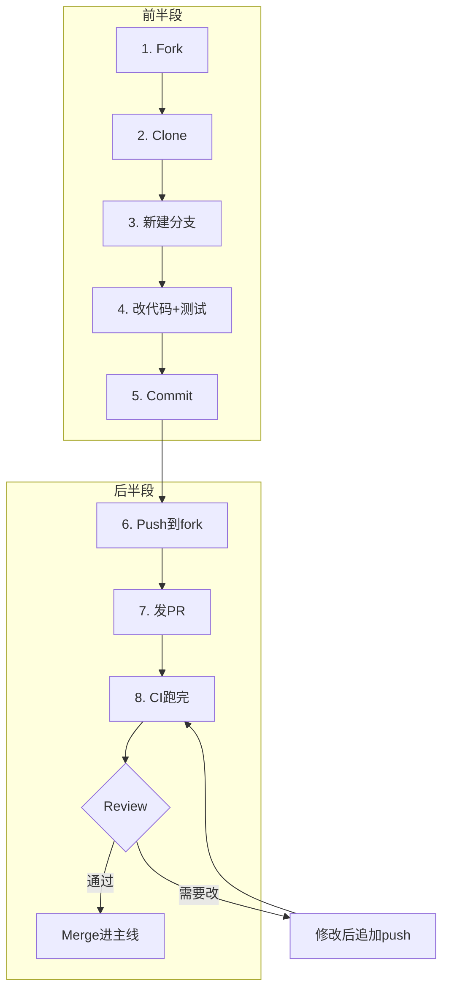
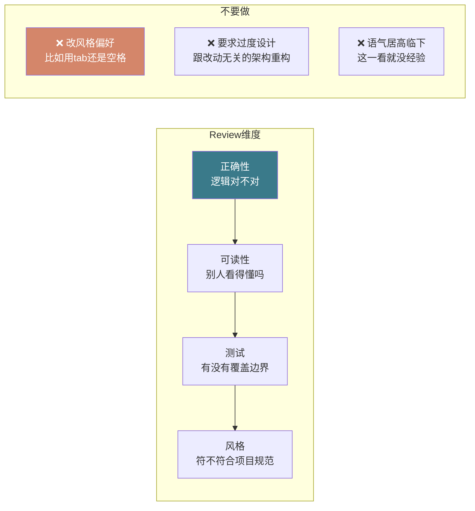
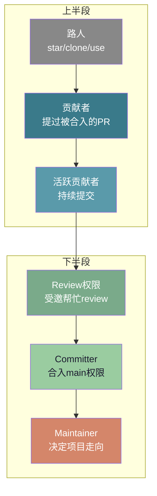

# 【化神·141】开源社区怎么混：PR、Review、维护者

> 码农修仙传 · 化神期 · 第141篇
> 我是玄芯散人，带你从炼气修到大乘。

---

## 境界标识

```
╔══════════════════════════════════════╗
║     化神期 · 第141篇                  ║
║     开源社区怎么混                     ║
║     PR · Review · Maintainer           ║
║     预计阅读：20分钟                  ║
╚══════════════════════════════════════╝
```

---

## 修仙引入

修真界里有两种宗门。一种是闭门修炼的山头，弟子只跟自己的师父学功法，外面发生了什么全然不知。另一种是开放道场，功法刻在石碑上任人观摩，谁都能来改一笔，改得好就留下，改得不好就被抹掉。后者就是开源社区。

化神期弟子不能只会造轮子，还得会把造出来的轮子放进道场，也要会去别人的道场改石碑。这一篇讲三件事：怎么提PR（Pull Request），怎么Review别人的代码，怎么从一个改石碑的人变成守石碑的维护者。

---

## 硬核主体

### 开源社区是什么

开源社区说到底是一群人围绕一个代码仓库协作的组织形式。代码托管在GitHub或GitLab上，任何人都能看到源码，任何人都能贡献代码。但"任何人都能贡献"不等于"任何人都能合入"。每个仓库都有维护者，他们决定哪些代码能进主线，哪些不能。

修真比喻：开源仓库像一座开放道场，石碑上刻着功法（源码）。路过的修士都可以看，也可以提建议在旁边写一版修改（fork + commit）。但最终石碑上留哪一版，由道场长老（maintainer）说了算。

### PR完整流程：fork到merge的全链路

PR是开源贡献的基本单位。你改了别人的代码，想让它进主线，就得走PR流程。整个链路是这样的：



这个流程里每一步都有坑。第一步fork，很多人fork完就clone，忘了加upstream远程仓库。upstream是原仓库的别名，后面同步主线改动靠它。

```bash
# clone自己的fork
git clone https://github.com/你的用户名/项目名.git
cd 项目名

# 添加upstream远程仓库（原仓库）
git remote add upstream https://github.com/原作者/项目名.git

# 以后同步主线改动
git fetch upstream
git checkout main
git merge upstream/main   # 或 git rebase upstream/main
```

第三步新建分支，分支名要说清楚意图。不要叫`patch`或`dev`，叫`fix-uart-dma-rx-bug`或`add-stm32h7-clock-config`。维护者一看分支名就知道你要干什么。

第五步commit，message要遵守仓库的规范。大多数大型项目用Conventional Commits格式：

```bash
# 好的commit message
git commit -m "fix(uart): 修复DMA接收时空闲中断丢失的问题

当DMA接收缓冲区填满后，IDLE标志位未被清除，
导致下一次接收无法触发中断。
在回调函数中添加__HAL_UART_CLEAR_IDLEFLAG调用。

Fixes #1234"

# 坏的commit message
git commit -m "修改了bug"
git commit -m "update"
git commit -m "..."
```

Conventional Commits的格式是`type(scope): subject`。type有feat（新功能）和fix（修bug）等。type或scope后面可以加`!`，或者在footer里写`BREAKING CHANGE:`，表示破坏性变更，对应SemVer主版本号升一位。

### 怎么写一个好的PR

PR的主体是代码，但PR描述决定维护者看不看。描述写不清楚，代码再好也可能被直接关掉。

一个好的PR描述包含四部分：

```markdown
## 改了什么

修复STM32F4 UART DMA接收在缓冲区满后空闲中断丢失的问题。

## 为什么改

当DMA接收满缓冲区后，IDLE标志位未被清除，后续接收无法触发中断。
Issue #1234 有详细复现步骤。

## 怎么测的

在STM32F407Discovery板上验证：
1. 配置USART1 DMA接收，缓冲区256字节
2. 连续发送300字节数据
3. 修复前：只收到前256字节，后续数据丢失
4. 修复后：全部接收，缓冲区回滚正常

## 有没有破坏性变更

无。只在DMA接收完成回调中加了一行清标志位。
```

除了描述，还要注意几个细节。第一，一个PR只做一件事。不要把修bug和加功能塞进同一个PR，维护者review起来很痛苦。第二，控制PR的diff大小。超过500行的PR，维护者多半会拖着不看。拆成几个小PR更容易合入。第三，确保CI通过。fork仓库后记得在仓库设置里启用Actions，让CI在你这边也能跑。

### Code Review：怎么Review别人

Review是开源社区最日常的工作。维护者每天打开邮箱，收到的PR通知比spam还多。好的review能帮贡献者成长，坏的review能把人直接劝退。

Review代码时看什么：



Review评论有几个不成文的规矩。

说问题不要说人。不要写"你这里写错了"，写"这行在DMA缓冲区满的情况下会跳过最后一个字节，因为RXNE标志在读取DR后才会清除"。前者让人防御，后者让人想改。

提建议给出理由。不要写"建议用memcpy"，写"建议用memcpy替代手写循环，编译器对memcpy有内置加速，在Cortex-M4上会展开成LDM/STM指令"。有理由的建议是帮忙，没理由的建议是挑刺。

区分必须改和可选改。用GitHub的review标签：`blocking`（必须改才能合）和`nit`（吹毛求疵，可改可不改）。维护者给一堆nit会让贡献者以为全是硬伤。

### 怎么接受Review

作为贡献者，你收到review反馈后的态度比代码本身更值得注意。第一反应不是辩解，是理解维护者在说什么。

收到"这段代码有问题"的反馈，先复现一遍对方说的问题。如果能复现，直接改，别解释为什么当初这么写。如果复现不了，礼貌地说明你的测试环境，请对方补充复现步骤。

收到风格建议，看看项目里其他文件是怎么写的。如果全项目都用4空格缩进，你提的PR用2空格，那就改。如果项目本身不统一，可以讨论但不要争。

收到"这个功能不需要"的反馈，先问清楚是需求不合适还是实现方式不合适。如果是需求不合适，可以问"如果是XX情况下需要这个功能，你觉得应该怎么实现"。如果是实现方式不合适，请对方给一个方向。

### 贡献者如何成长为维护者

开源社区有一个晋升路径，不是谁封的，是靠积累的。



路人到贡献者，只需要一个被合入的PR。可能是修一个文档错别字，可能是修一个bug，也可能是加一个小功能。迈出第一步就够了。

贡献者到活跃贡献者，靠的是持续性和质量。一次PR合入就消失了，不算活跃。隔三差五还有贡献，才算。Linux内核社区有个说法：没有"小贡献"，只有"做得对的贡献"和"做得不对的贡献"。

活跃贡献者到拥有review权限，通常是维护者主动邀请的。邀请的信号是维护者开始私信问你"这个PR你怎么看"，或者在issue里@你帮忙看。这时候你已经在做review的工作了，只是没有权限标签。

Committer和Maintainer的区别在于权限。Committer有push到main的权限，但不一定是项目走向的决策者。Maintainer决定做什么不做什么，哪些PR优先合，哪些issue先处理。在Linux内核里，maintainer层级更分明：各subsystem维护者（net、mm、driver等）各自管自己的小维护者树，最终汇入mainline由Linus合并。

成为维护者没有考试，也没有申请表。是因为你对这个项目足够熟悉，社区里的人信任你的判断，维护者退休或项目分裂时，自然轮到你接手。Greg Kroah-Hartman从2008年起就守着Linux内核的stable分支，一守就是十几年，靠的是持续稳定的review和发布节奏积累出来的信任。

### 开源社区的潜规则

第一，issue比PR更值得投入。很多人上来就提PR，但项目真正需要的是有人帮忙triage issue。帮忙复现bug，或者给issue打标签，或者写最小复现case。这些工作没有技术门槛但极度稀缺。做这些事的人会被维护者记住。

第二，不要在PR里跟维护者吵架。维护者说"不改就不合"，你可以问清楚原因，可以提供更多数据，但如果对方坚持，说一声"好的我理解，那我把这个PR关掉"。维护者可能错，但PR是别人的仓库，你有fork的自由，没有合入的权利。

第三，邮件列表比PR评论更值得看。大型项目（比如Linux内核或PostgreSQL）的决策都在邮件列表里讨论。PR只是代码载体，设计讨论在邮件列表。如果你只看PR不看邮件列表，永远不知道项目为什么往这个路子走。

第四，读CONTRIBUTING.md。大多数项目根目录有这个文件，里面写了贡献规范和代码风格以及测试要求。不读就提PR，等于面试不穿衣服。

---

## 修仙术语对照表

| 修仙术语 | 技术现实 | 本篇位置 |
|---------|---------|---------|
| 开放道场 | 开源仓库（GitHub/GitLab） | 修仙引入 |
| 石碑上刻的功法 | 源代码 | 修仙引入 |
| 路过修士改石碑 | Fork + commit + PR | 硬核主体 |
| 道场长老 | Maintainer | 修仙引入 |
| 改石碑的流程 | PR流程（fork→clone→branch→commit→push→PR） | 硬核主体 |
| 功法修改提案 | PR描述 | 硬核主体 |
| 切磋功法 | Code Review | 硬核主体 |
| 必须改的瑕疵 | Blocking review | 硬核主体 |
| 吹毛求疵 | Nit（可选的小建议） | 硬核主体 |
| 守石碑的人 | Committer / Maintainer | 硬核主体 |
| 路人 | Star / Clone / Use的人 | 硬核主体 |
| 道场告示牌 | CONTRIBUTING.md | 硬核主体 |
| 各山头长老议事 | 邮件列表讨论 | 硬核主体 |
| 掌门传位 | Maintainer交接 | 硬核主体 |

---

## 进阶条件

- [ ] Fork一个开源项目，走完整个PR流程（fork→clone→branch→commit→push→PR），哪怕只改一行文档
- [ ] PR描述包含"改了什么/为什么改/怎么测的/有没有破坏性"四部分
- [ ] 收到至少一次code review反馈，根据反馈修改后PR被合入
- [ ] 帮别人的PR做一次review，给出有理由的评论
- [ ] 读过至少一个项目的CONTRIBUTING.md，能说出三条贡献规范
- [ ] 在issue区帮忙复现一个bug，写出最小复现步骤
- [ ] 理解Conventional Commits格式，commit message包含type和scope

下一篇讲读源码的正确姿势。很多化神期弟子想读Linux内核源码，打开看两眼就关了。不是能力不够，是切入方式不对。从哪个文件开始读，怎么追踪函数调用链，怎么画图帮助理解，这些都有套路。

---

## 下期预告 + 互动

下一篇：【化神·142】读源码的正确姿势：怎么切入大项目

讨论：你在开源社区提过PR吗？第一次提PR是什么感觉？有没有被维护者怼过，或者被帮助过？评论区聊聊。

我是玄芯散人，带你从炼气修到大乘。

---

*本文是「码农修仙传」系列第141篇。系列导航见 [xren.ren](https://xren.ren)*
