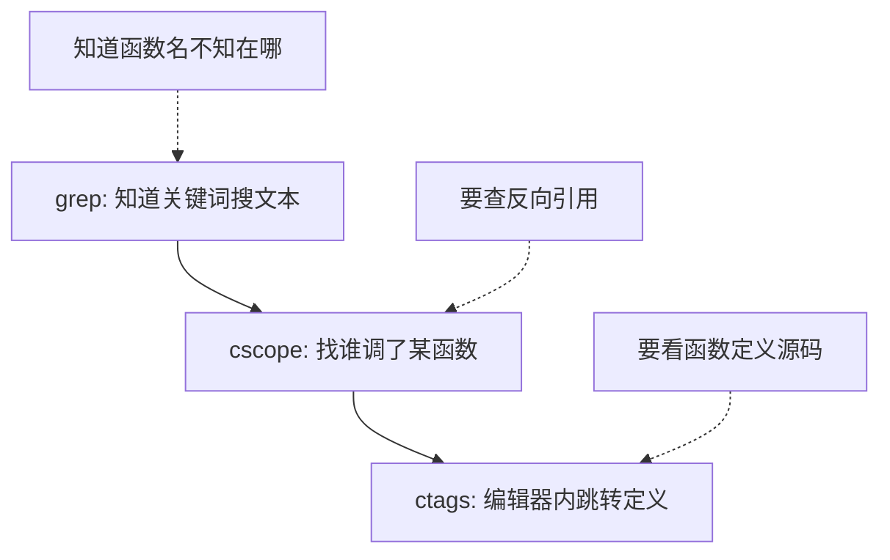
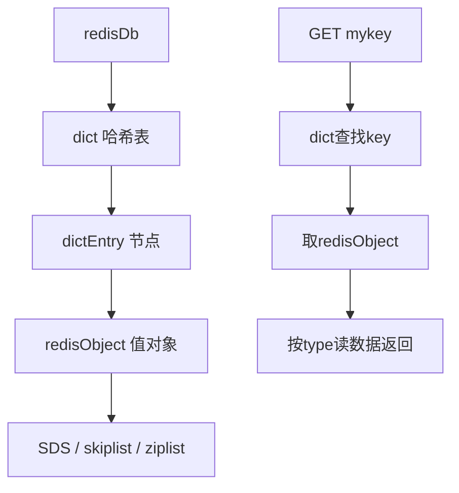
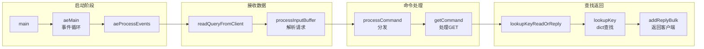

# 【化神·142】读源码的正确姿势：怎么切入大项目

> 码农修仙传 · 化神期 · 第142篇
> 我是玄芯散人，带你从炼气修到大乘。

---

## 境界标识

```
╔══════════════════════════════════════╗
║     化神期 · 第142篇                  ║
║     读源码的正确姿势                   ║
║     怎么切入大项目                     ║
║     预计阅读：22分钟                  ║
╚══════════════════════════════════════╝
```

---

## 修仙引入

化神期的弟子，多半碰过这种情况：听说某开源项目很牛，clone下来一看，几万个文件，光目录就滚动了好几屏。打开main.c想从头看，翻了两页就看不下去了。不是能力不够，是切入方式不对。

读源码和写代码是两种不同的功夫。写代码是从无到有，读代码是从有到懂。后者其实更难，因为你面对的是别人脑子里的思维路线，得逆着推导出来。这篇讲怎么高效地读大项目源码，包括三种切入策略，怎么用工具追踪调用链，怎么画架构图辅助理解。

---

## 硬核主体

### 大项目到底有多大

先建立直觉。Linux内核5.x版本，源码约三千万行C代码（不含注释和空行大约两千万行），目录结构一千多个子目录。Redis算是小项目，也有十万行级别。PostgreSQL大概一百五十万行C代码。FreeRTOS内核部分精简，核心代码一两万行，但加上各种移植层和组件也有十几万行。

面对这种量级，不可能从头读到尾。读源码的第一原则是：带着问题读，不要漫无目的地翻。

### 三种切入策略

读源码有三种常见切入方式，适用于不同情况。

第一种是自顶向下。先看程序的入口点，通常是main函数，然后顺着调用链往下追。适合你想了解"程序整体跑起来做了什么"。比如读Redis，从server.c的main函数开始，看它怎么初始化事件循环，怎么注册回调，怎么处理连接。这种方式的好处是能快速建立全局视图，坏处是容易在中途迷失，因为调用链会越来越深，一个函数调三个子函数，每个子函数又调五个，呈树状扩散。

第二种是自底向上。先找一个你最感兴趣的具体功能点，找到实现它的那个函数，读懂它，然后往上看谁调了它，一层层往上追溯到入口。适合你已经在用某个项目，对某个功能特别好奇。比如你在用Git，想知道`git add`到底做了什么，直接找到`builtin/add.c`里的cmd_add函数，读完再看谁调它，怎么调度过来的。

第三种是断点追踪。这个方法最暴力也最有效。用调试器（gdb或lldb）跑起程序，在感兴趣的位置打断点，看调用栈。你不需要猜调用链，调用栈直接告诉你完整的路径。适合读动态语言项目（Python/JS）或者容易跑起来的C/C++项目。

```bash
# 以Redis为例，编译带调试信息的版本
make BUILD_TLS=yes CFLAGS="-g -O0"

# 启动gdb
gdb ./redis-server

# 在处理GET命令的地方打断点
(gdb) break processCommand
(gdb) run

# 程序跑起来后用redis-cli发一个GET命令
# 在另一个终端执行：redis-cli get mykey

# 断点命中后看调用栈
(gdb) bt
# 0  processCommand at server.c:xxxx
# 1  processInputBuffer at networking.c:xxxx
# 2  readQueryFromClient at networking.c:xxxx
# 3  aeProcessEvents at ae.c:xxxx
# 4  aeMain at ae.c:xxxx
# 5  main at server.c:xxxx
```

这个调用栈告诉你Redis处理一个命令的完整路径：main启动事件循环，事件循环收到客户端数据，读取请求缓冲区，解析命令，最后到processCommand。你看，一个调用栈抵得上你翻半天文件。

### 工具链：追踪符号的三个法宝

读源码不能靠肉眼翻文件，得用工具。C/C++项目有三个经典工具。



grep是最基础的。你知道一个函数名或一个错误信息字符串，grep一下就知道在哪些文件出现。但grep不懂语法，它只是文本匹配。搜`main`会把注释里的main也搜出来。

cscope比grep聪明，它理解C语法，能区分函数定义和函数调用。最常用的操作是"查找谁调用了某函数"（Find functions calling this function），这个grep做不到。

```bash
# 在项目根目录建cscope索引
find . -name "*.c" -o -name "*.h" > cscope.files
cscope -b -q      # -b只建索引不进交互界面，-q加速大项目
cscope -d         # -d用已有索引进入交互界面

# 交互界面里的选项：
# Find this C symbol:        查找符号（函数/变量）
# Find functions calling:   查找谁调了这个函数
# Find functions called by: 查找这个函数调了哪些函数
# Find this text string:     等于grep
```

ctags生成标签文件，让编辑器（Vim/Emacs）能跳转到定义。在Vim里把光标放到函数名上按Ctrl+]就跳到定义处，Ctrl+t跳回来。读代码时这个跳来跳去的操作每分钟要做好几次。

```bash
# 生成ctags索引
ctags -R .

# Vim中跳转
# Ctrl+]  跳到光标下符号的定义
# Ctrl+t  跳回来
# :ts     列出同名符号的多个定义，选一个跳
# :tn     下一个匹配
# :tp     上一个匹配
```

对于特别大的项目（比如Linux内核），cscope索引可能占几个GB内存。这时候可以只对感兴趣的子目录建索引。比如你只读drivers/net/下的网卡驱动，就在那个目录建索引。

### 画架构图辅助理解

读代码时画图不是可选的，是必须的。人的工作记忆有限，同时记住五六个函数的调用关系就到极限了。画出来，让纸或屏幕替你记。

画什么图？分三层。

第一层画模块关系图。一个大项目通常分若干模块，你先搞清楚有哪些模块，谁依赖谁。比如Redis的模块：网络层（ae事件循环 + networking），命令处理层（server.c的processCommand + 各t_*.c的命令实现），数据结构层（dict, list, ziplist, skiplist等），持久化层（RDB文件 + AOF日志）。画一张方框图，标注依赖方向，就知道代码的大致骨架。

第二层画调用链图。挑一条你正在追的路径，把沿途的函数画成流程。不需要每个函数都画，只画你在追的那条线。读到分支处标个岔路口，说明"这里还调了X和Y，但我这次不追"。

第三层画数据结构关系图。这是最容易被忽略但最有价值的图。C语言项目里，数据结构就是骨架，函数是挂在骨架上的肌肉。搞清楚了主要的数据结构长什么样，代码就理解了一半。比如Redis里`redisDb`包含`dict *dict`（存所有键值对），`dict`内部是哈希表数组，每个桶是`dictEntry`链表，`dictEntry`的val指向`redisObject`，`redisObject`再根据type指向具体的数据结构（SDS、list、skiplist等）。画出来这张关系图，再去看代码就顺畅得多。



### 一个实战例子：追踪Redis的GET命令

把上面的方法串起来，用一个具体例子演示。

目标：理解Redis处理GET命令的完整流程。

第一步，找入口。在Redis源码里搜GET命令的注册位置。Redis的命令注册在commands.def里，或者在server.c的命令表里。grep一下：

```bash
grep -rn '"get"' src/commands.def
# 或搜命令处理函数名
grep -rn 'getCommand' src/*.c
```

找到`getCommand`函数在`string.c`里。这是处理GET命令的入口。

第二步，读getCommand函数。它先检查key是否存在（调用lookupKeyReadOrReply），不存在就返回nil。存在就检查类型对不对，不对返回错误。类型对了就返回值（addReplyBulk）。

第三步，往上看谁调了getCommand。用cscope查"谁调用了getCommand"，发现是processCommand通过命令表分发的。processCommand在server.c里，它做的事是：解析命令名，在命令表里找到对应的处理函数，检查权限，检查内存限制，然后调用处理函数。

第四步，往下看lookupKeyReadOrReply干了什么。它调了lookupKey，lookupKey在dict里查找key。这就接上了上面画的数据结构关系图。

第五步，画调用链：



这张图就是你读源码的成果。不用理解每一行代码，但你知道了GET命令从网络数据到返回结果的完整路径。以后再读SET、DEL等其他命令，套路一样，只是处理函数不同。

### 不同语言的工具差异

上面讲的是C项目的工具链。其他语言有各自更好的工具。

Python项目用ipdb或pdb打断点，调用栈用`where`命令看。VS Code的Python调试器也很好用。Python源码阅读经常配合`inspect`模块，能直接在运行时查看函数签名和源码位置。

```python
import inspect
# 查看函数定义在哪个文件哪一行
print(inspect.getfile(some_function))
print(inspect.getsourcelines(some_function))
```

JavaScript/TypeScript项目用Chrome DevTools或者VS Code的debug模式。TS项目还能用`tsc --traceResolution`看模块解析过程。Deno有内置的coverage和调试支持。

Rust项目用rust-analyzer（VS Code扩展），跳转和引用查找都很流畅。Cargo的`cargo expand`能展开宏，读代码遇到宏就不再卡住。

### 读源码的节奏感

很多人读源码失败，不是方法不对，是节奏不对。一口气读了三小时，头昏脑涨，第二天什么都不记得。读源码要像跑马拉松，不是百米冲刺。

建议的做法是每次只追一条线。今天追GET命令的流程，明天追EXPIRE过期机制，后天追RDB持久化。每次二十到四十分钟，不要超过一小时。读完一条线就画一张图，写下你理解的那条路径。下次换一条线时，你画的图还在，不会从零开始。

另外一个经验是：先读文档再读源码。大项目都有设计文档或RFC。Redis的官网文档，Linux内核的Documentation/目录，FreeBSD的handbook。文档告诉你设计意图，源码告诉你实现细节。先懂意图再看细节，事半功倍。反过来先看代码再猜意图，事倍功半。

最后一条：接受读不懂。有些代码你读了三遍还是不懂，可能是缺少前置知识，也可能是那段代码写得确实烂。标注一个"待理解"继续往前走，不要卡在一个地方死磕。读源码是螺旋上升的，第一遍看懂三成，第二遍看懂六成，第三遍看懂八成。没有人一遍就能全懂。

---

## 修仙术语对照表

| 修仙术语 | 技术现实 | 本篇位置 |
|---------|---------|---------|
| 闭关修读 | 读源码 | 修仙引入 |
| 逆推功法 | 从代码逆推设计意图 | 修仙引入 |
| 自顶向下 | 从main入口顺着调用链往下追 | 硬核主体 |
| 自底向上 | 从具体函数往上追溯到入口 | 硬核主体 |
| 断点追踪术 | 用gdb打断点看调用栈 | 硬核主体 |
| 寻踪符 | cscope符号查找工具 | 硬核主体 |
| 跳转符 | ctags定义跳转 | 硬核主体 |
| 文本搜索符 | grep搜索 | 硬核主体 |
| 骨架图 | 数据结构关系图 | 硬核主体 |
| 功法路径图 | 调用链流程图 | 硬核主体 |
| 宗门布局图 | 模块依赖关系图 | 硬核主体 |
| 功法意图 | 设计文档/RFC | 硬核主体 |
| 待理解标记 | 代码标注待回看 | 硬核主体 |
| 螺旋上升 | 多轮阅读逐步深入 | 硬核主体 |

---

## 进阶条件

- [ ] 选一个开源项目（Redis或FreeRTOS推荐入门），clone下来编译跑通
- [ ] 用gdb在程序运行时打断点，截取一条完整的调用栈
- [ ] 用cscope和ctags建索引，熟练使用跳转和反向引用查找
- [ ] 画一张项目的模块关系图，标注模块间的依赖方向
- [ ] 画一条具体的调用链图（比如某个命令或某个API的处理流程）
- [ ] 画出项目主数据结构的关系图（如Redis的dict到redisObject）
- [ ] 读项目的官方文档或设计文档，能说出三条设计意图
- [ ] 写一篇读源码笔记，记录你追踪的路径和理解的架构

下一篇讲分布式共识算法。多个节点怎么在不可靠的网络下达成一致？CAP定理说的"三选二"到底什么意思？Raft协议是怎么用Leader选举和日志复制解决这个问题的。为什么不用更早的Paxos？答案下一篇揭晓。

---

## 下期预告 + 互动

下一篇：【化神·143】分布式CAP定理和Raft共识算法

讨论：你读过最大的源码项目是什么？读完了吗？还是翻了两页就放弃了？你觉得读源码最难的是哪里，是看不懂代码逻辑，还是不知道从哪开始？评论区聊聊。

我是玄芯散人，带你从炼气修到大乘。

---

*本文是「码农修仙传」系列第142篇。系列导航见 [xren.ren](https://xren.ren)*
