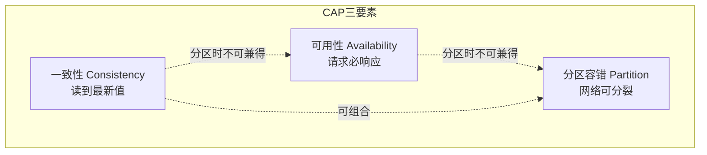
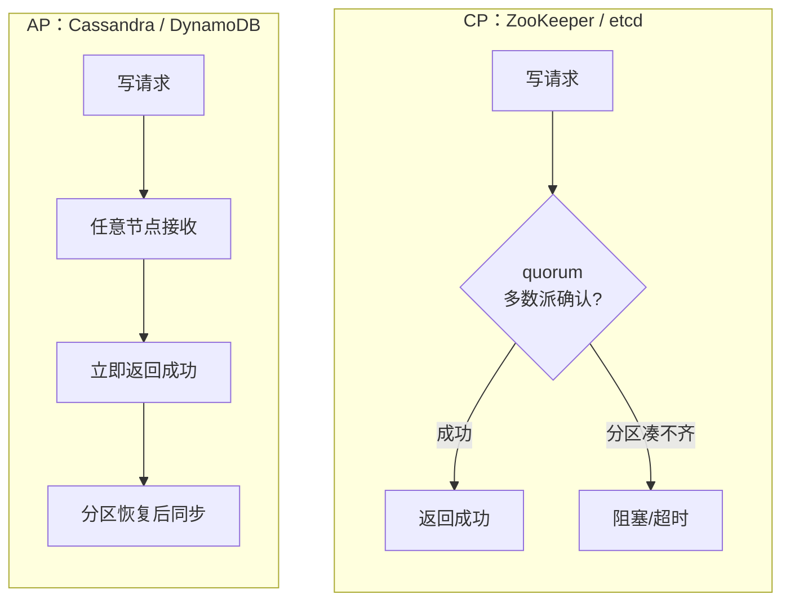
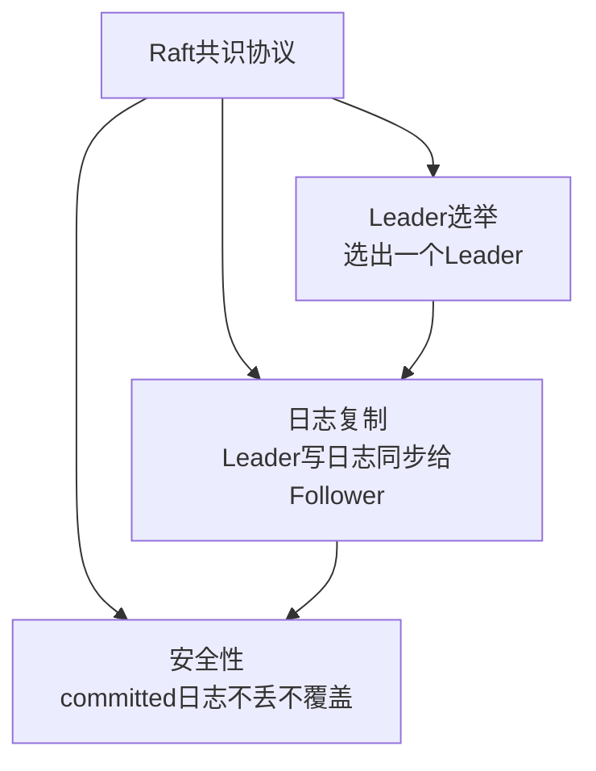
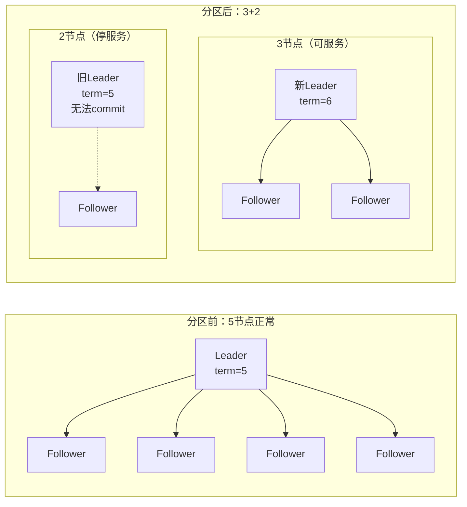

# 【化神·143】分布式CAP定理和Raft共识算法

> 码农修仙传 · 化神期 · 第143篇
> 我是玄芯散人，带你从炼气修到大乘。

---

## 境界标识

```
╔══════════════════════════════════════╗
║     化神期 · 第143篇                  ║
║     分布式CAP定理和Raft共识算法        ║
║     为什么不用Paxos                    ║
║     预计阅读：25分钟                  ║
╚══════════════════════════════════════╝
```

---

## 修仙引入

化神期的弟子要造轮子，造到分布式系统这一层，绕不开三个问题：多个节点怎么保持数据一致？网络断了怎么办？能不能同时保证所有请求都能响应？

这三个问题对应CAP定理的三要素：一致性（Consistency）、可用性（Availability）、分区容错（Partition tolerance）。Brewer在2000年提出这个猜想，Gilbert和Lynch在2002年给出形式化证明。此后二十多年，CAP成了分布式系统的天道法则，任何分布式存储都得回答一个问题：你是CP还是AP？

但CAP只告诉你能做什么不能做什么，没告诉你怎么做。Raft协议就是"怎么做"的一个优雅答案。2014年Diego Ongaro和John Ousterhout发表论文，设计目标只有一个：比Paxos好懂。etcd、Consul、TiKV都在用。

---

## 硬核主体

### CAP定理到底在说什么

三个要素的定义要精确，模糊的理解会导致后面全盘皆错。

一致性（Consistency）：客户端写了一个值到任意节点，之后从任意节点读，都读到最新值或等待直到一致。这里说的是线性一致（linearizable consistency），读到的一定是最近一次写过的值。

可用性（Availability）：客户端对非故障节点发请求，系统必须在有限时间内返回非错误响应。注意"非故障节点"这个限定，故障节点不响应不算违反可用性。

分区容错（Partition tolerance）：网络可能丢消息或延迟，系统在这种情况下还能按C或A的承诺运行。分区指的是网络分裂，不是节点宕机。

CAP定理的严格表述是：在发生网络分区时，一致性和可用性不能同时满足。你得选一个。



### CAP三选二的真实含义

很多人把CAP理解成"三选二"，以为有CP和AP两种组合加上一种CA。这个理解有个大坑。

CA（一致性+可用性，不要分区容错）在真实世界里几乎不存在。网络分区不是你能选择要不要的东西，它会发生。交换机故障，或者光纤被挖断，或者网卡丢包，都导致分区。你没法声明"我不允许网络分区"，就像你没法向老天爷宣布"我选择不经历雷劫"。

所以实际选择只有两种：

CP系统：分区时牺牲可用性，保证一致性。客户端写到一个节点后，如果其他节点因为分区联系不上，就不返回响应（或返回错误），直到分区恢复。ZooKeeper走这条路，写操作需要quorum（多数派）确认，凑不齐quorum就阻塞。

AP系统：分区时牺牲一致性，保证可用性。每个节点都能响应客户端请求，哪怕它和其他节点断了联系。分区恢复后再同步（最终一致）。Cassandra和DynamoDB走这条路。



### CAP的常见误解

误解一：AP系统不保证一致性，所以数据会一直不一致。不是。AP系统在不出分区时可以提供强一致性，只在分区期间才放松一致性保证。Cassandra用quorum读写配合调优一致性级别，不分区时能跑线性一致读。

误解二：CP系统总是不可用。不是。CP系统在不分区时完全可用，只有在分区且凑不齐quorum时才拒绝服务。一个5节点集群挂掉2个节点，剩余3个凑齐多数派，照样能服务。

误解三：CAP是一个非黑即白的选择。实际上现代分布式系统通常提供可调的一致性级别。你可以选强一致写+弱一致读，或者反过来。Google Spanner在分区时表现为CP，但平时通过TrueTime机制提供外部一致性，比线性一致还强。

### Raft：为可理解性而生的共识协议

讲完CAP的天道法则，接下来讲怎么造轮子。Raft解决的问题是：多个节点怎么在不可靠网络下对一串日志达成一致。

Raft的设计哲学就一个词：可理解性。Paxos在1990年代提出，数学上优雅，但工程上难懂，正确实现Paxos的团队屈指可数。Ongaro在论文里直接说，Raft的每一步设计都问同一个问题：有没有更简单更好理解的方式达成同样目标？

Raft把共识问题拆成三个子问题：



### Leader选举：随机超时避免平票

Raft的集群有若干节点（通常3或5个），每个节点有三种可能状态：Follower，Candidate，或Leader。

启动时所有节点都是Follower。每个节点有一个随机超时计时器（election timeout），通常150ms到300ms之间。如果Follower在这个时间内没收到Leader的心跳，就转成Candidate，发起选举。

选举过程：Candidate把当前任期号（term）加一，先给自己投票，然后向其他节点发RequestVote RPC。收到请求的节点如果在这个term里还没投过票，且Candidate的日志至少和自己一样新（比较最后一条日志的index和term），就投赞成票。

拿到多数派选票的Candidate变成Leader。之后Leader周期性发心跳（空的AppendEntries RPC）维持地位，Follower收到心跳就重置超时计时器。

```c
// Raft节点状态机简化版
typedef enum {
    STATE_FOLLOWER = 0,
    STATE_CANDIDATE,
    STATE_LEADER
} NodeState;

typedef struct {
    NodeState state;
    int currentTerm;       // 当前任期号
    int votedFor;          // 本term投给了谁，-1表示没投
    int commitIndex;       // 已commit的日志最大index
    int lastApplied;       // 已apply到状态机的日志最大index
    // ... 日志数组、Leader相关字段省略
} RaftNode;

// Follower超时触发选举
void start_election(RaftNode *node) {
    node->state = STATE_CANDIDATE;
    node->currentTerm++;              // 任期号加一
    node->votedFor = node->id;        // 先投自己
    // 广播RequestVote RPC给其他节点
    broadcast_request_vote(node);
}
```

随机超时是巧妙的设计。如果所有节点同时超时，会同时变成Candidate，同时发起选举，可能谁也拿不到多数派，平票。随机超时让各节点的选举时间错开，先超时的那个大概率先拿到多数派。平票了也不要紧，下一轮随机超时再选，总能选出Leader。

### 日志复制：Leader单写，Follower同步

Leader收到客户端写请求后，先写到自己的日志里，然后通过AppendEntries RPC把这条日志发给所有Follower。当多数派Follower确认收到后，这条日志就算committed，Leader返回客户端成功。

```c
// Leader处理客户端写请求
int handle_client_write(RaftNode *node, Entry entry) {
    if (node->state != STATE_LEADER) {
        return ERR_NOT_LEADER;     // 只有Leader能处理写
    }
    // 1. 追加到本地日志
    int index = log_append(node, entry);
    // 2. 并行发给所有Follower
    for (int i = 0; i < node->peer_count; i++) {
        send_append_entries(node, i, index);
    }
    // 3. 等多数派确认后commit（异步，通常在RPC回调里完成）
    return index;
}

// AppendEntries RPC处理（Follower侧）
int handle_append_entries(RaftNode *node, AppendEntriesReq *req) {
    // 拒绝旧term的请求
    if (req->term < node->currentTerm) {
        return REPLY_REJECT;
    }
    // 更新任期和Leader
    node->currentTerm = req->term;
    node->state = STATE_FOLLOWER;
    reset_election_timer(node);   // 收到合法Leader消息，重置超时

    // 检查前一条日志是否匹配
    if (req->prevLogIndex > 0) {
        Entry *prev = log_get(node, req->prevLogIndex);
        if (!prev || prev->term != req->prevLogTerm) {
            return REPLY_LOG_MISMATCH;  // 日志不一致，让Leader回退
        }
    }
    // 追加新日志条目
    log_append_entries(node, req->entries);
    // 应用已commit的日志到状态机
    if (req->leaderCommit > node->commitIndex) {
        node->commitIndex = min(req->leaderCommit, last_log_index(node));
        apply_committed(node);
    }
    return REPLY_SUCCESS;
}
```

日志冲突处理有个细节值得说。如果Follower的日志和Leader不一致（比如Follower之前在另一个旧Leader那接收了一些还没commit的日志），Leader会逐步回退prevLogIndex，找到和Follower日志一致的点，然后往后覆盖。这保证了committed日志不会被覆盖（Raft的安全性保证）。

### 安全性：committed日志不丢不覆盖

Raft有五条安全性规则，前四条比较直观，第五条State Machine Safety是最终保障：

1. Election Safety：一个term最多一个Leader
2. Leader Append-Only：Leader只追加日志，不修改不删除
3. Log Matching：如果两条日志在相同index有相同term，那么从该index往前所有日志都相同
4. Leader Completeness：如果一条日志在某term被commit，那么后续所有term的Leader日志里都包含这条
5. State Machine Safety：如果某节点在index i应用了某条日志，其他节点在index i绝不会应用不同的日志

第四条最要紧。它保证了：一旦日志被commit，就不会丢。新选出的Leader一定包含所有已commit的日志。这靠的是选举时的投票约束：节点只给日志至少和自己一样新的Candidate投票。一个Candidate要拿到多数派选票，意味着多数派节点的日志都不比它新。而已commit的日志在多数派节点上都存在。所以拿到多数派选票的Candidate一定包含了所有committed日志。第五条是第四条的推论：既然每个Leader都包含所有committed日志，且日志在相同index有相同term则之前全相同（第三条），那么不同节点在同一个index只会apply同一条日志，状态机安全性得到保障。

### Raft vs Paxos：为什么选Raft

Paxos是Leslie Lamport在1989年投稿（1998年正式发表于ACM TOCS）提出的共识算法，比Raft早二十多年。Paxos数学上很美，但工程上有几个问题。

第一，Paxos没有Leader的概念（Basic Paxos），每个提案者平等竞争。Multi-Paxos虽然引入了Leader角色来改善连续提案，但这个Leader怎么选、怎么管理，论文没给具体方案，留给实现者自己设计。每个团队的Multi-Paxos实现都不一样，互不兼容。

第二，Paxos的日志是允许有空洞的。日志index 1、2、5可以commit了，3和4还没。这在理论上更灵活，但工程上处理空洞日志非常复杂，状态机的apply顺序不好管理。Raft要求日志连续，不允许空洞，简单了很多。

第三，Paxos的证明和描述方式很难懂。Lamport自己写的论文用了故事性的"虚构希腊岛"叙事，读起来像猜谜。后来Google的Paxos Made Live论文坦承，把Paxos工程化花了大量精力修补理论没覆盖的边角。

Raft在工程实践方面远超Paxos。etcd（Kubernetes的底层KV存储），Consul（HashiCorp的服务发现），TiKV（PingCAP的分布式KV引擎）都选了Raft。Raft在数学上未必比Paxos更优，但它在"可实现、可维护"这个方面碾压了Paxos。

### 一个实际例子：etcd的Raft实现

etcd的Raft库（etcd/raft）是Go语言里最广泛使用的Raft实现。它的设计有个特点：Raft状态机和状态存储是分离的。Raft库只处理协议逻辑，包括选举，日志复制，term管理。日志怎么存，网络怎么发，交给上层使用者实现。

```go
// etcd/raft的使用方式简化示意
import "go.etcd.io/etcd/raft/v3"

type node struct {
    rc      *raft.RawNode
    storage *raft.MemoryStorage
    applyC  chan raftpb.Entry
}

func (n *node) processMessages(msgs []raftpb.Message) {
    for _, m := range msgs {
        // 上层负责把消息通过网络发给其他节点
        n.transport.Send(m)
    }
}

func (n *node) processReadyz(ready *raft.Ready) {
    // 处理待持久化的日志
    n.storage.Append(ready.Entries)
    // 处理待发送的消息
    n.processMessages(ready.Messages)
    // 处理已commit需要apply的日志
    for _, entry := range ready.CommittedEntries {
        n.applyC <- entry
    }
}
```

这种设计让Raft库不绑定具体存储引擎和网络层。TiKV凭借这个设计实现了multi-raft（一个集群跑多个Raft组，每个Raft组管一部分数据region），支撑了水平扩展的分布式事务KV。

### 分区容忍在Raft中怎么体现

回到CAP。Raft是CP系统。在5节点集群中，如果网络分成3+2两半，3节点那边凑齐quorum，能继续选Leader和commit日志。2节点那边凑不齐，停止服务。这就是CP的体现：分区时牺牲少数派的可用性，保证一致性。

如果Leader在少数派那边呢？2节点那边有一个旧Leader，它能收请求但无法commit（因为AppendEntries需要多数派确认）。客户端写请求会超时失败。3节点那边会选出新Leader（旧Leader的term过期），继续提供服务。分区恢复后，旧Leader上未commit的日志会被新Leader覆盖。



### 实际工程中的权衡

选CP还是AP不是技术问题，是业务问题。

如果你做配置中心（如etcd用在Kubernetes里存集群配置），数据不一致比不可用危险得多。配置写错了，所有Pod可能都起不来。这种用途选CP。

如果你做社交网络的点赞计数，某个节点短暂少算几个赞，用户完全感知不到。但如果你因为某个节点分区就拒绝所有点赞，用户体验极差。这种用途选AP。

还有一种中间路线：不依赖单一协议，按操作类型选。CockroachDB默认是CP，但对某些非紧要读操作提供stale read（允许读稍微过时的数据），在一致性和延迟之间取折中。

---

## 修仙术语对照表

| 修仙术语 | 技术现实 | 本篇位置 |
|---------|---------|---------|
| 天道法则 | CAP定理 | 修仙引入 |
| 雷劫 | 网络分区 | CAP定义 |
| 多数派 | quorum，过半数节点 | CP系统 |
| 宗主选举 | Leader选举 | Raft概述 |
| 任期号 | term，单调递增 | Leader选举 |
| 寻仙帖 | RequestVote RPC | Leader选举 |
| 心跳维持 | AppendEntries空包 | Leader选举 |
| 功法传承 | 日志复制 | 日志复制 |
| 传承册 | AppendEntries RPC | 日志复制 |
| 已定功法 | committed日志 | 安全性 |
| 不覆旧法 | Leader Completeness | 安全性 |
| 功法空洞 | Paxos允许日志空洞 | Raft vs Paxos |
| 多脉同修 | multi-raft，多Raft组 | etcd实现 |
| 少数派停修 | 少数派节点停止服务 | 分区容忍 |

---

## 进阶条件

- [ ] 能准确说出CAP三要素的定义，解释为什么CA组合在真实网络中不现实
- [ ] 能区分CP和AP系统在分区期间的行为差异，各举一个真实系统例子
- [ ] 用纸笔画出Raft的三个状态转换图（Follower/Candidate/Leader），标注触发条件
- [ ] 写一段伪代码描述Leader选举流程，包含随机超时和投票约束
- [ ] 解释Raft的Leader Completeness为什么成立，说清楚选举投票约束和committed日志的关系
- [ ] 说出Raft比Paxos的三个工程优势，要具体到日志空洞处理、Leader管理方式、实现一致性等方面
- [ ] 用etcd/raft的Go代码跑通一个最简单的3节点Raft集群，能观察Leader选举和日志复制

下一篇讲JIT编译器。为什么JVM跑久了反而比启动时快？解释执行和编译执行的区别在哪？JIT怎么判断哪段代码是热点？热到什么程度才值得编译？答案下篇揭晓。

---

## 下期预告 + 互动

下一篇：【化神·144】JIT编译器原理：为什么JVM能越跑越快

讨论：你的项目里用过哪些分布式组件？etcd还是ZooKeeper，还是Consul？选型的时候考虑过CAP吗，还是只看了性能指标？评论区聊聊你的分布式踩坑经历。

我是玄芯散人，带你从炼气修到大乘。

---

*本文是「码农修仙传」系列第143篇。系列导航见 [xren.ren](https://xren.ren)*
