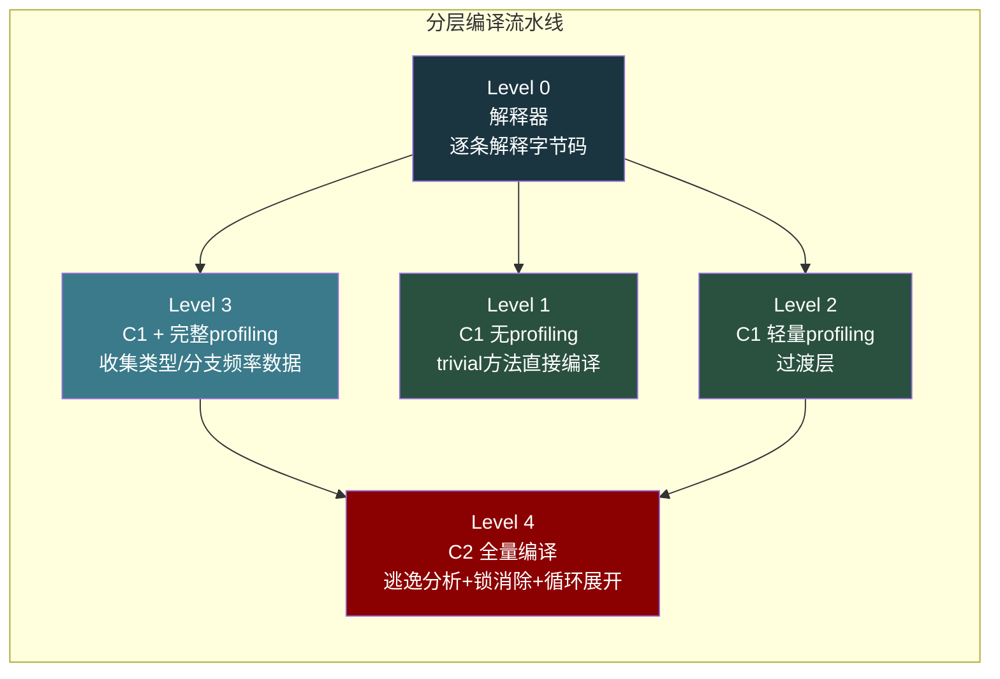
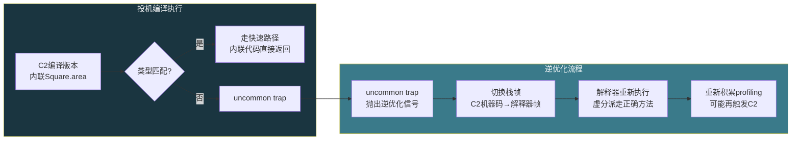
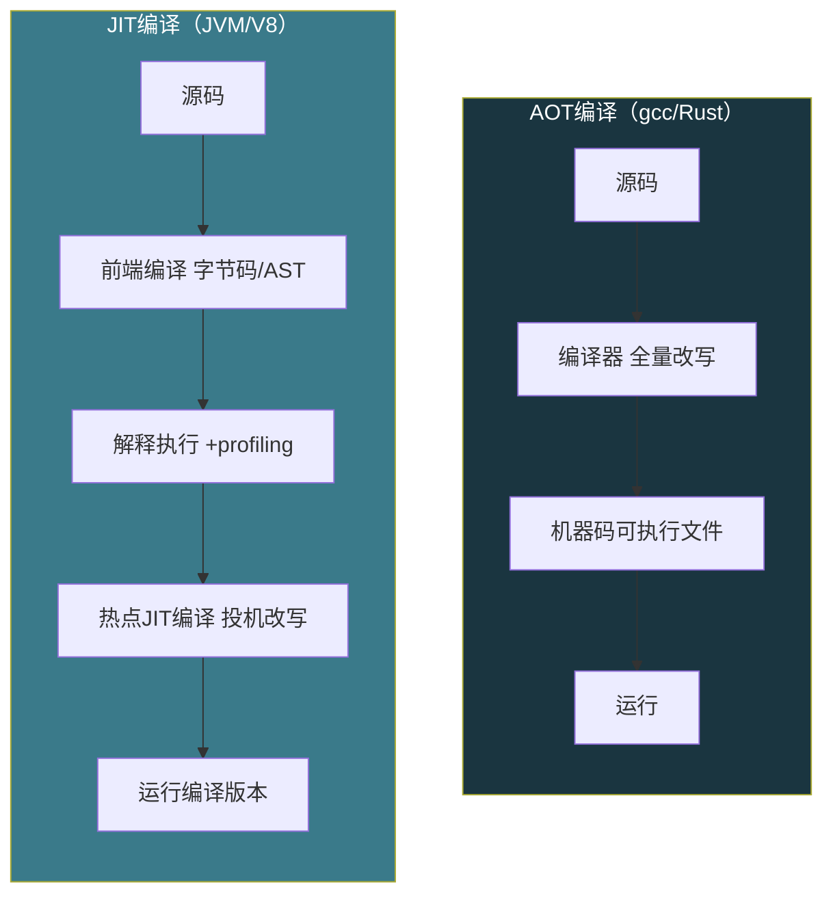

# 【化神·144】JIT编译器原理：为什么JVM能越跑越快

> 码农修仙传 · 化神期 · 第144篇
> 我是玄芯散人，带你从炼气修到大乘。

---

## 境界标识

```
╔══════════════════════════════════════╗
║     化神期 · 第144篇                  ║
║     JIT编译器原理                      ║
║     为什么JVM能越跑越快                 ║
║     解释执行+热点探测+分层编译          ║
║     预计阅读：22分钟                  ║
╚══════════════════════════════════════╝
```

---

## 修仙引入

炼气期的弟子写完代码，gcc一敲，可执行文件就出来了。这叫AOT（Ahead-Of-Time）编译，编译和运行是两个阶段，泾渭分明。

但Java不一样。你写完.java，javac把它编译成字节码，这步只做了前端的工作，没生成机器码。真正的编译发生在程序运行的时候。JVM一边跑你的程序，一边盯着哪些方法被频繁调用，找到热点之后就地编译成机器码。这就是JIT（Just-In-Time）编译。

好比修仙者在战斗中悟道。闭关修炼（AOT）固然扎实，但有些招式要打了才知道怎么改。JIT编译器就是那个边打边悟的角色，打得越多，招式越精。

---

## 硬核主体

### 解释执行：先跑起来再说

JVM拿到字节码后，第一步不是编译，是解释执行。解释器逐条读取字节码，翻译成对应的机器操作，不生成机器码文件。

这样做的代价很明显：每次执行同一段字节码都要重新解释一遍。但好处也明显：启动快，内存占用小。对于一个刚启动的程序，大部分方法只执行一两次，花时间编译它们不值得。

```java
// 一段普通Java代码
public int calc(int x) {
    int sum = 0;
    for (int i = 0; i < x; i++) {
        sum += i * 2;
    }
    return sum;
}
```

javac编译后的字节码大致长这样：

```text
// javap -c 输出（简化）
0: iconst_0          // sum = 0
1: istore_1          // 存入局部变量表slot 1
2: iconst_0          // i = 0
3: istore_2          // 存入slot 2
4: iload_2           // 加载i
5: iload_0           // 加载x
6: if_icmpge 21      // if i >= x, 跳到21（3字节指令）
9: iload_1           // 加载sum
10: iload_2          // 加载i
11: iconst_2         // 常量2
12: imul             // i * 2
13: iadd             // sum + (i*2)
14: istore_1         // 存回sum
15: iinc 2, 1        // i++（3字节指令）
18: goto 4           // 跳回循环头（3字节指令）
21: iload_1          // 加载sum
22: ireturn          // 返回
```

解释器看到`iload_2`就做一次内存读取，看到`imul`就调一次乘法运算，看到`goto`就跳转。每条字节码都要经过一次"解码→分派→执行"的循环。循环跑1000次，这20条字节码就被解释了20000次。

如果这段循环被调用一万次，JIT就坐不住了。

### 热点探测：JIT什么时候出手

JVM用两个计数器判断一段代码是不是"热点"：

- 方法调用计数器（Method Invocation Counter）：方法每被调用一次，加一
- 回边计数器（Backedge Counter）：遇到循环回跳（上面的goto 4），加一

两个计数器之和超过阈值，JVM就认为这段代码是热点，触发JIT编译。默认阈值在Server模式下是10000，可以通过`-XX:CompileThreshold`调整。

```bash
# 查看JIT编译日志
java -XX:+PrintCompilation -cp . MyApp

# 输出示例（简化）
# 编译时间戳  方法                           级别
   42  3 %   MyApp::calc @ 5 (29 bytes)       # OSR编译，C1带profiling
   45  3     MyApp::calc (29 bytes)            # 普通编译，C1带profiling
   89  4     MyApp::calc (29 bytes)            # C2编译
   92  1     MyApp::main (10 bytes)            # C1无profiling
```

这里有个设计值得说。热点探测用的是方法调用次数和回边次数，不是执行时间。原因是执行时间不好准确测量（受系统负载影响），而且"执行次数多"比"执行时间长"更适合判断是否值得编译。一段代码被调用10000次，编译它能省10000次解释开销，这投入产出比很明确。

计数器还有一个机制叫衰减。JVM的计数器不是单调递增的，方法每次返回时会做一次衰减判断，按半衰期把计数器减半（默认半衰期约50秒）。这样如果一段代码在启动时很热，后来不怎么用了，它的热度会慢慢降下来，JVM可以把代码缓存里的编译版本回收掉。

### 分层编译：C1和C2接力

HotSpot JVM有两套JIT编译器：

C1编译器（Client Compiler）：编译速度快，改写少。做内联，做静态绑定，做简单的去虚化。适合启动阶段。

C2编译器（Server Compiler）：编译速度慢，改写狠。做逃逸分析，做锁消除，做循环展开，做标量替换。适合长期运行的服务。

从JDK 7u开始，HotSpot默认开启分层编译（Tiered Compilation），把两者串起来用。分层编译有5个层级，编号0到4：



大多数方法的路径是 0 → 3 → 4。先在Level 0解释执行，热度够了升到Level 3（C1带profiling编译），C1版本边跑边收集运行时数据，包括参数类型，分支走向，调用频率，数据够了再升到Level 4（C2全量编译）。C2拿到profiling数据后，可以大胆做投机改写。

```bash
# 开启分层编译（JDK 8+默认开启）
java -XX:+TieredCompilation -cp . MyApp

# 关闭分层编译，只用C2
java -server -XX:-TieredCompilation -cp . MyApp
```

为什么不全用C2？因为C2编译一个方法可能需要几十毫秒到几百毫秒。程序刚启动时如果所有热点都等C2，用户会感觉"卡了好久才动"。C1编译快，先顶上去，程序立刻跑得比解释器快，然后C2慢慢打磨。这跟炼丹先用文火炼去杂质，再猛火提纯，是一个道理。

### 投机改写与Deoptimization

C2编译之所以快不了，是因为它做了一类叫"投机改写"的事情。它根据profiling收集到的信息猜测运行时行为，然后基于猜测生成机器码。

比如下面这段代码：

```java
interface Shape { int area(); }

class Square implements Shape {
    int side;
    public int area() { return side * side; }
}

class Circle implements Shape {
    int radius;
    public int area() { return radius * radius * 3; }
}

void draw(Shape s) {
    int a = s.area();  // 虚方法调用
    System.out.println(a);
}
```

`draw`方法里调用`s.area()`是虚方法调用，编译器在编译期不知道运行时s是Square还是Circle。profiling阶段如果发现这个方法被调用10000次，其中9900次s都是Square，C2就敢赌：直接内联Square.area()的代码，不走虚分派。

```asm
; C2投机编译后的机器码（示意）
; 假设s大概率是Square
mov rax, [rdi]          ; 取对象头
cmp rax, Square_klass   ; 比较class指针
jne deopt_handler       ; 不是Square？跳到deopt
mov eax, [rdi+8]        ; 取side字段
imul eax, eax           ; side * side，内联了
ret
```

这里有个`jne deopt_handler`。如果某次s突然是个Circle，投机假设破了，JVM执行deoptimization（逆优化）：把栈帧从C2编译版本切回解释器，在解释器里重新执行那条字节码。这个切换叫"uncommon trap"。



deoptimization的代价很大，一次deopt可能卡几毫秒。所以C2只在profiling数据足够支持高把握时才做投机。如果赌错了频繁触发uncommon trap，JVM会丢弃C2版本，回退到C1甚至解释器。

这不是设计缺陷，是刻意的权衡。编译器不是预测未来的神仙，它拿历史数据赌未来走向。赌赢了性能暴涨，赌输了退回安全路径。只要赌赢的比例够高，这个策略就值得。

### OSR：在循环中途换马

有些方法只调用一次，但里面有个循环跑几百万次。方法调用计数器不会触发JIT（只调用了一次），但回边计数器会涨得很快。

JVM有一个机制叫OSR（On-Stack Replacement，栈上替换）。当回边计数器超过阈值时，JVM在循环执行到回边的那一刻，把这个方法的栈帧从解释器帧替换成JIT编译版本的栈帧。程序不会中断，只是下一次循环迭代开始走编译后的机器码。

OSR编译有个局限：编译版本只能从循环的入口（回边位置）进入，不能从方法开头进。所以OSR编译版本的入口状态是循环中间的状态，不是方法初始状态。这会导致OSR编译的改写程度不如普通编译，因为编译器拿不到方法开头的上下文。

```bash
# PrintCompilation输出里带 % 标记的就是OSR编译
#   42  3 %   MyApp::calc @ 5 (29 bytes)
#        ^--- % 表示OSR编译，@5 表示从字节码偏移量5处进入
```

实际项目里，如果有个方法跑了很久的循环，可以把它拆成单独的方法调用，让JVM用普通编译而不是OSR。普通编译的改写质量更高。

### 代码缓存

JIT编译后的机器码存在一块叫Code Cache的内存区域。HotSpot默认给240MB（JDK 11+），可以通过`-XX:ReservedCodeCacheSize`调整。

```bash
# 查看代码缓存使用情况
java -XX:+PrintCodeCache -cp . MyApp

# 输出示例
CodeCache: size=245760Kb used=1234Kb max_used=1250Kb free=244526Kb
 bounds [0x000000010b7f0000, 0x000000010b9f0000, 0x000000011a7f0000]
 total_blobs=423 nmethods=150 adapters=260
 compilation: enabled
```

代码缓存满了之后，JVM会停止编译新方法。这在大型应用里偶尔会遇到，表现为程序突然变慢。解决办法是调大缓存或者排查是否有过多方法被编译（可能是代码太庞大，也可能是profiling粒度太细）。

### 其他语言的JIT

JVM不是唯一用JIT的运行时。几个有代表性的：

V8引擎（Chrome/Node.js）：早期V8没有解释器，直接用full-codegen做baseline JIT。2017年引入Ignition字节码解释器+TurboFan改写JIT，架构开始像HotSpot。2021年又加了Sparkplug编译器插在Ignition和TurboFan之间，相当于V8版的"分层编译"。V8的改写JIT同样做类型投机，赌错了也要deopt。

PyPy（Python替代实现）：用tracing JIT。跟HotSpot的方法级JIT不同，PyPy追踪热点循环的执行路径（trace），把路径上的操作录制成一条直线，然后编译这条直线。好处是编译器不需要处理复杂的控制流（因为trace已经是直线了），坏处是如果循环里分支变化多端，trace会频繁失效。

.NET CLR：和JVM类似，分层编译+方法级JIT。.NET 5之后默认开启分层编译。



AOT和JIT不是对立关系。现代运行时经常混用。GraalVM可以把Java字节码AOT编译成原生机器码（Native Image），启动速度大幅提升，代价是放弃JIT的运行时改写能力。Android的ART运行时用profile-guided AOT：先用JIT跑一段，收集profile，系统空闲时用profile数据做AOT编译。这叫PGO（Profile-Guided Compilation），兼顾启动速度和运行时性能。

---

## 修仙术语对照表

| 修仙术语 | 技术现实 | 本篇位置 |
|---------|---------|---------|
| 闭关修炼 | AOT编译，运行前全部编译完成 | 开头引入 |
| 边打边悟 | JIT编译，运行时编译热点代码 | 开头引入 |
| 灵觉探查 | 热点探测，方法调用计数+回边计数 | 热点探测段 |
| 文火炼丹 | C1编译器，快速但改写少 | 分层编译段 |
| 猛火提纯 | C2编译器，慢但改写狠 | 分层编译段 |
| 修行五境 | 分层编译Level 0-4 | 分层编译段 |
| 押注天机 | 投机改写，基于profiling猜测运行时行为 | 投机改写段 |
| 走火入魔 | deoptimization，投机失败回退到解释器 | 投机改写段 |
| 换马不歇 | OSR栈上替换，循环中途切换编译版本 | OSR段 |
| 藏经阁 | Code Cache，存放编译后的机器码 | 代码缓存段 |
| 衰减修为 | 计数器衰减，防止过时热点占用缓存 | 热点探测段 |
| 各派功法 | V8/PyPy/.NET不同JIT实现 | 其他语言段 |
| 提前闭关 | GraalVM Native Image AOT编译 | 结尾段 |

---

## 突破条件

- [ ] 能解释解释执行和JIT编译的区别，以及为什么JVM先解释后编译
- [ ] 说出分层编译每个Level各自做什么，以及0→3→4路径的设计原因
- [ ] 写一段Java代码，用`-XX:+PrintCompilation`观察JIT编译日志，能读懂输出
- [ ] 解释投机改写和deoptimization的触发条件，说出uncommon trap的代价
- [ ] 说明OSR和普通JIT编译的区别，以及OSR改写程度更低的原因
- [ ] 对比HotSpot、V8、PyPy三种JIT的实现差异（方法级vs tracing）
- [ ] 能调整`-XX:CompileThreshold`和`-XX:ReservedCodeCacheSize`并说明改动效果

下一篇145，我们进LLVM Pass开发。JIT编译器在运行时做改写，LLVM Pass则是在编译器里做插件式扩展。下一篇看怎么给LLVM写一个自己的pass。

---

## 下期预告 + 互动

下一篇：**LLVM Pass开发：给编译器写插件**

讲LLVM IR基础，讲Pass机制，讲怎么手写一个Pass。化神期的编译器系列继续。

互动问题：
1. 你的Java项目里遇到过JIT相关的问题吗？启动慢，deopt风暴，Code Cache满，哪种？怎么排查的？
2. 如果让你设计一门新语言，你会选AOT还是JIT？为什么？

我是玄芯散人，带你从炼气修到大乘。

---

*本文是「码农修仙传」系列第144篇。系列导航见 [xren.ren](https://xren.ren)*
